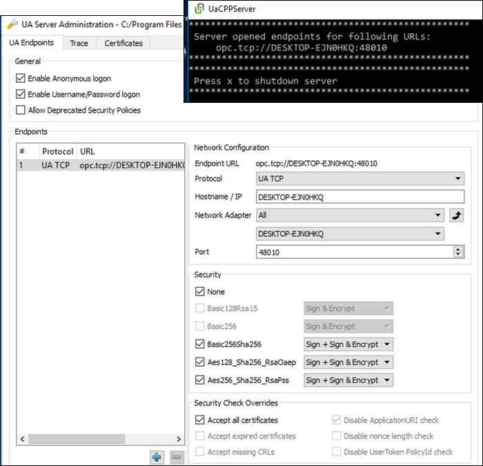
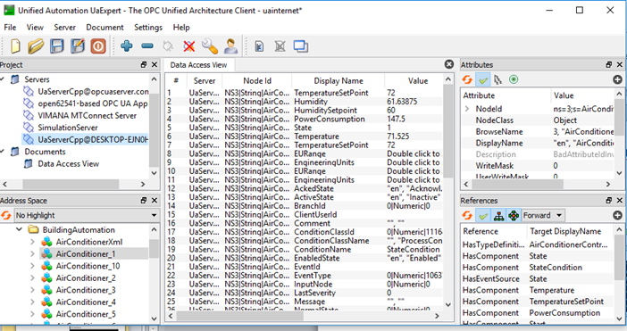

[До лабораторної роботи 6](lab6.md)

## Додаток 6.3. Налаштування та перевірка роботи серверів OPC UA

Як і для класичного OPC, для OPC UA є достатньо багато доступних безкоштовних тестових клієнтів і серверів. Враховуючи, що технологія є мульти-платформовою, ці утиліти доступні не тільки для Windows і не тільки для ПК. Наявність мобільних застосунків робить її ще більш привабливою. 

Серед безкоштовних "еталонних" серверів для Windows в лабораторній роботі використовується UaCPPServer (OPC UA C++ Demo Server) – тестовий OPC Unified Architecture Server для операційних систем Windows, в якому імітуються дані та інформаційна модель (Standard, DI та PLCopen). Тестовий сервер можна завантажити за цим посиаланням:  [OPC UA C++ Demo Server](https://www.unified-automation.com/downloads/opc-ua-servers.html) . Для завантаження потрібна реєстрація, але це безкоштовно. 

Після запуску ОРС-сервера створюється тільки одне консольне вікно, в якому виводиться URL кінцевої точки (рис. Д6.3.1). Для конфігурування використовується окрема програма (UA Server Administration), в якій також можна керувати сертифікатами. На рис. рис. Д6.3.1 видно, що стоїть опція “Accept all certificates”; це дозволяє підключатися кому завгодно з будь-яким сертифікатом, також дозволено підключатися без шифрування та автентифікації. Таке налаштування зручне при тестових підключеннях, але для реальних проектів **недопустиме з точки зору кібербезпеки**! У даній лабораторній роботі використовуватиметься простий механізм без застосування механізмів захисту.

 

*Рис. Д6.3.1.* Вікно сервера OPC UA C++ Demo (UaCPPServer) та утиліти його конфігурування 

У демо-сервері UaCPPServer прописані користувачі та паролі з різними ролями (табл. Д6.1.1)

*Таблиця Д6.1.1.* 

**Користувачі та їх паролі наперед визначені в** **UaCPPServer**

| **UserId** | **GroupIds** | **UserName** | **Password** |
| ---------- | ------------ | ------------ | ------------ |
| 0          | 0            | root         | secret       |
| 1          | 1            | joe          | god          |
| 2          | 0,1,2        | john         | master       |
| 3          | 1,2          | sue          | curly        |

 У якості клієнта під Windows зручною є безкоштовна утиліта UaExpert – це повнофункціональний клієнт OPC UA, який може працювати з декількома профілями та функціями OPC UA. Завантажити кліжнта можна за цим посиланням  [UaExpert](https://www.unified-automation.com/downloads/opc-ua-clients.html).

Інтерфейс містить перелік серверів проекту, де зазначено їх стан, навігатор адресного простору, вікно вибраних об’єктів, вікно атрибутів і посилань (*Рис. Д6.3.2*). Клієнт дає можливість змінювати значення Змінних.

 

*Рис. Д6.3.2*. Вікно UaExpert

 
