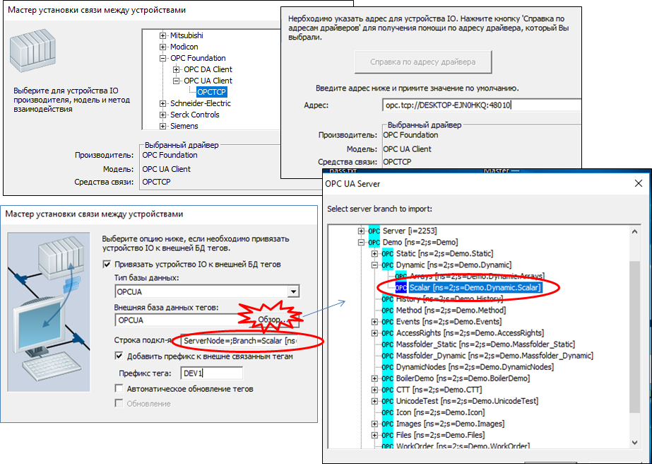
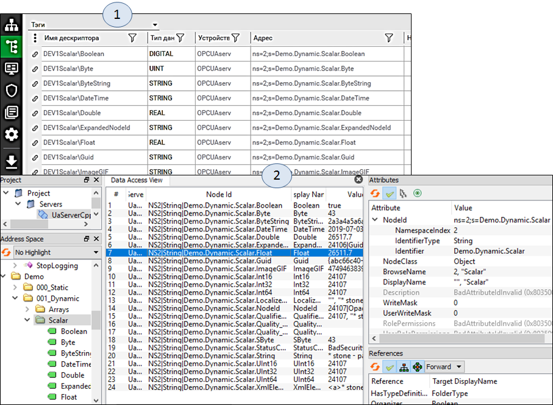

[До лабораторної роботи 6](lab6.md)

## Додаток 6.4. Налаштування Citect для роботи в якості OPC UA Client

У SCADA Citect, починаючи з версії 8.0 (2016), з’явився драйвер OPC UA Client. Слід зазначити що цей драйвер наразі підтримує тільки базові функції роботи з обміном даними OPC UA, та не підтримує усіх типів даних.

У даній лабораторній роботі розглянемо підключення драйвер OPC UA Client до OPC UA Server (UaCPPServer) простим шляхом, без використання сертифікатів. Але в [посібнику](https://www.fb.asu.in.ua/kniga-scada-hmi) також розглядається налаштування підключення з сертифікатом. 

Для налаштування підключення по OPC UA зручно скористатися помічником створення нового пристрою (рис. Д6.4.1). У вікно адреси треба вставити URL кінцевої точки, який можна скопіювати з вікна UACppServer.   

 

*рис. Д6.4.1.* Налаштування I/O Device в Citect за допомогою помічника 

Для автоматичного створення тегів можна використати прив’язку пристроїв до зовнішньої бази даних тегів. У вікні налаштувань вибирається потрібний рівень об’єкта, зміст якого прив’язується з новоствореними змінними. Результат створених змінних і зв’язків  показано на рис.Д6.4.2. Також там наведено вигляд простору імен із вибраного об’єкта “Scalar” у тестовому клієнті UAExpert.   

*рис.Д6.4.2*. Створені теги зі зв’язками до бази даних простору імен OPC UA Server та перегляд простору імен в UAExpert

