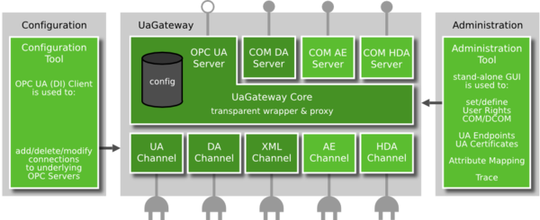
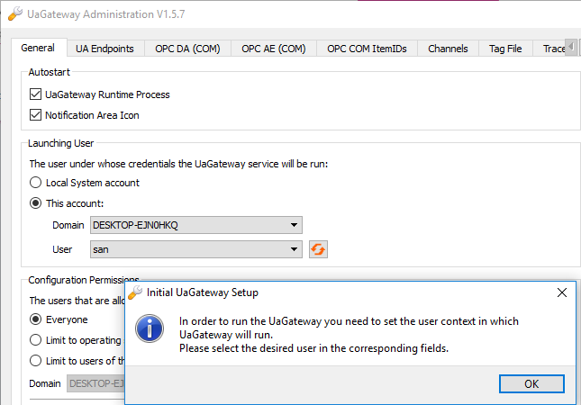
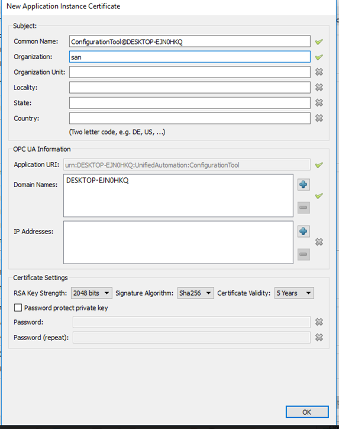
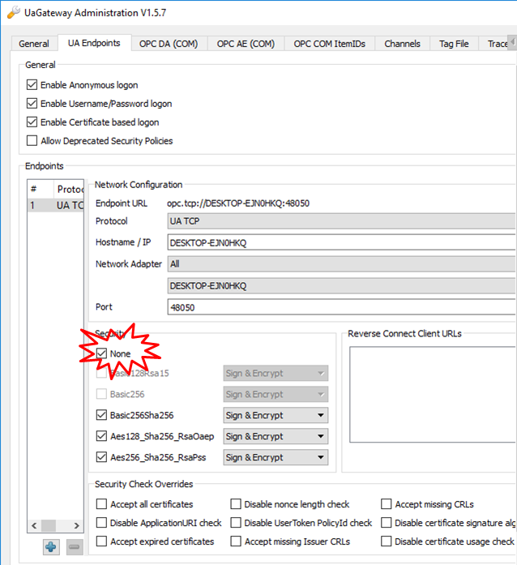
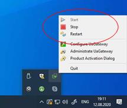
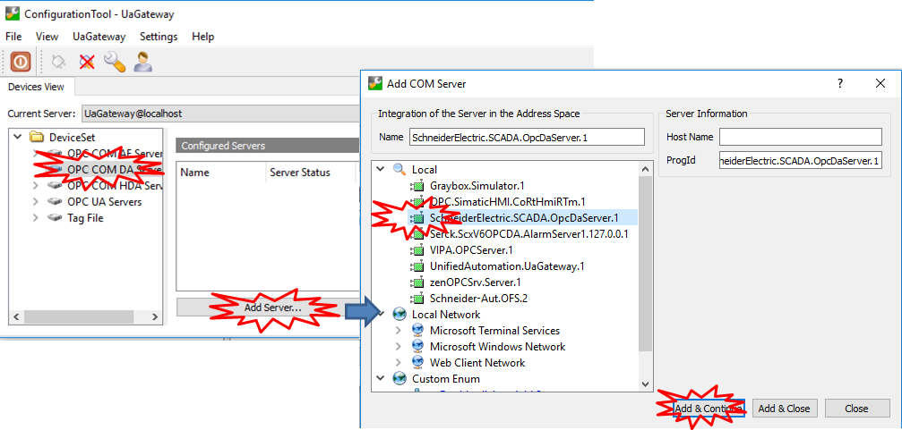
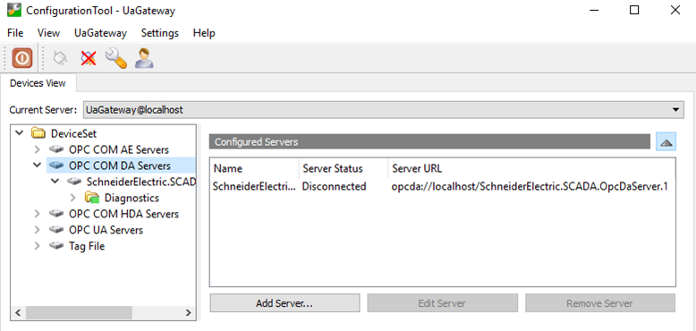
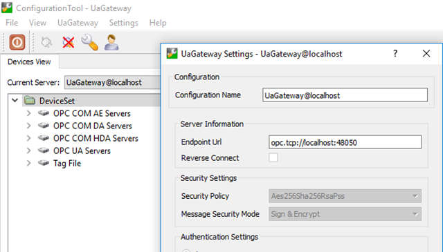
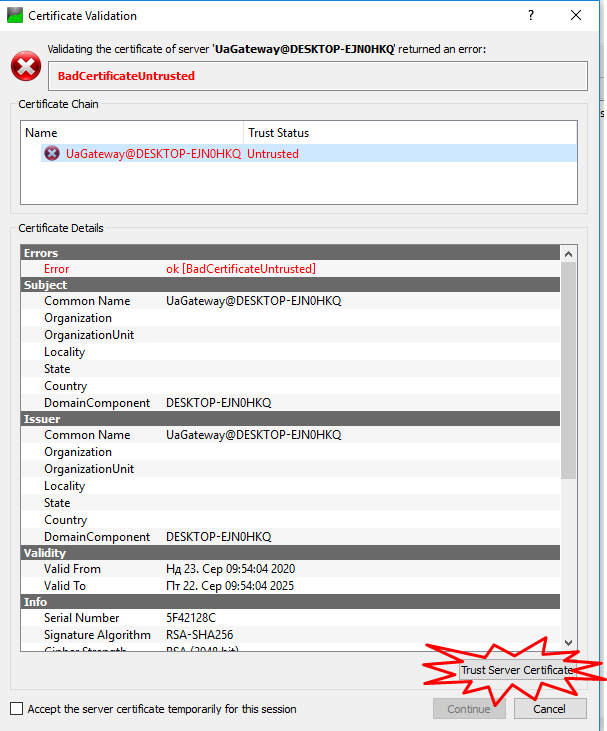
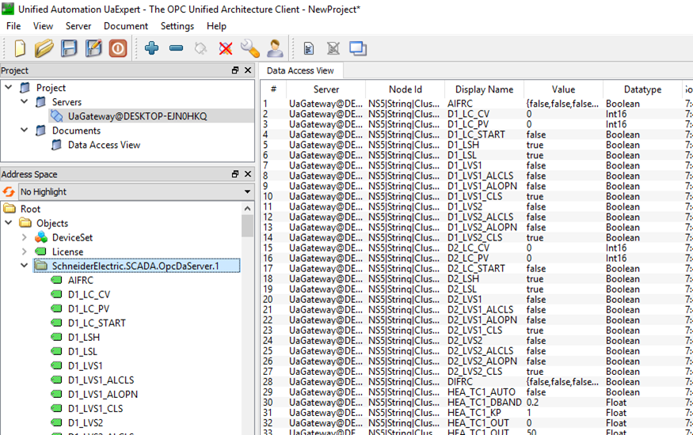

[До лабораторної роботи 6](lab6.md)

## Додаток 6.5. Встановлення та налаштування OPC DA - OPC UA шлюза

Для взаємодії різних типів OPC клієнтів та серверів існує велика кількість програмних шлюзів. Серед них   [UA Gateway](https://www.unified-automation.com/products/wrapper-and-proxy/uagateway.html).

Програмна архітектура OPC UA Gateway показана на рис.Д6.5.1. Він надає можливість взаємодіяти через різноманітні інтерфейси. З одного боку він представляє серверні інтерфейси у різноманітних варіантах OPC DA та OPC UA (верхня частина на рисунку), що дає змогу надати доступ як для класичних DA клієнтів так і для OPC UA. З іншого - він має драйвери для зв'язку з різноманітними варіантами OPC Серверів (нижня частина рисунку). Таким чином цей шлюз маже забезпечувати обмін як між класичними OPC DA Client та OPC UA Server, так і навпаки - між OPC UA Client та класичними OPC DA Серверами.      

рис.Д6.5.1 Програмна архітектура OPC UA Gateway.

OPC UA Gateway є платним ПЗ, але в тріал-режимі воно працює одну годину. Його можна завантажити за вказаним посиланням <https://www.unified-automation.com/products/wrapper-and-proxy/uagateway.html> після безкоштовної реєстрації. 

Після встановлення, OPC UA Gateway необхідно налаштувати. Для цього запускається програма-адміністратор, яку пізніше можна буде запустити з контекстного вікна відповідного індикатора з панелі Tray.  На загальній вкладці (див. рис Д6.5.2) необхідно вказати користувача під яким буде працювати шлюз. Можна вказати системний аккаунт, або задати конкретного користувача.    

рис.Д6.5.2. Вікно адміністратора UA Gateway

Після натискання Ок, система запропонує створити сертифікат для безпечних з'єднань.  В сертифікаті необхідно мінімум вказати назву організації (рис.Д6.5.3)

рис.Д6.5.3. Налаштування полів для створення сертифікату.

За замовченням в шлюзі деактивовано можливість незахищеного підключення. Для спрощення в лабораторній роботі використовується саме незахищене підключення, тому його треба активувати (рис.Д6.5.4) 

рис.Д6.5.4. Активація можливості незахищеного підключення 

Після адміністрування та створення сертифікату, шлюз необхідно запустити кнопкою `Start` через панель керування (рис.Д6.5.5)

​                    

рис.Д6.5.5. Панель керування.  

Для налаштування та перевірки підключень необхідно скористатися конфігуратором Configuration UAGateway, який також можна запустити з панелі керування (рис.Д6.5.5). У вікні конфігуратора  (рис.Д6.5.6) можна добавити необхідні Сервери OPC DA, на які відбувається шлюзування. 

рис.Д6.5.6. Налаштування підключення до OPC DA серверів  

Список налаштованих підключених серверів доступний в переліку (рис.Д6.5.7).

рис.Д6.5.7. Список налаштованих підключених серверів.

Для визначення точки підключення, можна зайти в меню `UAGateway -> Properties`, де вона вказана у відповідному полі Endpoint URL (рис.Д6.5.8).

рис.Д6.5.8. Визначення точки підключення

Перевірити підключення через OPC UA Gateway можна за допомогою OPC UA Expert. При першому підключенні необхідно буде добавити сертифікат в перелік довірених (рис.Д6.5.9) 

рис.Д6.5.9. Добавлення сертифікату в перелік довірених.

Для OPC UA клієнта сконфігуровані сервери будуть доступні в списку об'єктів (рис.Д6.5.10.)   

рис.Д6.5.10. Перегляд об'єктів підключених OPC DA Server до OPC UA Gateway для OPC UA клієнт. 
