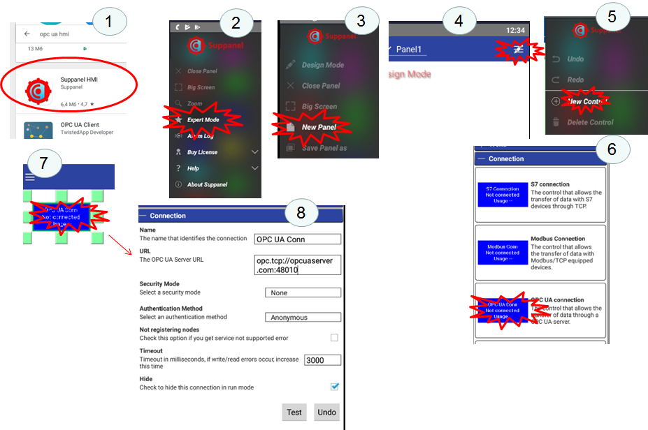
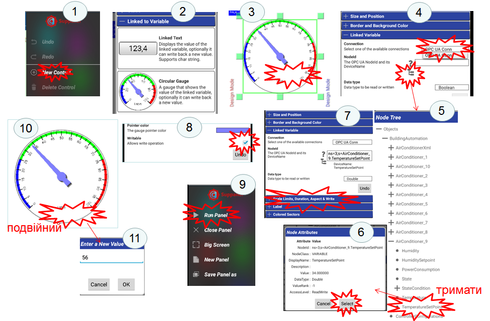

[До лабораторної роботи 6](lab6.md)

## Додаток 6.6. Розробка HMI для мобільних гаджетів та їх інтегрування через OPC

На сьогоднішній день більшість постачальників інструментів SCADA/HMI надають готове рішення для підключення мобільних пристроїв в якості віддалених засобів оповіщення, відображення та керування. Можна виділити такі підходи до побудови таких рішень:

1. Доступ до серверів через WEB-застосунки. Цей підхід практично нічим не відрізняється від звичайного WEB-доступу, за винятком таких особливостей:

- необхідно врахувати діагональ екрана мобільного пристрою;

- необхідно передбачити використання платформо-сумісних технологій; наприклад, WEB-застосунки з використанням технології ActiveX працюватимуть тільки на деяких типах пристроїв;

2. Доступ через відкриті технології, наприклад OPC UA, HTTP API, WEB SOCKET або протоколи IoT (MQTT, AMQP). У цьому випадку клієнтський застосунок на мобільному пристрої може бути стороннім по відношенню до серверного SCADA/HMI і розроблятися в окремому середовищі, можливо навіть на самому мобільному пристрої.  

3. Доступ через спеціалізовані клієнтські застосунки, розроблені саме для конкретної SCADA. У цьому випадку для розробника потрібно тільки налаштувати з’єднання; все інше є прозорим і прихованим від розробника.    

На сьогоднішній день є багато застосунків, так званих APPів для Android та iOS, що по суті є повноцінними HMI, які самі вміють збирати дані (використовуючи протоколи поверх стеку TCP/IP, Bluetooth), та реалізовувати інші функції (ЛМІ, тривоги, тренди і т.п). При цьому середовище розроблення також є застосунком для цих мобільних пристроїв. По суті, за невеликий проміжок часу можна розробити людино-машинний інтерфейс для невеликих задач, як обслуговування обладнання чи контроль певних виробничих операцій. Ці ж самі застосунки можна використовувати в якості клієнтів до SCADA/HMI, використовуючи стандартні протоколи промислових мереж (наприклад Modbus TCP/IP) або доступу до даних (OPC UA, JDBC тощо). 

У якості мобільного клієнта для цієї лабораторної роботи використовується застосунок Suppanel, який доступний для ОС Android за [цим посиланням](https://play.google.com/store/apps/details?id=com.suppanel.suppanel&hl=uk) . Приклад конфігурування від постачальника можна подивитися на [відео](https://youtu.be/35Tt8GHt58U). 

Зокрема встановлення застосунку, налаштування створення панелі та з'єднання зводиться до таких кроків (рис.Д6.6.1):  

1) Застосунок встановлюється з Play Market. 
2) Застосунок переводиться у режим Expert Mode 
3) Створюється нова панель. 
4) Панель переводиться в режим редагування 
5) Добавляється підключення Connection (5). 
6) Вибирається тип Connection OPC UA (6). 
7) Налаштовується вибраний Connection на потрібну  URL

Рис. Д6.6.1. Створення панелі та підключення.

Після створення панелі необхідно означити елементи керування. На рис.Д6.6.2 вказано послідовність створення елементу керування:

1) Створюється новий елемент.
2) Вибирається тип елементу і розміщується на панелі.
3) Відкриваються налаштування.
4) Вибирається підключення та відкривається браузер перегляду.
5) У браузері вибирається потрібна змінна.
6) Вибір підтверджується кнопкою Select
7) Вибираються налаштування вводу елементу.
8) Виставляється опція для можливості зміни змінної.
9) Переключити в режим виконання.
10) Змінювати значення з панелі.   

Рис. Д6.6.2. Створення елементу керування

