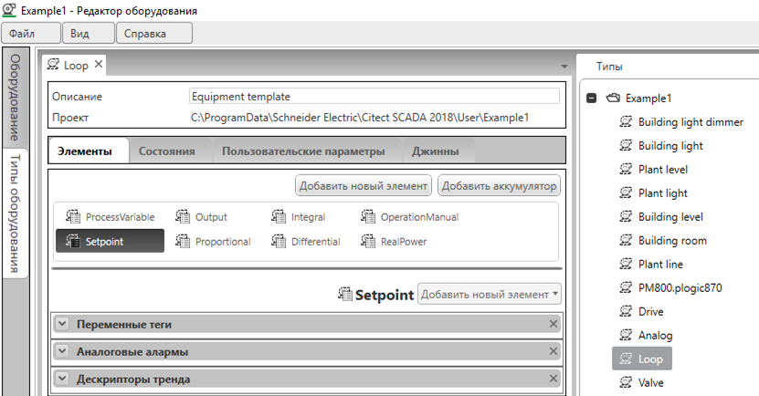

[До лабораторної роботи 6](lab6.md)

## Додаток 6.2. Ієрархія устатковання в Citect 

У SCADA Citect можна означити ієрархію устатковання (Equipment), за допомогою якого можна робити фільтрування тегів та повідомлень в переглядачах. Окрім того, за допомогою устатковання, створюючи та використовуючи їх типи можна генерувати теги.    

### Д.6.2.1. Використання редактору устатковання в якості фільтру для переглядачів

Кожен запис устатковання включає ім’я, яке має ієрархічну структуру, де ієрархічні рівні розділені крапкою. Так, “Loops.Level”, передбачає устатковання з ім'ям “Level”, що входить в устатковання верхнього рівня з ім'ям "Loops" (рис. Д.6.2.1). Ієрархію можна створювати шляхом добавлення подібних імен у редакторі моделі устатковання Citect Studio, але зручніше це робити через спеціальний редактор устатковання, який входить в середовище розроблення Citect. Цей редактор відображає модель у наглядному деревоподібному вигляді (див. рис.Д.6.2.1).

                               

*Рис. Д.6.2.1*. Зв'язок устатковання з тегами введення/виведення

Після створення екземпляра устатковання його можна вказати в налаштуваннях тегів, трендових тегів та тегів тривог. Наприклад, тег із назвою LOOP_1_PV слугує елементом ProcessVariable в устаткуванні "Loops.Level" (див. рис. Д.6.1). Тепер до тегу в будь-якому місці проекту можна звертатися двома способами: 

‒    через ім’я тегу “LOOP_1_PV”

‒    або через елемент устатковання “Loops.Level.ProcessVariable” 

Після встановлення середовище розроблення Citect за замовчуванням редактор графіки відображає вікно вибору тегу саме за ім'ям устатковання, а не ім'ям тегу. Це можна змінити в налаштуваннях параметрів Citect Studio.     

Окрім іншого формату посилань на теги, їх прив’язування в якості елементів устатковання дає такі можливості в середовищі виконання (рис. Д.6.2.2):

‒    на сторінці переглядача тегів фільтрувати список тегів відповідно до вибраного устатковання;

‒    на сторінках активних тривог, журналів подій (SOE) відображати записи тільки для елементів вибраного устатковання;

‒    відображати тренди для вибраного устатковання;

‒    використовувати навігатор устатковання.  

*Рис. Д.6.2.*2. Використання устатковання в якості фільтра в середовищі виконання 

Використання устатковання в якості фільтру значно спрощує вибір необхідних тривог, тегів у списку або трендів. У першому випадку оператор аналізує тільки ті тривоги та події із журналу, які стосуються конкретної частини процесу. При цьому він робить це звичайним вибором у навігаторі. Те саме стосується відображення трендів. Зрештою, можна зробити окремі вікна, що динамічно прив’язуються до конкретного устатковання і надають усю необхідну інформацію саме по ньому. Для цього в Citect є багато Cicode функцій, що надають можливість отримувати дані з тегів про устатковання, та навпаки, робити навігацію по устаткуванню, отримувати та змінювати його властивості. Властивість устатковання Page (рос. лок."Страница") дає можливість задати сторінку, яка буде асоціюватися з ним. Через цю властивість навігацію за сторінками можна зробити з використанням навігатора устатковання, що доступний поруч з меню в шаблонах стилю SxWStyle. 

Устатковання також може мати стани, за допомогою яких можна налаштувати керування ним через планувальник. Крім тегів, до устатковання можуть бути прив’язані акумулятори (Accumulator). Акумулятори можуть рахувати кількість запусків, інтегрувати певну величину та рахувати загальний час роботи.  При конфігуруванні в Citect інтерфейсу OPC ієрархія устатковання може бути використана для формування простору імен ItemID.

### Д.6.2.2. Використання редактору устатковання для генерування тегів

Окрім додаткових можливостей, які надає ієрархія устатковання SCADA Citect у середовищі виконання, розробник проекту може використовувати його як вихідну точку проектування. Механізм устатковання дає можливість зовсім по-іншому побудувати процес розроблення. Класичний механізм розроблення передбачає створення тегів (за необхідності – акумуляторів) через заповнення таблиць або полів у редакторі. Це має ряд недоліків, зокрема передбачає велику кількість рутинної роботи по заповненню. При необхідності зміни тегу, розробнику доводиться шукати його в таблиці тегів, де змінювати поля, потім у таблиці тегів тривог, а потім, можливо, ще в таблиці трендових тегів. У той же час, більшість об’єктів передбачають однотипні структури, які згуртовані навколо устатковання. Так, з насосом пов’язано кілька параметрів (частота обертів, операційний стан, температура підшипників і т. п.), тривог та трендів. Citect дає змогу процес створення розпочати з устатковання, яке автоматично створить пов’язані з ним теги. 

Спочатку визначається тип устатковання, в якому задаються правила створення устатковання та необхідних тегів, що з ним пов’язані. Тип устатковання описується файлом XML, але розробникові не обов’язково розуміти його внутрішню структуру. Типи можна створювати та редагувати через редактор типів устатковання, який представлений окремою вкладкою в редакторі устатковання (рис. Д.6.2.3).      

*Рис. Д.6.2.3.* Редактор типів устатковання

Основним змістом типу є елементи (Item), кожен з яких може асоціюватися з змінним тегом, тривоговим тегом або трендовим тегом. При створенні тегів він міг прив’язуватися до елемента існуючого устатковання. Тут же конфігурується зворотний напрямок – від створення  устатковання та його елемента до тегів. На рис. Д.6.2.4 до елемента Setpoint будуть прив’язані змінний тег, аналоговий аларм та трендовий тег. Екземпляри устатковання одного типу матимуть однаковий набір елементів, що створюватимуться за однаковими правилами.

На рис. Д.6.2.4 показано правила створення змінного тегу для елемента з ім'ям "Setpoint". У лівій частині вказуються імена властивостей тегу, а справа – правила створення їх значення. Текст, що взятий у фігурні дужки `{}`, передбачає вставку замінника, що означений у цьому тексті. Так,  `{equipment.tagprefix}_SP` вказує на те, що значенням даної властивості буде конкатенація (поєднання) значення властивості `Tag prefix` (рос. лок. "Префикс дескриптора") устатковання та `_SP`.   

 

  *Рис. Д.6.2.4* Налаштування правил створення тегів, асоційованих з елементом 

У якості полів устатковання можуть бути усі, що перелічені на рис. Д.6.2.4 (показані через контекстне меню), та додаткові користувацькі. Таким чином, при створенні нового устатковання в редакторі вказується його тип, ім’я, заповнюються його властивості, після чого необхідно виконати команду оновлення устатковання. У результаті оновлення створиться не тільки устатковання, а й усі необхідні теги. При зміні типу устатковання (видалення, зміна, добавлення елементів) процедура повторюється. При цьому всі створені теги не доступні для редагування з редактора тегів, вони оновлюються тільки через зміну устатковання та його типу. 

