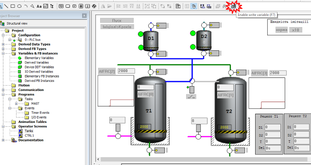
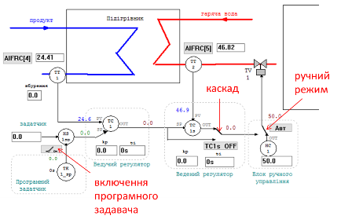
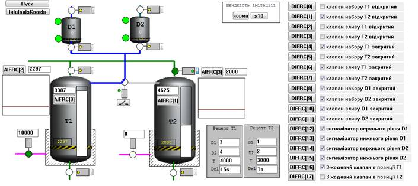
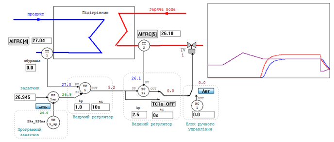
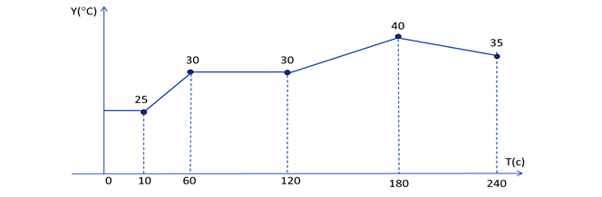

[Людино-машинні інтерфейси](https://pupenasan.github.io/hmi/)  Автор і лектор: Олександр Пупена доц. кафедри [АКСТУ НУХТ](http://www.iasu-nuft.pp.ua/) 

# Опис завдання для виконання на лабораторних роботах з дисципліни людино-машинні інтерфейси для Citect

**Увага!** Для виконання лабораторних робіт по Citect необхідне встановлене ПЗ [Unity PRO](https://schneider-electric.app.box.com/s/lgd27nur1rin1hs4x822g8lr6tlr2y82/folder/50504496333) або [Control Expert](https://schneider-electric.app.box.com/s/lgd27nur1rin1hs4x822g8lr6tlr2y82/folder/101662336138). За наведеними посиланнями знаходяться пробні версії з ключом активації на 60 діб. Після завершення терміну дане ПЗ більше не буде запускатися навіть після перевстановлення. Тому рекомендується встановлювати його на віртуальну машину. Мінімальна версія потрібного [UnityPro_XL_V7.0](https://schneider-electric.app.box.com/s/lgd27nur1rin1hs4x822g8lr6tlr2y82/folder/50505220340) у цьому документі використовується [Unity PRO 13.1](https://schneider-electric.app.box.com/s/lgd27nur1rin1hs4x822g8lr6tlr2y82/folder/71210166883)

## 1. Короткий опис структури системи керування з віртуальним контролером та об’єктом 

Для швидшої розробки навчального проекту і кращого розуміння середовищ розробки та виконання SCADA/HMI пропонується використовувати заздалегідь підготовлений проект для ПЛК, виконаний в середовищі UNITY PRO. Проект для ПЛК включає в себе:

1. імітацію об’єкта керування, який складається з 2-х відділень підприємства: 
   - установка приготування продукту в ємностях (надалі **установка приготування**) 
   - підігрівач продукту (надалі **установка підігріву**);

2. програму керування процесами відділень;

3. операторські екрани UNITY PRO для відображення/керування відділеннями

Імітація об’єкту керування в проекті зроблена на мовах програмування МЕК 61131 і виконується в імітаторі ПЛК а реальному часі разом з програмою керування. Усі секції програм проекту є захищеними від запису, але їх можна переглянути*.* 

*З точки зору автора проекту, програми мають певні стилістичні вади, однак можуть бути використані в якості прикладів для створення своїх власних навчальних проектів для лабораторних робіт, або курсового проекту.*

 Програма керування розроблена з урахуванням наступних можливостей:

- керування заданими значеннями та уставками в автоматичному режимі;

- керування дискретними виконавчими механізмами в ручному (дистанційному) режимі;

- керування контурами регулювання підігрівача в ручному режимі;

- форсування значень вхідних змінних з імітаційного об’єкту керування незалежно від імітованого входу для спрощення відлагодження людино-машинного інтерфейсу

## 2. Порядок створення, завантаження та запуску на виконання проекту в імітаторі ПЛК 

Для підготовки імітатора ПЛК з проектом зробіть наступні дії:

- [ ] Завантажте необхідний експортний варіант проекту файл [HMI2021.xef](https://drive.google.com/file/d/1EDYblD3F7ldHYkCWDeIsuJTjxzrs3lYa/view?usp=sharing) . Файл ".xef" зберігає експортний формат проекту, що сумісний з більшістю версій Unity PRO.  

- [ ] Запустіть на виконання середовище UNITY PRO. 

- [ ] Використовуючи меню `File->Open` та вказавши формат `Unity PRO Application Exchange`, відкрийте проект "HMI2021.xef". 

- [ ] Перейдіть в режим імітації ПЛК: `PLC -> Simulation Mode`

- [ ] Зробіть компіляцію проекту `Build -> Rebuild All Project`.

- [ ] Збережіть проект у форматі STU на диску для наступного його використання на інших заняттях.

- [ ] З'єднайтеся з імітатором ПЛК: `PLC->Connect`. У результаті повинен запуститися імітатор ПЛК.

- [ ] Завантажте проект в імітатор ПЛК: `PLC->Transfer Project to PLC`

- [ ] Запустіть на виконання програму в імітаторі: `PLC->RUN`. 

## 3. Ознайомлення з роботою системи керування установкою приготування продукту

Опис установки наведений нижче. Для ознайомлення з роботою системи керування установкою зробіть наступні дії:

- [ ] Перейдіть в розділ `Operator Screens->Tanks`

- [ ] Натисніть на вільному місці екрану,  викличте в меню в меню `Services->Enable write variable `. 

- [ ] Не запускаючи програму (без натискання "Пуск") перевірте роботу усіх клапанів:
  - запірних, натискаючи на кнопку біля клапану  
  - регулюючих (подача теплоагента), вказуючи в поле для вводу біля клапану ступінь відкриття у % і натискаючи `Enter`

- [ ] Подивіться на реакцію датчиків положення та імітацію роботи об’єкту керування. Зверніть увагу на те, що деякі клапани мають два датчика положення, а деякі тільки один. 

- [ ] Натисніть кнопку "Пуск". Прослідкуйте за роботою системи. Для прискорення імітації на етапі     нагрівання використайте команду `Швидкість імітації-x10`. 

- [ ] Після закінчення процедури - змініть якісь уставки рецепту і запустіть систему на виконання ще раз.

- [ ] Після закінчення процедури зробіть форсування датчика `клапан набору Т1 закритий` вмикаючи `DIFRC[4]` 
- [ ] Змініть значення форсованої змінної в `0`; на клапані набору повинно зникнути зображення датчика кінцевого положення і з'явитися напис `Не закрився`, так як не спрацював датчик положення `закрито`; зверніть увагу, що між відсутністю сигналу та появою повідомлення проходить певний час, що     передбачає певне запізнення спрацювання та дребезг контакту;

- [ ] За допомогою форсування перевірте появу аварійного повідомлення `Не відкрився` на клапані зливу з танку Т1.

- [ ] Зніміть усі форсування.    

## 4. Ознайомлення з роботою системи керування установкою підігріву

Опис установки наведений нижче. Для ознайомлення з роботою системи керування установкою зробіть наступні дії:

- [ ] Перейдіть в розділ `Operator Screens->CTRL1`
- [ ] Натисніть на вільному місці екрану,  викличте в меню в меню `Services->Enable write variable `. 
- [ ] У ручному режимі (для зміни режиму використовується кнопка `АВТ`) відкрийте виконавчий механізм на 50%. Дочекайтесь закінчення перехідного процесу. 

- [ ] У полі `Задатчик` задайте завдання рівним 40°С, переключіть контур в автоматичний режим каскадного управління (Включена кнопка `Авт`  та відключена кнопка `TC1s_OFF`). Дочекайтеся коли перехідний процес зупиниться.

- [ ] Включіть програмний задатчик. При програмному управлінні змінюйте збурення на ±2°С. Протягом кількох хвилин спостерігайте як працює задатчик та регулятор на графіку.

- [ ] Зробіть форсування значень датчиків `TT1` (кнопка `AIFRC[4]`) та `TT2`  (`AIFRC[5]`), змініть їх значення за допомогою поля для вводу.

- [ ] Відключіть форсування     

## 5. Опис роботи програми керування установкою приготування продуктів 

У даному розділі описується об’єкт а також призначення та функції керування установкою приготування продуктів. 

### Опис об’єкту 

Технологічна установка приготування складається з наступних елементів (рис.3):

1)танки Т1 та Т2, в яких готовляться продукти за різними рецептами; танки обв’язані наступними засобами КВПіА:

- запірні клапани набору та зливу, кожний з датчиками кінцевого положення "закритий" та "відкритий";

- регулюючий клапан (0-100%) подачі теплоагента у теплообмінний кожух танку (далі по тексту клапан нагрівання);

- датчик рівня (0-100%) в танку;

- датчик температури в танку (0-100°С); 

2)дозатори (мірні ємності) D1 та D2, які забезпечують подачу дози компоненту; дозатори обв’язані наступними засобами КВПіА:

- сигналізатор нижнього і верхнього рівнів;

- запірні клапани набору та зливу, кожний з датчиками кінцевого положення "закритий";

3)3-ходовий клапан перемикання трубопроводу подачі з дозаторів на танки T1 та T2; в нормальному стані положення "на Т1"; має датчики кінцевого положення "Т1" та "Т2".

Рис.3 Операторський екран Unity PRO для установки приготування

### Опис функцій керування установкою   

1) Виконання задачі приготування відповідно до наведеного нижче опису;

2) Виконання задач сигналізації відмови закриття/відкриття клапанів; 

3) У будь який момент часу система має можливість переходу в початковий стан (крок) за допомогою команди "Ініціалізація кроків". 

4) Для форсування значення дискретних датчиків положення (стан клапанів та сигналізаторів рівнів) використовуються кнопки з написами DIFRC[0]… DIFRC[17]; у положенні форсування значення змінних не береться з датчиків імітованого об’єкту, а змінюється зі SCADA/HMI або операторського екрану Unity PRO.

5) Для форсування значення аналогових датчиків, використовуються кнопки AIFRC[0]… AIFRC[3]; у положенні форсування значення змінних не береться з датчиків імітованого об’єкту, а змінюється зі SCADA/HMI або операторського екрану Unity PRO:

- AIFRC[0] – форсування значення рівня в танку Т1;

- AIFRC[1] – форсування значення рівня в танку Т2;

- AIFRC[2] – форсування значення температури в танку Т1;

- AIFRC[3] – форсування значення температури в танку Т2;

### Опис алгоритму задач керування установкою 

Керування дозаторами та танками розв’язане одне від одного (але координоване), оскільки дозатори можуть бути використані в інших процесах. Дозатори в стані очікування завжди наповнені. 

Керування процесом приготування відбувається за таким алгоритмом:

1)У початковому стані (старті ПЛК) клапани набору та зливу танків Т1 та Т2 закриваються. Закритість клапанів контролюється кінцевими датчиками положення. Після цього система керування установкою приготування переходить в стан очікування.

2)Оператор повинен задати рецепт продукту для приготування в Т1 та Т2. Рецепт включає наступні поля:

- кількість доз компоненту з D1;

- кількість доз компоненту з D2;

- температуру попереднього нагрівання;

- час витримки;

3)Після натискання оператором кнопки "Пуск" відкривається клапан набору танку Т1.

4)Після досягнення рівня 50% паралельно з набором включається дозування компонентів D1 та D2 відповідно до рецепту. 

5)При досягненні рівня 80%, відкривається клапан набору танку Т2.

6)Коли клапан набору Т2 повністю відкрився (по датчику положення "відкритий"), клапан набору Т1 закривається, і паралельно з приготуванням продукту в Т1 йде наповнення і приготування продукту в танку Т2.

7)При досягненні рівня 50% в Т2 паралельно з набором включається дозування компонентів D1 та D2 відповідно до рецепту. Якщо дозатор в цей час використовується при дозуванні Т1, необхідно дочекатися закінчення роботи дозаторів.

8)При досягненні рівня 80%, закривається клапан набору танку Т2.

9)Після закриття клапану набору в танку Т1 (в наступних пунктах для Т2 аналогічно) і закінченні дозування, відкривається повністю клапан подачі теплоагента; 

10)Рідина в танках нагрівається до вказаного в рецепті значення, після чого клапан залишається відкритий на 10% протягом вказаного в рецепті часу;

11)Після витримки відкривається клапан зливу і рідина зливається з танку;

12)Через 5с після досягнення рівня менше ніж 1% клапан зливу закривається;

13)Коли обидва танки Т1 та Т2 порожні, система переходить в початковий стан.

## Опис роботи програми керування установкою підігріву 

У даному розділі описується об’єкт а також призначення та функції керування установкою підігріву. 

### Опис об’єкту 

Технологічна установка являє собою теплообмінник для підігріву рідкого продукту (рис.4) за допомогою гарячої води. Температура продукту на виході вимірюється датчиком температури TT1 (0-100 °C, вхід ПЛК %IW0.4.0, масштабована змінна - в HEA_TT1) який вмонтований на трубопроводі на відстані кількох метрів від підігрівника, а регулюється витратою гарячої води регулюючим клапаном TV1 на виході підігрівника (0-100% ХРО, вихід %QW0.4.4, внутрішня масштабована змінна в HEA_TV1). Додатково вимірюється також температура води в трубопроводі безпосередньо на виході підігрівника за допомогою датчика ТТ2 (0-100 °C, вхід ПЛК %IW0.4.1, масштабована змінна - в HEA_TT2). Інерційність об’єкту по каналу ТТ2 менша ніж по ТТ1. 

Рис.4 Операторський екран Unity PRO з об’єктом керування теплообмінником

### Опис функцій керування установкою 

Система керування забезпечує регулювання температури ТТ1 з підтримкою наступних функцій:

1)стабілізація температури на виході підігрівника на заданому оператором або програмним задатчиком значені, з використанням каскадного регулятору, де:

- ведучий регулятор (ПІ режим) стабілізує температуру ТТ1;

- ведений регулятор (П режим) служить для швидкої реакції контуру регулювання на зміну малоінерційного ТТ2;

2)можливість настройки коефіцієнтів Kp та Ti з операторського екрану;

3)можливість ручного управління виконавчим механізмом TV1 з операторського екрану при переключенні в ручний режим з забезпеченням безударності переходу ;

4)можливість формування завдання програмним задатчиком в залежності від часу по наступній залежності (рис.5):

рис.5. Залежність завдання температури від часу.

5)можливість зміни заданих значень в точках графіку (рис.5) з засобів SCADA/HMI;

6)можливість переключення з ручного завдання на програмне керування та навпаки в будь який момент часу з забезпеченням безударності переходу; 

7)можливість виключення веденого регулятору з каскаду (з забезпеченням безударності переходу), тобто переводу контуру в режим прямого ПІ-регулювання по температурі ТТ1;

8)при ручному керуванні виконавчим механізмом ведучий регулятор фіксує своє вихідне значення в останньому положенні.

9)можливість форсування значення датчика TT1 для зміни з операторського екрану або SCADA/HMI командою кнопки з написом AIFRC[4]; в режимі форсування (натиснутої кнопки), значення змінної ТТ1 змінюється з поля для введення; 

10)можливість форсування значення датчика TT2 для зміни з операторського екрану або SCADA/HMI командою кнопки з написом AIFRC[5]; в режимі форсування (натиснутої кнопки), значення змінної ТТ2 змінюється з поля для введення;

 

## 6. Опис змінних ПЛК

Для обміну даними між ПЛК та SCADA/HMI передбачені дискретні, аналогові змінні та структурні змінні, що прив’язані (локалізовані) до адрес %MW та %M. Змінні займають різну кількість адрес в пам'яті ПЛК, що треба передбачати в SCADA/HMI:

- типу INT, UINT займають одну комірку в області пам'яті %MW;

- типу DINT,UDINT, REAL займають дві комірки в області пам'яті %MW;

- типу EBOOL займають одну комірку в області пам'яті %M;

- типу EBOOL, BOOL займають один байт в області пам'яті %MW (це треба враховувати при використанні дискретних полів в структурних змінних);

### Перелік аналогових (числових) змінних, що доступні в ПЛК зі SCADA/HMI

Таблиця 1. Перелік аналогових (числових) змінних, що доступні в ПЛК зі SCADA/HMI

| **Назва в ПЛК** | **Адреса** | **Тип в ПЛК**       | **Опис**                               | **Межі PLC** | **Межі реальні** | **Примітка**                     |
| --------------- | ---------- | ------------------- | -------------------------------------- | ------------ | ---------------- | -------------------------------- |
| T1_LT1          | %MW100     | INT                 | рівень T1                              | 0-10000      | 0-100 %          |                                  |
| T2_LT1          | %MW101     | INT                 | рівень T2                              | 0-10000      | 0-100 %          |                                  |
| T1_TT1          | %MW102     | INT                 | температура в T1                       | 0-10000      | 0-100°С          |                                  |
| T2_TT1          | %MW103     | INT                 | температура в T2                       | 0-10000      | 0-100°С          |                                  |
| T1_TV1          | %MW104     | INT                 | клапан нагрівання T1                   | 0-10000      | 0-100 %          |                                  |
| T2_TV1          | %MW105     | INT                 | клапан нагрівання T2                   | 0-10000      | 0-100 %          |                                  |
| HEA_TC1_OUT     | %MW200     | REAL                | Вихід ведучого регулятору              | 0-100 %      | 0-100 %          |                                  |
| HEA_TC1_SP      | %MW202     | REAL                | Уставка для ведучого регулятору        | 20-80°С      | 20-80°С          |                                  |
| HEA_TC1s_OUT    | %MW204     | REAL                | Вихід веденого регулятору              | 0-100°С      | 0-100°С          |                                  |
| HEA_TK1_SP      | %MW206     | REAL                | Вихід завдання з програмного задатчика | 0-100°С      | 0-100°С          |                                  |
| HEA_TT1         | %MW208     | REAL                | Т продукту на виході підігрівача       | 0-100°С      | 0-100°С          |                                  |
| HEA_TT2         | %MW210     | REAL                | Т гарячої води на виході підігрівача   | 0-100°С      | 0-100°С          |                                  |
| HEA_TV1         | %MW212     | REAL                | Клапан подачі гарячої води             | 0-100 %      | 0-100 %          |                                  |
| smHEA_Z1        | %MW214     | REAL                | імітація збурення                      | 0-100°С      | 0-100°С          |                                  |
| HEA_TT1_SP      | %MW220     | ARRAY[0..5] OF REAL | завдання для програмного задатчика     | 20-80°С      | 20-80°С          | вказана початкова  адреса масиву |

 

### Перелік дискретних (типу так/ні) змінних що доступні в ПЛК зі SCADA/HMI

Таблиця 2. Перелік дискретних (типу так/ні) змінних що доступні в ПЛК зі SCADA/HMI

| **Назва в ПЛК** | **Адреса** | **Тип в ПЛК**         | **Опис**                                                     | **Примітка**                                                 |
| --------------- | ---------- | --------------------- | ------------------------------------------------------------ | ------------------------------------------------------------ |
| D1_LSH          | %M0        | EBOOL                 | сигналізатор верхнього рівня D1                              | 1=спраюцвав                                                  |
| D1_LSL          | %M1        | EBOOL                 | сигналізатор нижнього рівня D1                               | 1=спраюцвав                                                  |
| D2_LSH          | %M2        | EBOOL                 | сигналізатор верхнього рівня D2                              | 1=спраюцвав                                                  |
| D2_LSL          | %M3        | EBOOL                 | сигналізатор нижнього рівня D2                               | 1=спраюцвав                                                  |
| D1_LVS1_CLS     | %M4        | EBOOL                 | клапан зливу D1 закритий                                     | 1=закритий                                                   |
| D1_LVS2_CLS     | %M5        | EBOOL                 | клапан набору D1 закритий                                    | 1=закритий                                                   |
| D2_LVS1_CLS     | %M6        | EBOOL                 | клапан зливу D2 закритий                                     | 1=закритий                                                   |
| D2_LVS2_CLS     | %M7        | EBOOL                 | клапан набору D2 закритий                                    | 1=закритий                                                   |
| T1_LVS1_CLS     | %M8        | EBOOL                 | клапан зливу Т1 закритий                                     | 1=закритий                                                   |
| T1_LVS2_CLS     | %M9        | EBOOL                 | клапан набору Т1 закритий                                    | 1=закритий                                                   |
| T2_LVS1_CLS     | %M10       | EBOOL                 | клапан зливу T2 закритий                                     | 1=закритий                                                   |
| T2_LVS2_CLS     | %M11       | EBOOL                 | клапан набору Т2 закритий                                    | 1=закритий                                                   |
| T2_LVS2_OPN     | %M12       | EBOOL                 | клапан набору Т2 відкритий                                   | 1=відкритий                                                  |
| T_LVS3_T1OPN    | %M13       | EBOOL                 | 3-ходовий клапан в позиції T1                                |                                                              |
| T_LVS3_T2OPN    | %M14       | EBOOL                 | 3-ходовий клапан в позиції T2                                |                                                              |
| T_SB1           | %M15       | EBOOL                 | запуск процесу приготування                                  | 1=команда на запуск                                          |
| T1_LVS1_OPN     | %m16       | EBOOL                 | клапан зливу Т1 відкритий                                    | 1=відкритий                                                  |
| T1_LVS2_OPN     | %M17       | EBOOL                 | клапан набору Т1 відкритий                                   | 1=відкритий                                                  |
| T2_LVS1_OPN     | %M18       | EBOOL                 | клапан зливу T2 відкритий                                    | 1=відкритий                                                  |
| D1_LVS1_ALCLS   | %m19       | EBOOL                 | клапан зливу D1 не закрився                                  | 1=тривога активна                                            |
| D1_LVS1_ALOPN   | %M20       | EBOOL                 | клапан зливу D1 не відкрився                                 | 1=тривога активна                                            |
| D1_LVS2_ALCLS   | %M21       | EBOOL                 | клапан набору D1 не закрився                                 | 1=тривога активна                                            |
| D1_LVS2_ALOPN   | %M22       | EBOOL                 | клапан набору D1 не відкрився                                | 1=тривога активна                                            |
| D2_LVS1_ALCLS   | %M23       | EBOOL                 | клапан зливу D2 не закрився                                  | 1=тривога активна                                            |
| D2_LVS1_ALOPN   | %M24       | EBOOL                 | клапан зливу D2 не відкрився                                 | 1=тривога активна                                            |
| D2_LVS2_ALCLS   | %M25       | EBOOL                 | клапан набору D2 не закрився                                 | 1=тривога активна                                            |
| D2_LVS2_ALOPN   | %M26       | EBOOL                 | клапан набору D2 не відкрився                                | 1=тривога активна                                            |
| T1_LVS1_ALCLS   | %M27       | EBOOL                 | клапан зливу T1 не закрився                                  | 1=тривога активна                                            |
| T1_LVS1_ALOPN   | %M28       | EBOOL                 | клапан зливу T1 не відкрився                                 | 1=тривога активна                                            |
| T1_LVS2_ALCLS   | %M29       | EBOOL                 | клапан набору T1 не закрився                                 | 1=тривога активна                                            |
| T1_LVS2_ALOPN   | %M30       | EBOOL                 | клапан набору T1 не відкрився                                | 1=тривога активна                                            |
| T2_LVS1_ALCLS   | %M31       | EBOOL                 | клапан зливу T2 не закрився                                  | 1=тривога активна                                            |
| T2_LVS1_ALOPN   | %M32       | EBOOL                 | клапан зливу T2 не відкрився                                 | 1=тривога активна                                            |
| T2_LVS2_ALCLS   | %M33       | EBOOL                 | клапан набору T2 не закрився                                 | 1=тривога активна                                            |
| T2_LVS2_ALOPN   | %M34       | EBOOL                 | клапан набору T2 не відкрився                                | 1=тривога активна                                            |
| T1_LVS1         | %M100      | EBOOL                 | клапан зливу Т1                                              | 1=команда відкриття                                          |
| T1_LVS2         | %M101      | EBOOL                 | клапан набору Т1                                             | 1=команда відкриття                                          |
| T2_LVS1         | %M102      | EBOOL                 | клапан зливу T2                                              | 1=команда відкриття                                          |
| T2_LVS2         | %M103      | EBOOL                 | клапан набору Т2                                             | 1=команда відкриття                                          |
| T_LVS3          | %M104      | EBOOL                 | 3-ходовий клапан                                             | 1=команда переключення на T1                                 |
| D1_LVS1         | %M105      | EBOOL                 | клапан зливу D1                                              | 1=команда відкриття                                          |
| D1_LVS2         | %M106      | EBOOL                 | клапан набору D1                                             | 1=команда відкриття                                          |
| D2_LVS1         | %M107      | EBOOL                 | клапан зливу D2                                              | 1=команда відкриття                                          |
| D2_LVS2         | %M108      | EBOOL                 | клапан набору D2                                             | 1=команда відкриття                                          |
| HEA_TC1_AUTO    | %M109      | EBOOL                 | 1 - включити автоматичний режим роботи контуру               |                                                              |
| HEA_TC1s_OFF    | %M110      | EBOOL                 | 1 - відключити ведений регулятор                             |                                                              |
| HEA_TK1_ON      | %M111      | EBOOL                 | 1 - включити програмний задатчик                             |                                                              |
| InitSFC         | %M112      | EBOOL                 | ініціалізація програми SFC                                   | скидає програму SFC на початковий крок                       |
| smInit          | %M113      | EBOOL                 | Ініціалізація імітаційної моделі                             | службовий, =1 – ініціалізація, скидається в 0 самостійно     |
| DIFRC           | %M120      | ARRAY[0..32] OF EBOOL | команди форсування дискр входів: 1 - форсований, 0 - датчик  | відповідність до каналу див. в операторському екрані Unity PRO; вказана початкова адреса масиву |
| AIFRC           | %M160      | ARRAY[0..32] OF EBOOL | команди форсування аналог входів: 1 - форсований, 0 - датчик | відповідність до каналу див. в операторському екрані Unity PRO; вказана початкова адреса масиву |

 

### Перелік структурних змінних що доступні в ПЛК зі SCADA/HMI

Поля структурних змінних в ПЛК прив’язані до адрес, починаючи з вказаної в структурі. Для спрощення в таблицях 3-6 вказані адреси потрібних полів для SCADA/HMI. У деяких SCADA/HMI програмах є можливість означення структур, після чого достатньо при створенні структурної змінної вказати тільки початкову адресу. За замовченням у проекті передбачається, що усі змінні будуть простими (не структурними), тобто кожне поле структури буде окремою змінною (тегом).

Слід звернути увагу на те, що тип TIME в UNITY PRO (відповідно до IEC 61131) займає два слова (тобто дві комірки в області %MW) і містить значення в мілісекундах. Якщо SCADA/HMI не має типу TIME слід використовувати інший тип відповідно до UDINT в UNITY PRO а також зробити відповідні налаштування масштабування.     

Таблиця 3. Поля структури Dozator1

| **Назва змінної/поля в  ПЛК** | **Адреса** | **Тип в ПЛК** | **Межі PLC** | **Межі реальні** | **Опис**                  |
| ----------------------------- | ---------- | ------------- | ------------ | ---------------- | ------------------------- |
| **Dozator1**                  |            | Dozator       |              |                  | управління дозуванням  D1 |
| Dozator1.CV                   | %MW110     | INT           | 0-100        | 0-100            | плинна кількість доз      |
| Dozator1.PV                   | %MW111     | INT           | 0-100        | 0-100            | задана кількість доз      |
| Dozator1.START                | %MW112     | BOOL          |              |                  | запуск дозування          |

 

Таблиця 4. Поля структури Dozator2

| **Назва змінної/поля в  ПЛК** | **Адреса** | **Тип в ПЛК** | **Межі PLC** | **Межі реальні** | **Опис**                  |
| ----------------------------- | ---------- | ------------- | ------------ | ---------------- | ------------------------- |
| **Dozator2**                  |            | Dozator       |              |                  | управління дозуванням  D2 |
| Dozator2.CV                   | %MW114     | INT           | 0-100        | 0-100            | плинна кількість доз      |
| Dozator2.PV                   | %MW115     | INT           | 0-100        | 0-100            | задана кількість доз      |
| Dozator2.START                | %MW116     | BOOL          |              |                  | запуск дозування          |

 

Таблиця 5. Поля структури TC1_PARA

| **Назва змінної/поля в  ПЛК** | **Адреса** | **Тип в ПЛК** | **Межі PLC** | **Межі реальні** | **Опис**                                                     |
| ----------------------------- | ---------- | ------------- | ------------ | ---------------- | ------------------------------------------------------------ |
| **TC1_PARA**                  |            | Para_PI_B     |              |                  | Параметри ведучого  регулятору                               |
| TC1_PARA.pv_inf               | %MW301     | REAL          | 0-100%       | 0-100%           | обмеження по мінімуму  вхідної величини завдання             |
| TC1_PARA.pv_sup               | %MW303     | REAL          | 0-100%       | 0-100%           | обмеження по максимуму  вхідної величини завдання            |
| TC1_PARA.out_inf              | %MW305     | REAL          | 0-100%       | 0-100%           | обмеження по мінімуму  вихідної величини блоку               |
| TC1_PARA.out_sup              | %MW307     | REAL          | 0-100%       | 0-100%           | обмеження по максимуму  вихідної величини блоку              |
| TC1_PARA.kp                   | %MW310     | REAL          | 0-100        | 0-100            | Коефіцієнт пропорційності                                    |
| TC1_PARA.ti                   | %MW312     | TIME          | T#0s – T#2h  | 0 – 3600 с       | Час інтегрування                                             |
| TC1_PARA.dband                | %MW314     | REAL          | 0-100%       | 0-100%           | Зона нечутливості                                            |
| TC1_PARA.outbias              | %MW316     | REAL          | 0-100%       | 0-100%           | зміщення виходу регулятора  в П-режимі функціонування (при ti=0s) |

 

Таблиця 6. Поля структури TC1s_PARA

| **Назва змінної/поля в  ПЛК** | **Адреса** | **Тип в ПЛК** | **Межі PLC** | **Межі реальні** | **Опис**                                                     |
| ----------------------------- | ---------- | ------------- | ------------ | ---------------- | ------------------------------------------------------------ |
| **TC1s_PARA**                 |            | Para_PI_B     |              |                  | Параметри веденого  регулятору                               |
| TC1s_PARA  .pv_inf            | %MW321     | REAL          | 0-100%       | 0-100%           | обмеження по мінімуму  вхідної величини завдання             |
| TC1s_PARA  .pv_sup            | %MW323     | REAL          | 0-100%       | 0-100%           | обмеження по максимуму  вхідної величини завдання            |
| TC1s_PARA  .out_inf           | %MW325     | REAL          | 0-100%       | 0-100%           | обмеження по мінімуму  вихідної величини блоку               |
| TC1s_PARA  .out_sup           | %MW327     | REAL          | 0-100%       | 0-100%           | обмеження по максимуму  вихідної величини блоку              |
| TC1s_PARA  .kp                | %MW330     | REAL          | 0-100        | 0-100            | Коефіцієнт пропорційності                                    |
| TC1s_PARA  .ti                | %MW332     | TIME          | T#0s – T#2h  | 0 – 3600 с       | Час інтегрування                                             |
| TC1s_PARA  .dband             | %MW334     | REAL          | 0-100%       | 0-100%           | Зона нечутливості                                            |
| TC1s_PARA  .outbias           | %MW336     | REAL          | 0-100%       | 0-100%           | зміщення виходу регулятора  в П-режимі функціонування (при ti=0s) |

 

Таблиця 7. Поля структури Recipe1

| **Назва змінної/поля в  ПЛК** | **Адреса** | **Тип в ПЛК** | **Межі PLC** | **Межі реальні** | **Опис**                         |
| ----------------------------- | ---------- | ------------- | ------------ | ---------------- | -------------------------------- |
| **Recipe1**                   |            | Recipe        |              |                  | рецепт для T1                    |
| Recipe1.D1Count               | %MW240     | INT           | 0-100        | 0-100            | кількість доз з  дозатору D1     |
| Recipe1. D2Count              | %MW241     | INT           | 0-100        | 0-100            | кількість доз з  дозатору D2     |
| Recipe1.T_SP                  | %MW242     | INT           | 0-10000      | 0-100°С          | значення температури  нагрівання |
| Recipe1.Delay                 | %MW243     | TIME          | T#0s – T#2h  | 0 – 3600 с       | заданий час витримки             |

 

Таблиця 8. Поля структури Recipe2

| **Назва змінної/поля в  ПЛК** | **Адреса** | **Тип в ПЛК** | **Межі PLC** | **Межі реальні** | **Опис**                         |
| ----------------------------- | ---------- | ------------- | ------------ | ---------------- | -------------------------------- |
| **Recipe2**                   |            | Recipe        |              |                  | рецепт для T2                    |
| Recipe2.D1Count               | %MW246     | INT           | 0-100        | 0-100            | кількість доз з  дозатору D1     |
| Recipe2. D2Count              | %MW247     | INT           | 0-100        | 0-100            | кількість доз з  дозатору D2     |
| Recipe2.T_SP                  | %MW248     | INT           | 0-10000      | 0-100°С          | значення температури  нагрівання |
| Recipe2.Delay                 | %MW249     | TIME          | T#0s – T#2h  | 0 – 3600 с       | заданий час витримки             |

 

## 7. Вимоги до системи SCADA/HMI

### Вимоги до комунікаційного обміну

Для обміну між ПЛК та SCADA/HMI необхідно використовувати протокол Modbus TCP/IP, де імітатор ПЛК Unity PRO виступає як Modbus Server (вміщує дані), а SCADA/HMI – Modbus Client (запитує дані для читання та запису). Імітатор ПЛК може обробляти запити від SCADA/HMI на інших ПК, тоді у цьому випадку у якості адреси ПЛК в проекті SCADA/HMI вказується IP адреса комп'ютера, на якому запущений імітатор. Якщо імітатор ПЛК Unity PRO і SCADA/HMI виконуються на тому самому ПК, в якості адреси імітатора ПЛК вказується 127.0.0.1 (localhost).

Для SCADA/HMI виробництва Schneider Electric (Citect, OFS, Vijeo Designer) при адресації змінних вказується адреса в форматі Unity PRO (%MW та %M). У інших випадках використовується адресація формату Modbus. Відповідність адрес (Mapping) та функцій Modbus до адрес формату Unity PRO вказана в таблиці 7.

Таблиця 9. Відповідність адрес формату Unity PRO та Modbus. 

| Адресація  в форматі Unity PRO | Адресація  в форматі Modbus                | Функція  Modbus та номер змінної                             |
| ------------------------------ | ------------------------------------------ | ------------------------------------------------------------ |
| %M0  …  %M100                  | 000001  або 100001  ….  000101  або 100101 | 01  (читання Coils) або 00 (читання Discrete  Inputs), з 00  …  01  (читання Coils) або 00 (читання Discrete  Inputs), з 100 |
| %MW0  …  %MW100                | 300001 або 400001  ….  300101 або 400101   | 04  (читання Input Registers) або 03 (читання  Holding  Registers), з 00  …  04  (читання Input Registers) або 03 (читання  Holding  Registers), з 100 |

  

### Вимоги до дисплейних мнемосхем, сторінок та вікон 

У SCADA/HMI повинні бути розроблені наступні дисплейні мнемосхеми:

- загальна мнемосхема усього виробництва (стартова сторінка, повновіконна), я якій будуть відображатися найбільш важливі параметри виробництва;

- мнемосхема налаштування установки приготування продукту (повновіконна) аналогічна до зображеної на рис.3

- мнемосхема налаштування установки підігріву (повновіконна сторінка) аналогічна до зображеної на рис.4

- сторінка форсування аналогових та дискретних вхідних змінних (спливна) 

- сторінка трендів з можливістю добавлення кривих та збереження налаштувань (повновіконна)

- сторінка активних тривог (повновіконна)

- сторінка журналу тривог та подій

- сторінка налаштувань системи (повновіконна)

На кожній сторінці повинні бути кнопки меню переходу на всі інші повновіконні сторінки (панель навігації по сторінкам). 

### Вимоги до використання кольорової палітри та текстових позначень

Колір фону сторінок повинен бути світло-сірим або іншим неяскравим кольором, на якому контрастно відображаються стани змінних/обладнання. 

В анімаційних налаштуваннях рекомендується використовувати наступні кольори:

- світло-сірий (білий) для відображення активного стану дискретної змінної (відкритий клапан, увімкнений двигун, тощо);

- темно-сірий (чорний) для відображення пасивного стану дискретної змінної (закритий клапан, вимкнений двигун, тощо);

- яскраво-жовтий для відображення попереджувального стану обладнання чи технологічної змінної;

- яскраво-червоний колір для відображення аварійного стану обладнання чи технологічної змінної;

- інші яскраві кольори рекомендується використовувати тільки для відображення стану, що потребує уваги оператору; 

Кожне обладнання або технологічна змінна, в якому використовується анімація кольору також повинно містити анімацію відображення стану у вигляді числа або тексту;

 

### Вимоги до реалізації підсистеми трендів

Усі тренди повинні зберігатися протягом 10 днів. 

Таблиця 10. Перелік аналогових (числових) змінних для архівування

| **Назва в ПЛК** | **Опис**                             | **Періодичність запису** |
| --------------- | ------------------------------------ | ------------------------ |
| T1_LT1          | рівень T1                            | 5 с                      |
| T2_LT1          | рівень T2                            | 5 с                      |
| T1_TT1          | температура в T1                     | 10 с                     |
| T2_TT1          | температура в T2                     | 10 с                     |
| T1_TV1          | клапан нагрівання T1                 | 5 с                      |
| T2_TV1          | клапан нагрівання T2                 | 5 с                      |
| HEA_TC1_SP      | Уставка для ведучого регулятору      | 5 с                      |
| HEA_TT1         | Т продукту на виході підігрівача     | 5 с                      |
| HEA_TT2         | Т гарячої води на виході підігрівача | 5 с                      |
| HEA_TV1         | Клапан подачі гарячої води           | 5 с                      |
| HEA_TT1_SP      | завдання для програмного задатчика   | 5 с                      |

 

Таблиця 11. Перелік дискретних (типу так/ні) змінних для архівування

| **Назва в ПЛК** | **Опис**                                       | **Періодичність запису** |
| --------------- | ---------------------------------------------- | ------------------------ |
| D1_LSH          | сигналізатор верхнього рівня D1                | 1 с                      |
| D1_LSL          | сигналізатор нижнього рівня D1                 | 1 с                      |
| D2_LSH          | сигналізатор верхнього рівня D2                | 1 с                      |
| D2_LSL          | сигналізатор нижнього рівня D2                 | 1 с                      |
| T1_LVS1         | клапан зливу Т1                                | 1 с                      |
| T1_LVS2         | клапан набору Т1                               | 1 с                      |
| T2_LVS1         | клапан зливу T2                                | 1 с                      |
| T2_LVS2         | клапан набору Т2                               | 1 с                      |
| T_LVS3          | 3-ходовий клапан                               | 1 с                      |
| D1_LVS1         | клапан зливу D1                                | 1 с                      |
| D1_LVS2         | клапан набору D1                               | 1 с                      |
| D2_LVS1         | клапан зливу D2                                | 1 с                      |
| D2_LVS2         | клапан набору D2                               | 1 с                      |
| HEA_TC1_AUTO    | 1 - включити автоматичний режим роботи контуру | 1 с                      |
| Dozator1.START  | запуск дозування  дозатору 1                   | 1 с                      |
| Dozator2.START  | запуск дозування  дозатору 2                   | 1 с                      |

 

### Вимоги до реалізації підсистеми тривог та подій (повідомлень) 

У таблиці 12 вказані налаштування тривог для аналогових (числових) змінних. Межі LOLO, LO, HO, HIHI вказують на межі відповідно аварійно низького, низького, високого та аварійно високого значення змінної. Усі вказані тривоги повинні спрацьовувати через 2 секунди після переходу через межу. 

Значення Deviation (відхилення) вказує на максимальну величину відхилення змінної від заданого значення. Затримка на спрацювання тривоги – 5 секунд.

Усі тривоги повинні зберігатися в журнал і відображатися в списку та зведенні тривог.  

Таблиця 12. Перелік аналогових (числових) тривог 

| **Назва змінної в ПЛК** | **Опис**                                          | **межа** **LOLO** | **межа** **LO** | **межа** **HI** | **межа** **HIHI** | **Deviation** | **Категорія** |
| ----------------------- | ------------------------------------------------- | ----------------- | --------------- | --------------- | ----------------- | ------------- | ------------- |
| HEA_TT1                 | Т продукту на виході підігрівача попередження     | -                 | 20°С            | 75°С            | -                 | 1°С           | попередження  |
| HEA_TT1                 | Т продукту на виході підігрівача аварія           | 10°С              | -               | -               | 80°С              | -             | аварія        |
| HEA_TT2                 | Т гарячої води на виході підігрівача попередження | -                 | 0-15°С          | 0-60°С          | -                 | -             | попередження  |
| HEA_TT2                 | Т гарячої води на виході підігрівача аварія       | 10°С              | -               | -               | 65°С              | -             | аварія        |

 

У таблиці 13 вказано перелік тривог за дискретними змінними. 

Таблиця 13. Перелік дискретних (типу так/ні) тривог

| **Опис**                                  | **Умова спрацювання**           | **Категорія** | **Примітка** |
| ----------------------------------------- | ------------------------------- | ------------- | ------------ |
| 3-ходовий клапан не перейшов в позицію T1 | T_LVS3 AND NOT T_LVS3_T1OPN     | аварія        | таймаут 5с   |
| 3-ходовий клапан не перейшов в позицію T2 | NOT T_LVS3 AND NOT T_LVS3_T2OPN | аварія        | таймаут 5с   |
| клапан зливу D1 не закрився               | D1_LVS1_ALCLS                   | аварія        |              |
| клапан зливу D1 не відкрився              | D1_LVS1_ALOPN                   | аварія        |              |
| клапан набору D1 не закрився              | D1_LVS2_ALCLS                   | аварія        |              |
| клапан набору D1 не закрився              | D1_LVS2_ALOPN                   | аварія        |              |
| клапан зливу D2 не закрився               | D2_LVS1_ALCLS                   | аварія        |              |
| клапан зливу D2 не відкрився              | D2_LVS1_ALOPN                   | аварія        |              |
| клапан набору D2 не закрився              | D2_LVS2_ALCLS                   | аварія        |              |
| клапан набору D2 не закрився              | D2_LVS2_ALOPN                   | аварія        |              |
| клапан зливу T1 не закрився               | T1_LVS1_ALCLS                   | аварія        |              |
| клапан зливу T1 не відкрився              | T1_LVS1_ALOPN                   | аварія        |              |
| клапан набору T1 не закрився              | T1_LVS2_ALCLS                   | аварія        |              |
| клапан набору T1 не відкрився             | T1_LVS2_ALOPN                   | аварія        |              |
| клапан зливу T2 не закрився               | T2_LVS1_ALCLS                   | аварія        |              |
| клапан зливу T2 не відкрився              | T2_LVS1_ALOPN                   | аварія        |              |
| клапан набору T2 не закрився              | T2_LVS2_ALCLS                   | аварія        |              |
| клапан набору T2 не відкрився             | T2_LVS2_ALOPN                   | аварія        |              |

 

У таблиці 14 вказано перелік подій. 

Таблиця 14. Перелік подій (повідомлень)

| **Повідомлення**            | **Умова спрацювання** | **Категорія** | **Примітка** |
| --------------------------- | --------------------- | ------------- | ------------ |
| запуск процесу приготування | T_SB1                 | повідомлення  |              |
| набір в танк Т1             | T1_LVS2               | повідомлення  |              |
| набір в танк Т2             | T2_LVS2               | повідомлення  |              |
| злив в танк Т1              | T1_LVS1               | повідомлення  |              |
| злив в танк Т2              | T2_LVS1               | повідомлення  |              |

 

### Вимоги до реалізації підсистеми ведення журналу подій 

У таблиці 15 вказано перелік повідомлень та поді які вносяться . 

Таблиця 15. Перелік подій для внесення в журнал повідомлень.

| **Повідомлення**                                       | **Умова запису в журнал** | **Примітка** |
| ------------------------------------------------------ | ------------------------- | ------------ |
| Користувач "ім'я користувача" зареєструвався в системі | реєстрація                |              |
| команда запуску процесу приготування                   | T_SB1                     |              |
| включено автоматичний режим роботи контуру             | HEA_TC1_AUTO              |              |
| відкрита сторінка налаштувань системи                  | відкриття сторінки        |              |
| набір Т1 почато                                        | T1_LVS2                   |              |
| набір Т2 почато                                        | T2_LVS2                   |              |
| злив Т1 почато                                         | T1_LVS1                   |              |
| злив Т2 почато                                         | T2_LVS1                   |              |
| набір Т1 закінчено                                     | not T1_LVS2               |              |
| набір Т2 закінчено                                     | not T2_LVS2               |              |
| злив Т1 закінчено                                      | not T1_LVS1               |              |
| злив Т2 закінчено                                      | not T2_LVS1               |              |

 

### Вимоги до організації підсистеми доступу

У АРМ оператора повинні бути передбачені як мінімум по одному користувачу з наступними ролями:

Таблиця 16.

| **Назва ролі** | **Привілеї**                                                 | **Коментар**                              | **Примітка** |
| -------------- | ------------------------------------------------------------ | ----------------------------------------- | ------------ |
| Administrators | доступ до всіх сторінок та елементів вводу, крім  налаштувань КВПіА | Адміністратори                            |              |
| ProdUsers      | доступ до перегляду та керування сторінок  керування процесом приготування продукту та основної мнемосхеми | оператори установки приготування продукту |              |
| HeaUsers       | доступ до перегляду та керування сторінок  керування процесом підігріву | оператори установки підігріву             |              |
| KVPiA          | доступ до всіх сторінок та елементів вводу                   | служба КВПіА, наладчик                    |              |
| Dispatch       | тільки для перегляду                                         | оператори-диспетчери виробництва          |              |
