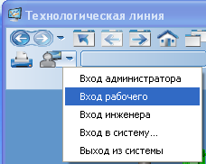
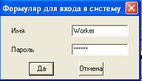
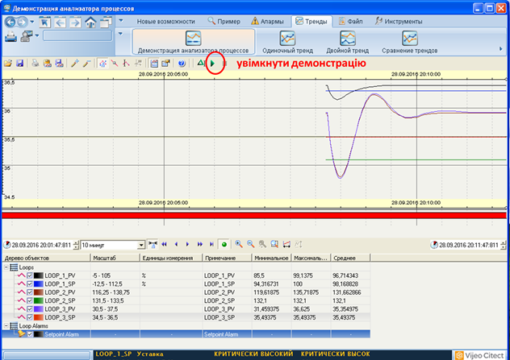
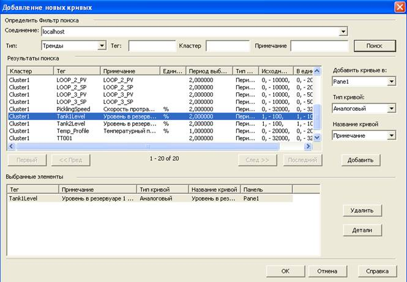
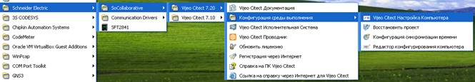
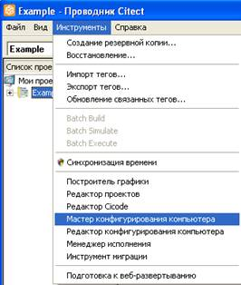
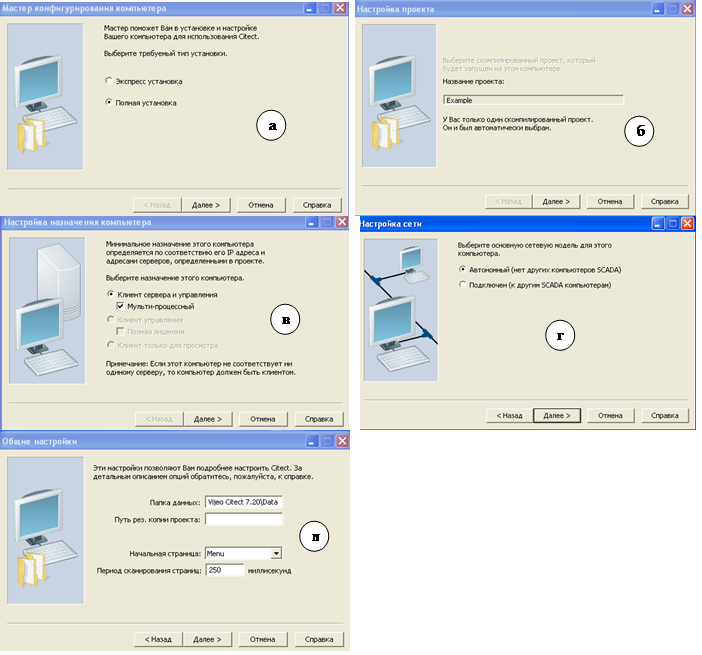

# Лабораторна робота №1

**Тема. Середовище виконання** **SCADA/HMI.**

 

**Тривалість**: 4 акад. години (4 пари).

**Мета:** ознайомлення з можливостями середовищ виконання SCADA на базі Vijeo Citect.  

**Завдання для виконання роботи**

**Цілі.** 

\1.   Навчитися налаштовувати запускати, зупиняти, перезапускати середовище виконання Vijeo Citect. 

\2.   На прикладі демонстраційного проекту ознайомитися з основними можливостями середовища виконання: анімацією, тривоговими екранами, трендами та інш.

**Лабораторна установка**

Апаратне забезпечення: ПК. 

Програмне забезпечення: Vijeo Citect 7.2 (або новіше).

**Порядок виконання роботи** 

1. Використовуючи     помічник, налаштуйте середовище виконання на запуск проекту "Example". Порядок налаштування середовища     виконання описаний в Додатку 1.
2. Запустіть     середовище виконання Vijeo Citect "Schneider Electric" ->     "Vijeo Citect 7.20" -> "Vijeo Citect Исполнительная система". У вікні попередження "Демо     режиму" натисніть "Ок". У демонстраційному режимі     середовище виконання працює 15 хвилин, що достатньо для перевірки     працездатності проекту. Проект "Example" не використовує зовнішніх змінних вводу/виводу, тому він буде     працювати без обмежень. 

 

Рис.1.1 Запуск виконавчої системи Vijeo Citect

 

\3.   Ознайомтеся зі структурою меню, поступово переходячи між вкладками. Знайдіть пункт меню, який відповідає за налаштування (інструменти/Tools) та змініть мову на російську. 

1. Зареєструйтеся     під користувачем "Worker", як це     показано на рис.2. Пароль вводити не потрібно, він заповнюється     автоматично. 

 

Рис.1.2 Вікна зміна користувача

 

1. Проаналізуйте структуру основного вікна.     Знайдіть основні елементи інтерфейсу, які повторюються на кожній сторінці,     дізнайтеся про їх призначення.. 

2. У розділі меню     "Пример"-"Показать" відкрийте вікно     "Пищевые продукты и напитки". Спробуйте     покерувати у ручному режимі двигуном мішалки, знайти елементи збільшення     та зменшення швидкості руху пляшок. Зверніть увагу на спосіб реалізації     панелі керування двигуном. Підійдіть критично до реалізації інтерфейсу     сторінки і подумайте, якої інформації вам не вистачає і яка є зайвою.     

3. Відкрийте     сторінку "Пример" – "Ввод оператора".     Знайдіть елементи з наступними способами вводу/зміни значення: 

4. 1. зміна      дискретного значення кнопкою перемикання;
   2. введення      текстового значення;
   3. введення      числового значення шляхом набору з клавіатури;
   4. введення      числового значення шляхом набору з віртуальної клавіатури Vijeo Citect;       
   5. зміна      значення повзунками (вертикальними, горизонтальними і круговими);
   6. зміна значень      переміщенням по 2-м осям;
   7. зміна      значення переміщенням елемента числового відображення;

При введенні числового та текстового значення спробуйте також вводити дуже великі числа.

1. Відкрийте     сторінку "Пример" – "Genies". Натисніть кнопку "Тестировать Genie" і знайдіть елементи з наступними способами     вводу/зміни/відображення значення:

2. 1.  анімація зміною зображення, в тому числі      багато-кадрового;
   2.  анімація зміна тексту;
   3. анімація      зміни кольору;

3. Відкрийте     сторінку "Пример" – "Группы". Увімкніть режим "демонстрація" і дочекайтеся поки він     закінчиться. Використовуючи різні типи повзунків покеруйте краном.     Зверніть увагу на групові операції в анімації.

4. Відкрийте     сторінку "Пример" – "Показать объекты". Використовуючи повзунки змінюйте габарити, розміщення по вертикалі     та горизонталі, кут повороту об’єктів, градієнт кольору. Зверніть увагу на     "множинність" анімації (декілька анімацій для того ж об'єкту).     Використовуючи команду "Спрятать"     спробуйте анімацію видимості.

5. Відкрийте     сторінку "Пример" – "ActiveX". Натисніть кнопку "Авто" для демонстрації роботи     індикаторів. У ручному режимі спробуйте змінювати значення.

6. Відкрийте     сторінку "Пример" – "Показать"     - "Автоподстройка". Зробіть     наступні зміни:

7. 1. для одного з      контурів (Loop) змініть значення виходу (OP, "Выход контроллера");
   2. усі контури      переведіть в автоматичний режим;
   3. усім контурам      виставте значення приблизно ¾ від розміру їх шкали;
   4. змініть      коефіцієнти регулятора на одному з контурів; 

8. Відкрийте     сторінку "Пример" – "Показать"     - "Сталелитейный цех". Проаналізуйте     трендовий графік, визначте за що відповідає кожна крива. На верхній частині     графіку у вигляді ступінчатого сигналу показаний час виникнення тривог,     спостерігаючи за ним проаналізуйте що значить кожна сходинка і що значить     її колір.

9. Перевірте чи     усі тривоги активовані (в експлуатації). Якщо є заблоковані тривоги,     зареєструйтеся в системі виконання під користувачем "Інженер",     перейдіть на сторінку "Алармы" – "Заблокированные     алармы", виділіть усі тривоги в списку (через кнопку shift) і виберіть з контекстного меню команду     "Активировать". Знову зареєструйтеся в системі виконання під     користувачем "Worker".

10. Відкрийте     сторінку "Алармы" – "Активные     алармы". Для можливості зміни стану тривог відкрийте вікно зі сторінкою "Алармы" – "Имитация алармов". Змінюючи стан     тривог прослідкуйте як вони себе ведуть у списку активних тривог. Зверніть     увагу на наявність повідомлень у списку активних тривог при їх зникненні.

11. Проаналізуйте     зміст контекстного меню одного з повідомлень тривог в списку. Зверніть     увагу на пункти, які там недоступні. Зареєструйтеся в системі виконання     під користувачем "Інженер". Проаналізуйте зміст контекстного     меню.   

12. Користуючись     контекстним меню викличте вікно з властивостями однієї з тривог (надалі     "експериментальна") і зробіть скриншот (копію екрану). Для     однієї з інших тривог виберіть     пункт контекстного меню "Подтвердить" ("Квитировать").     За допомогою вікна "Имитация алармов" зробіть щоб тільки     "експериментальна" тривога була активною. Виділіть усі повідомлення     (використовуючи мишу та "Shift") і в     контекстному меню виберіть команду " Подтвердить". Зверніть     увагу на те, які повідомлення залишилися на сторінці активних тривог.     Подивіться властивості тривоги, зробіть скриншот і порівнюючи з     попереднім, зробіть аналіз того, що змінилося.  

13. За допомогою     вікна "Алармы" – "Имитация     алармов"активуйте перші три "Аварії". Виділіть їх та через команду     в контекстному меню заблокуйте. Тепер ці тривоги виведені з експлуатації і     не будуть відслідковуватися системою. Для їх активації перейдіть на     сторінку "Алармы" – "Заблокированные     алармы" і виберіть з контекстного меню команду "Активировать".

14. Використовуючи     ліву панель сторінки активних тривог спробуйте команди для усієї сторінки     "Страница квитировать" і "Отключить страницу".

15. Користуючись     командою "ВСЕ ВКЛ." на сторінці "Алармы" – "Имитация алармов" увімкніть усі     тривоги. Забезпечте також спрацювання тривоги для Loop_1_SP.     Використовуючи налаштування фільтру лівої панелі сторінки зробіть     відображення тільки тривог, що мають стан "ON".

16. Користуючись     лівою панеллю сторінки активних тривог добавте поле (колонку)     "Описание".

17. Перейдіть на     сторінку "Алармы" – "Сводка алармов".     Подивіться яка інформація і в якому вигляді доступна для даного зведення.     За необхідності використовуйте вікно імітації тривог.

18. Перейдіть на     сторінку "Тренды" – "Демонстрация трендов". Запустіть демонстрацію трендів     натискаючи відповідну команду в головній панелі інструментів (рис.3)     трендового переглядача (Trend Viewer). Зверніть     увагу на:

19. 1. нижню частину      екрану, в якій знаходяться підписи до трендових і тривогових кривих з їх      значеннями (легенда тренду);
    2. верхню частину,      де рисуються криві трендів та/або станів тривог;
    3. на ***головну\*** ***панель інструментів\*** над      трендами 
    4. на ***панель інструментів навігації\***      під трендами

Подивіться які варіанти відображення трендів доступні у виконавчій системі Vijeo Citect 7.2 і як змінюється легенда та її зміст.          

 

Рис.1.3 Вікно демонстрації тренду

 

1.  Відкрийте сторінку "Пример" – "Показать" - "Автоподстройка".     Змініть уставки контурам приблизно на 25%, 50%, 75%, 90% від діапазону     шкали відповідно до номера контуру, після чого перейдіть на сторінку     "Тренды"- "Одиночный тренд". Зробіть видимим курсор, за допомогою     кнопки "Показать/скрыть курсор" на верхній панелі інструментів. Переведіть курсор в зону перехідного     процесу. За допомогою команди головної панелі інструментів активуйте     трендову статистику. Подивіться які значення змінних були в точці хвилини     від початку перехідного процесу та проаналізуйте інформацію зі статичних     даних.
2. Користуючись     на панелі інструментів навігації кнопками "Назад на один интервал" та "Назад на     пол-интервала" подивіться якими були значення одразу після     початку запуску виконавчої системи. Знайдіть на панелі інструментів     навігації поля введення "Начального момента     времени", "Конечного момента     времени", зміни діапазону відображення та налаштуйте відображення тренду за     весь період роботи на лабораторному занятті. Згадайте, за яких причин     змінювалися ці значення. За допомогою кнопки "Переключение автоматической прокрутки" активуйте     режим автопрокрутки тренду. 
3. Визначте     призначення усіх команд для масштабування.
4. Скориставшись     командою головної панелі інструментів "Добавить кривые" добавте в переглядач трендів криву з     трендовою змінною "Tank1Level". Для цього у вікні добавлення     (рис.4) треба вибрати тип "Тренды" і натиснути кнопку пошуку,     після чого з вінка результатів пошуку вибрати потрібну змінну та подвійним     кліком (або кнопкою "Добавить") добавити її в список вибраних     елементів. Після вибору змінних клікнути на "Ок".   

  

Рис.1.4 Вікно добавлення нових кривих 

 

1. Збережіть вибрані налаштування у файл з     назвою "MyTrends.pav" використовуючи команду "Сохранить представление" з головної панелі інструментів.     Поступово відкриваючи файли *.pav подивіться усі збереження на даний момент     налаштування.
2. За допомогою     вікна "Алармы" – "Имитация алармов" та списку активних     тривог включіть кілька тривог, підтвердіть (квітіруйте) їх та відключіть.     Відкрийте сторінку "Тренды"- "Одиночный тренд" та у     переглядачі трендів відкрийте налаштування "Alarms.pav".     Проаналізуйте як графічно відображаються стани тривог. Подумайте які переваги     це може дати в комбінації з відображенням трендів.
3. Скориставшись командою головної панелі     інструментів "Добавить кривые" добавте в переглядач декілька     кривих зі змінними реального часу ("Переменные     теги").     Зверніть увагу на те, яка інформація для них не доступна. Подивіться також     інші можливості трендових переглядачів.      
4. У меню "Файл" подивіться     протокол дії оператора та звіти. 
5. Завершіть роботу системи виконанням команди "Закрыть систему" зі сторінки     "Инженерные утилиты" меню "Инструменты" . 
6. Ознайомтеся з завданням     на наступні лабораторні роботи з розділу методичних рекомендацій "Опис     завдання для виконання на лабораторних роботах з людино-машинних     інтерфейсів". Завантажте підготовлений в завданні проект в імітатор     контролера та виконайте перевірку роботи, як це вказано в розділах     "Ознайомлення з роботою системи керування" для установки     керування приготуванням та підігрівом.              

 

**Порядок прийому роботи**

Викладач перевіряє вибірково виконання пунктів лабораторної роботи. Нижче наведена методика перевірки (орієнтовно, вибірково):

\1.   Покажіть способи вводу дискретного, аналогового, текстового значення. 

\2.   Покажіть способи відображення дискретного, аналогового, текстового значення. 

\3.   Покажіть властивість тривоги та прокоментуйте поля.

\4.   Застосуйте фільтр для тривог по часу.

\5.   Перевірка прав.

\6.   Покажіть як тривоги блокуються та розблокуються.

\7.   Відобразіть тренд зміни значень контурів регулювання (LOOPs) за весь час лабораторної роботи.

\8.   Покажіть тренди з відображенням стану тривог. Прокоментуйте зовнішній вигляд тривог.

\9.   Покажіть скриншоти трендів за весь період лабораторної роботи, покажіть коли буди зміни завдань на які значення, тривоги (виникли, підтвердження, зникли);

 

**Питання до захисту** 

1. Скільки максимально рівнів меню Ви     побачили в проекті Example? Покажіть на прикладі     максимальну кількість рівнів, яку Вам вдалося побачити.
2. Поясніть призначення меню верхнього     рівня в проекті Example.
3. Які елементи інтерфейсу повторюються на     кожному вікні?
4. Поясніть своїми словами чим вікно     відрізняється від сторінок.
5. За допомогою яких елементів в проекті Example оператор швидко може побачити стан усієї системи?
6. Де і для чого в проекті Example використовується анімація миготіння?
7. Розкажіть яку інформацію Ви можете     отримати зі сторінки "Пищевые продукты и напитки". Які елементи     використовуються для відображення стану та керування?
8. Які елементи вводу/зміни значення     використовуються в проекті Example?
9. Які елементи відображення значення/стану     використовуються в проекті Example?
10. Які елементи відображення в проекті Example, на вашу думку, є найбільш інформаційними? Обґрунтуйте свою     відповідь.
11. Які засоби в проекті Example використовуються для відображення оператору імені та призначення     того параметру, який відображається або проводиться зміна?
12. Як в проекті Example на графіку     (переглядачі) трендів показують різні типи тривог?
13. Які інструменти для перегляду тривог     (активних, журналів тривог та ін.) та керування їх станом задіяні в     проекті Example?
14. Як дізнатися про перелік активних тривог     в даний момент часу? Чи доступна ця інформація перед очима у оператора     завжди?
15. Як повідомлення тривог розрізняються за     станом, пріоритетністю відображення?
16. Як дізнатися детальну інформацію про     потрібну тривогу? Прокоментуйте, яка інформація доступна оператору?
17. Як ведуть себе повідомлення в списку     активних тривог при зміні їх стану? Коли тривоги зникають з цього списку?
18. Розкажіть навіщо потрібно підтвердження     (квітирування) тривоги? Як це робиться в проекті Example? Як видно чи тривога     була підтвердженою?
19. Розкажіть навіщо потрібно блокування     (виведення з експлуатації) тривог? Як це робиться в проекті Example? Де видно перелік заблокованих тривог? Як можна повернути тривоги     до експлуатації (Деблокувати)?
20. Де і як можна дізнатися     коли тривога виникла, зникла, була підтвердженою чи блокованою (виведеною     з експлуатації)?
21. Навіщо потрібні фільтри в переглядачах     тривоги? За якими полями тривоги в проекті Example можна застосовувати     фільтри?
22. Яка інформація і в якій формі доступна в     зведенні тривог ("Сводка алармов")? Чим зведення     тривог відрізняється від списку     активних тривог?
23. Для чого призначені трендові     переглядачі? Яку інформацію може відображати трендовий переглядач у Vijeo Citect     7.2? 
24. Для чого потрібна легенда трендів? Яка     інформація там доступна для відображення?
25. Розкажіть про призначення курсору на     трендових переглядачах.
26. Назвіть елементи навігації та     масштабування для трендів та розкажіть їх призначення.
27. Які можливості надає трендовий     переглядач у Vijeo Citect?
28. Розкажіть яким чином можна у Vijeo Citect зберігати налаштування     трендового переглядача і навіщо це може знадобитися.
29. Розкажіть яким чином відображаються     тривоги в переглядачі трендів. Яку перевагу може мати такий спосіб     відображення над класичним (в списку активних тривог)? 
30. Які обмеження для різних користувачів (аккаунтів)     Ви побачили в проекті Example. 
31. Поясніть відмінність середовища розробки     та середовища виконання SCADA/HMI. Яке саме середовище потрібне для роботи     АРМу оператору на підприємстві?
32. Поясніть що таке проект SCADA/HMI? Чим     відрізняється вихідний проект від скомпільованого і коли підприємству     необхідні обидва варіанти проектів?
33. Від чого залежить вартість середовища     виконання SCADA/HMI?
34. Які типові функції надають програми     SCADA/HMI?

**Додаток 1.1. Налаштування середовища виконання та файл "****Citect****.****ini****"** 

Середовище виконання (Runtime система) – це, по суті, виконавчий файл (або файли) Citect.exe який може виконувати проект, створений та скомпільований у середовищі розробки Vijeo Citect. При запуску середовище виконання повинно знати про те, який саме проект необхідно запустити а також з якими налаштуваннями (наприклад, де зберігати файли для трендів та тривог, якою буде стартова сторінка і т.д.). Назва та місце розміщення проекту а також інші налаштування зберігаються в ***параметрах\*** Vijeo Citect, які на кожному комп’ютері зберігаються в файлі "Citect.ini". Розміщення файлу "Citect.ini" залежить від версії Vijeo Citect та операційної системи, наприклад, "C:\Documents and Settings\All Users\Application Data\Schneider Electric\Vijeo Citect 7.20\Config".

"Citect.ini" є типовим текстовим ini-файлом, який містить розділи, назви та значення параметрів. Для його зміни можна користуватися будь-яким текстовим редактором або спеціалізованою утилітою "Редактор конфигурирования компьютера", що поставляється разом з Vijeo Citect. У будь якому з цих варіантів користувач повинен володіти достатньо великою кількістю знань, тому для спрощення налаштування основних параметрів виконавчої системи краще користуватися помічником налаштування комп’ютера, який доступний з меню "Пуск" Windows ("Настройка компьютера", рис.Д1.1) або з середовища розробки ("Мастер конфигурирования компьютера", рис.Д1.2).  

 

рис.Д1.1.

Рис.Д1.2

Тут не будемо пояснювати усі налаштування, вони будуть поступово описані в інших лабораторних роботах. Для мінімального налаштування запуску проекту "Example" необхідно в помічнику налаштування комп’ютеру вказати наступні значення параметрів (рис.Д.1.3):

\-     у першому вікні (а) необхідно вибирати "Полная установка" для подальшого відображення максимальної кількості параметрів;

\-     у вікні "Настройка проекта" (б) вибрати проект, що буде виконувати виконавча система, наприклад "Example"; проект до цього повинен бути скомпільований; для заново інстальованих систем проект "Example" вже скомпільований;

\-     у вікні "Настройка назначения компьютера" (в) необхідно виставити опцію "Мульти-процессный", тоді кожна частина проекту (кожен сервер і клієнт) буде запускатися у вигляді окремого процесу ОС (окремий Citect.exe);

\-     у вікні "Настройка сети" (г) необхідно вибрати опцію "Автономный", тоді середовище виконання буде запускатися в режимі відсутності зв’язку з іншими середовищами виконання Vijeo Citect; якщо в даному вікні вибрати опцію "Подключен", то середовище виконання без ліцензійного ключа буде запускатися тільки на декілька секунд;

\-     в усіх інших вікнах налаштування у більшості випадків треба залишити за замовченням; 

\-     у вікні "Общие настройки" (д) можна вказати стартову сторінку та папку розміщення історичних даних; для налаштування проекту "Example" залиште ці налаштування без змін;       

 

Рис.Д1.3. Основні налаштування виконавчої системи за допомогою помічника

 