**Лабораторна робота №2**

**Тема. Розробка бази даних реального часу** **SCADA/HMI.** 

 

**Тривалість**: 6 акад. години (4 пари).

**Мета:** ознайомлення з основними можливостями середовища розробки Vijeo Citect, та опанування роботи зі змінними.  

**Завдання для виконання роботи**

**Цілі.** 

\1.   Навчитися створювати, видаляти, архівувати та відновлювати проект Vijeo Citect. 

\2.   Навчитися налаштовувати підсистему збору та обробки даних реального часу SCADA Vijeo Citect. 

\3.   Навчитися створювати, редагувати та налагоджувати базові елементи SCADA/HMI Vijeo Citect.

\4.   Навчитися створювати та редагувати змінні теги Vijeo Citect використовуючи вбудовані редактори та надбудову MS Excel.

\5.   Створити частину проекту зі змінними тегів.   

**Лабораторна установка**

Апаратне забезпечення: ПК. 

Програмне забезпечення: UNITY PRO V>=4.0, Vijeo Citect 7.2 (або новіше), MS Excel 2003 (або новіше).

**Порядок виконання роботи** 

\1.   Ознайомтеся з усіма додатками до лабораторної роботи.

\2.   Завантажте в імітатор контролера підготовлений проект Unity PRO, що описаний у файлі Завдання. Запустіть його на виконання. Перевірте його працездатність.

\3.   Запустіть середовище розробки Vijeo Citect 7.2 (рис.2.1).

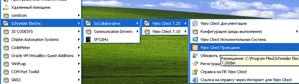

  Рис.2.1. Запуск середовища розробки Vijeo Citect 7.2

 

\4.   Проконтролюйте відкриття трьох редакторів: "Проводник Citect" (надалі ***провідник\***), "Редактор графики" (надалі ***графічний редактор\***), "Редактор проектов" (надалі ***редактор проектів\***). 

\5.   У провіднику створіть новий проект (рис.2.2). У назві проекту вкажіть своє прізвище в англійській транслітерації. Зверніть увагу, що назва проекту не повинна містити кириличних літер, пробілів і починатися з літери. 

У описі проекту вкажіть прізвище та номер групи. Шлях розміщення залиште за замовченням. Для спрощення створення проекту виставте опцію "Создать проект на основе начального проекта". У налаштуваннях вибору початкового проекту вкажіть шаблон, що найбільше підходить до типу вашого монітору. Якщо проект виконується в лабораторії А532, виберіть шаблон "Tab_Style_1_SXGA_titlebar". Натисніть кнопку "ОК" для закінчення створення проекту.  

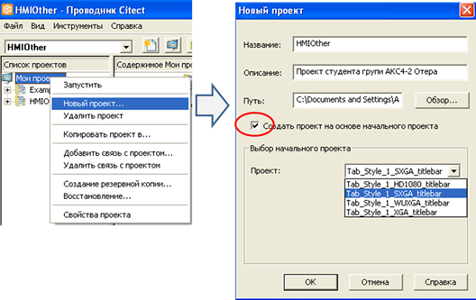

Рис.2.2 Створення нового проекту

 

\6.   Створений проект повинен відобразитися в списку проектів провідника. Завдяки виставленій опції створення проекту на базі початкового автоматично будуть створені:

1. 1. кластер з      іменем "Cluster1" ("Редактор      проектов"->"Сервера"->"Кластеры" або "Проводник"      ->"Связь"->"Кластеры")
   2. ім'я ролі      "Administrators" зв’язаний з адміністративною групою Windows       "BUILTIN\Administrators" з глобальними привілеями 8 ("Редактор проектов" або "Проводник" ->"Система"->"Роли")
   3. Файл Cicode "Startup" ("Проводник" ->"Файлы Cicode")
   4. сторінки ("Проводник"->"Графика"->"Страницы")

·     Alarm 

·     Summary

·     Disabled

·     Hardware

·     ProcessAnalyst 

·     !ProcessAnalystPopup 

·     !Shutdown

·     !Splash

Проконтролюйте створення усіх вказаних розділів проекту та сторінок (добавляти нові записи не потрібно!). Сторінки, що починаються зі знаку оклику "!" є прихованими, тому вони невидимі, за замовченням в списку сторінок. Для видимості прихованих сторінок виставте опцію "Редактор графики"->"Инструменты"->"Настройки"->"Список системных страниц" (рис.2.3).

Також подивіться які проекти включені у Ваш: "Система" -> "Включенные проекты".  

 

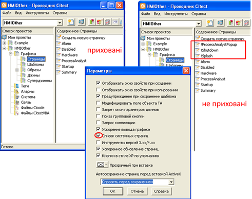

Рис.2.3 Відображення списку сторінок та налаштування параметрів графічного редактору

 

\7.   Уважно прочитайте додаток 2.1 "Короткі відомості про файли та редактор проекту". Відкрийте директорію, в якій знаходяться усі проекти, знайдіть там папку Вашого проекту.  

\8.   Виділіть (кліком миші) ваш проект в провіднику і перейдіть до редактору проектів використовуючи відповідну команду панелі або меню інструментів. Перевірте, що саме ваш проект зараз відображається у редакторі проектів (рис.2.4). 

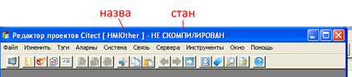

Рис.2.4 Заголовок вікна редактору. 

Використовуючи меню "файл"->"компилировать", виконайте компіляцію проекту. Під час компіляції у Вас може виникнути попередження про відсутність якого-небудь пристрою IO (вводу виводу). Перейдіть до списку помилок компіляції. Подивіться які саме помилки/попередження виникли. Зверніть увагу на те, чи скомпілювався проект. Якщо проект скомпілювався, перейдіть до виконання наступного пункту, якщо ні – за допомогою викладача виправте помилки.

\9.   Детально ознайомтеся з розділом "Вимоги до системи SCADA/HMI. Вимоги до комунікаційного обміну" файлу "Завдання". 

\10. Для налаштування комунікаційного зв’язку запустіть "Экспресс-настройка устройств ввода/вывода" з розділу провідника "Связь". На рис.2.5 для кожного пункту показано зовнішній вигляд вікон: 

1. 1. у стартовому      вікні натисніть "Далее";
   2. у вікні      створення серверу залиште "IOServer" –      назва серверу вводу/виводу, який буде використовуватися для роботи з      пристроями вводу/виводу; зверніть увагу, що **у Вашому проекті повинен      бути тільки один сервер вводу виводу**, якщо він вже існує – просто      виберіть його зі списку;  
   3. у вікні      створення пристрою вводу/виводу введіть назву пристрою, наприклад "PLCM340"; зверніть увагу, що назва      повинна містити тільки літери латинського алфавіту, починатися з літери,      не містити пробілів і також інших службових символів (може містити      "_");  
   4. у вікні      вибору типу пристрою вкажіть "внешние устройства      в/в", так як створені в його межах змінні Citect мають за джерело даних змінні зовнішнього      пристрою вводу/виводу;
   5. у вікні      вибору моделі пристрою та протоколу вкажіть у розділі "Schneider Electric" -> "М340" ->      "Modbus/TCP (Ethernet)";
   6. у вікні      налаштування параметрів TCP/IP вкажіть IP адресу М340, або комп’ютера на якому знаходиться імітатор Unity PRO; якщо імітатор Unity PRO виконується на тому самому ПК що і      виконавча система Vijeo Citect, тут необхідно вписати 127.0.0.1;
   7. вікно      означення зовнішньої БД тегів дає можливість підключити або імпортувати      зовнішній файл, в якому знаходиться база даних змінних тегів      вводу/виводу, що у багатьох випадках скорочує час створення та      налагодження проекту; механізми імпорту/експорту на даному етапі      використовуватися не будуть, тому у цьому вікні нічого не вказуйте,      просто натисніть "Далее";       
   8. у вікні      завершення майстра передивіться перелік того, що він буде створювати і      натисніть "Готово". 

Зверніть увагу, що **для зміни налаштувань існуючих пристроїв вводу/виводу майстер налаштування запускати не потрібно**, бо кожного разу у результаті запуску будуть створюватися нові записи в базі даних проекту!  

 

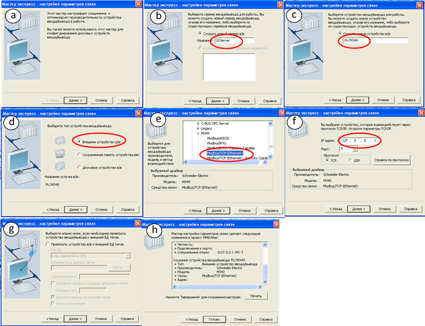

 

 Рис.2.5. Вікна помічника налаштування комунікацій 

 

\11. Перевірте результати роботи майстра, переглянувши наступні розділи проекту (через редактор проектів або провідник):

1. 1. "Сервера" -> "Сервера ввода/вывода"
   2. "Связь" -> "Модули"
   3. "Связь" -> "Порты"
   4. "Связь" -> "Устройства ввода/вывода"

Подивіться скільки є записів у кожному розділі, які поля заповнені, як забезпечується ієрархія вкладеності 

Модулі -> порти -> пристрої вводу/виводу

\12.  У розділі "Теги"->"Переменные теги" створіть два змінних теги: один аналоговий (див. перший запис таблиці 1 файлу завдання) та один дискретний (див. перший запис таблиці 2 файлу завдання). Рекомендується імена тегам давати такі самі як в проекті Unity PRO. На рис.2.6 показані поля записів для цих змінних. Відомості про роботу з редактором проектів наведені в додатку 2.1.

 

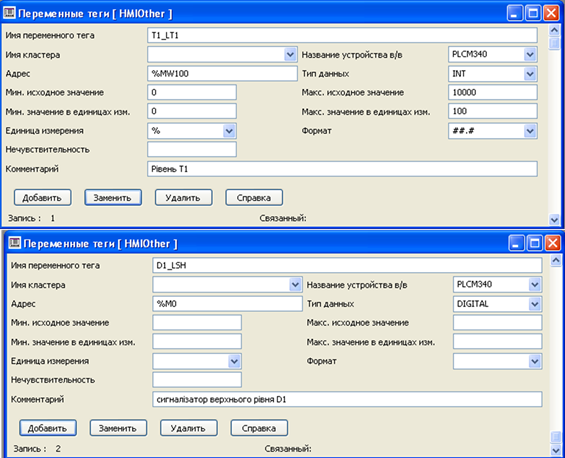

Рис.2.6. Налаштування змінних тегів

 

\13. Скомпілюйте проект. Перевірте наявність помилок та попереджень, якщо таких не виявлено – перейдіть до наступного пункту, інакше – виправте помилки. 

\14. Через провідник проекту "Графика"->"страницы" відкрийте сторінку "Startup". Видаліть зміст сторінки ("Loading Project. Please wait …"). Відкрийте вікно властивостей сторінки (контекстне меню сторінки ->"Свойства страницы..") змініть фон на сірий (Color80) як це показано на рис.2.7. 

 

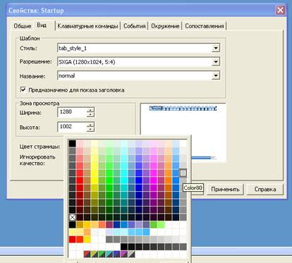

Рис.2.7 Зміна фону сторінки

\15. Користуючись описаними нижче процедурами, розмістіть на сторінці 4 графічні елементи, як це зображено на рис.2.8:

1. 1. текстові      написи "Рівень Т1" та "Сигналізатор верхнього рівня"
   2. джини для      відображення та зміни значень змінних T1_LT1 та D1_LSH. 

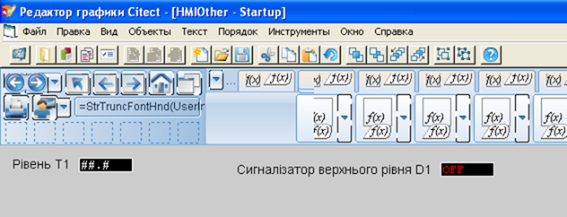

Рис.2.8. Зовнішній вигляд сторінки у режимі розробки

Текстові поля створюються з використанням елементу "Текст", що вибирається з палітри інструментів (рис.2.9) або з меню графічного редактору "Объекты" -> "Текст". Зверніть увагу, що **перед розміщенням на сторінці текстового елементу в ньому необхідно набрати текст**.

Для відображення та зміни значення числової змінної скористуйтесь джином "Parameter2" з бібліотеки "keyentry". Джин – це графічний бібліотечний елемент з вбудованою анімацією. Для прив’язки змінної до анімації, після вставки джина з'явиться вікно прив’язки, куди треба буде вказати змінну. Для відображення та зміни значення дискретної змінної, скористуйтесь джином "On_off_toogle2" з бібліотеки "keyentry". 

Після усіх дій збережіть сторінку через меню "Файл"->"Сохранить"   

З деталями налаштування основних графічних можливостей Vijeo Citect Ви ознайомитесь у наступних лабораторних роботах.

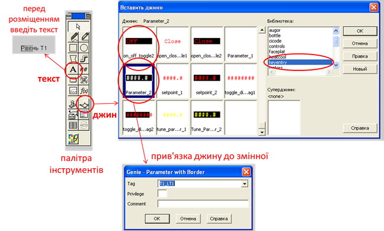

Рис.2.9 Створення графічних елементів

 

\16. Створіть користувача "Admin" з правами адміністратора (рис.2.10). Редагування користувача проводиться у редакторі проектів через меню "Система"->"Пользователи". Пароль поки можна залишити порожнім.

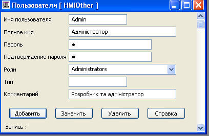

 Рис.2.10 Створення користувача

\17. Скомпілюйте проект. Перевірте наявність помилок та попереджень, якщо таких не виявлено – перейдіть до наступного пункту, інакше – виправте помилки.

\18. Запустіть "Мастер конфигурирования компьютера" та налаштуйте систему на запуск вашого проекту, аналогічно до того, як Ви проводили налаштування запуску проекту "Example" в попередній лабораторній роботі. В останньому вікні виберіть в якості стартової сторінки проекту "Startup" (див. рис.2.11)

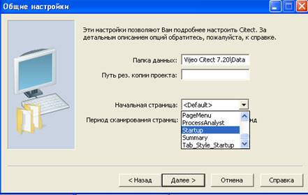

Рис.2.11. Зміна стартової сторінки запуску

 

\19. Запустіть на виконання середовище розробки з будь якого редактору "Файл"-> "Запустить/Выполнить". Зареєструйте користувача "Admin" в системі для можливості проведення усіх операцій (рис.2.12). 

 

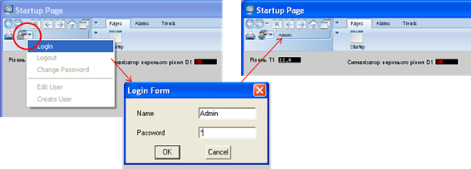

Рис.2.12 Реєстрація користувача в системі

 

\20. Перевірте чи відображаються значення змінних в середовищі виконання. Якщо замість них відображаються написи "BAD" чи "COM" – це значить, що є проблеми у зв’язку з контролером (або імітатором Unity PRO) і необхідно їх вирішувати за допомогою викладача. У іншому випадку – переходьте до наступного пункту.  

\21. Використовуючи операторські екрани в Unity PRO перейдіть в режим форсування змінної датчика рівня T1_LT1 (AIFRC[0]) та сигналізатора D1_LSH (DIFRC[12]). Деталі режимів форсування описані у файлі "Завдання" та перевірялися на минулій лабораторній роботі. У режимі форсування перевірте чи змінюються значення в середовищі Vijeo Citect та чи відповідає це таким саме значенням в Unity PRO. Зверніть увагу на масштабування T1_LT1. Якщо усі зміни відбуваються коректно – переходьте до наступного пункту.

\22. Зробіть резервну копію проекту як це показано на рис.2.13. Після процедури створення знайдіть файл резервної копії. 

Необхідно періодично робити резервні копії. Це дасть можливість у випадку непередбачуваних змін в проекті відновити стару версію. Також це є самим простим і безпечним механізмом перенесення проекту з одного комп’ютера на інший.    

 

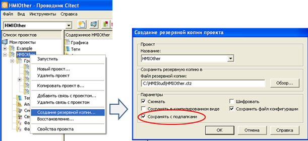

Рис.2.13 Створення резервної копії проекту

\23. Відновіть резервну копію проекту в новий проект з таким саме ім’ям але з суфіксом "Rest" (рис.2.14). Відновлення проекту можна робити і в існуючий проект, але тоді файли існуючого проекту будуть замінені файлами резервної копії. Необхідно дуже уважно ставитися до процедури створення та відновлення резервної копії проекту. Перед відновленням необхідно підтвердити пропозицію середовища Vijeo Citect на створення нової папки проекту.    

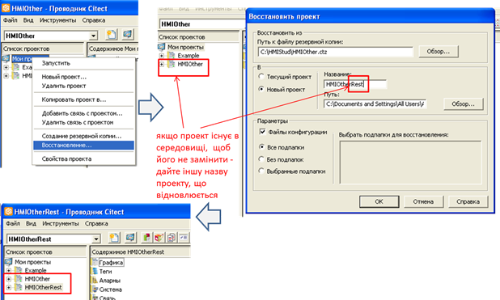

Рис.2.14 Відновлення резервної копії проекту

\24. Видаліть проект з суфіксом "Rest" (той який створився у результаті відновлювався в попередньому пункті).

\25. Уважно прочитайте додаток 2.2. Запустіть на виконання MS Excel. Прослідкуйте щоб в редакторі проектів не було відкрито жодної таблиці. Використовуючи Project DBF Add-In відрийте таблицю Variables Tags Вашого проекту. Проаналізуйте зміст таблиці, визначте які поля використовуються для заповнених Вами властивостей змінних. Заповніть таблицю змінних полями, відповідно до таблиці 1 з файлу "Завдання" за виключенням змінної HEA_TT1_SP. Таблиця матиме вигляд схожий на рис.2.15. 

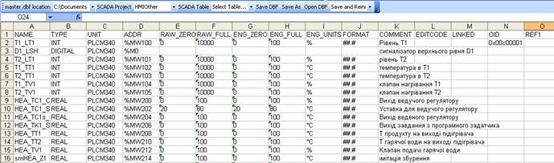

Рис.2.15. Вигляд таблиці з числовими змінними в Excel 

Збережіть таблицю командою "SaveDBF" і закрийте її. 

\26. Відкрийте редактор змінних в редакторі проектів Vijeo Citect, перевірте чи правильно створилися усі поля і, за необхідності, скоригуйте їх. 

Зробіть компіляцію проекту, якщо вона пройшла успішно – перейдіть до наступного пункту. Зверніть увагу, що при зміні проекту у зовнішньому редакторі, Vijeo Citect може попередити що проект не змінювався і компілювати нічого. Не зважаючи на попередження компіляцію все одно проводити потрібно. 

\27. Уважно прочитайте додаток 2.3. Добавте змінну-масив HEA_TT1_SP відповідно до налаштувань таблиці 1 файлу "Завдання". Для створення такої змінної в полі адреси після означення початкової адреси в квадратних дужках пишеться кількість елементів. У завданні масив означений в проекті Unity PRO з діапазоном від 0 до 5, отже кількість елементів задається рівною 6. Загальний вигляд налаштувань масиву показаний на рис.2.16.   

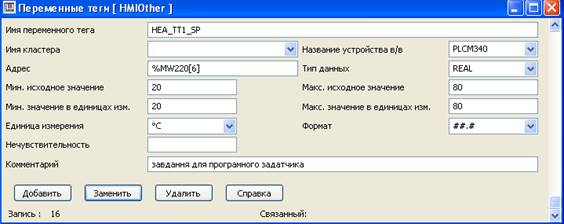  

Рис.2.16. Налаштування змінної масиву

Скомпілюйте проект. При вдалому результаті компілювання переходьте до виконання наступного пункту. 

\28. Аналогічним чином добавте змінні з таблиці 2 файлу "Завдання". Звертайте увагу на обмеження кількості символів в коментарях (<49). Скомпілюйте проект. При вдалому результаті компілювання переходьте до виконання наступного пункту.

\29. Для перевірки працездатності змінних тегів можна скористуватися спеціалізованою функцією Vijeo Citect "TagDebug", яка викликає вікно перегляду та зміни значення вибраних змінних. У графічному редакторі відкрийте сторінку "Startup". У довільному місці розмістіть кнопку з написом "Перевірка змінних", який вказується у властивостях "Вид"->"Общие"->"Текст" (рис.2.17). На вкладці "Ввод"->"Касание"->"Действие" активуйте опцію "Вверх", а в поле "Вверх команда" впишіть "TagDebug()". Збережіть сторінку, скомпілюйте проект, та у випадку вдалої компіляції перейдіть до наступного пункту.  

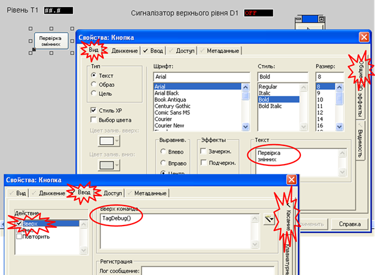

 Рис.2.17 Налаштування кнопки для виклику вікна перевірки змінних

\30. Запустіть проект на виконання. У Unity PRO зніміть заздалегідь усі форсування. Натиснувши на кнопку "Перевірка змінних" викличте вікно-форму читання/запису (рис.2.18). Прочитайте значення змінної T_SB1 ("Запуск процесу приготування"). Змініть значення на 1 та запишіть його в контролер. Подивіться чи запустилася програма приготування продукту в імітаторі контролера. Якщо так, перейдіть до наступного пункту.

 Рис.2.18 Вікно читання/запису змінної, що викликається функцією TagDebug()

\31.  За допомогою вікна TagDebug перевірте відповідність значення аналогових змінних в Vijeo Citect до змінних в ПЛК з урахуванням масштабу. Також вибірково перевірте 3 дискретних змінних. За необхідності, модифікуйте проект, щоб всі змінні були налаштовані згідно завдання.

\32. У проект необхідно добавити структурні змінні що вказані в таблиці 3-8 файлу "Завдання". Враховуючи, що назва змінних не може містити крапку ".", у якості розділового знаку варто використовувати символ нижнього підкреслення "_". Надалі назва тегів буде мати вирішальне значення для автоматизації розробки людино-машинного інтерфейсу, тому ми рекомендуємо Вам використовувати імена з таблиці 2.1  

Таблиця 2.1. Рекомендовані назви змінних тегів відповідно до полів структури

| **Назва змінної в ПЛК** | **Рекомендована назва в** **SCADA** **Vijeo** **Citect** | **Призанчення**                                              |
| ----------------------- | -------------------------------------------------------- | ------------------------------------------------------------ |
| Dozator1.CV             | D1_LC_CV                                                 | плинна кількість доз  D1                                     |
| Dozator1.PV             | D1_LC_PV                                                 | задана кількість доз D1                                      |
| Dozator1.START          | D1_LC_START                                              | запуск дозування D1                                          |
| Dozator2.CV             | D2_LC_CV                                                 | плинна кількість доз D2                                      |
| Dozator2.PV             | D2_LC_PV                                                 | задана кількість доз D2                                      |
| Dozator2.START          | D2_LC_START                                              | запуск дозування D2                                          |
| TC1_PARA.pv_inf         | HEA_TC1_PVINF                                            | обмеження по мінімуму  вхідної величини завдання TC1         |
| TC1_PARA.pv_sup         | HEA_TC1_PVSUP                                            | обмеження по максимуму  вхідної величини завдання TC1        |
| TC1_PARA.out_inf        | HEA_TC1_OUTINF                                           | обмеження по мінімуму  вихідної величини блоку TC1           |
| TC1_PARA.out_sup        | HEA_TC1_OUTSUP                                           | обмеження по максимуму  вихідної величини блоку TC1          |
| TC1_PARA.kp             | HEA_TC1_KP                                               | Коефіцієнт пропорційності TC1                                |
| TC1_PARA.ti             | HEA_TC1_TI                                               | Час інтегрування TC1                                         |
| TC1_PARA.dband          | HEA_TC1_DBAND                                            | Зона нечутливості TC1                                        |
| TC1_PARA.outbias        | HEA_TC1_OUTBIAS                                          | зміщення виходу регулятора  в П-режимі функціонування (при ti=0s) TC1 |
| TC1s_PARA .pv_inf       | HEA_TC1s_PVINF                                           | обмеження по мінімуму  вхідної величини завдання TC1s        |
| TC1s_PARA .pv_sup       | HEA_TC1s_PVSUP                                           | обмеження по максимуму  вхідної величини завдання TC1s       |
| TC1s_PARA .out_inf      | HEA_TC1s_OUTINF                                          | обмеження по мінімуму  вихідної величини блоку TC1s          |
| TC1s_PARA .out_sup      | HEA_TC1s_OUTSUP                                          | обмеження по максимуму  вихідної величини блоку TC1s         |
| TC1s_PARA .kp           | HEA_TC1s_KP                                              | Коефіцієнт пропорційності TC1s                               |
| TC1s_PARA .ti           | HEA_TC1s_TI                                              | Час інтегрування TC1s                                        |
| TC1s_PARA .dband        | HEA_TC1s_DBAND                                           | Зона нечутливості TC1s                                       |
| TC1s_PARA .outbias      | HEA_TC1s_OUTBIAS                                         | зміщення виходу регулятора  в П-режимі функціонування (при ti=0s) TC1s |
| Recipe1.D1Count         | T1_KS_D1CNT_SP                                           | рецепт Т1: кількість  доз з дозатору D1                      |
| Recipe1. D2Count        | T1_KS_D2CNT_SP                                           | рецепт Т1: кількість  доз з дозатору D2                      |
| Recipe1.T_SP            | T1_KS_TT1_SP                                             | рецепт Т1: значення  температури нагрівання                  |
| Recipe1.Delay           | T1_KS_DEL_SP                                             | рецепт Т1: заданий час  витримки                             |
| Recipe2.D1Count         | T2_KS_D1CNT_SP                                           | рецепт Т2: кількість доз з дозатору D1                       |
| Recipe2. D2Count        | T2_KS_D2CNT_SP                                           | рецепт Т2: кількість доз з дозатору D2                       |
| Recipe2.T_SP            | T2_KS_TT1_SP                                             | рецепт Т2: значення температури нагрівання                   |
| Recipe2.Delay           | T2_KS_DEL_SP                                             | рецепт Т2: заданий час витримки                              |

 

Також необхідно врахувати наявність типу BOOL в структурах, та необхідність приведення типу TIME до Citect. Уважно прочитайте додаток 2.3 щоб вірно налаштувати ці змінні.

Добавте усі структуровані змінні в проект. Скомпілюйте проект. При вдалому результаті компілювання переходьте до виконання наступного пункту.

\33. Запустіть на виконання проект. За допомогою вікна TagDebug перевірте відповідність значень полів типу TIME та BOOL структурних змінних ПЛК до змінних Vijeo Citect. За необхідності модифікуйте проект, щоб всі змінні були налаштовані згідно завдання.

\34. Зробіть резервну копію проекту, скопіюйте її на змінний носій. У випадку роботи в лабораторії – покажіть викладачу, і з його відома видаліть свій проект з провідника проектів.      

**
**

**Питання до захисту** 

1. Поясніть відмінність     середовища розробки та середовища виконання SCADA/HMI. Яке саме середовище     потрібне для роботи АРМу оператору на підприємстві?
2. Поясніть що таке проект     SCADA/HMI? Чим відрізняється вихідний проект від скомпільованого і коли     підприємству необхідні обидва варіанти проектів?
3. Від чого залежить     вартість середовища виконання SCADA/HMI?
4. Які типові функції     надають програми SCADA/HMI?
5. Що таке база даних     реального часу? 
6. Поясніть, що таке тег     SCADA? Що може бути джерелом даних для тега?
7. Поясніть що таке відмітка     часу і показник достовірності тегу?
8. Розкажіть про призначення     основних редакторів Vijeo Citect.
9. Чому у включених проекту     з'явився файл "Tab_Style_Include"? Чи міг там з'явитися     інший проект? На що це впливає? 
10. Що собою представляє     проект Vijeo Citect     з точки зору файлової системи Windows?
11. Як середовище розробки Vijeo Citect дізнається де     знаходяться проекти на комп'ютері?      Як середовище виконання Vijeo Citect дізнається де знаходяться     файли режиму виконання на комп'ютері? 
12. Як можна дізнатися про     розміщення папки проекту середовища розробки?
13. Для     чого потрібен редактор проектів Vijeo Citect? Які обмеження щодо     редагування файлів проекту він має? Який альтернативний варіант     вбудованому редактору проектів пропонується для Vijeo Citect?
14. Розкажіть     про основні можливості редактору проектів Vijeo Citect.
15. Розкажіть     про основні можливості надбудови ProjectDBFAddIn.
16. Поясніть     що таке компіляція проекту. Які ситуації можливі при компіляції проекту?     Як дізнатися про помилки компіляції?
17. Яке     призначення майстра налаштування комунікацій? Які зміни в проект вносить     майстер? Чи можна створити ці записи в проекті самостійно? Обґрунтуйте     необхідність використання цього майстра.
18. Що і де необхідно змінити     в існуючому проекті, щоб вказати іншу IP адресу ПЛК?  
19. Навіщо потрібно     створювати резервну копію проекту? Розкажіть основні процедури створення а     відновлення резервної копії проекту.
20. Яке призначення змінних     тегів ("Переменные теги")?     Розкажіть про призначення основних властивостей, які налаштовуються в Vijeo Citect при створенні цих     змінних.
21. Яке призначення локальних     змінних ("Локальные     переменные")? Чим локальні змінні принципово відрізняються від     змінних тегів?
22. Які типи даних для     змінних є у Vijeo Citect?     Розкажіть про відповідність цих типів основним типам даних в IEC 61131, зокрема у Unity PRO. Як у Vijeo Citect     налаштувати змінну яка буде відображати секунди зі змінної ПЛК типу TIME?
23. Розкажіть     про означення адреси в Vijeo Citect     для змінних з пристроїв, підключених через драйвер MODNET30. Які правила адресації BOOL/EBOOL що прив’язані до комірок %MW?
24. Розкажіть     про означення адреси в Vijeo Citect     для змінних з пристроїв, підключених через драйвер MODNET30. Які правила адресації DINT/UDINT що прив’язані до комірок %MW?
25. Як у Vijeo Citect налаштовуються     масиви? Як звертатися в проекті до елементів масивів?
26. Які Ви     знаєте засоби Vijeo Citect     для читання та запису користувачем будь яких змінних в системі?   

**
**

**Додаток 2.1. Короткі відомості про файли та редактор проекту** 

Проект середовища розробки представляє собою набір файлів, які розмішуються в папці проекту. Усі проекти (їх папки) Vijeo Citect 7.2 у Windows XP за замовченням розміщуються у директорії "C:\Documents and Settings\All Users\Application Data\Schneider Electric\Vijeo Citect 7.20\User" (рис.Д2.1.1). У будь якому випадку, розміщення визначається параметром [CtEdit]User із файлу Citect.ini (даний запис значить, що параметр має назву "User" і знаходиться в розділі ini-файлу "CtEdit" ) 

Місце розміщення файлів середовища виконання вказаний в параметрі [CtEdit]Run. Цей параметр можна змінити шляхом безпосереднього редагування файлу Citect.ini. Тим не менше, зручніше його змінювати за допомогою майстра конфігурування комп’ютера (див. лаб. роб №1). Крім того, після компіляції проекту в середовищі розробки, Vijeo Citect автоматично виставляє в цьому параметрі місце розміщення папки проекту. Таким чином, немає потреби в ручному задаванні параметру після переключення на інший проект.      

Провідник Citect відображає тільки ті проекти, які внесені до центральної бази даних проектів (MASTER.DBF). Не рекомендується редагувати чи видаляти цей файл, так як і інші файли проектів, що знаходяться в цих директоріях.   

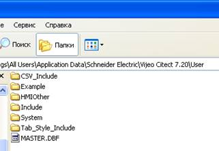

Рис.Д2.1.1. Вміст папки з проектами Vijeo Citect 7.2

Розміщення папки проекту а також інші властивості можна побачити у вікні властивостей проекту (рис.Д2.1.2), яке викликається через контекстне меню проекту в провіднику.  

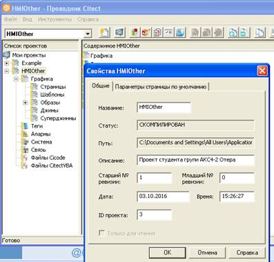

Рис.Д.2.1.2. Вікно властивостей проекту

Якщо глянути на зміст папки проекту можна пересвідчитися у великій кількості файлів з розширенням *.DBF та *.NDX – це файли баз даних однойменних розділів проекту. Графічні сторінки мають розширення *.CTG та *.CTF. Відповідно до файлів режиму розробки після компіляції створюються однойменні файли *.RDB, які потрібні для середовища виконання. Файли проекту не рекомендується редагувати звичайними редакторами баз даних, так як можна пошкодити їх цілісність. Для редагування необхідно використовувати редактори Vijeo Citect або Excel через спеціальну надбудову ProjectDBFAddIn, яку попередньо треба інсталювати на комп’ютер (див. додаток 2.2).

Неграфічні дані в проекті редагуються з використанням "Редактора проектів". Цей редактор по суті представляє собою середовище перегляду/зміни/добавлення окремих записів таблиць DBF у форматованому вигляді. Крім того редактор вміщує ряд команд для роботи з проектом.

На рис.Д2.1.3 показане вікно редагування запису дискретних тривог. Редактор може працювати у режимі відображення основних параметрів або розширеному режимі, в якому показуються усі параметри. Перемикання між режимами проводиться клавішею "F2". Кожний запис відображається та редагується окремо. Перехід до потрібного запису проводиться за допомогою полоси прокрутки, аж поки в низу вікна біля індикатору номеру запису не буде вказано "Конец файла". 

Для добавлення нового запису редагуються необхідні поля якогось з існуючих записів, після чого необхідно натиснути "Добавить". Зміна запису проводиться після натискання кнопки "Заменить", видалення - "Удалить". Слід відмітити, що при виклику у вікні редактору запису команди "Удалить", цей запис буде тільки помічений, як видалений, але не видалений. Помічені записи за необхідності можна повернути назад (зняти відмітку), для чого у редакторі ці записи можна показувати разом з іншими. Для активації такого режиму треба виставити опцію "Инструменты"->"Параметры"->"Показывать удаленные". Ми не рекомендуємо відображати видалені записи, так як це вносить плутанину в редагування. Користуйтесь цим режимом тільки в крайній необхідності.

Для пошуку потрібного запису в проекті інколи корисно використовувати команду "Изменить"–"Найти". 

Слід зазначити, що редактор проектів не надає можливості перегляду та зміни в табличній формі, що досить незручно у багатьох випадках. Тому для професійного користування редактором краще користуватися ProjectDBFAddIn (див. додаток 2.2)     

 

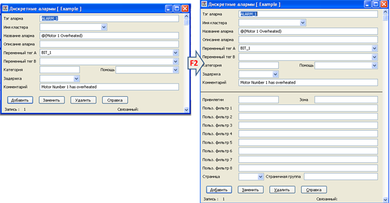

 Рис.Д2.1.3 Вікно властивостей проекту

Окрім редагування таблиць DBF, редактор проектів надає команди компіляції, запуску середовища виконання а також упаковки бази даних проекту. **Упаковка** ("Файл"->"Упаковать") видаляє усі помічені для видалення записи. Бувають випадки, коли помічені для видалення записи заважають компіляції проекту, тому ця команда може допомогти в таких ситуаціях. 

Компіляція може пройти успішно або з помилками. При **помилках компіляції** проект не скомпілюється і запускатися не буде. Компіляція може відбутися з **попередженнями,** що сигналізує про можливі некритичні помилки в проекті, з якими середовище виконання може працювати. Дізнатися про наявні помилки або/та попередження можна перейшовши до меню "Файл"->"Компилировать ошибки…" (це помилка перекладу, у нових версіях Vijeo Citect пункт називається "Ошибки компиляции" ) (рис.Д2.1.4). У полі тип вказується характер помилки: ERROR – помилка компіляції; WARNING – попередження; FATAL – компіляція закінчилася невдало із-за порушення цілісності файлів, помилки доступу, тощо. За допомогою скролінгу можна передивитися усі помилки, поки в низу вікна не буде вказано "Конец файла". Натискання на кнопці "Перейти" може забезпечити перехід на місце проекту, де відбувається помилка. 

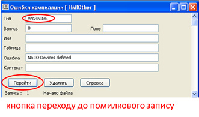

  Рис.Д2.1.4. Вікно помилок компіляцій та попереджень 

**
**

**Додаток 2.2. Користування Project DBF Add-In** 

**Призначення**. У Vijeo Citect редагування проекту проводиться окремо по кожному запису таблиці, що у багатьох випадках дуже незручно. У новій версії 2016-го року планують зробити табличний вигляд редакторів, однак у старіших версіях (на момент написання методичних рекомендацій робочою версією є 2015) в якості альтернативного вбудованого позаписового редактору пропонується надбудова над MS Excel - Project DBF Add-In, що дозволяє відкривати та редагувати файли проекту *.dbf коректно, не порушуючи цілісність цих файлів. Звісно, що файли *.dbf можна відкривати іншими редакторами, в тому числі і MS Excel, так як це є звичайними DBASE4 файлами бази даних. Однак, при зміні ширини полів, добавленні нових полів цілісність таблиць порушується і Vijeo Citect більше не зможе з ними працювати. Тому Project DBF Add-In дає можливість усі зміни проводити у відповідності з правилами. 

**Встановлення.** Інсталятор Project DBF Add-In входить до складу пакету Vijeo Citect, але за замовченням не ставиться. На робочих місцях лабораторії ця надбудована вже інстальована.

Надбудова запускається разом з MS Excel. У версії MS Excel 2003 вона представлена окремою панеллю, а у новіших версіях MS Office доступ до неї проводиться через окрему вкладку (рис.Д2.2.1). 

 

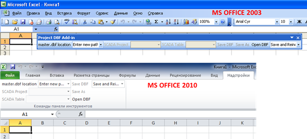

  рис.Д2.2.1. Розміщення надбудови Project DBF Add-In у різних версіях MS Excel 

 

У деяких випадках надбудова Project DBF може відключатися системою Excel для функціональної безпеки. Для активування надбудови в старих версіях Excel треба перейти в меню "Справка"->"О программе" після чого нажати кнопку "Откл. объекты" і у вікні активувати необхідний компонент. У нових версіях необхідно зайти у меню "Файл"->"Параметры"->"Надстройки" де у списку "Управление" вибрати "Отключенные объекты" і натиснути кнопку "Перейти" (рис.Д2.2.2) і у вікні активувати необхідний компонент. 

 

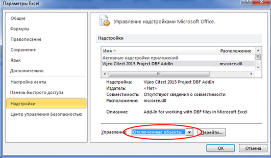

​     Рис.Д2.2.2. Активація Project DBF Add-In у нових версіях MS Excel 

 **Робота з надбудовою.** При першому запуску системи необхідно вказати розміщення файлу головної бази даних проектів MASTER.DBF (рис.Д2.2.3). Як дізнатися про розміщення цього файлу та його призначення описано в додатку 2.1.  

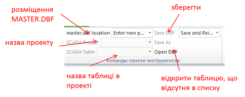

Рис.Д2.2.3. Команди Project DBF Add-In 

Якщо головна база даних проектів підключена, в списку проектів можна вибрати необхідний проект. Після вибору проекту необхідно вибрати таблицю в проекті, яку потрібно редагувати. Нижче наведено призначення деяких найбільш вживаних таблиць:

·     Variables Tags - "Переменные теги"

·     Analog Alarms – "Аналоговые Алармы"

·     Digital Alarms – "Дискретные Алармы"

·     Trend Tags – "Теги Трендов"

Зверніть увагу, що **в один момент часу таблиця для редагування може бути відкритою або в редакторі проектів або в** **Excel**. 

Редагування таблиць проводиться так само, як електронних таблиць Excel. Не можна редагувати поля в першому рядку, так як вони є заголовними. Деякі поля таблиць є надмірно широкими, тому для зручності редагування можна виділити весь зміст сторінки, в контекстному меню колонки вибрати ширину стовпця і налаштувати її рівною 10 (рис.Д2.2.4). 

Назва полів відповідає їх призначенню. Подивившись існуючі записи можна доволі легко визначити призначення кожного поля. Поля, призначення яких незрозуміле, краще не заповнювати, так як на тому місці може бути службова інформація, яку генерує сам редактор або компілятор Vijeo Citect. 

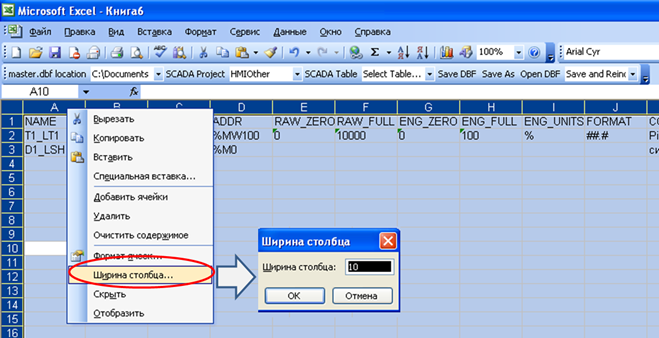

Рис.Д2.2.4. Робота з таблицями в Project DBF Add-In 

Після внесення змін в таблицю її необхідно зберегти за допомогою команди "Save DBF". Після завершення редагування, таблицю необхідно закрити і перевірити на цілісність в редакторі проектів. 

**
**

**Додаток 2.3. Налаштування змінних тегів у** **Vijeo** **Citect** 

У Vijeo Citect усі змінні діляться на ***змінні теги\*** ("Переменные теги") та ***локальні змінні\*** "Локальные переменные". 

Змінні теги потребують означення зовнішнього джерела даних, наприклад контролера. Вони представляють копію (додатково перетворену та оброблену) змінних на ***пристроях вводу/виводу\*** ("Устройства в/в"). Пристрої вводу/виводу у свою чергу належать **серверу вводу/виводу**, тому ці змінні обробляються саме в цій частині виконавчої системи. Інші складові виконавчої системи, по суті, звертаються до цих змінних для читання та запису. Таким чином, одна і та сама змінна доступна в багатьох місцях виконавчої системи. Змінні попередньо обробляються шляхом масштабування, аналізу якості (достовірності) та мають додаткові налаштування для відображення за замовченням. Кількість змінних тегів є показником інформаційної складності проекту та впливає на вартість ліцензії середовища виконання. Це є причиною "економії тегів", яка приводить до різного роду хитрощів розробників, упакування бітів в слова, буферний обмін, тощо.   

На відміну від змінних тегів, локальні змінні не є частиною серверу вводу/виводу. Ці змінні належать клієнтам (наприклад графічній підсистемі), тому у кожного клієнта своя копія цих змінних. Оскільки у змінних немає зовнішнього джерела, ніякого перетворення, означення адреси для них не потрібно. Кількість локальних змінних не впливає на вартість ліцензії.     

Для кожного змінного тега Vijeo Citect необхідно вказати ім'я, тип, назву пристрою з якого змінна зчитується та записується, адресу а також інші опційні властивості (див. рис.Д2.3.1).  

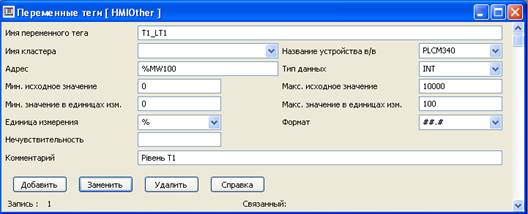

Рис. Д2.3.1.Основні поля налаштування змінного тега Vijeo Citect

**Ім'я** змінного тегу може містити літери латинського алфавіту, цифри, символи "_" та "'\", починатися з літери або "_" та не перевищувати 79 символів. У Vijeo Citect є свої рекомендації щодо структурування найменування, однак вони не є обов’язковими (деталі в довідці Using Vijeo Citect > Tagging Process Variables > Tag Naming > Using structured tag names ). 

**Тип даних** задає як інтерпретується адреса даних на пристроїв вводу/виводу. У таблиці Д3.1 показані деякі типи даних Vijeo Citect, які можуть знадобитися в лабораторній роботі. 

Таблиця Д3.1. Деякі типи даних Vijeo Citect.   

| **Тип даних** | **Пояснення**                                                | **Розмір**          | **Діапазон**                    |
| ------------- | ------------------------------------------------------------ | ------------------- | ------------------------------- |
| DIGITAL       | Digital                                                      | 1 bit або 1 byte    | 0 or 1                          |
| INT           | Integer                                                      | 2 bytes             | -32,768 to 32,767               |
| UINT          | Unsigned  Integer                                            | 2 bytes             | 0 до 65,535                     |
| LONG          | Long Integer                                                 | 4 bytes             | -2,147,483,648 до 2,147,483,647 |
| ULONG         | Unsigned  Long Integer   (тільки для відображення на екрані. Не підтримує арифметичні операції) | 4 bytes             | 0 to 4,294,967,295              |
| REAL          | Floating Point                                               | 4 bytes             | -3.4E38 до 3.4E38               |
| STRING        | String                                                       | 256 bytes (maximum) | ASCII (null terminated)         |

 

У Vijeo Citect найменування багатьох типів не співпадає з аналогічними в ПЛК, тобто IEC 61131. Однак неважко здогадатися, що типу DIGITAL в програмованому контролері буде відповідати BOOL або EBOOL, типам LONG та ULONG – DINT та UDINT відповідно. 

Слід звернути увагу також на те, що Vijeo Citect не підтримує тип TIME. У свою чергу тип TIME в UNITY PRO (відповідно до IEC 61131) займає два слова (тобто дві комірки в області %MW) і містить значення в мілісекундах. Тому для використання TIME у Vijeo Citect слід використовувати тип ULONG а також зробити відповідні налаштування масштабування, наприклад для вказівки в секундах вказується 1(Citect):1000(PLC).    

**Адреса** вказує на розміщення даних в джерелі даних (контролері). Формат адреси залежить від типу пристрою та драйверу зв’язку. Для драйверу типу MODNET30 (Modbus/TCP для ПЛК з Unity PRO), адреса задається аналогічно як в Unity PRO: наприклад *%M7* або *%MW3*. Можна також звертатися до біта слова вказуючи крапку, наприклад *%MW4.6.* 

Слід зазначити, що у випадку, коли змінна BOOL/EBOOL в Unity PRO прив’язана до адреси %MW, вона займає один байт. Тому для коректного його відображення у Vijeo Citect треба вказати номер %MW та номер біту. Наприклад (див рис. Д2.3.2), якщо в структурній змінній Unity PRO TC1_PARA два поля прив’язані до адреси %MW309, то перше поле (rev_dir) буде адресуватися як %MW309.0, а друге (en_rcpy) як %MW309.8.   

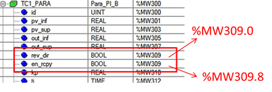

Рис. Д2.3.2. Правильне означення адреси тега у Vijeo Citect що вказує на BOOL/EBOOL в Unity PRO, прив’язаного до комірки %MW

Vijeo Citect підтримує роботу з масивами. Розмір масиву вказується в адресі в квадратних дужках. Наприклад (рис.Д2.3.3), змінна з ім'ям HEA_TT1_SP та адресою %MW220[6] буде вказувати на масив з 6-ти елементів, починаючи з %MW220 (%MW220…%MW225). При зверненні до елементу масиву в проекті, вказується ім'я змінної та індекс починаючи з 0-го. Наприклад HEA_TT1_SP[5] буде вказувати на останній елемент масиву.  

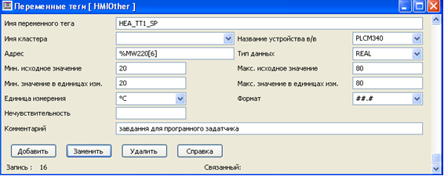

 Рис.Д2.3.3. Налаштування масиву

Типи даних REAL, LONG або ULONG (DINT або UDINT в Unity PRO) використовують дві суміжні комірки (наприклад %MW100 та %MW101) для розміщення своїх даних. Тим не менше у Vjeo Citect вказується адреса тільки першої, друга буде взята автоматично, так як типом означений і розмір. У більшості випадків такі змінні повинні знаходитися тільки по парним або непарним адресам, інакше вони можуть перекриватися. Компілятор Vijeo Citect контролює це розміщення і може при компіляції видати повідомлення про помилку (див. рис.Д2.3.4).

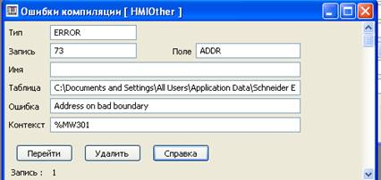

Рис.Д2.3.4. Повідомлення про помилку розміщення змінних за адресами

У випадку, якщо адреси розміщення таких змінних не можна змінити, необхідно відключити цю опцію, виставивши в Citect.ini параметр [General]CheckAddressBoundary = 0 (рис.Д2.3.5). Для цього треба запустити редактор Citect.ini ("Инструменты"->"Редактор конфигурирования компьютера"), зайти в розділ General, вибрати з правого боку потрібний параметр, який після цього добавиться в поле заповнення параметрів (Parameter Details). Параметр змінюється в полі Value (задати 0), а добавляється запис натисканням кнопки "Add". Після "File"->"Save" параметр буде добавлений в Citect.ini, після чого редактор треба закрити.    

 

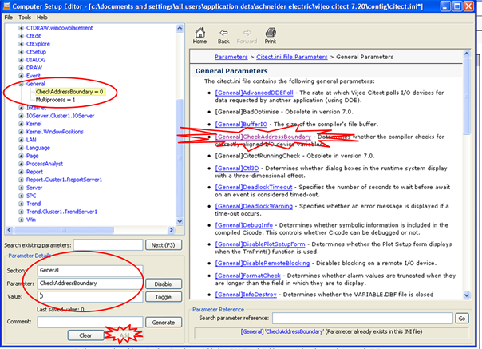

Рис.Д2.3.5 Добавлення параметру [General]CheckAddressBoundary = 0 в Citect.ini

**Масштабування та обмеження змінної** задається полями:

·     "Мин. исходное значения" – мінімальне значення в джерелі даних (в контролері)

·     "Макс. исходное значения" – максимальне значення в джерелі даних (в контролері)

·     "Мин. значения в единицах изм." – мінімальне значення в Vijeo Citect (в IOServer)

·     "Макс. значения в единицах изм." – максимальне значення в Vijeo Citect (в IOServer)

Значення з джерела даних (контролера) також називається ***сирим\*** (raw). Використовується класичне лінійне масштабування. Окрім масштабування, ці межі використовуються для контролю валідності змінної (відповідності діапазону) та значення вводу оператору.

**Формат відображення** використовується для означення вигляду числового зображення даної змінної за замовчуванням. Якщо для числового поля не вказується формат він буде братися зі змінної, що доволі зручно при створенні анімаційних бібліотечних елементів (наприклад джинів). Для прикладу, якщо формат заданий "####.## EU" то числове значення буде відображатися в форматі "123.45 кг", де " EU" вказує на **одиниці вимірювання**, які теж вказуються в налаштуваннях тегу.

  