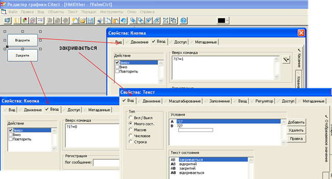

# Лабораторна робота №4

**Тема. Розробки тривогової підсистеми в** **SCADA/HMI.**

 

**Тривалість**: 4 акад. години (4 пари).

**Мета:** ознайомлення з принципами розробки тривогової підсистеми, роботи з пристроями, шрифтами, джинами та спливаючими вікнами.  

**Завдання для виконання роботи**

**Цілі.** 

\1.   Опанувати основні діяльності з налаштування тривог Vijeo Citect та їх відображення.

\2.   Опанувати основні діяльності зі створення та використання джинів (Genie) та спливаючих сторінок. 

\3.   Опанувати основні діяльності з налаштування пристрїв Vijeo Citect. 

**Лабораторна установка**

Апаратне забезпечення: ПК. 

Програмне забезпечення: UNITY PRO V>=4.0, Vijeo Citect 7.2 (або новіше).

**Порядок виконання роботи** 

\1.   Поверхово ознайомтеся зі змістом всіх додатків до лабораторної роботи.

\2.   Завантажте в імітатор контролера підготовлений проект Unity PRO, що описаний у файлі "Завдання". Запустіть його на виконання. Перевірте його працездатність.

\3.   Запустіть середовище розробки Vijeo Citect 7.2. Зробіть відновлення свого проекту з резервної копії, збереженої минулої лабораторної роботи. За необхідності, зробіть компіляцію проекту. Запустіть свій проект на виконання і перевірте його працездатність, наприклад, змінюючи одну зі мінних у Vijeo Citect і перевіряючи ці зміни в імітаторі ПЛК.   

\4.   Зробіть зображення клапану, який буде показувати команду що одається на виконавчий механізм і його стан. Для цього відкрийте сторінку "Tanks" і використовуючи елементи полігон, прямокутник і пряму нарисуйте зображення клапану біля існуючого набірного для танку 2 (T2_LVS2), як це показано на рис.4.1. Зробіть анімацію кольору прямокутника з прив’язкою до T2_LVS2: при 0 – сірий, при 1 – білий. Запустіть проект на виконання і перевірте його роботу. 

Рис.4.1 Зображення клапану та анімації кольору

\5.   Уважно прочитайте Додаток 4.3. Реалізуйте клапан через джин. Для цього спочатку створіть новий джин і перенесіть створені до цього елементи в джин. Замініть прив’язку T2_LVS2 на %VALVE%. Збережіть його з іменем "DValveH" у бібліотеці MyGeans. 

\6.   На сторінці "Tanks" помістіть біля існуючих дискретних клапанів джини "DValveH". Прив’яжіть їх до відповідних значень змінних тегів. Збережіть сторінку, скомпілюйте і перевірте її роботу. Прямокутник на клапані показує команду на виконавчий механізм. 

\7.   Змініть джин так, щоб зображення клапану показувало стан кінцевого положення датчика закриття. Для цього для полігона визначте анімацію, як це показано на рис.4.2. Збережіть джин, збережіть сторінку "Tanks", скомпілюйте проект і перевірте його роботу.

 

Рис.4.2 Налаштування анімації полігону

\8.   Створіть сторінку на основі шаблону "blank" з наступними властивостями:  

Таб.4.1.Налаштування сторінки.

| **Властивість** | **Значення**       |
| --------------- | ------------------ |
| Ширина          | 400                |
| Висота          | 200                |
| Колір           | Color80  (сірий)   |
| Заголовок вікна | Керування клапаном |

Розмістіть на сторінці дві кнопки та числове поле. Налаштуйте їх анімацію таким чином, щоб асоціація 1 використовувалася для команди керування клапаном, а 2 – для кінцевого положення "закрито" клапана (див. рис.4.3) 

 Рис.4.3 Налаштування сторінки

 

Розмістіть на сторінці кнопку для закриття вікна. Використайте анімацію "Касание" та функцію WinFree (див. Д4.6.1.). Збережіть сторінку з іменем "!ValveCtrl".

\9.   Уважно прочитайте Додатки Д4.4 та Д4.6.2. У джині для прямокутника використайте анімацію "Касание" для означення відкриття сторінки керування клапаном з передачею туди замінників (див.рис.4.4). Зверніть увагу на те, що замінники у функції AssPopUp беруться в лапки.  

 

Рис.4.4 Налаштування анімації відкриття сторінки керування клапаном

Збережіть послідовно одна за одною: спливаючу сторінку, джин, сторінку "Tanks", після чого скомпілюйте та запустіть на виконання проект. 

\10. Подивіться якою мовою відображаються написи у системі виконання. Якщо мова англійська - можете змінити мову на російську, скопіювавши файл "Russian.dbf" з директорії проекту "Example" в свою. Якщо після повторної компіляції і перезапуску системи мова залишилась англійською – запустіть проект "Example", змініть мову на російську через меню утиліт, і знову запустіть на виконання свій проект.  

\11. Перевірте чи створений тривоговий сервер. Якщо немає – створіть його з іменем "AlarmServer1".

\12. Уважно прочитайте додаток Д4.5. Створіть шрифти для тривог категорії 1 та категорії 2 відповідно до вказаних полів в таблиці 4.2. Не вказані поля залиште порожніми. 

Таб.4.2.Налаштування шрифтів.

| **Назва**        | **Тип шрифта** | **Розмір** | **Колір тексту** | **Миготіння тексту** |
| ---------------- | -------------- | ---------- | ---------------- | -------------------- |
| AlmUnAckON_cat1  | Arial          | -10        | LIGHT_RED        | RED                  |
| AlmUnAckOFF_cat1 | Arial          | -10        | LIGHT_RED        | DARK_GREY            |
| AlmAckON_cat1    | Arial          | -10        | LIGHT_RED        | LIGHT_RED            |
| AlmAckOFF_cat1   | Arial          | -10        | BLACK            | BLACK                |
| AlmUnAckON_cat2  | Arial          | -10        | YELLOW           | RED                  |
| AlmUnAckOFF_cat2 | Arial          | -10        | YELLOW           | DARK_GREY            |
| AlmAckON_cat2    | Arial          | -10        | YELLOW           | LIGHT_RED            |
| AlmAckOFF_cat2   | Arial          | -10        | YELLOW           | BLACK                |

 

\13. Створіть або модифікуйте категорії з номерами 1 та 2 відповідно до вказаних полів в таблиці 4.3. Не вказані поля залиште порожніми. 

Таб.4.3.Налаштування категорій.

| **Номер** | **Шрифт для неактивних  тривог неквітируваний** | **Шрифт для неактивних  тривог квітируваний** | **Шрифт для активних тривог  неквітируваний** | **Шрифт для активних тривог  квітируваний** | **Коментар**              |
| --------- | ----------------------------------------------- | --------------------------------------------- | --------------------------------------------- | ------------------------------------------- | ------------------------- |
| 1         | AlmUnAckOFF_cat1                                | AlmAckOFF_cat1                                | AlmUnAckON_cat1                               | AlmAckON_cat1                               | Категорія для аварій      |
| 2         | AlmUnAckOFF_cat2                                | AlmAckOFF_cat2                                | AlmUnAckON_cat2                               | AlmAckON_cat2                               | Категорія для попереджень |

 

\14. Уважно прочитайте додатки 4.1.1, 4.1.2 та 4.1.3. Створіть дискретну тривогу D1_LVS1_ALCLS, відповідно до рис.4.5. Після створення перевірте роботу тривоги:

1. 1. скомпілюйте проект та запустіть його на      виконання, обов’язково попередньо закривши Runtime;
   2. Змініть значення DIFRC[10]=1 на сторінці      Startup або в      операторському екрані UnityPRO.
   3. Змінюючи змінну D1_LVS1_ALCLS      з використанням сторінки активних тривог та команд підтвердження тривог      перевірте роботу тривоги. Після усіх змін подивіться журнал для цієї      тривоги на сторінці зведення тривог. Не забудьте про необхідність      реєстрації користувача для можливості підтвердження (квітирування).  

Рис.4.5 Налаштування дискретної тривоги

 

\15. Використовуючи вимоги до реалізації підсистеми тривог з файлу "Завдання" реалізуйте у проекті усі інші дискретні тривоги. Перевірте роботу в Runtime на одній з довільно вибраних.

\16. Уважно прочитайте додаток 4.1.4. Створіть аналогову тривогу HEA_TT1_WRN, відповідно до рис.4.6. Після створення перевірте роботу тривоги:

1. 1. скомпілюйте проект та запустіть його на      виконання, попередньо закривши Runtime попередньої версії проекту;
   2. Змініть значення AIFRC[4]=1 на сторінці Startup або в      операторському екрані UnityPRO.
   3. Змінюючи змінну HEA_TT1 з використанням сторінки активних      тривог та команд підтвердження тривог перевірте роботу тривоги. Після      усіх змін подивіться журнал для цієї тривоги на сторінці зведення тривог.      Не забудьте про необхідність реєстрації користувача для можливості      підтвердження (квітирування).  

Рис.4.6 Налаштування аналогової тривоги

\17.  Використовуючи вимоги до реалізації підсистеми тривог з файлу "Завдання" реалізуйте у проекті усі інші аналогові тривоги. У назвах тривог використовуйте суфікс WRN для попереджень і ALRT для аварій. Перевірте роботу в Runtime усіх аналогових тривог.

\18. Уважно прочитайте додаток Д4.1.6. Створіть новий джин на якому розмістіть числове поле, що відображає %TAG%. Розмістіть позаду числового поля в якості підкладки два прямокутники однакового розміру. Колір фону найнижчого прямокутнику повинен залежати від стану тривоги-попередження, а вищого – від стану тривоги-аварії (див. рис.4.7). При непідтвердженій тривозі прямокутники повинні миготіти, а при наявності підтвердженої світитися постійно. 

При збереженні налаштувань Vijeo Citect може запропонувати створити нові теги, що не потрібно робити в даному випадку. Збережіть джин з назвою "AInd", використайте його для відображення температур HEA_TT1 та HEA_TT2. Запустіть на виконання систему, перевірте роботу джинів.

 

Рис.4.7 Налаштування фонів відображення елементів джина в залежності від стану тривоги

 

\19. Зробіть можливість підтвердження тривоги подвійним натисканням по елементу. Для цього модифікуйте джин прописавши в числовий вираз дію по подвійному кліку (див. рис.4.8). 

Рис.4.8 Налаштування реакції на подвійний клік миші по елементу

\20. Аналогічно реалізуйте підкладки для клапанів. Вони повинні змінювати свій колір від стану тривог помилок відкриття та закриття:

1. 1.  при будь якій непідтвердженій тривозі      миготіти червоним;
   2. при      наявності будь-якої підтвердженої тривоги світитися червоним. 

Відкрийте джин "DValveH" і розмістіть у ньому прямокутник в якості підкладки на задньому фоні клапана. Налаштуйте анімацію кольору, як це показано на рис.4.9.

Збережіть джин, відкрийте та збережіть сторінку "Tanks". Запустіть Runtime, Змініть значення DIFRC[10]=1 на сторінці Startup або в операторському екрані UnityPRO. Змінюючи змінну D1_LVS1_ALCLS та команди квітування перевірте роботу анімації.  

Рис.4.9 Налаштування фону відображення підкладки джина в залежності від стану тривоги

 

\21. У редакторі графіки відкрийте сторінку "!ValveCtrl". Зробіть щоб при наявності тривог на сторінці з’являлися написи відповідних повідомлень помилок клапанів. Подвійний клік по напису повинен робити підтвердження. Для цього розмістіть на сторінці два елементи "текст" і налаштуйте їх властивості так, як показано на рис.4.10. Збережіть сторінку. 

Рис.4.10 Налаштування відображення повідомлень помилок відкриття та закриття клапанів на вікні керування клапаном

1. Модифікуйте джин "DValveH" так, щоб додатково до команди та     стану клапану передавалися стани тривог (див. рис.4.11). Збережіть джин.     Збережіть сторінку "Tank".     Скомпілюйте проект та перевірте функціональність сторінок.

Рис.4.11 Налаштування відкриття сторінки з передачею змінних для асоціацій

 

1.  Уважно ознайомтеся з додатком Д4.2.     Створіть пристрій для ведення журналу подій з іменем MsgLog з налаштуваннями, як показано на рис.4.12.  

Рис.4.12 Налаштування пристрою

1. Створіть категорію тривог     з номером 3, яка призначена тільки для ведення журналу виникнення подій.     Налаштуйте категорію відповідно до рис.4.13

Рис.4.13 Налаштування категорії 3 для подій

 

1.  Уважно ознайомтеся з вимогами до     реалізації підсистеми ведення журналу подій з файлу "Завдання".     Створіть дискретний аларм для реалізації запису в журнал події переведення     контуру регулювання температури в автоматичний режим (рис.4.14).

 

Рис.4.14 Налаштування дискретної тривоги (події)

1. Скомпілюйте проект. Перед     запуском налаштуйте щоб архівні дані зберігалися в директорії C:\CDATA\xxx, де XXX – назва вашого проекту. Це     можна зробити використовуючи майстер налаштування комп’ютеру, як це     показано на рис.4.15.  

 

 Рис.4.15 Налаштування місця розміщення папки з архівними файлами

 

1.  Запустіть на виконання проект. Декілька     раз змініть значення змінної HEA_TC1_AUTO. Знайдіть в     директорії з архівними даними файл "MsgLog.txt". Подивіться які записи     там з’явилися.
2. Створіть дискретні тривоги     з категорією 3 для реалізації інших повідомлень, що наведені в     вимогах, за виключенням останніх     двох (реєстрація користувачів та відкриття сторінки налаштувань).     Перевірте чи ведеться запис повідомлень. 
3. Уважно ознайомтеся з     додатком Д4.2.2. Створіть нову сторінку на базі шаблону "file". Прив’яжіть до неї файл "[DATA]:MsgLog.txt". Збережіть сторінку під     іменем "LogView".     Скомпілюйте проект, перевірте функціональність сторінки. 

 

**Питання до захисту** 

1. Яке призначення і     принципи функціонування підсистеми керування тривогами? Розкажіть про     діаграму станів тривоги VijeoCitect. Покажіть на прикладі працюючого     проекту можливу поведінку тривоги в кожному стані.
2. Що таке тривога? Як     оператор може дізнатися про тривогу? Навіщо потрібне підтвердження (квітування)     тривоги? Розкажіть як це робиться у виконавчій системі VijeoCitect.
3. Навіщо потрібна заборона     тривоги? Покажіть яким чином у VijeoCitect проводиться заборона тривог.     Поясніть навіщо це потрібно.
4. Розкажіть про призначення     фільтрів у переглядачах тривог та подій?
5. Розкажіть про принципи     роботи дискретних та аналогових тривог?
6. Чим події відрізняються     від тривог? Наведіть приклади подій. Де фіксуються події і як переглянути     їх історію.
7. Які основні типи тривог     можна означити у системі VijeoCitect? Розкажіть про призначення цих     тривог. 
8. Розкажіть про призначення     та налаштування дискретних та мультидискретних тривог. Покажіть на     прикладі.
9. Розкажіть про призначення     та налаштування аналогових тривог. Покажіть на прикладі.
10. Розкажіть про призначення     та налаштування категорії тривог. Покажіть на прикладі.
11. Розкажіть про призначення     журналів тривог. Яка інформація туди записується? 
12. Покажіть на прикладі     використання елементів та вікна активних тривог, зведення тривог (сводки).     
13. Для яких цілей можуть ви     користуватися пристрої ("устройства", "devices") у     VijeoCitect? Які типи пристроїв при цьому використовуються? 
14. Як налаштовується глибина     запису даних журналу в пристрої (логу)? Покажіть на прикладі.
15. Розкажіть про призначення     поля формату в пристрої. Які значення там можуть використовуватися?     Покажіть на прикладі.
16. Покажіть на прикладі яким     чином проводиться запис в журнал подій. Як можна вивести цей журнал в     системі VijeoCitect?
17. Розкажіть та покажіть на     прикладах механізми використання джинів.
18. Розкажіть та покажіть на     прикладах механізми використання суперджинів та спливаючих сторінок з     асоціаціями.

 

**
**

**Додаток 4.1. Базові можливості налаштування тривогової підсистеми** **Vijeo** **Citect** 

**Д4.1.1. Загальні відомості** 

Автомат станів тривог, що реалізований у Vijeo Citect показаний на рис.Д4.1.2. На відміну від підсистем тривог деяких SCADA, у даного продукту немає тривог, що не потребують підтвердження. Тому для реалізації такого типу тривог необхідно робити механізми само-підтвердження.  

 

Рис.Д4.1.2 Автомат станів тривог

Vijeo Citect підтримує два типи тривог (Alarm):

·     ***Апаратні тривоги\*** (Аппаратные тревоги, Hardware alarms). Ці тривоги пов’язані з роботою самої системи Vijeo Citect і не потребують конфігурування. Апаратні тривоги можуть виникати, наприклад, за причин комунікаційних помилок, чи помилок в роботі Cicode-функцій, тощо.

·     ***Конфігуровані тривоги\*** (Configured alarms). Ці тривоги конфігуруються розробником проекту самостійно.

Для роботи конфігурованих тривог створюються ***теги тривог\*** (тег аларма, Alarm Tag). Теги тривог належать ***тривоговому серверу\*** (аларм сервер, Alarm Server), який попередньо треба створити ("Сервера"->"Серверы алармов"). При створенні локального серверу в standalone рішенні достатньо вказати ім’я серверу.

Більшість тегів тривог обробляються кожні [Alarm]ScanTime (задається в Citect.ini). Якщо в цей час умова спрацювання виконується – тривога вмикається. 

У Vijeo Citect 7.2, у залежності від умови спрацювання, теги тривог у свою чергу поділяються на (див. рис.Д4.1.2): 

\-     Дискретні тривоги (Дискретные алармы, Digital Alarms): спрацьовують у залежності від стану 2-х дискретних змінних тегів (див. Д4.1.3).

\-     Мульти-дискретні тривоги (Мульти-дискретные тревоги, Multi-digital Alarms): спрацьовують в залежності від комбінації станів 3-х дискретних змінних тегів, мають додаткові налаштування (див. Д4.1.3);

\-     Аналогові тривоги (Аналоговые алармы, Analog Alarms): спрацьовують в залежності від значення аналогового змінного тегу (див. Д4.1.4); 

\-     Розширені тривоги (Расширенные алармы, Advanced Alarms): спрацьовують в залежності від значення Cicode виразу (див.Д4.1.5); 

\-     Тривоги з відміткою часу (Хронологические алармы, Time-stamped Alarms): подібні до дискретної тривоги, за винятком того, що відмітка часу спрацювання береться з окремої змінної-лічильника; 

\-     Дискретні тривоги з відміткою часу (Хронологические дискретные алармы, Time-stamped Digital Alarms): подібні до дискретної тривоги, за винятком того, що дискретні теги тривоги оновлюються за підпискою від сервера вводу/виводу; відмітка часу береться зі змінного тегу; 

\-     Аналогові тривоги з відміткою часу (Хронологические аналоговые алармы, Time-stamped Analog Alarms): подібні до аналогової тривоги, за винятком того, що аналогові теги тривоги оновлюються за підпискою від сервера вводу/виводу; відмітка часу береться зі змінного тегу;

Рис.Д4.1.2 Виклик редактору конфігурованих тривог відповідно до їх типу 

Теги тривог мають унікальне ім’я. Крім того, для кожного тегу тривоги можна вказати ***назву тривоги\*** ("Название аларма"). Тут, як правило, вказується ім’я фізичного пристрою, з яким пов'язана тривога. Додатково до назви можна вказати ***опис тривоги\*** ("Описание аларма") який можна буде вивести оператору для кращого розуміння причин виникнення тривоги.  

Для означення поведінки тривоги, використовується ***категорія тривоги\*** (категория алармов, Alarm Category). Якщо номер категорії не вказується, то вважається що це категорія 0. Детальніше про категорії тривог описано в Д4.1.2. 

Для кожної тривоги можна також вказати сторінку допомоги, яка буде автоматично викликатися при виникненні тривоги або за дією оператору. Ця сторінка може містити інформацію про дію оператору при виникненні такої тривоги. 

Тривоги можна використовувати в анімації елементів через вбудовані властивості. Детальніше про це описано в Д4.1.6.

Для тривог можна означити затримку на спрацювання (Delay). 

Для відображення тривог використовується вбудована в шаблони сторінок анімація та спеціальні сторінки:

\-     ***активних тривог\*** (Alarm Page): відображає тільки активні та непідтверджені тривоги;

\-     ***зведення тривог\*** (Summary Alarm Page): відображає історію тривог у вигляді зведення;

\-     ***апаратних тривог\*** (Hardware Alarm Page): відображає плинні апаратні тривоги;

\-     ***заблоковані тривоги\*** (Disabled Alarm Page): відображає заблоковані тривоги;

У Vijeo Citect > 7.4 також доступні сторінки з журналом історії подій та тривог ***SOE.\*** У Vijeo Citect 7.2 журнал тривог та подій необхідно вести через запис повідомлень в текстовий файл чи базу даних. Потім його можна відобразити як звичайний текстовий файл. Такий спосіб ведення журналу тривог має малу функціональність, так як не дозволяє робити повноцінну фільтрацію відображення записів за критерієм та пошук. При використанні Vijeo Citect > 7.4 рекомендується використовувати більш потужний журнал – SOE. Детальніше про організацію стандартного ведення журналу та формату відображення на сторінках тривоги описано в Д4.2, про SOE – в довідниковій системі Vijeo Citect > 7.4. 

**Д4.1.2. Категорія тривог (Alarm Category)** 

Форма для налаштування категорії тривог показана на рис.Д4.1.3. Кожна категорія має свій номер. У Vijeo Citect 7.2 деякі номера категорій зарезервовані:

0 – категорія за замовченням, тобто якщо в налаштуваннях тривоги не вказується номер категорії, вважається 0; 

254 – для зведення тривог (Alarm Summary)

255 – для апаратних тривог (Hardware Alarm) 

Якщо в проекті не створені категорії з зарезервованими номерами, для них використовуються властивості за замовченням.   

Рис.Д4.1.3 Налаштування категорії тривоги  

Пріоритет тривоги задає послідовність відображення активних тривог в списку. 0 – найвищий пріоритет, 255 – найнижчий. За замовченням використовується пріоритет 0.

 Для категорії можна вказати, чи необхідно виводити дану тривогу на сторінці тривог та зведених тривог. 

Для кожного стану тривог задається шрифт відображення (детальніше про шрифти читайте в Д4.5). При переході в ці стани можна виконувати Cicode команди ("Действие при переходе …"). 

Для ряду тривог можна в полі "Зона" задати номер ***області\*** (***зони\*,** ***area\***) процесу, до якого відноситься тривога. Тільки оператор, що має доступ до цієї області буде мати можливість бачити та підтверджувати ці тривоги. Поле "Привилегии" задає номер привілеї, яку повинен мати оператор, щоб могти підтвердити або заблокувати тривоги.   

Якщо тільки одна тривога з набору повинна відображатися, їх можна об’єднувати в ***групи приглушування\***  (Группы Подавления, Suppression Group). У цьому випадку серед активних тривог в одній групі буде відображатися тільки та, яка має найнижчий ***рівень приглушування\*** (Suppression level).   

Для запису подій тривог у в файл журналу (принтер, базу даних) у вигляді зведення, пристрій вказується в полі "Устройство сводной информации", а у вигляді списку – в полі "Устройство логов". Які саме події необхідно записувати в лог-журнал вказується вибором TRUE в полях ON, OFF та ACK відповідно. Додатково про пристрої читайте в Д4.2. 

Для означення формату відображення на сторінці активних тривог та зведення тривог, використовуються відповідно поля "Формат аларма" та "Сводный формат". Якщо формати не вказані, використовуються формати за замовченням, відповідно:

{Time,12}^t {Tag,10}^t {Name,20}^t {Desc,32}

{Name,20}^t {OnTime,8}^t {OffTime,8}^t {DeltaTime,8}^t {Comment,22} 

При означенні формату, у фігурних дужках вказуються поля, та кількість літер для відображення. Між полями можна вказувати знак табуляції "^t". 

Для сторінки тривог та лог-журналу дозволяється використовувати наступні поля (не повний перелік):

Таб Д4.1. Деякі поля для сторінок та лог-журналів тривог (повний перелік див. в довідниковій системі).

| Поле              | Опис                                                         |
| ----------------- | ------------------------------------------------------------ |
| {Tag,n}           | Ім’я аларм тега                                              |
| {AlarmType,n}     | Тип тривоги: наприклад "Digital"                             |
| {AlmComment,n}    | Текст, введений для тривоги в полі коментар                  |
| {Name,n}          | Текст, введений для тривоги в полі імені тривоги             |
| {Desc,n}          | Текст, введений для тривоги в полі опис тривоги              |
| {Category,n}      | Номер категорії                                              |
| {Area,n}          | Зона                                                         |
| {Priv,n}          | Привілеї                                                     |
| {Priority,n}      | Пріоритет                                                    |
| {Type,n}          | Стан тривоги: ACKNOWLEDGED, CLEARED, DISABLED, UNACKNOWLEDGED |
| {LocalTimeDate,n} | Дата та час: "yyyy-mm-dd hh:mm:ss[.ttt]"                     |
| {Time,n}          | Час останньої зміни стану (hh:mm:ss).                        |
| {Date,n}          | Дата останньої зміни стану (dd:mm:yyyy).                     |
| {Value,n}         | Плинне значення для аналогової тривоги                       |
| {State,n}         | Плинний стан аналогової тривоги: DEVIATION, RATE, LOW, LOWLOW, HIGH,  HIGHHIGH, CLEARED |
| {ErrDesc,n}       | Інформація про апаратну тривогу                              |
| {LogState,n}      | Стан тривоги (для лог-журналу)                               |

 

Для сторінки зведення дозволяється використовувати поля, які показані в таблиці Д4.2. 

Таб Д4.2. Деякі поля для сторінок зведення тривог (повний перелік див. в довідниковій системі)

| **Поле**     | **Опис**                                                     |
| ------------ | ------------------------------------------------------------ |
| {UserName,n} | Ім'я користувача, що проводив певні дії з тривогами (наприклад  підтвердження) |
| {FullName,n} | Повне ім'я користувача, що проводив певні дії з тривогами (наприклад  підтвердження) |
| {UserDesc,n} | Текст зв’язаний з подією, записаний користувачем             |
| {OnDate,n}   | Дата виникнення тривоги                                      |
| {OnTime,n}   | Час виникнення тривоги                                       |
| {OffDate,n}  | Дата повернення тривоги в нормальний стан                    |
| {OffTime,n}  | Час повернення тривоги в нормальний стан                     |
| {AckDate,n}  | Дата підтвердження тривоги                                   |
| {AckTime,n}  | Час підтвердження тривоги                                    |
| {SumState,n} | Плинний стан тривоги                                         |
| {SumDesc,n}  | Плинний опис тривоги                                         |
| {SumType,n}  | Стан тривоги: ACKNOWLEDGED, CLEARED, DISABLED, UNACKNOWLEDGED |
| {Comment,n}  | Коментар, який вводить оператор в режимі виконання           |

**Д4.1.3. Дискретні та мульти-дискретні тривоги** 

Дискретна тривога виникає тоді, коли тег А та тег В будуть дорівнювати TRUE (див. рис.Д4.1.4). Якщо поле "Переменный тег В" порожнє, перевіряється тільки тег А. У поля можна також вставляти перед тегами оператор "NOT" для інверсії умови.  

Рис.Д4.1.4 Налаштування дискретної тривоги

Для мульти-дискретних тривог (рис.Д4.1.5) на стан тривоги може вплинути комбінація станів з трьох змінних, які вказуються в полях тегів A, B та C. Для кожного стану (8 комбінацій) задається опис тривоги та необхідність задіяння комбінації для активації тривоги (1 – задіяти, 0 – не задіяти). Поле "Повторный аларм" задає, чи треба генерувати нову тривогу при переході з одного стану активної тривоги в інший стан активної тривоги.

Для переходу між станами тривоги можна задати функцію, яка буде викликатися. 

Про усі інші поля можна ознайомитися в Д4.1.1. 

Рис.Д4.1.5 Налаштування мульти-дискретної тривоги

**Д4.1.4. Аналогові тривоги**  

Аналогові тривоги спрацьовують при виході значення аналогової змінної за межи одного або декількох заданих меж. Кожна тривога може бути налаштована як будь-яка комбінація наступних типів:

\-     тривога високого (high alarm) і критично високого значення (high high alarm) 

\-     тривога низького (low alarm) і критично низького значення (low low alarm)

\-     тривога відхилення (deviation alarm), коли значення відхиляється від заздалегідь означеної уставки;

\-     тривога швидкої зміни (rate of change alarm), коли значення змінної змінюється дуже швидко;

У налаштуванні тривоги вказується змінний тег, значення якого буде перевірятися (див. рис. Д4.1.6). У поле "Уставка" (Setpoint) за необхідності задається значення, яке буде використовуватися для тривоги відхилення. Для кожної межі можна задати значення, проходячи через яку (вверх для високого та критично високого, вниз для низького та критично низького) буде генеруватися тривога. Окрім значення також можна задати затримку. 

Поле "Нечувствительность" (Deadband) можна використати для встановлення значення, на яке відносно уставки повинна змінитися змінна, щоб тривога деактивувалася.

У полі "Скорость" (Rate) можна задати значення, яке буде використовуватися в якості максимально-дозволеної зміни за одну секунду для тривоги швидкої зміни.   

Рис.Д4.1.6 Налаштування аналогової тривоги 

**Д4.1.5. Розширені тривоги**  

Розширені тривоги спрацьовують тоді, коли результат виконання Cicode виразу дасть TRUE. Цей вираз необхідно записати в поле "Выражение" (рис.Д4.1.7). Усі інші поля описані в Д4.1.1. 

Рис.Д4.1.7 Налаштування розширеної тривоги

**Д4.1.6. Використання властивостей тривог як тегів**  

У Vijeo Citect є можливість використовувати властивості тегів тривог в анімації та Cicode функціях, як звичайні теги. Для цього в якості імені вказується назва тегу тривоги та через крапку властивість, до якої необхідно звернутися. Наприклад, якщо необхідно дізнатися про спрацювання тривоги з іменем "CV110_ERROR", необхідно звернутися до властивості "On". Тобто:

CV110_ERROR.On

Перелік властивостей даний в таблиці Д4.3.

Таб Д4.3. Деякі властивості тегів тривог (повний перелік див. в довідниковій системі)

| **Властивість**                      | **Опис**                                         | **Доступ**    | **Примітка**                                    |
| ------------------------------------ | ------------------------------------------------ | ------------- | ----------------------------------------------- |
| .On                                  | =1  – Тривога активна                            | читання       |                                                 |
| .Ack                                 | =1  – Тривога підтверджена                       | читання/запис |                                                 |
| .Disabled                            | =1  – Тривога заблокована                        | читання/запис |                                                 |
| .Name                                | Ім’я  тривоги                                    | читання       | аналогічне  полю налаштування тривоги           |
| .State                               | Стан  тривоги                                    | читання       | числове  значення, див. довідникову систему     |
| .Desc                                | Опис  тривоги                                    | читання       | аналогічне  полю налаштування аналогових тривог |
| .Tag                                 | Ім’я  тегу тривоги                               | читання       | аналогічне  полю налаштування тривоги           |
| .DVL                                 | =1  – активна тривога відхилення (вниз)          | читання       | тільки  для аналогових тривог                   |
| .DVH                                 | =1  – активна тривога відхилення (вверх)         | читання       | тільки  для аналогових тривог                   |
| .R                                   | =1  – активна тривога швидкої зміни значення     | читання       | тільки  для аналогових тривог                   |
| .L                                   | =1  – активна тривога низького значення          | читання       | тільки  для аналогових тривог                   |
| .H                                   | =1  – активна тривога високого значення          | читання       | тільки  для аналогових тривог                   |
| .LL                                  | =1  – активна тривога критично низького значення | читання       | тільки  для аналогових тривог                   |
| .HH                                  | =1  – активна тривога критично високого значення | читання       | тільки  для аналогових тривог                   |
| .Value                               | значення  змінного тега для тривоги              | читання       | тільки  для аналогових тривог                   |
| .DeadBand                            | налаштування  зони нечутливості                  | читання/запис | аналогічне  полю налаштування аналогових тривог |
| .Deviation                           | налаштування  значення відхилення                | читання/запис | аналогічне  полю налаштування аналогових тривог |
| .HighHigh                            | налаштування  критично високого значення         | читання/запис | аналогічне  полю налаштування аналогових тривог |
| .High                                | налаштування  високого значення                  | читання/запис | аналогічне  полю налаштування аналогових тривог |
| .LowLow                              | налаштування  критично низького значення         | читання/запис | аналогічне  полю налаштування аналогових тривог |
| .Low                                 | налаштування  низького значення                  | читання/запис | аналогічне  полю налаштування аналогових тривог |
| .HHDelay,.HDelay,  .LDelay, .LLDelay | налаштування  затримок спрацювання               | читання/запис | аналогічне  полю налаштування аналогових тривог |
| .Rate                                | налаштування  швидкості зміни                    | читання/запис | аналогічне  полю налаштування аналогових тривог |
| .Setpoint                            | налаштування  уставки для тривоги відхилення     | читання/запис | аналогічне  полю налаштування аналогових тривог |

 

  

**
**

**Додаток 4.2. Пристрої (****Device****) та ведення журналу дій оператору**  

**Д4.2.1. Пристрої** 

***Пристрої\*** (Устройства, Device) надають користувачу можливість обмінюватися Vijeo Citect з файлами, принтерами та СУБД. Пристрої створюються в розділі "Система->Устройства". Для пристрою вказується тип (див.рис Д4.2.1), який можна вибрати з ряду: 

\-     RTF files 

\-     ASCII files 

\-     dBASE databases 

\-     SQL databases (через ODBC) 

\-     Printers (Принтери) 

Рис.Д4.2.1 Налаштування пристроїв

Для файлів в полі "Имя файла" задається ім’я файлу. Шлях до директорії можна вказати з використанням параметру. Наприклад, наступний запис буде вказувати на те, що розміщення файлу буде завдатися параметром DATA, який записується в Citect.ini або в налаштуваннях проекту ("Система"->"Параметры"). 

[DATA]: ALARMLOG.TXT

Для файлів можна вказати також періодичність створення ("Периодичность") та кількість історичних файлів ("Число файлов"). Нові файли будуть створюватися з вказаною періодичністю відносно часу, вказаного в полі "Время". Наприклад, якщо кількість файлів задати 10, періодичність 24:00:00, ім’я FileName.TXT, а час 12:00:00, то буде відбуватися наступна послідовність (див. рис.Д4.2.2):

\1.   Спочатку записи будуть вестися в файл "FileName.TXT" ;

\2.   У 12:00 наступного дня, файл буде перейменовано в "FileName.001", після чого створиться новий файл "FileName.TXT", куди буде проводитися запис;

\3.   У 12:00 3-го дня файл "FileName.001" буде перейменовано в "FileName.002", а файл "FileName.TXT" в "FileName.001", після чого створиться новий файл "FileName.TXT", куди буде проводитися запис; 

\4.   На 11-й день самий старий файл буде видалено.   

Рис.Д4.2.2 Ведення історії файлів

Якщо кількість файлів не вказано, за замовченням береться 10. Кількість фалів можна також задати рівним:

0 – без історії

-1 - запис в той же самий файл

Для означення формату запису в файл використовуються спеціальні поля. Про принципи формування формату полів для тривог описано в Д4.1.1. Тут наведемо тільки поля, які використовуються для файлу, що використовується для журналу дій оператору.

 

Таб Д4.4. Деякі поля для лог-журналів дій оператору (повний перелік див. в довідниковій системі).

| **Поле**          | **Опис**                                                     | **Примітка**                    |
| ----------------- | ------------------------------------------------------------ | ------------------------------- |
| {UserName,n}      | Ім’я  користувача                                            |                                 |
| {FullName,n}      | Повне Ім’я  користувача                                      |                                 |
| {Time,n}          | Час формування  запису в файлі                               |                                 |
| {Date,n}          | Дата формування  запису в файлі                              |                                 |
| {Page,n}          | Назва сторінки,  яка була відображена, коли відбувався запис |                                 |
| {MsgLog,n}        | Повідомлення,  яке прописано в графічному елементі або системній клавіатурній команді, що  потребує запису в журналі дій оператору |                                 |
| {Arg1,n}…{Arg8,n} | набір клавіш  натиснутих оператором                          | тільки  для клавіатурних команд |

 

**Д4.2.2. Ведення журналу дій оператору** 

Для ведення ***журналу дій оператору\*** (***лог-журнали\***) необхідно зробити наступні дії: 

\1)   Створюється пристрій, куди будуть записуватися дії оператору.

\2)   Для необхідного графічного елементу або системної клавіатурної команди вказується пристрій лог-журналу (див. Д4.2.3) 

\3)    Для необхідного графічного елементу або системної клавіатурної команди вказується повідомлення (MsgLog) яке буде заноситися в лог-журнал (див. Д4.2.4)

рис.Д4.2.3 Вказівка на пристрій для графічного елементу та системної клавіатурної команди 

 

Рис.Д4.2.4 Вказівка повідомлення, яке буде писатися в пристрій при діях оператору: натисканнях миші по елементу, вводу з клавіатури для елементу та на рівні всієї системи

Створений текстовий файл журналу можна подивитися звичайним блокнотом, однак зручніше буде, якщо оператор зможе його подивитися безпосередньо на сторінці HMI/SCADA-системи. Для перегляду текстових файлів у включених проектах різних стилів є шаблон "file". Для вказівки на файл, що повинен переглядатися, треба зробити подвійний клік по сторінці (рис.Д4.2.5) 

Рис.Д4.2.5 Вказівка файлу який буде відкриватися за замовченням на сторінці типу "file"

**Додаток 4.3. Використання анімованих елементів Джинів - (****Genie****)**  

***Джини\*** (Genie) - сукупність пов'язаних об'єктів з вбудованою анімацією на базі замінників, які використовуються в графічних сторінках. Джини – це бібліотечні елементи, які у великій кількості доступні вже у включених проектах. Можна створювати свої джини, що значно спрощує розробку графічної підсистеми з великою кількістю однотипних елементів.

Ідея роботи джинів полягає в наступному. У графічних елементах, які складають основу джину, в місцях анімації або текстової властивості вставляються ***замінники\*** (substitution), що виділяються з обох боків символом процента. При вставленні джину ці замінники замінюються іншим текстом, який вводить користувач при вставці.

Наприклад, на рис.Д4.2.6 вказаний джин з іменем "ToggleDimeSwitch", в якому використовується анімація набору символів. У місце анімації "Анимировать при" вставлений замінник %TAG%, а в місце відображення тексту в поле "Текст" вказано %OffLabel%. При вставці такого джина у місця замінників вставляються "Agitator_Cmd" та "ОТКЛ" відповідно. Після вставки, замінені значення можна перевірити натиснувши подвійним натисканням миші з натиснутою клавішею "CTRL" по необхідному елементу джина (див.Д4.2.6).    

  Рис.Д4.2.6 Приклад прив’язки в джині

Використання замінників дає можливість вставляти в елементі джину тільки частину імені тегу (напису). При використанні структурованих імен змінних це ще більше скорочує час розробки. Так, наприклад, на рис. Д4.2.7 показаний джин, в якому усі елементи прив’язані до змінних, частина імені яких означена замінником %TAG%. Таким чином, коли при вставленні джина замінник отримує значення "LOOP_1", він стає частиною імені змінних тегів "LOOP_1_PV" та "LOOP_1_SP".

  Рис.Д4.2.7 Приклад використання замінника як частини тега 

Використання такого підходу зменшує кількість введення замінників.   

Джини створюються в редакторі графіки, використовуючи команду меню "Файл->Новый->Джин". Для створення своєї бібліотеки, куди потрібно зберегти джин, у вікні діалогу збереження треба натиснути "Новый" і ввести назву нової бібліотеки.  

Зв'язок джинів з бібліотечним елементом залишається, тому при редагуванні його в бібліотеці, усі екземпляри також змінюються. Слід звернути увагу, що інколи сторінка у Vijeo Citect 7.2 одразу не підхоплює зміни в джині. У цьому випадку, сторінку, в якій використано джин, необхідно закрити і повторно відкрити, після чого зберегти і перекомпілювати.

**
**

**Додаток 4.****4****. Використання спливаючих сторінок з вбудованою анімацією та суперджинів**  

Спливаючі сторінки, аналогічно джинам, можуть містити вбудовану анімацію з замінниками, які під час виклику можна замінити на необхідні змінні. Такі замінники реалізуються з використанням ***асоціацій\*** (association). Асоціації разом з типом (опційно) беруться в символи знаку питання:

?<Data Type> <Association>?

<Data Type> - вказує на тип асоціації, може бути BCD, BYTE, LONGBCD, UINT або ULONG; якщо тип не вказується, Vijeo Citect буде визначати його автоматично   

<Association> - номер або ім’я асоціації 

Асоціації на сторінці можна прив’язати за замовченням у властивостях сторінки "Сопоставления". 

Сумісно з джинами можна використовувати спеціальні бібліотечні спливаючі сторінки, які призначені саме для виклику з джинів. Такі сторінки називаються ***суперджинами\*** (Super Genies). Вони створюються у редакторі графіки. Для прив’язки суперджина до джина, при редагуванні джина необхідно вказати їх в меню "Правка->Присоединить суперджины". Спливаючі сторінки створюються як сторінки, їх не потрібно прив’язувати і вони можуть бути викликані з будь-якого елементу. У всьому іншому механізми роботи спливаючих вікон і суперджинів однакові.

Для прив’язки асоціацій сторінки до змінної можна використати функцію Ass перед її викликом. Для спрощення виклику можна скористатися Cicode функцією AssWin (див. Д4.6.2).      

**
**

**Додаток 4.5. Робота з шрифтами** 

Категорії тривог та функції CiCode можуть використовувати попередньо означені в системі або створені користувачем шрифти. Шрифти задаються в меню "Система -> Шрифты" (рис.Д4.5.1). 

Рис.Д4.5.1 Редагування шрифтів  

 Шрифт задається комбінацією типу та розміру шрифту, кольору тексту та фону. Можна задати також другий колір тексту та фону для моргання. 

У типі шрифту окрім назви можна задавати властивості товщини (B) курсиву (I) та підкреслення (U), вказавши їх через кому. Наприклад тип "Courier,B,I,U" активує всі три властивості (рис.Д4.5.1) 

Розмір шрифту можна задавати в пікселях або в пунктах (кегль). Для означення шрифту в пунктах необхідно вказати його номер зі знаком мінус, як це показано на рис.Д4.5.1.  

**
**