# Лабораторна робота №5.

**Тема. Розробка трендової підсистеми в** **SCADA/HMI.**

 

**Тривалість**: 4 акад. години (4 пари).

**Мета:** ознайомлення з принципами розробки трендової підсистеми, трендів реального часу, генерування подій та керування користувачами.  

**Завдання для виконання роботи**

**Цілі.** 

\1.   Опанувати основні діяльності з налаштування трендів Vijeo Citect та їх відображення.

\2.   Опанувати основні діяльності зі створення та використання трендів реального часу.

\3.   Опанувати основні діяльності зі створення та використання подій.

\4.   Опанувати основні діяльності з налаштування користувачів Vijeo Citect. 

**Лабораторна установка**

Апаратне забезпечення: ПК. 

Програмне забезпечення: UNITY PRO V>=4.0, Vijeo Citect 7.2 (або новіше).

**Порядок виконання роботи.** 

\1.   Поверхово ознайомтеся зі змістом всіх додатків до лабораторної роботи.

\2.   Завантажте в імітатор контролера підготовлений проект Unity PRO, що описаний у файлі "Завдання". Запустіть його на виконання. Перевірте його працездатність.

\3.   Запустіть середовище розробки Vijeo Citect 7.2. Зробіть відновлення свого проекту з резервної копії, збереженої минулої лабораторної роботи. За необхідності, зробіть компіляцію проекту. Запустіть свій проект на виконання і перевірте його працездатність, наприклад, змінюючи одну зі мінних у Vijeo Citect і перевіряючи ці зміни в імітаторі ПЛК.   

\4.   Перевірте чи створений трендовий сервер. Якщо немає – створіть його з іменем "TrendServer1".

\5.   Уважно прочитайте додаток Д5.1. Створіть тег тренду з наступними параметрами:

Таблиця 5.1.

| Имя    | Выражение | Тип          | Интервал опроса | Время    | Периодичность | Число файлов | Комментарий |
| ------ | --------- | ------------ | --------------- | -------- | ------------- | ------------ | ----------- |
| T1_LT1 | T1_LT1    | TRN_PERIODIC | 00:00:05        | 00:00:00 | 24:00:00      | 10           | рівень T1   |

Усі інші поля залиште без змін. Скомпілюйте проект.

\6.   Перед запуском налаштуйте щоб архівні дані зберігалися в директорії C:\CDATA\xxx, де XXX – назва вашого проекту. Це можна зробити використовуючи майстра налаштування комп’ютеру, як це показано на рис.5.1.  

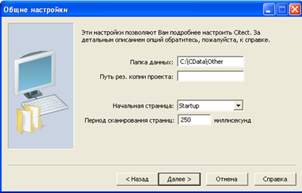

 Рис.5.1 Налаштування місця розміщення папки з архівними файлами

\7.   Запустіть проект на виконання. Якщо середовище Runtime до цього виконувалось – перезапустіть його. За допомогою провідника Windows перевірте чи створилися файли історії в папці архівних файлів. 

\8.   У середовищі виконання зі сторінки "Tanks" запустіть установку приготування продуктів. Перейдіть на вкладку меню "Тренды" і відкрийте сторінку "Анализатор процессов всплывающее окно". Добавте в Аналітик процесу криву тренду з тегом T1_LT1. Якщо тренд коректно відображається переходьте до наступного пункту. 

\9.   Створіть усі інші трендові теги, відповідно до таблиць 8 та 9 файлу "Завдання". Для прискорення можете скористатися ExcelAddon. Перед правкою таблиці Trend Tags рекомендується налаштувати формат комірок таблиці як текстовий. Скомпілюйте та запустіть проект на виконання. Якщо середовище Runtime до цього виконувалося – перезапустіть його. 

\10. У середовищі виконання викличте вікно "Аналитик процессов" з меню "Тренды". Перейменуйте існуючу панель Аналітика на "Приготування" і добавте ще дві панелі "Дозатор 1" та "Дозатор2". Добавте усі криві, що відповідають за приготування до панелі "Приготування". Звертайте увагу на тип кривої та панель, куди добавляєте. Так само добавте криві на панелі "Дозатор1" та "Дозатор2" та збережіть налаштування у файлі "Production.pav". Результат повинен виглядати приблизно так, як на рис.5.2. 

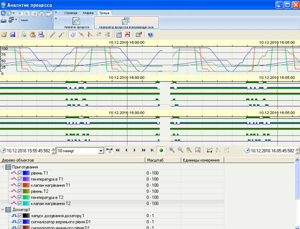

Рис.5.2 Зовнішній вигляд Аналітика процесів

\11.  Використовуючи редактор графіки, розмістіть на сторінці "Heat" Аналітик процесів. Налаштуйте щоб там відображалися трендові дані по підігрівнику, зокрема:

Таблиця 5.2.

| HEA_TC1_SP | Уставка для ведучого регулятору      |
| ---------- | ------------------------------------ |
| HEA_TT1    | Т продукту на виході підігрівача     |
| HEA_TT2    | Т гарячої води на виході підігрівача |
| HEA_TV1    | Клапан подачі гарячої води           |

На закладці "Панели инструментов" налаштуйте головну панель інструментів, як це показано на рис.5.3. Скомпілюйте проект та перевірте його роботу в Runtime. Якщо графіки не з’являються натисніть на панелі інструментів Аналітика процесу кнопку "Обновить данные". Включіть програмний задатчик та переведіть контур регулювання в автоматичний режим. За допомогою панелі інструментів змініть масштаби пір’їв на 20-70.  

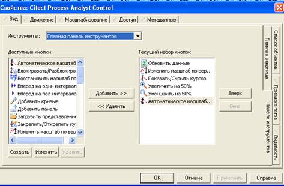

Рис.5.3 Налаштування панелі інструментів

 

\12. Виведіть на сторінку Heat значення збурення "smHEA_Z1", щоб його можна було змінювати. Можете скористатись для цього джином "Parameter_2" з бібліотеки KeyEntry. Скомпілюйте проект і запустіть його на виконання. Введіть значення збурення рівним 5.0, подивіться чи дійсно змінюється значення температури. 

\13. Прочитайте уважно додаток 5.3. Зробіть подію, яка випадковим чином буде змінювати кожні 5 секунд значення збурення в діапазоні -5 до +5. Для цього створіть подію (Событие) та налаштуйте її відповідно до рис. Д5.3.1. Скомпілюйте проект. Запустіть майстер налаштування комп’ютеру і активуйте подію "SmZbur", як це показано на рис.Д5.3.2. Запустіть середовище RunTime і перевірте чи змінюється змінна "smHEA_Z1". 

\14. Розмістіть об’єкт "Тренд" на сторінці "Tanks" лівіше від танку 1. У властивостях об’єкту прив’яжіть до першого пера тег тренду "T1_TT1" а до другого - "T1_TV1". Навколо об’єкта тренду нарисуйте незаповнений прямокутник у якості рамки тренду. Збережіть сторінку, запустіть проект на виконання та перевірте його роботу.

\15. Уважно прочитайте Д5.4.1. Дізнайтеся значення точки анімації (AN, ТА) у об’єкта "Trend". У властивостях сторінки "События", для події "При входе на страницу" вставте функцію TrendSetSpan, в аргументах якої вкажіть визначену точку анімації та значення "00:10:00" (10 хвилин). Збережіть сторінку, запустіть проект на виконання та перевірте його роботу.

\16. Пункти 14 та 15 зробіть аналогічним чином і для другого танку. 

\17. Уважно прочитайте додаток 5.2. Прочитайте вимоги до реалізації підсистеми доступу з файлу "Завдання". Створіть ролі з наступними параметрами:

Таблиця 5.3.

| **Назва ролі** | **Привілеї**                                                 | **Коментар**                              | **Примітка**                 |
| -------------- | ------------------------------------------------------------ | ----------------------------------------- | ---------------------------- |
| Administrators | 1,2, 8 - глобальні                                           | Адміністратори                            | Роль вже є, змінити привілеї |
| ProdUsers      | 1 в зоні 1 (зона Tanks)                                      | оператори установки приготування продукту |                              |
| HeaUsers       | 1 в зоні 2 (зона Hea)                                        | оператори установки підігріву             |                              |
| KVPiA          | 1..7 - глобальні                                             | служба КВПіА, наладчик                    |                              |
| Dispatch       | 1 в зоны 10 (зона Dispatch), 1 - глобальні  тільки для перегляду | оператори-диспетчери виробництва          |                              |

 

\18. Cтворіть користувачів з наступними ролями:

Таблиця 5.4.

| **Назва користувача** | **Назва ролі** | **Тип**   | **Примітка**                                   |
| --------------------- | -------------- | --------- | ---------------------------------------------- |
| Admin                 | Administrators |           | Користувач вже є                               |
| PUser1                | ProdUsers      | ProdUsers | 1-й користувач установки приготування продукту |
| HUser1                | HeaUsers       | HeaUsers  | 1-й користувач установки приготування продукту |
| KVPUser1              | KVPiA          | KVPiA     | 1-й наладчик                                   |
| DspUser1              | Dispatch       | Dispatch  | 1-й диспетчер                                  |

 

\19. Зробіть наступні налаштування зон для сторінок (Свойства ->Общие->Безопасность):

Таблиця 5.5.

| **Назва сторінки** | **Зона** | **Примітка**                          |
| ------------------ | -------- | ------------------------------------- |
| Tanks              | 1        | зона установки приготування продукту  |
| Heat               | 2        | зона установки підігріву              |
| Base               | 10       | зона оператора-диспетчера виробництва |

 

\20. Для усіх елементів вводу на сторінках "Tanks" та "Heat", а також в джинах зробіть привілеї з рівнем 1. Скомпілюйте проект і запустіть на виконання.

\21. Зареєструйтеся в Runtime системі Vijeo Citect під користувачем "PUser1" та перевірте до яких сторінок та елементів він має доступ. Після цього послідовно зареєструйтеся під різними користувачами, вказаними в таблиці 5.4, та перевірте їх можливості.

\22.  Для усіх алармів вкажіть зону, до якої вони належать: для змінних приготування продукту – 1, для змінних установки підігріву - 2. Зверніть увагу, якщо форма налаштування аларму не відображає поля "Зона", очевидно треба перейти в розширений режим (клавіша "F2"). Скомпілюйте проект і запустіть на виконання.

\23. Використовуючи змінні форсування AIFRC[] та DIFRC[] в Unity PRO або у Vijeo Citect згенеруйте по одній тривозі в установці приготування продукту (наприклад відмова клапану) і установки підігріву (наприклад висока температура продукту). Зайдіть в систему під користувачем "Admin" і подивіться на список активних тривог, але не підтверджуйте їх. Потім почергово зайдіть в систему під користувачами "PUser1" та "HUser1", підтверджуючи видимі для них тривоги.

\24. У середовищі розробки налаштуйте виконання блокування повзунку на сторінці "Heat" у випадку, коли регулятор знаходиться не в ручному (в автоматичному) режимі. Для цього використайте властивість "Запретить при" з закладки "Доступ"->"Запрещен". Скомпілюйте і перевірте роботу блокування. 

\25. Зайдіть в систему виконання як "Admin". Створіть в режимі виконання користувачів:

Таблиця 5.6.

| **Назва користувача** | **Тип**   | **Примітка** |
| --------------------- | --------- | ------------ |
| PUser1                | ProdUsers |              |
| PUser2                | ProdUsers |              |
| PUser3                | ProdUsers |              |
| HUser1                | HeaUsers  |              |
| HUser2                | HeaUsers  |              |
| HUser3                | HeaUsers  |              |

Після створення, подивіться чи з’явилися ці користувачі в середовищі розробки. У середовищі виконання увійдіть в систему під іменем будь якого з новоствореного користувача та перевірте його можливості.  

  

 

**Питання до захисту.** 

1. Чим відрізняються тренди     реального часу від історичних? Як     у Vijeo Citect можна реалізувати ці тренди?
2. Які задачі виконує     підсистема управління історичними трендами? Як у Vijeo Citect реалізована підсистема трендів?
3. Навіщо для трендів     означувати періодичність запису та глибину? Як пов’язані ці властивості та     яким чином їх вибирати/розраховувати? Як це задається у Vijeo Citect?
4. За якими подіями може     відбуватися запис значень змінних в тренд? Як це задається у Vijeo Citect?
5. Розкажіть про можливості     переглядачів трендів що є в наявності у Vijeo Citect.
6. Як показуються змінні на     самописцях і як їх відрізняти між собою? Як дізнатися значення змінної в     конкретній точці? Як це реалізовано у Vijeo Citect?
7. Які механізми використовуються     у Vijeo Citect     для розділення прав між користувачами? Розкажіть про призначення зон та     привілеїв.
8. Розкажіть про призначення     блокування та реалізація його у Vijeo Citect?
9. Розкажіть про призначення     та реалізацію подій у Vijeo Citect.
10. Поясніть чому 23-му пункті     кожен користувач бачив тільки деяку частину тривог. 

 

**
**

**Додаток 5.1. Налаштування трендової підсистеми** **Vijeo** **Citect** 

**Д5.1.1. Загальні відомості** 

Збереженням (реєстрацією) даних на диску з можливістю їх перегляду у вигляді тренду займається ***трендовий сервер\*** (Сервер Трендов, Trend Server). Окрім збереження трендовий сервер також обслуговує запити від клієнтів (наприклад від Process Analyst) на читання архівних даних. Сервер створюється в меню "Сервера"-> "Сервера Трендов". При створенні локального серверу в standalone рішенні достатньо вказати ім’я серверу.      

Значення, які необхідно зберігати в тренді означуються через теги трендів (Д5.1.2), в яких вказується уся необхідна для запису в трендові файли інформація. Для перегляду даних у вигляді трендів в графічній підсистемі використовуються два типи об’єктів "Тренд" (Д5.1.3) та "Аналізатор процесів" (Д5.1.4). Аналізатор процесів окрім архівних даних, що означені в тегах трендів, може відображати дані реального часу. Об’єкт "Тренд" може відображати тільки архівні дані з тегів тренду. 

 

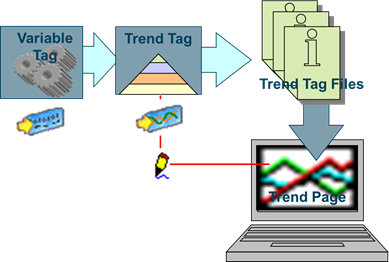

Рис.Д5.1.1 Принципи роботи трендової підсистеми

**Д5.1.2. Теги трендів** 

У ***тегах трендів\*** означується вся необхідна інформація для ведення архіву для однієї точки даних. Уданому випадку точкою даних може бути як змінний тег, так і цілий вираз, що повертає числове (в тому числі булеве) значення. Створюється тег тренда через меню "Тэги"->"Тэги тренда".

Форма налаштування тегу тренду має вигляд як на рис.Д5.1.2. Для тегу тренду означується назва, яка може співпадати з назвою змінних тегів або тегів тривог. У полі "Выражение" вказується Cicode вираз, що повертає якесь числове значення. Це може бути як змінна, як це показано на рис.Д5.1.2, так і вираз або функція, наприклад "(LOOP_1_PV + LOOP_2_PV) /2". 

   

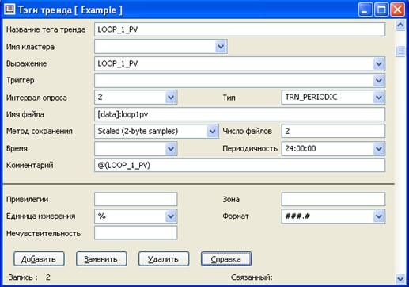

Рис.Д5.1.2 Налаштування тегу тренда

Трендовий сервер буде розраховувати значення вказаного виразу з періодичністю, вказаною в полі "Интервал опроса". Якщо в цьому полі вказується десяткове число, то воно буде інтерпретуватися як секунди. Періодичність можна також задати в форматі "hh:mm:ss". Поле "Интервал опроса" є опціональним, за замовченням приймається 10 секунд. Слід звернути увагу, що при зміні даного значення треба видалити раніше створені архівні файли для даного тренд тегу, щоб зміни вступили в силу. 

У Vijeo Citect 7.2 доступні три способи запису, які вказуються в полі "Тип". 

***Періодичний тренд\*** (тип TRN_PERIODIC) записує дані постійно з вказаним періодом. Можна також вказати ***тригер\*** (поле "Триггер"), який буде активувати або деактивувати ведення запису. Запис в архів проводиться тоді, коли тригер = TRUE, або не вказаний (рис.Д5.1.3). 

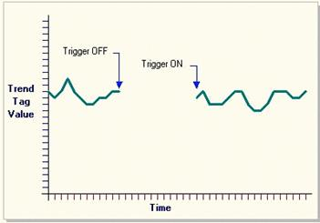

 Рис.Д5.1.3 Періодичний тренд (тип TRN_PERIODIC)  

***Подієвий тренд\*** (тип TRN_EVENT) записує дані тільки в момент зміни значення тригеру з FALSE в TRUE. Між точками запису проводиться інтерполяція (рис.Д5.1.4).  

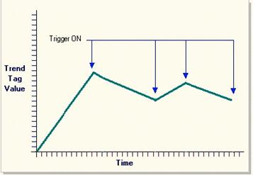

Рис.Д5.1.4 Подієвий тренд (тип TRN_EVENT)

 

***Періодично-подієвий тренд\*** (тип TRN_PERIODIC_EVENT) аналогічно попередньому, записує дані тільки в момент зміни значення тригеру з FALSE в TRUE. Але цей тип тренду не робить інтерполяцію між точками запису (рис.Д5.1.5.)

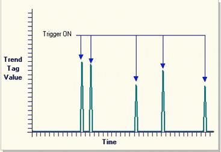

Рис.Д5.1.5 Періодично-подієвий тренд (тип TRN_PERIODIC_EVENT)

У полі "Имя файла" можна вказати шлях та ім’я файлу (без розширення) для тегу тренду. Наприклад "[data]:loop1pv" вказує, що архівні файли будуть розміщуватися в папці означеній параметром "DATA" з назвою "loop1pv". Якщо ім’я файлу не вказане, воно береться з імені тегу тренду а шлях папки зі значення параметру "DATA".

Глибина запису архіву та кількість архівних файлів для кожного тегу тренду означується значеннями полів "Число файлов", "Время" та "Периодичность". Властивість "Число файлов" вказує на кількість архівних файлів (за замовченням береться 2). Файли синхронізовані відносно часу, вказаного в полі "Время", а кожен файл буде зберігати дані відповідно до вказаної періодичності. При першому старті системи виконання будуть створені усі необхідні файли для ведення історії. Під час роботи системи дані будуть зберігатися у кожному з цих файлів, поступово переходячи від одного файлу до іншого з вказаною періодичністю (значення "Периодичность"). Коли закінчується час запису в останній файл, система знову переходить до 1-го файлу, затираючи старі архівні значення. Розглянемо це на прикладі, де означено кількість файлів рівною 10, періодичність 24:00:00, а час синхронізації ("Время") - 00:00:00.

\1.    При першому запуску системи будуть створені усі 10-ть файлів з вказаним іменем та з розширеннями ".000"… ".009" та один файл з розширенням ".HST". Спочатку Vijeo Citect пише архівні дані в файл з розширенням ".000".

\2.    Опівночі, наступного дня, дані будуть записуватися в файл з розширенням ".001".

\3.    Опівночі, третього дня, дані будуть записуватися в файл з розширенням ".002" і так далі.

\4.    Після 10-ти днів, система почне переписувати перший файл, тобто ".000".  

 

 

Слід звернути увагу, що при зміні будь з яких значень кількості та періодичності історичних файлів треба видалити раніше створені архівні файли для даного тегу тренда, щоб зміни вступили в силу.

Властивість "Метод сохранения" вказує на спосіб і величину збереження числових даних. Якщо не потрібна велика точність варто використовувати "Scaled (2-byte samples)".   

**Д5.1.3. Об’єкт "Тренд"** 

Об’єкт "Тренд" дає можливість відобразити до 8-ми архівних значень тегів тренду. Для кожного пера вказується назва тегу тренду та колір (рис. Д5.1.7). Властивість "Число выборок данных" вказує на кількість записів у файлі історії, які будуть відображатися для кожного тегу тренду. За допомогою властивості "Пикселов на выборку" вказується проміжки між двома точками одного пера на графіку. Ширина об’єкту "Тренд" зв’язана з цими властивостями:  

Ширина = "Пикселов на выборку" x Число выборок данных"

Вказати діапазон значень в часових розмірах можна використовуючи Cicode функції, наприклад TrendSetSpan (Д5.4.1)

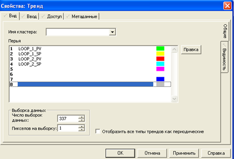

Рис.Д5.1.7 Об’єкт "Тренд"

Об’єкт "Тренд" має дуже мало можливостей для його налаштування в середовищі розробки. Усі можливості навігації по історії, відображення значень, налаштування області відображення та багато іншого реалізовуються через функції Cicode. Для спрощення використання трендів на базі об’єкту "Тренд" у включених проектах Vijeo Citect є спеціальні сторінки, джини та суперджини. Тим не менше, більш функціональнішим у використанні трендів є об’єкт "Аналізатор процесів".

  

**Д5.1.4. Об’єкт "Аналізатор процесів" (****Process** **Analyst****)** 

Аналізатор процесів (Process Analyst) дає можливість відображати в часі значення тегів трендів, змінних тегів а також тегів тривог. Налаштування аналізатору процесу можливе як в середовищі розробки, так і в середовищі виконання. Опис усіх функцій аналізатору наведений в довідниковій системі, тут зупинимося тільки на деяких з них. 

У середовищі розробки для добавлення тегів на тренд попередньо необхідно створити панелі трендів. Для цього у властивостях закладки "Главная страница" об’єкту Аналітик процесу (див. рис.Д5.1.8), у контекстному меню "Представления анализатора процессов" необхідно викликати команду "Добавить панель". У більшості випадків на одному тренді достатньо однієї панелі, однак якщо необхідно порівнювати тренди, групувати, або зсовувати їх по осі часу один відносно одного, можна створити дві та більше панелей. У контекстному меню назви панелі, у свою чергу, можна добавити криві: 

\-     Аналоговий

\-     Дискретний

\-     Аларм   

 

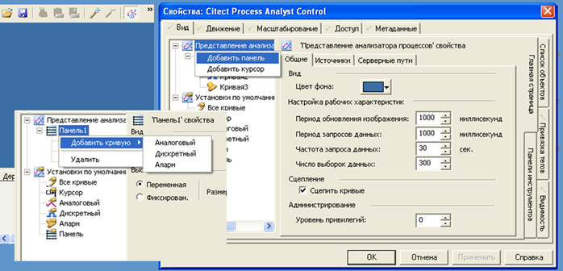

Рис.Д5.1.8 Загальний вигляд вікна налаштування Аналітика процесів в середовищі розробки

Криві отримують назви за замовченням, однак їх можна змінити довільними назвами, в тому числі з кирилицею. Для можливості зміни, необхідно зробити натискання по назві кривій, а після її виділення зробити повторне одинарне натискання і перейменувати криву.   

Для кожної кривої у вкладці "Соединение" задається джерело даних (рис. Д5.1.9). Так, наприклад, для аналогової або дискретної кривої задається тег тренду. Якщо необхідно вказати змінний тег (для трендів реального часу) то виставляється опція "Быстрый тренд", а в полі "Тег тренда" вказується назва змінного тегу. 

Налаштування вигляду панелі інструментів робиться в закладці "Панели инструментов".    

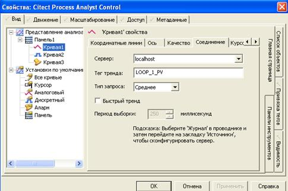

 

Рис.Д5.1.9 Властивості вкладки "Соединение" Аналітика процесів

Загальний вигляд Аналітика процесів в середовищі виконання показаний на рис.Д5.1.10. Криві показуються у вибраному діапазоні часу (інтервалі), який може налаштовуватися спеціальними кнопками або вибору з ряду заданих. Можна вказати початкове значення дати та часу перегляду. Швидка навігація доступна через кнопки:

“ < ” – на половину інтервалу назад; 

“ << ” – на один інтервал назад;

“ > ” – на половину інтервалу вперед; 

“ >> ” – на один інтервал вперед.

За допомогою легенди оператор може подивитися призначення кожної кривої тренду відповідно до кольору, налаштувати масштаб відображення, показувати чи ховати пера на графіку. Крім того, є можливість показати курсор часу з відображенням числового значення трендів у потрібній точці часу. Так, на рис. Д5.1.10 видно, що 05.11.2014 о 15:17:06 значення тиску внизу колони К1 було 76,7 Па.

За допомогою панелі керування (див. рис.Д5.1.10) можна добавляти/видаляти пера (див. рис. Д5.1.11), налаштовувати особливості відображення, створювати незалежні панелі зі своїми осями і багато чого іншого. Використовуючи кнопку "Свойства" на панелі можна відкрити таке саме вікно налаштування, як в середовищі розробки (див.Д5.1.8) 

У включених проектах є багато шаблонів з вбудованими трендами на базі Аналітика процесів.  

Наведені вище можливості – це не повний перелік тих, які надаються Аналітиком процесу. Детальніше читайте в документації.

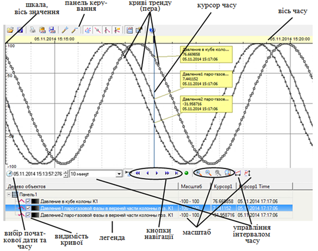

Рис.Д5.1.10 Загальний вигляд Аналітика процесів в середовищі виконання

 

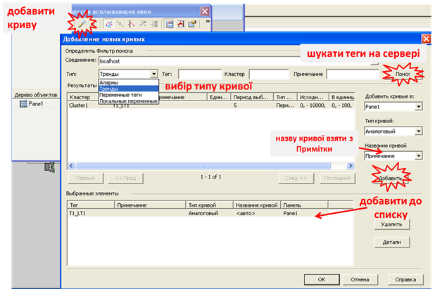

Рис.Д5.1.11 Добавлення кривої в Аналітику процесів в середовищі виконання

**
**

**Додаток 5.2. Користувачі, права доступу, блокування** 

Права доступу означують можливості дій і перегляду для групи користувачів. Окрім прав доступу обмеження на певні дії можуть надавати виконання або невиконання певних умов, у цьому випадку говорять про блокування (заборони).  

Під час планування прав доступу необхідно вирішувати наступні питання:

\-     чим можуть керувати та що виконувати користувачі з вказаної групи

\-     що можуть переглядати користувачі з вказаної групи

\-     які області вимагають обмеження прав доступу

Під час планування умов блокування необхідно:

\-     визначити, які елементи потребують блокування

\-     визначити умови блокування

Обмеження прав у Vijeo Citect будується на використанні механізму ***ролей\***. Роль повністю означує права, що має ***користувач\*** (Пользователь), якому ця роль назначена. Ролі базуються на розділенні процесу згідно:

\-     ***виробничих зон\*** (Area), за допомогою яких вказується область процесу, до якого має право доступатися користувач.

\-     привілеїв (***Privilege\***), за допомогою яких вказується рівень доступу до кожного елементу в межах зони 

Таким чином, при створенні користувача, йому назначається роль, яка надає йому певні права в певній зоні (області) процесу. За замовченням, якщо користувач не зареєструвався, привілеї та зона рівні 0.

Приклад розділення процесу (виробництва) на зони показаний на рис.Д5.2.1. Наприклад, у зоні 9 користувачі з вказаними правами можуть доступатися для керування, а для 10-12 – тільки для контролю. Розділення технологічного процесу (виробництва) на зони використовується разом з означенням привілей для обмежень доступу в клавіатурних командах, тривогах, об’єктах, звітах і т.д. 

  

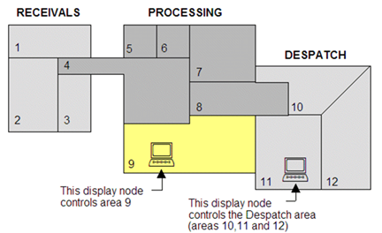

Рис.Д5.2.1 Приклад ділення процесу на зони

Зони призначені для розділення прав доступу у різних частинах процесу або виробництва, а привілеї стосуються можливостей оператору в межах цих зон. У Vijeo Citect користувачам може бути назначені до 8-ми привілеїв (1..8). За замовченням номера привілеїв є рівнозначними, тобто користувач тільки з привілеями 8 не має доступу до об’єктів з привілеями 1-7. Через параметр [Privilege]Exclusive=0 можна назначити ієрархічність привілеїв (8-й має усі привілеї). Окрім привілеїв в межах зон, в ролях можна назначити глобальні привілеї, які діють в межах усіх зон.

Таким чином, в межах проекту створюються ролі, у кожній з яких вказуються зони та привілеї. На рис.Д5.2.2 показана форма налаштування ролей ("Система"->"Роли"). У полі "Глобальные привилегии" вказуються номера привілеїв для усіх зон. У полі "Зоны, доступные для просмотра" вказуються номера зон, які доступні користувачу з цією роллю тільки для перегляду. Для кожної привілеї можна назвати зони, в яких вони діють. Поля "Команда на вход" та "Команда на Выход" дають можливість вказати команди Cicode, які будуть запускатися при реєстрації та виході з системи відповідно.   

 

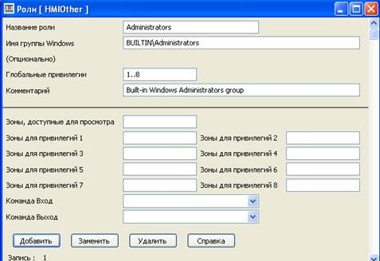

 

Рис.Д5.2.2 Налаштування ролей

У розділі "Система"->"Пользователи" створюються користувачі (рис. Д5.2.3). Окрім паролю і ролі можна задати тип, який буде використовуватися при створенні користувачів в режимі виконання як шаблон нового користувача. 

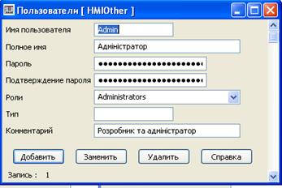

Рис.Д5.2.3 Налаштування користувачів

Vijeo Citect дає можливість інтегрувати підсистему користувачів Windows зі своєю підсистемою доступу. Для цього в полі ім’я групи Windows вказується ім’я групи користувачів та налаштовується параметр [Client]AutoLoginMode. Додатково про інтеграцію користувачів Windows і Vijeo Citect можна ознайомитися в довідниковій системі.

Для означення прав доступу до елементів, для кожного з них можна назначити рівень привілеїв та зону на закладці "Доступ"->"Общие" (див. рис.Д5.2.4). За необхідністю можна означити інші привілеї та зону для кожної дії, якщо в цьому є потреба. 

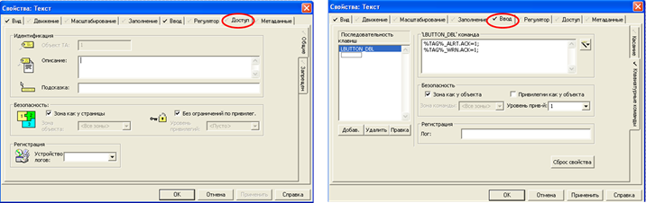

Рис.Д5.2.4 Налаштування доступу для елементів

На закладці "Доступ"->"Запрещен" можна вказати умову блокування (заборони) доступу до елементу.  

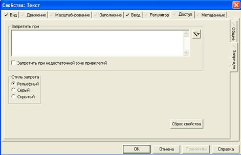

Рис.Д5.2.5 Налаштування блокування доступу

Шаблони Vijeo Citect надають можливості редагувати існуючих та створювати нових користувачів в режимі виконання через меню користувачів (рис.Д5.2.6). Це можуть робити тільки користувачі з привілеями 8. 

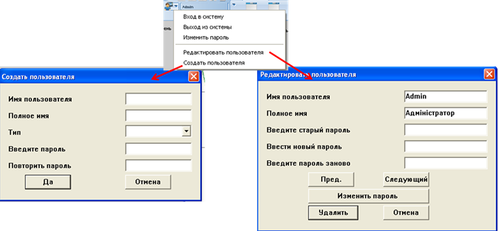

Рис.Д5.2.6 Створення користувачів в Runtime

 

**
**

**Додаток 5.3. Події (****Events****)** 

Події дають можливість виконувати певну дію, означену Cicode командою, за виконанням певної умови або періодичності виконання. Події створюються в редакторі проекту "Система"->"События". Для події вказується ім’я (див. рис.Д5.3.1), періодичність та час, відносно якого проводиться синхронізація періодичності ("Время"). Якщо період не вказаний, він приймається рівним 1 секунда.  

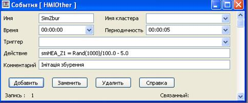

Рис.Д5.3.1 Налаштування властивостей події

Тригер вказує на умову, яка запускає виконання дії. Якщо тригер не вказаний, то дія буде виконуватися з періодичністю, означеною полями "Время" і "Периодичность". Якщо тригер вказаний, але не вказані поля "Время" і "Периодичность", то дія буде виконуватися по передньому фронту спрацювання тригеру.

Події можуть виконуватися на будь якому сервері Citect, або в клієнті, або в усіх перерахованих. Місце виконання подій налаштовуються в майстрі налаштування комп’ютера (рис.Д5.3.2). Події з іменем "GLOBAL" виконуються на всіх комп’ютерах в системі Vijeo Citect. 

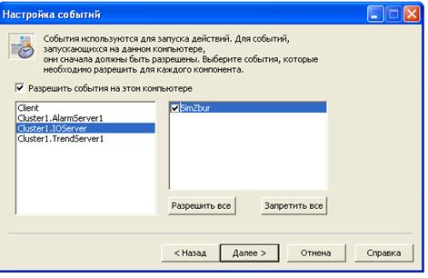

Рис.Д5.3.2 Налаштування виконання події на різних частинах системи VijeoCitect 

**
**

**Додаток 5.4. Деякі** **Cicode** **функції, що використані в лабораторній роботі**  

**Д5.4.1. Функція встановлення періоду відображення** **TrendSetSpan.**

Для встановлення періоду відображення для елементу "Тренд" можна скористатися функцією TrendSetSpan. Синтаксис: 

**TrendSetSpan**(*AN,* *sPeriod*)

де *AN* – точка анімації об’єкту "Тренд" (береться з властивостей "Доступ" "Объект ТА");

*sPeriod* – період відображення в секундах

 

**Д5.4.2. Функція встановлення для роботи з пристроями.**

Пристрої можуть використовуватися в Cicode як для читання, так і для редагування та запису. Спочатку пристрій відкривається функцією DevOpen, яка повертає дескриптор пристрою. Потім проводяться необхідні операції, наприклад запис через функцію DevWrite. Після усіх необхідних операцій, пристрій закривається функцією DevClose. 

**DevOpen**(*Name* *[*, *nMode]*

**DevClose**(*hDev, Mode*)

**DevWrite****Ln**(*hDev*, *sData*)

 