# Лабораторна робота №6.

**Тема. Інтеграція** **SCADA/HMI зі сторонніми засобами та розробка** **HMI для мобільних гаджетів.**

 

**Тривалість**: 4 акад. години (4 пари).

**Мета:** Навчитись користуватися MUDMBUS TCP для зв’язку між мобільними пристроями та контролерами.

**Лабораторна установка**

Апаратне забезпечення: ПК, смартфон на базі Android або iOS, ПЛК M221, лабораторний стенд із портальним роботом

Програмне забезпечення: Somachine Basic V>=1.5, myDesigner, myMobile, myPro.

**Порядок виконання роботи.** 

\1.   Поверхово ознайомтеся зі змістом всіх додатків до лабораторної роботи.

\2.   Робочі місця № 1-5 працюють із стендом №1 та №2. Робочі місця №6-10 працюють із стендом № 3 та №4. Визначте номер свого робочого місця та знайдіть стенди з якими необхідно буде працювати.

\3.   На робочому місці №2 та №3, №8 та №9 запустіть середовище Somachine Basic та відкрийте файл проекту **M****221_****hmi****.****smbp****.** 

 

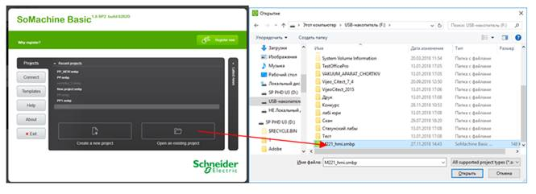

 

\4.   Завантажте проект на виконання в контролер M221 (Вкладка Commissioning> обрати USB M221>Login>PC to Controller (download)>Start Controller).

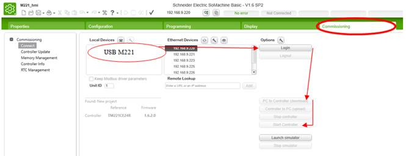

 

\5.   Створіть Animation Table, додайте в неї змінні з проекту (рис. 6.21,6.22).

 

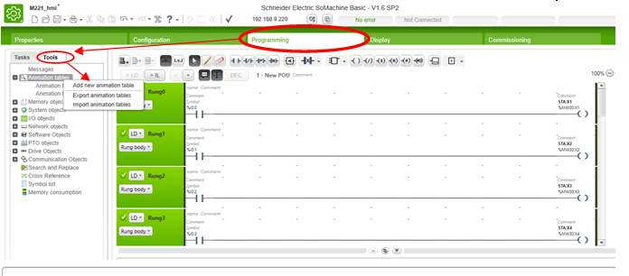

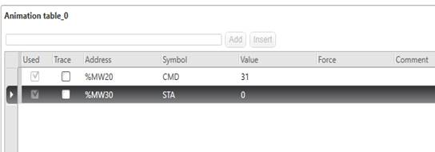

Рис. 6.21 можливий вигляд Animation Table 

 

\6.   Перевірте зв’язок з контролерами М221. Для цього необхідно cmd=30. Повний список використовуваних змінних та їх адреси в контролері наведено в табл. 6.1

Таблиця 6.1

Опис змінних для управління роботами

| Назва змінної | ПЛК  | Тип  | Адреса | Адреса Holding Register | Опис                                              |
| ------------- | ---- | ---- | ------ | ----------------------- | ------------------------------------------------- |
| cmd           | PLC1 | int  | %MW20  | 20                      | Команда на керування роботом лабораторного стенду |
| sta           | PLC1 | int  | %MW30  | 30                      | Слово статусу робота лабораторного стенду         |

 

\7.   Ознайомтеся з повним переліком команд для керування роботом та перевірте декілька з них. Повний перелік команд для керування роботом наведено у таблиці 6.2

 

 

 

 

Таблиця 6.2

Команди керування портальним роботом

| **Команда** | **Опис команди**                        |
| ----------- | --------------------------------------- |
| 10          | Перемістити каретку з магнітом ліворуч  |
| 20          | Перемістити каретку з магнітом праворуч |
| 30          | Опустити магніт                         |
| 31          | Підняти магніт                          |
| 40          | Увімкнути привод висування деталі       |
| 41          | Вимкнути привод висування деталі        |
| 50          | Увімкнути привод зміщення деталі вліво  |
| 51          | Вимкнути привод зміщення деталі вліво   |
| 60          | Увімкнути магніт                        |
| 61          | Вимкнути магніт                         |

 

 

\8.   Запустіть середовище розробки myDesigner 

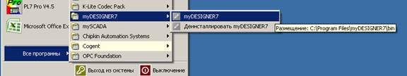

 

 

\9.   Створіть новий порожній проект. Для цього в меню виберіть Project > New Project > Empty Project. Якщо ще жодного проекту не було створено то одразу з’явиться меню в якому необхідно обрати Empty Project (рис. 6.6). Оберіть місце розміщення проекту на диску, його назву та натисніть Finish.

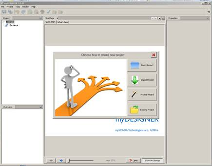

Рис. 6.6 Процедура створення нового проетку

\10. Додайте нове підключення до пристрою вводу/виводу в проект. Для цього в дереві проекту подвійним кліком відкрийте вкладку Connection та додайте новий пристрій – Add Conection > PLC (рис. 6.7). 

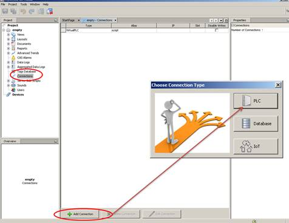

Рис. 6.7 Створення нового підключення до пристрою вводу/виводу

\11. Налаштуйте підключення (рис. 6.8). У полі Type оберіть тип підключення Modbus, Alias – назва підключення в проекті – PLC1, IP – вкажіть ІР адресу ПЛК М221(див. табл.6.3. Port – вкажіть порт 502.

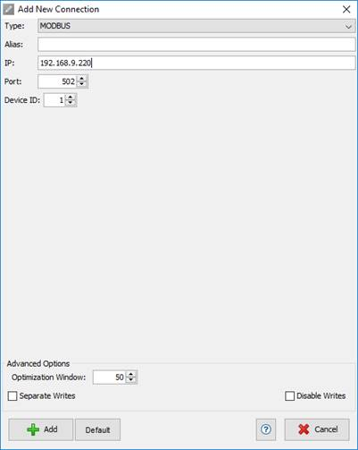

 

 

\12. Додайте два підключення до пристроїв вводу/виводу (контролери М221).див. табл. 6.3,

Таблиця 6.3

Налаштування підключення до контролерів М221

| Alias | Type   | IP            | Port | Device_ID | Місце фізич.  Розташування. |
| ----- | ------ | ------------- | ---- | --------- | --------------------------- |
| PLC1  | MODBUS | 192.168.9.220 | 502  | 1         | Робоче місце №2             |
| PLC2  | MODBUS | 192.168.9.223 | 502  | 1         | Робоче місце №3             |
| PLC3  | MODBUS | 192.168.9.227 | 502  | 1         | Робоче місце №8             |
| PLC4  | MODBUS | 192.168.9.225 | 502  | 1         | Робоче місце №9             |

 

1.  Користуючись     табл.6.1 Створіть два cmd та два sta теги для стендів     відповідно до свого робочого місця. Для цього в     дереві проекту myDesigner оберіть пункт     Tags Database. У полі Alias вкажіть назву створюваного тегу (CMD або STA).В полі Tag@conn необхідно     викликати вікно налаштування підключення для тегу, обрати тип підключення PLC1 і в полі Register вказати регістр, що відповідає змінній див таб     6.1 (20 для CMD і 30 для STA)

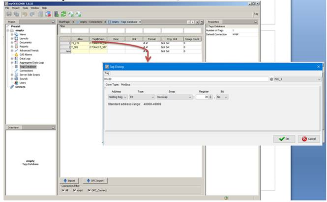

 

Рис. 6.9 Створення нового тегу у myDesigner

 

Результат додавання змінних може мати вигляд як на рис. 6.24

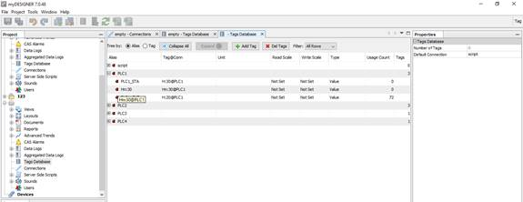

Рис. 6.24 один з можливих варіантів результату завершення додавання змінних

 

Створіть новий екран із назвою власного прізвища та форматом 16:9. Для цього в дереві проекту натисніть правою клавішою миші на розділі View та оберіть AddNew. У якості назви екрану вкажіть своє прізвище латиницею. Connection – PLC1, формат екрану оберіть 16:9. Та натисніть Add (рис. 6.10).

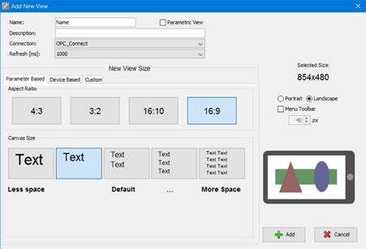

Рис вікно створення нового екрану

 

 

 

\13. Відкрийте створений екран та змініть його фон на сірий [204,204,204]. Для цього у вікні властивостей екрану (Properties) необхідно змінити властивість Background (рис. 6.11).

 

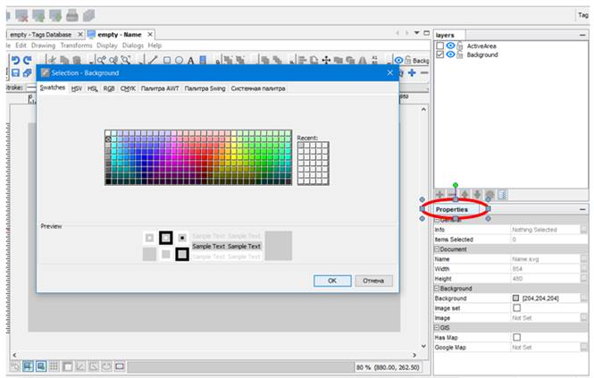

 

Рис. 6.11 Зміна властивості фону для екрану

\14. Відобразіть на екрані значення змінної STA та CMD. Для цього на панелі інструментів оберіть елемент Create Text Element, розмістіть текстовий елемент на екрані, вкажіть формат відображення ##.# та натисніть ОК. (). 

\15. У вікні властивостей для створеного текстового елементу оберіть властивість Show Value (відобразити значення). Та оберіть для параметру Tag Address змінну STA. ().

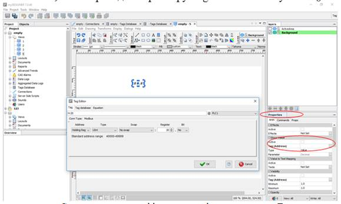

\16. Використовуючи меню Сomponents панелі інструментів та елементу Buttons momentary > 2 state button> вкажіть тег CMD в полі Tag та реалізуйте кнопку, яка при натисканні буде змінювати значення тегу CMD = 30 (опускати магніт вниз). 

\17. 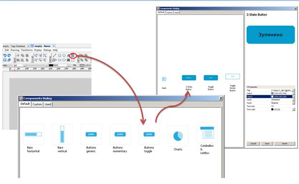

\18. Для цього у властивостях кнопки необхідно обрати вкладку Commands і змінити властивість OnClick. У вікні, що відкрилося необхідно обрати тег CMD, а у вкладці Value ввести значення команди 30 (опускання магніту)

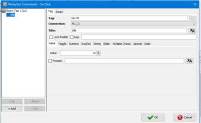

 

\19. Аналогічно, використовуючи, таб 6,1 реалізуйте кнопку для піднімання магніту (CMD = 31)

\20. Для перевірки проекту необхідно встановити додаток myMobile для свого телефону. За відсутності можливості встановити додаток для телефону можна буде скористатися локальним сервером. Для завантаження додатку підключіться до wifi мережі аудиторії А532. Назва мережі: Asus, пароль: 123456789. В подальшому використовуйте лише підключення через wifi. Передачу даних від мобільного оператора бажано вимкнути. Для смартфонів на базі Android завантажте та встановіть з Play Market додаток myMobile доступний також за посиланням,     https://play.google.com/store/apps/details?id=org.myscada.mymobile . Для смартфонів на базі iOS завантажте та встановіть з AppStore додаток mySCADA MOBILE, доступний також за посиланням https://itunes.apple.com/us/app/myscada/id1076591257?mt=8 . 

\21.  В myDesigner додайте пристрій на якому буде запускатися створений проект. В дереві проекту відкрийте пункт Devices та натисніть Add Device. В полі Type – вкажіть тип пристрою myMobile, якщо буде використовуватись мобільний пристрій, myPro, якщо буде використовуватись локальний сервер. Alias – вкажіть назву пристрою. ІР – ІР адреса пристрою. Для локального серверу ІР адреса становить 127.0.0.1. Для того щоб дізнатися ІР адресу мобільного пристрою запустіть встановлений додаток та за допомогою меню додатку відкрийте в меню пункт Project > Add, ІР адреса пристрою буде вказана в рядку ІР Address of this device (). Переконайтеся, що формат ІР адреси становить 192.168.9.Х, де Х – унікальна адреса для вашого пристрою, якщо формат відрізняється перевірте підключення до wifi мережі Asus.

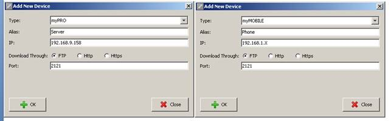

Рис. 6.14 Вікно конфігурування нового пристрою для відображення проекту

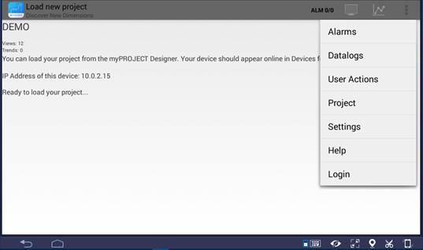

Рис. 6.15 Меню налаштування проекту в myMobile

 

\22.  Протестуйте зв’язок із доданим пристроєм. Виділіть доданий пристрій та натисніть Test Device. У разі успішного тестування з’явиться повідомлення Connection Test Passed. У разі, якщо зв’язок з пристроєм відсутній з’явиться повідомлення Connection Test Filed, у цьому випадку зверніться за допомогою до викладача.

\23. Завантажте свій проект на мобільний пристрій або на локальний сервер. Для цього в дереві проекту зробіть активним пункт Views та натисніть Download to device на панелі інструментів (рис. 6.16). Встановіть галочку навпроти створеного пристрою та натисніть Download to devices. На телефоні у даний момент повинно бути активне вікно з рис. 6.15 У випадку виникнення попереджень проігноруйте їх та натисніть download to devices. У випадку попередження про те, що на пристрої проект відрізняється від завантажуваного (Different Project) погодьтеся з ним, натиснувши Yes. У випадку успішного завантаження проекту на пристрій, з’явиться повідомлення Download ended successfully. У іншому випадку зверніться за допомогою до викладача.

\24. Перевірте роботу проекту, відкривши в додатку створений екран. Для перевірки на локальному сервері необхідно запустити браузер Mozila Firefox та в адресному рядку вказати ІР адресу серверу: 127.0.0.1 (). Зверніть увагу на те, що доступ до серверу в один момент часу можуть мати декілька студентів вашої групи. У разі успішного виконання проекту перейдіть до наступного пункту. 

\25. На створеному екрані на власний розсуд реалізуйте кнопки для командного керування одним із стендів. Найпримітивніший варіант реалізації кнопок приведено на рис. 6.25

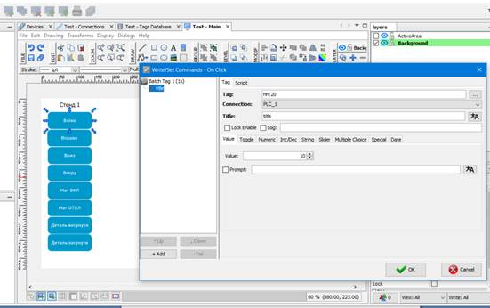

Рис. 6.25 Варіант реалізації командного управління роботом

 

\26. Збережіть проект. Завантажте його на пристрій та перевірте його роботу.

\27. Використовуючи елемент коло (Circle), тег статусу sta відповідного стенду, функцію побітового порівняння bitwise and та анімацію видимості, реалізуйте відображення кінцевих вимикачів для сигналізації кінцевого положення пневмопривода. Опис бітів слова sta наведено у табл. 6.4

Таблиця 6.4

Опис бітів слова статусу (тег sta)

| Номер біта | Опис біта                                 | Значення в десятковому форматі |
| ---------- | ----------------------------------------- | ------------------------------ |
| 1          | Магніт знаходиться у  верхньому положенні | 2                              |
| 2          | Магніт знаходиться у нижньому положенні   | 4                              |
| 3          | Каретка знаходиться у лівому  положенні   | 8                              |
| 4          | Каретка знаходиться у правому  положенні  | 16                             |
| 5          | Привод зміщення деталі вліво вимкнено     | 32                             |
| 6          | Привод зміщення деталі вліво увімкнено    | 64                             |
| 7          | Привод висування деталі вимкнено          | 128                            |
| 8          | Привод висування деталі увімкнено         | 256                            |
| 9          | Магніт увімкнений                         | 512                            |

Приклад формату запису функції для анімації відображення кінцевого вимикача наявності каретки у правому положенні показано на рис. 6.26

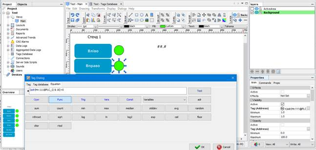

Рис. 6.26 Налаштування анімації видимості для елементу

 

На рис. 6.26 adr() – функція, що повертає значення тегу. У якості аргументу функції використовується tag@conection, «Hn:111@PLC1» - tag@conection, що відповідає тегу sta

\28. Розмістіть налаштований елемент біля кнопок відповідних команд.

\29. Збережіть проект. Завантажте його в пристрій та перевірте роботу.

\30. Аналогічно вже зробленому стенду реалізуйте управління іншим стендом із завдання.

## Питання до захисту. 

\1.   Поясніть основні принципи функціонування СКАДА програми mySCADA? 

\2.   Поясніть особливість використання у даній лабораторній роботі тегу CMD?

\3.   Яку послідовність необхідно зробити, щоб забезпечити доступ програми мобільного пристрою до  ПЛК? 

\4.   Поясніть особливість використання у даній лабораторній роботі тегу STA?

\5.   Які особливості в налаштуванні зв’язку між СКАДА mySCADA і ПЛК?

\6.   Поясніть призначення функції «bitwise and» та необхідність її використання в даній лабораторній роботі.  

 

 