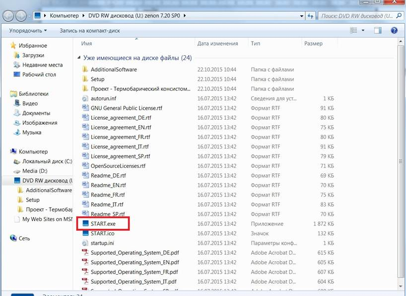
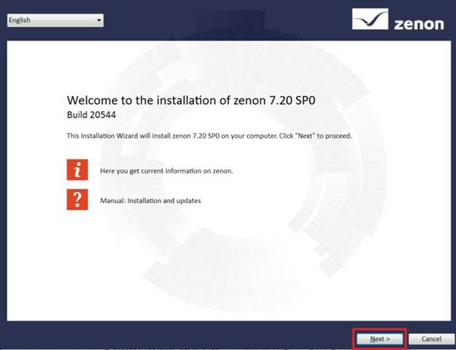
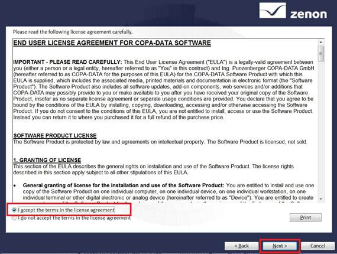
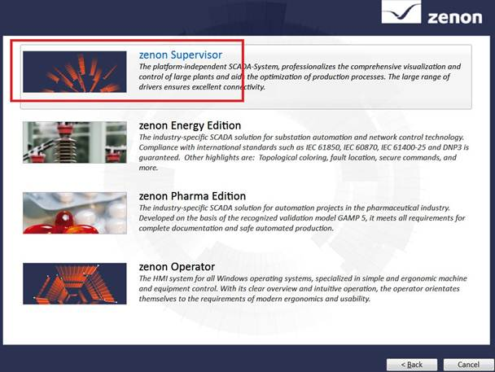

## zenon ЛР1: загальні положення і підготовка робочого місця

### Про лабораторний практикум

Лабораторний практикум по SCADA zenon підготовлений на базі матеріалів, розміщених [за посиланням. ](http://www.copa-data.com.ua/doc/zenon_basic_training_UKR.pdf)

Додаткові матеріали по zenon можна знайти на сайті http://www.copa-data.com.ua/

Перекладену документацію (українська мова) можна знайти тут http://www.copa-data.com.ua/doc/man_ukr/ 

Офіційним дистрибутором компанії COPA DATA в Україні є компанія [СВ Альтера ](http://www.svaltera.ua/)

У підготовці лабораторного практику брали участь: Олександр Пупена (ІАСУ НУХТ), Альона Бирченко (ІАСУ, АКС).

Спасибі Олександру Голінько (СВ Альтера) за сприяння в підготовці курсу.

### Посилання на образи інсталяції SCADA zenon

Лабораторний практикум проводиться на базі SCADA  zenon 7.2. Дана версія потребує ОС Windows 7 та вище. Нижче наведені  посилання на усі версії, починаючи з 6.22. 

[zenon 8.2](https://copadatawebsiteassets.azureedge.net/zenon-setups/eb6548de-436a-4c41-b128-1d1da2eed739?sv=2014-02-14&sr=b&sig=0jxgQqbozJg07WeUEuWE%2FNmMp5Bufaq4u5uh0km5JIg%3D&st=2020-10-26T23%3A00%3A00Z&se=2999-12-31T23%3A00%3A00Z&sp=r&rscd=attachment%3Bfilename%3Dzenon820_FinalBuild65486_COPA-DATA.iso) (сумісний з Windows 10) 

zenon 7.6 (сумісний з Windows 10) http://download.copadata.com/fileadmin/user_upload/Downloads/installation_cd/zenon760/SP0B36068/zenon760_FinalBuild36068_COPA-DATA.iso

zenon 7.5 (сумісний з Windows 10) http://download.copadata.com/fileadmin/user_upload/Downloads/installation_cd/zenon_750/SP0B25796/zenon750_FinalBuild25796_COPA-DATA.iso

zenon 7.20: http://download.copadata.com/fileadmin/user_upload/Downloads/installation_cd/zenon_720/SP0B20544/zenon720SP0_LanguageBuild20544_COPA-DATA.iso

zenon 7.00:  http://download.copadata.com/fileadmin/user_upload/Downloads/installation_cd/zenon_700/SP0B2/zenon_7.00_SP0_B2.iso   

zenon 6.51 SP0: http://download.copadata.com/fileadmin/user_upload/Downloads/installation_cd/zenon_651/SP0/zenon_6.51_SP0.iso

zenon 6.22 SP1: http://download.copadata.com/fileadmin/user_upload/Downloads/installation_cd/zenon_622/SP1/zenon_6.22_SP1.iso

[Файл правки ресєтру для продовження терміну використання](http://www.iasu-nuft.pp.ua/disciplini/lmi/reset.reg?attredirects=0&d=1)(для вер.7.2)

Ці матеріали  познайомлять Вас з базовими можливостями системи керування та навчать  створювати нескладні проекти візуалізації. Тут розглянуті найбільш  важливі етапи проектування, такі як розробка екранів мнемосхем,  елементів керування, ведення архівів, адміністрування користувачів та  багато інших моментів з якими стикається інженер під час створення  систем диспетчеризації.

*Виконання вказівок, представлених в даному посібнику, не заміняє проходження повноцінних навчальних курсів.* 

### Знайомство з системою

#### Структура

Концептуально SCADA zenon представляє собою  програмно-технічний комплекс який складається з середовища розробки  проектів – Editor та середовища виконання – Runtime. Це дві незалежні  оболонки, які виконують кожна свою функцію і можуть встановлюватися на  робочу станцію окремо одна від одної.

Середовище розробки містить набір модулів та  інструментів необхідних для написання повнофункціональних програм і  пакет драйверів для підключення до найбільш розповсюджених апаратних  засобів PLC.

Відповідно до задач, які необхідно вирішувати, SCADA zenon має чотири редакції:

| **zenon Operator**       | HMI-cистема, призначена для створення нескладних проектів візуалізації для панелей оператора, вбудованих  систем та локальних диспетчерських пунктів на ПК з певними  функціональними обмеженнями. |
| ------------------------ | ------------------------------------------------------------ |
| **zenon Supervisor**     | Незалежна SCADA-система, яка містить  повний набір функцій для реалізації диспетчерського керування та збору  даних. Ефективно вирішує задачі побудови систем автоматизації будь-які  складності. |
| **zenon Energy Edition** | Спеціальна редакція системи, яка містить додатковий набір функцій для енергетичної промисловості. |
| **zenon Pharma Edition** | Спеціальна редакція системи, яка містить додатковий набір функцій для фармацевтичної промисловості. |

Вибір необхідної редакції здійснюється на етапі установки системи. Для цього тренінгу ми будемо використовувати редакцію **zenon Supervisor**.

#### Ліцензування

Система ліцензується по кількості апаратних  змінних та тих додаткових модулів, які використовуються в проекті і не  входять в базову поставку.

Якщо Ви не маєте ліцензії, то програма (Editor\Runtime) після установки запуститься в DEMO-режимі.

Єдина відмінність ліцензованої версії від  демонстраційної – це часові обмеження що накладаються на систему. Перші  40 запусків програма буде працювати 30 хвилин, після чого час  безперебійної роботи урізається до 10 хвилин. По закінченню визначеного  часу, з’явиться відповідне повідомлення і система буде закрита. Проект,  який розробляв користувач, повністю зберігається. Для продовження роботи необхідно повторно запустити систему.

*Проходження даних навчальних курсів повністю можливе в демонстраційному режимі. Для комерційного використання необхідне придбання ліцензії. Для цього  звертайтесь в центральний офіс компанії СВ Альтера: Київ, бул. Івана  Лепсе 4, (044) 496-18-88,* [office@sv-altera.com](mailto:office@sv-altera.com)

### Інсталяція середовища розробки SCADA zenon

Комп’ютер, на який буде інсталюватися програмне забезпечення SCADA zenon 7.20 повинен відповідати наступним вимогам:

|      | Мінімальні           | Рекомендовані         |
| ---- | -------------------- | --------------------- |
| ОС   | Windows 7            | Windows 7 або новіша  |
| CPU  | Pentium 4            | Quad Core             |
| RAM  | 2 GB                 | 4 GB                  |
| HD   | 25 GB вільного місця | 200 GB вільного місця |

Якщо ваша система та ресурси не відповідають наведеним в таблиці,  можете використовувати більш старіші версії. При цьому деякі пункти  практикуму будуть виконуватися дещо іншим способом. 

**Завдання 1.1: Інсталюйте середовище розробки разом з середовищем виконання.** 

- Завантажте дистрибутив zenon зі [сторінки завантаження](http://cde.nuft.edu.ua/mod/book/view.php?id=325581). Запустіть процес установки системи за допомогою файлу “START.exe”.

- У вікні, що з’явилось натисніть кнопку “Next”.

- Прийміть умови ліцензійної угоди і натисніть кнопку “Next”.

- Виберіть інсталяцію середовища розробки проекту **zenon Editor**
- У наступному вікні виберіть версію **zenon Supervisor**.

- На завершальному етапі виберіть пункт *Install now* та завершіть встановлення