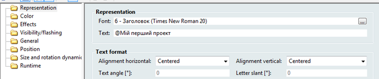

## zenon ЛР10: Мультимовна підтримка

### ЗМІНА МОВИ

Під поняттям інтернаціоналізації ми розуміємо можливість системи керування в онлайн режимі представляти користувацький інтерфейс в зрозумілій для  оператора формі, незалежно від країни в якій експлуатується проект. В  нашому прикладі ми розглянемо питання зміни мови тексту проекту, а також конвертування одиниць вимірювання представлених змінних.

Технологія перемикання мови дозволяє змінювати  мову будь-якого тексту в Runtime (підписи елементів, граничні тексти,  ідентифікатори змінних), записи списків тривог, подій, стандартні  діалоги, змінювати при перемиканні використовуваний шрифт, медіа-файли.

Мовне перемикання здійснюється на базі сформованих в проекті мовних таблиць. Для кожної мови створюється своя таблиця, яка містить відповідники до оригінальних текстів проекту.

Текст, який підлягає перекладу позначається на початку ключовим символом '@'.

*При перекладі фрази дозволяється використання  декількох символів '@' для розділення тих слів, які ми хочемо  перекладати, а які ні.* 

*Наприклад: @Користувач@ Олександр*

*Слово між першим і другим символом перекладеться, а останнє – ні. Сам ключовий символ на екрані не відображається.* 

Давайте зробимо так, щоб оператор міг в онлайн  режимі перемикати мову тексту 'Мій перший проект' на екрані процесу, а  також підписи кнопок на панелі навігації. Переклад будемо здійснювати з  української на англійську.

**Додавання ключового символу**

***\**\*Завдання 11.1: Створіть мультимовний текст на екрані.\*\**\***

- Виділіть елемент статичного тексту на екрані 'Процес' і у вікні  властивостей Representation -> Text перед текстом додайте символ '@'

- Аналогічним чином модифікуйте підписи на кнопках 'Процес', 'Хронологія', 'Тривоги', 'Архів', 'Тренди' навігаційної панелі

<iframe width="640" height="360" src="https://www.youtube.com/embed/yOnJ6ut57Hg" title="YouTube video player" frameborder="0" allow="accelerometer; autoplay; clipboard-write; encrypted-media; gyroscope; picture-in-picture" allowfullscreen></iframe>

**Створення мовних таблиць**

***\**\*\*\*Завдання 11.2: Створіть мовні таблиці\*\*\*\*\**** 

- В дереві проекту активуйте пункт *Language* *file* і через праву кнопку мишки виберіть пункт *New* *language* *file*
- У вікні що з’явилось задайте ім’я таблиці - 'UA'

- Повторіть цю операцію і створіть мовну таблицю  'EN'

На даному етапі у вікні детального перегляду  повинно бути чотири колонки мовних таблиць: Keyword - слово чи вираз,  який починається з символу '@', ZENONSTR.TXT – створюється та  завантажується системою автоматично, мовна таблиця 'UA' та 'EN'.

Поступово заповнимо рядки таблиць.

- В першій колонці запишіть ключове слово 'Мій перший проект'

Цей запис автоматично розповсюдиться на усі колонки

- В колонці 'EN' змініть напис на 'My first project'
- Аналогічним чином заповніть рядки для підписів навігаційних кнопок

Після заповнення мовна таблиця повинна мати наступний вигляд:

*Для швидкого перекладу слів мовну таблицю можна експортувати в текстовому форматі та обробити зовнішньою програмою –  мовним редактором.*

- Після закінчення заповнення таблиці натисніть зверху на піктограму збереження мовних файлів.

*Для кожної мовної таблиці в* *Runtime**-файлах проекту система створює свій мовний файл (ZENONSTR.**TXT**,* *UA**.**TXT* *та* *EN**.**TXT**). Також, в дереві проекту, розділ* *Files**, система створила мовні папки для наповнення їх відповідним контентом.*

<iframe width="640" height="360" src="https://www.youtube.com/embed/PsT1XuP1qhs" title="YouTube video player" frameborder="0" allow="accelerometer; autoplay; clipboard-write; encrypted-media; gyroscope; picture-in-picture" allowfullscreen></iframe>

### Керування перемиканням

***\**\*\*\*Завдання 11.3: Створіть функції перемикання мови та кнопки для виклику цих функцій\*\*\*\*\**** 

Для ініціації зміни мови нам необхідно створити відповідні функції та кнопки на панелі навігації.

- В менеджері проекту зайдіть в розділ *Functions* і створіть нову функцію *Application -> Language switch*
- В діалоговому вікні для поля *Language* *file* виберіть мовний файл 'UA'
- Закрийте діалог кнопкою *OK* і перейменуйте цю функцію в 'Зміна мови UA'
- Аналогічним чином створіть функцію 'Зміна мови EN'

- На екрані навігації справа створіть дві кнопки  перемикання на українську і англійську мову, та прив’яжіть до них  створені функції зміни мовної таблиці
- В розділі *Representations* *->* *Graphics* *file* вікна властивостей кнопки, прив’яжіть картинку відображення прапора держави. Попередньо завантажте відповідні файли в розділ *File* *->* *Graphics* з інтернету

Запустіть проект і виконайте перемикання. Проконтролюйте зміну мови.

Наша навігаційна панель тепер повинна мати наступний вигляд:

*Якщо потрібно, щоб відразу проект запускався на мові, відмінній від тієї на якій його зроблено, то необхідно функцію  перемикання вставити в скрипт автозапуску.*

У великих проектах дуже довго вручну складати  мовні таблиці. Для полегшення цього процесу в систему керування  інтегровано спеціального майстра-помічника, який в автоматичному режимі  виконає задачу збору всіх текстів в проекті та додавання до них  ключового символу.

- В середовищі розробки проекту зайдіть в головне меню *File* *->* *Wizards**…*

В папці *Language Table* ви знайдете помічника *Language Table Wizard*.

Спробуйте самостійно за його допомогою крок за кроком створити мовні таблиці проекту.

<iframe width="640" height="360" src="https://www.youtube.com/embed/kbQ17MS50fU" title="YouTube video player" frameborder="0" allow="accelerometer; autoplay; clipboard-write; encrypted-media; gyroscope; picture-in-picture" allowfullscreen></iframe>

### Зміна одиниць вимірювання

Існують випадки, коли для зручності представлення вимірюваних величин, їх  необхідно відображати в різних одиницях. Наприклад, тиск можна  представляти в барах чи паскалях, або температуру в цельсіях чи  фаренгейтах.

***\**\*\*\*Завдання 11.4: Зробіть можливість вибору оператором різних одиниць вимірювання.\*\*\*\*\**** 

В нашому проекті є змінні температури, тому ми зробимо так, щоб оператор міг кнопками перемикати одиниці вимірювання з °С на °F.

- В дереві проекту активуйте пункт *Variables* *->* *Units* і через праву кнопку мишки виберіть *New* *base* *unit*
- Зайдіть у властивості створеної базової одиниці *General* *->* *Measuring* *unit**:* і перейменуйте на '°С'
- На панелі інструментів вікна детального перегляду виберіть піктограму *New* *conversion* *unit*
- Перейменуйте створену конвертаційну одиницю на '°F'

Тепер нам необхідно задати коефіцієнт перерахунку виміряної величини. Відоме наступне співвідношення конвертації одиниць:

1 градус Фаренгейта = 1 градус Цельсія *1.8+32

- Зайдіть у властивості конвертаційної одиниці *General* *->* *Factor**:* і задайте значення '1.8'
- Для *General* *->* *Offset**:* встановіть значення '32'

<iframe width="640" height="360" src="https://www.youtube.com/embed/1dUKFvRpNKI" title="YouTube video player" frameborder="0" allow="accelerometer; autoplay; clipboard-write; encrypted-media; gyroscope; picture-in-picture" allowfullscreen></iframe>

**Керування перемиканням**

Для ініціації зміни одиниць вимірювання необхідно створити відповідні функції та кнопки на панелі навігації.

- В менеджері проекту зайдіть в розділ *Functions* і створіть нову функцію *Variable* *->* *Unit conversion*
- В діалоговому вікні встановіть перемикання *°**С* на *°**F* і закрийте його кнопкою *OK*
- Назвіть створену функцію 'Зміна одиниць вимірювання - F'

**

- Аналогічним чином створіть функцію повернення в базову одиницю і назвіть 'Зміна одиниць вимірювання - С'
- Створіть на екрані навігації дві системні кнопки '°С' та '°F' і прив’яжіть до них відповідні функції

Щоб конвертація запрацювала, необхідно вказати до яких змінних вона стосується.

- Зайдіть у властивості змінної 'Температура[1] ' і в пункті *General* *->* *Measuring* *unit* *:* зітріть ту одиницю вимірювання що там стоїть і зі спадного меню виберіть ту, яку ми тільки що створили - '°С'
- Повторіть цю операцію для інших температурних змінних

Запустіть проект і перевірте як працює система конвертації одиниць вимірювання.

Докладніше про зміну мови можна прочитати в мануалі Language switch.

Докладніше про вбудованих в систему майстрів-помічників (не тільки про мовний) можна прочитати в мануалі Wizards.

Докладніше про зміну одиниць вимірювання можна прочитати в мануалі Measuring unit conversion.

<iframe width="640" height="360" src="https://www.youtube.com/embed/xepblaLx7qE" title="YouTube video player" frameborder="0" allow="accelerometer; autoplay; clipboard-write; encrypted-media; gyroscope; picture-in-picture" allowfullscreen></iframe>