## zenon ЛР2: проект, екрани, функції

### Робочий простір та проект zenon

#### Середовище розробки zenon.

Середовище розробки (**zenon Editor**) дозволяє розробляти проекти та записувати їх в пристрої (ПК, панелі оператора) з середовищем виконання.

Середовище розробки підтримує декілька мов в тмоу числі, російську.  Переключення на потрібну мову проводиться через меню  Options->Settings->Language

 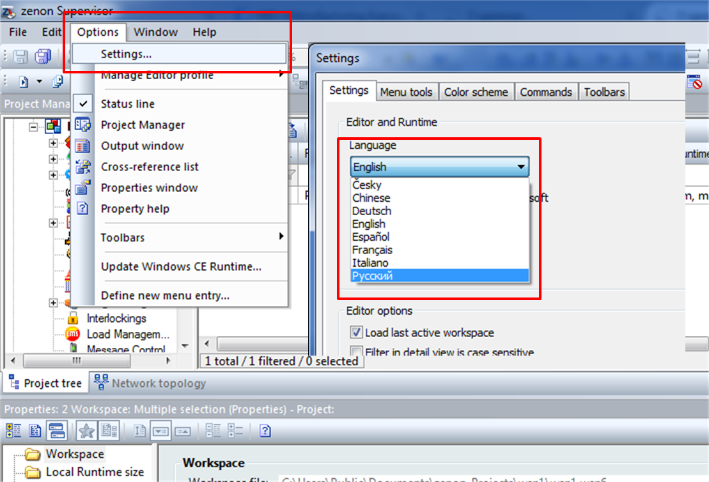

Після вибору мови, необхідно перевантажити zenon Editor.

Надалі, в прикладах будуть приводитися  копії екранів та відео з англійською мовою редактору. У різних версіях  та документах для російської мови можуть зустрічатися розбіжності в  перекладах. 

В цьому розділі ми розглянемо поняття робочого  простору та мультипроектності в zenon, видами проектів, і почнемо  створювати наш перший проект.

#### Поняття робочого простору.

Технологія горизонтальної та вертикальної  відкритості передбачає побудову мультипроектних систем, головна ідея  яких полягає в тому, що створюється ряд проектів, які ієрархічно  пов’язані оди з одним. Тобто, є головний проект, який містить декілька  підпроектів, які в свою чергу також можуть містити свої підпроекти.  Система не обмежує розміри такої структури.

*Горизонтальна відкритість – можливість з одної  робочої станції керувати різними проектами, які знаходяться на одному  ієрархічному рівні на різних ПК.*

*Вертикальна відкритість – можливість з  центральної робочої станції керувати проектами, які знаходяться нижче по ієрархічній структурі системи автоматизації.*

Для забезпечення реалізації мультипроектності, усі проекти створюються на базі робочого простору, де потім, при потребі, і виконується формування структури системи.

Мультипроектну структуру доцільно використовувати  для великих, розгалужених проектів, в той час як для простих систем, в  більшості випадків, в робочому просторі створюють один проект.

#### Види проектів

Розрізняють *Стандартні проекти* та *Глобальні проекти.* Різниця між ними полягає у тому, що останній варіант доцільно використовувати,  якщо ми будемо створювати декілька однотипних проектів. При цьому, в  головній частині одноразово визначаються шрифти, кольорові палітри,  моделі обладнання і т.д., які будуть актуальні для усіх проектів, що  знаходяться в структурі глобального проекту.

Також, на початковому етапі розробник має можливість активувати опцію *Багатокористувацької розробки,* яка є однією з визначальних характеристик zenon*.*

*Багатокористувацька розробка – можливість команді проектувальників одночасно здійснювати розробку одного проекту.* 

В нашому навчанні ми будемо створювати простий стандартний проект.

**Завдання 3.1: Створіть робочий простір 
**

-  В меню *File* виберіть *Workspace -**>* *N**ew**…*
- Для робочого простору задайте ім’я 'Навчання', та при необхідності скоректуйте директорію розташування

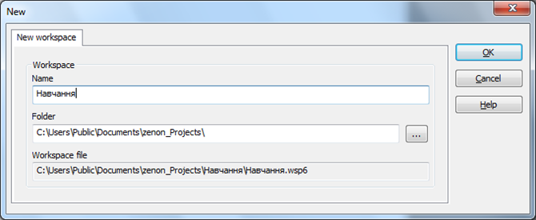

- Після натиснення *OK**,* система автоматично створить файл 'Навчання.wsp6'.

**Завдання 3.2: Створіть проект**

- В меню *File* виберіть *Project n**ew**…*

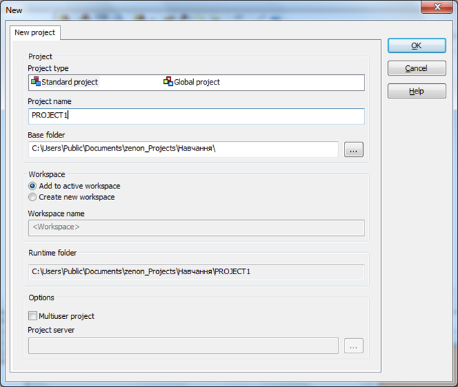

- Задайте ім’я проекту 'PROJECT1'
- Інші налаштування залиште без змін і, натиснувши кнопку *OK*, створіть проект. Система автоматично згенерує структуру та файли внутрішньої SQL-бази проекту.
- Після цього автоматично з’явиться діалогове вікно  Майстра створення нового проекту, написаного на VSTA. Ми будемо  розробляти проект уручну, тому просто закрийте його кнопкою *Canсel*.

<iframe width="640" height="360" src="https://www.youtube.com/embed/p0530LMHynA" title="YouTube video player" frameborder="0" allow="accelerometer; autoplay; clipboard-write; encrypted-media; gyroscope; picture-in-picture" allowfullscreen></iframe>

### Конфігурування проекту

На даному етапі, після виконаних дій ми маємо робочий простір 'Навчання' з проектом 'PROJECT1'. Усі налаштування створеного проекту знаходяться у  вікні властивостей, яке знаходиться в нижній частині середовища  розробки. Залежно від вибраного пункту дерева проекту, вікно  властивостей буде містити відповідний до нього контекст.

**Завдання 3.3: Налаштуйте проект**

- В дереві проекту клікніть на назві проекту

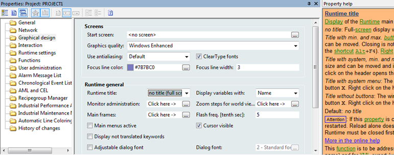

- У вікні властивостей з’являться усі найважливіші  налаштування цього проекту. Більшість з них зараз займати не будемо.  Поступово, ми з ними познайомимося. Зараз лише змінимо графічне  представлення екранів нашого проекту. 

- В розділі *Graphical design* для пункту *Runtime title* зі спадного меню виберіть *no title (full screen)*

- При цьому, екрани дисплейних мнемосхем не будуть  містити заголовку з системними кнопками. Інші варіанти вибору дозволяють встановлювати заголовок для екранів, системні кнопки закриття та  згортання.

  Справа від вікна властивостей проекту знаходиться  вікно інтерактивної допомоги, яке автоматично виводить довідкову  інформацію відносно активованих опцій. Таким чином, розробник відразу  може орієнтуватись в призначенні тієї чи іншої властивості.  

  При створенні проекту система керування на  жорсткому диску автоматично створить усі необхідні папки. По  замовчуванню, RT-файли проекту міститься в директорії zenon_Projects.  Також, кожному проекту присвоюється унікальний Project ID, який  відповідає створеній папці у внутрішній SQL-базі zenon. Всю цю  інформацію можна знайти у властивостях проекту, розділ *General*.

  Конкретні шляхи розміщення файлової структури системи, залежно від операційної системи, описані в мануалі Installation and updates -> File structure. 

  <iframe width="640" height="360" src="https://www.youtube.com/embed/cfKCoBry3rE" title="YouTube video player" frameborder="0" allow="accelerometer; autoplay; clipboard-write; encrypted-media; gyroscope; picture-in-picture" allowfullscreen></iframe>

### Резервне копіювання

Перенос і збереження проекту здійснюється за рахунок створення резервної копії самого проекту чи усього робочого простору.

**Завдання 3.4. Зробіть резервну копію проекту**

- В дереві проекту зайдіть в розділ *Project* *backups* і клікніть на іконці *Create* *backup*
- Після створення резервної копії експортуйте її у необхідну директорію: іконка *Export* *backup*

Проект представляє собою zip-архів з RT-файлами  проекту та SQL-бази даних. Відкрити\відновити такий проект можна лише в  існуючому робочому просторі.

- Головне меню *File* *-> Restore project backup*

**Завдання 3.5. Зробіть рез****ервну** **копію** ***робочого простору***

- Зайдіть в головне меню *File* *->* *Workspace* і виберіть пункт *Create* *backup*
- Задайте ім’я та директорію збереження файлу робочого простору

Система створить wsb-файл, який тепер можна легко перенести на інший комп’ютер.

Для відновлення робочого простору з резервної копії, необхідно виконати наступні кроки:

- Зайдіть в головне меню *File* *->* *Workspace* і виберіть пункт *Restore* *backup*
- Виберіть необхідний wsb-файл

Якщо при роботі Ви просто закрили робочий простір, створили новий, чи система керування автоматично не підгрузила останній робочий простір з яким Ви працювали, то для його відкриття необхідно  виконати наступне:

- Зайдіть в головне меню *File* *->* *Workspace* і виберіть пункт *Open*
- Виберіть в папці з назвою робочого простору файл *.wsb6

<iframe width="640" height="360" src="https://www.youtube.com/embed/6A2XjYlHaxE" title="YouTube video player" frameborder="0" allow="accelerometer; autoplay; clipboard-write; encrypted-media; gyroscope; picture-in-picture" allowfullscreen></iframe>

### Фрейми (шаблони) для екранів

Екрани представляють собою інтерфейс взаємодії оператора з процесом. Це  мнемосхеми відображення об’єкта автоматизації, які містять елементи  керування та інформування оператора.

#### Концепція фреймів

В zenon усі екрани базуються на фреймах які  утворюють “кістяк” проекту. Відповідно до розміщення та розміру фрейму,  екрани, що утворені на його основі, з’являються в проекті у чітко  визначених зонах та приймають його розміри.

Зазвичай область представлення проекту розділяють  на три зони: верхня зона інформаційного характеру, головна зона з  представленням процесу, індикацією параметрів та елементами керування  процесом, та нижня зона – панель навігації по проекту.

Для нашого демонстраційного проекту ми створимо два фрейми: 'Головний' та 'Навігація'.

**Завдання 3.6: Створити фрейми (шаблони екранів)**

- В менеджері проекту відкрийте вузол *Screens* і виберіть пункт *Frames*
- У вікні детального перегляду клікніть на іконці *New* *frame*

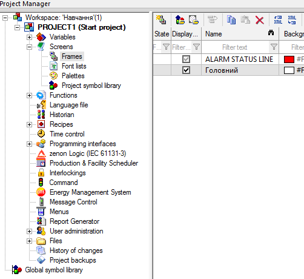

- В розділі *General* вікна властивостей перейменуйте створений фрейм 'Frame_0' на 'Головний', а в розділі *Position* задайте йому розмір координатами 0\20 х 1280\900 (для монітору 1280 х 1024).
- Для створення навігаційного фрейму виконайте аналогічні кроки. Задайте йому ім’я 'Навігація' та координати 0\900 х 1280\1024.

Тепер редактор фреймів повинен мати наступний вигляд:

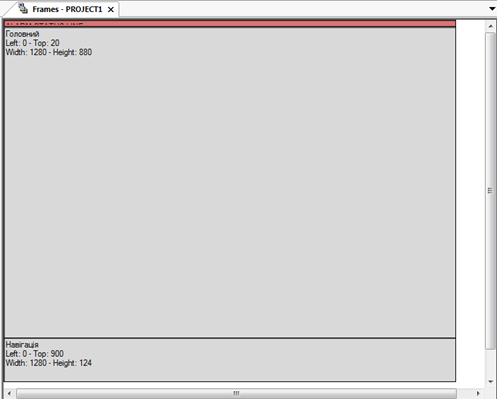

- В верхній частині редактора фреймів ми залишили  поле шириною в 20 pix для відображення головного меню проекту, яке  створимо пізніше. Зараз це поле займає червоний фрейм Статусного вікна  тривог.

*Статусне вікно тривог – спеціальний тип вікна,  призначений для відображення в онлайн режимі тривог, що з’являються в  системі. Це вікно представляє одно-строкове поле, яке з’являється поверх усіх вікон і інформує оператора про появу тривоги.* 

- Давайте для нашого демонстраційного прикладу відключимо це вікно.
- У властивостях проекту зайдіть в розділ *Alarm Message List*
- В полі *Alarm status line*  деактивуйте бокс [*Status line active*](its:C:\Program Files (x86)\COPA-DATA\zenon 7.10 SP0\Help\english\main.chm::/EH_ID_AML_STATUS_AKTIV.htmEH_ID_AML_STATUS_AKTIV.htm)

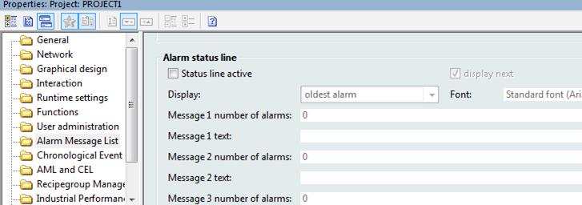

<iframe width="640" height="360" src="https://www.youtube.com/embed/Eyk0MFrbwkI" title="YouTube video player" frameborder="0" allow="accelerometer; autoplay; clipboard-write; encrypted-media; gyroscope; picture-in-picture" allowfullscreen></iframe>

### Екрани

#### Типи екранів та їх шаблони

Для реалізації мнемосхем процесів та діалогових вікон використовуються звичайні екрани, які в zenon мають тип *Standard**.* Для створення спеціальних екранів, таких як тривоги, архіви, тренди і т.д.  необхідно використовувати відповідний тип, в якому системою наперед  закладено ряд функцій та елементів, притаманних суто йому. Вибір типу  здійснюється через властивості екрану *General* *->* *Screen* *type**.* Зайшовши в спадне меню можна вибрити будь-який спеціальний тип. Призначення кожного з них детально описується в мануалі Screens.

Щоб зекономити розробнику час на створення  елементів керування для спеціальних екранів, в систему керування  інтегровано готовий набір шаблонів. Для кожного типу екрану створено  свій шаблон з набором відповідних кнопок, текстових та списочних полів.

**Завдання 3.7: Створіть екрани "Процес" для основної мнемосхеми, та "Навігація" для розміщення кнопок навігації по екранам. 
**

- В менеджері проекту виберіть вузол *Screens*
- У вікні детального перегляду клікніть на іконці *New* *screen*
- Через вікно властивостей перейменуйте створений екран на 'Процес' та задайте довільний колір фону
- Проконтролюйте, щоб створений екран базувався на фреймі 'Головний' та мав тип *Standard**.*

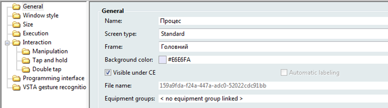

Після створення екрану, він автоматично відкриється в області головного вікна в Editor.

- Аналогічним чином створіть екран для відображення нашої навігаційної панелі. Назвіть його 'Навігація', змініть колір фону та прив’яжіть до однойменного фрейму.

Таким чином, ми створили два екрани, при чому  екран 'Процес' являється стартовим. Тобто саме він буде з’являтися  першим при запуску проекту. За бажанням, цю прив’язку можна змінити.

- Виділіть мишкою в дереві проекту його назву і у вікні властивостей проекту зайдіть в розділ *Graphical* *design*. 
- В полі *Start* *screen* повинно стояти 'Процес'

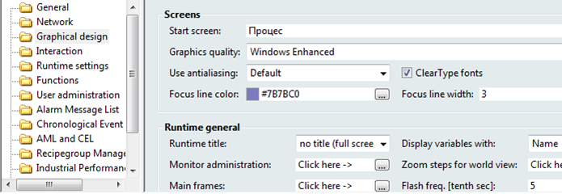

<iframe width="640" height="360" src="https://www.youtube.com/embed/cp8xTfb5qos" title="YouTube video player" frameborder="0" allow="accelerometer; autoplay; clipboard-write; encrypted-media; gyroscope; picture-in-picture" allowfullscreen></iframe>

### Функції та запуск режиму виконання

**Завдання 3.8. Створіть функції переходів на екрани "Навігація" та "Процес".**

- В менеджері проекту виберіть вузол *Functions*
- У вікні детального перегляду клікніть на іконці *New* *function*
- Автоматично з’явиться вікно вибору функції. В zenon  усі необхідні функції вже наперед створені. Проектувальнику необхідно  лише вибрати відповідну функцію та сконфігурувати її.
- У вікні функцій виберіть *Screen* *switch*, яка знаходиться в розділі *Favorites*

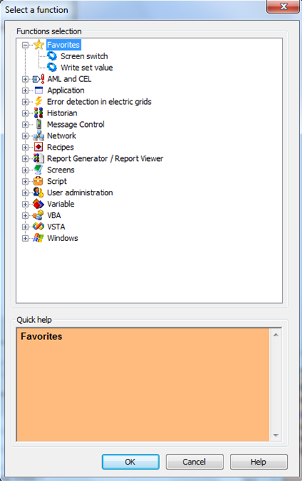

- У наступному діалоговому вікні задайте перемикання на екран 'Навігація'

- У властивостях створеної функції зайдіть в розділ *General* і в полі *Start* *function*  перейменуйте її на 'Перехід на екран Навігація'
- Зайдіть у властивостях екрану 'Процес' в розділ *Execution* і прив’яжіть створену функцію 'Перехід на екран Навігація'

**Завдання 3.9.** **Запустіть zenon в режимі Runtime і перевірте зроблену роботу.**

- На верхній інструментальній панелі Editor клікніть іконку *Start* Runtime або натисніть *F**5*
- Перевірте чи все вийшло як заплановано і натиснувши комбінацію клавіш Alt+F4 поверніться назад в Editor.

#### **Графічні стилі екранів**

Оскільки на початку створення проекту в налаштуваннях *Graphical* *design* пункт *Runtime title* ми обрали опцію *no title (full screen),* то інтерфейс екранів проекту не має жодних заголовків чи системних кнопок, тобто дисплейна мнемосхема займає всю площу відображення. Проте, при  потребі, існує можливість визначення цих елементів індивідуально для  окремих екранів (наприклад, pop-up діалоги). Для цього у властивостях  фрейму, на якому базується відповідний екран, необхідно зайти в розділ *Border* *->* *Border* *type* і вибрати тип границі.

<iframe width="640" height="360" src="https://www.youtube.com/embed/MflE-NzscYw" title="YouTube video player" frameborder="0" allow="accelerometer; autoplay; clipboard-write; encrypted-media; gyroscope; picture-in-picture" allowfullscreen></iframe>

### Статичний текст

Усі елементи, що можуть використовуватись на екранах, поділяються на статичні та динамічні.

До статичних елементів відносяться: лінії, прямокутники, кола, текстові поля...

До динамічних елементів відносяться: покажчики, слайдери, перемикачі, цифрові поля, ActiveX-елементи…

Ці всі елементи можна знайти на інструментальній панелі *Elements* (як правило знаходиться справа) або в головному меню редактора.

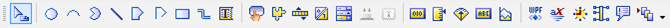

***\*Завдання 3.10. Ство\**\**ріть\** \**с\**татичний текст 'Мій перший проект' 
**

- Відкрийте екран 'Процес'
- На інструментальній панелі виберіть елемент *Static* *text*
- В верхній частині екрану клікніть мишкою і не відпускаючи потягніть до утворення прямокутної текстової зони
- Зайдіть в розділ *Representation* властивостей елементу і в полі *Text* задайте свій довільний текст, наприклад, 'Мій перший проект'

Після активації  зроблених змін, в намальованому текстовому полі з’явиться введена фраза. Відредагуйте розмір таким чином, щоб вона повністю поміщалася в одну  строку.  Спробуйте для цього елементу змінити колір фону та тексту.

<iframe width="640" height="360" src="https://www.youtube.com/embed/35WhKMvEnOQ" title="YouTube video player" frameborder="0" allow="accelerometer; autoplay; clipboard-write; encrypted-media; gyroscope; picture-in-picture" allowfullscreen></iframe>

**Завдання 3.11. Створіть власний шрифт.**

- В дереві проекту відкрийте вузол *Screens* і виберіть пункт *Font* *lists*
- У вікні детального перегляду клікніть на іконці *New* *font*

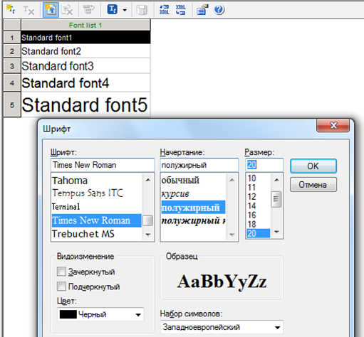

- В наступному діалоговому вікні виберіть шрифт Times New Roman, напівжирний, 20 і підтвердіть вибір кнопкою *OK*
- Через властивості створеного шрифту задайте йому ім’я 'Заголовок'

Тепер наш екран повинен мати наступний вигляд:

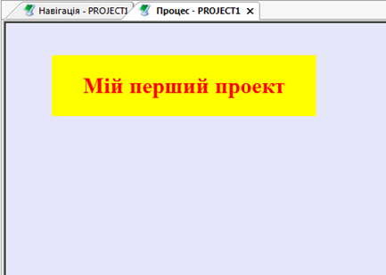

Цей шрифт ми можемо використовувати будь-де в проекті.

- Виберіть на головному екрані створений нами текстовий елемент і у властивостях *Representation* *->* *Font* змініть шрифт на ім’я 'Заголовок'

<iframe width="640" height="360" src="https://www.youtube.com/embed/tIpoBU5EGME" title="YouTube video player" frameborder="0" allow="accelerometer; autoplay; clipboard-write; encrypted-media; gyroscope; picture-in-picture" allowfullscreen></iframe>

### Кнопки

Для керування проектом нам необхідно створити декілька кнопок, а саме:  кнопку переходу на головний екран 'Процес', закриття Runtime і онлайн  перезавантаження проекту.

*Онлайн перезавантаження – це функція, яка  дозволяє без зупинки проекту вносити до нього зміни. Вона широко  використовується під час розробки та в системах, критичних до  переривання роботи середовища виконання.*

**Завдання 3.12. Створіть функції для переходу не екран "Процес", виходу з режиму виконання та перезавантаження системи виконання.**

- В менеджері проекту виберіть вузол Functions
- У вікні детального перегляду клікніть на іконці New function
- Виберіть функцію Screen switch
- У наступному діалоговому вікні задайте перемикання на екран 'Процес'
- Далі натисніть OK і на цьому закінчіть створення функції 
- У властивостях цієї функції зайдіть в розділ General і в полі Name перейменуйте її на 'Перехід на екран Процес'
- Аналогічним чином створіть функцію Exit Runtime та Reload project  online, які знаходяться в вузлі Application. Перейменуйте їх на  'Закриття Runtime' та 'Онлайн перезавантаження' відповідно.

*Важливо давати функціям адекватні назви, щоб  потім можна було легко в них орієнтуватися. Це ж стосується і назв  екранів та змінних.*

**Завдання 3.13. Створіть кнопки на екрані для переходу на екран "Процес", та виконання функцій \**виходу з режиму виконання та перезавантаження системи виконання. Перевірте зроблене в рантаймі (режимі виконання).\** 
**

- Відкрийте екран 'Навігація'
- На інструментальній панелі виберіть елемент Button
- В лівій частині екрану клікніть мишкою і не відпускаючи потягніть до утворення кнопки потрібного розміру
- Автоматично з’явиться діалогове вікно, в якому виберіть створену нами функцію 'Перехід на екран Процес' .
- Зайдіть в розділ Representation властивостей кнопки і в полі Text line 1 підпишіть її як 'Процес'
- Змініть шрифт на Standatd font 4 або створіть свій власний
- В правій частині екрану навігації розмістіть  системні кнопки закриття та перевантаження проекту 'Exit' і 'Reload'.  Прив’яжіть до них відповідні функції. Ви можете за бажанням змінити  колір кнопок та їх зовнішнє відображення.

На даному етапі екран 'Навігація' повинен мати наступний вигляд:

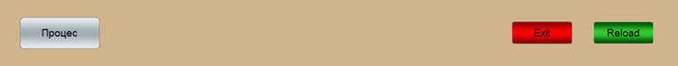

- Запустіть Runtime і перевірте як працюють створені кнопки. Тепер ми можемо не  закривати Runtime, а користуватись кнопкою Reload. Майте на увазі, що  при натисканні кнопки 'Процес' в проекті нічого змінюватися не буде,  оскільки цей екран в нас вже відкрито.

<iframe width="640" height="360" src="https://www.youtube.com/embed/DSJuA7xhTvg" title="YouTube video player" frameborder="0" allow="accelerometer; autoplay; clipboard-write; encrypted-media; gyroscope; picture-in-picture" allowfullscreen></iframe>

### Типи екранів та їх шаблони

Для реалізації мнемосхем процесів та діалогових вікон використовуються звичайні екрани, які в zenon мають тип *Standard**.* Для створення спеціальних екранів, таких як тривоги, архіви, тренди і т.д.  необхідно використовувати відповідний тип, в якому системою наперед  закладено ряд функцій та елементів, притаманних суто йому. Вибір типу  здійснюється через властивості екрану *General* *->* *Screen* *type**.* Зайшовши в спадне меню можна вибрити будь-який спеціальний тип. Призначення кожного з них детально описується в мануалі Screens.

Щоб зекономити розробнику час на створення  елементів керування для спеціальних екранів, в систему керування  інтегровано готовий набір шаблонів. Для кожного типу екрану створено  свій шаблон з набором відповідних кнопок, текстових та списочних полів.

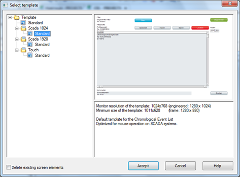

Докладніше  процес створення спеціальних екранів та використання шаблонів буде  розглянуто в подальших розділах даного навчального курсу.

