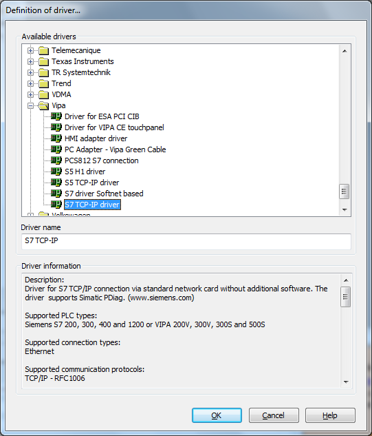
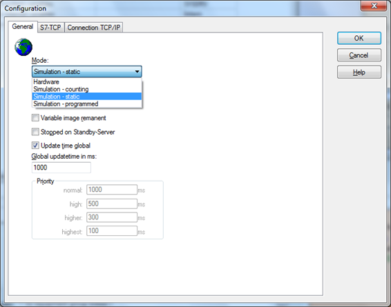
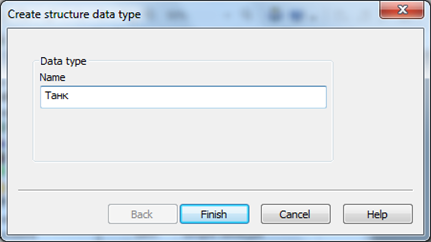
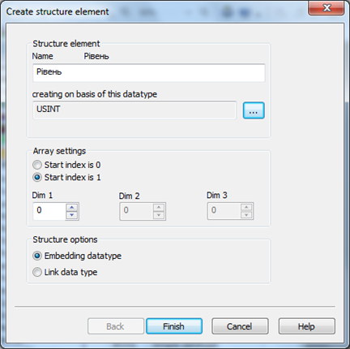
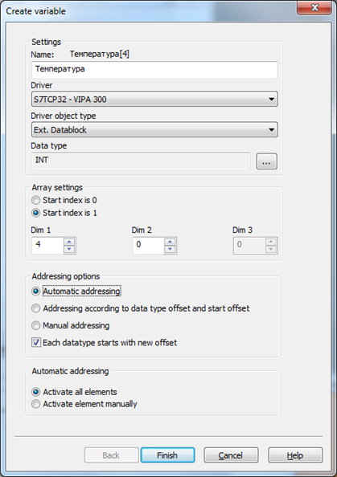
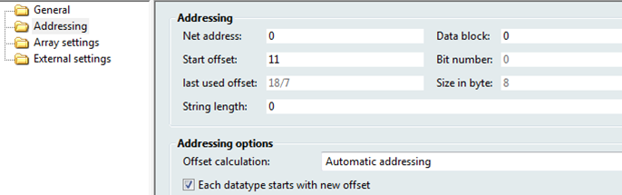
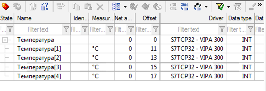
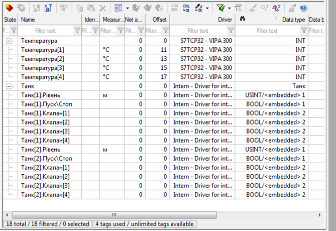

## zenon ЛР3: Змінні

### Налаштування драйверу

#### Драйвери

В цій лабораторній роботі ми перейдемо до  технічної сторони створення будь-якого проекту – організації зв’язку з  апаратними засобами. Для цього ми виберемо та сконфігуруємо  комунікаційний драйвер, а потім на його базі створимо декілька  змінних. 

Система керування отримує дані від обладнання  через драйвер. Він вибирається відповідно до мережевого протоколу чи  виробника PLC. В zenon інтегровано понад 300 різноманітних драйверів для підключення до найбільш розповсюдженого обладнання.

**Завдання 4.1. Створіть та законфігуруйте драйвер для зв'язку з VIPA 300 по S7 TCP/IP.**

- В менеджері проекту зайдіть в вузол *Variables* і виберіть пункт *Driver*

Як Ви бачите у вікні детального перегляду, тут вже є  декілька драйверів для створення внутрішніх, математичних та системних  змінних

- У вікні детального перегляду клікніть на іконці *New* *driver*

Автоматично відкриється вікно вибору драйверу.

- Знайдіть папку *Vipa* і виберіть драйвер *S**7* *TCP**-**IP*
- Перейменуйте його на 'VIPA 300' і підтвердіть зроблений вибір кнопкою *OK*

*Перейменування драйверу може знадобитись тоді, коли Ви буде створювати мультитдайверну систему з багатьма контролерами.*

Тепер відкриється діалогове вікно конфігурування драйверу.

- Переведіть *Mode* в *Simulation – static*

Якщо буде стояти режим *Hardware* після запуску  Runtime система відразу спробує з’єднатися з PLC. Оскільки у нас фізично його немає, то в проекті з’явиться помилка комунікації. Для нашого  прикладу ми будемо працювати в стимуляційному режимі. В інших закладках  налаштовуються комунікаційні параметри. Докладно про них можна знайти в  мануалі на відповідний драйвер. При роботі в режимі симуляції жодних  додаткових налаштувань робити не потрібно.

- Закінчіть конфігурування драйверу натиснувши кнопку *OK*

<iframe width="640" height="360" src="https://www.youtube.com/embed/R_XnzFzaVxw" title="YouTube video player" frameborder="0" allow="accelerometer; autoplay; clipboard-write; encrypted-media; gyroscope; picture-in-picture" allowfullscreen></iframe>

### Типи даних

Усі змінні повинні відповідати конкретним типам даних згідно до стандартів  IEC. В zenon існує можливість використати існуючі типи або створити свій простий чи структурований тип даних.

В проекті ми будемо використовувати існуючі типи даних, а також структурований, який ми зараз і створимо.

**Завдання 4.2 Створіть структурований тип даних "Танк" для з полями "Рівень", "Пуск/Стоп" та "Клапан".**

- В менеджері проекту зайдіть в вузол *Variables* і виберіть пункт *Datatypes*
- У вікні детального перегляду клікніть на іконці *New* *structure* *datatype*

- В якості імені нового структурованого типу задайте 'Танк'

Далі автоматично з’явиться вікно створення елементів структури

- Задайте ім’я 'Рівень', і як базовий тип даних виберіть *USINT* 
- В полі опції повинно бути активно *Embedded*

*Якщо для елементу структури вибрано Embedded,  то властивості його типу даних можуть змінюватись незалежно від базового типу, наданого системою.*

- Кнопкою *Finish* закрийте це діалогове вікно

У вікні детального перегляду повинен з’явитись  створений нами структурований тип даних. Давайте додамо до нього ще  декілька елементів.

- Правою кнопкою мишки активуйте контекстне меню структурованого типу 'Танк' і виберіть пункт *New* *structure* *element*

Далі аналогічним чином додайте до структури елемент 'Пуск\Стоп': BOOL та 'Клапан': BOOL, Dim1=4.

<iframe width="640" height="360" src="https://www.youtube.com/embed/nHP-1gR0sIc" title="YouTube video player" frameborder="0" allow="accelerometer; autoplay; clipboard-write; encrypted-media; gyroscope; picture-in-picture" allowfullscreen></iframe>

### Створення змінної

Процесні змінні являються з’єднуючою ланкою між джерелом даних (PLC, польова  шина…) та системою керування. В даному розділі ми створимо декілька  змінних, які базуються на простих та структурованих типах даних,  скориставшись при цьому поняттям масивів.

*Багато драйверів системи керування дозволяють здійснювати прямий імпорт змінних з* *PLC**-програми чи безпосередньо з самого контролера. Інформацію про можливість такого  імпорту можна знайти в мануалі на відповідний драйвер.*

***\*Завдання 4.3. Створіть\** змінну-масив "Температура" типу \*INT\* на 4 елементи.
**

- В менеджері проекту виберіть *Variables*
- У вікні детального перегляду клікніть на іконці *Variable* *new*

Автоматично відкриється вікно створення змінної

- В якості імені задайте 'Температура'
- Драйвер *S7 TCP32 – VIPA 300*
- Об’єктний тип *Ext. Datablock*
- Тип даних виберіть *INT*

Оскільки ми будемо створювати масив змінних, нам необхідно зробити відповідні налаштування.

- В полі *Array settings* встановіть *Dim1* в 4
- Усі інші налаштування залиште як показано на малюнку вище

Після натиснення кнопки *Finish*, у вікні  детального перегляду з’явиться створена нами перша проста масивна  змінна, яка містить чотири змінні. Кожну з цих змінних можна налаштувати індивідуально.

Відповідно до встановлених налаштувань, система  керування автоматично виконала розподіл адрес для усіх змінних масиву.  Ми змінимо цю адресацію на свою власну.  

- У властивостях масивної змінної 'Температура' зайдіть в розділ *Addressing* і змініть початкове зміщення адрес *Start* *offset* на 11

Таблиця адрес для елементів масиву тепер має наступний вигляд:

- В розділі *General* властивостей кожної змінної масиву в полі *Measuring* *unit* задайте одиницю виміру '°С'

Давайте виконаємо аналогічні дії, але вже з використанням структурованого типу даних.

<iframe width="640" height="360" src="https://www.youtube.com/embed/m0VBKVsQlXo" title="YouTube video player" frameborder="0" allow="accelerometer; autoplay; clipboard-write; encrypted-media; gyroscope; picture-in-picture" allowfullscreen></iframe>

***\*Завдання 4.4. Створіть структуровану\** змінну-масив "Танк" типу "Танк" на 2 елементи.
**

- В менеджері проекту виберіть *Variables*
- У вікні детального перегляду клікніть на іконці *Variable* *new*
- Введіть ім’я 'Танк'
- В якості драйверу виберіть *Intern* *–* *Driver for internal variables*
- Виберіть створений нами структурований тип 'Танк'
- Об’єктний тип *Internal variable*
- В полі *Array settings* встановіть *Dim1* в 2

Після натиснення кнопки *Finish*, система  запитає підтвердження на створення дванадцяти змінних. Таким чином,  автоматично буде створено структурну змінну, яка містить готовий набір  змінних для відображення параметрів двох танків.

Оскільки ми вибрали внутрішній драйвер, а не апаратний, то за розподілом адрес нам слідкувати не потрібно.

Там де необхідно, для змінних задайте одиниці вимірювання.

Ваш список змінних тепер повинен мати наступний вигляд:

На цьому, наше знайомство зі створенням змінних можна вважати завершеним.

<iframe width="640" height="360" src="https://www.youtube.com/embed/N7EgBMnIZGk" title="YouTube video player" frameborder="0" allow="accelerometer; autoplay; clipboard-write; encrypted-media; gyroscope; picture-in-picture" allowfullscreen></iframe>

### Зв'язок zenon з імітатором ПЛК Unity PRO

Драйвер -  "Modbus RTU and Open Modbus TCP"

Налаштування драйверу:

- закладка "Settings" - виставити опцію "TCP/IP", так як звязок відбувається через Modbus TCP/IP
- закладка "Settings" - параметр "Byte Order for Float" - виставити  опцію "Little Endian", так як саме такий порядок слів в типах даниї REAL в ПЛК з Unity PRO
- закладка "Conn. TCP/IP" - створити нове з'єднання з номером "NET  address"=0 (UnitID=9) та IP=127.0.0.1 (звязок з імітатором ПЛК на тому ж ПК)

Налаштування змінних:

- Driver Object Type:
  - Coil для %M, у "Addressing->Offset" вказується номер %M 
  - Holding Register для %MW, у "Addressing->Offset" вказується номер %MW
  - Holding Register для біта %MW (наприклад %MW100.0), у  "Addressing->Offset" вказується номер %MW, а в "Bit Number" номер  біту, тип даних при цьому вибирається BOOL
- типи даних:
  - BOOL в zenon для BOOL/EBOOL в Unity PRO
  - INT в zenon для INT в Unity PRO
  - REAL в zenon для REAL в Unity PRO

Тимчасова версія відео

<iframe width="640" height="360" src="https://www.youtube.com/embed/M37EMlwyrrk" title="YouTube video player" frameborder="0" allow="accelerometer; autoplay; clipboard-write; encrypted-media; gyroscope; picture-in-picture" allowfullscreen></iframe>

