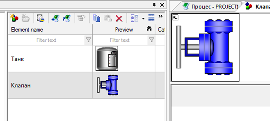
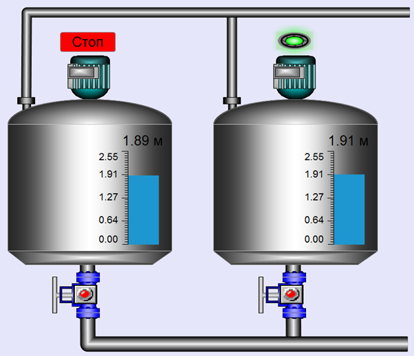
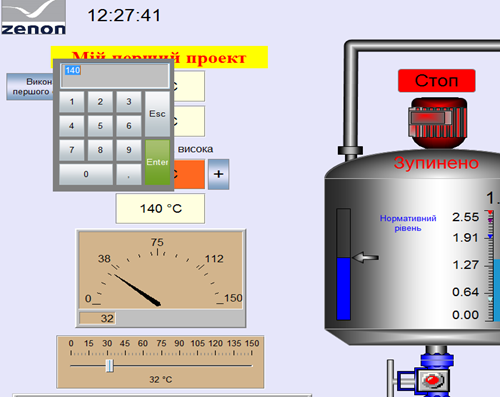

## zenon ЛР4: Створення графічного інтерфейсу

### Відображення та зміна значень змінних: покажчики (індикатори) та повзунок

Ми дійшли до того моменту, коли усе готово для реалізації повноцінної  мнемосхеми представлення техпроцесу: розміщення елементів відображення,  символів обладнання та прив’язки до них змінних. В цьому навчальному  посібнику ми розглянемо приклад реалізації фрагменту дифузійного  відділення цукрового заводу. Основними елементами такого процесу є  танки, клапани, двигуни, з’єднувальні труби.  

Відображення вимірюваних параметрів здійснюється через всілякі показуючі динамічні елементи. Зараз ми декілька з них розглянемо.

**Завдання 5.1. Створіть цифрові покажчики з відображеннями температур. 
**

- Відкрийте екран 'Процес'
- На інструментальній панелі елементів виберіть піктограму *Numerical* *value* і розмістіть його під вже існуючим текстовим елементом

Автоматично відкриється діалогове вікно вибору змінної

- Виберіть змінну 'Температура[1]' і натисніть кнопку *OK*
- Підлаштуйте розміри елементу та його розміщення на екрані
- Змініть колір фону елементу та шрифт
- У властивостях елементу Representation -> *Element border* виберіть *Edge deepened*

Аналогічним чином створіть елементи відображення для змінних 'Температура[2]', 'Температура[3]', 'Температура[4]'.   

*Найпростіше це зробити шляхом копіювання вже існуючого елементу та перетягуванням на нього відповідної змінної (Drag&Drop).*

Наш головний екран процесу повинен мати наступний вигляд:

*Для полегшення чіткості позиціонування  елементів на екрані та один відносно одного, можна ввімкнути координатну сітку та магнітні точки прив’язки: головне меню* *Options* *->* *Settings**.*

Давайте адаптуємо діапазон представлення температури до 0 – 150 °С

- У властивостях змінної 'Температура[1]' зайдіть в розділ *Value* *calculation* *->* *Value* *adjustment* *linear*
- Виставте для мінімального значення діапазону '0', а для максимального '150'

Таким чином, від  контролера ми отримуємо значення в діапазоні -32768 - 32767, а на  дисплейній мнемосхемі будемо відображати його в діапазоні 0 - 150.  Аналогічно зробіть і для інших змінних температур.

<iframe width="640" height="360" src="https://www.youtube.com/embed/zJTN9fjr9H4" title="YouTube video player" frameborder="0" allow="accelerometer; autoplay; clipboard-write; encrypted-media; gyroscope; picture-in-picture" allowfullscreen></iframe>

**Завдання 5.2. Створіть стрілочний покажчик для відображення змінної "Температура[1]". 
**

- На інструментальній панелі елементів виберіть піктограму *Pointer* *instrument* і розмістіть його під існуючими елементами
- В наступному вікні виберіть змінну 'Температура[1]'
- Підлаштуйте розміри елементу, його колір, кількість рисок шкали, кут повороту шкали

<iframe width="640" height="360" src="https://www.youtube.com/embed/rDa7KW3V6VA" title="YouTube video player" frameborder="0" allow="accelerometer; autoplay; clipboard-write; encrypted-media; gyroscope; picture-in-picture" allowfullscreen></iframe>

**Завдання 5.3: Створіть універсальний повзунок для зміни значення змінної 'Температура[1]'
**

- На інструментальній панелі елементів виберіть піктограму *Universal* *slider* і розмістіть його під існуючими елементами
- В наступному вікні виберіть змінну 'Температура[1]'

Автоматично відкриється помічник конфігурування  цього елементу. Ми нічого змінювати не будемо, тому просто на кожному  кроці натискайте *Next* і завершіть створення елементу кнопкою *Finish*.

- Підлаштуйте розміри елементу, його колір, стиль кромки

Для перевірки зробленої роботи запустіть Runtime. Ваш проект повинен мати наступний вигляд:

Спробуйте для кожної змінної змінити значення.

При зміні значення через цифрові елементи чи стрілочний покажчик буде з’являтися вікно вводу значення *Setpoint* *input**.*

**

Давайте спробуємо інші варіанти вводу значень.

<iframe width="640" height="360" src="https://www.youtube.com/embed/mTMI378Rg1E" title="YouTube video player" frameborder="0" allow="accelerometer; autoplay; clipboard-write; encrypted-media; gyroscope; picture-in-picture" allowfullscreen></iframe>

### Ввод значень

**Завдання 5.4: Створіть кнопки збільшення та зменшення значення змінної "Температура[3]" з використанням функції "\*Write\* \*set\* \*value"\*.** 

Поверніться в Editor не закриваючи при цьому Runtime (Alt+Tab).

- Виділіть другий цифровий покажчик і в розділі *Write* *set* *value* зі спадного боксу *Write* *set* *value* *via* змініть *Dialogbox* на *Element*

Встановлення значень для цифрового покажчика 3 ми  будемо виконувати через кнопки додавання та віднімання значення. Для  цього створимо відповідні функції та прив’яжемо їх до кнопок.

- Створіть нову функцію *Write* *set* *value* і в діалоговому вікні прив’яжіть її до змінної 'Температура[3]'

Автоматично з’явиться діалогове вікно налаштування функції

- Встановіть *Change* *by* в '5' та активуйте бокси *Propose current value* та *Direct to the hardware*
- Перейменуйте створену функцію на '+5 Температура3'
- Розмістіть на екрані справа від цифрового покажчика нову кнопку
- Прив’яжіть до неї створену функцію '+5 Температура3' і підпишіть символом '+'

Аналогічним чином створіть функцію '-5  Температура3' і кнопку '-'. Підкорегуйте розміри кнопок, шрифт підпису,  колір, приберіть закруглення кутів.

Створений фрагмент повинен мати наступний вигляд:

- Виділіть цифровий покажчик 3, 4 та стрілочний покажчик і у властивості *Write* *set* *value* деактивуйте галочку в боксі *Setting* *values* *active*

Таким чином, для першого цифрового покажчика значення будуть вводитись як і раніше – через діалогове вікно, для другого –  безпосередньо в елементі, для третього – через кнопки  додавання\віднімання а для всіх інших покажчиків – взагалі задаватись не будуть.

Тепер скомпілюйте зроблені зміни. Для цього на верхній інструментальній панелі натисніть на піктограму *Create* *changed* *Runtime* *files**.* Поверніться в Runtime і натисніть на зроблену нами на початку кнопку 'Reload'.  Виконані в проекті зміни активуються без перезапуску середовище  виконання проекту.

Попрактикуйтесь вводити значення різними способами.

<iframe width="640" height="360" src="https://www.youtube.com/embed/Bm9e-c9pwhk" title="YouTube video player" frameborder="0" allow="accelerometer; autoplay; clipboard-write; encrypted-media; gyroscope; picture-in-picture" allowfullscreen></iframe>

<iframe width="640" height="360" src="https://www.youtube.com/embed/dtTFpUoFPtw" title="YouTube video player" frameborder="0" allow="accelerometer; autoplay; clipboard-write; encrypted-media; gyroscope; picture-in-picture" allowfullscreen></iframe>

### Символи

Давайте створимо частину технологічної структури на базі ємності – танку збору  дифузійного соку. Ми не будемо самостійно малювати танк, а візьмемо  готовий з глобальної бібліотеки символів.

**Завдання 5.5: З використанням символів нарисуйте ємність (танк).**

- Виберіть в самому низу дерева проекту *Global* *symbol* *library*

Тут усі символи згруповані по папкам згідно їх призначення

- Відкрийте папку *Tank* і виберіть символ *simple tank*

Для розміщення символу на екрані його необхідно просто перетягнути на необхідне місце.

- Збільшіть розмір символу

Тепер нам необхідно показувати рівень наповнення танку. Для цього ми використаємо стовпчиковий показуючий елемент.

**Завдання 5.6: Відобразіть значення змінної "\*Танк[1].Рівень" з використанням елементу "\*Bar\* \*display"\**.**

- З інструментального меню виберіть елемент *Bar* *display*
- Розмістіть його уздовж бічної стінки танку
- У вікні прив’язки змінної вкажіть *Танк[1].Рівень*
- Виберіть шрифт відображення шкали, колір стовпчика, та активуйте опцію *Color* *->* *Transparent* 
- Над стовпчиковим елементом розмістіть іще один  цифровий покажчик, прив’яжіть змінну рівня та зробіть щоб цей елемент  також був прозорим

Таким чином, ми будемо точно бачити актуальне значення рівня в цифровому виді.

**Завдання 5.7: З існуючих елементів танку та рівня створіть свій символ і добавте його в бібліотеку проекту під назвою "Танк".**

На базі цих елементів створимо свій власний символ.

- Виділіть мишкою усі елементи і в контекстному меню виберіть *Symbol* *->* *Create* *embedded* *symbol*

Тепер три елементи представляють єдиний символ. Додамо його в бібліотеку символів нашого проекту.

- В контекстному меню символу виберіть *Symbol* *->* *Insert into symbol library*
- Виберіть *Project library (Project1)*

Створений символ з’явиться в дереві проекту *Screens -> Project symbol library**.* В цьому розділі зберігаються символи, які стосуються тільки конкретно  Вашого проекту. На даний момент тут повинний бути лише один символ: танк з покажчиками.  

- Перейменуйте символ в 'Танк'.

**Завдання 5.8: Використайте бібліотечний символ "Танк" для створення екземпляру. 
**

Ми можемо усюди, де потрібно в проекті,  використовувати цей символ. Перетягніть його на екран, а той символ що  був – видаліть. При перетягуванні автоматично з’явиться вікно  підстановки змінної. Нічого тут змінювати не потрібно. Таким чином, в  проекті ми будемо використовувати символи з нашої бібліотеки символів  проекту.

В правому верхньому куті символу повинна бути  стрілочка, яка показує, що він являється зв’язаним з вихідним. Будь-які  зміни в вихідному “батьківському” символі будуть автоматично  відтворюватись в усіх “дочірніх” символах на екранах проекту.

Скомпілюйте зроблені зміни та активуйте їх в Runtime. Ваш танк повинен мати наступний вигляд:

Як бачите, програма показує нам значення в сотнях  метрів. Нам необхідно адаптувати покази до реалій – перенести кому на  дві позиції вліво.

**Завдання  5.9: Змініть властивості масштабування змінної 'Танк[1].Рівень', щоб  діапазон 0-255 відповідав реальним значенням 0.00-2.55.** 

- Зайдіть в розділ *Variables* дерева проекту і виберіть змінну 'Танк[1].Рівень' 
- У властивостях *Value* *calculation* *->* *Decimals* встановіть значення '2'
- Також тут для *Measuring* *range* *min**\**max* необхідно встановити '0.00' та '2.55' відповідно

Тепер значення рівня повинні відображатися коректно.

<iframe width="640" height="360" src="https://www.youtube.com/embed/WZ0CgbuTwCk" title="YouTube video player" frameborder="0" allow="accelerometer; autoplay; clipboard-write; encrypted-media; gyroscope; picture-in-picture" allowfullscreen></iframe>

### Анімація символу

**Завдання 5.10: З використанням бібліотечного символу "Танк" створіть ще один  екземпляр з використанням заміни прив'язки змінних до танку 2. Перевірте результат в рантайм.
**

Давайте створимо ще один танк на базі нашого символу.

- Зайдіть в дереві проекту *Screens* *->* *Project* *symbol* *library*
- Вберіть символ 'Танк' і перетягніть його на екран, поруч з уже існуючим танком

Автоматично з’явиться вікно підстановки змінних,  за допомогою якого ми замінимо усі зв’язки символу. Для цього ми будемо  використовувати маску підстановки.

- В полі *Linking* *rule* для опції *Source* введіть маску '*1'
- В полі *Linking* *rule* для опції *replace by* введіть маску '2'

При цьому, у вікні *Preview* змінна 'Танк[1].Рівень' заміниться на 'Танк[2].Рівень'.

*Система підстановки дозволяє в якості маски  використовувати символ '\*' – для пропуску фрази, і символ '?' – для  пропуску літери. Таким чином можна формувати складні конструкції заміни.*

- Натиснувши кнопку *OK* завершіть конфігурування символу
- Адаптуйте діапазон змінної 'Танк[2].Рівень' аналогічно до попередньої.

Перевірте в Runtime коректність виконаних  підстановок. Для цього натисніть правою кнопкою мишки на динамічному  елементі і тримайте. Повинна з’явитись інформація про прив’язану змінну  та її статус.

*Окрім виміряного значення та часової мітки  система також надає інформацію відносно статусу змінної. Всього існує 64 статуси, серед них: спонтанне, недійсне, альтернативне, ревізія,  користувацький… Докладно про призначення кожного статусу можна прочитати в мануалі '**Variables**'.*

Також можна  перевірити який екран зараз відкритий. Для цього необхідно правою  кнопкою мишки натиснути на пустому полі екрану. Через декілька секунд  з’явиться поле з ім’ям екрану.

<iframe width="640" height="360" src="https://www.youtube.com/embed/N87sfgGvZcs" title="YouTube video player" frameborder="0" allow="accelerometer; autoplay; clipboard-write; encrypted-media; gyroscope; picture-in-picture" allowfullscreen></iframe>

**Завдання 5.11: Використовуючи статичний символ з глобальної бібліотеки "\*Valves"\* створіть власний динамічний символ "Клапан" в бібліотеці проекту. 
**

Тепер нам необхідно до нашого танку додати зливний клапан.

- Виберіть в глобальній бібліотеці символів з папки *Valves* символ *manual valve 1* і розмістіть під танком  
- Через властивості *Position* *->* *Rotation* *angle* поверніть його на 90°

Додамо символ клапану в бібліотеку символів нашого проекту.

- Виділіть символ і в контекстному меню виберіть *Symbol* *->* *Create* *embedded* *symbol*
- Повторно зайдіть в контекстне меню символу і виберіть *Symbol* *->* *Insert* *into* *symbol* *library*
- Виберіть *Project library (Project1)*

Створений символ з’явиться в локальній бібліотеці проект *Screens -> Project symbol library*.  

- Перейменуйте символ в 'Клапан'.

Перетягніть створений символ на екран, а той  символ що був – видаліть. Таким чином, ми маємо клапан для першого  танку. Скопіюйте символ клапану для другого танку.

Як ми  згадували раніше, зміни в вихідному “батьківському” символі будуть  автоматично відтворюватись в усіх “дочірніх” символах. Давайте  перевіримо як це працює.

<iframe width="640" height="360" src="https://www.youtube.com/embed/3A2BLCt0qoA" title="YouTube video player" frameborder="0" allow="accelerometer; autoplay; clipboard-write; encrypted-media; gyroscope; picture-in-picture" allowfullscreen></iframe>

### Внесення змін в символ

**Завдання 5.12: Додайте до символу клапану елемент керування типу "\*Switch"\*, який би перемикав значення змінної "Танк[1].Клапан[1]" з 0 в 1 та навпаки. 
**

Давайте додамо до символу елемент керування *Switch*, щоб оператор міг вручну вмикати і вимикати клапан.

- В дереві проекту зайдіть в *Screens* *->* *Project* *symbol* *library* і відкрийте символ 'Клапан' для редагування
- З інструментальної панелі виберіть елемент керування *Switch* і розмістіть його по центру клапану
- У вікні прив’язки змінної вкажіть 'Танк[1].Клапан[1]'
- Зайдіть у властивості цього елементу *Representation* *->* *Predefined* *graphics* і виберіть представлення у вигляді кругової кнопки що змінює колір
- Підкорегуйте розміри та взаємне розміщення елементів і збережіть зроблені в символі зміни

Після цих дій на екрані обидва наші клапани  змінять своє представлення, доповнившись кнопкою керування. Таким чином  декількома кліками мишки можна централізовано керувати усіма символами  проекту.

**Завдання 5.13: Використовуючи правила прив'язки використайте символ "Клапан" для анімації 2-го танку. 
**

Нам залишилось лише переприсвоїти змінну до нашого другого клапану.

- На екрані 'Процес' виділіть клапан під другим танком
- У властивості *Linking* *rule* клікніть в полі *Preview*
- У вікні підстановки задайте маску '*1' для вихідного значення і '2' для кінцевого
- Закрийте діалогове вікно підстановки кнопкою *OK*

*На цьому робота по створенню клапанів завершена.  Скомпілюйте проект та перевірте його в Runtime. Керування клапанами  повинне здійснюватись незалежно один від одного. Наша технологічна  структура тепер повинна мати такий вигляд:*

**

<iframe width="640" height="360" src="https://www.youtube.com/embed/gtY8rx3Yxt4" title="YouTube video player" frameborder="0" allow="accelerometer; autoplay; clipboard-write; encrypted-media; gyroscope; picture-in-picture" allowfullscreen></iframe>

### Трубопроводи

**Завдання 5.14: Використовуючи елемент "\*Pipe\*" нарисуйте мережу трубопроводів.** 

Для відображення трубопроводів система керування має спеціальний елемент – *Pipe*.

- На інструментальній панелі виберіть елемент *Pipe* і намалюйте мережу трубопроводів

Зробіть так, щоб трубопроводи виходили з танків. Проходили через клапани, з’єднувались і виходили вправо.

- Виділіть трубопровід і у властивостях *Representation* *->* *Line* *width* поміняйте товщину труби на 30
- Зайдіть в контекстне меню трубопроводу і виберіть *Element* *position* *->* *Background* чи просто натисніть комбінацію 'Ctrl + -'

Аналогічно розмістіть вхідні трубопроводи в танки, але підключайте їх не по центру ємностей, а зліва, залишивши місце для  мішалок, які ми створимо пізніше.

**Завдання 5.15: Використовуючи елемент "\*Rectangle\*" нарисуйте в символі "Танк" фланці, які з'єднують трубопроводи.** 

Підключення до танку вхідного трубопроводу виконаємо через фланці, які ми зробимо самостійно. Для цього ми використаємо елемент *Rectangle**.*

- В бібліотеці символів проекту відкрийте символ 'Танк' для редагування
- На інструментальній панелі виберіть статичний елемент *Rectangle*
- Розмістіть декілька прямокутників утворивши фланець
- Для прямокутників задайте колір у вигляді градієнта чорного кольору і розмістіть їх на задньому фоні символу танку

Утворений фрагмент символу повинен мати наступний вигляд:

- Збережіть зміни зроблені в символі

Таким чином, Ви можете зі статичних елементів самостійно формувати частини символів чи цілі символи.

На екрані усі танки автоматично повинні змінити своє представлення, доповнивши його фланцем.

Тепер ми маємо наступну апаратну структуру:

<iframe width="640" height="360" src="https://www.youtube.com/embed/9kPjCCX-JgY" title="YouTube video player" frameborder="0" allow="accelerometer; autoplay; clipboard-write; encrypted-media; gyroscope; picture-in-picture" allowfullscreen></iframe>

### Мішалка

**Завдання 5.16: Використовуючи символ двигуна з глобальної бібліотеки "\*Engines"\* \*д\*одайте до танків символи мішалок.** 

На завершальному етапі побудови технологічної  структури до кожного танку зверху ми додамо мішалку. Для цього  використаємо символ двигуна.

- Виберіть в глобальній бібліотеці з папки *Engines* символ *engine* *4* і розмістіть його над танком

- Через властивості *Position* *->* *Rotation* *angle* поверніть його на --90°
- Розмістіть символ над танком, підкорегуйте його розміри та переведіть на задній план

- Скопіюйте зроблений символ і розмістіть його над другим танком

<iframe width="640" height="360" src="https://www.youtube.com/embed/gP58fS2Sekw" title="YouTube video player" frameborder="0" allow="accelerometer; autoplay; clipboard-write; encrypted-media; gyroscope; picture-in-picture" allowfullscreen></iframe>

### Комбіелемент

**Завдання 5.17: Створіть кнопку керування включенням/виключенням мішалки 1-го танку використовуючи елемент "\*Button"\* .** 

Для керування мішалкою ми створимо спеціальну кнопку 'Пуск\Стоп' і прив’яжемо до неї відповідну змінну.

Давайте розглянемо декілька варіантів реалізації кнопок – на базі елементу *Button* та *Combined* *element**.*

Для ввімкнення мішалки першого танку застосуємо звичайний елемент кнопки, який ми використовували для перемикання між екранами.

- На панелі інструментів виберіть елемент *Button* і розмістіть його на вільному місці над символом двигуна мішалки першого танку

Автоматично з’явиться вікно підстановки функції. Оскільки цю кнопку  ми будемо використовувати для керування змінною, а не функцією, то  просто закрийте діалогове вікно кнопкою *Cancel*.

- У вікні властивостей кнопки зайдіть в розділ *Write set value* і активуйте бокс *Switch*
- Зайдіть в розділ *Variable**/**function* і в полі *Variable* прив’яжіть змінну 'Танк[1].Пуск\Стоп'
- Зайдіть в розділ *Representation* і в полі *Text* *line* *1* підпишіть 'Стоп', в полі *Text* *when* *pressed* підпишіть 'Пуск'
- Змініть шрифт на *5* *-* *Standard font5 (Arial 20)*
- Зайдіть в розділ *Color* *->* *Colors* *dynamic* і для полів *Background* *color*  і *Gradient* *color* прив’яжіть змінну 'Танк[1].Пуск\Стоп'

Наша кнопка буде клікабельно встановлювати  значення змінної в 0\1 та буде змінювати при цьому свій підпис і колір.  Колір ми взяли з лімітів, які по замовчуванню визначаються системою для  булівських змінних. При бажанні тут можна виставити будь-який колір.  Докладніше з лімітами ми познайомимось пізніше.

Візуальне відображення кнопки також можна змінювати за рахунок прив’язки графічних файлів *Representation* *->* *Graphics* *file**.* При цьому, картинки необхідно попередньо завантажити в дереві проекту *Files* *->* *Graphics**.*

Скомпілюйте зроблені зміни і перевірте роботу кнопки в Runtime.

**Завдання 5.18: Використовуючи комбіелемент створіть елементи керування мішалкою 2-го танку.** 

Давайте розглянемо варіант реалізації елементу  керування на базі комбоелементу. Його ми використаємо для ввімкнення  двигуна мішалки другого танку.

*Комбоелемент (Combined element) – це  комплексний інструмент керування, який дозволяє присвоювати елементу  різне візуальне представлення залежно від побітового значення чи статусу змінної. Налаштування здійснюється за допомогою спеціального майстра та конфігураційного вікна.*

Оскільки комбоелемент базується на символах, нам  попередньо необхідно створити символи для відображення стану 'Пуск' і  'Стоп', після чого додати їх до проектної бібліотеки символів.

- Виберіть в глобальній бібліотеці з папки *interface**_**buttons**_16_9* символи *shutter**_**red**_2*  і *shutter_green_2*
- Додайте їх до проектної бібліотеки символів і назвіть 'Пуск' і 'Стоп' відповідно

Тепер перейдемо безпосередньо до створення комбоелементу

- На панелі інструментів виберіть елемент *Combined* *element* і розмістіть його на вільному місці над символом двигуна мішалки другого танку
- Прив’яжіть змінну 'Танк[2].Пуск\Стоп'

Автоматично з’явиться майстер конфігурування цього елементу.

- Для вікна *Type* *of* *display* повинно стояти *Symbol from library*
- У вікні *Status* натисніть на великий квадрат і виберіть символ 'Стоп'
- Натисніть кнопку *New* *status* і в полі *Value* задайте '0'
- Знову натисніть кнопку *New* *status* і в полі *Value* задайте '1'
- Для цього статусу змініть візуальне представлення на символ 'Пуск'

- Завершіть конфігурування елементу кнопкою *Finish*

Отже, ми створили елемент який має три статуси: *0, 1* і *Default*. Кожен з цих статусів має свій символ відображення.

- Підкорегуйте розміри створеного елементу – кнопки

Більш складні налаштування цього елементу здійснюються у вікні конфігурування. 

- У властивостях елементу *Representation* зайдіть в опцію *Configuration* *and* *test*

Тут можна не тільки визначати побітові символи, а й формульні значення і статуси.

Ми нічого тут змінювати не будемо.

Більше інформації стосовно створення комбоелементу можна знайти в мануалі Screens -> Combined element.

Фрагмент екрану технології повинен мати наступне представлення:

Ми розглянули три варіанти реалізації кнопок: елементи *Switch*, *Button* та *Combined* *element*.

<iframe width="640" height="360" src="https://www.youtube.com/embed/0XrWd84-Dew" title="YouTube video player" frameborder="0" allow="accelerometer; autoplay; clipboard-write; encrypted-media; gyroscope; picture-in-picture" allowfullscreen></iframe>

### Зображення

Система керування дозволяє на екранах відображати як растрову графіку (bmp,  jpg, gif, png…) так і векторну (wmf). Зображення можна ставити як фон  для екрану або як окремий елемент.

**Завдання 5.19: Використовуючи елемент "\*Button"\* вставте зображення 'logo scada zenon'.** 

Давайте в верхньому куті екрану розмістимо логотип 'zenon' Його легко знайти в пошуковій системі Google, задавши ключ  пошуку 'logo scada zenon'.

Скачайте картинку та завантажте її в проект.

- В дереві проекту зайдіть в *Files* *->* *Graphics*
- У вікні деталізованого перегляду виберіть піктограму *Import* *file* 
- Завантажте відповідне зображення

*По можливості, зображення повинні займати не  великий об’єм пам’яті, оскільки від цього залежить швидкість відкриття  екранів проекту.*

Для показу картинки використовується елемент *Button*, але без прив’язки функції чи змінної.

- На інструментальній панелі виберіть елемент *Button* і розмістіть на вільному місці екрану
- Якщо з’явиться вікно прив’язки функції чи змінної, просто закрийте його кнопкою *Cancel*
- У властивостях елементу *Representation* зайдіть в опцію *Graphics* *file* і прив’яжіть відповідну картинку логотипу
- В полі *Graphic* *size* повинно стояти *Stretched*
- У властивості *Rounded* *corners* поставте закруглення кутів в '0'

Зроблений елемент повинен мати такий вигляд:

Аналогічним чином Ви можете розмістити на екрані будь-яке зображення чи анімацію.

### Годинник

**Завдання 5.20: Використовуючи елемент "\*Clock\* " створіть годинник для відображення плинного часу.** 

Кожний повноцінний проект повинен відображувати оператору поточний час. Для цього система керування має окремий елемент – Clock.

- На інструментальній панелі виберіть елемент *Clock* і розмістіть на вільному місці екрану поруч з логотипом
- У властивостях елементу *Representation* виберіть найбільший шрифт та формат виставте в показ лише часу
- У властивостях елементу *Color* активуйте бокс *Transparent*

*\*

<iframe width="640" height="360" src="https://www.youtube.com/embed/Lrkd40JVIgU" title="YouTube video player" frameborder="0" allow="accelerometer; autoplay; clipboard-write; encrypted-media; gyroscope; picture-in-picture" allowfullscreen></iframe>

### Самописець (тренд реального часу)

Система керування має у своєму розпорядженні спеціальний елемент для  відображення виміряної інформації у вигляді графіків. Цей трендовий  елемент має досить низьку функціональність і використовується тільки для приблизного відображення графіків з невеликою точністю. Для  повноцінного відображення графіків в zenon існує спеціальний тип екрану – *Extended* *Trend*. З ним ми познайомимось пізніше.

**Завдання 5.21: Д\**ля відображення зміни значень\** танкових \**рівнів в часі\** створіть самописець з використанням елементу "\*Trend\* \*element"\*.** 

- На інструментальній панелі виберіть елемент *Trend* *element*
- Розмістіть його в нижній частині екрану
- У вікні що з’явилося прив’яжіть до нього змінну температури і рівнів двох баків
- У властивостях представлення зробіть налаштування, як показано на малюнку:

- У властивостях *Curves* для кожної кривої задайте свій колір, наприклад, чорний, червоний та зелений

Для того, щоб наші криві не зникали при  перемиканні між екранами проекту, необхідно виміряні значення зберігати  на жорсткий диск.

- Зайдіть у властивість змінної 'Температура[1]'
- В розділі *Harddisk data storage* активуйте бокс *Harddisk data storage* *active* і для *Number* *of* *values* встановіть 300

Таким чином, наш трендовий елемент буде відображати 300 циклів запису значень змінної. Цього нам цілком достатньо.

Виконайте аналогічні операції для змінних 'Танк[1].Рівень' і 'Танк[2].Рівень'.

Скомпілюйте зроблені зміни і перезапустіть Runtime. Щоб зміни по запису значень вступили в силу не достатньо виконати функцію *Reload*. Необхідно вимкнути Runtime і запустити його заново.

Виконайте модифікацію значень відповідних змінних і перевірте їхнє відображення в трендовому елементі.

Екран процесу тепер повинен мати такий вигляд:

<iframe width="640" height="360" src="https://www.youtube.com/embed/1HTPmxdI6hE" title="YouTube video player" frameborder="0" allow="accelerometer; autoplay; clipboard-write; encrypted-media; gyroscope; picture-in-picture" allowfullscreen></iframe>

### Зміна кольору, тексту, невидима кнопка

При розробці проектів візуалізації не обмежуються лише розміщенням на  екрані елементів технологічних ліній та засобів керування. Розробнику  проекту необхідно створити інтуїтивно зрозумілий інтерфейс взаємодії  оператора з процесом. Це досягається за рахунок динамізації об’єктів.  Під час здійснення тієї чи іншої дії оператор повинен однозначно  розуміти що він зробив і яким був відгук системи на цю дію.

Одним з проявів динамізації, який ми вже  використали, являється зміна кольору елементу керування. Давайте  реалізуємо ще деякі можливості, які надає розробнику система керування.

**Завдання 5.22: Анімуйте зміну кольору мішалки в залежності від її роботи.** 

Для наших мішалок зробимо так, щоб під час ввімкнення\вимкнення вони змінювали свій колір.

- Виберіть символ першої мішалки і у властивостях *Color* *->* *Background* *color* призначте тут змінну 'Танк[1].Пуск\Стоп'
- Для символу другої мішалки виконайте аналогічні операції з прив’язкою тут змінної 'Танк[2].Пуск\Стоп'

В лімітах змінної за замовчуванням закладена зміна кольору, тому при керуванні мішалками їх кольори будуть змінюватись з  червоного на зелений.

**Завдання 5.23: Анімуйте зміну тексту мішалки  \**в залежності від її роботи\**.** 

Під час виконання тієї чи іншої операції система  повинна інформувати оператора про зроблену дію. Для цього широко  використовують динамічний текст.

- На інструментальній панелі виберіть елемент *Dynamic* *text* і розмістіть його під мішалкою на фоні першого танку
- Автоматично з’явиться вікно прив’язки змінної, в якому виберіть 'Танк[1].Пуск\Стоп'
- Зайдіть у властивості цієї змінної, розділ *Limits*
- Для першого ліміту, який означає значення '0', в полі *Limit* *text* введіть текст повідомлення 'Зупинено'
- Для другого ліміту, який означає значення '1', в полі *Limit* *text* введіть текст повідомлення 'В роботі'
- У властивостях елементу *Dynamic* *text* зайдіть в розділ *Representation* і виберіть 'Стандартний шрифт 5'
- Далі зайдіть у властивості *Color* і активуйте бокс *Transparent*

Для другої мішалки виконайте аналогічні операції,  тільки до елементу динамічного тексту прив’яжіть змінну  'Танк[2].Пуск\Стоп'. Можна просто скопіювати елемент та перетягнути на  нього цю змінну.

Наші елементи тепер мають наступний вигляд:

<iframe width="640" height="360" src="https://www.youtube.com/embed/GuI27KeEBlE" title="YouTube video player" frameborder="0" allow="accelerometer; autoplay; clipboard-write; encrypted-media; gyroscope; picture-in-picture" allowfullscreen></iframe>

**Завдання 5.24: Створіть невидиму кнопку для керування мішалкою.** 

Керування таким об’єктом як мішалка, можна реалізувати не створюючи додаткових візуальних елементів.

- На інструментальній панелі виберіть елемент *Button* і розмістіть перед мішалкою першого танку
- Якщо з’явиться вікно прив’язки функції, просто закрийте його кнопкою *Cancel*
- В розділі властивостей елементу *Write* *set* *value* активуйте бокс *Switch* 
- В розділі *Variable* */* *function* призначте до елементу змінну 'Танк[1].Пуск\Стоп'
- В розділі *Color* активуйте бокс *Transparent*

Таким чином цей елемент керування стане прозорим і оператор матиме можливість керувати мішалкою безпосередньо через її символ.

Прозорі кнопки можна використовувати не тільки для зміни значень змінних, а й для виконання функцій.

<iframe width="640" height="360" src="https://www.youtube.com/embed/azYqlcpH1hM" title="YouTube video player" frameborder="0" allow="accelerometer; autoplay; clipboard-write; encrypted-media; gyroscope; picture-in-picture" allowfullscreen></iframe>

### Діалогове вікно

Існують задачі, коли виконання керуючої дії повинно здійснюватись не відразу, а через діалогове вікно. Давайте створимо таке вікно та прив’яжемо його  виклик до зливного клапану другого танку.

Для виконання цієї задачі ми використаємо усі  знання та вміння які маємо на цей момент. Також тут розглянемо новий  елемент – комбобокс, та використаємо функцію видимості екранних  символів.

**Завдання 5.25: Створіть діалогове вікно для керування клапанами.** 

Для початку створимо екран діалогового вікна на базі нового фрейму.

- В менеджері проекту відкрийте вузол *Screens* і виберіть пункт *Frames*
- Створіть новий фрейм 'Клапан' розміром 280х170
- Проконтролюйте, щоб в розділі властивостей *Position* прив’язка позиції цього екрану відбувалась до елементу через який ми його викликаємо
- Усі інші налаштування фрейму залиште без змін
- В менеджері проекту виберіть вузол *Screens* і створіть новий екран на базі фрейму 'Клапан'
- У властивостях перейменуйте створений екран на 'Клапан' та задайте довільний колір фону
- Перейдіть до розділу властивостей *Window* *style* і активуйте бокс *Modal* *dialog*

*Модальне представлення екрану забезпечує  неможливість виконання жодних операцій поза межами цього діалогового  вікна до моменту його закриття.* 

Таким чином, оператор не зможе проігнорувати цей екран незважаючи на те, що він має невеликі розміри.

**Завдання 5.26: Створіть функцію для відкриття діалогового вікна керування клапаном.** 

Тепер давайте створимо функцію для відкриття та закриття цього екрану.

- В менеджері проекту виберіть вузол *Functions*  і створіть нову функцію *Screen* *switch*
- У діалоговому вікні задайте перемикання на екран 'Клапан'
- Через властивості створеної функції перейменуйте її на 'Перехід на екран Клапан'
- Створіть нову функцію *Close* *frame*, яка знаходиться в розділі *Screens* вікна вибору функції
- Вкажіть фрейм 'Клапан' та потім перейменуйте створену функцію на 'Закриття екрану Клапан'

**Завдання 5.27: Наповніть діалогове вікно кнопкою закрити, елементами керування станом клапану на базі \*Combobox , зображенням стану клапану\*.** 

Залишилося створити усі необхідні елементи діалогового вікна екрану керування клапаном.

- За допомогою текстового поля у верхній частині екрану 'Клапан' розмістіть підпис 'Клапан 2'
- В куті екрану розмістіть червону кнопку закриття вікна, прив’язавши до неї функцію 'Закриття екрану Клапан'
- На інструментальній панелі виберіть елемент *Combo**-/**Listbox* і розмістіть його в центральній частині екрану
- До цього елементу прив’яжіть змінну Танк[2].Клапан[1]
- У властивостях комбобоксу в розділі *Representation* для поля *Type* повинно стояти *Combobox*
- Зайдіть в поле *Entries* і виконайте додавання позицій, відповідно до представленого малюнку нижче

Таким чином елемент комбобокс матиме дві позиції  вибору – 'Закрити' і 'Відкрити', що відповідає '0' і '1'. Взагалі,  комбобокс дозволяє створювати спадні списки на будь-яку кількість  позицій.

Щоб нам відразу бачити реакцію системи на виконану дію давайте розмістимо тут елемент схематичного зображення клапану з  використанням функції видимості.

- На інструментальній панелі виберіть елемент *Polygon* і намалюйте схематичне зображення клапану
- У властивостях полігону *Color* задайте зелений колір фону
- Зайдіть в розділ властивостей *Visibility**/**flashing* і в полі *Variable* вкажіть змінну 'Танк[2].Клапан[1]'
- Для полів *from* і *to* поставте значення '1'

Остання дія забезпечить видимість цього елементу при значенні змінної '1'.

- Скопіюйте створений елемент полігону
- У властивостях задайте червоний колір фону і для полів видимості поставте значення '0'
- Розмістіть ці елементи на екрані один під одним

**Завдання 5.28: Створіть кнопку для виклику діалогового вікна і перевірте її роботу.** 

Нам залишилось створити кнопку для виклику цього діалогового вікна. Для цього ми створимо прозору кнопку.

- Відкрийте екран 'Процес'
- На інструментальній панелі виберіть елемент *Button* і розмістіть перед символом зливного клапану другого танку
- Автоматично з’явиться вікно прив’язки функції, в якому виберіть функцію 'Перехід на екран Клапан'
- В розділі властивостей елементу *Color* активуйте бокс *Transparent*

*На цьому роботу по створенню діалогового вікна можна вважати завершеною. Скомпілюйте проект і перейдіть в Runtime.*

**

<iframe width="640" height="360" src="https://www.youtube.com/embed/Fuzmsi75VrA" title="YouTube video player" frameborder="0" allow="accelerometer; autoplay; clipboard-write; encrypted-media; gyroscope; picture-in-picture" allowfullscreen></iframe>

### Зміна розміру

Динамічне відображення набору рідини в танку можна реалізувати не тільки за  допомогою спеціального елементу – стовпчикового покажчика, а й через  звичайний прямокутник, задавши йому зміну висоти відповідно до значення  змінної рівня. Давайте реалізуємо це на нашій схемі.

**Завдання 5.29: Реалізуйте стовпчикову діаграму через зміну розміру.** 

- На інструментальній панелі виберіть елемент *Rectangle* і розмістіть його уздовж лівої стінки першого танку
- Зайдіть в розділ властивостей *Position* і в полі *Rotation* *angle* поставте значення '180'

Цю дію необхідно зробити оскільки наповнення танку відбувається знизу вверх, а не навпаки.

- В розділі властивостей *Size* *and* *rotation* *dynamic* в полі *Change* *height* призначте змінну 'Танк[1].Рівень'
- Для поля *Min**.* *height* поставте значення '0', для *Max**.* *height* поставте значення '100'

Для візуально кращого сприймання зміни висоти  прямокутника без наявності шкали, давайте за нашим динамічним  прямокутником розмістимо іще один з прозорим фоном.

- На інструментальній панелі виберіть елемент *Rectangle* і розмістіть його перед вже існуючим
- Зайдіть в розділ властивостей *Color* і в полі *Filling* *pattern* виберіть прозорий прямокутник
- Підгоніть розміри обох прямокутників, щоб вони співпадали і розміщувались чітко один за одним

Таким чином, в Runtime ми продублювали індикацію  рівня рідини в танку. Аналогічним чином можна реалізувати зміну розмірів будь якого елементу по горизонталі.

<iframe width="640" height="360" src="https://www.youtube.com/embed/nly7Fz2pBpg" title="YouTube video player" frameborder="0" allow="accelerometer; autoplay; clipboard-write; encrypted-media; gyroscope; picture-in-picture" allowfullscreen></iframe>

### Анімація руху

**Завдання 5.30: Реалізуйте анімацію зміни положення стрілки в залежності від рівня.** 

Для демонстрації руху елементів в системі, реалізуємо переміщення символу стрілки відповідно до зміни рівня в танку.

- В глобальній бібліотеці символів з папки *Arrows* виберіть символ 'left' і розмістіть його чітко біля верхнього кута  прямокутника показу рівня, щоб кінчик стрілки вказував на нього
- Зайдіть в розділ властивостей *Position* і в полі *Y* *position* *dynamic* призначте змінну 'Танк[1].Рівень'
- Для поля *Min**.* *movement* поставте значення '180', для *Max**.* *movement* поставте значення '0'

Ці значення ми визначили дослідним шляхом, щоб рух символу стрілки найбільш чітко повторював рух рівня в танку.

<iframe width="640" height="360" src="https://www.youtube.com/embed/afgYD0B2sXs" title="YouTube video player" frameborder="0" allow="accelerometer; autoplay; clipboard-write; encrypted-media; gyroscope; picture-in-picture" allowfullscreen></iframe>

### Зміна кольору

**Завдання 5.31: Реалізуйте анімацію зміни кольору стовпчику в залежності від рівня.** 

На завершення демонстрації динамічних можливостей  системи керування, ми реалізуємо зміну кольору стовпчика рівня першого  танку. Для цього ми визначимо чотири ліміти і задамо їм відповідні  кольори:

| 0 – 0,55 м    | 'Низький рівень'     | блакитний  |
| ------------- | -------------------- | ---------- |
| 0,55 – 2 м    | 'Нормативний рівень' | синій      |
| 2 – 2,35 м    | 'Високий рівень'     | фіолетовий |
| 2,35 – 2,55 м | 'Критичний рівень'   | червоний   |

- Зайдіть у властивості змінної 'Танк[1].Рівень' розділ *Limits*  
- Через поле *Limit* *new* створіть новий ліміт
- В полі *Limit* *text* задайте підпис 'Низький рівень'
- В полі *Limit* задайте значення '0,55'
- Для *Additional* *attributes* задайте блакитний колір ліміту

Таким чином відображення рівня буде мати блакитний колір на проміжку значень 0 – 0,55 м.

Аналогічним чином створіть решту лімітів, згідно з наведеною вище таблицею.

Для того, щоб зроблене кольорове представлення  лімітів не впливало на інші елементи, які використовують змінну  'Танк[1].Рівень', необхідно у властивостях цих елементів в розділі *Color* деактивувати бокс *Use* *limit* *color*.

На завершення визначте змінну рівня, як база для відображення динамічного кольору фону елементу прямокутника – властивість *Color* *->* *Color* *dynamic*.

Заданий текст для лімітів буде відображатись в  якості підпису для тривог, а також може бути показаний через елемент  динамічного тексту. Ми це і зробимо.

- Розмістіть елемент *Dynamic* *text* по центру танку і прив’яжіть до нього змінну 'Танк[1].Рівень'
- Зробіть його прозорим, та в розділі *Representation* *->* *Text* *format* активуйте бокс *Automatic* *word* *wrap*

Самостійно проробіть описану в даному розділі  методику динамізації кольору для цифрового покажчика температури змінної 'Температура[3]' з визначенням чотирьох лімітних зон.

В результаті екран технології повинен мати такий вигляд:

<iframe width="640" height="360" src="https://www.youtube.com/embed/ykazTOxhnLA" title="YouTube video player" frameborder="0" allow="accelerometer; autoplay; clipboard-write; encrypted-media; gyroscope; picture-in-picture" allowfullscreen></iframe>

### Блимання

**Завдання 5.32: Реалізуйте анімацію миготіння (блимання).** 

Для того, щоб особливо привернути увагу оператора до критичного значення параметру, часто застосовують ефект блимання.

- У властивостях змінної  'Температура[3]' зайдіть в розділ *Limits* *->* *Limit**[4]* 
- В полі *Additional attributes[4]* активуйте бокс *Flashing*

Таким чином, при досягненні температури четверного граничного значення цифровий покажчик змінної та відповідний динамічний текст почнуть блимати.

На цьому ми завершимо розгляд основних моментів створення технологічної мнемосхеми процесу та динамізації екранних елементів.

Познайомитись з іншими елементами, які ми не розглянули, та інструментами їх динамізації можна в манулі Screens -> Screen elements та Screens -> Edit screen element.

<iframe width="640" height="360" src="https://www.youtube.com/embed/G-rQ8pmEnII" title="YouTube video player" frameborder="0" allow="accelerometer; autoplay; clipboard-write; encrypted-media; gyroscope; picture-in-picture" allowfullscreen></iframe>

***\*Завдання 5.33: Деактивуйте змінні, що не використовуються.\****

Як Ви бачите, в проекті ми задіяли не всі створені змінні. Для того, щоб система не опитувала незадіяні теги, в zenon  існує можливість їх деактивувати. Ця функція доступна лише якщо  працювати зі структурованими змінними. Часто, деактивацію змінних  використовують для резервування змінних, якщо точно не відома їх  кількість, але є потреба в закладанні певного масиву адрес.

- В менеджері проекту виберіть вузол *Variables*
- У вікні деталізованого перегляду виділіть через Ctrl змінні 'Танк[1].Клапан[2]', 'Танк[1].Клапан[3]' та 'Танк[1].Клапан[4]'
- У верхній частині цього вінка клікніть на піктограмі *Deactivate*

*В результаті виконаної дії вибрані змінні стануть  сірими. Це означає що вони деактивовані. Виконайте цю операцію і для  незадіяних змінних другого танку.*

**

<iframe width="640" height="360" src="https://www.youtube.com/embed/xkvE3v5vDyI" title="YouTube video player" frameborder="0" allow="accelerometer; autoplay; clipboard-write; encrypted-media; gyroscope; picture-in-picture" allowfullscreen></iframe>

### Скрипти

Існують задачі, коли при натисканні кнопки чи досягненні якогось критичного  значення параметру необхідно виконати одночасно декілька функцій. Для  цього в системі керування існує поняття скриптів.

*Скрипт – це одночасне виконання набору  визначених функцій. На відміну від скриптів мов програмування, вони не  вимагають написання жодної строки програмного коду.*

***\*Завдання 5.34: Зробіть скрипт для встановлення уставок температурним змінними.\****

Давайте створимо скрипт встановлення уставок нашим температурним змінним. Попередньо нам необхідно створити набір функцій, які буде виконувати скрипт.

- В менеджері проекту виберіть вузол *Functions*
- Для змінної 'Температура[1]' створіть функцію *Write* *set* *value* -> 15
- Для змінної 'Температура[2]' створіть функцію *Write* *set* *value* -> 45
- Для змінної 'Температура[3]' створіть функцію *Write* *set* *value* -> 95
- Для змінної 'Температура[4]' створіть функцію *Write* *set* *value* -> 135
- В вузлі *Functions* виберіть підрозділ *->* *Scripts*
- Піктограмою *New* *script* створіть новий скрипт та назвіть його 'Скрипт 1'
- Через контекстне меню створеного скрипту *Add* *functions* додайте створені функції

Тепер нам необхідно створити функцію виконання цього скрипту та прив’язати її до кнопки.

- Поверніться на рівень *Functions*
- В діалоговому вікні вибору нової функції зайдіть в розділ *Script* і виберіть функцію *Script**:* *execute*
- Прив’яжіть сюди Ваш скрипт 'Скрипт 1'
- Поруч з цифровими покажчиками температури створіть кнопку 'Виконання першого скрипту' і прив’яжіть до неї створену функцію

Перевірте роботу створеного скрипту.

<iframe width="640" height="360" src="https://www.youtube.com/embed/XHC8iud3wMQ" title="YouTube video player" frameborder="0" allow="accelerometer; autoplay; clipboard-write; encrypted-media; gyroscope; picture-in-picture" allowfullscreen></iframe>

***\*Завдання 5.35: Зробіть скрипт, який буде активуватися при досягненні параметром певного рівня.\****

Також можна створити скрипт, який буде  активуватись по досягненню параметром встановленого граничного значення. Методика створення такого скрипту аналогічна. Відмінність полягає в  прив’язці його виконання до граничного значення змінної.

Створіть скрипт 'Скрипт критичний рівень танку 1' з таким набором функцій: 'Відключення мішалки' та 'Відкриття зливного  клапану'. Скрипт повинен виконуватись автоматично при досягненні в  першому танку критичного рівня - значення > 2.35 м.

- У властивостях змінної 'Танк[1].Рівень' зайдіть в налаштування четвертого ліміту
- Для поля *Function**[4]* прив’яжіть функцію 'Скрипт критичний рівень танку 1'

Перевірте в Runtime як виконується даний скрипт. Попередньо ввімкніть і відімкніть відповідні екранні елементи.

<iframe width="640" height="360" src="https://www.youtube.com/embed/IgEDke56yKI" title="YouTube video player" frameborder="0" allow="accelerometer; autoplay; clipboard-write; encrypted-media; gyroscope; picture-in-picture" allowfullscreen></iframe>

***\*Завдання 5.36: Зробіть наперед визначений скрипт, який автоматично буде запускатися при старті системи.\********\*
\*****

Для виконання специфічних завдань в системі  керування існують наперед визначені скрипти, які мають зарезервовані  імена і чітко визначене призначення. Сюди відносяться скрипти AUTOSTART, AUTOEND, AUTOSTART_CLIENT і т.д. Повний перелік таких скриптів та їх  опис наведено в мануалі *Scripts*.

Давайте зробимо так, щоб при запуску проекту автоматично виконувалися функції, описані для нашого температурного скрипту.

- В вузлі *Functions* виберіть підрозділ *Scripts* і створіть новий скрипт
- У властивостях в полі *Name* зі спадного поля виберіть зарезервоване ім’я  'AUTOSTART'

- Додайте в скрипт функції встановлення значень температурним змінним

Таким чином, при старті проекту автоматично будуть виконуватись усі функції, визначені в скрипті автостарту. При чому,  вони будуть виконуватись саме в тому порядку, в якому визначені в  скрипті.

<iframe width="640" height="360" src="https://www.youtube.com/embed/7kLBYcjmoQ0" title="YouTube video player" frameborder="0" allow="accelerometer; autoplay; clipboard-write; encrypted-media; gyroscope; picture-in-picture" allowfullscreen></iframe>

### Віртуальна клавіатура

Окрім тих варіантів установки значень змінним оператором, що ми вже  розглянули, існує ще один дуже розповсюджений варіант – введення через  віртуальну клавіатуру.

***\*Завдання 5.37: Зробіть та перевірте роботу екранної клавіатури для введення значення.\****

Давайте зробимо віртуальну цифрову клавіатуру, яку ми використаємо для вводу значення для цифрового елементу 4-ї температури.

- В менеджері проекту виберіть вузол *Screens* *->* *Frames*
- Створіть новий фрейм 'Клавіатура' розміром 220 х 170
- У властивості *Position* *->* *Positioning* зі спадного меню виберіть *relative* *to* *element*
- У властивості *Position* *->* *Reference* *point* *of* *frame* для вертикальної точки прив’язки виберіть *Bottom*, а для горизонтальної - *Centered*

*Таким чином, фрейм клавіатури буде з’являтись не в тому місці, де він розташований в конструкторі фреймів, а безпосередньо поруч з тим елементом в який здійснюється введення значення. Усі ніші  налаштування залишіть без змін.*

**

- В менеджері проекту виберіть вузол *Screens* і створіть новий екран 'Клавіатура'
- У властивості *General* *->* *Frame* вкажіть створений нами фрейм та виставте сірий колір фону
- У властивості *General* *->* *Screen* *type* виберіть спеціальний тип екрану – *Keyboard*

Тепер необхідно на цей екран розмістити усі необхідні елементи керування.

- В головному меню *Control* *elements* виберіть *Insert* *template*
- Серед запропонованих варіантів наборів кнопок виберіть *Scada* *-* *Numeric* *telephone*
- З головного меню Control elements у верхній частині екрану додатково розмістіть елемент вводу значень -  *Set value* *element*
- У властивостях екрану *Window* *style* активуйте бокс *Modal* *dialog*

Таким чином, до тих пір поки відкрите діалогове  вікно вводу значень через клавіатуру, жодні інші дії на екрані оператор  не зможе зробити.

Ваша віртуальна клавіатура повинна мати наступний вигляд:

При необхідності відредагуйте зовнішній вигляд та розмір елементів.

***\*Завдання 5.38: Прив'яжіть температуру до 4-го цифрового елементу та перевірте роботу.\****

Нам залишилось прив’язати цю клавіатуру до цифрового елементу.

- На екрані 'Процес' виберіть четвертий цифровий елемент зі змінною 'Температура[4]'
- У властивості *Write* *set* *value* активуйте бокс *Setting* *values* *active*
- Для опції *Write* *set* *value* *via* встановіть *Dialogbox*
- Активуйте опцію *Use* *screen* *Keyboard* та виберіть створену нами клавіатуру

Запустіть Runtime і перевірте зроблену роботу.

Докладніше про створення і використання екранних клавіатур можна познайомитись в мануалі Keyboard.