## zenon ЛР5 Тривоги та події

### CEL:Створення екрану

Цим розділом ми почнемо розгляд спеціальних типів екранів візуалізації, які являються частиною будь-якого SCADA проекту, а саме подій, тривог,  архівів та трендів.

Давайте створимо екран для відображення Хронологічного списку подій.

*Chronologic Event List (CEL)* *– це  спеціальний екран, в якому відображаються усі події, що відбуваються в  системі, наприклад, запуск проекту, авторизація користувача, зміна  значення параметру з чіткою фіксацією часу цієї дії. Функціонал такого  екрану повністю відповідає вимогам* *FDA* *по безпеці керування процесами.*

***\*Завдання 6.1: Створіть екран типу CEL.\****

- В менеджері проекту виберіть вузол *Screens*
- У вікні детального перегляду клікніть на іконці *New* *screen*
- Через вікно властивостей перейменуйте створений екран на 'Хронологія'
- В полі *Screen* *type* розділу *General* виберіть спеціальний тип *Chronological* *Event* *List*
- В полі *Frame* повинно бути вибрано 'Головний'

*Майте на увазі, що після вибору спеціального типу для екрану, потім змінити його на інший вже не можна.*

<iframe width="640" height="360" src="https://www.youtube.com/embed/sb4akMdPzic" title="YouTube video player" frameborder="0" allow="accelerometer; autoplay; clipboard-write; encrypted-media; gyroscope; picture-in-picture" allowfullscreen></iframe>

***\*Завдання 6.2:Розмістіть на екрані елементи відображення за замовченням.\****

Тепер на цей екран необхідно розмістити елементи  керування і відображення. З цією метою в zenon розроблено ряд готових  шаблонів. Для кожного типу екрану розроблено свій шаблон.

- При активному екрані 'Хронологія' зайдіть в головне меню *Control* *elements* і виберіть пункт *Insert* *template**…*
- Далі з’явиться вікно готових наборів елементів керування, в якому виберіть *Standard* для *Scada* *1024*

*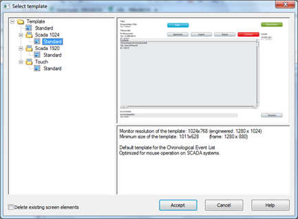*

- Після підтвердження зробленого вибору кнопкою *Accept* , система автоматично розмістить на екрані усі необхідні елементи, притаманні суто цьому типу екрану
- Підкорегуйте  розміщення елементів та їх розміри відповідно до свого екрану, задайте  свої підписи. Непотрібні кнопки чи текстові поля можете взагалі  видалити.

<iframe width="640" height="360" src="https://www.youtube.com/embed/GW-2xR3fl6E" title="YouTube video player" frameborder="0" allow="accelerometer; autoplay; clipboard-write; encrypted-media; gyroscope; picture-in-picture" allowfullscreen></iframe>

### Створення функції виклику екрану CEL

***\*Завдання 6.3: Створіть функцію для переходу на екран CEL та налаштуйте в діалоговому вікні параметри відкриття екрану.\****

Тепер для переходу на цей екран нам необхідно створити функцію *Screen* *switch* та кнопку 'Хронологія' на панелі навігації.

При створенні функції перемикання з’явиться діалогове вікно конфігурування, яке раніше не зустрічалось. Це пов’язане з тим,  що ми до цієї функції прив’язали не звичайний екран стандартного типу, а специфічний.

Діалогове вікно конфігурування має шість вкладок, які ми поетапно розглянемо.

Вкладка *General*

Тут усі повідомлення можуть бути відфільтровані відповідно до заданих логічних критеріїв.

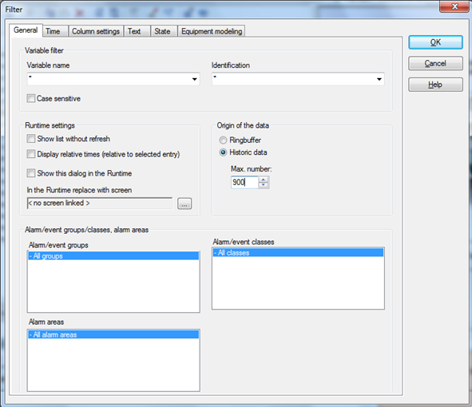

Для нашого прикладу нам необхідно зробити лише декілька змін.

- Активуйте опцію *Historic data*
- Встановіть максимально до 900 записів

Вкладка *Time*

Ця вкладка дозволяє нам налаштувати різноманітні варіанти часових фільтрів відображення інформації.

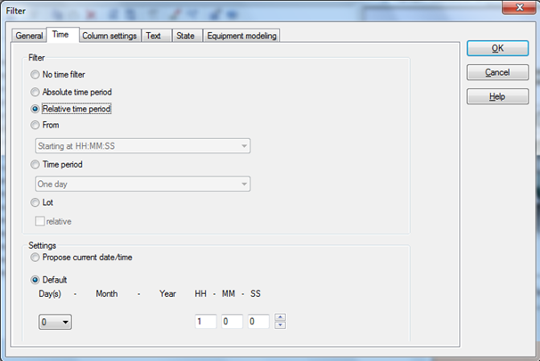

Вкладка *Column* *settings*

Дозволяє вибрати потрібні стовпчики, їх послідовність, задати їх ширину, підпис, стиль строк.

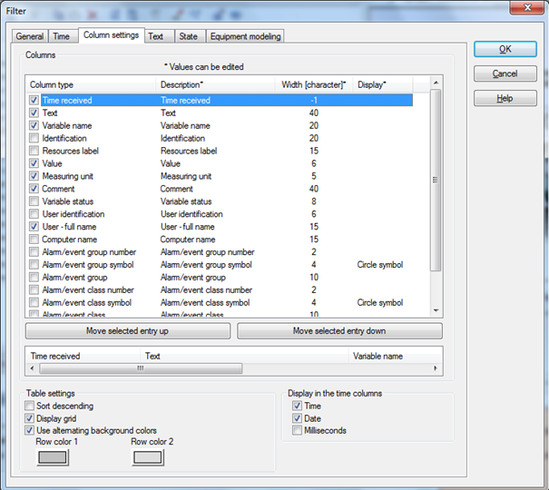

Зробіть так, щоб відображувались стовпці часу,  тексту, змінної, значення, одиниць виміру, коментарю та користувача.  Стовбець тексту та коментаря встановіть в 40 символів.

Вкладка *Text*

*Дозволяє здійснити фільтрування подій по заданому текстовому шаблону.*

*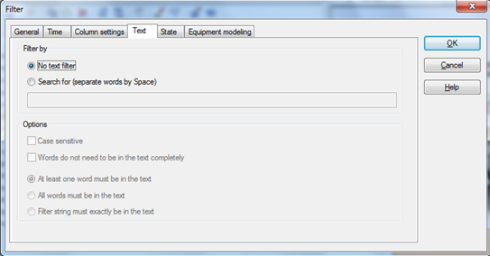*

Нічого змінювати тут не будемо.

Вкладка *State*

Дозволяє фільтрувати дані по стану змінної.

Вкладка *Equipment* *modeling*

Якщо в проекті виконане моделювання обладнання, то тут можна визначити відображення списку подій, що стосуються певного  обладнання.

На даному етапі ми нічого змінювати не будемо, тому просто закінчіть створення та конфігурування функції натиснувши кнопку *OK*. 

<iframe width="640" height="360" src="https://www.youtube.com/embed/Au5l8Yx75FU" title="YouTube video player" frameborder="0" allow="accelerometer; autoplay; clipboard-write; encrypted-media; gyroscope; picture-in-picture" allowfullscreen></iframe>

### Робота з екраном CEL

***\*Завдання 6.4: Створіть кнопку виклику екрану CEL та перевірте роботу.\****

Для перемикання на екран 'Хронологія' на панелі  навігації необхідно створити відповідну кнопку. Її можна просто  скопіювати з уже існуючої. Прив’язка функції здійснюється або  перетягуванням її на відповідну кнопку (Drag&Drop), або через пункт  властивостей *Variable / function* -> *F**unction:*

*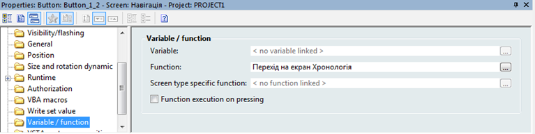*

Запустіть Runtime і перевірте зроблену роботу. Ваш екран повинен мати наступний вигляд:

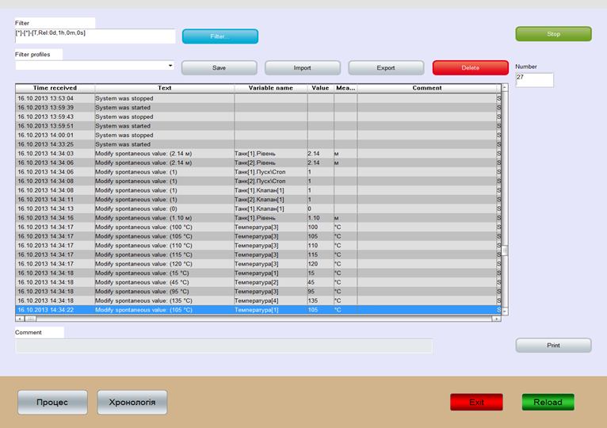

Представлення списку подій повністю налаштовується в функції перемикання на цей екран.

Через кнопку 'Filter…' можна безпосередньо в онлайн режимі налаштовувати відображення списку подій під свої задачі.

Вибрані індивідуальні налаштування можуть бути збережені користувачем у вигляді профілю. 

Через поле 'Comment' до кожної події, що відображається у списку, оператор має можливість задати свій коментар.

Для закріплення матеріалу, виконайте кілька операцій:

- Натисніть кнопку 'Filter…' і активуйте колонку *Computer* *name*
- Збережіть зроблені налаштування через профіль 'Filter profiles' з ім’ям 'Мій профіль'

Виконайте  перемикання між екранами 'Процес' та 'Хронологія' і перевірте як працює  збережений профіль. За бажанням зробіть інші налаштування списку.

<iframe width="640" height="360" src="https://www.youtube.com/embed/orjamvOIJ3k" title="YouTube video player" frameborder="0" allow="accelerometer; autoplay; clipboard-write; encrypted-media; gyroscope; picture-in-picture" allowfullscreen></iframe>

### Реєстрація лімітних значень

***\*Завдання 6.5: Налаштуйте реєстрацію в CEL спрацювання ліміту.\****

Екран хронології подій може реєструвати не тільки дії оператора, а й спрацювання граничного порогу (функцій екрану Тривог).

Давайте зробимо так, щоб при досягненні критичного рівня та температури ця подія заносилась в наш журнал.

- Виберіть змінну 'Танк[1].Рівень'
- У властивостях *Limit**[4]* для поля *AML**/**CEL**[4]* активуйте бокс *In* *Chronological* *Event* *List*

*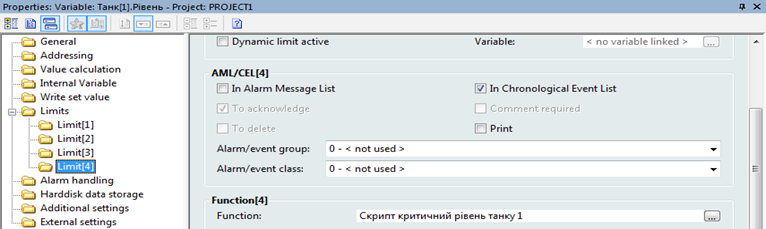*

Для змінної 'Температура[3]' виконайте аналогічну операцію.

Поверніться в Runtime та задайте змінним критичні  значення. Ця подія повинна з’явитись в Хронологічному списку подій. При  чому, в колонці 'Text', буде зазначено текст для цього ліміту.

***\*Завдання 6.6: Налаштуйте роботу CEL в проекті.\****

Здійснити деякі додаткові налаштування відображення Хронологічного  списку подій можна через властивості проекту, розділ Chronologic Event  List

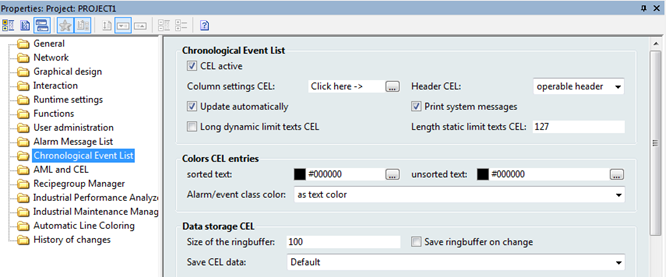

Для поліпшення взаємодії оператора з екраном хронології існує спеціальний тип екрану - *Chronological* *Event* *List* *Filter**,* який дозволяє в зручному вигляді здійснювати фільтрування списку подій  по часу чи заданому ключовому слову. Цей екран фільтру повинен  базуватись на своєму індивідуальному фреймі (як спливаюче pop-up вікно). Виклик такого екрану можна здійснювати через відповідну кнопку фільтру, чи разом з перемиканням на екран Хронологічного списку подій.

Дану функціональність перевірте самостійно.

Докладніше про створення і роботу з екраном типу CEL можна познайомитись в мануалі Chronological Event List.

<iframe width="640" height="360" src="https://www.youtube.com/embed/652Cfc_8jC0" title="YouTube video player" frameborder="0" allow="accelerometer; autoplay; clipboard-write; encrypted-media; gyroscope; picture-in-picture" allowfullscreen></iframe>

### Створення екрану тривог (AML)

Досягнення критичних значень параметрів в системі реєструється в спеціальному  журналі – Інформаційному списку тривог (Alarm Message List). До нього  заноситься час появи тривоги, її статус (активна, не активна,  підтверджена), опис тривоги, змінна, її значення, поточний оператор,  робоча станція, коментар.

***\*Завдання 6.7: Створіть екран AML.\****

Аналогічно до попереднього розділу створіть новий екран, але як *Screen type* виберіть *Alarm Message List.* Назвіть екран 'Тривоги' та задайте довільний колір фону.

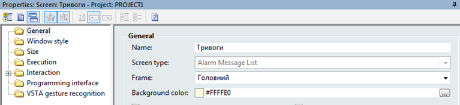

Через головне меню *Control* *elements* розмістіть на екрані усі необхідні елементи та відредагуйте їх розміщення.

Для переходу на цей екран як і в попередньому випадку нам необхідно створити функцію *Screen* *switch* та кнопку 'Тривоги' на панелі навігації.

При створенні функції перемикання з’явиться діалогове вікно конфігурування, яке має опції налаштування відображення тривог.

***\*Завдання 6.8: Створіть функцію виклику екрану AML.\****

Діалогове вікно  конфігурування має шість вкладок, суть яких подібна до тих, що були для  функції перемикання на екран Хронології. Ми залишимо усі налаштування  які стоять за замовчуванням. Закінчіть створення та конфігурування  функції натиснувши кнопку *OK* і перейменуйте її в 'Перехід на екран Тривоги'.

<iframe width="640" height="360" src="https://www.youtube.com/embed/QCEH4ot1Ry0" title="YouTube video player" frameborder="0" allow="accelerometer; autoplay; clipboard-write; encrypted-media; gyroscope; picture-in-picture" allowfullscreen></iframe>

### Визначення лімітів

***\*Завдання 6.9: Створіть кнопку виклику екрану AML.\****

Для кнопки перемикання на екран тривоги прив’яжіть створену нами функцію 'Перехід на екран Тривоги'.  

Якщо зараз запустить проект і перейти на екран  тривог, то жодних записів в списку не буде. Спрацювання тривоги і  відображення в Інформаційному списку тривог визначається індивідуально  для кожної змінної в лімітах. З ними ми вже познайомились при  конфігуруванні кольорів для рівня танку.

***\*Завдання 6.10: Налаштуйте спрацювання тривоги, шляхом означення рівня\**** **'Танк[1].Рівень' розділ Limits та перевірте роботу.**

Давайте зробимо так, щоб при досягненні останнього визначеного ліміту для змінної рівня - 'Критичний рівень',  спрацьовувала тривога.

- Зайдіть у властивість змінної 'Танк[1].Рівень' розділ *Limits*  
- В підрозділі *Limit**[4]* для опції *AML**/**CEL**[4]* активуйте бокс *In* *Alarm* *Message* *List* 
- *Також, активуйте бокси \*To acknowledge\* та \*To delete**

**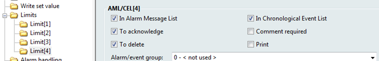**

Таким чином, при досягненні рівня верхнього лімітного значення (в нас визначено в діапазоні 2.35 - 2.55), спрацює тривога, яка буде  відображена в журналі тривог. При цьому вона буде мати статус 'Активна'  (червоне коло). Якщо рівень впаде нижче лімітного значення, то вона  змінить свій статус на 'Не активна' (зелене коло). Також, тривога може  змінити свій статус на 'Підтверджена' (сине коло), якщо оператор натисне кнопку 'Acknowledge'. Оскільки ми активували опцію To delete, то даний  запис пропаде зі списку тільки якщо ми вручну видалимо його відповідною  кнопкою.

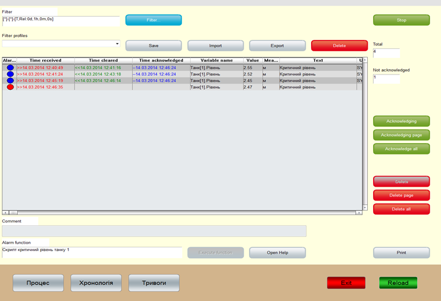

Скомпілюйте зроблені в проекті зміни та запустіть  Runtime. Змінюючи значення рівня промоделюйте спрацювання граничного  значення в Танку1. Перейдіть на екран 'Тривоги'. Там повинний з’явитися  відповідний запис з текстом 'Критичний рівень'. Спробуйте підтвердити цю тривогу та видалити.

Ваш екран повинен мати вигляд, як показано на малюнку вище.

Аналогічним чином сконфігуруйте спрацювання тривоги при переведенні змінної 'Танк[2].Пуск\Стоп' в стан стоп (значення '0').

- Зайдіть у властивість змінної 'Танк[1].Рівень' розділ *Limits*  
- В підрозділі *Limit**[1]* для опції *AML**/**CEL**[4]* активуйте бокс *In* *Alarm* *Message* *List*  та *To* *Acknowlege*

Перевірте в Runtime спрацювання цієї тривоги.

<iframe width="640" height="360" src="https://www.youtube.com/embed/Hf2C84JuyGo" title="YouTube video player" frameborder="0" allow="accelerometer; autoplay; clipboard-write; encrypted-media; gyroscope; picture-in-picture" allowfullscreen></iframe>

### Матриці реакції

Окрім лімітів, в zenon існує можливість централізованого визначення граничних значень спрацювання тривог - матриці реакції.

*Матриці реакції (**REMA**) набагато  більш функціональний інструмент в порівнянні з лімітами. Він дозволяє  сконфігурувати спрацювання тривоги не тільки по значенню змінної, а й по 64 станам цієї змінної (недійсне значення, альтернативне…) та логічній  умові (більше, менше, рівно).*

Матриця реакції буває бінарна, цифрова, мультибінарна, мультицифрова та строкова.

***\*Завдання 6.11: Налаштуйте матриці реакцій.\****

- В дереві проекту зайдіть в розділ *Variables* *->* *Reaction* *matrix* і правою кнопкою миші створіть бінарну матрицю з назвою 'Tank'

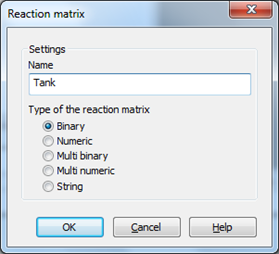

Після натиснення кнопки *OK* з’явиться діалог налаштування матриці.

- Натисніть на кнопку *New* *status* і для першого біту в полі *Value* поставте значення '0'.
- В полі *AML**/**CEL* активуйте бокс *In* *Alarm* *Message* *List* *,* *To* *Acknowlege, In Chronological Event List* 

*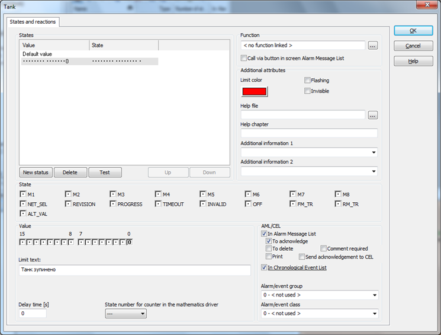*

Матриця реакції дозволяє сконфігурувати ініціацію  перевірки необмеженої кількості статусів, які перебираються системою  послідовно один за одним починаючи з верхнього. Як тільки статус  підтверджується, дія сконфігурована для нього, автоматично виконається  (поле *Function*). Тут також визначається колір відображення та текст тривоги.

- Конфігурування матриці реакції закінчіть кнопкою *OK*

<iframe width="640" height="360" src="https://www.youtube.com/embed/-dFqi47mS8c" title="YouTube video player" frameborder="0" allow="accelerometer; autoplay; clipboard-write; encrypted-media; gyroscope; picture-in-picture" allowfullscreen></iframe>

***\*Завдання 6.12: Прив'яжіть матриці реакцій до змінної.\****

Тепер створену матрицю реакції необхідно прив’язати до відповідної змінної.

- Виберіть змінну 'Танк[2].Пуск\Стоп'
- В розділі *Limits -> Reaction matrix* виберіть створену матрицю 'Tank'

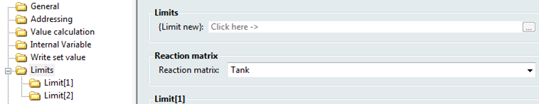

При цьому задані раніше лімітні значення деактивуються.

Якщо система має велику кількість однотипних  змінних, то використання матриць реакції значно прискорює процес  створення проекту.

Аналогічним чином можуть бути створені цифрова та строкова матриця реакції. В рамках цього навчання ми їх розглядати не будемо.

***\*Завдання 6.13: Зробіть додаткові налаштування тривог.\****

*Здійснити деякі додаткові налаштування відображення Інформаційного списку тривог можна через властивості проекту, розділ \*Alarm Message List.**

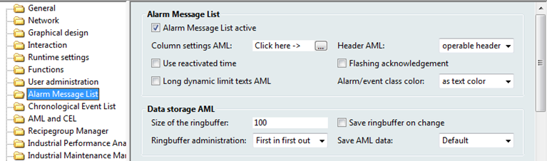

Для поліпшення взаємодії оператора з екраном тривог існує спеціальний тип екрану – *Alarm* *Message* *List* *Filter**,* який дозволяє в зручному вигляді здійснювати фільтрування списку подій  по часу чи заданому ключовому слову. Цей екран фільтру повинен  базуватись на своєму індивідуальному фреймі (як спливаюче pop-up вікно). Виклик такого екрану можна здійснювати через відповідну кнопку фільтру, чи разом з перемиканням на екран Інформаційного списку подій.

Дану функціональність перевірте самостійно.

Докладніше про створення і роботу з екраном типу AML можна познайомитись в мануалі Alarms administration.

<iframe width="640" height="360" src="https://www.youtube.com/embed/2lXlQIRp-kw" title="YouTube video player" frameborder="0" allow="accelerometer; autoplay; clipboard-write; encrypted-media; gyroscope; picture-in-picture" allowfullscreen></iframe>

