## zenon ЛР6: Тренди

### Створення ціклічного архіву

Система керування дозволяє здійснювати архівування в трьох режимах: циклічному  (раз в секунду, хвилину, годину…), по зміні параметру, по події  (тригерне). Усі зібрані дані можуть зберігатися у внутрішньому форматі  (arx), текстовому (csv), веб-форматі (xml) чи безпосередньо в SQL-базі  даних. Також, окремо виділяється пакетне архівування, яке представляє  собою спеціальний режим архівування, який використовується в харчовій та фармацевтичній промисловості при виробництві продукції по-партіям.

*Базова версія ліцензії* *zenon*  *дозволяє здійснювати циклічне архівування. Усі інші режими архівування, у тому числі і створення каскадних архівів, доступні лише при замовленні  повноцінного модуля архівів.*

Давайте створимо архів, в який кожні 5 секунд будуть заноситись значення змінних температури та рівня.

***\*Завдання 7.1: Зробіть кофігурування трендового архіву.\****

- В дереві проекту зайдіть в розділ *Historian* і правою кнопкою миші виберіть пункт *New* *Archive**…*

*Автоматично з’явиться майстер швидкого налаштування архіву:*

*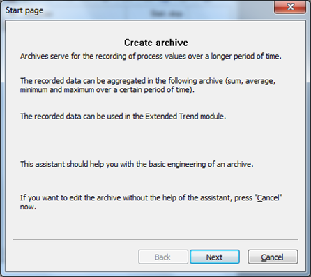*

Ми виконаємо усі налаштування уручну, тому просто закрийте його кнопкою *Cancel**.*

Після цього з’явиться діалогове вікно конфігурування архіву, яке містить п’ять вкладок. Далі ми розглянемо кожну з них.

Вкладка *Properties*

- Задайте довільний ідентифікатор архіву та його назву – 'TA', 'TEMPERATURA'
- В секції *Variable* *selection* правою кнопкою миші через *Add* *variable* додайте змінну 'Танк[1].Рівень' і 'Температура[1]'

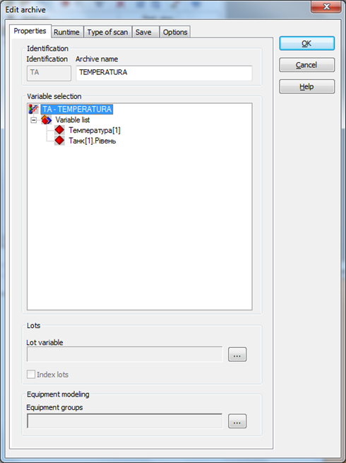

Вкладка *Runtime*

На цій вкладці конфігурується запуск і зупинка  ведення архіву. Залишимо запуск архівування при старті Runtime, як  встановлено за замовчуванням.

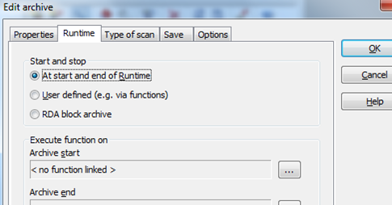

Вкладка *Type* *of* *scan*

На третій вкладці визначається частота зчитування значень змінних і заносу їх до архіву.

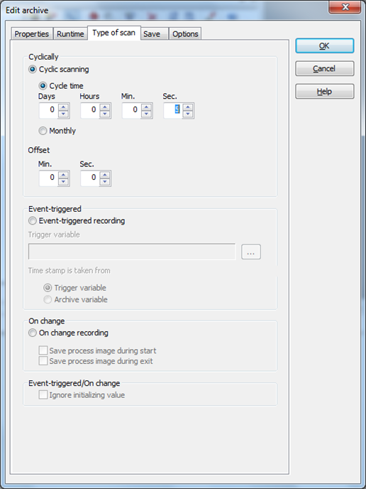

- Виберіть циклічний режим сканування *Cyclic* *scanning*
- Параметр *Cycle* *time* встановіть в *5* *Sec*.

Таким чином, значення наших змінних будуть заноситись до архіву кожні 5 секунд.

*Мінімальна дискретизація інтервалу запису в  архів – 1 секунда. Для швидшого збереження даних, необхідно  використовувати технологію* *RDA**, при якій дані буферизуються в контролері, а потім пакетами передаються в* *SCADA* *систему.*

Вкладка *Save*

Це найважливіша вкладка діалогового вікна  налаштування архіву, в якій визначається формат збережених файлів, їх  розмір та метод видалення.

- Встановіть збереження архіву у внутрішньому форматі *Internal database* з циклом *2* *Min*

При таких налаштуваннях кожні дві хвилини система  буде утворювати окремий архівний файл *.arx, який містить по 24 записів  (кожні 5 секунд протягом 2-х хвилин).

*Архівні файли внутрішнього формату – це  зашифровані бінарні файли невеликої ємності, які ніякою програмою, за  винятком самого zenon, не можуть бути відкриті. Окрім перегляду через  екран архівів, ці дані також можна використовувати в інших модулях  системи керування, таких як Тренди та Звіти.*

*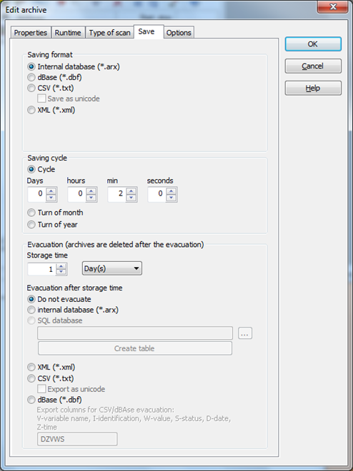*

- Активуйте опцію *Do* *not* *evacuate* і встановіть час збереження файлів в 1 день

При таких налаштуваннях архівні файли не будуть  вилучатись, а будуть зберігатись один день. Після чого вони у вигляді  кільцевого буферу будуть перезаписуватись (нові дані записуються на  місце старих).

Вкладка *Options*

Містить додаткові налаштування архіву. Тут ми нічого чіпати не будемо.

- Закрийте діалогове вікно конфігурування архіву кнопкою *OK*

Зроблені налаштування архіву можна у будь-який момент змінити за допомогою піктограми *Edit* *archive* у вікні детального перегляду.

<iframe width="640" height="360" src="https://www.youtube.com/embed/Q3lHUAatcOM" title="YouTube video player" frameborder="0" allow="accelerometer; autoplay; clipboard-write; encrypted-media; gyroscope; picture-in-picture" allowfullscreen></iframe>

### Екран перегляду архіву у вигляді таблиці

***\*Завдання 7.2: Створіть екран перегляду трендового архіву у вигляді таблиці.\****

- В дереві проекту зайдіть в розділ *Screens* і на базі фрейму 'Головний' cтворіть новий екран 'Архів'
- В якості спеціального типу виберіть *Archive* *revision*
- Через головне меню *Control* *elements* розмістіть на екрані усі необхідні елементи керування та відображення

<iframe width="640" height="360" src="https://www.youtube.com/embed/7QUkAq9jG7s" title="YouTube video player" frameborder="0" allow="accelerometer; autoplay; clipboard-write; encrypted-media; gyroscope; picture-in-picture" allowfullscreen></iframe>

***\*Завдання 7.3: Створіть функцію виклику перегляду трендового архіву у вигляді таблиці.\****

Для переходу на екран перегляду архіву ми створимо функцію *Screen* *switch* та прив’яжемо її до кнопки 'Архів', яку, як зазвичай, розмістимо на панелі навігації.

При створенні функції перемикання з’явиться діалогове вікно конфігурування, яке має набір опцій налаштування.

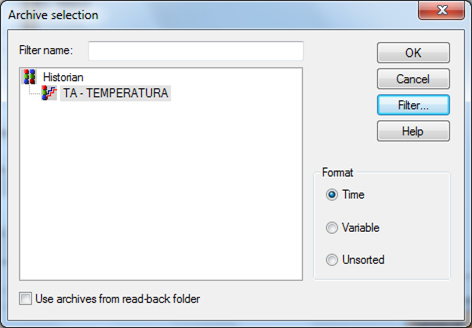

Тут можна визначити три режими сортування даних: в часовій послідовності потрапляння до архіву, згруповані по змінним, та  взагалі без сортування. Окремої уваги заслуговує кнопка *Filter**…*, яка містить ряд налаштувань представлення архівних даних. Тут можна  виконати фільтрування по архівним змінним, які ми бажаємо бачити при  переході на екран та діапазон часу. 

Залишимо усі значення, як встановлено за замовчуванням. Завершіть конфігурування функції натиснувши кнопку *OK* і перейменуйте її в 'Перехід на екран Архів'. 

<iframe width="640" height="360" src="https://www.youtube.com/embed/htM41Nq0N_E" title="YouTube video player" frameborder="0" allow="accelerometer; autoplay; clipboard-write; encrypted-media; gyroscope; picture-in-picture" allowfullscreen></iframe>

***\*Завдання 7.4: Створіть кнопку виклику функції, запустіть на виконання систему і подивіться екрани в роботі.\****

- Відкрийте екран 'Навігація' і створіть нову кнопку з ім’ям 'Архів'
- У властивостях *Variable \ function -> Function* виберіть створену нами функцію 'Перехід на екран Архів'

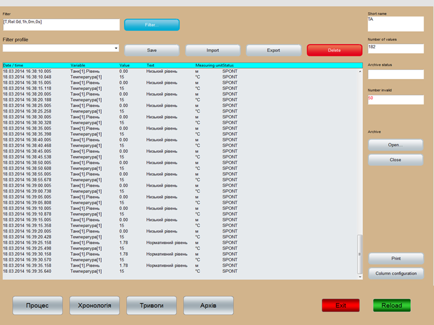

*При кожному запуску проекту встановлені  налаштування ширини стовбців будуть збиватись. Щоб цього не було  параметри необхідно прописати в системному файлі програми* *zenon**.**ini* 

*[ARCHEDIT]*

*ARCHEDITFONT=-13,0,0,0,400,0,0,0,0,3,2,1,49, Courier New*

*DATUMBREITE=25*

*EINHEITBREITE=10*

*STATUSBREITE=15*

*VARIABLEBREITE=10*

*WERTBREITE=10*

*ZUSTANDBREITE=10*

*Цей файл знаходиться в системній директорії C:\ProgramData\COPA-DATA\System (для* *Windows 7)**. Будьте обережними зі змінами в ньому, оскільки невірні дії можуть вивести систему з ладу.*

Через кнопку 'Filter…' оператор має можливість в режимі Runtime виконати певні налаштування представлення списку даних.

Також, система керування дозволяє здійснювати ручну модифікацію значень змінних авхіву.

- Двічі клікніть на значенні змінної яке Ви хочете відкорегувати

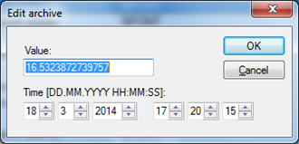

Помінявши значення, статус запису зміниться на  MAN_VAL і заголовок списку прийме червоний колір. Після збереження  зроблених правок заголовок поверне свій початковий вигляд.

*Архівні  дані представляються суцільним списком, який не дуже зручний для  аналізу. Для представлення виміряної інформації у вигляді повноцінного  табличного звіту з довільним розбиттям даних по стовбцям чи колонкам,  необхідно використовувати модуль* *Reporting**.*

<iframe width="640" height="360" src="https://www.youtube.com/embed/qlsPni9-99w" title="YouTube video player" frameborder="0" allow="accelerometer; autoplay; clipboard-write; encrypted-media; gyroscope; picture-in-picture" allowfullscreen></iframe>

### Екран з часовим фільтром

***\*Завдання 7.5: Створіть екран з часовим фільтром.\****

Для поліпшення взаємодії оператора з екраном перегляду архіву існує  спеціальний тип екрану – Time filter, за допомогою якого можна в  зручному вигляді здійснювати фільтрування списку даних по часу. Цей  екран фільтру повинен базуватись на своєму індивідуальному фреймі і  викликатись разом з екраном архіву.

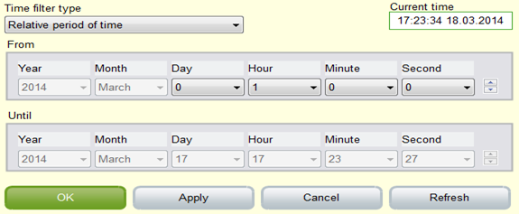

Дану функціональну можливість перевірте самостійно.

<iframe width="640" height="360" src="https://www.youtube.com/embed/Eb8dL6oIduI" title="YouTube video player" frameborder="0" allow="accelerometer; autoplay; clipboard-write; encrypted-media; gyroscope; picture-in-picture" allowfullscreen></iframe>

### Аріхівні файли та експорт архіву

**Архівні файли** 

Система утворює два типи файлів. Один файл –  заголовний TA.ARX, який містить налаштування архіву. Усі інші – файли  даних, наприклад, TA140317153800.ARX. В назві зашифровано ідентифікатор  архіву, дату та час створення файлу (по Гринвічу). Наступний створений  системою файл буде мати ім’я TA140317154000.ARX.

Ці файли зберігаються папці проекту, яка містить  його ім’я та назву робочої станції (наприклад,  C:\Users\Golinko\PROJECT1\N89A167\PROJECT1). Точну директорію можна  знайти через налаштування властивостей проекту *General* *->* *Name**/**Folder* *->* *Runtime* *folder**.*  

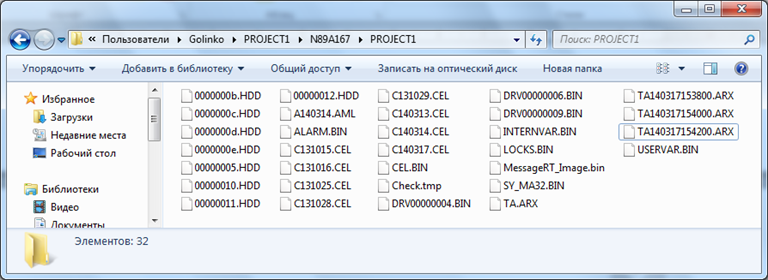

**Експорт архіву**

Якщо при конфігуруванні архіву, на вкладці *Save* вибрати опцію збереження даних в форматі CSV, то інформація буде  зберігатись в файли в папку ExportArx, місце розташування якої  визначається у властивостях проекту *General* *->* *File* *storage**.* По замовчуванню це папка проекту (C:\Users\Golinko\ PROJECT1\ExportArx).

*Файли CSV-формату - це текстові файли з роздільниками, придатні до використання і аналізу в MS Excel.* 

***\*Завдання 7.6: Зробіть експорт архіву.\****

Проте, якщо у Вас базова ліцензія, то ця опція  буде недоступна. В такому випадку експорт даних можна здійснювати через  спеціально створену функцію.

- В менеджері проекту зійдіть в розділ *Function* і створіть нову функцію *Export* *archives*, яка знаходиться в підрозділі *Historian*

Далі з’явиться діалог налаштування функції експорту з набором вкладок.

- На вкладці *General* активуйте опції експорту в формат *CSV* з заносом даних змінної і часу, автоматичної генерації ім’я файлу та відображення цього діалогу в Runtime.
- На вкладці *Archive* виберіть архів 'ТА-TEMPERATURA'
- На вкладці *Time* виберіть час, за який повинні експортуватись дані, наприклад, 1 годину

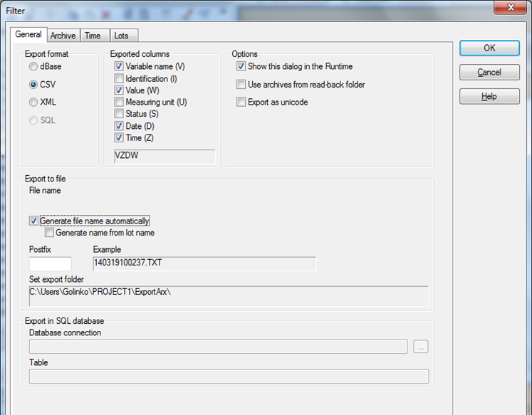

- Закінчіть конфігурування кнопкою *OK* і перейменуйте створену функцію в 'Експорт архіву'

Архівні файли будуть експортуватись в файли в папку ExportArx, місце розташування якої визначається у властивостях проекту *General* *->* *File* *storage**.* При бажанні тут можна визначити будь-яку директорію.

Тепер нам необхідно створити на екрані перегляду архіву відповідну кнопку експорту.

- Відкрийте екран 'Архів' і справа над кнопкою друку створіть нову кнопку з назвою 'Експорт'
- У властивостях створеної кнопки *Variable* *\* *function* *->* *Function* прив’яжіть функцію 'Експорт архіву'

Запустіть Runtime і виконайте експорт архіву.  Оскільки при конфігуруванні функції експорту ми активували опцію  відображення діалогу налаштування, то оператор має можливість в онлайн  режимі вибрати формат збереження даних та параметри, які повинні  заноситись до архіву.

Поетапно виконайте експорт архіву в усі доступні формати: dBase, CSV та XML. 

<iframe width="640" height="360" src="https://www.youtube.com/embed/Y6uRYWWtplQ" title="YouTube video player" frameborder="0" allow="accelerometer; autoplay; clipboard-write; encrypted-media; gyroscope; picture-in-picture" allowfullscreen></iframe>

### Каскадний архів

Існують випадки, коли необхідно здійснювати архівацію не прямих значень  змінних, а похідних даних, наприклад сумарного значення за певний  період, середнього, мінімального чи максимального. Для цієї задачі в  zenon існує поняття каскадного архіву.

Давайте на базі нашого циклічного архіву організуємо каскадний архів мінімальних значень температури та рівня.

***\*Завдання 7.7: Налаштуйте каскадний архів.\****

- В дереві проекту зайдіть в розділ *Historian* і з контекстного меню архіву 'ТА-TEMPERATURA' виберіть пункт *New* *Aggregated* *archive**…*

Автоматично з’явиться майстер швидкого налаштування  архіву. Ми виконаємо усі налаштування уручну, тому просто закрийте його  кнопкою *Cancel**.*

Після цього з’явиться вже знайоме нам діалогове вікно конфігурування архіву.

Вкладка *Properties*

*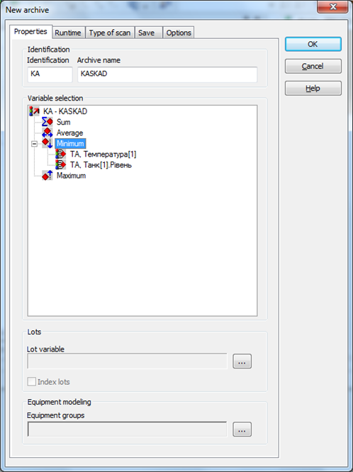*

- Задайте довільний ідентифікатор архіву та його назву – 'КA', 'KASKAD'
- В секції *Variable* *selection* правою кнопкою миші через *Add* *variable* для розділу *Minimum* додайте змінну 'Танк[1].Рівень' і 'Температура[1]'

Налаштування на інших вкладках залиште без змін:  запис по зміні, збереження у внутрішню пам’ять кожні 2 хвилини протягом 1 дня, без евакуації.

- Закрийте діалог налаштування кнопкою *OK*.

На цьому конфігурування каскадного архіву  завершене. Перейдіть в Runtime і відкрийте вікно перегляду архіву.  Кнопкою 'Open…' відкрийте архів 'KA - KASKAD'.

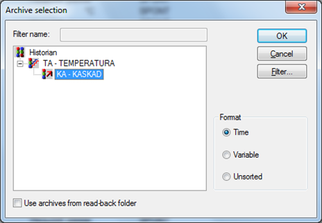

Система підгрузить лише мінімальні значення, які  мали змінні протягом кожних 2-х хвилин. До імені змінної допишеться  закінчення [МI] – мінімальне значення.

При інших типах каскадних архівів допишеться [МА] – максимум, [МW] – середнє значення, [SU] – сума. Спробуйте самостійно опрацювати ці варіанти.

Для знайомства з пакетним архівуванням та збереженням даних в SQL-базу даних зверніться до технічної документації Historian.

<iframe width="640" height="360" src="https://www.youtube.com/embed/vsl9GUZ8sqs" title="YouTube video player" frameborder="0" allow="accelerometer; autoplay; clipboard-write; encrypted-media; gyroscope; picture-in-picture" allowfullscreen></iframe>

### Налаштування трендових екранів

З метою аналізу і зручного візуального сприйняття, виміряну інформацію  представляють у вигляді графіків – трендів. На відміну від вже  розглянутого нами трендового елементу, який має досить примітивну  функціональність, zenon дозволяє створювати повноцінні трендові екрани з великою кількістю налаштувань. Трендові криві можуть будуватись на  основі як онлайн так і архівних даних.

*Базова версія ліцензії* *zenon* *містить стартову редакцію модуля трендів. Для отримання повної функціональності, необхідно придбати відповідну ліцензію.*

***\*Завдання 7.8: Створіть екран трендів.\****

Давайте створимо екран відображення графіків наших архівних змінних – температури та рівня.

- В дереві проекту зайдіть в розділ *Screens* і на базі фрейму 'Головний' cтворіть новий екран 'Тренди'
- В якості спеціального типу виберіть *Extended* *Trend* і задайте довільний колір фону
- Через головне меню *Control* *elements**,* використовуючи кнопочні шаблони, розмістіть на екрані усі необхідні елементи керування та відображення

<iframe width="640" height="360" src="https://www.youtube.com/embed/h0bNjYKIoiU" title="YouTube video player" frameborder="0" allow="accelerometer; autoplay; clipboard-write; encrypted-media; gyroscope; picture-in-picture" allowfullscreen></iframe>

***\*Завдання 7.9: Створіть функцію виклику екрану.\****

При створенні екрану трендів найважливіше значення має конфігурування функції перемикання.

- В дереві проекту зайдіть в розділ *Functions* і правою кнопкою миші створіть нову функцію *Screen switch* і вкажіть екран 'Тренди'

Автоматично з’явиться діалог конфігурування  функції, через який здійснюється вибір кривих, що будуть відображуватись та їх налаштування.

- Для поля *Origin* *of* *the* *data* виберіть *Archive* *data*
- *Refresh rate* встановіть в *2* *sec*
- Активуйте опцію *YT-display*
- Натисніть кнопку *Add curve …* і додайте з архіву змінну 'Танк[1].Рівень' та 'Температура[1]'
- Для кожної кривої проконтролюйте щоб були активовані бокси *Show* *curve* та *Show* *y**-**axis* *for* *curves*

*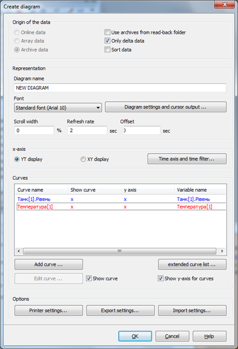*

Давайте налаштуємо представлення часової вісі діаграми.

- Натисніть кнопку *Time axis and time filter*

З’явиться додатковий діалог конфігурування з вкладками:

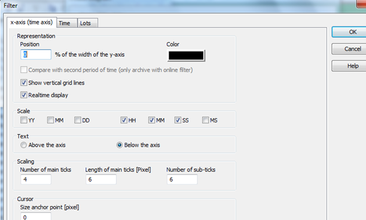

- На вкладці *x**-**axis* активуйте *Show* *vertical* *grid* *lines* і залиште підписи для годин хвилин та секунд
- На вкладці *Time* залиште *Relative* *time* *period* і встановіть період представлення шкали в 10 хвилин
- Закрийте вікно кнопкою *OK*

Тепер нам необхідно сконфігурувати окремо кожну криву.

- В полі *Curves* двічі клікніть на кривій 'Танк[1].Рівень'

З’явиться додатковий діалог конфігурування з двома вкладками налаштування параметрів кривої та вісі ординат.

- На вкладці *Curve* *parameters* виберіть суцільну лінію представлення та активуйте інтерполяцію
- Колір кривої встановіть синій

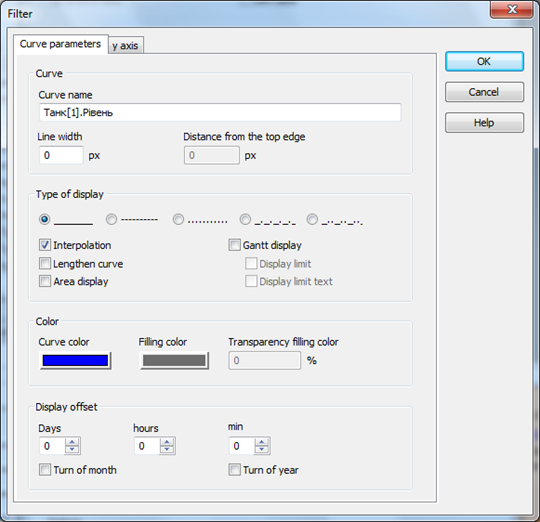

- На вкладці *y* *axis* задайте підпис вісі 'L',
- Колір вісі встановіть в синій
- Активуйте опцію *Show* *horizontal* *grid* *lines* 
- Діапазон шкали залишіть як виставила система (0 – 2.55)
- Підписи шкали повинні відображатись з лівого боку
- Закрийте вікно кнопкою *OK*

*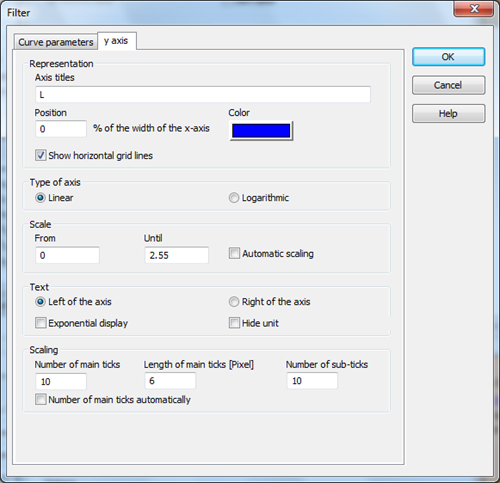*

Повторимо зроблені операції для другої кривої.

- В полі *Curves* двічі клікніть на кривій 'Температура[1]'
- На вкладці *Curve* *parameters* виберіть суцільну лінію представлення, активуйте інтерполяцію та зафарбовування площини
- Встановіть колір кривої в червоний та рожеве зафарбовування площини під кривою

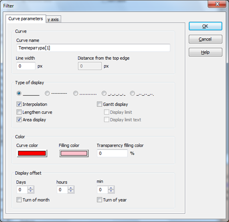

- На вкладці *y* *axis* задайте підпис вісі 'Т',
- Позицію зміщення вісі виставте в 100 %
- Колір вісі встановіть в червоний
- Активуйте опцію *Show* *horizontal* *grid* *lines* 
- Діапазон шкали залишіть як виставила система (0 – 150)
- Підписи шкали повинні відображатись з правого боку
- Закрийте вікно кнопкою *OK*

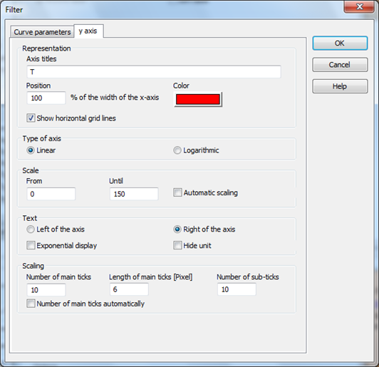

Перейменуйте створену функцію в 'Перехід на екран Тренди'

<iframe width="640" height="360" src="https://www.youtube.com/embed/uYUXsNBeWbI" title="YouTube video player" frameborder="0" allow="accelerometer; autoplay; clipboard-write; encrypted-media; gyroscope; picture-in-picture" allowfullscreen></iframe>

### Трендові екрани в режимі виконання

***\*Завдання 7.10: Створіть кнопку виклику трендового екрану і запустіть систему на виконання.\****

- На екрані 'Навігація' створіть нову кнопку з ім’ям 'Тренди' і прив’яжіть відповідну функцію

Запустіть проект і перейдіть на екран трендів. У  Вас повинен з’явитись екран з відображенням кривих рівня і температури з заданим часом поновлення діаграми – 2 секунди. Поверніться на основний  екран процесу і просимулюйте хаотичну зміну значення трендових змінних.

Поверніться на екран трендів і перевірте  функціонал наявних на ньому кнопок: сканування значень кривих,  масштабування, активації (кривих та вісей), збереження індивідуальних  конфігурацій в профілі.

Також, оператор має можливість в режимі Runtime через кнопку 'Diagram' здійснювати додаткові налаштування відображення кривих.

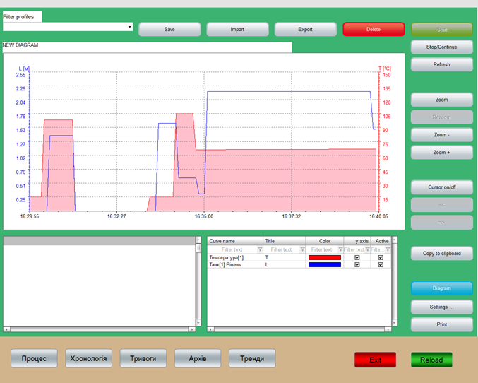

Оскільки ми  оперуємо архівними даними, то за допомогою кнопок переміщення по  діаграмі можна виконувати прокрутку кривих в часі та їх аналіз.

<iframe width="640" height="360" src="https://www.youtube.com/embed/4cesrPWlOrc" title="YouTube video player" frameborder="0" allow="accelerometer; autoplay; clipboard-write; encrypted-media; gyroscope; picture-in-picture" allowfullscreen></iframe>

***\*Завдання 7.11: Перевірте роботу екрану часового фільтру з трендовими екранами.\****

По аналогії з архівами, за допомогою екрану зі спеціальним типом *Time* *filter**,* можна в зручному вигляді здійснювати масштабування періоду відображення  трендів. Цей екран фільтру повинен базуватись на своєму індивідуальному  фреймі і викликатись разом з екраном трендів.

Якщо Ви вже створили цей екран та відповідну  функцію при розгляді теми архівів, то Вам залишилось лише додати екран  трендів у вже створену функцію виклику даного часового фільтру.

Докладніше про модуль трендів можна познайомитись в мануалі Extended Trend.

<iframe width="640" height="360" src="https://www.youtube.com/embed/OlKXVXGuDtU" title="YouTube video player" frameborder="0" allow="accelerometer; autoplay; clipboard-write; encrypted-media; gyroscope; picture-in-picture" allowfullscreen></iframe>