## zenon ЛР7: Адміністрування користувачів та блокування

### Визначення користувачів

Система керування дозволяє реалізувати ряд заходів для забезпечення найвищого  рівня безпеки при керуванні процесом виробництва. Одним з таких заходів  являється впровадження в проекті багаторівневої системи адміністрування  доступу користувачів.

***\*Завдання 8.1: Створіть двох користувачів.\****

Для опрацювання системи адміністрування ми  створимо двох користувачів: оператора та інженера, які будіть мати різні рівні доступу\авторизації.

- В менеджері проекту виберіть вузол *User* *administration* *->* *User*
- Правою кнопкою миші створіть нового користувача

Автоматично з’явиться діалогове вікно налаштувань з набором вкладок.

- На вкладці *User* введіть ім’я 'Оператор' та довільне повне ім’я 'Олег Сергійович'  

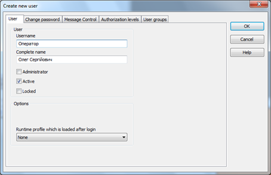

- На вкладці *Change* *password*  введіть 6-ти значний пароль
- На вкладці *Authorization* *levels* для цього користувача визначіть рівень доступу 1

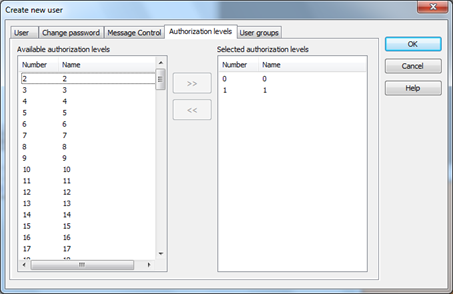

*В* *zenon* *рівні доступу не мають  пріоритетності. Тобто, рівень 1 має такий же пріоритет як рівень 15.  Один користувач може мати необмежену кількість рівнів (макс. 128).*

- Завершіть конфігурування кнопкою *OK*

У вікні детального перегляду тепер з’явився  створений нами користувач. Усі налаштування можна у будь-який момент  змінити через вікно властивостей.

- Створіть нового користувача 'Інженер' з довільним повним ім’ям 'Олександр Анатолійович'  
- Також активуйте опцію *Administrator*

*Права адміністратора дають можливість в* *Runtime* *блокувати чи розблоковувати користувачів (у випадку, якщо тричі було  введено невірно пароль), створювати нових користувачів чи видаляти  існуючих.* 

- На вкладці *Change* *password* введіть 6-ти значний пароль
- На вкладці *Authorization* *levels* для цього користувача визначіть рівень доступу 1 та 2

<iframe width="640" height="360" src="https://www.youtube.com/embed/RFKxAccmlZI" title="YouTube video player" frameborder="0" allow="accelerometer; autoplay; clipboard-write; encrypted-media; gyroscope; picture-in-picture" allowfullscreen></iframe>

### Додаткові налаштування

У властивостях проекту існує спеціальний розділ - *User administration*, в якому можна визначити максимальну кількість разів невірного вводу  паролю чи імені, мінімальну довжину паролю, переіменувати рівні  авторизації та багато інших опцій. Пізніше ми сюди ще повернемось.

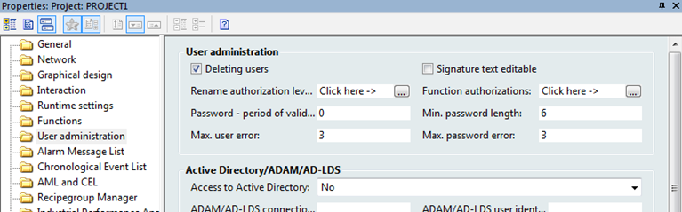

В zenon існує захисний механізм від втрати даних,  які користувач–адміністратор додав в систему в режимі Runtime, а саме –  нових користувачів. Ця опція називається *RT changeable data*. Якщо вона активна, то при компілюванні проекту файл 'password.cmp' не буде  перезаписуватись і створені в середовищі розробки користувачі не  «працюватимуть» в Runtime. Нас це не влаштовує. Тому цю функцію  необхідно деактивувати.

***\*Завдання 8.2: Деактивуйте опцію \*RT changeable data\* для користувачів.\****

- У властивостях проекту зайдіть в *General* *-> RT changeable data* і зніміть галочку з пункту *User* *administration*

*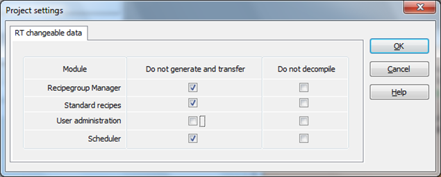*

Після компілювання проекту цю галочку можна повернути назад.

<iframe width="640" height="360" src="https://www.youtube.com/embed/aZXgIwXzE00" title="YouTube video player" frameborder="0" allow="accelerometer; autoplay; clipboard-write; encrypted-media; gyroscope; picture-in-picture" allowfullscreen></iframe>

### Прив’язка рівнів доступу

Розділення прав доступу в zenon здійснюється за рахунок визначення різних рівнів  авторизації до елементів керування – кнопок чи задатчиків значень. Таким чином, якщо, наприклад, користувач не уповноважений перейти на той чи  інший екран, система не дозволить йому це зробити.

***\*Завдання 8.3: Розмежуйте права користувачів.\****

Для нашого проекту давайте розмежуємо права користувачів таким чином:

| Користувач без авторизації | Доступ лише на екран 'Процес', без можливості встановлення значень усім температурним змінним. Рівень авторизації - 0 |
| -------------------------- | ------------------------------------------------------------ |
| Оператор                   | Доступ на всі екрани та встановлення значень всім змінним. Без можливості використання системних кнопок 'Exit' та 'Reload'. Рівень авторизації – 0, 1 |
| Інженер                    | Повний доступ. Рівень авторизації – 0, 1, 2                  |

- Відкрийте екран 'Навігація'
- Зайдіть у властивості кнопки 'Хронологія' *Authorization* *->* *Authorization* *level* і встановіть рівень 1

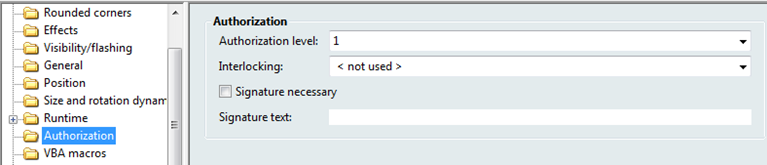

- Аналогічну операцію виконайте для кнопок 'Тривоги', 'Архів' і 'Тренди'.

*Для прискорення виконання однотипних операцій, через* *Ctrl* *виділіть усі кнопки та централізовано змініть відповідну властивість.*

- Для кнопок 'Exit' та 'Reload' встановть рівень доступу 2
- Відкрийте екран 'Процес'
- Зайдіть у властивості цифрового елементу температурних змінних 1,2,4 *Authorization* *->* *Authorization* *level* і встановіть рівень 1
- Аналогічну операцію виконайте для кнопок встановлення значення для змінної Температура[3]

На даному етапі ми вже можемо перевірити зроблену  роботу. Запустіть Runtime і натисніть кнопку 'Хронологія'. Система  автоматично видасть діалог авторизації:

*Це так званий стандартний діалог тимчасової  авторизації. Він діє одноразово. Якщо Ви захочете знову задіяти елемент, який має авторизацію, то це вікно з’явиться знову.* 

*При старті проекту система автоматично запускає його як користувач 'SYSTEM'* *з рівнем авторизації 0.* 

У відповідні поля введіть ідентифікатор створеного  нами раніше користувача 'Оператор' і його пароль. Відкриється екран  Хронологічного списку подій, до списку якого вже буде занесено зроблену  нами процедуру авторизації.

Зазвичай така  тимчасова процедура авторизації використовується в окремих конкретно  визначених випадках і для керування цілим проектом є неприйнятною.

<iframe width="640" height="360" src="https://www.youtube.com/embed/YvpwK-2j1io" title="YouTube video player" frameborder="0" allow="accelerometer; autoplay; clipboard-write; encrypted-media; gyroscope; picture-in-picture" allowfullscreen></iframe>

### Створення екрану авторизації

В проектах виконують постійну авторизацію через спеціально створене для цього діалогове вікно чи екран.

***\*Завдання 8.4: Деактивуйте опцію тимчасвої авторизації .\****

Щоб стандартний діалог тимчасової авторизації більше не з’являвся нам необхідно деактивувати цю процедуру 

- Зайдіть у властивості проекту *User* *administration* *->* *Temporary* *login* і деактивуйте опцію *Temp**.* *login* *active*

Тепер замість стандартного діалогу тимчасової  авторизації, при спробі перейти на екран хронології, буде з’являтись  системне повідомлення про те, що Ви не маєте права виконати цю операцію і необхідно виконати процедуру авторизації.

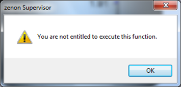

*Якщо для середовища розробки zenon у Вас  вибрано російський інтерфейс, то це повідомлення буде представлене на  російській мові. Через інструмент інтернаціоналізації, який ми  розглянемо пізніше, Ви зможете подавати всі текстові підписи в проекті  на будь-якій необхідній мові.*

***\*Завдання 8.5: Створіть екран авторизації.\****

Давайте створимо екран авторизації, через який користувач буде проводити процедуру логування в системі.

- В менеджері проекту виберіть вузол *Screens* *->* *Frames* і створіть новий фрейм 'Логін' розміром 340 х 220 і розмістіть його в правій нижній частині екрану
- На базі цього фрейму створіть новий екран 'Логін' і в якості спеціального типу вкажіть для нього *Login*

*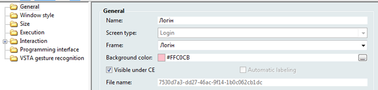*

- Зайдіть у вікно властивостей створеного екрану *Window* *style* і активуйте опцію *Modal* *dialog*
- Через головне меню *Control* *elements* розмістіть на екрані стандартний кнопочний шаблон
- Підредагуйте розміри елементів згідно розмірів екрану

<iframe width="640" height="360" src="https://www.youtube.com/embed/QFBqe1US35g" title="YouTube video player" frameborder="0" allow="accelerometer; autoplay; clipboard-write; encrypted-media; gyroscope; picture-in-picture" allowfullscreen></iframe>

### Робота з екраном авторизації

***\*Завдання 8.6: Створіть кнопку виклику діалогового вікна авторизації і перевірте роботу.\****

Тепер нам необхідно створити на панелі  навігації кнопку виклику діалогового вікна авторизації і прив’язати до  неї функцію перемикання.

- На екрані 'Навігація' створіть нову кнопку з ім’ям  'Login', задайте їй синій колір і розмістіть поруч з іншими системними  кнопками
- Проконтролюйте, щоб у цієї кнопки був рівень авторизації – 0

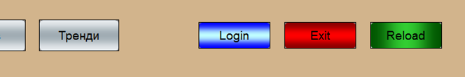

- В менеджері проекту створіть нову функцію *Screen switch* на екран 'Логін'
- Назвіть нову функцію 'Перехід на екран Логін' і прив’яжіть до відповідної кнопки на екрані навігації

На цьому створення екрану логування можна вважати  завершеним. Запустіть Runtime і натисніть кнопку з ім’ям 'Login'.  З’явиться наступне вікно авторизації:

Після реалізації  системи доступу, перевірте роботу усіх елементів керування, яким ми  визначили різні рівні доступу: без авторизації користувача, з  авторизацією як 'Оператор' і 'Інженер'.

<iframe width="640" height="360" src="https://www.youtube.com/embed/_Iv8yPc_1PY" title="YouTube video player" frameborder="0" allow="accelerometer; autoplay; clipboard-write; encrypted-media; gyroscope; picture-in-picture" allowfullscreen></iframe>

### Візуалізація авторизації

***\*Завдання 8.7: Створіть системну змінну для отримання інформації про поточного авторизованого користувача.\****

Через системну змінну в проекті можна представити  оператору інформацію про поточного авторизованого користувача. Давайте  зробимо це.

- Створіть нову змінну
- В якості драйверу виберіть системний – SYSDRV і натисніть кнопку *Next*
- З’явиться діалогове вікно налаштувань, в якому виберіть пункт *User* *administration* *->* *User* *–* *full* *name*
- Кнопкою *Add* *->* додайте цю змінну і закрийте діалог кнопкою *Finish*

*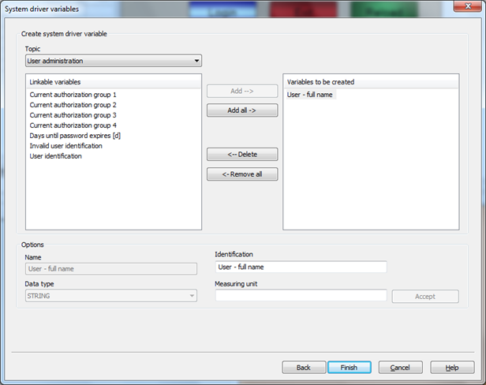*

Таким чином, в переліку змінних в нас з’явиться нова - 'User – full name', яка має наперед визначену функціональність та  призначення.

***\*Завдання 8.8: Створіть текст для відображення імені авторизованого користувача.\****

- На екрані 'Навігація' над системними кнопками розмістіть елемент *Dynamic* *text*, який можна знайти на інструментальній панелі елементів
- Прив’яжіть цьому елементі створену нами змінну 'User – full name' і зробіть прозорим колір фону

Запустіть проект та авторизуйтесь як 'Інженер'.  Зроблене поле відображає повне ім’я. Тепер в процесі роботи Ви будете  бачити який користувач в даний момент є активним і відповідно знати які  він має права доступу.

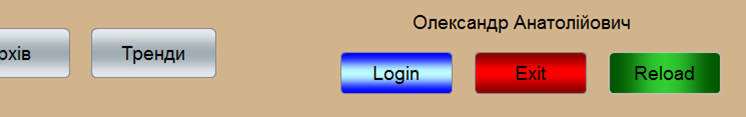

До послуг розробника існують іще деякі системні змінні, які Ви можете протестувати самостійно.

Для зручного сприйняття оператором елементів  керування для яких потрібна авторизація, система дозволяє представити їх в декількох графічних варіантах: сірим кольором, з графічною позначкою в кутку (наприклад, замок чи інша іконка) або взагалі зробити їх  невидимими.

- Зайдіть у властивості проекту *User* *administration* *->* *Temporary* *login* -> *Locked* *buttons* і виберіть зі спадного меню *gray*
- Зайдіть у властивості проекту *Graphical* *design* *->* *Locked**/**Interlocked* *elements* і активуйте бокс *Graphical* *identification* *active*

*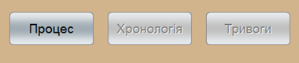  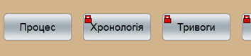*

Для того, щоб графічне зображення замка в нас не  плуталось з зображенням заблокованих елементів технологією блокувань,  яку ми розглянемо пізніше, давайте встановимо усі елементи, для яких  потрібна авторизація, в сірий колір, а виконаний нами другий пункт  відмініть.

 <iframe width="640" height="360" src="https://www.youtube.com/embed/OdC2JK3_mP0" title="YouTube video player" frameborder="0" allow="accelerometer; autoplay; clipboard-write; encrypted-media; gyroscope; picture-in-picture" allowfullscreen></iframe>

### Функції адміністратора

Як ми вже згадували, серед усіх користувачів, створених в проекті,  обов’язково повинен бути один з правами адміністратора (в нашому проекті - 'Інженер'). 

Спробуйте тричі ввести невірно пароль чи ім’я. Система заблокує Вас, а розблокувати зможе тільки адміністратор - 'Інженер'.

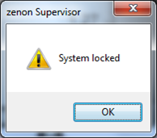 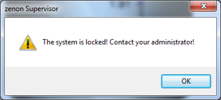

Також адміністратор може в онлайн режимі додавати нових користувачів. Давайте перевіримо як це працює.

***\*Завдання 8.9: Створіть нову функцію для редагуваня користувачів та кнопку її виклику.\****

- Створіть нову функцію *User administration -> Change user* і назвіть 'Редагування користувачів'
- На екрані 'Логін' розмістіть іще одну кнопку з ім’ям 'User edit' і прив’яжіть створену функцію

Запустіть проект і авторизуйтесь з правами адміністратора. Натисніть кнопку 'User edit'. З’явиться наступне вікно:

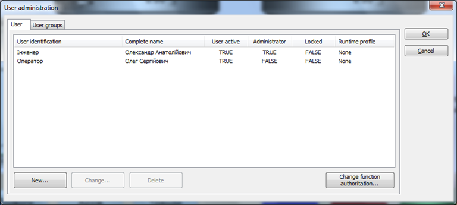

Якщо Ви маєте права адміністратора, в онлайн режимі  Ви можете видаляти користувачів, створювати нових, редагувати (змінювати паролі та рівні доступу), а також тимчасово їх блокувати. В нашому  випадку, якщо Ви авторизуєтесь як 'Оператор' система не дозволить  виконати такі дії.

***\*Завдання 8.10: Перевірте роботу функції створення нового користувача.\****

Давайте зараз створимо ще одного користувача.

- Натисніть кнопку *New**…* і створіть нового користувача з такими даними:

Username: Директор

Complete name: Георгій Миколайович

Authorization levels: 0, 1

*Зверніть увагу на те, що адміністратор не може створити нового користувача з більшими рівнями доступу, ніж він має сам.*

*Також, під час першого логування система запропонує користувачу 'Директор'* *змінити пароль. Таким чином адміністратор не знає які паролі мають активні користувачі.*  

Оскільки користувач 'Директор' має рівень доступу 0 і 1, то системні кнопки 'Exit' і 'Reload' будуть недоступні, аналогічно  до прав користувача 'Оператор'.

Таким чином, в онлайн режимі можна додати необмежену  кількість нових користувачів. Внесені дані будуть зберігатися в  Runtime-файлі 'password.cmp'. В базі даних проекту цієї інформації  немає, тому якщо в середовищі розробки виконати компілювання проекту при знятій галочці *RT changeable data* -> *User* *administration*, то внесена в онлайн режимі інформація буде втрачена.  

***\*Завдання 8.11: Імпортувати нового користувача з середовища виконання в проект.\****

В середовищі розробки проекту існує технологія, яка  дозволяє виконати зворотнє зчитування Runtime-даних в базу проекту:  інструментальна панель *Runtime* *files* *->* *Import* *Runtime* *files*.

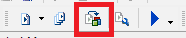

- На панелі інструментів натисніть іконку *Import* *Runtime* *files*

 В результаті, створений нами користувач 'Директор' з’явиться в середовищі розробки проекту.

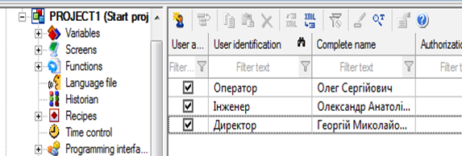

Самостійно промоделюйте виконання адміністратором блокування в онлайн режимі користувача 'Оператор'.

Докладніше про систему адміністрування можна познайомитись в мануалі User administration.

<iframe width="640" height="360" src="https://www.youtube.com/embed/tSVKmAh0WRQ" title="YouTube video player" frameborder="0" allow="accelerometer; autoplay; clipboard-write; encrypted-media; gyroscope; picture-in-picture" allowfullscreen></iframe>

### Блокування

Існують задачі, коли з точки зору безпеки чи згідно з технологією необхідно  заблокувати ті чи інші елементи екрану, щоб оператор не міг ними  керувати. Інколи цю задачу реалізують на контролері, але з zenon таке  блокування можна створити безпосередньо в проекті візуалізації  використовуючи стандартну функціональність.

Для нашого тестового проекту ми реалізуємо  наступне блокування: якщо змінна вологості повітря в приміщенні має  значення більше за 75 %, то кнопка пуску першого танку буде недоступна  для керування - заблокована.

**Означення блокування**

***\**\*Завдання 8.12: Створіть умови блокування для змінної.\*\**\***

- В менеджері проекту активуйте пункт *Interlockings* і через праву кнопку мишки виберіть пункт *New* *interlocking*

У вікні детального перегляду з’явиться новий пункт – *Interlocking* *1* з елементами визначення умови блокування та змінної блокування*.*

*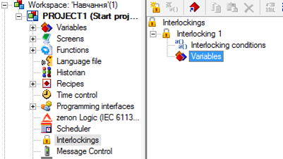*

- На елементі *Variables* натисніть правою кнопкою миші і виберіть *Add* *variable**…*

В діалоговому вікні, що з’явилось, необхідно  вибрати змінну. Оскільки змінної вологості в нас ще немає, ми можемо її  створити одразу з цього вікна.

- В верхній частині виберіть піктограму *Variable* *new**…* і створіть змінну 'Вологість' на базі драйверу VIPA 300 з типом даних INT

- На елементі *Interlocking* *conditions* натисніть правою кнопкою миші і виберіть *New* *interlocking* *condition*

*При необхідності в проекті можна визначити  одночасно декілька умов блокувань по яким система буде проводити  перевірку.Визначені тут умови можуть стосуватись декількох змінних.* 

- У властивостях пункту *Condition* *01* в полі *Logical* *link**:* клікніть на полі визначення формули

З’явиться діалогове вікно формули прорахунку блокування.

- Виберіть пункт *Val**u**e* і сформуйте арифметичний вираз X01.Value > 75

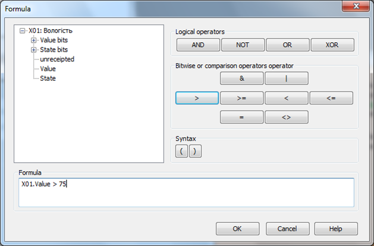

- Після натиснення кнопки *OK* створення блокування буде завершеним

<iframe width="640" height="360" src="https://www.youtube.com/embed/wfkaGZunChc" title="YouTube video player" frameborder="0" allow="accelerometer; autoplay; clipboard-write; encrypted-media; gyroscope; picture-in-picture" allowfullscreen></iframe>

**Прив’язка до елементу**

***\**\*\*\*Завдання 8.13: Прив'яжіть блокування до елементу та перевірте роботу.\*\*\*\*\****

- На екрані 'Процес' виберіть кнопку 'Пуск' першого танку і у вікні властивостей для розділу *Authorization* *->* *Interlocking* виберіть створене нами блокування 'Interlocking 1'

Оскільки система порівнює “сирі” значення змінної PLC зі встановленою нами величиною блокування в формулі, то необхідно, щоб  діапазони значень змінної співпадали з реальним діапазоном вологості.

- Зайдіть у властивості змінної 'Вологість' *Value* *calculation* *->* *Value* *range* *PLC* і встановіть його в діапазон 0 – 100
- Такий же діапазон встановіть для поля *Value* *adjustment* *linear*

Давайте зробимо так, щоб оператор візуально бачив коли кнопка стає заблокованою.

- Зайдіть в розділ властивостей проекту *Graphical* *design* *->* *Locked**/**Interlocked* *elements* і активуйте бокс *Graphical* *identification* *active*

Стан блокування відображається значком замка у  верхньому лівому куті символу. Сюди можна назначить будь-яку картинку з  бібліотеки файлів проекту. Також, заблокований елемент можна зробити  невидимим чи сірим.

Для симулювання зміни значення створеної нами  змінної 'Вологість' розмістіть в верхній частині екрану елемент  універсальний повзунок, аналогічний до того, що ми на початку створили  для керування змінної температури.

Запустіть проект і перевірте роботу блокування.  Якщо Ви зробили все вірно, то при перетягуванні повзунка вище значення  75 кнопка 'Пуск' автоматично заблокується. При поверненні значення нижче 75 блокування повинне знятись.

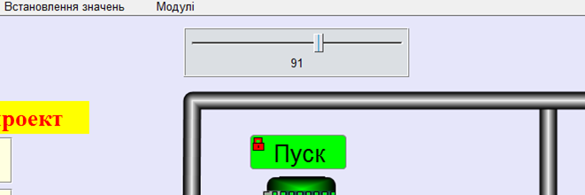

Промоделюйте різні варіанти спрацювання цього блокування.

Докладніше про блокування можна прочитати в мануалі Interlockings.

<iframe width="640" height="360" src="https://www.youtube.com/embed/mn21nrvIJIc" title="YouTube video player" frameborder="0" allow="accelerometer; autoplay; clipboard-write; encrypted-media; gyroscope; picture-in-picture" allowfullscreen></iframe>

