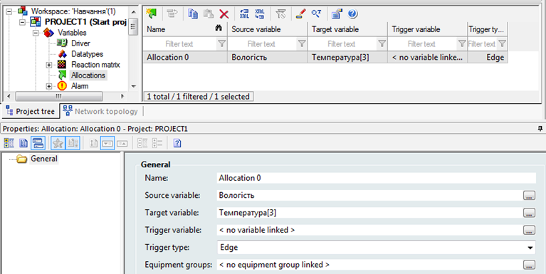
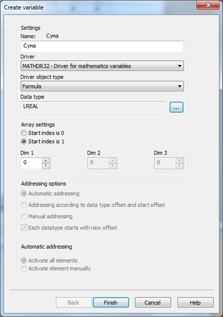
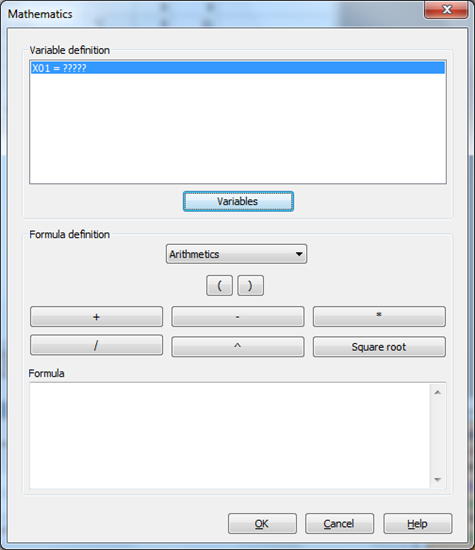
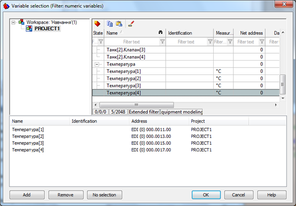
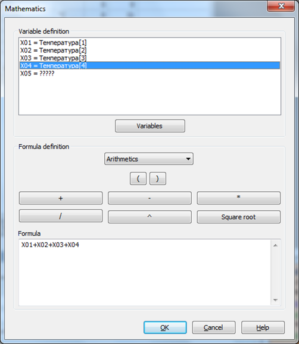
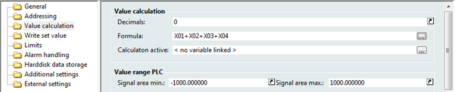
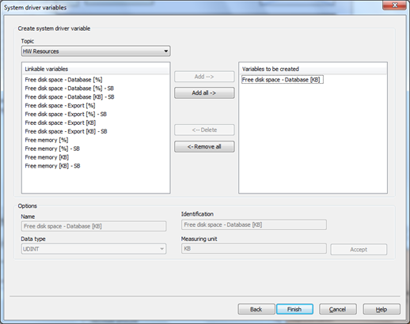
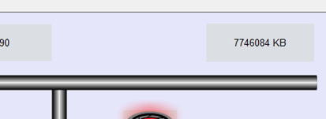
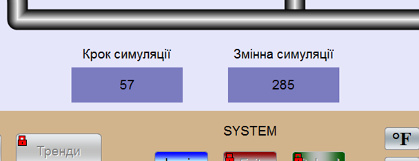
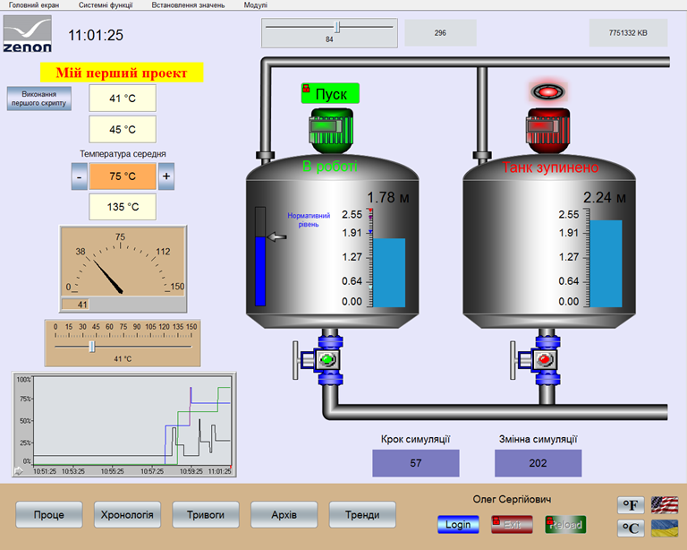

## zenon ЛР9: Перозпоідлення, математичний, системний та імітаційний драйвер

### Перерозподілення

Перерозподілення – це стандартний функціонал системи, який дозволяє передавати поточне  значення однієї змінної до іншої, будь то драйверна змінна чи внутрішня.

При створенні перерозподілення визначають поняття  вихідної змінної, яка являється джерелом значення, та кінцевої змінної,  яка приймає відповідне значення.

***Завдання 10.1: Створіть перерозподілення для змінної "Вологість" яка буде передавати своє значення змінній 'Температура[3]'***

Давайте створимо перерозподілення для змінної 'Вологість', яка буде передавати своє значення змінній 'Температура[3]'.

- В менеджері проекту активуйте пункт *Variables* *->* *Allocations* і через праву кнопку мишки виберіть пункт *New* *allocation*
- *У вікні властивостей створеного перерозподілення для поля \*Source variable:\* виберіть початкову змінну 'Вологість', і для поля \*Target variable:\* виберіть кінцеву змінну 'Температура[3]'*

Більше жодних налаштувань робити не потрібно.

*При потребі, пере розподіленням можна керувати в онлайн режимі, використовуючи тригерну змінну. Коли ця змінна має  значення '1' – перерозподілення активне, коли '0' – неактивне.*

Запустіть проект і перевірте роботу  перерозподілення. Зверніть увагу на те, що змінна температури керується  індивідуально, а при зміні значення вологості, воно автоматично  передається до температурної змінної, тобто спрацьовує перерозподілення.

Докладніше про перерозподілення можна прочитати в мануалі Allocations.

<iframe width="640" height="360" src="https://www.youtube.com/embed/zS7zSxceyKE" title="YouTube video player" frameborder="0" allow="accelerometer; autoplay; clipboard-write; encrypted-media; gyroscope; picture-in-picture" allowfullscreen></iframe>

### Математичний драйвер

zenon дозволяє виконати будь-яку математичну обробку виміряного значення.  Наприклад, провести арифметичні дії з даними, обрахувати середнє чи  мінімальне значення за певний проміжок часу, напрацювання машино-годин,  виконати порівняння чи логічну операцію. Для цього існує математичний  драйвер, який вбудовано в систему.

За замовчуванням цей драйвер вже створено в проекті системою. Нам залишається лише використати його.

***Завдання 10.2: Створіть змінну для сумарного значення усіх температур***

Для нашого проекту ми створимо змінну, яка буде представляти собою сумарне значення усіх температур.

- Створіть нову змінну 'Сума' і в якості драйвера зі  спадного меню виберіть математичний драйвер - MATHDR32 та об’єктний тип - Formula

**

- Зайдіть у властивості створеної змінної *Value* *calculation* *->* *Formula*

Автоматично з’явиться діалогове вікно запису формули:

- Натисніть на кнопку *Variables*  та додайте усі температурні змінні

- Натисніть на кнопку *OK* і перейдіть безпосередньо до написання формули

Додаючи покроково змінні одна до одної, повинна сформуватись наступна формула:

Після натиснення кнопки *OK* у вікні властивостей змінної 'Сума' з’явиться запис даної формули:

- На екрані 'Процес' в верхній його частині створіть  елемент відображення цифрового значення і прив’яжіть до нього створену  нами математичну змінну

Запустіть  проект і просимулюйте зміну значень температури. При цьому зверніть  увагу на те, як змінюється значення математичної змінної. Простим  додаванням значень переконайтесь, що Ви все зробили вірно.

### Системний драйвер

Для відображення в проекті будь-якої системної інформації в zenon  інтегровано спеціальний системний драйвер. За його допомогою можна  наприклад, відобразити інформацію стосовно вільного місця на жорсткому  диску ПК, шлях до проектних директорій, мережевий стан клієнтських  станцій, поточного авторизованого користувача та багато інших корисних  даних.

***Завдання 10.3: Створіть системну змінну для відображення об'єму вільного місця на диску.*** 

При розгляді теми авторизації ми вже мали досвід по створенню  системної змінної. Тепер давайте створимо змінну, яка буде відображати  об’єм вільного місця на жорсткому диску.

- Створіть нову змінну і в якості драйвера зі спадного меню виберіть системний драйвер – SYSDRV

На наступному кроці з’явиться діалогове вікно з повним набором доступних користувачу системних змінних

- Зі спадного меню *Topic* виберіть розділ *HW* *Resources* і кнопкою *Add* додайте змінну *Free disk space – Database [KB]*

**

- Натиснувши кнопку *Finish* закінчіть створення змінної

Нам залишається лише розмістити елемент цифрового  покажчика в верхньому правому куті екрану процесу і прив’язати до нього  створену змінну.

Фрагмент екрану проекту тепер має такий вигляд:

### Імітаційний драйвер

Реалізація імітації (симуляції) зміни значень змінних в zenon може відбуватись  трьома способами: шляхом переведення драйверу в стан  Simulation-counting, шляхом написання симуляції на мовах IEC в zenon  Logic та за допомогою стимуляційного драйверу.

Симуляційна змінна залежно від обраного режиму може збільшувати чи  зменшувати своє значення з чітко заданим кроком. Крок, режим, та межі –  це також симуляційні змінні.

Для реалізації симуляції створюють змінні з наступними параметрами:

|                  |                                                              |
| ---------------- | ------------------------------------------------------------ |
| Режим            | Driver object type: PLC marker; Data type: UINT; Offset: 0 Signal resolution: 0..3; measuring range: 0..3: 0 - симуляцію зупинено 1 - покрокове збільшення значення 2 - покрокове зменшення значення 3 - циклічне збільшення та зменшення значення значення за замовчуванням: 1 |
| Верхній ліміт    | Driver object type: PLC marker; Data type: UINT; Offset: 1 значення за замовчуванням: 1000 |
| Нижній ліміт     | Driver object type: PLC marker; Data type: UINT; Offset: 2 значення за замовчуванням: 0 |
| Крок симуляції   | Driver object type: PLC marker; Data type: UINT; Offset: 3 значення за замовчуванням: 10 |
| Змінна симуляції | Driver object type: PLC marker; Data type: UINT; Offset: 4 - 1023 |

 

***Завдання 10.4: Створіть змінну симуляції та змінну установки кроку симуляції і використайте їх в проекті.*** 

Використовуючи зазначені вище дані, ми створимо змінну симуляції та змінну установки кроку симуляції.

- В менеджері проекту зайдіть в розділ *Variables* *->* *Driver* і з папки *zenon* *system* *driver* виберіть драйвер *Driver* *for* *simulator* *variables* *(**SIMUL**32)*
- На базі цього драйверу створіть нову змінну 'Крок симуляції' і задайте усі параметри, як показано в таблиці вище
- У властивостях *Value* *calculation* встановіть діапазон значень для цієї змінної 0 – 100
- Аналогічним чином створіть змінну 'Змінна симуляції'

Таблиця змінних проекту тепер має наступний вигляд:

- В нижній частині екрану процесу розмістіть два елементи цифрових покажчиків і прив’яжіть до них створені нами симуляційні змінні
- Проконтролюйте, щоб для елементу зі змінною 'Крок симуляції' у властивостях *Write* *set* *value* було активовано бокс *Setting* *values* *active*

Таким чином, оператор зможе в онлайн режимі змінювати крок симуляції.

- Біля елементів цифрових покажчиків розмістіть відповідні підписи для орієнтації призначення цих змінних.

Запустіть проект і перевірте зроблену роботу. При  запуску змінна кроку симуляції буде одразу мати значення '10', оскільки  це значення за замовчуванням. Змініть його в допустимому діапазоні і  проконтролюйте як змінюється змінна симуляції.

Самостійно створіть та перевірте роботу симуляційних змінних встановлення режиму симуляції та діапазону.

Після виконання усіх операцій, описаних в даних навчальних матеріалах, Ваш екран процесу повинен мати такий вигляд:

Докладніше про використання математичного драйверу можна прочитати в технічній документації MATHDR32.

Більше інформації про симуляційний драйвер можна знайти в технічній документації SIMUL32.

