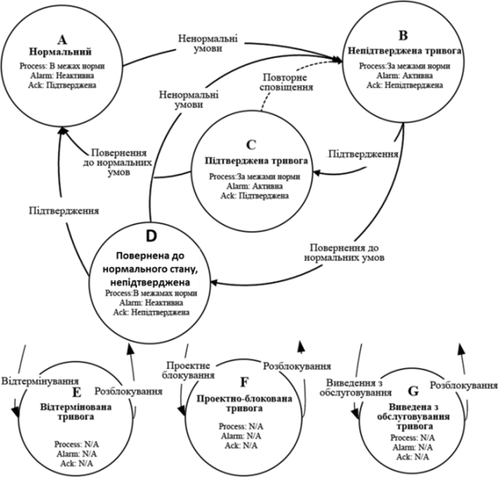

[Людино-машинні інтерфейси](https://pupenasan.github.io/hmi/)  Автор і лектор: Олександр Пупена доц. кафедри [АКСТУ НУХТ](http://www.iasu-nuft.pp.ua/) 

# Лекція 10. Загальні принципи розроблення підсистеми тривог та подій

## 10.1. Підсистеми тривожної сигналізації 

Функції тривожної сигналізації є одними з найважливіших у системах SCADA/HMI, тому входять до комплектності усіх засобів цього типу і нерідко є виділеною підсистемою. Добре пророблені функції запобігають аварійним ситуаціям і можуть не тільки зменшити збитки, а й зберегти життя людей і довкілля. З іншого боку, якщо підсистема або окремі її функції погано реалізовані, то це може звести нанівець усю її роботу. Останнє, на жаль, часто спостерігається на вітчизняних підприємствах, де до розроблення функцій тривожної сигналізації ставляться легковажно. Наступний приклад може здатися багатьом дуже знайомим. 

Класичним способом контролю роботи двигунів є використання в якості зворотного зв’язку додаткових контактів, які замикаються при спрацюванні пускачів. Таким чином система тривожної сигналізації відслідковує сигнал керування та зворотний зв'язок по функції логічного AND з урахуванням затримки часу. На одному з об’єктів, при впроваджені системи АСУТП, замовник узяв на себе частину робіт щодо забезпечення керування та контролю спрацювання двигунів на насосах та інших механізмах, у тому числі роботи з прокладання кабельних проводок та підключення. У результаті виявилося, що на момент пуско-налагоджувальних робіт замовник не виконав цієї частини роботи. Це призвело до великої кількості тривог, які пов’язані з двигунами. Враховуючи, що ці тривоги займали велику кількість повідомлень у журналі, інші тривоги були невидимими й ігнорувалися оператором. Зрештою оператор взагалі не сприймав тривожну сигналізацію, оскільки вона постійно видавала повідомлення. У наведеному прикладі, здавалось би, винуватий замовник, але це не зовсім так. Система керування повинна передбачати механізми відключення (блокування) таких тривог. 

Це тільки один з прикладів недостатньо продуманої підсистеми тривожної сигналізації, однак таких випадків дуже багато. У дослідженнях організації "Управління з охорони праці Великобританії" (HSE) наведено багато прикладів, коли недостатньо продумана система тривожної сигналізації призводила до фатальних наслідків, які супроводжувалися забрудненням довкілля, нанесенням шкоди здоров'ю і, навіть смертю великої кількості людей. Одна з причин – відсутність на той час затверджених в стандартах кращих практик, інша – недотримання існуючих.

У цивілізованому світі до проблеми розроблення ефективної тривожної сигналізації ставляться дуже відповідально, про що свідчить поява стандартів та ряд практичних рекомендацій. Зокрема, щоб спеціалісти, які задіяні в процесі розроблення системи тривожної сигналізації змогли проектувати і розроблювати ефективні АСУТП, в одному з комітетів ISA (International Society of Automation) розроблено стандарт ISA-18.2 "Організація функціонування систем тривожної сигналізації в переробних галузях промисловості" ("Management of Alarm Systems for the Process Industries"). Цей стандарт надає методологію, застосування якої приведе до поліпшення безпеки, якості та функціонування переробних галузей промисловості. Стандарт ISA-18.2 включає практики, викладені в інших стандартах і практичних рекомендаціях. У 2014 році було прийнято стандарт IEC 62682, який є аналогом ISA-18.2.  

Згідно зі стандартом ISA-18.2  ***тривога* (**з англ. ***alarm*),** – це звукові та/або візуальні засоби індикації для оператора про несправність устаткування, відхилення від процесу, ненормальні умови, які потребують своєчасного реагування. Слід сказати, що в зарубіжних та вітчизняних стандартах є інші означення тривоги, зокрема в ДСТУ 3960-2000 та ДСТУ EN 50136-1-1-2014, які дещо відрізняються. Згідно зі стандартом ISA-18.2, сукупність апаратного і програмного забезпечення, яке виявляє стан тривоги, повідомляє про це операторові і записує в журнал зміни стану, називається ***системою тривожної сигналізації*** (**alarm system)**. При цьому наголошується, що оператор є частиною цієї системи. 

Ефективність систем (або підсистем) тривожної сигналізації та інших підсистем з аналогічними функціями, ґрунтується на правильному налаштуванні тривоги. Від цього залежить своєчасне реагування на тривогу та усвідомлення наступних дій, які має провести оператор. Для кращого розуміння правильного налаштування тривог варто розглянути їх через взаємодію оператора з процесом. 

Розробники АСКТП нерідко забувають, що система тривожної сигналізації розроблена саме для оператора, який у даному контурі посідає головне місце. Саме його реакція і дії визначають досягнення цілей функціонування тривог. Система тривожної сигналізації лише допомагає операторові виявити тривогу та надати йому інструменти для швидкого орієнтування в ситуації. Дії щодо виправлення нештатної ситуації він повинен сформувати і провести самостійно. Тому в стандарті ISA-18.2 велику увагу приділяють опису моделі контуру тривоги через взаємодію оператора з процесом (рис. 10.1). 

 

*Рис. 10.1.* Модель контуру тривоги через взаємодію оператора з процесом

Тривога потрібна для усунення оператором або іншою уповноваженою особою нештатної ситуації в тому випадку, коли алгоритми автоматичного керування не передбачають цього. Наприклад, якщо зміна в процесі істотно відхиляється від бажаного стану, а система керування не може це виправити, оператор повинен вжити певних заходів, щоб повернути процес до норми. Якщо устатковання або система керування має несправність, то обслуговуючий персонал повинен вчасно зробити дії щодо її усунення. Будь-яка з наведених ситуацій передбачає, що оператор повинен виявити факт нештатної ситуації, діагностувати її та вжити відповідних дій:  

1) **виявлення** (detect): оператор дізнається про відхилення від бажаного стану або несправності устатковання за допомогою відповідного сигналу тривоги. Структура системи тривожної сигналізації та інтерфейс оператора повинні сприяти виявленню відхилень; 

2) **діагностування** (diagnose): у відповідь на відхилення оператор використовує свої знання та навички для інтерпретації інформації, діагностування ситуації та визначення необхідних коригувальних дій. Діагностувати ситуацію операторові допомагають процедури реагування на тривогу;

3) **реагування** (respond): вживаються коригувальні дії для компенсації збурення. У відповідь на відхилення оператор (або інша уповноважена особа) приймає коригувальні дії і контролює процес, щоб визначити, чи було виправлене це відхилення.

Кожен із цих етапів дуже важливий і потребує окремої уваги на всіх стадіях життєвого циклу системи. Крім того, треба врахувати, що людина в цьому контурі є найбільш непередбачуваною ланкою. На здатність оператора виконувати свої функції впливає багато факторів, у тому числі:

- навантаження;

- ергономіка операторської консолі;

- обмеження пам'яті;

- втома;

- знання;

- мотивація.

При розробленні системи тривожної сигналізації неврахування якогось із наведених факторів може призвести до проблем. Зокрема, кількість активних тривог та частота зміни їх стану можуть стати причиною неефективності роботи системи тривожної сигналізації. Згідно зі стандартом ISA-18.2, ситуація, при якій частота виникнення тривог більша, ніж оператор може їх ефективно опрацювати, називається ***переповненням тривог*** (з англ. ***alarm*** ***flood***). Прикладом переповнення тривог може бути показник частоти більший ніж 10 тривог за 10 хвилин. Для усунення цього негативного ефекту в стандарті 
 ISA-18.2 означено багато механізмів та рекомендацій щодо побудови життєвого циклу організації системи тривожної сигналізації.

Розглянемо контур тривоги в системі як взаємопов’язані функції (рис. 10.2):

- вимірювання значення даних, які необхідно контролювати з об’єкта керування;

- оброблення даних на пристрої збирання (наприклад ПЛК);

- зчитування даних із пристрою збирання та їх оброблення в базі даних реального часу (БДРЧ);

- зчитування даних з бази даних реального часу та їх оброблення в підсистемі тривожної сигналізації; 

- відображення стану та керування тривогами в підсистемі HMI;  

- записування змін стану тривоги в журнал тривог та подій. 

 

*Рис. 10.2.* Деталізована модель тривогового контуру 

На рис. 10.2 підсистема тривожної сигналізації включає в себе тег ALRM, однак це є умовним позначенням, і наявність такого типу тегів залежить від реалізації. Також слід нагадати, що підсистема тривожної сигналізації (позначена як ALARM) може бути реалізована як у вигляді окремого сервера (навіть на окремому ПК), так і не існувати як підсистема, натомість її функції реалізовуватимуть в інших частинах SCADA/HMI.  

Перелічені вище функції формують ланцюжок, який будемо називати ***тривоговим контуром***. Як видно з рис. 10.2, швидкість виявлення спрацювання тривоги залежить від каналу вимірювання, швидкості опитування ПЛК та взаємодії між підсистемами. Діагностуванню в технічному плані можуть допомогти підсистема HMI та додаткові підсистеми. Реагування оператора може проводитись як через підсистеми SCADA, так і безпосередньо через ручні засоби керування (на рис. 10.2 показано бордовими лініями).

## 10.2. Автомат станів тривог

Принципово важливим для означення функцій тривог є формалізація їх автомату станів. На практиці трапляються неодноразові випадки, коли не тільки обслуговуючий персонал, а й розробники не могли чітко пояснити роботу тривог, закладену постачальниками інструментів SCADA/HMI. Іншим типовим випадком є власно придумані автомати станів, або відсутність їх (автоматів) взагалі. **Недостатньо формалізований автомат станів може призвести до неправильного його тлумачення учасниками життєвого циклу підсистеми тривожної сигналізації і може спричинити непередбачувані наслідки!** Навіть якщо в проекті буде реалізовано власний автомат станів, відмінний від стандартного, його треба обов’язково описати в документації у відповідному розділі проекту. У стандарті означення автомату станів є одним із фундаментальних механізмів, на яких ґрунтуються всі інші сутності. 

Тривога може знаходитися в кількох станах, зміни яких можуть бути викликані різними джерелами в системі керування, включаючи польовий пристрій (наприклад, датчики і виконавчі механізми), систему керування (базову чи СПАЗ) та HMI (дії оператора). У стандарті ISA-18.2 наведено діаграму автомату станів тривоги, що показана на рис. 10.3. Стани тривоги представлені на рисунку колами, в яких наводиться опис стану, що включає літерну мітку (ідентифікатор стану), назву стану, опис умови проходження процесу та комбінацію статусів:

- статус тривоги;

- статус підтвердження.

Таким чином, стан – це узагальнюючий показник, який залежить від плинного значення статусів та від попереднього стану. 
            

*Рис. 10.3.* Автомат станів тривог згідно з ISA-18.2

У нижній частині діаграми показано можливі стани блокованих тривог (alarm suppression). Стрілки на рис. 10.3 відповідають переходам між станами. Діаграма не показує безпосередньо вплив зон нечутливостей чи затримок на спрацювання, які включені в оцінку статусу тривоги (тобто активної або неактивної). Більшість із них є очевидними, тому при описі станів прокоментуємо тільки деякі з них. ***Нормальний стан*** (A – Normal, NORM) означується як стан, в якому процес працює в межах нормальних характеристик, статус тривоги не є активним і попередні виникнення тривоги були підтверджені. Стан ***непідтвердженої*** тривоги (B – Unacknowledged state, UNACK) є початковим станом тривоги, що стає активною внаслідок ненормальних умов і є не підтвердженою оператором. Стан ***підтвердженої*** тривоги (C – Acknowledged state, ACKED) – це стан, в якому статус тривоги є активною і оператор її підтвердив. ***Повернена до нормального стану, непідтверджена*** тривога (D – Return to normal unacknowledged state, RTNUN) – це стан, в якому процес вже знаходиться в межах норми, але попередній активний стан тривоги не був підтверджений оператором. 

У стандарті наведений типовий автомат станів, який реалізований у більшості відомих засобів SCADA/HMI. Деякі з інструментальних засобів передбачають два автомати станів: стандартний і без наявності статусу підтвердження.   

Окрім наведених "класичних" станів, стандарт передбачає можливість блокувати тривоги, що повинно убезпечити систему тривожної сигналізації від ефекту переповнення тривог (alarm flood), про який уже згадувалося. Це стани тривоги: відтермінована (Shelved), проектно-блокована (Suppressed-by-design) та виведена з обслуговування (Out-of-service). На цих станах варто зупинитися детальніше, оскільки далеко не всім розробникам АСКТП вони відомі.

Стан ***відтермінованої тривоги*** (E – Shelved state, SHLVD) – це стан, в якому тривога тимчасово блокується оператором, тобто для неї не проводиться оповіщення. Перехід до відтермінованої (будь-який стан → E) відбувається тоді, коли оператор командою з HMI відтерміновує сигнал тривоги, щоб уникнути її появи на дисплеях активних тривог. Відтермінування – ручна операція, а от розблокування (unshelve) може відбуватися як автоматично (після заданого часу), так і вручну оператором. Якщо статус тривоги в цей час активний, перехід повинен здійснюватися до стану непідтвердженої тривоги, а якщо не активна – до нормального стану. Таким чином, функція відтермінування передбачає, що оператор задає час, протягом якого тривога буде заблокована. Система тривожної сигналізації повинна забезпечувати виконання таких функцій:

- можливість відтермінувати тривогу;

- відображення на дисплеях відтермінованих тривог або еквівалентних до них списків;

- задавання часу для відтермінування;

- контроль доступу до відтермінування індивідуальних тривог;

- можливість розблокування тривоги;

- формування в журналах записів про відтермінування.

Стан ***проектно-блокованої тривоги*** (F – Suppressed-by-design, DSUPR) – це стан, в якому тривога блокується з причини певних умов експлуатації або стану установки, і для неї не потрібно проводити оповіщення. Тривога в цьому стані перебуває під контролем логіки, що означує актуальність тривоги. Перехід до стану проектно-блокованої тривоги (будь-який стан → F) відбувається тоді, коли виникли певні умови або стан процесу, які означені в проекті для блокування тривоги. Означене проектом блокування зазвичай є автоматичною операцією. Перехід від проектно-блокованої тривоги до нормального стану або стану непідтвердженої тривоги (F → A або B) відбувається тоді, коли виникли умови або змінився стан технологічного процесу, що означений для розблокування тривоги. Це зазвичай відбувається автоматично. 

Щодо проектно-блокованих тривог система тривожної сигналізації повинна забезпечувати виконання таких функцій:

- відображення проектно-блокованих тривог;

- формування записів в журнал для кожної проектно-блокованої тривоги.

Стан ***виведеної з обслуговування тривоги*** (G – Out-of-service state, OOSRV) – це стан, в якому тривога блокується вручну оператором, як правило, при проведенні технічного обслуговування, і тому в цьому стані не потрібно проводити оповіщення. Тривога в цьому стані перебуває під контролем технічного обслуговування. Виведена з обслуговування тривога – це не те саме, що виведення з обслуговування устатковання або його частини. Устатковання може бути виведене з обслуговування, тоді як відповідні тривоги – ні. Перехід до цього стану (будь-який стан → G) відбувається тоді, коли тривога блокується з метою технічного обслуговування устатковання або з інших причин. Як правило, виведення з обслуговування – це ручна операція. Перехід від стану виведеної з обслуговування тривоги до нормального стану або непідтвердженої тривоги (G → A або B) відбувається, як правило, також вручну, після закінчення обслуговування. 

Для виведених з обслуговування тривог система повинна виконувати функції:  

- індивідуальне повернення кожної тривоги до обслуговування;

- відображення списку на дисплеї зведення виведених з обслуговування тривог або еквівалентного до нього;

- контроль доступу до виведення тривог з обслуговування;

- ведення записування виведення кожної тривоги з обслуговування.

На відміну від класичного автомату станів, механізм блокування не завжди передбачається розробником, що приводить до наслідків, описаних на початку розділу. Не дивлячись на те, що сучасні SCADA/HMI включають ці функції (або принаймні певні з них), їх часто ігнорують розробники АСКТП. 

Слід звернути увагу на те, що назви станів можуть не збігатися у різних інструментальних засобах SCADA/HMI. Очевидно, це пов’язано з тим, що стандарт вийшов порівняно недавно.  

Для узагальнення розуміння автомату станів у стандарті наводиться таблиця станів (табл. 10.1).   

*Таблиця 10.1.* Стани тривоги

| ID   | Ско­рочено | Назва стану                                             | Стан техноло­гічного  процесу | Статус тривоги         | Статус оповіщення | Статус підтвердження |
| ---- | ---------- | ------------------------------------------------------- | ----------------------------- | ---------------------- | ----------------- | -------------------- |
| A    | NORM       | Нормальний                                              | В межах норми                 | Неактивна              | Немає оповіщення  | Підтверджена         |
| B    | UNACK      | Непідтверджена тривога                                  | За  межами норми              | Активна                | Оповіщується      | Непідтверджена       |
| C    | ACKED      | Підтверджена тривога                                    | За  межами норми              | Активна                | Оповіщується      | Підтверджена         |
| D    | RTNUN      | Повернена до  нормального стану непідтвердженої тривога | В межах норми                 | Неактивна              | Оповіщується      | Непідтверджена       |
| E    | SHLVD      | Відтермінована тривога                                  | В межах або за межами  норми  | Неактивна або активна  | Заблоковане       | -                    |
| F    | DSUPR      | Проектно-блокована  тривога                             | В межах або за межами  норми  | Неактивна або активна  | Заблоковане       | -                    |
| G    | OOSRV      | Виведена з обслуговування тривога                       | В межах або  за межами норми  | Неактивна  або активна | Заблоковане       | -                    |

## 10.3. Приклад діаграми поведінки тривоги в часі 

Означення автомату станів – це тільки перший крок для створення вдалої системи тривожної сигналізації. Для правильного налаштування тривог треба розуміти послідовність проходження в тривоговому контурі  етапів у часі. Не слід забувати, що завдання системи тривожної сигналізації – це ***своєчасно*** поінформувати оператора про відхилення, допомогти йому усвідомити причину такого відхилення і максимально допомогти в прийнятті рішення. Якщо оператор не встигне зробити необхідні дії через недостатню усвідомленість, несвоєчасне прийняття дій або з інших причин, то об’єкт може перейти в аварійно небезпечний стан. Для того, щоб краще зорієнтуватися у виборі налаштувань для тривог, у стандарті наводиться приклад діаграми поведінки тривоги в часі (рис. 10.4). На рисунку показано вимірювану технологічну змінну, яка зростає від нормального стану до ненормального (тривожного) за двох можливих сценаріїв, що залежать від того, чи вживає оператор коригувальні дії. 

 

*Рис. 10.4.* Діаграма поведінки тривоги в часі

Розглянемо поведінку через діаграму на рис. 10.3 детальніше. Нормальний стан (A) означується як стан, в якому технологічний процес працює в межах звичайних характеристик. Коли вимірювальне значення перетинає ***уставку тривоги*** (alarm setpoint), вона переходить до стану непідтвердженої (B). Існує кілька факторів, що впливають на оповіщення про тривогу, які не показані на діаграмі, наприклад:

- точність вимірювання (measurement accuracy);

- часовий інтервал вибірки (sampling interval) – періодичність, із якою система тривожної сигналізації отримує вимірювальні значення;

- ***затримка на включення тривоги*** (alarm on-delay) – заданий час, який повинен минути після перевищення уставки тривоги, перш ніж тривога стане активною. 

Сигнал не відразу підтверджується оператором, проходить певний час (затримка до підтвердження, acknowledge delay), після якого оператор підтверджує тривогу, і вона переходить до стану підтвердженої тривоги (C). Оператор може вжити заходів як до підтвердження тривоги, так і після цього. Протягом цього часу тривога знаходиться в активному стані. Фактичний час реагування (з actual response time) для сигналу тривоги – це максимальний час, що проходить між оповіщенням про тривогу і моментом, коли оператор повинен вжити заходів для уникнення наслідків. Фактичний час реагування включає в себе виявлення сигналу тривоги, діагностування ситуації та визначення оператором коригувальних дій, а також виконання цих дій. Верхня межа часу відгуку – допустимий час реагування (allowable response time) – це максимальний час, що проходить між оповіщенням і моментом, коли оператор повинен вжити заходів для уникнення наслідків. Якщо дія не буде виконана за цей час, то наслідки будуть негативними. На рис. затримка реагування оператора (operation response delay) відображається в межах допустимого часу. Існує кілька факторів, які впливають на час реагування оператора (operator response time):

- швидкість оброблення системи тривожної сигналізації;

- конструкція та чіткість засобів HMI;

- обізнаність та підготовка оператора;

- навантаження на оператора;

- складність визначення оператором необхідної дії;

- складність виконання дії операторові.

Результатом правильної дії оператора в межах допустимого часу реагування повинно бути повернення до нормального стану (D). Поріг наслідків (consequence threshold) є значенням змінної процесу, при якому починається виникнення наслідків. Це може відбутися тоді, коли оператор не виконує жодних дій, вживається неправильна або недостатня дія або дія не завершується протягом допустимого часу відповіді. Вплив ***зони нечутливості тривоги*** (alarm deadband) показаний на рис. 10.3 через затримку нечутливості (deadband delay). На рисунку видно, що після перетину уставки тривога повертається до нормального стану не відразу, а лише через певний час. Існує кілька факторів, які впливають на час повернення до нормального стану:

- затримка реагування оператора (operator response delay);

- ступінь вжиття коригувальних дій (degree of corrective action taken);

- час запізнення процесу (process deadtime) у відповідь на коригувальну дію;

- час реагування процесу (process response time) на коригувальну дію;

- точність вимірювання змінної процесу;

- зону нечутливості (deadband) уставки тривоги (alarm setpoint);

- швидкість функціонування системи тривожної сигналізації.

Наведена на рис. 10.4 діаграма дає змогу на всіх етапах життєвого циклу ґрунтовно підійти до вибору правильних налаштувань. Навіть усвідомлення процесів такого вибору без формального їх виконання допомагає розробникові при створенні підсистем тривожної сигналізації.   

## 10.4. Типи, групування та класифікація тривог

При означенні тривог у проекті необхідно чітко знати, з яких причин вони можуть виникати. Враховуючи, що типи умов бувають різними, в стандарті ISA-18.2 означене поняття ***тип тривоги*** (alarm type) – атрибут, який вказує на умову спрацювання тривоги. У табл.10.1 наведено типи тривог, які означені в стандарті ISA-18.2. 

*Таблиця 10.1.* Типи тривог

| Назва українська                  | Назва англійська            | Умова спрацювання                                            |
| --------------------------------- | --------------------------- | ------------------------------------------------------------ |
| абсолютна  тривога                | absolute alarm              | вихід  за уставку тривоги; наприклад, дуже високе, високе, низьке, дуже низьке  значення |
| тривога  відхилення               | deviation alarm             | різниця  між двома значеннями перевищує уставку тривоги; наприклад, відхилення  сигналів вимірювань між первинними та резервними приладами або відхилення між  дійсним та заданими значеннями змінної процесу |
| тривога  швидкості зміни змінної  | rate-of-change alarm        | швидкість  зміни змінної процесу (dPV/dt) перевищує уставку  |
| тривога  невідповідності          | discrepancy alarm           | очікуваний  стан установки або пристрою та його фактичний стан відрізняються; наприклад,  після команди на двигун немає зворотного сигналу про те, що він запустився |
| обчислювальна  тривога            | calculated alarm            | генерується  за розрахунковим значенням, а не за прямим вимірюванням процесу |
| керована  рецептом тривога        | recipe-driven alarm         | вихід  за уставку, що змінюється системою залежно від рецепту, який у даний час  виконується |
| тривога  по бітовому шаблону      | bit-pattern alarm           | шаблон  цифрових сигналів (комбінація кількох бітів) відповідає встановленому |
| тривога  по виходу регулятора     | controller-output alarm     | вихід  за уставку вихідного сигналу алгоритму керування (наприклад, ПІД-регулятору);  на противагу абсолютній тривозі використовується не прямий вимірювальний  сигнал процесу, а вихід  регулятора |
| системно-діагностична  тривога    | system diagnostic alarm     | несправність  у системі апаратного чи програмного забезпечення або компонентів; генерується  системою керування, а не  застосунком; наприклад, комунікаційна помилка |
| тривога  діагностування приладу   | instrument diagnostic alarm | несправність  польового пристрою або його сигналу; наприклад, тривога виходу сигналу за  межі |
| налаштовувана  оператором тривога | adjustable alarm            | вихід  за уставку, яка може бути змінена вручну оператором   |
| адаптивна  тривога                | adaptive alarm              | вихід  за уставку, яка змінюється алгоритмом; наприклад, уставка розраховується на  основі швидкості вироблення продукції |
| повторно  сигналізована тривога   | re-alarming alarm           | після  спрацювання тривоги виникають нові умови для повторного оповіщення |
| статистична  тривога              | statistical alarm           | результат  статистичного оброблення технологічної змінної чи змінних не задовольняє вказаному в умові  тривоги |
| першопричинна  тривога            | first-out alarm             | спрацювання  умови раніше, ніж в інших з вказаної послідовності; наприклад, при вимкненні  кількох одиниць устатковання в короткий проміжок часу одне з них, яке  вимкнулося раніше, буде причиною |
| тривога  помилки вимірювання      | bad-measurement alarm       | сигнал  вимірювальної величини перебуває за межами очікуваного діапазону (наприклад,  3,8 мА для сигналу від 4 до 20 мА) |

Кожен тип потребує окремого розгляду. Не всі з перерахованих типів тривог можуть бути доступними в SCADA/HMI. Крім того, у деяких випадках може знадобитися інший тип тривог, який не входить до переліку табл.10.1. Також дозволяється комбінувати типи.

У системі тривожної сигналізації кількість тривог може сягати сотні й тисячі. Означення таких тривог потребує опису та означення пріоритетів, дій, які необхідно зробити операторові при їх виникненні, правила адміністрування та т. ін. Проведення цих робіт окремо для кожної тривоги займає багато часу і є неефективним. Натомість у стандарті ISA-18.2 рекомендується використовувати класифікацію тривог та означення необхідних параметрів вже не для конкретної тривоги, а для всього класу. ***Клас тривог*** (alarm class) – сукупність тривог із загальними вимогами щодо організації функціонування тривог (наприклад, вимоги до тестування, підготовки, моніторингу та планової перевірки). Приклад класу – тривоги протиаварійного захисту. Одна тривога може входити до кількох класів одночасно, тобто класи можуть перекриватися. 

Крім об’єднання за класом тривог, є сенс їх групувати за ознакою приналежності до устатковання або частини процесу. ***Група тривог*** (alarm group) – набір тривог, які мають спільні взаємозв’язки з частиною технологічного процесу, установкою, набором устатковання або послугою. Використавши в журналах фільтрування тривог за назвою групи, можна спростити і прискорити аналіз причин виявлення відмов як у реальному часі, так і в пост-аналізі.

При виникненні кількох тривог операторові слід швидко визначитися з тим, яку з них необхідно опрацювати першою. Для цього в стандарті означено поняття ***пріоритет тривоги*** (alarm priority) – це відносна важливість, призначена тривозі в системі для позначення терміновості реагування на тривогу (наприклад, серйозність наслідків і допустимий час реагування). При розробленні пріоритети вибираються виходячи з того, що вищі пріоритети призначаються рідше, ніж нижчі. Більша кількість тривог мають найнижчий пріоритет (найменш важливі), а менша кількість – найвищий (найважливіші). Отримані пріоритети потрібно узгодити з наслідками і допустимим часом реагування. Таким чином, тривоги з найнижчим пріоритетом повинні мати найменш тяжкі наслідки і найбільший допустимий час реагування, а найвищого – найсерйозніші наслідки (наприклад, пожежні та сигналізації загазованості) і найменший допустимий час реагування. 

## 10.5. Атрибути тривог

Наведені вище властивості мають бути описані та зконфігуровані в системі для кожної з тривог. Ці властивості означені в стандарті як ***атрибути тривог*** (alarm attribute). Тривоги повинні містити такі атрибути:

- опис тривоги (alarm description): інформативний текст, наданий як опис тегу, або опис тривоги, або їх комбінація;

- уставку тривоги (alarm setpoint) або логічну умову (logical conditions): значення або логічна комбінація, проходження через яке спричинює виникнення тривоги;

- пріоритет тривоги (alarm priority): використовується для надання допомоги операторові у визначенні порядку реагування на тривоги;

- зону нечутливості тривоги (alarm deadband): використовується для зменшення кількості спрацювання тривог для заданого нештатного стану; запобігає поверненню сигналу тривоги до нормального стану, доки умова спрацювання тривоги не пройде через цю зону, означену значенням приросту або відсотком діапазону.

- затримку на спрацювання (on-delay) або затримку на відключення (off-delay) тривоги: використовуються для зменшення частоти спрацювання тривог; затримка на включення використовується для уникнення непотрібних спрацювань тривоги, коли сигнал короткочасно потрапляє в область значень її спрацювання; затримка на виключення, навпаки, утримує тривогу в активному стані, якщо сигнал короткочасно перейшов у зону нормального значення;   

- групу тривоги (alarm group);

- повідомлення тривоги (alarm message).

У найпростішому варіанті системи ці атрибути задаються в підсистемі тривог статично, однак у багатьох випадках їх значення повинні змінюватися оператором або програмно. Необхідність у зміні цих атрибутів може бути пов’язана з типом виготовлюваного продукту або станом технологічного процесу. Атрибути тривог зазвичай можуть бути програмно модифіковані з одного або декількох джерел:

- логіки керування (наприклад, послідовності, етапи, стано-орієнтована логіка);

- прогресивні методи керування тривогами;

- джерело, зовнішнє по відношенню до системи керування (наприклад, система керування виробничими операціями (MES/MOM), система планування ресурсів підприємства (ERP)).

Основні концепції зміни атрибутів тривог, що належить до прогресивних методик описані в підрозділі 6.9. 

## 10.6. Людино-машинний інтерфейс для систем тривожної сигналізації

 Враховуючи, що саме людина є ключовим елементом контуру тривожної сигналізації, велика увага в її організації надається людино-машинному інтерфейсу. Він повинен чітко відображати неблоковані активні тривоги із зазначенням їх станів, пріоритетів, типів та іншої додаткової інформації. Крім відображення, HMI повинен надати можливість операторові здійснювати такі дії:

- індивідуально підтвердити тривогу (квітувати);

- заглушити звукове оповіщення тривоги без дії підтвердження;

- виводити тривоги з обслуговування; 

- змінювати параметри тривог; 

- ініціювати відтермінування тривоги;

- підтримувати функцію проектно-блокованих тривог;

- відображати повідомлення тривог за запитом;

- розмежовувати доступ до функцій різним користувачам.

Для забезпечення цих функцій відображення та дій HMI має надавати певні інструментальні засоби. Стандарт передбачає підтримку, як мінімум, таких засобів HMI:

- дисплей зведення тривог (alarm summary);

- відображення тривог на дисплеях процесів (мнемосхемах);

- відображення (індикація) тривог у дисплеях деталізації тегів;

- дисплей зведення відтермінованих тривог;

- дисплей зведення проектно-блокованих тривог;

- дисплей зведення виведених з обслуговування тривог.

Наведені дисплеї містять відображення стану тривог у вигляді записів. ***Запис тривоги*** (alarm record) – це набір інформації, який документує зміну стану тривоги. Тобто зміна стану тривоги приводить до формування нового запису (в деяких зведеннях – зміни запису попереднього стану). Згідно з 
 ISA-18.2, запис тривоги повинен мати такі атрибути:

- назву тегу для тривоги;

- опис тегу або опис тривоги;

- стан тривоги;

- пріоритет тривоги;

- тип тривоги;

- час і дату зміни стану тривоги.

Окрім цього, рекомендується, щоб запис тривоги мав такі елементи:

- значення змінної процесу в момент записування тривоги;

- уставка тривоги;

- група тривоги або ділянка процесу;

- клас(и) тривоги;

- повідомлення тривоги.

Для однозначного розрізнення станів тривог на HMI A-D (див. рис. 10.3) використовуються комбінації візуальних індикаторів та/або звукових сигналів. У цьому параграфі наведено рекомендації до способів оповіщення, які часто використовуються на практиці. 

Нормальний стан не повинен використовувати звуковий сигнал. Візуальна індикація нормального стану має бути такою самою, як і індикації без тривоги. 

У стані непідтвердженої тривоги слід використовувати як звуковий сигнал, так і візуальну індикацію. Звукове оповіщення повинно відключатися командою придушення або командою підтвердження (ACK) оператора. Візуальна індикація має чітко відрізнятися від звичайного стану за допомогою кольорів і символів (наприклад, форми або тексту). Візуальна індикація для непідтвердженої тривоги повинна включати миготливий елемент. 

Стан підтвердженої тривоги не повинен використовувати звукове оповіщення. Візуальна індикація підтвердженого стану тривоги повинна чітко відрізнятися від індикації звичайного стану (не тривожного) за допомогою символів (наприклад, форми або тексту) і повинна бути пов'язана за кольором з індикацією стану непідтвердженої тривоги. Наприклад, червоний миготливий – для непідтвердженої і червоний – для підтвердженої. У візуальній індикації підтвердженої тривоги не повинен використовуватися миготливий елемент.

Стан повернутої до нормального стану, непідтвердженої тривоги не повинен використовувати звуковий сигнал. Візуальна індикація цього стану може бути такою самою, як і звичайний стан, або може вказувати на непідтверджений стан за допомогою миготливого елемента.

Стан блокованих тривог (відтермінованої, проектно-блокованої та виведеної з обслуговування) може бути показаний у HMI візуальними засобами, явно відмінним способом від інших станів. Звукову сигналізацію використовувати для блокованих тривог не дозволяється.

Рекомендації щодо звукової сигналізації та індикації залежно від станів наведено в табл.6.3. 

*Таблиця 6.3.* **Поведінка звукової сигналізації та індикації в залежності від стану тривог.**

| **Стан тривоги**                                | **Звук** | Візуальна індикація: Колір | Візуальна індикація: Символ | Візуальна індикація: Миготіння |
| ----------------------------------------------- | -------- | -------------------------- | --------------------------- | ------------------------------ |
| нормальний                                      | ні       | ні                         | ні                          | ні                             |
| непідтверджена                                  | ТАК      | ТАК                        | ТАК                         | ТАК                            |
| підтверджена                                    | ні       | ТАК                        | ТАК                         | ні                             |
| повернена до нормального  стану, непідтверджена | ні       | Комбінація                 | Опція                       |                                |
| відтермінована                                  | ні       | Опція                      | н/з                         |                                |
| проектно-блокована                              | ні       | Опція                      | н/з                         |                                |
| виведена з обслуговування                       | ні       | Опція                      | н/з                         |                                |

*Примітка:* н/з показує, що умова не застосовна або не має відношення до стану тривоги; комбінація вказує, що індикація є комбінацією візуальних кольорових і символьних індикацій; опція вказує, що індикація не є обов’язковою.  

Звукова сигналізація для непідтверджених тривог може також використовуватися для зазначення пріоритету, ділянки процесу або групи тривог залежно від означеної методології. У середовищах, де звукова сигналізація не є ефективною (наприклад, середовища з високим рівнем шуму), для непідтвердженого стану тривоги слід використовувати чітку візуальну індикацію, яка завжди знаходиться в зоні оператора.

Для виділення пріоритетних тривог у системі необхідно використовувати візуальні індикатори, звукові сигнали або їх поєднання. Усі станції HMI в системі керування, включаючи відокремлені підсистеми, повинні надавати можливість різної індикації принаймні для трьох різних пріоритетів.   

Для кожного пріоритету тривоги слід використовувати окрему кольорову індикацію, за винятком операційних середовищ, де це не є практичним. Першочергові кольори тривоги повинні бути зарезервовані і не повинні використовуватися для інших елементів HMI.

У стандарті даються рекомендації, прийняті в промисловій практиці. Зокрема, для підсилення виділення пріоритету тривоги, окрім кольорової індикації рекомендується використовувати унікальний символ, наприклад фігуру або текст, а також супроводження звуковою сигналізацією. У середовищах, де звукова сигналізація не використовується як індикатор пріоритету, слід застосовувати тільки візуальну індикацію.

Повідомлення тривоги передбачає подальше уточнення тривоги відображенням назви тегу, стану та пріоритету. Він може також включати частину дії оператора або посилання на процедуру відповіді на тривогу.

Стандартом ISA-18.2 передбачено, що у HMI може бути кілька типів дисплеїв, які можна використати для системи тривожної сигналізації. До них входять: 

- дисплей зведення тривог (alarm summary display): надає список неблокованих активних тривог;

- дисплей зведення статусу тривог (alarm summary status display):показує кількість непідтверджених активних тривог за вибраним пріоритетом для кожної ділянки процесу;

- дисплей журналу тривог (alarm log display): забезпечує доступ до записів тривог в архіві для кожної зміни стану (наприклад, підтвердження, повернення до нормального стану і т. п.);

- дисплей процесу (process display): забезпечує інформацію про тривоги через контекст елементів;

- дисплей інформації про тег (tag detail display): детальний опис тегу тривоги;

- дисплей тривог системної діагностики (system diagnostic alarm display);

- дисплей відтермінованих тривог (shelved alarm display);

- дисплей проектно-блокованих тривог (suppressed-by-design alarm display);

- дисплей виведених з обслуговування тривог(out-of-service alarm display).

## 10.7. Події

Окрім тривог, засоби SCADA/HMI мають можливість вести ***журнал подій***. ***Подія(Event)*** – це штатна зміна значення змінної або виконання команди. Події, за великим рахунком, не потребують означення автомату стану, або точніше, там є два стани: виникнення події і відсутність події. Факт виникнення події потребує фіксації в журналі або у вікні подій. 

Деякі засоби SCADA/HMI не підтримують події, що призводить до певних незручностей. Виходом із такої ситуації може стати використання тривоги. Припустимо, необхідно в такому засобі фіксувати в журналі подію включення певного двигуна. Однак тривога, за означенням, повинна підтверджуватися оператором, що в даному випадку не потрібно і може призвести до затоплення тривог. Припустимо, що система підтримує непідтверджувані тривоги, тобто ті, які мають всього два стани: є тривога і немає тривоги. З першого погляду, це дуже схоже до функціоналу підсистеми подій. Однак у журналі (тривог) будуть фіксуватися дві події, а не одна: тривога виникла і тривога зникла. Ці два записи тільки заплутують оператора при аналізі журналу тривог та подій.     

Для перегляду подій у засобах SCADA/HMI можуть бути передбачені як окремі переглядачі, так і суміщені з переглядачами тривог.  

[<-- Лекція 9. Анімовані компоненти та навігація](lec9.md)

[--> Лекція 11. Приклади розроблення тривог і подій в середовищах SCADA/HMI](lec11.md)

# Контрольні запитання 

1.    Поясніть важливість стандартів на розроблення підсистем тривожної сигналізації. 

2.    Які міжнародні стандарти є базовими для розроблення систем тривожної сигналізації?

3.    Що таке тривога? Як оператор може дізнатися про тривогу?

4.    Що таке система тривожної сигналізації відповідно до означення ISA-18.2/IEC 62682? Чому людина є частиною цієї системи?

5.    За рис. 10.1 поясніть взаємодію системи тривожної сигналізації з іншими системами.

6.    Яку роль у системі тривожної сигналізації відіграє оператор?

7.    В які етапи проходить ідентифікація нештатної ситуації та проведення коригуючих дій оператором?

8.    Які людські фактори впливають на здатність оператора виконувати свої функції? 

9.    Поясніть, що таке переповнення тривог. Наведіть приклади.

10.    Які функції формують тривоговий контур?

11.    Поясніть, що таке автомат станів тривоги. Чому важливо зосереджуватися на автоматі станів при розробленні та експлуатації систем керування?

12.    Поясніть призначення кожного стану з автомату станів тривог та умови переходів між станами.

13.    Розкажіть про призначення та поведінку тривог у станах блокування.

14.    Прокоментуйте діаграму поведінки тривоги в часі, яка показана на рис. 10.6.

15.    Яке призначення затримки на включення тривоги? Покажіть на прикладі однієї з програм SCADA/HMI, де вона задається. 

16.    Яке призначення зони нечутливості тривоги? Покажіть на прикладі однієї з програм SCADA/HMI, де вона задається.

17.    На що вказує тип тривоги? Покажіть на прикладі однієї з програм SCADA/HMI, які типи тривоги підтримуються.

18.    Назвіть кілька типів тривог та поясніть, за якими умовами вони спрацьовують.

19.    Для чого використовуються класи тривог?

20.    Для чого використовуються групи тривог? Покажіть на прикладі однієї з програм SCADA/HMI, як можна групувати тривоги.

21.    Для чого використовуються пріоритети тривог? 

22.    Які атрибути повинні містити тривоги? 

23.    Наведіть приклади, коли атрибути тривог повинні змінюватися під час роботи.

24.    Які можливості повинен надавати HMI для користувачів? 

25.    Які засоби HMI відповідно до стандарту ISA-18.2 повинні надаватися для реалізації функцій тривог? 

26.    Що таке запис тривоги? Які атрибути повинен містити запис тривоги?

27.    Які рекомендації даються в стандарті ISA-18.2 щодо проведення оповіщення для різних станів тривог?

28.    Які рекомендації даються в стандарті ISA-18.2 щодо використання миготіння та блимання для тривог?

29.    Які рекомендації даються в стандарті ISA-18.2 щодо використання звукового сповіщення для тривог?

30.    Які рекомендації даються в стандарті ISA-18.2 щодо використання кольору та додактових символів для тривог?

31.    Які дисплеї тривог використовуються для системи тривожної сигналізації? Покажіть на прикладі однієї з програм SCADA/HMI, які типи дисплеїв тривог підтримуються.

32.    У чому особливість подій порівняно з тривогами? З якими труднощами може зустрітися розробник при реалізації подій у вигляді тривог?

<iframe width="400" height="225" src="https://www.youtube.com/embed/puTtv_IxEQw" title="YouTube video player" frameborder="0" allow="accelerometer; autoplay; clipboard-write; encrypted-media; gyroscope; picture-in-picture" allowfullscreen></iframe>

<iframe src="https://www.slideshare.net/slideshow/embed_code/key/1mELqIMFTxU0Vy" width="597" height="486" frameborder="0" marginwidth="0" marginheight="0" scrolling="no" style="border:1px solid #CCC; border-width:1px; margin-bottom:5px; max-width: 100%;" allowfullscreen> </iframe> 
 <strong> <a href="https://www.slideshare.net/pupenasan/8-239162917" title="8 Розробка підсистеми тривожної сигналізації" target="_blank">8 Розробка підсистеми тривожної сигналізації</a> </strong> from <strong><a href="https://www.slideshare.net/pupenasan" target="_blank">Пупена Александр</a></strong> 

