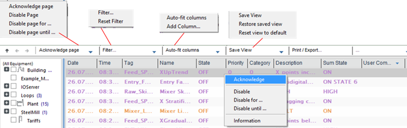
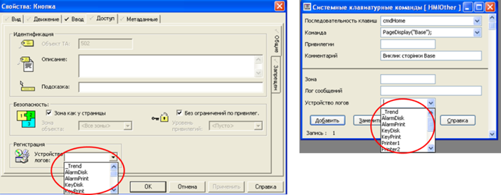
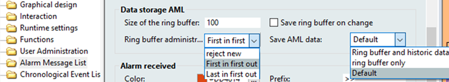
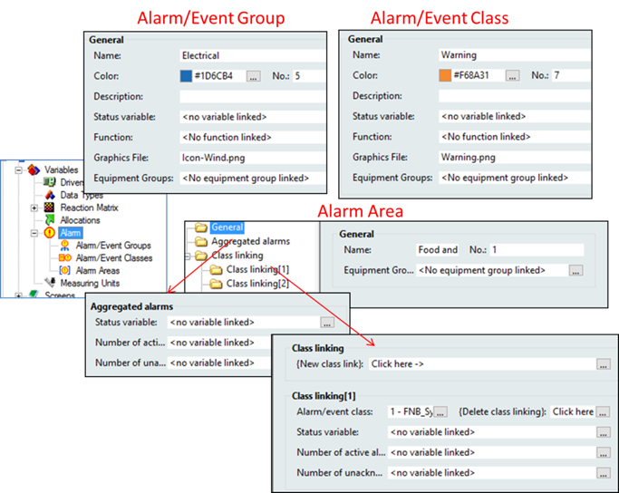

[Людино-машинні інтерфейси](https://pupenasan.github.io/hmi/)  Автор і лектор: Олександр Пупена доц. кафедри [АКСТУ НУХТ](http://www.iasu-nuft.pp.ua/) 

# Лекція 11. Приклади розроблення тривог і подій в середовищах SCADA/HMI

## 11.1 Підсистема тривожної сигналізації в SCADA Citect

### Загальні принципи функціонування

У SCADA Citect функціями тривожної сигналізації (окрім функцій HMI) займається ***сервер тривог*** (Alarm Server). Усі тривоги (окрім системних) означуються розробником через ***тег тривоги*** (тег аларма, ***alarm tag***), у якому задаються всі налаштування, що відповідають за виявлення тривоги та її поведінку. 

У SCADA Citect для тегу тривоги реалізований стандартний автомат станів, який описаний вище, в тому числі підтримує блоковані тривоги. Однак є певні відмінності в англійській термінології означенні станів, зокрема усі блоковані тривоги в Citect називаються Disabled, хоч у деяких місцях для відтермінованих тривог використовується термін Shelved. У будь-якому випадку, внутрішні механізми організації усіх блокованих тривог однакові з описаними в стандарті. Для реалізації проектно-блокованих тривог використовуються Cicode функції блокування (AlarmDisable, AlarmDisableREC) та розблокування (AlarmEnable, AlarmEnableREC).     

Більшість тегів тривог оброблюються з періодом `[Alarm]ScanTime` (задається в Citect.ini). Тривоги записуються в журнали та виводяться на сторінки: 

- активних тривог (Active Alarms Page);

- апаратних тривог (Hardware Alarms Page);

- блокованих тривог (Disabled Alarms Page);

- журналу зведення тривог (Alarm Summary Page);

- журналу послідовності подій (Sequence of Events (SOE) Page);

- банер тривог (Alarm Banner).

Для зведення тривог підтримується ведення журналу. Усі системні події та тривоги з активними опціями журналювання записуються в спеціальний журнал Sequence of Events (SOE).   

Для тегів тривоги означено ряд атрибутів, які задаються в редакторі (рис. 11.1). Перелік атрибутів залежить від типу тривоги, але деякі з них спільні для всіх. Кожний тег повинен мати ім’я, яке як і тег введення/виведення повинно бути унікальним у межах проекту. Для детального описування тегу можна використовувати коментар (Comment; в рос. лок. "Примечание"). Окрім імені, для тегу задається ***назва тривоги*** (Alarm Name) – змістовний опис тривоги, наприклад, ім'я, що включає фізичний пристрій, пов'язаний з тривогою. На відміну від імені тегу тривоги та коментаря, які стосуються розробника проекту SCADA/HMI і не потрібні користувачеві, назва тривоги використовується для відображення на дисплеях.

<a href="media11/6_14.png" target="_blank"></a>           

*Рис. 11.1*. Приклад налаштування тривог у Citect (вказані вибіркові поля).

Для детального представлення операторові використовується ***опис тривоги*** (Alarm Description, в рос. лок. "Описание тревоги"). Цей опис використовується для відображення на дисплеї і записах у журналах і допускає включення в нього змінної частини. Наприклад, якщо в описі тривоги записане значення:  

```
Тривога поломки лінії при швидкості {LineSpeed1}
```

то при формуванні запису замість `{LineSpeed1}` буде виведене значення тегу LineSpeed1. У фігурних дужках можна вставляти Cicode вирази. 

Окрім детального опису тривоги, Citect підтримує також використання сторінки допомоги для тривог, назву яких можна вказати в атрибуті Help (в рос. лок. "Справка"). У цьому випадку при виклику функції AlarmHelp() для виділеної тривоги відкриється сторінка допомоги.

Усі теги тривоги мають атрибут Delay (в рос. лок. "Задержка"), яка вказує на затримку спрацювання тривоги і задається у форматі HH:MM:SS. Цей атрибут у стандарті ISA-18.2 називається "on-delay". 

Для означення поведінки тривоги на дисплеях (сторінках) тривоги класифікуються через категорії. Тривоги створюються відповідно до вибраного типу. 

У стандарті ISA-18.2 одним із атрибутів є група тривог, за якою можна групувати тривоги по відношенню їх до певної частини просу чи устатковання. У SCADA Citect для цього використовується устатковання (Equipment), частиною якого може бути тег тривоги. 

### Типи тривог 

У SCADA Citect поняття типу тривог збігається зі стандартним (ISA-18.2). Тим не менше, у Citect усі типи розділяються на дві групи:

- ***конфігуровані тривоги*** (Defined alarms) – ці тривоги конфігуруються розробником проекту самостійно;  

- ***апаратні тривоги*** (Hardware alarms, в рос.лок. "Аппаратные тревоги") – ці тривоги пов’язані з роботою самої системи Citect і не потребують конфігурування. 

Короткий опис типів тривог наведений у табл.11.1. У колонці "Назва аналогу ISA-18.2" подано еквівалентний, на думку автора, аналог у стандарті. Слід зазначити, що таке авторське уявлення надане для кращого розуміння читачем і не є офіційною позицією Schneider Electric.   

*Таблиця 11.1.* Типи тривог у SCADA Citect

| Назва Citect                                                 | Назва аналогу ISA-18.2 (англ)                            | Умова спрацювання та налаштування                            |
| ------------------------------------------------------------ | -------------------------------------------------------- | :----------------------------------------------------------- |
| Апаратні тривоги /Hardware alarms/Аппаратные алармы          | system diagnostic alarm                                  | Апаратні тривоги можуть  виникати, наприклад, через помилки: комунікаційних; доступу чи роботи  серверів; роботи Cicode-функцій. Не конфігуруються розробником, є  наперед означеними |
| Дискретні  тривоги/Digital Alarm/Цифровые алармы             | absolute alarm,  discrepancy alarm                       | Спрацьовують залежно від стану 2-х  дискретних змінних тегів. Дискретна тривога виникає тоді, коли вирази в полі  тег А та тег В будуть дорівнювати TRUE. Якщо поле "Variable Tag B" порожнє, то перевіряється  тільки тег А. У поля можна також вставляти перед тегами оператор  "NOT" для інверсії умови |
| Мульти-дискретні  тривоги /Multi-Digital Alarm/Многоразрядные  алармы | bit-pattern  alarm                                       | Спрацьовують  залежно від комбінації станів 3-х дискретних змінних тегів, які вказуються в  полях тегів A, B та C (рис. 11.2), мають додаткові налаштування; для  кожної з 8-ми комбінацій станів задається опис тривоги (в рос. лок. "Состояние")  та активації тривоги (в рос. лок. "Триггер": 1 – задіяти, 0 – не  задіяти); тобто "Состояние 00A" = "@(SM-A1)" – означає,  що при спрацюванні тільки тегу А буде відображатися "SM-A1"; поле "Повторный  аларм" задає, чи треба генерувати нову тривогу при переході з одного  стану активної тривоги в інший стан також активної тривоги; для переходу між  станами тривоги можна задати функції, які будуть викликатися;  підтримується взаємне програмне блокування  тривог у межах однії групи, яка задається атрибутом Suppression (в рос. лок. "Блокировка"): тривоги з меншим рівнем  блокування (Level, в рос. лок. "Уровень")  будуть блокувати тривоги з більшим рівнем у межах тієї самої групи |
| Аналогові  тривоги/ Analog Alarm/ Аналоговые алармы          | absolute alarm,  deviation alarm,   rate-of-change alarm | Спрацьовують при виході значення  аналогової змінної за одну або декілька заданих меж; у налаштуванні тривоги вказується  тег (або Cicode-вираз), значення якого буде перевірятися (рис. 11.3); можна  задати Deadband ("Зона нечуствит."), що відповідає однойменному в  стандарті – повернення до норми тільки після проходження цієї зони |
| Аналогові  тривоги                                           | absolute alarm                                           | Підтримується тривога високого (high  alarm) і критично високого значення (high high alarm), тривога низького (low  alarm) і критично низького значення (low low alarm); для кожної межі можна  задати значення, проходячи через яку буде генеруватися тривога, а також  затримку (Delay) на спрацювання |
| Аналогові  тривоги                                           | deviation alarm                                          | Підтримується тривога відхилення  (deviation alarm), коли значення відхиляється від значення, заздалегідь  означеного в атрибуті "Уставка" (Setpoint) на величину, вказану в  атрибуті Deviation (в рос. лок. "Отклонение"); окрім значення,  також можна задати затримку на спрацювання |
| Аналогові  тривоги                                           | rate-of-change alarm                                     | Підтримується тривога швидкості  зміни (rate of change alarm), коли значення змінної змінюється дуже швидко; у  полі Rate (в рос. лок. "Скорость") можна задати значення, яке буде  використовуватися в якості максимально-дозволеної зміни за період, що  задається в параметрі [Alarm]Period; у моменти сканування тривоги (задається  параметром [Alarm]ScanTime) перевіряється значення тегу, якщо швидкість його  зміни перевищує максимальну – спрацьовує сигнал про швидкість зміни |
| Розширені тривоги/Advanced  Alarm / Расширенные алармы       | calculated alarm, adjustable alarm,  adaptive alarm      | Спрацьовують, коли результат Cicode виразу, заданого в атрибуті Expression  (в рос. лок."Выражение"), повертає TRUE |
| Тривоги з  відміткою часу/Time Stamped Alarm/ Алармы с  меткой времени | явно  не виділені                                        | Подібні до дискретної тривоги, за  винятком того, що відмітка часу спрацювання береться з окремої  змінної-лічильника, що задається в атрибутом Timer Expr. (в рос.лок."Выражение  таймера"); детальніше див. довідник |
| Дискретні  тривоги з відміткою часу/Time Stamped Digital Alarm/Цифровые  алармы с меткой времени | явно  не виділені                                        | Подібні до дискретної тривоги, за  винятком того, що дискретні теги тривоги оновлюються за підпискою від сервера  введення/виведення; відмітка часу береться зі змінного тегу |
| Аналогові  тривоги з відміткою часу/Time Stamped Analog Alarm/Аналоговые  алармы с меткой времени | явно  не виділені                                        | Подібні до аналогової тривоги, за  винятком того, що аналогові теги тривоги оновлюються за підпискою від сервера  введення/виведення; відмітка часу береться зі змінного тегу |

Інші типи тривог з ISA-18.2 можуть бути реалізовані з використанням Cicode.

<a href="media11/6_15.png" target="_blank"></a> 

*Рис. 11.2.* Приклад додаткових налаштувань мультидискретної тривоги

<a href="media11/6_16.png" target="_blank"></a> 

*Рис. 11.3.* Приклад додаткових налаштувань аналогової тривоги

### Категорія тривог (Alarm Category) 

Для означення поведінки тривоги в налаштуваннях тегу тривоги вказують ***категорію тривоги*** (Alarm Category, в рос. лок."Категория алармов"), в якій задають (рис. 11.4): 

- пріоритет тривоги; 

- шрифт, який використовується під час відображення тривоги (у SCADA Citect у шрифті задається розмір, колір тексту і фону, миготіння);

- форматування, яке використовується при появі тривоги;

- дія, яка запускається (через вираз Cicode), коли сигнал тривоги досягає заданого статусу (увімкнено, вимкнено або підтверджено);

- журнал, який використовується для тривоги.

<a href="media11/6_17.png" target="_blank"></a> 

*Рис. 11.4.* Налаштування категорії тривоги 

Як зазначено в довідниковій системі, основним фактором для розділення за категоріями є пріоритет. Однак, враховуючи, що може бути кілька категорій з однаковим пріоритетом, можна класифікувати тривоги і за іншою ознакою, наприклад, приналежність до класу.

Кожна категорія має свій номер, який вказується в атрибуті "категорія" тегу тривоги, щоб віднести її до цієї категорії. Якщо номер категорії в тегу не вказується, то вважається, що це категорія 0. У SCADA Citect деякі номери категорій зарезервовані:

0 – категорія за замовченням, тобто якщо в налаштуваннях тривоги не вказується номер категорії, вважається 0; 

254 – для зведення тривог (Alarm Summary);

255 – для апаратних тривог (Hardware Alarm). 

Якщо в проекті не створені категорії із зарезервованими номерами, для них використовуються властивості за замовченням. Користуватися номерами не дуже зручно, тому рекомендується використовувати ярлики (Label), які замінюють числа на текстові осмислені повідомлення (застосовуються для будь-яких полів, а не тільки для тривог).   

Пріоритет тривоги задає послідовність відображення активних тривог у списку, що відповідає стандарту ISA-18.2. Пріоритет 0 – це найвищий пріоритет, 255 – найнижчий. За замовченням використовується пріоритет 0.

Для категорії можна вказати, чи необхідно виводити дану тривогу на сторінці активних тривог (Show on Active; в рос. лок. "Показывать на активном") та зведених тривог (Show on Summary; в рос. лок. "Показывать на сводка").  

Для записування подій тривог у файл журналу (текстовий файл, принтер, базу даних) у вигляді зведення, в полі Summary Device (в рос. лок. "Устройство регистрации сводки") вказується назва системного пристрою, куди треба вести записування. Якщо необхідно вести журнал у вигляді списку, заповнюється поле Log Device (в рос. лок. "Устройство регистрации"). Які саме події необхідно записувати в журнал, вказується вибором TRUE в полях ON, OFF та ACK відповідно. Слід зазначити, що сучасні версії та нові шаблони Citect (від версій 7.5 до 8.1) не потребують означення цих журналів для їх відображення в шаблонних сторінках SOE та Summary. Ці журнали можуть знадобитися для ведення історії в текстових файлах або базах даних для перегляду в сторонніх програмах.  

Для означення формату відображення на сторінці активних тривог зведення тривог та SOE використовуються відповідно поля Alarm Format (рос. лок. "Формат аларма"), Summary Format (рос. лок. "Формат сводки") та SOE Format (рос. лок. "Формат SOE"). Однак формат для кожної категорії окремо підтримується тільки деякими шаблонами. Для шаблонів Tab_Style та StruxureWare формат означується першим зі списку:

- параметрами `[Format]Alarm`, `[Format]Summary` і `[Format]SOE` відповідно;

- форматом означеним в категорії 0;

- форматом за замовчуванням.

При означенні формату у фігурних дужках вказуються поля, кількість літер для відображення та вирівнювання (L (Left), R (Right) або N (None)):

```
{<ім’я поля>, [кількість літер[, вирівнювання]]}
```

Між полями можна вказувати знак табуляції `^t`. Для сторінки тривог та SOE дозволяється використовувати поля, неповний перелік яких подано в табл.6.8.

Таблиця 11.2. Деякі поля для сторінок активних тривог та SOE (повний перелік див. у довідниковій системі)

| **Поле**          | **Опис**                                                     |
| ----------------- | ------------------------------------------------------------ |
| {Tag,n}           | Ім’я аларм тегу                                              |
| {AlarmType,n}     | Тип тривоги: наприклад  "Digital"                            |
| {AlmComment,n}    | Текст,  введений для тривоги в полі коментарю                |
| {Name,n}          | Текст,  введений для тривоги в полі імені тривоги            |
| {Desc,n}          | Текст,  введений для тривоги в полі опису тривоги            |
| {Category,n}      | Номер  категорії                                             |
| {Area,n}          | Зона                                                         |
| {Priv,n}          | Привілеї                                                     |
| {Priority,n}      | Пріоритет                                                    |
| {Type,n}          | Стан тривоги:  ACKNOWLEDGED, CLEARED, DISABLED, UNACKNOWLEDGED |
| {LocalTimeDate,n} | Дата та час:  "yyyy-mm-dd hh:mm:ss[.ttt]"                    |
| {Time,n}          | Час останньої  зміни стану (hh:mm:ss).                       |
| {Date,n}          | Дата останньої  зміни стану (dd:mm:yyyy).                    |
| {Value,n}         | Плинне  значення для аналогової тривоги                      |
| {State,n}         | Плинний стан  аналогової тривоги: DEVIATION, RATE, LOW, LOWLOW, HIGH, HIGHHIGH, CLEARED |
| {ErrDesc,n}       | Інформація про  апаратну тривогу                             |
| {LogState,n}      | Стан тривоги  (для лог-журналу)                              |

Для сторінки зведення дозволяється використовувати поля, які показані в табл.11.3. 

*Таблиця 11.3.* Деякі поля для сторінок зведення тривог (повний перелік див. в довідниковій системі)

| **Поле**     | **Опис**                                                     |
| ------------ | ------------------------------------------------------------ |
| {UserName,n} | Ім'я користувача, що проводив певні дії з тривогами (наприклад  підтвердження) |
| {FullName,n} | Повне ім'я користувача, що проводив певні дії з тривогами (наприклад  підтвердження) |
| {UserDesc,n} | Текст пов’язаний з подією, записаний користувачем            |
| {OnDate,n}   | Дата виникнення тривоги                                      |
| {OnTime,n}   | Час виникнення тривоги                                       |
| {OffDate,n}  | Дата повернення тривоги до нормального стану                 |
| {OffTime,n}  | Час повернення тривоги до нормального стану                  |
| {AckDate,n}  | Дата підтвердження тривоги                                   |
| {AckTime,n}  | Час підтвердження тривоги                                    |
| {SumState,n} | Плинний стан тривоги                                         |
| {SumDesc,n}  | Плинний опис тривоги                                         |
| {SumType,n}  | Стан тривоги: ACKNOWLEDGED, CLEARED, DISABLED, UNACKNOWLEDGED |
| {Comment,n}  | Коментар, який вводить оператор у режимі виконання           |

### Ведення журналів тривог і подій та їх відображення на дисплеях (сторінках)  

Запис зміни стану тривог в історичні журнал проводиться в трьох варіантах:

- журнал зведення тривог;

- журнал списку тривог;

- журнал послідовності подій (SOE).

Журнал зведення тривог (Alarm summary log) зберігається в пам’яті і з певною періодичністю або за подією записується на диск у папку, що вказана параметром `[DATA]`. За замовчуванням це проводиться автоматично, і сторінки зведення можуть показувати зміст журналу. Якщо необхідно зведення тривог переглядати в інших програмах, його можна виводити на пристрій системного виведення, наприклад, у текстовий файл або в базу даних. 

У старих версіях Citect журнал списку тривог (Alarm Log) був єдиним способом ведення історії тривог. Журнал був реалізований через пристрої системного виведення, який давав змогу виводити тривоги в базу даних, принтер або текстовий файл. Зараз стандартним підходом є використання SOE, тому журнал використовується радше для виведення для сторонніх програм або принтер.  

***Журнал послідовності подій*** (***SOE***, Sequence of Events) використовується як єдина база даних тривог та подій. На відміну від журналів, які організовані через пристрої системного введення/виведення, він надає можливість зручного перегляду та керування записами через вбудовані засоби шаблонів сторінок та функції Cicode. Крім того, він фіксує не тільки означені користувачем події, а й системні. У Citect події (Events) вважаються більш загальним поняттям і включають у себе:

- Action (Дії) — події, що реєструють дію, здійснену оператором для тривоги; 

- `<Alarm Type>` — події, пов'язані з певним типом тривоги (наприклад, ON, OFF та ACK); 

- System (Системні) — системні події, наприклад, зупинка та перезапуск сервера;  

- Configuration (конфігураційні) — події, що відбуваються під час завантаження змін конфігурації (наприклад, додавання або видалення тегів тривоги);

- Comment (коментарі) —події, які вказують, коли користувач додає коментар до послідовності подій ;

- Interface Events (інтерфейсні події) — події, які вказують, коли користувач додає нову подію до SOE.

Для відображення активних тривог та журналів використовується вбудована в шаблони сторінок анімація та спеціальні сторінки. У табл. 11.4 ці засоби наведені в контексті їх переліку в ISA-18.2. 

*Таблиця 11.4.* Спеціальні шаблони та елементи сторінок 

| **Дисплеї    ISA-18.2 (англ)**                               | **Засоби  Citect (укр./англ./рос.лок**                       | **Призначення  та способи реалізації**                       |
| ------------------------------------------------------------ | ------------------------------------------------------------ | ------------------------------------------------------------ |
| alarm summary display                                        | Сторінка активних тривог/Active  Alarms Page/Активные  алармы | відображаються  усі активні тривоги, тобто які не в стані "норма А";  відображають (див. рис. 11.5) усю необхідну інформацію про  тривоги та надають можливість керувати відображенням та станом тривоги  відповідно до вимог ISA-18.2; реалізовуються через шаблони або власні сторінки |
| alarm summary display                                        | Сторінка журналу зведення тривог/Alarm  Summary Page/сводка  алармов | відображаються  записи, в яких наведені дата та час всіх подій проходження по автомату  станів (рис. 11.8); реалізовуються  через шаблони або власні сторінки |
| alarm summary status display                                 | Банер тривог/ Alarm  Banner/Аларм баннер                     | відображається  останні тривоги з найвищим пріоритетом та зведення статусу тривог (див.рис. 11.11);  реалізовуються через шаблони або джини |
| alarm log display                                            | Сторінка журналу послідовності  подій/ Sequence of Events (SOE) Page/Последовательность  событий | відображаються  події, в тому числі системні та тривоги у вигляді хронології подій (див.рис. 11.9);  реалізовуються через шаблони або власні сторінки |
| alarm log display                                            | Сторінка журналу зведення тривог/Alarm  Summary Page/сводка  алармов | відображаються  записи, в яких наведені дата та час усіх подій проходження по автомату  станів (див. рис. 11.8);  реалізовуються через шаблони або власні сторінки |
| process display                                              | Анімовані елементи на сторінках                              | змінюється  візуальне представлення та текст; реалізовуються через використання анімації  та джинів з прив’язкою до властивостей тегів тривог |
| system diagnostic alarm display                              | Сторінка апаратних тривог/Hardware  Alarms Page/Аппаратные  адармы | відображаються  усі активні апаратні (системні) тривоги; реалізовуються через шаблони або  власні сторінки |
| shelved alarm display,  suppressed-by-design alarm display, out-of-service alarm display | Сторінка блокованих тривог/ Disabled  Alarms Page/Отключенные  алармы | відображаються  усі заблоковані тривоги (див. рис. 11.10); реалізовуються через шаблони  або власні сторінки |

<a href="media11/6_18.png" target="_blank"></a> 

*Рис. 11.5*. Сторінка активних тривог та доступні функції  

<a href="media11/6_19.png" target="_blank"></a> 

*Рис. 11.6.* Відтермінування тривог

<a href="media11/6_20.png" target="_blank"></a> 

*Рис. 11.7.* Вікно налаштування фільтру (ліворуч) та вікно інформації про тривогу (праворуч)  
<a href="media11/6_21.png" target="_blank"></a> 

*Рис. 11.8.* Сторінка зведення тривог

<a href="media11/6_22.png" target="_blank"></a> 

*Рис. 11.9*. Сторінка послідовності подій SOE 

<a href="media11/6_23.png" target="_blank"></a> 

*Рис. 11.10*. Сторінка заблокованих тривог

<a href="media11/6_24.png" target="_blank"></a> 

*Рис.11.11.* Банер тривог та індикатори зведення статусу тривог

Зверніть увагу, що сторінка журналу зведення тривог не є аналогом сторінки зведення тривог в ISA-18.2. У стандарті в сторінці зведення відображаються активні тривоги, а SCADA Citect для цього існує сторінка активних тривог. У SCADA Citect журнал зведення – це своєрідний тип (історичного) журналу тривог, у якому всі події переходу тривоги зі стану до стану записуються в один запис.

На сторінці активних тривог а також частково на сторінці зведення доступні такі функції (див. рис. 11.5):

- підтвердження виділеної тривоги або всієї сторінки;

- отримання інформації про тривогу (рис. 11.6);

- блокування тривоги або всієї сторінки (Disable);

- відтермінувати тривогу або всю сторінку (Disable for…) та (Disable until…) (див. рис. 11.6);

- впорядкування записів за будь-яким полем (зробивши клік на потрібній колонці);

- добавлення та видалення колонок зі сторінки;

- збереження налаштувань вигляду;

- друк та експорт сторінки;

- фільтрація виведених записів за вказаними в фільтрах критеріями (рис. 11.7);

- фільтрація виведених записів за приналежності до устатковання. 

Як уже було сказано, у стандарті для кожної тривоги можна вказувати групу, до якої вона належить. Групою може бути устатковання або частина технологічного процесу. У SCADA Citect тег тривоги може бути частиною устатковання (Equipment). У цьому випадку для фільтрації записів на сторінці можна використовувати ліву бічну панель, в якій в ієрархічному вигляді представлене устатковання (див. рис. 11.5). Виділивши необхідне устатковання, можна вибрати тільки ті тривоги, що належать до нього. Число праворуч від назви устатковання вказує на кількість активних тривог для нього. Додаткову інформацію про використання устатковання в Citect можна прочитати в посібнику.   

На сторінці SOE доступні всі функції відображення та керування, що вимагаються стандартом ISA-18.2 до дисплеїв журналів тривог. На рис. 11.9 показано тільки частину колонок. 

У стандарті ISA-18.2 передбачено три різні способи блокування тривог і відповідно – три окремих дисплеї. У SCADA Citect для цього є тільки одна сторінка, куди виводиться інформація про всі заблоковані тривоги (рис. 11.10). Поле дати часу, до якого діє відтермінування тривоги, може бути пустим; це значить, що це є виведена з обслуговування або проектно-блокована тривога. Якщо необхідно використовувати фільтри, а додаткові поля усі заблоковані, то тривоги можна розподілити на три окремі сторінки. З цієї сторінки необхідні тривоги (або всі) можуть бути розблоковані.  

Останні найбільш пріоритетні активні тривоги виводяться в банер тривог (рис. 11.11). Лівіше від банера виводяться піктограми різних тривог, клікнувши на які можна перейти до конкретної сторінки тривоги. Праворуч від піктограм відображається кількість тривог на даній сторінці.  

Дисплей (сторінка) зведення статусу тривог відсутня в наперед визначених шаблонах Citect. Тим не менше, засоби Citect дають можливість реалізувати таку сторінку самостійно. У переліку Cicode-функцій є багато таких, що призначені для роботи саме з тривогами (Alarm Functions). На додаток до цього теги тривог можна використовувати для налаштування та анімації на сторінках.  

### Використання властивостей тривог як тегів  

У Citect є можливість використовувати властивості тегів тривог в анімації та Cicode функціях. Для цього в якості імені вказується назва тегу тривоги та через крапку властивість, до якої необхідно звернутися. Наприклад, якщо необхідно дізнатися про спрацювання тривоги з ім'ям "CV110_ERROR", необхідно звернутися до властивості "On". Тобто:

```
CV110_ERROR.On
```

Перелік властивостей даний в табл. 11.5.

*Таблиця 11.5.* Деякі властивості тегів тривог (повний перелік див. у довідниковій системі)

| **Власти­вість**                    | **Опис**                                          | **Доступ**            | **Примітка**                                    |
| ----------------------------------- | ------------------------------------------------- | --------------------- | ----------------------------------------------- |
| .On                                 | =1 – Тривога активна                              | читання               |                                                 |
| .Ack                                | =1 – Тривога підтверджена                         | читання/  записування |                                                 |
| .Disabled                           | =1 – Тривога заблокована                          | читання/  записування |                                                 |
| .Name                               | Ім’я тривоги                                      | читання               | аналогічне полю налаштування тривоги            |
| .State                              | Стан тривоги                                      | читання               | числове значення                                |
| .Desc                               | Опис тривоги                                      | читання               | аналогічне полю налаштування  аналогових тривог |
| .Tag                                | Ім’я тегу тривоги                                 | читання               | аналогічне полю налаштування тривоги            |
| .DVL                                | =1 – активна тривога відхилення  (вниз)           | читання               | тільки для аналогових тривог                    |
| .DVH                                | =1 – активна тривога відхилення  (вверх)          | читання               | тільки для аналогових тривог                    |
| .R                                  | =1 – активна тривога швидкої зміни  значення      | читання               | тільки для аналогових тривог                    |
| .L                                  | =1 – активна тривога низького  значення           | читання               | тільки для аналогових тривог                    |
| .H                                  | =1 – активна тривога високого  значення           | читання               | тільки для аналогових тривог                    |
| .LL                                 | =1 – активна тривога критично  низького значення  | читання               | тільки для аналогових тривог                    |
| .HH                                 | =1 – активна тривога кри­тично  високого значення | читання               | тільки для аналогових тривог                    |
| .Value                              | значення змінного тега для тривоги                | читання               | тільки для аналогових тривог                    |
| .DeadBand                           | налаштування зони нечутливості                    | читання/  записування | аналогічне полю налаштування  аналогових тривог |
| .Deviation                          | налаштування значення відхилення                  | читання/  записування | аналогічне полю налаштування  аналогових тривог |
| .HighHigh                           | налаштування критично високого  значення          | читання/  записування | аналогічне полю налаштування  аналогових тривог |
| .High                               | налаштування високого значення                    | читання/  записування | аналогічне полю налаштування  аналогових тривог |
| .LowLow                             | налаштування критично низького  значення          | читання/  записування | аналогічне полю налаштування  аналогових тривог |
| .Low                                | налаштування низького значення                    | читання/  записування | аналогічне полю налаштування  аналогових тривог |
| .HHDelay,.HDelay, .LDelay, .LLDelay | налаштування затримок спрацювання                 | читання/  записування | аналогічне полю налаштування  аналогових тривог |
| .Rate                               | налаштування швидкості зміни                      | читання/  записування | аналогічне полю налаштування  аналогових тривог |
| .Setpoint                           | налаштування уставки для тривоги  відхилення      | читання/  записування | аналогічне полю налаштування  аналогових тривог |

### Пристрої системного введення/виведення в Citect та ведення журналу користувацьких подій 

***Пристрої системного введення/виведення***, або просто ***пристрої*** (Device; в рос. лок. "Устройства") надають користувачеві можливість у Citect забезпечувати записування та читання даних з файлів, принтерів та СУБД (рис. 11.12). Пристрої можуть використовуватися для ведення журналів тривог, записування/читання даних з файлу/БД у Cicode, а також для ведення журналу дій оператора (наприклад, натискання кнопки або введення значення в полі). 

<a href="media11/6_25.png" target="_blank"></a> 

*Рис. 11.12.* Приклади застосувань пристроїв

Один і той самий пристрій може використовуватися в різних діяльностях Citect. При необхідності використання декількох пристроїв для виведення їх групують в групу пристроїв. При роботі з СУБД дані можна не тільки записувати, а й зчитувати. Додаткову інформацію про роботу Citect з СУБД Ви можете отримати з посібника.  

При конфігуруванні пристрою вказується тип (рис. 11.13), який можна вибрати з ряду: 

- RTF files; 

- ASCII files; 

- dBASE databases; 

- SQL databases (через ODBC) ; 

- Printers (Принтери). 

<a href="media11/6_26.png" target="_blank"></a> 

*Рис. 11.13* Налаштування пристроїв

Для файлів в полі імені файлу (File Name; в рос. лок. "Имя файла") задається ім’я файлу. Шлях до директорії можна вказати з використанням параметра. Наприклад, наступний запис вказуватиме на те, що розміщення файлу буде завдатися параметром DATA, який записується в Citect.ini або в налаштуваннях параметра проекту. 

```
[DATA]: ALARMLOG.TXT
```
Для файлів можна вказати також періодичність створення (рос.лок."Периодичность") та кількість історичних файлів (в рос. лок. "Число файлов"). Нові файли будуть створюватися із зазначеною періодичністю відносно часу, вказаного в полі Time (в рос. лок."Время"). Наприклад, якщо кількість файлів задати 10, періодичність 24:00:00, ім’я FileName.TXT, а час 12:00:00, то відбуватиметься така послідовність (рис. 11.13):

1)   спочатку записування будуть вестися у файл "FileName.TXT";

2) о 12:00 наступного дня файл буде перейменовано на "FileName.001", після чого створиться новий файл "FileName.TXT", куди буде проводитися записування;

3) у 12:00 3-го дня файл "FileName.001" буде перейменовано на "FileName.002", а файл "FileName.TXT" на "FileName.001", після чого створиться новий файл "FileName.TXT", куди буде проводитися записування; 

4) на 11-й день найстаріший файл буде видалено.  

<a href="media11/6_27.png" target="_blank"></a> 

*Рис. 11.14*. Ведення історії файлів

Якщо кількість файлів не вказано, за замовченням береться 10. Кількість фалів можна також задати рівним:

```
0 – без історії;
-1 - записування в той самий файл.
```

Для означення формату запису в файл використовуються спеціальні поля, як це робиться для полів тривог. Якщо в тривогах не означений формат для журналу, то буде використовуватися той, який означений для пристрою. Для журналу дій оператора використовуються спеціальні імена полів, які вказані в табл. 11.6. 

Для ведення ***журналу дій оператора*** (***лог-журнали***) для необхідного графічного елемента або системної клавіатурної команди вказується пристрій, який повинен бути створений заздалегідь (рис. 11.15), а також повідомлення (MsgLog), яке буде заноситися до лог-журналу (рис. 11.16).

*Таблиця 11.6.* Деякі поля для лог-журналів дій оператора (повний перелік див. в довідниковій системі)

| **Поле**          | **Опис**                                                     | **Примітка**                   |
| ----------------- | ------------------------------------------------------------ | ------------------------------ |
| {UserName,n}      | Ім’я користувача                                             |                                |
| {FullName,n}      | Повне Ім’я користувача                                       |                                |
| {Time,n}          | Час формування запису в файлі                                |                                |
| {Date,n}          | Дата формування запису в файлі                               |                                |
| {Page,n}          | Назва сторінки, яка була  відображена, коли відбувався запис |                                |
| {MsgLog,n}        | Повідомлення, яке прописано в  графічному елементі або системній клавіатурній команді, що потребує записування  в журналі дій оператора |                                |
| {Arg1,n}…{Arg8,n} | Набір клавіш натиснутих оператором                           | тільки для клавіатурних команд |

<a href="media11/6_28.png" target="_blank"></a> 

*Рис. 11.15* Вказівка на пристрій для графічного елемента та системної клавіатурної команди 

<a href="media11/6_29.png" target="_blank"></a> 

*Рис .11.16* Вказівка повідомлення, яке буде писатися в пристрій при діях оператора: натисканнях миші по елементу, введення з клавіатури для елемента та на рівні всієї системи

Слід розуміти, що ці події не будуть заноситися в загальний журнал SOE. Для внесення сконфігурованих користувачами подій можна скористатися функцією Cicode "SOEEventAdd".

### Додаткові функції тривог в Citect 

В останніх версіях SCADA Citect (на час написання актуальна 8.1/2018 R2) у ньому з’явилося багато додаткових можливостей, пов’язаних з тривогами. Частина з них пов’язана з появою принципово нового шаблону Situational Awareness, який описаний у попередньому розділі. Деякі доступні для всіх типів шаблонів. 

Для будь-якої тривоги можна прив’язати інформацію про можливу причину і найбільш адекватне реагування на тривогу з цієї причини (Cause and Response). Інформація про можливу причину (Possible Alarm Cause) і необхідне реагування на неї (Response) добавляється в редакторі і видима через контекстне меню тривоги. Додатково можна означити допустимий час реагування (Response Time) та можливі наслідки (Consequence), якщо реагування не буде зроблене протягом вказаного часу (рис. 11.17). До однієї тривоги може бути прив’язано кілька причин, які будуть видимі у вікні "Cause and Response", і оператор зможе вибрати з них найбільш достовірну.  

<a href="media11/6_30.png" target="_blank"></a> 

*Рис. 11.17.* Фрагмент дисплею що створений на базі шаблонів Situational Awareness. 

У новому шаблоні SCADA Citect з назвою Situational Awareness доступні також додаткові функції, які передбачають використання готових графічних компонентів (джинів) з наперед закладеною анімацією за станом тривог, а саме:

- зміною кольору елементів залежно від пріоритету тривоги; 

- відображення спеціальних символів та літер залежно від пріоритету тривоги;

- зміною кольору та відображення символів залежно від режиму (блокована/неблокована). 

На рис. 11.17 показано фрагмент екрана з нового шаблону SCADA Citect 2018. Компоненти що мають тривоги, підсвічуються кольором та відображають спеціальний символ залежно від режиму та блокування (Shelved/Disabled). У правому нижньому кутку екрана відображається контекст тривоги для виділеного компонента, в якому також для кожної тривоги підсвічується символ залежно від пріоритету.  

На рис. 11.18 показано фрагмент дисплея активних тривог, створеного на базі шаблону Situational Awareness. У вікні навігації устатковання (Equipment Tree) додатково відображається кількість тривог для кожного пріоритету та символ. Також змінено інтерфейс переглядача, в якому швидко можна вибрати тривоги потрібного пріоритету.  

<a href="media11/6_31.png" target="_blank"></a> 

*Рис. 11.18.* Фрагмент дисплея активних тривог, створеного на базі шаблонів Situational Awareness 

Розроблені шаблони Situational Awareness передбачають використання наперед визначених композитних джинів (Composite Genies), а ті, в свою чергу, використовують налаштування пріоритетів та режими тривог. Для пріоритетів означуються текстове позначення, кольори та джини для анімації символів (рис. 11.19). Джини задаються як для графічних компонентів (Genie Name), так і компактні для переглядачів тривог та навігатора устатковання (Thumbnail Name). Аналогічні налаштування просяться для заблокованих тривог (Shelved/Disabled)  

<a href="media11/6_32.png" target="_blank"></a> 

*Рис. 11.19.* Налаштування відображення пріоритетів та режимів. 

## 11.2. Підсистема тривожної сигналізації в SCADA zenon

### Загальні принципи функціонування

У SCADA zenon конфігурування функцій сигналізації проходить через конфігурування змінних та загальних групових налаштувань тривог та подій. Означення тривог може відбуватися двома взаємовиключними шляхами:

- через добавлення в зміну граничних значень (Limit values) із зазначенням налаштувань, що належать до тривог та подій;

- через створення матриць реакції, в яких налаштовуються поведінка тривог та подій з подальшою їх прив’язкою до змінних 

Обидва варіанти є частиною процесу конфігурування змінних бази даних реального часу. Тобто в zenon немає явно виділених тегів (змінних) тривог. 

Коли тривога спрацьовує, в спеціально виділену область оперативної пам'яті, яка називається ***кільцевим буфером*** (***Ring buffer***), заноситься запис, для якого робляться усі відмітки проходження тривоги по автомату станів, зокрема:

- час появи тривоги, отриманий у мілісекундах як унікальний підпис;

- додаткова інформація, така як причина, значення тощо;

- час зникнення;

- час підтвердження.

Кожний запис у кільцевому буфері – це активна тривога; як тільки тривога повернулася в нормальний стан – вона видаляється з буфера. Для збереження буфера при вимкненні середовища виконання, він записується в файл "alarm.bin" в директорії середовища виконання.

Одночасно з кільцевим буфером усі тривоги записуються у файл журналу тривог ***Alarm Message List*** *(*AML*)* з розширенням `*.aml`. Цей файл створюється автоматично для кожного календарного дня та керується за допомогою властивості "Save AML data". Ім'я файлу тривоги поєднується з буквою "A", а потім – з датою у формі "JJMMDD" та розширенням ".aml"; наприклад "A100623.aml". Ці файли створюються автоматично на кожен день і повинні бути евакуйовані або видалені користувачем вручну, якщо обсяг пам’яті обмежений. Файли "\*.aml" зберігаються у папці "...\Project folder\Computer name\Project name folder".

Кільцевий буфер використовується для виведення на статусний рядок тривоги (Alarm Status Line) або екран типу Alarm Message List. Останній можна використовувати як для перегляду і взаємодії з буфером, так і з журналом AML. 

Кільцевий буфер та AML зберігають інформацію у вигляді зведення, тобто набір записів, кожен з яких представляє проходження автомату станів. Якщо подію необхідно записувати в журнал у хронологічному порядку її виникнення, то використовується ***Chronologic Event List*** (***CEL***). 

SCADA zenon підтримує кілька автоматів станів для тривог:

- тривоги без необхідності підтвердження; 

- тривоги з необхідністю підтвердження (як в ISA-81.2);

- тривоги з необхідністю двостадійного підтвердження, коли тривога вилучається зі списку активних вручну, навіть коли вона не активна і підтверджена. 

У SCADA zenon є кілька можливостей підтвердження тривог:

- через подвійний правий клік по статусному рядку (alarm status bar) або переглядачі AML;

- через функцію "Acknowledge alarms";

- спеціальну кнопку в переглядачі AML.

Можна сконфігурувати тривоги так, щоб вони потребували обов’язкового коментування перед підтвердженням. Додатковою вимогою може також слугувати попередній вибір причини тривоги (alarm cause). Причини попередньо створюються у вигляді дерева в спеціальних екранах типу "Context List".   

Окрім звичайного підтвердження, в zenon існує можливість робити ***візуальне підтвердження*** *(**Visual acknowledgment**)*. Для цього в екранах типу AML є можливість створити окрему кнопку. Таким чином, в zenon підтвердження може проходити в три етапи:

- візуальне підтвердження;

- підтвердження;

- підтвердження підтвердженого – видалення з кільцевого буфера (при двостадійному підтвердженні);

Хоч в SCADA zenon наявний класичний автомат станів, явної можливості блокувати окремі тривоги немає. Тобто в zenon немає відтермінованих, проектно-блокованих і виведених з обслуговування тривог. Тим не менше, в ньому є можливість блокування тривог за групами або класами, що дає можливість проводити групове блокування, що частково компенсує таку відсутність. Також zenon має можливість індивідуально відключити опитування змінної, через яке також можна реалізувати подібну функцію.

### Означення типів тривог через граничні значення та матриці реакцій 

Класичним способом означення тривог є використання конфігурованих меж змінної, так званих ***граничних значень змінних*** (Limit Values). Для потрібної змінної або типу створюються граничні значення (рис. 11.20) для яких вказується:

- значення змінної, при якому відбувається перехід через межу (Limit Value); значення змінної може задаватися іншої змінною, для цього треба активувати опцію "Dynamic limit value active" та задати змінну уставки значення межі (Variable); 

- текстове значення (Limit value text), яке асоціюється з даною межею, яке може бути використане в анімації на екранах та в переглядачах тривог; в Runtime значення може формуватися динамічно, для чого використовуються спеціалізовані службові символи, зокрема при формуванні тексту можна використовувати:

  - текст з мовної таблиці (language table); 

  - значення інших змінних;

  - деякі властивості змінної;  

- тип межі (Minimum/Maximum), який вказує яка дія є переходом через межу:
  - Minimum – перехід через межу з більшого до меншого значення змінної вважається умовою спрацювання;

  - Maximum – перехід через межу з меншого до більшого значення змінної вважається умовою спрацювання;

- значення гістерезису (Threshold value), тобто відхилення від граничного значення, при якому межа перестане спрацьовувати; наприклад, при межі Limit Value = 100 (Maximum) і Threshold value=10 межа спрацює при 100 і більше, а перестане спрацьовувати при 90 і менше;

- час затримки (Delay time);

- опція використання межі як тривоги (In Alarm Message List);

- опція зберігання в журналі подій та тривог (In Chronological Event List);

- опція необхідності підтвердження (To acknowledge);

- опція обов’язковості вказівки причини тривоги (Alarm cause required);

- опція обов’язковості вказівки коментарю для тривоги (Comment required);

- опція обов’язковості ручного видалення тривоги з кільцевого буфера тривог (Two-stage acknowledgment);

- опція виведення тривоги на принтер (Print);

- віднесення до групи тривог (alarm/event group);

- віднесення до класу тривог (alarm/event class);

- колір, прозорість та миготіння для межі;

- функція, яка може бути викликана при спрацюванні межі або вручну через кнопку на екрані AML (при активній опції "Call via button in screen Alarm Message List");

- файл допомоги (Help file) та розділ у ньому (Help chapter).   
  <a href="media11/6_33.png" target="_blank"></a>           

*Рис. 11.20*. Налаштування Limit Values 

При переході через граничне значення властивість графічних елементів зміниться відповідно до налаштувань, а в кільцевому буфері та журналі тривог з’являться відповідні записи. Ці налаштування можна задавати для кожної змінної окремо, або задавши їх у типі змінної. 

Є альтернативний варіант конфігурування меж з використанням ***матриці реакцій*** (***Reaction Matrix,ReMa***). Цей підхід передбачає створення матриць реакцій, в яких задаються усі необхідні налаштування для меж, а потім – прив’язують їх до змінних. Матриці реакцій задаються для різних варіантів змінних: Binary, Multi binary, Numeric, Multi numeric, String. На рис. 11.21 показане вікно налаштування для матриці реакцій типу Numeric. Більшість налаштувань такі самі як у конфігуруванні граничних значень. Принциповою відмінністю є те, що умова спрацювання межі задається не через граничне значення, а через комбінацію умов по логічному AND:

- спрацювання умови: більше/менше/рівне за вказане значення, або входить у діапазон;

- відповідає комбінації статусних бітів: для кожного біта задається 0, 1 або будь-яке значення;

- час виконання наведених умов більше за Delay.  
<a href="media11/6_34.png" target="_blank"></a> 

*Рис. 11.21.* Налаштування через матрицю реакцій

Для "Multi binary" та "Multi numeric" на вкладці "AML/CEL text" можна означувати додатково окремий текст та активувати запис значення змінної, які будуть добавлятися до тексту повідомлення залежно від бітів статусу. На вкладці "Status Routing" можна сконфігурувати збереження бітів статусу, зчитуючи їх з бітів значення або з інших бітів статусу. Матриці реакції типу “String” дозволяють генерувати реакцію на зміну текстового значення.  

Як бачимо, в zenon тривоги налаштовуються досить гнучко. Хоч явно виділених типів згідно ISA-18.2 в SCADA zenon немає, спробуємо зробити хоча б загальне приведення. Абсолютні тривоги реалізовується штатними засобами як через матрицю реакцій, так і через граничні значення. Враховуючи, що через матрицю реакцій zenon може обробляти значення побітово, достатньо легко можна реалізувати тривоги по бітовому шаблону. Матриця реакцій дає змогу аналізувати статусні біти змінних, що дає можливість реалізувати системно-діагностична тривоги, тривоги діагностування приладу, тривоги помилки вимірювання тощо. Такі тривоги, як тривога відхилення, тривога невідповідності, обчислювальна тривога потребують додаткових внутрішніх та математичних змінних. Зрештою те, що не реалізується безпосередньо, завжди можна зробити через вбудовану систему скриптів. Зведені варіанти реалізації типів ISA-18.2 в SCADA zenon показані в табл. 11.7. Слід зазначити, що це є авторським представленням суто для кращого розуміння читачем і не є офіційною позицією COPA DATA. 

*Таблиця 11.7.* Варіанти реалізацій типів тривог ISA-18.2 в SCADA zenon 

| **Назва (англ./ укр.)**                                      | **Засоби реалізації**     | **Варіанти реалізації**                                      |
| ------------------------------------------------------------ | ------------------------- | ------------------------------------------------------------ |
| absolute alarm/  абсолютна тривога                           | Limits або ReMa           | задаванням  абсолютних меж, гістерезису, таймауту            |
| deviation alarm/  тривога відхилення                         | Limits або ReMa           | створенням  внутрішньої змінної через математичний драйвер, значення якої дорівнює  різниці значень змінної та уставки |
| rate-of-change alarm/  тривога швидкості зміни змінної       | Limits або ReMa           | через  внутрішні та математичні змінні а також з використанням переприсвоєння (Allocation); можна зробити через скрипти |
| discrepancy alarm/  тривога невідповідності                  | ReMa                      | через  внутрішню змінну та/або бітову матрицю                |
| calculated alarm/  обчислювальна тривога                     | Limits або ReMa           | створенням  внутрішньої змінної через математичний драйвер, значення якої розраховується  відповідно до вимог |
| recipe-driven alarm/  керована рецептом тривога              | Limits                    | через  динамічне значення межі, значення якої змінюються модулем Batch, при відключеній процедурі задаються завідомо в значенні що не є  тривогою (окремий Limit) |
| bit-pattern alarm/  тривога по бітовому шаблону              | ReMa                      | в  ReMa задається бітова маска                               |
| controller-output alarm/  тривога по виходу регулятора       | Limits або ReMa           | задаванням  абсолютних меж вихідної змінної, гістерезису, таймауту |
| system diagnostic alarm/  системно-діагностична тривога      | система,  Limits або ReMa | через  системні повідомлення; через системні змінні          |
| instrument diagnostic alarm/ тривога  діагностування приладу | ReMa                      | через  системні біти статусу змінної, деякі беруться з пристроїв |
| adjustable alarm/  налаштовувана оператором тривога          | Limits                    | через  динамічне значення межі, значення якої задається через внутрішню змінну  оператором |
| adaptive alarm/адаптивна  тривога                            | Limits                    | через  динамічне значення межі, значення якої задається через змінну, яка змінюється  алгоритмом |
| statistical alarm/статистична  тривога                       | Limits або ReMa           | через  математичний драйвер                                  |
| first-out alarm/  першопричинна тривога                      | ReMa                      | можна  забезпечити через варіанти групового блокування тривог |
| bad-measurement alarm/  тривога помилки вимірювання          | ReMa                      | через  системні біти статусу змінної, деякі беруться з пристоїв |

Як уже зазначалося, у zenon штатними засобами не передбачено індивідуального блокування тривог. Однак можна використовувати спеціальні функції для групового блокування, зокрема “Activate or deactivate alarm/event groups/classes” або змінивши змінну статусу для групи чи класу. Заблоковані активні на момент блокування тривоги продовжують змінювати свої стани (можна підтверджувати, вони переходять до нормального стану), але нові записи в кільцевому буфері і в AML не з’являються. Автору не відомі прямі способи фільтрування тривог за блокованими групами, однак можна відслідкувати стан груп/класів.   

У zenon доступно багато інших функцій роботи з тривогами (рис. 11.22)  

 

*Рис. 11.22*. Функції для керування тривогами

### Кільцевий буфер та AML 

Як написано вище, кільцевий буфер зберігає записи активних тривог. Тривоги видаляються з буфера у випадку: 

- якщо вона не потребує підтвердження: коли перейшла в неактивний статус;

- якщо для тривоги стоїть атрибут "З підтвердженням" ("To acknowledge"): коли перейшла в неактивний статус і підтверджена користувачем;

- якщо для тривоги стоїть атрибут "Двоступеневого підтвердження" ("Two-stage acknowledgement"): коли перейшла в неактивний статус, підтверджена користувачем і явно видалена оператором з буфера.

На відміну від кільцевого буфера, записи ніколи не видаляються з AML, змінюється тільки їхній статус. Розмір кільцевого буфера повинен бути встановлений через однойменну властивість проекту (“Size of the ring buffer”), який вказує на максимальну кількість записів у ньому (рис. 11.23). Рекомендується вказувати розмір рівним принаймні кількості змінних, для яких налаштована тривога.
<a href="media11/6_36.png" target="_blank"></a> 

*Рис. 11.23.* Налаштування кільцевого буферу

Коли Runtime закривається, кільцевий буфер автоматично зберігається у файлі alarm.bin. Якщо Runtime закривається несподівано, наприклад, при відключенні живлення, записи будуть втрачені. Щоб запобігти цьому, кільцевий буфер можна зберігати постійно при створенні нового запису, виставивши опцію "Save ring buffer on change at every new entry". Альтернативою є запуск функції "Save AML and CEL ring buffer" (Зберегти кільцевий буфер AML та CEL). 

Файл тривоги `*.aml` зберігається щоразу, коли створюється новий запис. Файл AML синхронізується з кільцевим буфером. Усі зміни типу підтвердження здійснюються лише в кільцевому буфері, а потім синхронізуються з файлом AML. Якщо виставлена опція "Save AML data" = “Ring buffer and historic data”, то одночасно зі збереженням кільцевого буфера буде збережений файл "*.aml". 

Якщо кільцевий буфер переповнюється, оскільки він занадто малий, у файлі тривоги залишаються непідтверджені записи. Вони відображаються під час фільтрації, але їх більше не можна підтвердити. Спроба підтвердити їх може спровокувати підтвердження в кільцевому буфері, якщо тривоги стосуються тієї самої змінної та того самого порушення граничного значення.

### Класифікація та групування тривог

У zenon тривоги можуть бути згруповані та пріоритизовані через (рис. 11.24):

- логічне групування через групи тривог/подій (Alarm/event groups);

- класифікація за пріоритетом для кольорового кодування тривог в AML і подій в CEL (Alarm/event classes);

- групування за розміщенням на виробничому майданчику (Alarm areas). 
<a href="media11/6_37.png" target="_blank"></a> 

*Рис. 11.24.* Групування тривог у zenon

Налаштування груп, класів та ділянок проводиться в розділі проекту Variables->Alarm (див. рис. 11.24). Кожній групі чи класу можна присвоїти ім’я, число, колір, функцію, змінну стану, графічний символ та групу устатковання (equipment group), до якої вони належать. 

***Класи тривог/подій*** (***Alarm/event classes***) зазвичай використовуються для пріоритизації тривог. Для цього в класі задається колір (рис. 11.25), яким буде позначатися текст в переглядачах AML/CEL для всіх тривог цього класу. Окрім кольору, можна вказати символ, яким буде позначатися даний клас тривог. При виникненні тривоги даного класу можна запустити функцію. Статус класу тривог можна прив’язати до булевої змінної статусу ("Status variable"). У цьому випадку змінна може бути використана як для контролю, так і для керування блокуванням тривог даного класу. Заблокувати тривоги вказаного класу або групи можна також за допомогою функції "Alarm/event group connection active/inactive". Явно виділеного номера пріоритету в zenon немає, однак в переглядачах AML/CEL можна упорядковувати повідомлення за вибраним класом або групою, що по суті одне й те саме.   
<a href="media11/6_38.png" target="_blank"></a> 

*Рис. 11.25.* Налаштування груп, класів та ділянок для тривог у zenon

Окрім класифікації за пріоритетом, можна об’єднувати тривоги в логічні ***групи тривог/подій*** (***Alarm/Event Group***). Тривоги можуть бути організовані в групи за різним принципом, наприклад, за типом устатковання і за своїм призначенням, що більше схоже на клас тривог, означений в ISA-18.2. Для груп тривог/подій характерні ті самі налаштування, за винятком кольору, який стосується не тексту повідомлення а тільки спеціального індикатора у відповідній колонці переглядача AML/CEL. 

Для групування за розміщенням на виробничій площадці використовуються **ділянки тривог** (***Alarm areas***). Ділянки так само як і класи та групи можуть використовуватися для фільтрування відображення тривог у переглядачах AML/CEL. Однак, окрім цього, ділянки мають можливість формувати загальну статистику для всіх тривог та по кожному класу окремо. Для цього в розділі "Aggregated alarms" (див. рис. 11.25) задаються змінні:

- статусна змінна (Status variable): байтова змінна, в першому біті якої вказується 1, якщо є активні тривоги, у другому – якщо є непідтверджені;  

- для відображення кількості активних тривог (Number of active alarms); 

- для відображення кількості непідтверджених тривог (Number of unacknowledged alarms).

Подібне налаштовується для кожного класу тривог, який підключений до ділянки, що дає можливість проводити статистику за кожним класом тривоги окремо. 

Класи та групи тривог/подій прив’язуються в змінних (див. рис. 11.20) або матрицях реакцій (див. рис. 11.21). Приналежність до ділянки може вказуватися двома шляхами:

- статично, прив’язавши змінну безпосередньо до потрібних ділянок (максимум до чотирьох); 

- ієрархічно через модель устатковання (Equipment Modelling).

Перший спосіб передбачає пряме означення належності змінної конкретній ділянці тривог через властивості Alarm handling (рис. 11.26). Другий спосіб (при виставленій опції "Use hierarchical alarming of the Equipment Model") приналежності буде визначатися налаштуванням ієрархії устатковання.  

     

*Рис. 11.26*. Прив’язка змінної до ділянок тривог

Додатково у групі параметрів "Alarm handling" можна налаштувати дві змінні, які будуть встановлюватися в задане в полі "Acknowledgement value" значення:

- "Acknowledgement variable" при підтвердженні тривоги; 

- "Visual acknowledgement variable" при візуальному підтверджені тривоги.

### Відображення на дисплеї подій та тривог

Для відображення активних тривог та журналів використовуються як готові типи сторінок, так і додаткові засоби. Для активних тривог використовуються екран типу AML та ***статусний рядок тривоги*** (***Alarm status line***). Статусний рядок – це смуга на екрані, що знаходиться над усіма вікнами, в якій відображається одна активна непідтверджена тривога. Подвійний клік правою кнопкою миші підтверджує видиму тривогу. 

Для AML та статусного рядку в групі властивостей проекту "Alarm Message List" є ряд налаштувань (рис. 11.27):

- активація функції AML;

- властивості за замовчуванням: вибір колонок на екрані AML та їх ширини;

- поведінка миготіння елементів на звичайних екранах та AML;

- вибір використання кольору як фону чи як тексту;

- налаштування вибору причин тривоги;

- для кожної події (received – активація, cleared – перехід у норму, acknowledged – підтвердження) означення кольору та текстового префіксу відмітки часу, графічного символу статусу (як альтернативи кольору), графічного символу префіксу (як альтернатива текстовому);

- кольору та символу для стану підтвердженої тривоги при двостадійному підтвердженні.
<a href="media11/6_40.png" target="_blank"></a> 

*Рис. 11.27.* Загальні налаштування AML та кільцевого буферу

Додатково можна активувати статусний рядок тривоги (див. рис. 11.22), для якого вказується:

- порядок (найстаріший, найновіший) відображення тривог у рядку;

- повідомлення, що будуть з’являтися, якщо досягнута певна кількість тривог у буфері.

Для відображення усіх активних тривог за вказаними критеріями (фільтрами) використовуються екрани типу “Alarm Message List” (рис. 11.28). За призначенням вони відповідають "alarm summary display" з ISA-18.2 і можуть відображати як зміст кільцевого буфера, так і певну кількість записів AML (рис. 11.29). Відповідно до ISA-18.2, AML відображає всю обов’язкову інформацію, за винятком хіба що пріоритету, оскільки його в явному вигляді в zenon немає. Однак, якщо вважати, що клас тривоги еквівалентний пріоритету, то це не так принципово.  
<a href="media11/6_41.png" target="_blank"></a> 

*Рис. 11.28*. Приклад екрану AML 

<a href="media11/6_42.png" target="_blank"></a> 

*Рис. 11.29.* Налаштування фільтрів AML

На сторінці AML доступні наступні функції:

- упорядкування тривог за хронологічним порядком та за будь-яким іншим стовпцем;

- підтвердження виділеної тривоги (подвійний клік правою кнопкою миші) або всієї сторінки чи всіх тривог, що задовольняють фільтрам;

- візуальне підтвердження;

- підтвердження підтвердженого (для тривог з двохстадійним підтвердженням);

- виклик файлу допомоги за тривогою;

- виклик прив’язаної функції, наприклад для навігаційного посилання на відповідний екран процесу;

- фільтрація тривог за різними параметрами (див. рис. 11.29), в тому числі за:

- типом тривог;

- часом;

- групами тривог;

- класами тривог;

- ділянкою процесу;

- приналежністю до ієрархії устатковання;

- іменем або ідентифікатором змінної;

- внесення коментарю;

- вибір причини тривоги;

- збереження користувацьких налаштувань відображення як профіль з можливістю його завантаження;

- добавлення та видалення колонок зі сторінки;

- друк, експорт та імпорт сторінки.

Інші типи екранів, що вимагаються в ISA-18.2, за винятком дисплеїв блокованих тривог, також доступні в zenon і наведені в табл. 11.8. Хоча стандартних засобів перегляду блокованих тривог немає в zenon, їх можна реалізувати самостійно, хоч це не є тривіальним завданням. За іншим варіантом реалізації блокування може проводитися з використанням контролера.

*Таблиця 11.8.* Засоби zenon для реалізації різних типів сторінок 

| **Дисплеї    ISA-18.2 (англ)**                               | **Засоби** **zenon** **(укр./англ.*)**                       | **Призначення  та способи реалізації**                       |
| ------------------------------------------------------------ | ------------------------------------------------------------ | ------------------------------------------------------------ |
| alarm summary display                                        | екран  активних тривог/Alarm Message List; режим відображення буферу | відображаються  останні тривоги з кільцевого буферу та AML (див. рис. 6.36); реалізовуються через типи екранів AML |
| alarm summary status display                                 | стандартні  екрани + змінні статистики за ділянками процесу (Alarm handling) | відображаються  статистичні дані по кожній ділянці (Area); реалізуються  через змінні, означені властивостях "Alarm handling" |
| alarm log display                                            | екран журналу  подій/ Chronological Event List (CEL);        | відображаються  тривоги та події CEL у  вигляді хронології подій; реалізовуються через типи екранів CEL |
| alarm log display                                            | екран  активних тривог/Alarm Message List; режим відображення AML | відображаються  тривоги у вигляді зведення;  реалізовуються через типи екранів AML |
| process display                                              | стандартні  екрани                                           | змінюється  візуальне представлення та текст; реалізовуються через використання граничних значень або ReMa |
| system diagnostic alarm display                              | екран  активних тривог/Alarm Message List                    | відображаються  усі активні апаратні (системні) тривоги; реалізовуються з використанням  фільтрів, наприклад, за групою тривог; попередньо створюються системні змінні  та тривоги для них |
| shelved alarm display,  suppressed-by-design alarm display, out-of-service alarm display | немає в zenon                                                | можливо,  реалізовується через скрипти (VBA,  VSTA)          |

### Ведення журналів подій та тривог (CEL) 

Для записування подій і тривог у хронологічному порядку в zenon використовується Chronological Event List (CEL). Туди можуть заноситися такі події (список неповний):

- зміна стану тривоги;

- видалення тривоги;

- установлення значення;

- виконання, зміна рецепта; 

- архівування даних;

- різні дії оператора (наприклад, реєстрація);

- мережні дії.

У CEL також є тимчасовий кільцевий буфер (cel.bin), який містить останні кілька записів (означується в налаштуваннях). Усі останні записи з буфера записуються у файли архіву (з розширенням *.cel). Поведінка та налаштування кільцевого буфера аналогічні кільцевому буферу тривог.  

CEL активується і налаштовується в однойменній групі властивостей проекту (рис. 11.30). Зокрема там вказується:

- налаштування колонок на екрані типу CEL за замовчуванням;
- необхідність автоматичного оновлення змісту екрана CEL;
- вибір використання кольору як фону чи як тексту;
- розмір кільцевого буфера; 
- налаштування необхідності записування у файл історії при кожній події;
- налаштування необхідності фіксувати в CEL:
- подій підтвердження тривог та підтвердження підтвердженого;
- внесення коментарю в CEL та AML;
- виконання функції записування значення змінної;
- виконання/зміни рецепта та записуваних значень;
- змін у списку контексту;
- внесення змін в архів CEL.  

<a href="media11/6_43.png" target="_blank"></a> 

*Рис. 11.30.* Налаштування CEL у властивостях проекту

Фрагмент прикладу екрану CEL показано на рис. 11.31. Він має ті самі функції налаштування і фільтрування, що й AML, однак не дає змоги керувати тривогами.   
<a href="media11/6_44.png" target="_blank"></a> 

*Рис. 11.31*. Фрагмент екрану CEL

## Контрольні запитання 

1.    Які дисплеї тривог використовуються для системи тривожної сигналізації? Покажіть на прикладі однієї з програм SCADA/HMI, які типи дисплеїв тривог підтримуються.
2.    Яке призначення дисплея зведення (списку) тривог? Перерахуйте функції, які він повинен надавати.
3.    Яке призначення дисплея журналу тривог? Перерахуйте функції, які він повинен надавати.
4.    На прикладі однієї з програм SCADA/HMI покажіть, яким чином і в якому вигляді можна переглянути журнал тривог? Яка саме інформація може бути доступна для перегляду?
5.    Як рекомендується показувати тривоги на дисплеях процесу? Покажіть на прикладі однієї з програм SCADA/HMI, як це можна реалізувати.
6.    Розкажіть про призначення фільтрів у переглядачах тривог та подій? Покажіть на прикладі однієї з програм SCADA/HMI, як це реалізовано.

[<-- Лекція 10. Загальні принципи розроблення підсистеми тривог та подій](lec10.md)

[--> Лекція 12. Розроблення підсистеми трендів](lec12.md)

<iframe width="400" height="225" src="https://www.youtube.com/embed/pMCJUgg3DhQ" title="YouTube video player" frameborder="0" allow="accelerometer; autoplay; clipboard-write; encrypted-media; gyroscope; picture-in-picture" allowfullscreen></iframe>

<iframe width="400" height="225" src="https://www.youtube.com/embed/zGgNBZ850uQ" title="YouTube video player" frameborder="0" allow="accelerometer; autoplay; clipboard-write; encrypted-media; gyroscope; picture-in-picture" allowfullscreen></iframe>

<iframe src="https://www.slideshare.net/slideshow/embed_code/key/Id37DeRrAmNpE2" width="597" height="486" frameborder="0" marginwidth="0" marginheight="0" scrolling="no" style="border:1px solid #CCC; border-width:1px; margin-bottom:5px; max-width: 100%;" allowfullscreen> </iframe> <div style="margin-bottom:5px"> <strong> <a href="https://www.slideshare.net/pupenasan/9-scada-citect-scada-zenon" title="9 Приклади підсистеми тривожної сигналізації в SCADA Citect і SCADA zenon" target="_blank">9 Приклади підсистеми тривожної сигналізації в SCADA Citect і SCADA zenon</a> </strong> from <strong><a href="https://www.slideshare.net/pupenasan" target="_blank">Пупена Александр</a></strong> </div>

