[Людино-машинні інтерфейси](https://pupenasan.github.io/hmi/)  Автор і лектор: Олександр Пупена доц. кафедри [АКСТУ НУХТ](http://www.iasu-nuft.pp.ua/) 

# Лекція 12. Розроблення підсистеми трендів

## 12.1. Модель трендового контуру 

Підсистема трендів призначена для ведення історії зміни значень числових величин у часі з можливістю їх подальшого вилучення для перегляду або додаткового оброблення. Якщо розглядати цю підсистему через призму функціонального призначення, то слід виділити такі функції (Рис. 12.1):

- вимірювання значення даних з об’єкта керування;

- оброблення даних на пристрої збору (наприклад ПЛК);

- зчитування даних з пристрою збору та їх обробка в базі даних реального часу (БДРЧ);

- зчитування даних з бази даних реального часу та їх обробка в підсистемі трендів; 

- записування даних в архівну базу даних (БД);

- зчитування архівних даних з БД із зазначенням певних критеріїв, їх обробка та відображення. 

<a href="media12/7_1.png" target="_blank">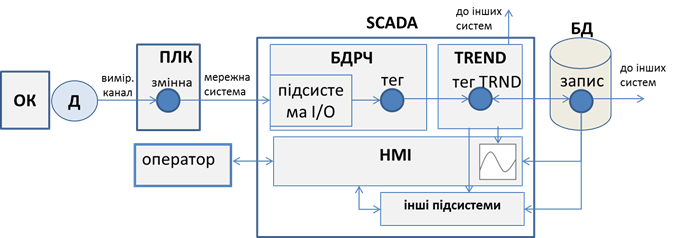</a> 

*Рис. 12.1* Модель трендового контуру для однієї змінної процесу 

Ці функції формують ланцюжок, який у цьому курсі будемо називати ***трендовим контуром***. Схема моделі трендового контуру для однієї змінної процесу показана на Рис. 12.1. Вона може відрізнятися залежно від реалізації, тим не менше представляє більшість процесів, які відбуваються в SCADA та в деяких операторських панелях для формування архівних записів та доступу до них. Така модель дає можливість звернути увагу на певні нюанси налаштувань, тому може бути корисною читачеві для розуміння. 

З моделі видно, що підсистема трендів (позначена як TREND) не функціонує сама по собі. Дані надходять з інших підсистем, як правило (але не обов’язково), з бази даних реального часу (БДРЧ). У деяких SCADA підсистема виділяється як окремий трендовий сервер, тому в ній є свої трендові теги (на Рис. 12.1 позначений як "тег TRND").  Тег у базі даних реального часу для змінної процесу зчитується через підсистему введення/виведення з контролера або аналогічного пристрою (позначений як ПЛК). Той отримує значення з каналу вимірювання. Отримані значення підсистема трендів зберігає в певній базі даних. Збережені дані використовуються надалі для різних підсистем. Найпростіший випадок, коли дані відображаються у вигляді трендів у підсистемі HMI. Тим не менше архівні дані можуть використовуватися для аналітичних функцій чи інших цілей. Зрештою контур замикається через оператора, який, отримавши необхідну інформацію приймає певні рішення і виконує дії, які для спрощення не показані на Рис. 12.1.       

Таким чином, проектування та розроблення підсистеми трендів можна розглядати в 2-х площинах – серверній, де відбуваються операції записування та вилучення даних в/з базу даних історії, та клієнтській, де відбувається їх представлення зацікавленій особі. Серверна частина по суті представляє собою спеціалізовану СКБД (систему керування базами даних), а клієнтська, як правило, реалізована у вигляді спеціальних засобів для перегляду даних трендів (у графічному або табличному вигляді), підсистеми звітів або інших підсистем. 

За необхідності збирання великої кількості даних, наприклад з кількох відділень виробництва, для їх попереднього оброблення і передачі на верхні рівні керування використовуються спеціалізовані програмні засоби, які прийнято називати Historian (Істориками). Враховуючи, що Historian мають набагато більшу функціональність, ніж збирання і архівування трендових даних, їх призначення – інтеграція з верхніми рівнями керування.   

## 12.2. Збереження трендових даних

Функція збереження зводиться до формування запису в базі даних, що відповідає за тренд. Під ***трендовим*** ***записом*** (***trend*** ***record***) будемо розуміти структурований об’єкт у базі даних трендів (див. Рис. 12.1), що відповідає за відмітку значення та інших властивостей тегу або інших об’єктів SCADA із зазначенням часу, коли створився цей запис (або відбулося вимірювання), а також додатковими статусними відмітками, зокрема якістю значення. 

Для означення серверної частини у більшості SCADA/HMI необхідно виконати такі дії:

1) сконфігурувати серверний компонент, якщо він виділений як окрема підсистема;

2) вказати базу даних, куди буде записуватися тренд;

3) вказати періодичність або подію, при якій буде відбуватися записування;

4) вказати змінну або вираз, значення якого буде використовуватися для записування; 

5) означити структуру (перелік полів) запису;

6) вказати глибину збереження. 

У SCADA-програмах, з явно виділеним серверними компонентами (***трендовий сервер***) для трендів потрібно вказати їхні параметри. Оскільки в такому випадку трендовий сервер є окремим застосунком, до якого можуть підключатися клієнти, що знаходяться на інших пристроях, то при налаштуванні вказують:

- назву сервера;

- мережну адресу (як правило, IP);

- TCP/UDP-порт.

SCADA-програми можуть працювати як з пропрієтарними (власними) форматами баз даних, так і з відкритими з використанням сторонніх СКБД. У першому випадку постачальник SCADA-програми сам означує формат бази даних, забезпечує записування у файли, вибірку, індексацію і т. п. і вирішує проблеми швидкості операцій та оптимізацію. Враховуючи, що трендовий сервер є частиною SCADA, це дає можливість постачальникові максимально оптимізувати роботу сервера. Для добре оптимізованих трендових серверів пропрієтарний формат має, мабуть, лиш одну незручність – неможливість безпосереднього підключення до БД сторонніх клієнтів. Однак, якщо SCADA має засоби експорту даних або відкритий інтерфейс доступу, ця особливість не є проблемою.    

У випадку використання відкритих форматів БД трендовий сервер по суті є клієнтом для сторонніх СКБД, які забезпечують роботу з базою даних. У цьому разі на моделі, що представлена на Рис. 12.1 треба було б БД показати в складі окремої СКБД. У такій ситуації розробник проекту для SCADA повинен означити базу даних, таблиці в ній, а також налаштувати доступ. При доступі до сторонніх СКБД часто використовуються відкриті стандарти, типу ODBC, OLEDB, ADO.NET. Це дає можливість використовувати практично будь-які СКБД сторонніх постачальників. Цей спосіб потребує інсталяції додаткового ПЗ, його налаштування, а для платних СКБД – також його закупівлі. Серед можливих проблем, які можуть виникнути при цьому, – погана оптимізація доступу через особливості СКБД або інтерфейсу. 

Тренди потрібні для відслідковування зміни значення змінної (тегу) від часу. В ідеалі зацікавленій особі необхідні дані з якнайменшою періодичністю, однак фактично є кілька чинників, які потребують означення періодичності записування:

- дані не має сенсу записувати частіше, ніж вони зчитуються із джерела;

- одні змінні змінюються в проекті відносно дуже часто, інші - дуже рідко;

- значення, як правило, не змінюється, і при періодичному записуванні вони будуть повторюватися;

- періодичність записування впливає на об’єм даних, які необхідно зберігати і оброблювати;

- для порційних виробництв (Batch) величина змінної має значення тільки тоді, коли в обладнанні проходить приготування продукту або інша операція. 

У багатьох SCADA-програмах є можливість вказати подію, при якій буде відбуватися формування запису. Як правило, доступні такі варіанти:

- періодично (циклічно): запис створюється з указаною періодичністю незалежно від того, чи відбулися якісь зміни в джерелі даних;

- спорадично, за зміни значення: записування відбувається тільки при зміні стану змінної: 

  - зміна якості змінної; 

  - для дискретних і цілочисельних змінних – це зміна значення; 

  - для змінних з плаваючою комою – це зміна значення з урахуванням зони нечутливості;  

- за подією: записування відбувається при виникненні події, наприклад, за виконання певної умови;

- комбіновано: комбінацією наведених вище умов.   

У всіх програмах SCADA/HMI є можливість вести записування значення змінної (тегу), у деяких можна також проводити записування результату певного виразу або результату виконання функції чи скрипту. 

У багатьох системах існують вимоги до формування в трендових записах відмітки часу. Більшість SCADA формують її рівною часу, коли відбувалося збереження. Хоч відмітку часу можна записувати з точністю до мілісекунд, що б мало точно відображати, коли відбулися зміни, фактично це не відповідає дійсності. Це добре видно на моделі контуру, що показана на Рис. 12.1. Спочатку відбувається зміна на об’єкті, потім є певне запізнення в каналі вимірювання і зміна відбувається в ПЛК (або засобі введення/виведення), після чого з певним запізненням значення буде прочитано підсистемою введення/виведення SCADA. Після оброблення в БДРЧ дані будуть доступні підсистемі трендів. Якщо архівування відбувається через СКБД і використовується відмітка часу формування запису, то значення буде ще старішим. При проектуванні, виборі рішення та засобів автоматизації цю особливість треба чітко розуміти. Деякі SCADA дають змогу формувати в записі відмітку часу, рівною отриманою з підсистеми введення/виведення. Є рішення, де відмітка часу зчитується з ПЛК, а там формується безпосередньо в модулі вимірювання. Якщо необхідні відмітки часу з точністю до мілісекунд, то очевидно потрібні рішення, що ґрунтуються на веденні архівних записів безпосередньо в засобі вимірювання.    

Деякі SCADA/HMI програми дають можливість також означувати поля, які можна записувати, тобто формувати структуру трендового запису. Це дає можливість оптимізувати базу даних, налаштувавши її під конкретне завдання.

Глибина збереження може задаватися як через налаштування часу максимально старих даних, так і через значення максимального об’єму (наприклад, через кількість записів або максимальний розмір пам’яті). У цьому випадку вказують, що необхідно робити зі старими записами.  

## 12.3. Відображення трендових даних 

У більшості випадків тренди відображаються у вигляді графіків залежностей значення від часу. Тим не менше, деякі SCADA/HMI дають можливість відображати дані у вигляді таблиць, навіть з можливістю зміни їх значення. У будь-якому випадку конфігурування засобів відображення потребують означення даних, які необхідно відобразити на переглядачах. Це робиться через вказівку джерела даних, наприклад, через ім’я змінної та додаткові фільтри. 

При використанні відкритих СКБД може знадобитися повне означення джерела даних у базі даних. Тобто переглядач трендів може бути незалежним від конфігурації сервера. З одного боку, це рішення дуже гнучке, оскільки дає можливість переглядати записи сторонніх SCADA/HMI, а з іншого – як правило, не оптимізоване для даних завдань.

Окрім джерела даних, у переглядачі необхідно означити:

- вісь часу: глибина, відображення шкали, означення відміток;  

- вісь значення: діапазон значень, відображення шкали, означення відміток;

- спосіб відображення лінії тренду, наприклад, пунктирну лінію, колір;

- мітки тренду, наприклад, прямокутник чи коло;

- спосіб згладжування між точками (інтерполяція);

- панель інструментів з командами.

Переглядачі трендів можна використовувати для різних цілей. Це треба враховувати при проектуванні ЛМІ. Тренди можуть бути частиною дисплейних мнемосхем, тоді, як правило, вони є трендами реального часу, які автоматично прокручуються і не мають елементів керування. Для аналізу ретроспективних даних, переглядачі займають окремі дисплеї, які мають елементи керування, що дають можливість:

- налаштувати діапазон часу відображення;

- вибирати криві та налаштовувати їх відображення;

- прокручувати вісь часу;

- масштабувати відображення;

- показувати значення кривих у конкретній точці часу з використанням курсору;

- експортувати дані активного відображення трендів;

- змінювати зовнішній вигляд переглядача та ін.;

- збереження/читання налаштувань переглядача. 

Для зручності відображення та аналізу криві групують разом, налаштовують їх відображення і зберігають як єдиний набір, який ми зватимемо ***групою кривих***. У більшості SCADA така функціональність підтримується в режимі виконання, що дає можливість операторові налаштовувати відображення у зручному для себе вигляді і зберігати для швидкого доступу. В іншому випадку розробникові необхідно заздалегідь передбачити усі групи як окремі дисплеї. 

## 12.4. Підсистема трендів в SCADA Citect

У SCADA Citect збереженням (реєстрацією) даних на диску з можливістю їх перегляду у вигляді тренду займається ***трендовий сервер*** (Trend Server). Окрім збереження, трендовий сервер також обслуговує запити від клієнтів (наприклад, від Process Analyst) на читання архівних даних. Оскільки у Citect підтримується розподілена кластерна структура, трендовий сервер може запускатися окремим процесом на окремому ПК. Тому в проекті для Trend Server явно конфігурується ім’я, адреса ПК, на якому планується запускати сервер, TCP-порт та кластер. Для standalone рішень ці настройки залишаються за замовчуванням, оскільки усі компоненти запускаються на тому самому ПК.

Слід зазначити, що, окрім трендового сервера, збиранням та збереженням даних для їх аналізу та формування звітів займається окремий програмний пакет – Historian. Враховуючи, що Schneider Electric забезпечує інтеграцію продуктів Citect та Historian, деякі налаштування стосуються означення доступу до Historian.    

Значення, які необхідно зберігати в тренді, означуються через ***теги трендів***, в яких вказується вся необхідна для записування в трендові файли інформація. Ці об’єкти в якості джерела даних беруть значення з інших тегів, у тому числі зі змінних тегів (Рис. 12.2), хоч в якості значення можна записувати результат виразу з комбінацією будь-яких об’єктів. Таким чином, трендовий сервер слідкує за тим, коли необхідно зробити розрахунок виразу і коли треба зробити запис у файлі. Також до його завдань входить формування відповіді на запитування архівних даних. Безпосередніми клієнтами для трендового серверу можуть бути:

- графічні об’єкти для перегляду трендів: Trend та Process Analyst;

- спеціальна Cicode-функція "TrnGetTable" для отримання даних у вигляді масиву;

- функції Cicode для експорту даних: у буфер – "TrnExportClip", в файл CSV – "TrnExportCSV", або у файл DBF – "TrnExportDBF".   

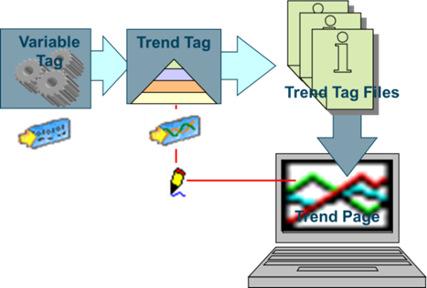

*Рис. 12.2*.Принципи роботи трендової підсистеми в Citect

Для перегляду даних у вигляді трендів у графічній підсистемі використовуються два типи об’єктів "Тренд" (Trend) та "Аналізатор процесів" (Process Analyst). Графічний об’єкт "Тренд" може відображати тільки архівні дані з тегів тренду. Аналізатор процесів, окрім архівних даних, що означені в тегах трендів, може відображати дані реального часу. 

Форму налаштування тегу тренду показано на Рис. 12.3. Для тегу тренду означується назва, яка може збігатися з назвою змінних тегів або тегів тривог. У полі "Выражение" вказується Cicode вираз, що повертає якесь числове значення. Це може бути як змінна, як це показано на Рис. 12.3, так і вираз або функція, наприклад "(LOOP_1_PV + LOOP_2_PV)/2". 

<a href="media12/7_3.png" target="_blank">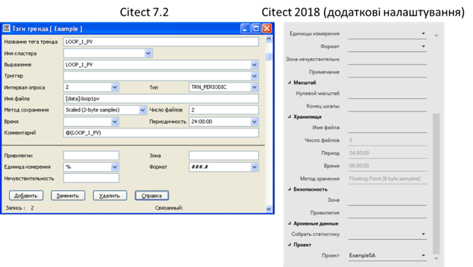</a> 

*Рис. 12.3.* Налаштування тегу тренда

Трендовий сервер розраховує значення вказаного виразу з періодичністю, зазначеною в полі "Интервал опроса". Якщо в цьому полі з'являється десяткове число, то воно буде інтерпретуватися як секунди. Періодичність можна також задати у форматі "hh:mm:ss". Поле "Интервал опроса" є опціональним, за замовченням приймається 10 с. Слід звернути увагу, що при зміні цього значення треба видалити раніше створені архівні файли для даного трендового тегу, щоб зміни вступили в силу. 

У Citect доступні три способи ініціювання записування, які вказуються в полі "Тип". ***Періодичний тренд*** (тип TRN_PERIODIC) записує дані постійно із зазначеним періодом. Можна також вказати ***тригер*** (поле "Триггер"), який буде активувати або деактивувати ведення записування. Запис в архів проводиться тоді, коли тригер = TRUE або не вказаний (Рис. 12.4). 

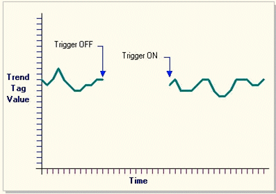

 *Рис. 12.4.* Періодичний тренд (тип TRN_PERIODIC) 

***Подієвий тренд*** (тип TRN_EVENT) записує дані тільки в момент зміни значення тригера з FALSE в TRUE. Між точками запису проводиться інтерполяція (Рис. 12.5).  

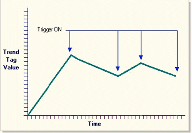

*Рис. 12.5.* Подієвий тренд (тип TRN_EVENT)

***Періодично-подієвий тренд*** (тип TRN_PERIODIC_EVENT), як і попередній, записує дані тільки в момент зміни значення тригера з FALSE в TRUE. Але цей тип тренду не робить інтерполяцію між точками запису (Рис. 12.6.)

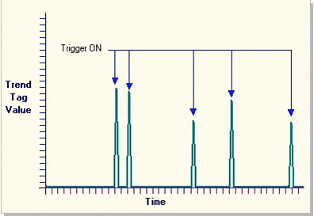

*Рис. 12.6.* Періодично-подієвий тренд (тип TRN_PERIODIC_EVENT)

У полі "Имя файла" можна вказати шлях та ім’я файлу (без розширення) для тегу тренду. Наприклад, "[data]:loop1pv" вказує, що архівні файли будуть розміщуватися в папці, означеній параметром "DATA" з назвою "loop1pv". Якщо ім’я файлу не вказане, воно береться з імені тегу тренду, а шлях папки – зі значення параметру "DATA".

Глибина збереження архіву та кількість архівних файлів для кожного тегу тренду означується значеннями полів "Число файлов", "Время" та "Периодичность". Властивість "Число файлов" вказує на кількість архівних файлів (за замовченням береться 2). Файли синхронізовані відносно часу, вказаного в полі "Время", а кожен файл буде зберігати дані відповідно до вказаної періодичності. При першому запуску системи виконання будуть створені усі необхідні файли для ведення історії. Під час роботи системи дані будуть зберігатися в кожному з цих файлів, поступово переходячи від одного файлу до іншого з вказаною періодичністю (значення "Периодичность"). Коли закінчується час записування в останній файл, система знову переходить до 1-го файлу, затираючи старі архівні значення. Розглянемо це на прикладі, де означено кількість файлів рівною 10, періодичність 24:00:00, а час синхронізації ("Время") – 00:00:00.

1. При першому запуску системи будуть створені усі 10 файлів із зазначеним ім'ям та з розширеннями ".000"… ".009" та один файл із розширенням ".HST". Спочатку Citect пише архівні дані у файл з розширенням ".000".

2. Опівночі, наступного дня, дані будуть записуватися у файл з розширенням ".001".

3. Опівночі, третього дня, дані будуть записуватися у файл з розширенням ".002" і т. д.

4. Після 10-ти днів система почне переписувати перший файл, тобто ".000". 

Слід звернути увагу, що при зміні будь-яких значень кількості або періодичності історичних файлів треба видалити раніше створені архівні файли для даного тегу тренда, щоб зміни вступили в силу.

Властивість "Метод сохранения" вказує на спосіб і величину збереження числових даних. Якщо не потрібна велика точність, варто використовувати "Scaled (2-byte samples)". Одиниці вимірювання і формат вказуються для відображення їх на осі, курсорі Аналітика процесів та на інших числових полях. Така необхідність спричинена можливістю використання кількох змінних у формуванні значення трендового тегу. Зона і привілеї налаштовуються для обмеження доступу. 

У нових версіях Citect з’явилися додаткові можливості і відповідно налаштування. Зокрема масштаб задається для формування масштабу відображення за замовчуванням. Властивість "Собрать статистику" (Historize) вказує на автоматичне формування історичного тегу в спеціалізованому продукті Schneider Electric's Historian.

Клієнтська частина підсистеми трендів представлена графічними об’єктами переглядачів трендів, які можна розміщувати в будь-якій кількості на будь якій дисплейній сторінці, а також функціями Cicode.  

Об’єкт "***Тренд***" – переглядач трендів Citect, який був доступний ще з ранніх версій. Він дає можливість відобразити до 8-ми архівних значень тегів тренду. Для кожного пера (кривої) вказується назва тегу тренду та колір (Рис. 12.7). Властивість "Число выборок данных" вказує на кількість записів у файлі історії, які будуть відображатися для кожного тегу тренду. За допомогою властивості "Пикселов на выборку" вказуються проміжки між двома точками одного пера на графіку. Ширина об’єкта "Тренд" пов’язана з цими властивостями:  

```
Ширина = "Пикселов на выборку" x Число выборок данных" (12.1)
```

Указати діапазон значень у часових розмірах можна за допомогою Cicode функції, наприклад TrendSetSpan.

Об’єкт "Тренд" має дуже мало можливостей налаштування в середовищі розроблення. Усі можливості навігації по історії, відображенню значень, налаштуванню області відображення та багато іншого реалізовуються через функції Cicode. Для спрощення використання трендів на базі об’єкта "Тренд" у включених проектах Citect є спеціальні сторінки, джини та суперджини. Тим не менше, більш функціональнішим у використанні трендів є об’єкт "Аналізатор процесів".

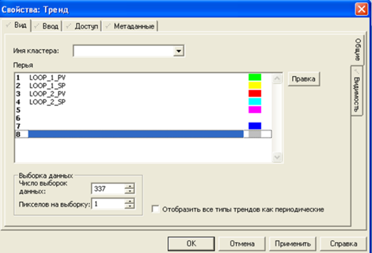

*Рис. 12.7.* Об’єкт "Тренд"

***Аналізатор процесів*** (Process Analyst) дає можливість відображати в часі значення тегів трендів, змінних тегів а також тегів тривог. Аналізатор процесів має такі можливості:

- налаштування всіх параметрів відображення як у середовищі розроблення, так і в середовищі виконання;

- добавлення і відображення на одному елементі тренду кількох панелей (умовно незалежних трендових елементів) це дає можливість:

  - групувати криві разом за певною ознакою;

  - порівнювати тренди;

  - здійснювати відносний зсув панелей за часом; 

- відображення на панелі об’єктів:

  - трендів у реальному часі зі змінних тегів;

  - архівних трендів з трендового серверу;

  - зміни стану тривог у часі з тривогового сервера;

  - архівних трендів та трендів реального часу з Historian; 

- добавлення на тренд (конкретну панель) кривих реального часу та за архіву:

  - числових змінних;

  - дискретних змінних;

  - стану тривог; 

- відображення кривих (пер, pen) тренду у вигляді (Рис. 12.8):

  - ліній різного кольору, товщини та формату: неперервної, штрихової, пунктирної і т.п.;

  - різного типу ліній залежно від якості (достовірності) та наявності даних;

  - точок даних у форматі різних фігур;  

- відображення та налаштування по осях X та Y для кожної кривої (Рис. 12.9):

  - сітки і поділок; 

  - діапазону, можливості автомасштабування;

  - можливості прокручування (див.Рис. 12.10);

  - відображення шкали для вибраної кривої;

- у режимі виконання використання кнопок перемотування (див. Рис. 12.10)

  - "<" – на половину інтервалу назад; 

  - " <<" – на один інтервал назад;

  - " >" – на половину інтервалу вперед; 

  - " >>" – на один інтервал уперед;

- у режимі виконання для кривих

  - зціплювати криві разом;

  - синхронізувати з плинним часом;

- виведення легенди з можливістю:

  - швидкої зміни основних властивостей кривих;

  - відображенням числового значення трендів у потрібній точці часу через курсор;

- збереження відображених даних у форматі XLS або TXT; 

- збереження заданих налаштувань (представлення) у файл "*.PAV" з указаним ім’ям для можливості відкриття налаштувань звичайним вибором;

- керування та налаштування з Cicode функцій та VBA. 

<a href="media12/7_8.png" target="_blank">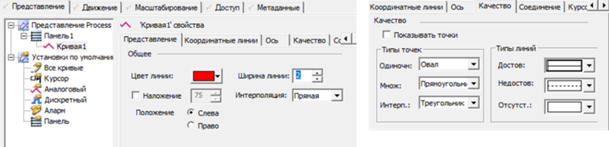</a> 

*Рис.12.*8. Налаштування кривої тренду

<a href="media12/7_9.png" target="_blank">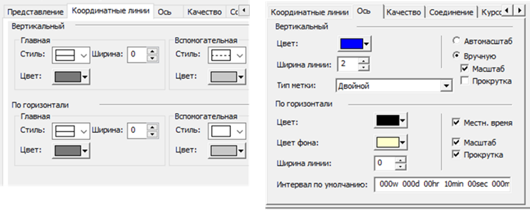</a> 

*Рис. 12.9.* Налаштування координатних ліній та осей

<a href="media12/7_10.png" target="_blank">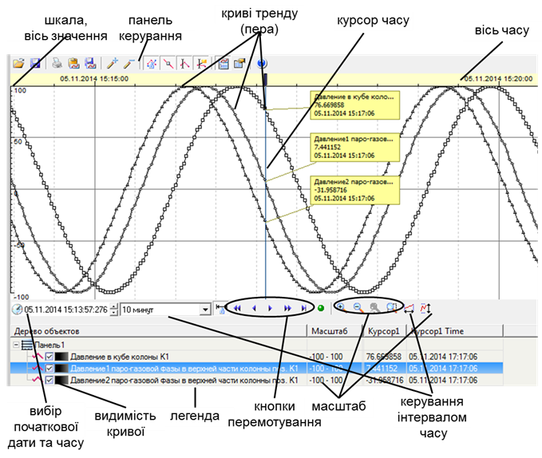</a> 

*Рис. 12.10.* Загальний вигляд Аналітика процесів у середовищі виконання

Окремо варто зупинитися на функції відображення на панелі трендів стану тривог (Рис. 12.11). 

<a href="media12/7_11.png" target="_blank">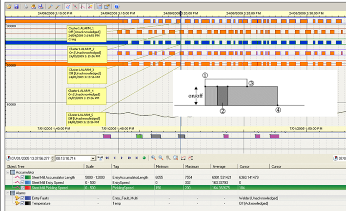</a> 

*Рис. 12.11.* Загальний вигляд Аналітика процесів в середовищі виконання

Кожен стан тривог (неактивна 4, активна непідтверджена 1, активна підтверджена (3), неактивна непідтверджена 2) відображається на панелі трендів у вигляді прямокутника певної висоти і контуру. Для аналогових тривог можна також змінювати колір для різної мітки. 

Окрім трендів, Citect має можливість з використанням спеціальних функцій відображати залежності у форматі графіку X від Y.

## 12.5. Підсистема трендів в SCADA zenon

У SCADA zenon трендовий сервер доступний як модуль Historian. Дані, які будуть записані в архів можуть бути доступні з інших модулів та засобів:

- Archive revision screen – перегляд та редагування трендового архіву у вигляді таблиці;  

- Extended Trend – перегляд трендового архіву у вигляді графіків трендів; 

- Report Generator – формування звітів за даними трендів;

- Report Viewer – формування простих звітів за даними трендів;

- zenon Analyzer – аналітичний модуль;

- data evacuation – перенесення даних;

- data export – експортування даних.  

Таким чином, у zenon підтримується класичний 2-етапний підхід до конфігурування підсистеми трендів – налаштування збереження та відображення. Тим не менше, явно виділеного сервера трендів у zenon немає, трендові функції є частиною SCADA серверу.  

Трендові дані зберігаються в архівах, для яких налаштовуються спільні властивості за способом збереження, періодичністю, місцем тощо. Historian підтримує так званий каскадний спосіб ведення архівів. Значення змінних пишуться в ***базові*** (base) архіви (Рис. 12.12,1). Тому при їх конфігуруванні користувач вибирає ті змінні, які він планує зберігати в даному архіві. Збережена історія в базових архівах може бути оброблена з використанням статистичних функцій підсумовування, усереднення, мінімуму і максимуму, а результат зберігатися в ***агрегованих архівах*** (aggregation archive). Глибина і періодичність записування для базового та агрегованого архівів налаштовується окремо. Таким чином, на дуже великих проміжках часу можна зберігати тільки статистичну інформацію, що значно зменшує час доступу до БД та обсяг цих даних.

<a href="media12/7_12.png" target="_blank">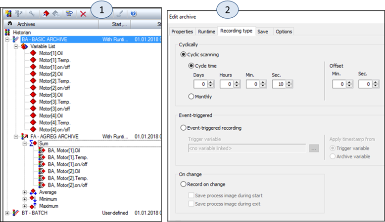</a> 

*Рис. 12.12.* Налаштування архівів в zenon: *1* – типи, *2* – налаштування подій записування

Запис даних в архів може відбуватися постійно, коли середовище виконання працює або проводитися за запитом користувача. Останнє дає змогу формувати записи тільки за необхідності, наприклад, за подією запуску установки і до її зупинки. 

Також zenon може зчитувати з ПЛК попередньо збережені там архіви. Це –архіви ***RDA*** (Real Time Data Acquisition), які потрібні в таких ситуаціях:

- за відсутності постійного зв’язку з ПЛК;

- за необхідності збереження даних в архіві з дуже маленьким проміжком часу, який неможливо зчитувати із заданою періодичністю; zenon дає змогу зчитувати змінні з періодичністю понад 100 мс (без урахування обмежень комунікацій).

Таким чином zenon буде зчитувати весь блок архіву при зміні значення вказаної змінної. 

Дані можуть бути записані в архів різними методами (див. Рис. 12.12,2): 

- циклічним (Cyclical): дані будуть писатися з указаною періодичністю;

- за тригером (Event-triggered): дані будуть писатися тоді, коли змінюється значення тригерної змінної (0->1); при цьому відмітку часу можна брати як із змінної, що пишеться, так і з тригерної змінної; 

- за зміною значення (On-change). 

SCADA zenon підтримує збереження даних в архівах різного типу (Рис. 12.13):

- у внутрішньому форматі (arx);

- текстовому (csv);

- dBase (dbf);

- XML-форматі;

- безпосередньо в базі даних SQL.

<a href="media12/7_13.png" target="_blank">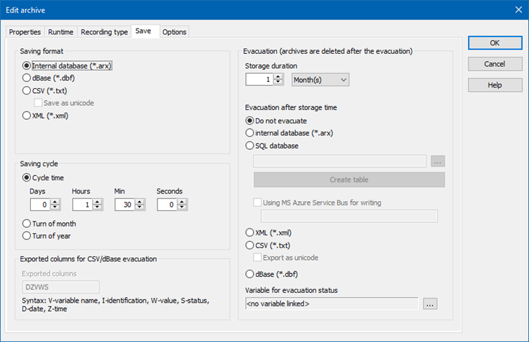</a> 

*Рис. 12.13* Налаштування формату збереження, евакуації та експорту архівів у zenon 

У налаштуваннях "Saving cycle" вказується, як часто буде створюватися новий архівний файл. Параметр "Storage Duration" у розділі "Evacuation" вказує на глибину архіву. Таким чином, кількість файлів буде рівною "storage duration", поділеною на "Cycle time". Старі файли zenon можна евакуювати, тобто перенести у вказане місце. При цьому дані можуть бути перетворені в формат SQL (у тому числі для розміщення в хмарному сервісі MS Azure), XML, CSV або dBase. 

Розміщення архівних файлів задається в налаштуваннях середовища виконання, що доступні у властивостях проекту.

Слід зазначити, що zenon пише не тільки значення змінної і відмітку часу, а й додаткові властивості тексту і біти стану змінної. Таким чином при перегляді історії можна побачити достовірність даних, причину зміни значення. 

SCADA zenon окремо підтримує lot-архіви (раніше називалися Batch-архівами). Це архіви, які запускаються і зупиняються користувацькою функцією під час відповідно початку та закінчення виробництва певної партії продукту. Назва партії означується спеціальною змінною (lot variable), за значенням якої можна буде зробити фільтрацію при вибірці необхідних трендових даних. Така організація архівування дає можливість швидко доступитися до даних конкретної партії продукту по її імені. 

Для перегляду трендових даних у zenon пропонується два типи екранів: 

- Archive revision – перегляд та редагування трендового архіву у вигляді таблиці;  

- Extended Trend – перегляд трендового архіву у вигляді графіків трендів . 

Процес створення цих екранів у zenon практично не відрізняється від створення інших спеціальних типів екранів: спеціальні елементи керування розміщуються за шаблоном. Інші налаштування проводяться при створенні функції виклику екрана.  Екран типу Archive revision надає можливість відобразити поля архіву у вигляді таблиці (Рис. 12.14). Такий вигляд може знадобитися не так для перегляду тенденції зміни, як для перегляду значень та статусів змінних. Статус вказує на причину зміни та якість змінної. 

<a href="media12/7_14.png" target="_blank">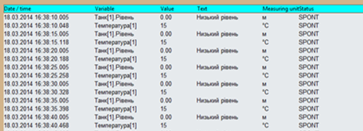</a> 

*Рис. 12.14*. Приклад елемента табличного перегляду Archive revision      

Екран Archive revision дає оператору можливість замінювати збережене в архіві значення або вставляти новий запис. Це може знадобитися, наприклад, у тому випадку, коли записуване значення не було достовірним і вимірювання проводилося іншими засобами, наприклад, неавтоматичними приладами. Тоді ці значення можна ввести пост-фактум. Звичайно, за таких можливостей оператори могли б "підмінити" архівні дані недійсними значеннями задля своєї мети. Однак, по-перше, в zenon є можливість обмежити доступ до цієї функції тільки авторизованим користувачам, по-друге, значення статусу для цього запису зміниться на MAN_VAL (Рис. 12.15).

<a href="media12/7_15.png" target="_blank">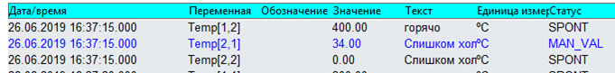</a> 

*Рис. 12.15.* Показ статусу у Archive revision.

Екран типу Extended Trend дає можливість відображати тренди у вигляді графіків (Рис. 12.16). 

<a href="media12/7_16.png" target="_blank">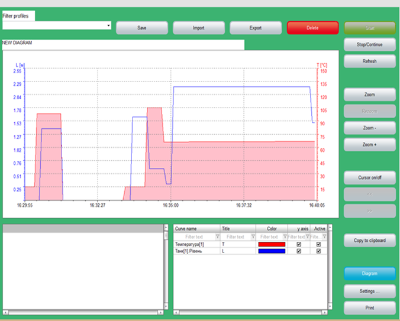</a> 

*Рис. 12.16.* Приклад екрану Extended Trend.

У zenon реалізовані достатньо потужні механізми відображення трендів, зокрема:

- налаштування всіх параметрів відображення як у середовищі розроблення, так і в середовищі виконання;

- відображення даних:
  - у реальному часі;

  - архівних з трендового архіву;

  - з блока;

- добавлення на тренд кривих реального часу та з архіву:

  - числових змінних;

  - дискретних змінних; 

- відображення кривої (curve) тренду у вигляді (Рис. 12.17):

  - ліній різного кольору, товщини та формату:неперервної, штрихової, пунктирної і т. п.;

  - заповненої області (area) із зазначенням прозорості;

  - інтерполяції даних;

  - відображення у вигляді діаграми Ганта;

  - відображення даних зі зміщенням;

- відображення та налаштування по осі Y для кожної кривої (Рис. 12.18):

  - сітки і поділок; 

  - лінійного або логарифмічного вигляду;

  - діапазону, можливість автомасштабування;

  - переміщення шкали по горизонталі в будь-якому місці діаграми;

- відображення та налаштування по осі X

  - сітки і поділок; 

  - перемотування вперед/назад;

- масштабування;

- відображення та керування курсором;

- виведення легенди з можливістю швидкої зміни основних властивостей кривих;

- збереження заданих налаштувань як профілю із зазначеним ім’ям для можливості відкриття налаштувань звичайним вибором;

- задавання необхідного діапазону часу для відображення (Рис. 12.19):

  - абсолютними величинами;

  - відносно плинного часу; 

- задавання фільтрів для відображення даних за ім'ям партії (lot).

Додатково Extended Trend має можливість відображати залежності X від Y у форматі графіка. 

Усі ці налаштування для Extended Trend і Archive revision можна провести кількома способами:

- при використанні функції відкриття екрана в середовищі розроблення;

- при відкритті екрана в середовищі виконання;

- за допомогою спеціальної командної кнопки в середовищі виконання.

Таки чином, у середовищі виконання оператор може налаштувати відображення трендів.

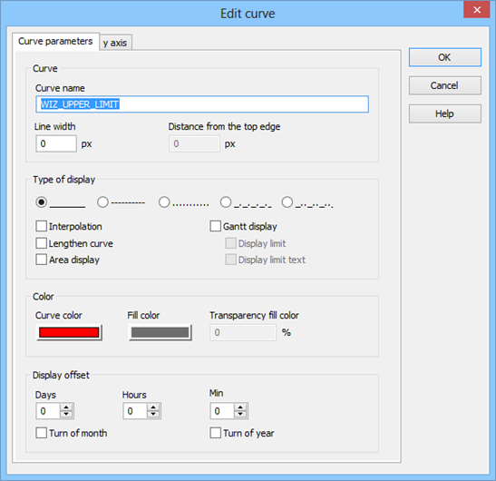

*Рис.12.17.* Налаштування кривої

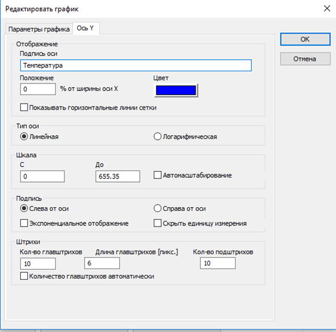

*Рис. 12.18.* Налаштування осі Y для кривої

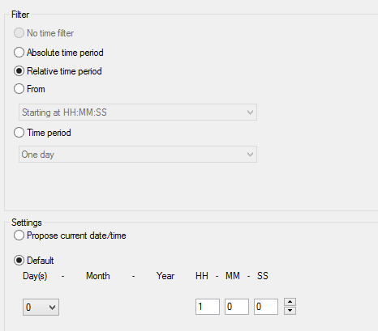

*Рис. 12.19.* Налаштування часу для відображення даних для Extended Trend і Archive revision

[<-- Лекція 11. Приклади розроблення тривог і подій в середовищах SCADA/HMI](lec11.md)

[--> Лекція 13. Підсистеми захисту, скриптів](lec13.md)

## Контрольні запитання 

1.    Що таке тренд? Чим відрізняються тренди реального часу від історичних?

2.    Які функції виконує підсистема трендів?

3.    Розкажіть про функціонування трендового контуру.

4.    Які функції серверної частини і клієнтської частини підсистеми трендів?

5.    Що необхідно сконфігурувати в серверній частині підсистеми трендів? Покажіть це на прикладі однієї із SCADA/HMI.

6.    Навіщо визначати для трендів періодичність записування та глибину збереження? Як пов’язані ці властивості та яким чином їх вибирати/розраховувати? Покажіть це на прикладі однієї із SCADA/HMI.

7.    За якими подіями може відбуватися записування значень змінних в історію? 

8.    Які формати даних може підтримувати SCADA-програма для записування трендових архівів? На що це впливає? Покажіть це на прикладі однієї із SCADA/HMI.

9.    Розкажіть про особливості формування відмітки часу в трендових архівах.  

10.    Розкажіть про можливості переглядачів трендів (самописців). Покажіть це на прикладі однієї із SCADA/HMI.

11.    Як показуються змінні на самописцях і як їх відрізняти між собою? Покажіть це на прикладі однієї із SCADA/HMI.

12.    Які інструменти, як правило, доступні для визначення значення змінної в конкретній точці? Покажіть це на прикладі однієї із SCADA/HMI.

13.    Що, як правило, треба означити для переглядачі трендів? Покажіть це на прикладі однієї зі SCADA/HMI.

14.    Яка функціональність доступна через групу кривих? Покажіть це на прикладі однієї із SCADA/HMI.

<iframe width="400" height="225" src="https://www.youtube.com/embed/Ir5XyD6KDiw" title="YouTube video player" frameborder="0" allow="accelerometer; autoplay; clipboard-write; encrypted-media; gyroscope; picture-in-picture" allowfullscreen></iframe>

<iframe width="400" height="225" src="https://www.youtube.com/embed/dk7R8Nf_wjg" title="YouTube video player" frameborder="0" allow="accelerometer; autoplay; clipboard-write; encrypted-media; gyroscope; picture-in-picture" allowfullscreen></iframe>

<iframe src="https://www.slideshare.net/slideshow/embed_code/key/ksVBIvtS8SV6Yf" width="597" height="486" frameborder="0" marginwidth="0" marginheight="0" scrolling="no" style="border:1px solid #CCC; border-width:1px; margin-bottom:5px; max-width: 100%;" allowfullscreen> </iframe> <div style="margin-bottom:5px"> <strong> <a href="https://www.slideshare.net/pupenasan/ss-239473759" title="Розроблення підсистеми трендів" target="_blank">Розроблення підсистеми трендів</a> </strong> from <strong><a href="https://www.slideshare.net/pupenasan" target="_blank">Пупена Александр</a></strong> </div>

