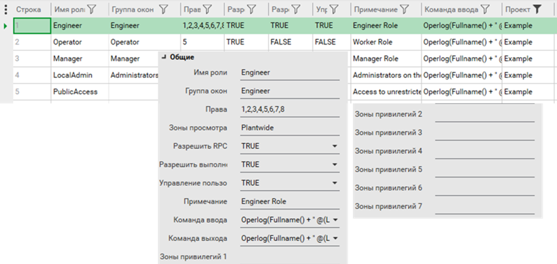
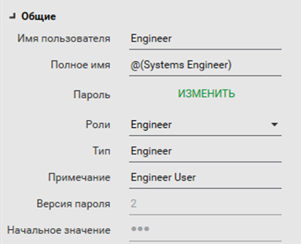
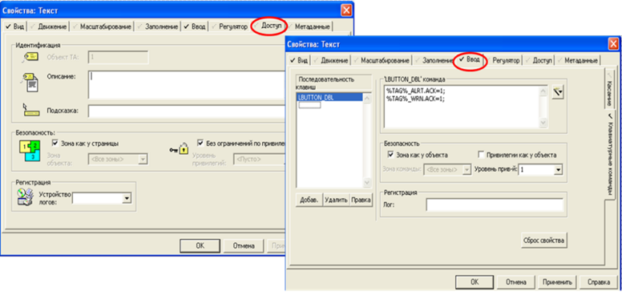
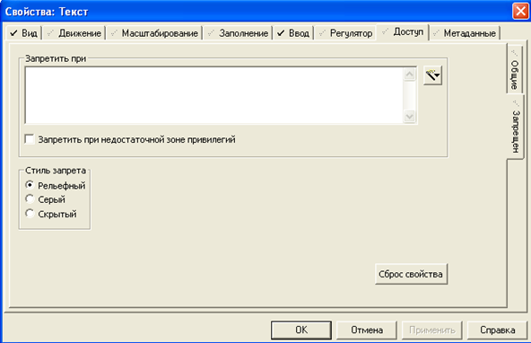
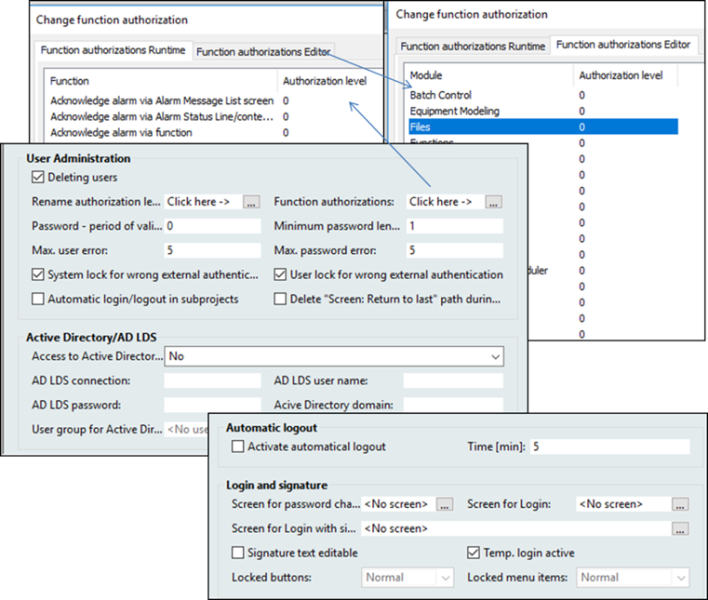
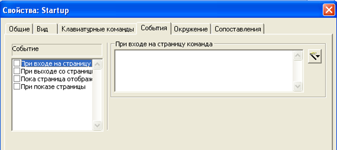

[Людино-машинні інтерфейси](https://pupenasan.github.io/hmi/)  Автор і лектор: Олександр Пупена доц. кафедри [АКСТУ НУХТ](http://www.iasu-nuft.pp.ua/) 

# Лекція 13. Підсистеми захисту, скриптів

## 13.1. Підсистема керування доступом

### Загальні підходи до керування доступом 

Підсистема керування доступом передбачає наявність в SCADA/HMI ***користувачів*** (users), які розділені за правами доступу до об’єктів системи та їх адміністрування. Це потрібно:

- для захисту від несанкціонованих дій;

- надання користувачам інтерфейсу відповідно до їх ролей;

- збереження записів у журналі дій конкретного користувача. 

У стандарті ISA-101 описано тільки частину функцій та вимог до підсистеми. Враховуючи, що керування доступом має безпосереднє відношення до кібербезпеки, ці функції детально описані в стандартах IEC 62443, зокрема в частині 2-1. Далі розглянемо підсистему з точки зору цих двох стандартів, а також функції блокування, після чого зупинимося на їх реалізації в різних SCADA/HMI. 

У стандарті ISA-101 вказано, що при розробленні ЛМІ необхідно визначитися з типами користувачів, які будуть ним користуватися, та вимогами до них. Кожен користувач або тип користувача відповідно до своєї окремої ролі може мати різні привілеї та рівні доступу до окремих дисплеїв, діагностичних можливостей та інших функцій ЛМІ. Ролі та обов'язки можуть відрізнятися залежно від галузі та від конкретного об'єкта. Прикладом таких типів користувачів можуть бути:

- операційний персонал (оператори процесу): здійснюють моніторинг і виконують керування та експлуатацію установки чи інших засобів виробництва; сюди можуть входити як оператори центрального пункту керування, так і операційний персонал, що користується і віддаленим доступом, і доступом з портативних пристроїв;

- персонал з технічного обслуговування (Maintenance-users): усувають несправності та/або виконують технічне обслуговування приладів, виконавчих механізмів, регулюючих органів, насосів, двигунів і т.п.;

- інженери (Engineering-users): виконують модифікації, доповнення або видалення компонентів HMI або системи керування;

- адміністратори: виконують оновлення системи керування, призначають правила безпеки іншим користувачам;

- керівники, менеджери: здійснюють моніторинг функціонування установки чи інших засобів виробництва;

- аналітики: здійснюють моніторинг системи для поліпшення роботи установки;

- інші користувачі: використовують або взаємодіють із системою для інших цілей, наприклад, персонал з керування якістю.

Операційний персонал належить до так званих ***первинних користувачів*** (primary users), інші, що забезпечують обслуговування та моніторинг, – до ***вторинних користувачів*** (secondary users). Для кожного типу визначаються вимоги до користувачів та набір завдань, які вони виконують, з урахуванням:

- дій користувача при нормальних та ненормальних умовах експлуатації;

- потреби в довідковій системі для користувача (онлайн або офлайн);

- вимог, що стосуються ролей користувача та привілеїв облікового запису;

- термінології, що використовується користувачем, моделі об'єкта та/або процесу з точки зору користувача;

- потреби функцій HMI для користувача.

Важливо зазначити, що задоволення потреб вторинних користувачів не повинно перешкоджати виконанню вимог користувачів первинних. У випадках, коли потреби занадто різноманітні, щоб бути ефективними на одному дисплеї або їх сукупності, слід створити окремі дисплеї для підтримки потреб вторинних користувачів.

Користувачі можуть доступатися як з локальних терміналів (***локальні користувачі***, local user), так і з консолі, що знаходиться за межами охоронного периметра виробничої площадки (***віддалені користувачі***, remote user). У проекті можуть бути передбачені більші обмеження доступу віддалених користувачів порівняно з локальними. 

Вимоги до ЛМІ можуть бути означені у вигляді окремого документа або як частина вимог до функцій системи керування чи застосування (наприклад, як це означено в ANSI/ISA-5.06.01-2007). Загальні вимоги до керування доступом на рівні АСКТП означено в стандарті IEC 62443-2-1, нижче розглянемо ці вимоги детальніше. 

Згідно IEC 62443-2-1, ***керування доступом*** – це метод керування тим, хто чи що може отримати доступ до приміщень та систем та який саме тип доступу дозволений. Доступ облікового запису (access account) – це функція керування, що дає користувачеві змогу отримати доступ до певного набору даних або функцій певного устатковання. Облікові записи пов’язуються з ідентифікаторами користувачів (ідентифікаторами) та паролями. Ці ідентифікатори та паролі користувачів можуть бути пов’язані з окремою особою або групою осіб, такими як робоча група диспетчерської, що виконує той самий набір операційних завдань.

Є три ключові аспекти, пов’язані з керуванням доступом: 

- адміністрування облікових записів (account); 

- автентифікація; 

- авторизація.

Адміністрування передбачає керування обліковими записами щодо автентифікації та авторизації. Автентифікація забезпечує перевірку дійсності (автентичності) користувача, а авторизація надає йому певні права залежно від наданих йому ролей. 

У рамках кожного з трьох аспектів керування доступом повинні бути встановлені правила, які підтверджують, що доступ користувача до систем і даних контролюються. Правила зазвичай повинні застосовуватися до ролей та груп користувачів. Вони повинні мати доступ до систем і даних, які необхідні тільки для задоволення означених цілей. 

Існують правила, які застосовуються в адміністративному порядку, і ті, які застосовуються автоматично за допомогою використання технологій. Обидва види правил повинні розглядатися як частина загальної стратегії керування доступом. Наприклад, адміністративне правило організації може передбачати видалення облікового запису співробітника або підрядника після його виходу з організації. Прикладом застосування правила, що стосується технологій, є вимога підключення віддалених користувачів виключно через VPN.

Щоб забезпечити загальну структуру безпеки для системи, на додаток до правил існують фізичні процедури безпеки та кібербезпеки, які працюють разом. Процедури фізичної безпеки включають такі заходи, як замикання кімнат, де знаходиться устатковання інтерфейсу користувача. Детальніше про ці процедури описано в стандарті IEC 62443-2-1. Основні аспекти кіберзахисту наведені в розділі 9.5 посібника.

### Адміністрування облікових записів

***Адміністрування облікових записів*** – це метод, пов’язаний із наданням та відкликанням доступу до облікових записів та підтримкою дозволів і привілеїв, передбачених цими обліковими записами, для доступу до певних ресурсів та функцій у фізичних приміщеннях, мережі чи системі. 

Адміністрування облікового запису в середовищі АСКТП виходить за рамки традиційного ІТ-ного означення доступу в операційній системі. У середовищі АСКТП облікові записи більше обмежуються набором дозволених функцій, які користувачі можуть виконувати, а не доступом до даних. 

Доступ облікових записів до функцій може ґрунтуватися за функціональною або рольовою ознакою і може бути означеним для осіб, груп осіб, які діють як команда, або для пристроїв, що забезпечують функцію. У стандарті вказані такі рекомендації щодо адміністрування:

- права доступу повинні встановлюватися відповідно до політик безпеки, що повинні бути попередньо розроблені для всієї системи;

- правила доступу повинні бути донесені до всього персоналу;

- права доступу можуть бути означені як для команди, так і індивідуально для користувача; 

- доступ надається, змінюється або припиняється за дорученням відповідальної за адміністрування особи, яка може відрізнятися від адміністратора IT та обізнана в процесах операційної діяльності; 

- повинен вестися облік усіх дій щодо доступу до облікового запису;

- якщо облікові записи не потрібні (наприклад, при звільненні працівника), їх слід призупинити або видалити;

- користувачам мать бути призначені мінімальні права і повноваження, необхідні для виконання тільки їх завдань;

- облікові записи необхідно регулярно переглядати: чи використовується, роль і потреби все ще актуальні, користувач має тільки мінімально необхідні дозволи;

- перед уведенням системи керування в дію паролі за замовченням повинні бути змінені, оскільки вони можуть бути легко визначені з доступних джерел;

- відповідність облікових записів політиці адміністрування необхідно періодично перевіряти;

- доступ повинен контролюватися відповідним методом аутентифікації: тобто ID користувача і паролем, персональними ідентифікаційними номерами (PIN) або токенами; 

- особисті дані користувача не повинні передаватися будь-кому, за винятком особливих ситуацій; один особливий випадок – у диспетчерській, де оператори працюють як одна робоча група або команда;

- повинен бути механізм альтернативного процесу ідентифікації в разі втрати облікових даних або забутого пароля

Слід зазначити, що на практиці підсистема організації доступу в системах SCADA/HMI є відокремленою та незалежною від системи керуванням доступу самої операційної системи. Тим не менше, в багатьох сучасних SCADA/HMI продуктах є опція з інтеграції із системою керування доступом операційної системи, але зазвичай така інтеграція не використовується. Це може призводити до випадків, коли оператор працює під своїм "обмеженим" обліковим записом у SCADA/HMI, але в той самий час має права локального адміністратора в операційній системі. Інколи буває і навпаки – інженерний персонал отримує набір логінів та паролів від розробників проекту, включно із адміністраторським, але коли настає час вносити зміни до конфігурації проекту, виявляється, що ніхто не має даних облікового запису локального адміністратора ОС.

Крім того, однією з важливих функцій системи керування доступом у SCADA/HMI є обмеження доступу до функцій консолі операційної системи. Саме тому у SCADA/HMI продуктах різних вендорів наявні функції:

- блокування виходу із повноекранного режиму на "робочий стіл"; 

- блокування системних комбінацій клавіш, наприклад CTRL+ALT+DEL; 

- блокування системних кнопок "Windows";

- інші блокування виходу в ОС;

- обмеження доступу до функцій запуску прикладних програм зі SCADA. 

З тією самою метою розробники інколи блокують доступ до деяких функцій та комбінацій клавіш у реєстрі або навіть прописують виконавчий файл SCADA/HMI системи замість shell. У кожного розробника свої методи боротьби з хитрощами операторів, але в будь-якому разі на ці питання слід звертати увагу при адмініструванні.

Серед системних комбінацій клавіш виділимо найбільш вживані, які є сенс блокувати:

- Alt + Esc – переключення до наступного застосунку;

- Alt + Tab – пряме переключення між відкритими застосунками; 

- Alt + Shift + Tab – зворотне переключення між відкритими застосунками;

- Ctrl + Tab – переключається до наступного вікна всередині того самого застосунку, але може бути переназначено всередині застосунку;

- Ctrl + Esc – виклик меню "Пуск";

- Alt + F4 – закриття застосунку; 

- Ctrl + F4 – закриття вікна всередині застосунку; 

- Ctrl + Shift + Esc – запуск диспетчера задач Windows; 

- Windows key – виклик меню "Пуск"; 

- Windows key + D – мінімізація/максимізація всіх вікон; 

- Windows key + E – відкриття провідника Windows; 

- Windows key + F – відкриття вікна пошуку; 

- Windows key + M – мінімізація всіх вікон представлених у панелі задач; 

- Windows key + P – переключення в режим презентації; 

- Windows key + R – запуск вінка виконання (запуску програми); 

- Ctrl+Alt+Del - вікно переривання; 

- Windows key + L – блокування робочого столу. 

### Автентифікація

***Автентифікація*** (authentication) – міра безпеки, розроблена для встановлення дійсності (автентичності) передачі, повідомлення чи джерела, або засоби перевірки дозволу особи на отримання конкретних категорій інформації. Автентифікація є обов’язковою умовою для надання доступу до ресурсів системи. 

Необхідно враховувати, що на відміну від автентифікації в ІТ-системах, відсутність доступу до ресурсів у критичні моменти часу може призвести до небезпечних та аварійних ситуацій. З цих же причин у системах АСКТП необхідно дуже обережно ставитися до блокування облікових записів при невдалих входах у систему або періодах бездіяльності. З іншого боку, недостатньо сильна автентифікація може сприяти надаванню доступу зловмиснику для виконання небезпечних операцій.

Існує кілька типів стратегій автентифікації, і кожна має різний ступінь міцності. Сильні методи автентифікації - це ті, які є досить точними в правильній ідентифікації користувача, слабкі – ті, які легко анулювати, щоб забезпечити небажаний доступ до інформації. Прикладом слабкої автентифікації є ідентифікація за користувачем та паролем. Приклади сильної автентифікації:

- використання двофакторної автентифікації, в якій потрібна фізична карта та пароль (PIN-код);

- використання смарт-карт або біометричних даних;

- автентифікація користувачів на основі їх місцезнаходження;

- при підключенні модемів до промислових пристроїв керування використання функцій зворотного виклику для попередньо вказаного телефонного номера;

- підключення домашніх комп'ютерів до пристроїв або мереж керування виробничою діяльністю з використанням VPN і двофакторної автентифікації з використанням токена і PIN-коду. 

Враховуючи наявність ширших привілеїв у користувачів з правами адміністрування/конфігурування, вимоги до їх автентифікації більш жорсткі.

Фізичне розташування користувача може мати істотний вплив на ризик доступу до АСКТП. Наприклад, користувач, що підключається до системи зсередини будівлі (локальний користувач), в якій є охорона і система зчитування електронних посвідчень на вході, створює менший ризик, ніж користувач, що підключається з якоїсь іншої точки світу (віддалений користувач). Тому для користувачів, що мають доступ віддалено, означуються жорсткіші вимоги. У системах АСКТП великий акцент робиться на поєднання заходів фізичної та електронної автентифікації. 

Окрім автентифікації самих користувачів, в АСКТП при зв’язку між собою різних підсистем також повинна використовуватися автентифікація. Це потрібно для неможливості підроблення повідомлень сторонніми особами та засобами.

Слід зазначити, що вимоги до автентифікації (відповідно до локальних політик безпеки) сильно залежать від особливостей системи керування та об’єкта. У IEC 62443-2-1 вказані такі рекомендації щодо автентифікації:

- повинна бути розроблена стратегія автентифікації, в якій вказуються використовувані методи автентифікації;

- перед використанням застосунків, у тому числі SCADA/HMI, користувачі повинні пройти автентифікацію; це може проводитися з використанням комбінації фізичних та електронних засобів; 

- усі спроби та результат доступу до критичних систем повинні бути записані в журнал;

- для автентифікації адміністраторів (підвищені права): 
  - вимоги до автентифікації повинні бути більш жорсткими (наприклад, тільки складні паролі); враховуючи що адміністрування не потребує швидкої реєстрації, можна використовувати складні способи автентифікації; 

  - рекомендується надавати системному адміністраторові тільки локальний доступ; 

- для автентифікації локальних користувачів (що працюють у межах будівлі системи керування):

  - враховуючи можливість командної роботи та необхідність швидкого доступу до дій у критичних ситуаціях, необхідно передбачити обмеження фізичного доступу до SCADA/HMI (охоронні системи);

  - для швидкої автентифікації можуть використовуватися: для компонентів керування фізичні ручні замки; автоматичні замки (карта-пропуск); доступ до пунктів керування;

  - система повинна враховувати можливість доступу до критичних функцій користувачам навіть при частковій відмові інфраструктури; наприклад, при відмові комп’ютерної мережі повинні працювати локальні засоби керування; 

  - не повинні блокуватися при невдалих спробах автентифікації (у критичних ситуаціях оператор може ввести неправильний пароль);

  - у багатьох випадках не бажано вимагати складних паролів, оскільки в критичних ситуаціях це може уповільнити процес реалізації керуючої дії оператора на процес;

  - у багатьох випадках не бажано вимагати часового обмеження на паролі; 

- для автентифікації віддалених користувачів (що мають доступ ззовні будівлі або області керування):

  - повинні застосовуватися особливі способи автентифікації;

  - повинні бути передбачені особливі політики (реакція на невдалу спробу входу в систему, період бездіяльності тощо);

  - рекомендується, щоб надавався доступ тільки з функціями моніторингу без можливості керування; однак у деяких випадках системи SCADA доступ до керування обов’язковий; 

  - після певної кількості невдалих спроб реєстрації віддалених користувачів, система повинна відключати їх обліковий запис на деякий час (захист від злому паролю); однак у деяких випадках системи SCADA доступ до керування може бути критичним, так само як і для локального користувача;

- після певного часу неактивності користувача система може вимагати повторної автентифікації;

- система повинна передбачати відповідні схеми автентифікації при зв’язку між застосунками або пристроями, наприклад: за адресою IP або/та MAC; секретним кодом; криптографічним ключем (детально в IEC/TR 62443-3-1).

### Авторизація

***Авторизація*** (уповноваження, authorization) – право або дозвіл, що надається системній сутності для доступу до системного ресурсу. Після успішної автентифікації користувача та ідентифікації пов’язаного з ним облікового запису йому надаються привілеї доступу до ресурсів. Надані пільги визначаються конфігурацією облікового запису, встановленого на етапі адміністрування в бізнес-процесі.

Деякі стандартні процедури авторизації, що застосовуються в ІТ, можуть бути невідповідними або неадекватними для АСКТП. Наприклад, доступ облікових записів у типовій ІТ-системі в основному базується на користувачі з обмеженою кількістю присвоєних ролей (тобто стандартним користувачем або системним адміністратором). Кожному користувачеві зазвичай присвоюється лише одна роль. Доступ облікових записів у типовій системі АСКТП в основному буде ґрунтуватися на більшій кількості ролей (наприклад, оператор, інженер, технолог, розробник, системний адміністратор тощо). Користувачам може бути назначено декілька ролей на основі певних функцій, які потрібно виконувати в певний час. Користувачеві, можливо, доведеться увійти до певного пристрою та окремо в застосунок, який матиме дозвіл на внесення змін до змінних керування. Або користувачеві, можливо, доведеться вийти із системи та повторно увійти, щоб виконати завдання системного адміністрування на тому самому пристрої.

Авторизація означує засоби керування, спрямовані на захист інформації та активів від навмисного та ненавмисного руйнування, зміни чи виявлення. Вона спеціально зосереджена на заходах, розроблених для забезпечення доступу автентифікованих агентів до необхідних інформаційних ресурсів. Як і при автентифікації, авторизація залежить від місця розташування користувача.

У IEC 62443-2-1 вміщені такі рекомендації щодо авторизації:

- правила, що означують привілеї, якими уповноважені облікові записи для різного персоналу повинні бути означені в політиці безпеки авторизації;

- дозвіл на доступ до засобів АСКТП може бути логічним (правила, що надають або забороняють доступ відомим користувачам на основі їх ролі), фізичним (замки, камери та інші елементи керування, що обмежують доступ до активної консолі ПК) або їх комбінацією;

- для керування доступом до відповідної інформації або системи облікові записи повинні базуватися на основі ролі; 

- для віддаленого доступу необхідно передбачати різне розміщення процедур авторизації: 

  - на рівні застосунку;

  - на рівні пристрою: для кожного пристрою можуть бути означені конкретні правила авторизації; 

  - на рівні бар’єрного мережного пристрою АСКТП (брандмауер або маршрутизатор): після автентифікації залежно від ролі надається доступ до конкретних пристроїв у мережі АСКТП; 

- віддалений доступ дозволяти тільки за потреби;

- рольові облікові записи повинні враховувати фізичне розміщення користувача: різний набір ролей для локального та віддаленого входу;

- у критичних середовищах керування для обмеження доступу до АСКТП слід використовувати декілька методів авторизації. 

Правила авторизації описують, яким чином назначаються ролі певним користувачам або групам користувачів і як налаштовуються привілеї для цих облікових записів. Здатність реалізувати бажану політику авторизації залежить від особливостей інструментальних засобів систем керування розрізнення функцій та даних, необхідних для різних робочих ролей. Таким чином, означення політики авторизації є ітераційною процедурою, в якій організація означує ідеальну політику, а потім визначає, наскільки повно це можна реалізувати, використовуючи можливості своїх систем та мережі. При закупівлі нової системи підтримка потрібної політики авторизації може бути елементом специфікації закупівель. Розроблюючи нову мережну конфігурацію, такі технології, як брандмауери для віддалених користувачів, можуть бути додані для створення додаткового рівня авторизації критичних пристроїв.

Взагалі до всіх інструментальних засобів SCADA/HMI характерні такі властивості підсистеми керування доступом:

- для забезпечення авторизації необхідно виділяти рівні прав або привілеїв, що задаються для елементів, на які необхідно обмежити доступ;

- для забезпечення авторизації необхідно виділяти групи (категорії) користувачів, які мають однакові права (ролі), що спрощує адміністрування, шляхом надання обліковому запису певних ролей;

- для забезпечення адміністрування має бути можливість створювати та редагувати користувачів не тільки в середовищі розроблення, але й у середовищі виконання; 

- можливість інтегрування зі службами керування користувачами операційної системи (наприклад Windows Active Directory);

- для автентифікації можливість входу користувача за допомогою різних засобів – як з використанням імені та паролю, так і інших (карт, біометричних сканерів і т.п.); 

- можливість користувача тимчасово входити в систему (тимчасово змінювати роль), тобто користувач з вищими правами може зареєструватися тільки на час виконання однієї дії;

- можливість обмежувати вміст на основі місцезнаходження (користувач з віддаленого засобу ЛМІ може мати менше прав);

- можливість примітки автентифікації, тобто вимога до користувача додати причину для керуючої дії;

- можливість задавати час простою, після якого система автоматично виведе користувача із системи. 

### Блокування доступу за умовами

Окрім обмеження доступу до елементів за привілеями, інколи необхідно блокувати можливість зміни значення чи відправки команд при виконанні (або невиконанні) певних умов. 

Наприклад, оператор не повинен мати можливість викликати команду запуску, якщо лінія при цьому не готова. Слід розуміти, що блокування запуску повинно відбуватися на рівні ПЛК або інколи навіть на рівні СПАЗ (системи протиаварійного захисту) чи релейних схем. На противагу до цього на рівні HMI вирішується питання відображення наявності блокування. Іншими словами, блокування ручного керування більше потрібне для того, щоб оператор розумів, що дана команда йому зараз недоступна за певних причин, або для неможливості переходу на невикористовуваний у даний момент дисплей. Ішим прикладом блокування є деактивація певних пунктів меню навігації, які наразі недоступні.

Візуально блокування може бути показане зміною кольору або додатковими символами. 

## 13.2. Підсистема керування доступом у Citect

У Citect поняття облікового запису немає, зрештою воно ототожнюється з поняттям користувача. Можливості користувачів (авторизація) задаються через приналежність до ролі, в якій вказуються набір привілеїв (Privilege) у певних виробничих зонах (Area). Роль повністю означує права, що має користувач, якому ця роль призначена. Ролі базуються на розділенні процесу згідно з:

- ***виробничими зонами*** (Area), за допомогою яких вказується область процесу, до якого користувач має право доступу;

- привілеями (***Privilege***), за допомогою яких вказується рівень доступу до кожного елемента в межах зони. 

Таким чином, при створенні користувача йому призначають роль, яка надає йому певні права в певній зоні (області) процесу. За замовченням, якщо користувач не зареєструвався, привілеї та зона для нього рівні 0.

Приклад розділення процесу (виробництва) на зони показано на Рис. 13.1. Згідно з цим рисунком, у зоні 9 користувачі з указаними правами можуть доступатися для керування, а в зонах 10–12 – тільки для контролю. Розділення технологічного процесу (виробництва) на зони використовується разом з означенням привілей для обмежень доступу в клавіатурних командах, тривогах, об’єктах, звітах і т.д. 

                               

*Рис. 13.1.* Приклад ділення процесу на зони

Зони призначені для розділення прав доступу в різних частинах процесу або виробництва, а привілеї стосуються можливостей оператора в межах цих зон. У Citect користувачам можуть бути призначені до 8-ми привілеїв (1..8). За замовченням, номери привілеїв є рівнозначними, тобто користувач тільки з привілеями 8 не має доступу до об’єктів з привілеями 1–7. Через параметр `[Privilege]Exclusive=0` можна призначити ієрархічність привілеїв (8-й має усі привілеї). Окрім привілеїв у межах зон, в ролях можна призначити глобальні привілеї, які діють у межах усіх зон.

Таким чином, у межах проекту створюються ролі, в кожній з яких вказуються зони та привілеї. На Рис. 13.2 показано форму налаштування ролей. У полі "Privileges" **(**рос. лок."Права") вказуються номери привілеїв, які діють в усіх зонах. У полі "View Areas" (рос. лок."Зоны просмотра") вказуються номери зон, які доступні користувачеві з цією роллю тільки для перегляду. Для кожного привілею можна назвати зони, в яких вони діють "Priv1 Areas" (рос. лок."Зона привилегий 1"… "Зона привилегий 8"). Поля Entry Command (рос. лок."Команда ввода") та Exit Command (рос. лок."Команда выхода") дають можливість вказати команди Cicode, які будуть запускатися при реєстрації та виході користувача із системи, відповідно. Якщо виставлена опція "Manage Users", користувачі з даною роллю можуть керувати користувачами в режимі виконання (додавати, змінювати та видаляти). Для можливості запуску застосунків з використанням функції "Exec" повинна бути активною властивість "Allow Exec" (рос. лок. "Разрешить выполнение"), а для функцій MsgRPC та ServerRPC – "Allow RPC" (рос. лок. "Разрешить RPC"). 

 

*Рис. 13.2.* Налаштування ролей

SCADA Citect дає можливість інтегрувати підсистему користувачів Windows зі своєю підсистемою доступу. Для цього в полі Windows Group (рос. лок. "Группа окон" J) вказується ім’я групи користувачів та налаштовується параметр [Client]AutoLoginMode. 

При створенні користувачів Citect (Рис. 13.3), окрім паролю і ролі, можна задати тип. Цей тип можна використовувати при створенні користувачів у режимі виконання (функція UserCreate), де в якості шаблону нового користувача будуть використовуватися налаштування конкретного користувача.

 

*Рис. 13.3.* Налаштування користувачів

Для означення прав доступу до елементів для кожного з них можна призначити рівень привілеїв та зону. Наприклад, для графічних елементів це робиться на закладці "Доступ->Общие" (Рис. 13.4). За необхідністю можна означити інші привілеї та зону для кожної дії. 

 

*Рис. 13.4.* Налаштування доступу для елементів

На закладці "Доступ->Запрещен" можна вказати умову блокування (заборони) доступу до елемента та зовнішній вигляд при забороні (Рис. 13.5). 

 

*Рис. 13.5.* Налаштування блокування доступу

Вхід та вихід користувачів реалізується через функції Cicode та шаблони. Одночасно з реєстрацією користувача вказується мова, яка буде використовуватися в системі. Усі дії з користувачами фіксуються в журналі. Шаблони Citect також надають можливість редагувати існуючі та створювати нові користувачі в режимі виконання через меню користувачів. Зрештою це робиться через CiCode функцію UserCreate. Це можуть робити тільки користувачі з зазначеними правами "Manage Users" (див. Рис. 13.2).

Citect має багато функцій керування користувачами, деякі з них наведені нижче:

- Login – вхід користувача з вказаним іменем, паролем та мовою;

- LoginForm – відображення форми входу користувача в систему; 

- Logout – вихід користувача із системи;

- LogoutIdle – час простою, після якого користувач покине систему автоматично;

- UserCreate – створення нового користувача;

- UserCreateForm – відображення форми створення нового користувача;

- UserEditForm – відображення форми редагування користувача.

Таким чином, якщо необхідно реалізувати автоматичний вхід у систему користувача через певний ідентифікатор, це можна зробити через події та функцію Login. 

Додатково до адміністрування користувачів Citect передбачає захист підключення клієнта до сервера, для чого в майстрі налаштування комп’ютера вказується пароль підключення. Також у цьому майстрі можна налаштувати повноекранний режим, який не дає перейти на робочий стіл, використовуючи кнопки керування заголовка вікна (згорнути, закрити). Тут також можна налаштувати блокування комбінації "ALT+SPACE", яка передбачає виклик контекстного меню активного вікна. Інші комбінації, наприклад "Alt-Escape", "Ctrl-Escape" чи "Alt-Tab", необхідно блокувати іншими засобами, наприклад, правкою ключів реєстру Windows або спеціальними утилітами. 

## 13.3. Підсистема керування доступом у SCADA zenon

У SCADA zenon керування доступом реалізоване як для об’єктів середовища виконання, так і для функцій середовища розроблення. Права доступу останніх конфігуруються в середовищі розроблення, а адміністрування користувачів можна робити як у середовищі розроблення, так і в середовищі виконання. У SCADA zenon використовується поняття "користувач". 

Для того щоб при перенесенні налаштування користувачів середовища розроблення не замінювали існуючі в середовищі виконання, необхідно в налаштуваннях проекту "Runtime Changeable Date" для параметра "User Administration" поставити значення "Do not generate and transfer" (не генерувати і не переносити). SCADA zenon дає змогу переносити налаштування "User Administration" із середовища виконання в середовище розроблення. 

Користувач може входити через zenon або через Windows Active Directory (***AD***). 

Концепція адміністрування передбачає, що різні користувачі мають різні операційні права (рівні дозволів та функційні дозволи). Кожному користувачеві може бути призначено кілька різних рівнів дозволів (авторизаційних рівнів, authorization level), що мають значення від 0 до 127 (Рис. 13.6). Незареєстрований у системі користувач має 0-й рівень дозволів. Користувачам можна присвоїти кілька рівнів дозволів, видавати їх можуть тільки адміністратори, які також мають доступ до цих рівнів. 

 

*Рис. 13.6.* Налаштування користувачів в zenon

Крім рівнів дозволів, користувачам надається один із трьох типів (User Type на Рис. 13.6):

- User (користувач): можуть здійснювати дії відповідно до рівнів дозволів, які йому призначені; 

- Power user (досвідчений користувач): може також створювати та редагувати користувачів; 

- Administrator (адміністратор): може також проводити інші адміністративні задачі, такі як відміна блокування користувача, скидування паролю, і т.ін. 

Код входу (Login code) дозволяє входити користувачеві через функцію “Login without password” (описано нижче). Налаштування рівнів дозволів можна проводити через групи (Users Group), куди потім можна добавляти користувачів, які будуть отримувати ті самі дозволи. Користувачі Windows, що входять до груп Windows AD з тією самою назвою, що й Users Group zenon, матимуть такі права, як у групи. 

Для адміністрування користувачів у середовищі виконання можна скористатися функціями та екранами. Доступні такі спеціальні типи екранів: 

- User list: надає функції редагування, як у середовищі розроблення з розділу Users;

- User group list: надає функції редагування, як у середовищі розроблення з розділу User groups;

- Edit user: дозволяє редагувати користувачів zenon; 

- Active Directory user administration: дозволяє редагувати користувачів Windows Active Directory .

SCADA zenon, підтримує ряд функцій роботи з користувачами (Рис. 13.62,1):

- Login with dialog: відкриває діалог для реєстрації;

- Login without password: дозволяє зареєструвати користувача без діалогу; 

- Logout: вихід активного користувача, надається рівень дозволів 0; 

- Change user: відкриває діалог редагування користувачів та груп;

- Change password: відкриває діалог зміни пароля.

Використовуючи функцію “Login without password”, можна під час виконання увійти в систему користувачу без введення паролю у форму. Це необхідно в тому випадку, якщо ідентифікація відбувається через якісь спеціальні засоби, наприклад, чіп, сканер, пристрій зчитування карт і т.п, або за виконанням якоїсь події. Вхід через автоматичні засоби реєстрації у zenon може проводитися через передачу коду входу змінною "Login code from variable" або імені користувача через змінну "User name from Variable" (Рис. 13.7,2). У першому випадку (ця версія доступна лише для користувачів zenon) реєстрація відбувається шляхом передачі змінною коду користувача "Login code" (див. Рис. 13.6). Код користувача повинен бути унікальним у проекті, так як по ньому йде його ідентифікація. У другому випадку (доступно для користувачів zenon та Active Directory) реєстрація відбувається через систему ідентифікації чіпу (типу Eucher або Keba), в якій ім'я користувача передається змінною. Слід зазначити, що ці змінні, які містять ім’я користувача можуть зчитуватися через вбудовані драйвери zenon (Eucher, Keba). У цьому випадку можна налаштувати матрицю реакції, яка при зміні змінної викличе функцію “Login without password” 

 

*Рис. 13.7.* Перелік функцій (1) та налаштування функції входу без пароля (2) 

Користувачі реєструються в системі (автентифікація) з використанням функцій та екранів реєстрації. Якщо необхідно входити автоматично на основі подій, використовується функція "Login without password". Якщо в користувача немає прав для доступу до захищеного елемента і активна опція "Temp. login active" (Рис. 13.63), дозволяється тимчасова, на час введення, реєстрація (через вікно). 

Може бути налаштована опція, при якій відсутність активності протягом визначеного періоду часу приведе до автоматичного виходу користувача ("Automatic Logout"; див. Рис. 13.8). Для виходу можна також скористатися функцією logout. 

 

*Рис. 13.8.* Властивості проекту "User Administration" 

У властивостях проекту "User Administration" задаються додаткові параметри (див. Рис. 13.8). Зокрема, там налаштовується доступ до функцій середовища виконання (Function authorizations Runtime) та середовища розроблення (Function authorizations Editor). 0-й рівень дозволів означає, що доступ не обмежений. При налаштуванні обмежень для функцій середовища розроблення, при повторній активації проекту для редагування він буде вимагати авторизації. Якщо користувач не матиме необхідних прав, меню керування модуля будуть недоступні. 

Окрім означення рівнів дозволів користувача для виконання певних функцій середовища виконання, zenon можна означити права на зміну значення або введення команд у графічних елементах, а також у меню. Для елементів, що мають обмеження на доступ, є група властивостей “Authorization” (Рис. 13.9). Окрім необхідного рівня дозволів, можна означити обов’язковість сигнатури (Signature necessary) – необхідність повторного введення паролю, навіть якщо користувач зареєстрований у системі. При цьому в журналі CEL з’явиться запис із "Signature – signature text", де "signature text" – текст, який введений у однойменну властивість, яку можна змінювати також у режимі виконання (задається властивістю “Signature text editable”). 

 

*Рис. 13.9.* Група властивостей елементу "Authorization" 

Для елементів можна налаштувати блокування (Interlocking) на введення значення. Самі умови блокування налаштовуються в однойменному розділі проекту (Рис. 13.10) через формули, в які входять змінні. Якщо умова виконується, блокування стає активним, тобто усі елементи, в яких властивість Interlocking (див. Рис. 13.9) прив’язана до цього блокування, не будуть приймати значення чи команди. Крім того, значення блокування можна записати в Result Variable. Зовнішній вигляд заблокованих елементів налаштовується у властивостях проекту (див. Рис. 13.8), можна вказати кольори та графічний файл із символом блокування. 

 

*Рис. 13.10.* Налаштування блокування (Interlocking)

Для того щоб користувач не міг перейти на робочий стіл у повноекранному режимі або зробити інші недозволені операції, SCADA zenon дозволяє блокувати системні клавіші. Це робиться у властивостях проекту "Interaction"->"Lock System Keys". Блокуються усі гарячі комбінації клавіш Windows, наведені в 13.1, окрім "Ctrl+Alt+Del" та "Windows key + L". Також можна зборонити усі системні клавіші, використовуючи утиліту, яка поставляється із zenon “Keyblock Runtime Start”. На момент виконання вона блокує ці клавіші в усіх застосунках Winodws. Детальніше про це Ви можете прочитати в довідковій системі zenon. 

## 13.4. Підсистема скриптів

Постачальники інструментальних засобів SCADA/HMI намагаються доповнити свої інструменти максимальною функціональністю, яка потрібна розробникові АСКТП. Тим не менше, для більшості проектів все одно знаходяться завдання, які потребують індивідуального підходу з використанням програмування. З цієї причини постачальники SCADA/HMI впроваджують у програмні середовища розроблення та виконання підсистеми створення, відлагодження та виконання скриптів. Підсистема скриптів може включати:

- середовище програмування для певної мови;

- окреме середовище виконання – ***інтерпретатор*** програм, у випадку якщо скрипти не компілюються в інтегрований код середовища виконання SCADA/HMI;

- клієнтський інтерфейс доступу до API середовища виконання SCADA/HMI для можливості взаємодії з об'єктами.  

Окрім добавлення свого функціоналу до середовища виконання, деякі пакети SCADA/HMI надають можливість використовувати скрипти для автоматизації рутинної роботи в середовищах розроблення. Це, наприклад, може бути створення великої кількості об’єктів за певним алгоритмом. 

Середовища програмування та інтерпретатор можуть бути як стандартними так і власними. У SCADA великої популярності у свій час набрало середовище та мова VBA (Visual Basic for Application). Також деякі SCADA/HMI підтримують VBScript, C, JavaScript. Враховуючи зміну парадигми компонентної автоматизації, зараз популярними стають мови та середовища, що базуються на .NET, наприклад MS C# та VB.NET. Тим не менше, велика кількість SCADA/HMI підтримують свої мови та середовища програмування. 

Нижче наведено деякі приклади використання вбудованих скриптоподібних мов у різних середовищах SCADA/HMI. Слід розуміти, що розгляд кожної мови потребує великого обсягу матеріалу що не може вміститися в об’єм цього посібника. Приклади наведені для демонстрації використання..  

### Citect Cicode

У Citect левова частка анімації та деякі функції серверного оброблення для середовища виконання реалізовані через вирази та команди, написані в форматі вбудованої мови програмування Cicode. 

***Cicode*** – це повноцінна мова програмування, яка має можливості роботи з власними змінними, підтримує умовні оператори, оператори циклів, багатопоточність та багато чого іншого. Cicode надає прямий доступ до тегів (змінних тегів, трендів, тривог) через їх назву. 

***Cicode вирази*** (Cicode expressions) – це вирази, написані мовою Cicode, результатом виконання яких є певне значення, що може бути використане при анімації. Виразом може бути проста змінна чи константа або рядок з арифметичними, логічними операціями чи конкатенацією. 

***Cicode команди*** (Cicode commands) – це інструкція або набір інструкцій (операторів) для виконання, написаних мовою Cicode. Інструкції розділяються крапкою з комою і можуть викликати функції та змінювати значення змінних. Cicode команди можуть викликатися певними діями операторів (кліками миші чи натисканням клавіші при відкриванні/закриванні/відображенні сторінок (Рис. 13.11), при спрацюванні/відключенні тривоги, при формуванні звіту, при реєстрації користувача в системі. Також Cicode команди можна запускати з кожним перерахунком сторінки, помістивши на неї елемент "Объект Cicode". 

                               

*Рис. 13.11.* Налаштування команд на різні події на сторінці

У виразах та командах мови Cicode доступні операнди для таких операцій:

- арифметичні операції: "+" (додавання), "-" (віднімання), "/" (ділення), "*" (множення), "MOD" (остача від ділення);

- логічні операції: "AND", "OR", "NOT";

- побітові логічні операції: "BITAND", "BITOR", "BITXOR";

- операції порівняння: ">" , "<", "=", "<>", ">=", "<=";

- конкатенація: "+" (з'єднання двох рядків типу STRING).

У Cicode-виразах та командах доступний виклик функцій, які можуть бути вбудованими в систему, або написані власноруч за допомогою редактору Cicode. Власні функції Cicode потрібні у тому випадку, коли необхідно створити багаторазово викликуваний код з передачею параметрів, або коли необхідний набір інструкцій, що не може вміститися в полі введення команди Cicode. Вони створюються у файлах Cicode (приклад функції приведений на Рис. 13.12).

 

*Рис. 13.12.* Приклад функції Cicode

Функціональність Citect багато в чому побудована на базі Cicode функцій, які надають гнучкості цій SCADA-програмі. Деяка частина функцій доступна у включених проектах та створена для реалізації вибраного стилю. Ці функції доступні для перегляду та зміни у відповідних файлах через редактор Cicode. Інші функції є системними (нативними) і є частиною API (програмного інтерфейсу). Усі системні функції поділені на категорії для зручності доступу до їх опису в довідковій системі. 

Починаючи з Citect 2016, з’явився новий тип драйвера з ім'ям Cicode, для тегів якого у полі адреси вказується вирази Cicode, що дає можливість створювати обраховувані змінні. 

Альтернативою мові Cicode в Citect є вбудована мова VBA (Visual Basic for Application).

### VBA у zenon

У SCADA zenon є кілька підтримуваних мов та редакторів: VBA та VSTA (C# або VB.NET). Вони можуть використовуватися як для середовища виконання, так і для середовища розроблення. Останні використовуються для автоматизації процесу створення проекту. Наприклад, майстри імпорту текстів перекладів реалізовані саме з використанням таких макросів.

Редактор VBA є повноцінним редактором від Microsoft, який нічим не відрізняється від того, який є частиною MS Office. Він інтегрується з SCADA zenon через інтерфейс OLE Automation. Для використання у своєму проекті люди, які мають навички роботи з VBA, повинні ознайомитися з бібліотекою zenon. Виклик процедур та функцій VBA можуть відбуватися за різними подіями елементів на екранах ЛМІ або інших об’єктів. На Рис. 13.13 показано приклад процедур VBA для відображення прив’язаної до об’єкта змінної.

 

*Рис. 13.13.* Приклад коду в VBA

У SCADA zenon практично вся діяльність відбувається без використання мов програмування. Більшість проектів можна зробити, не написавши жодного рядка коду. Однак при необхідності інтегрування додаткових функцій, наприклад для складного оброблення даних та взаємодії з базами даних може знадобитися VBA або VSTA. 

[<-- Лекція 12. Розроблення підсистеми трендів](lec12.md)

[--> Лекція 14. Інші підсистеми: підсистема роботи з рецептами, звітами, календарного планування](lec14.md)

## Контрольні запитання

1.      В яких випадках розробник АСКТП потребує використання підсистеми скриптів SCADA/HMI?
2.      Навіщо можуть знадобитися скрипти для керування об’єктами середовища розроблення?
3.      Які мови та середовища програмування типово використовуються в SCADA/HMI?
4.      Наведіть приклади використання середовищ програмування в одній зі SCADA/HMI.
5.      Розкажіть про необхідність розмежування доступу до АРМу оператора.
6.      Наведіть приклади користувачів.
7.      Поясніть відмінність первинних від вторинних користувачів, означених в ISA-101. Як розділяються функції одних та інших в одній системі SCADA/HMI?
8.      Які вимоги та завдання необхідно означити для різних типів користувачів?
9.      Яким чином в SCADA/HMI організовується керування доступом через облікові записи? Покажіть на прикладі однієї зі SCADA/HMI.
10.      Поясніть, у чому полягає адміністрування облікових записів. Покажіть на прикладі однієї із SCADA/HMI.
11.      Поясніть принципи використання автентифікації та авторизації.
12.      Покажіть на прикладі однієї із SCADA/HMI, як відбувається інтегрування підсистеми доступу SCADA/HMI та операційної системи. Які можуть виникнути непередбачувані обставини при цьому?
13.      Поясніть необхідність обмеження доступу користувачів до функцій консолі операційної системи. Які функції надають засоби SCADA/HMI для обмеження такого доступу?
14.      Що таке автентифікація? Які відмінності методів автентифікації в системах АСКТП порівняно з ІТ?
15.      Наведіть приклади слабкої та сильної автентифікації. Для яких типів користувачів варто застосовувати сильні методи автентифікації?
16.      Навіщо потрібна автентифікація при зв’язку між собою підсистем? 
17.      Перерахуйте вимоги до автентифікації адміністраторів відповідно до IEC 62443-2-1.
18.      Перерахуйте вимоги до автентифікації локальних користувачів (що працюють у межах будівлі системи керування) відповідно до IEC 62443-2-1.
19.      Перерахуйте вимоги до автентифікації віддалених користувачів відповідно до IEC 62443-2-1.
20.      Що таке авторизація? Які відмінності методів авторизації в системах АСКТП порівняно з ІТ?
21.      Поясніть, що таке "роль" у методах авторизації. Наведіть на прикладі однієї зі SCADA/HMI використання ролей.
22.      Перерахуйте рекомендації, які надаються в IEC 62443-2-1 щодо авторизації? 
23.      На прикладі однієї зі SCADA/HMI покажіть, які методи авторизації можуть бути використані.
24.      На прикладі однієї зі SCADA/HMI покажіть, які методи автентифікації можуть бути використані.
25.      Наведіть приклад необхідності блокування доступу за умовою в SCADA/HMI. Покажіть, як це можна реалізувати в одній із SCADA/HMI. Як оператор дізнається про наявність блокування?

<iframe src="https://www.slideshare.net/slideshow/embed_code/key/zdUbTGFlQRw3Vj" width="597" height="486" frameborder="0" marginwidth="0" marginheight="0" scrolling="no" style="border:1px solid #CCC; border-width:1px; margin-bottom:5px; max-width: 100%;" allowfullscreen> </iframe> 
 <strong> <a href="https://www.slideshare.net/pupenasan/11-239584504" title="11 Підсистеми захисту" target="_blank">11 Підсистеми захисту</a> </strong> from <strong><a href="https://www.slideshare.net/pupenasan" target="_blank">Пупена Александр</a></strong> 

