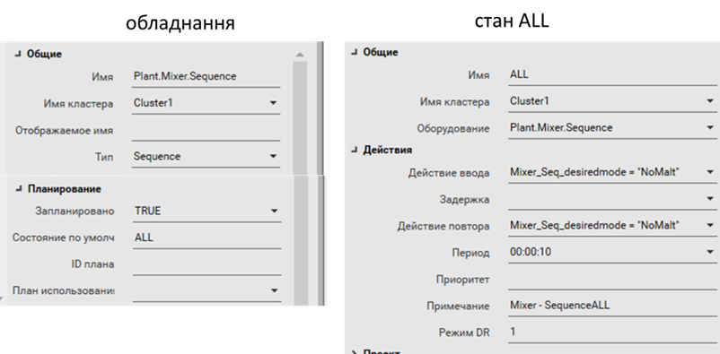

[Людино-машинні інтерфейси](https://pupenasan.github.io/hmi/)  Автор і лектор: Олександр Пупена доц. кафедри [АКСТУ НУХТ](http://www.iasu-nuft.pp.ua/) 

# Лекція 14. Інші підсистеми: підсистема роботи з рецептами, звітами, календарного виконання

## 14.1. Підсистема генерування подій

Події дають можливість виконувати певну дію, що ініціюється тригером. ***Тригер*** – це умова, виконання якої приводить до дії. У загальному випадку умовою може бути будь-який вираз, який дає булевий результат (істина або хибність). Частковим випадком спрацювання по тригеру є проходження певного періоду часу відносно заданого. У деяких засобах ця функціональність виділена в окрему підсистему, або часово-генероване завдання. Окрім тригера, задається дія, яка буде виконуватися. Це може бути виклик функції, зміна тегу, тощо. Наявні функції в скриптах можуть мати дуже велику кількість додаткових генераторів та обробників подій. 

**Підсистема генерування подій у Citect** 

У Citect усі події означуються в однойменному розділі (Events, События). Дія означується Cicode командою за виконанням певної умови або періодичності виконання. Події створюються в редакторі проекту "Система->События". Для події вказується ім’я (Рис. 14.1), періодичність та час, відносно якого проводиться синхронізація періодичності (рос. лок."Время"). Якщо період не вказаний, він приймається рівним 1 с. 

             

*Рис. 14.1.* Налаштування властивостей події

Тригер вказує на умову, яка запускає виконання дії. Якщо тригер не вказаний, то дія буде виконуватися з періодичністю, означеною полями "Время" і "Перио­дичность". Якщо тригер вказаний, але не вказані поля "Время" і "Периодичность", то дія буде виконуватися по передньому фронту спрацювання тригера.

Події можуть виконуватися в контексті будь-якого процесу Citect, чи то сервері, чи клієнті або в усіх. Місце виконання подій налаштовуються в майстрі налаштування комп’ютера (Рис. 14.2). Події з ім'ям "GLOBAL" виконуються на всіх комп’ютерах у системі Citect. 

 

*Рис. 14.2.* Налаштування виконання події на різних частинах системи Citect

**Підсистема генерування подій у SCADA zenon** 

У SCADA zenon генерування подій за часом проводиться з використанням функцій Time Control. Для кожної часової функції задається час, відносно якого генерується виклик функції, періодичність (один раз, періодично з указаного часу, періодично в зазначений день), період, а також функція zenon, яка буде викликатися (Рис. 14.3). Можна також задати дні тижня, в які виконуватиметься вказана функція. 

 

*Рис. 14.3.* Налаштування часових функцій у zenon

Генерування подій за тригером, що формується в результаті зміни, значення задається в налаштуваннях змінної через границі або матрицю реакцій, де в полі Function задається необхідна функція, яка буде викликатися при спрацюванні. 

## 14.2. Підсистема роботи з рецептами

***Рецепт*** (recipe) є сукупністю технологічних параметрів, які зчитуються, записуються, зберігаються як єдине ціле. Рецепти дають можливість операторові зберегти в системі задані значення певних технологічних параметрів для приготування конкретного продукту. Якщо SCADA/HMI підтримує функціональність рецептів, вона повинна надавати в середовищі виконання, як мінімум, такі функції:

- створювати нові рецепти та модифікувати існуючі;

- видаляти або позначати як застарілі існуючі рецепти;

- зберігати та зачитувати рецепти з носія;

- записувати дані рецепта в контролер (теги);

- зчитувати дані з контролера (тегів).

Інші можливості залежать від інструментів. У SCADA/HMI, які не підтримують функціональність рецептів, можуть надаватися можливості реалізувати їх самостійно через підсистему скриптів та/або роботу з базами даних. Так, наприклад, для порційного виробництва згідно стандартів IEC-61512 та його аналога ISA-88, рецепт включає не тільки параметри процесу (так звану формулу), а й послідовність технологічних кроків (так звану процедуру). Для таких систем в рецепті треба також означувати технологічну програму для кожного типу продукту, що потребує додаткових модулів SCADA або навіть окремих програмних продуктів. Розгляд роботи з такими рецептами виходить за рамки даного курсу.

У SCADA Citect явно виділеної підсистеми для керування рецептами немає. Найпростішим з точки зору реалізації способів є використання вбудованого в палітру ActiveX елемента компоненту "DataBase Exchange". До його функцій належать (Рис. 14.4):

- відображати вибрані за певними критеріями (задається у Filter) дані із джерела у вигляді таблиці; 

- редагувати дані записів у табличному вигляді;

- завантажувати дані з вибраного запису у прив’язані теги (Download);

- вивантажувати дані з прив’язних тегів у записи (Upload);

- друкувати. 

 

*Рис. 14.4.* Зовнішній вигляд ActiveX компоненту DataBase Exchange в режимі виконання

По суті, компонент є звичайним табличним редактором даних з БД, оформлений під керування рецептами. Ґрунтується він на технології ADO, тому при редагуванні вказується рядок підключення (Рис. 14.5).

 

*Рис. 14.5.* Налаштування джерела даних для DataBase Exchange

Далі вказується прив’язка полів (колонок) до тегів (Рис. 14.6) подібно до інших ActiveX в Citect.

 

*Рис. 14.6.* Налаштування зв’язку полів запису DataBase Exchange

Для реалізації інших функцій рецептів можна скористатися Cicode.

У [посібнику](https://pupenasan.github.io/hmibook/8_4.html) ви також можете прочитати про реалізацію рецептів в zenon та WinCC Comfort. 

## 14.3. Підсистема звітів

Для аналізу подій і тривог, тенденції зміни технологічних параметрів протягом певного часу можна скористатися відповідними переглядачами. Крім виведення на екран, вони дають змогу виводити тренди та журнали на принтер. Не дивлячись на те, що в цей спосіб можна вивести багато корисної детальної інформації, вона не є достатньо обробленою для отримання показників ефективності роботи процесу чи установки. Для виведення загальних показників застосовують звіти. 

***Звіт*** (Report) – це документ або сторінка, сформовані на основі означеного для нього формату та статистично оброблених плинних чи історичних даних. У ***форматі звіту*** позначується розміщення та призначення полів, а при генеруванні звіту ці поля заповнюються конкретними значеннями. Крім полів, вміст яких залежить від даних, формат звіту може вміщувати статичну графічну та текстову інформацію.

Звіти можуть генеруватися автоматично, наприклад, у разі виникнення події чи тривоги, або періодично в зазначений астрономічний час. Також вони можуть генеруватися за запитом оператора. Звіт може мати вигляд надрукованого документа, файлу формату PDF, RTF, TXT, CSV, HTML сторінки або таблиці Excel чи якоїсь бази даних. Звіти у вигляді текстових документів насамперед цікавлять керівний персонал, якому вони потрібні для аналізу технологічного процесу. Електронні таблиці потрібні для ведення автоматизованого загальновиробничого обліку (наприклад, передача на рівень керування виробництвом та підприємством). Наприклад, кількість спожитої теплоенергії можна використати для розрахунку собівартості продукції. Звіти можуть бути оформлені у вигляді онлайн сторінки з основними показниками (наприклад, для відображення KPI) – це так звані ***Dashboard***. 

Підсистема звітів може бути частиною SCADA/HMI або реалізована зовнішніми програмними засобами, як правило, набагато функціональнішими. Зовнішня підсистема звітів може бути оформлена у вигляді окремого програмного сервера з Веб-доступом, який приймає запити на формування звіту через HTPP API і генерує їх у форматі HTML. 

У будь-якому випадку вхідними для підсистеми звітів є:

- джерело даних, яке використовується для вибірки та представлення необхідної інформації у звіті; 

- формат звіту, який указує, як саме виглядатиме звіт (наприклад файл RTF, XML);

- параметри, які використовуються у форматі звіту для уточнення того, як слід генерувати звіт (наприклад, діапазон дат, за який необхідно вивести звіт, або назва даних). 

Джерелом даних можуть бути як дані реального часу, так і база даних або файли (наприклад XML, CSV). Часто для формування вибірки використовується мова SQL.

Формат звіту, як правило, створює окремий редактор. Це може бути файл або для онлайн звітів – онлайн форма. У ряді підсистем формат звіту можна не задавати, користувач на льоту налаштовує вигляд звіту (Dashboard) через онлайн сторінку. Формат звіту включає означення даних (поля), які будуть використовуватись у звіті. При використанні даних з БД вказується джерело даних та фільтри для запиту (наприклад, запит мовою SQL). У форматі налаштовується зовнішній вигляд, який може включати кілька розділів, які задають позицію і зміст звіту. Оскільки офлайн звіт – це окремий документ, він може містити усі частини такого документа. Тому можна виділити кілька типів розділів: 

- титул (title), або титульний аркуш (title page), з якого починається звіт;

- заключна сторінка (back page, last page);

- сторінки, кожна з яких може включати:

  - заголовок, колонтитул (header), який повторюється зверху кожної сторінки; 

  - деталі, безпосередньо зміст сторінки (detail);

  - нижній колонтитул (footer), який повторюється внизу кожної сторінки;

- фон.

Деталі сторінки можуть включати таблиці, які можуть потребувати заголовки (header), що повторюватимуться на кожній сторінці, і рядок зведення (summary), який буде заключним.

Параметри звіту можна сприймати як формальні параметри функції, яка генерує звіт.

Приклади реалізації звітів у різних SCADA можна прочитати в [посібнику](https://pupenasan.github.io/hmibook/8_5.html).

## 14.4 Підсистема календарного виконання

Для ряду об’єктів повинно бути передбачене керування установками згідно з календарним графіком та астрономічним часом. Наприклад, у системах керування водо- та теплопостачанням може знадобитися вмикання та вимикання насосів згідно зі встановленим графіком. Це задача для спеціальних підсистем SCADA/HMI, які називаються ***планувальниками*** (Scheduler). 

Особливістю планувальника є можливість означення календарного плану в середовищі виконання. Іншими словами, час та дії, які повинні відбуватися в цей час, налаштовує не розробник системи керування, а оператор. 

Планувальники можуть надавати такі можливості в середовищі виконання:

- означення абсолютного часу для виконання дій, наприклад 23.10.2020 о 18:00;

- означення відносного часу для виконання дій, наприклад кожного понеділка о 18:00;

- означення спеціальних днів у календарі, тобто в яких виконується особливий план;

- означення дій у вигляді зміни тегів (змінних) або запуску функцій. 

У Citect підсистема календарного керування ґрунтується на механізмі ієрархії устатковання (Equipment). Для устатковання повинні бути зконфігуровані ***Стани*** (Equipment States), у властивостях яких вказано що саме необхідно робити при активації та активності цього Стану. Для устатковання, яке повинно керуватися з планувальника, має бути виставлена в TRUE властивість "Заплановано" (Scheduled). 

Для реалізації графічного інтерфейсу на одній із дисплейних сторінок необхідно розмістити ActiveX компонент "Scheduler" (рос. лок. "Планировщик"), який є на палітрі компонентів Citect. Він не потребує конфігурування в середовищі розроблення, це може знадобитися хіба що для прив’язки певних властивостей до змінних. Уся діяльність налаштовується у Планувальнику в режимі виконання (Рис. 14.7). На ньому доступні кілька вкладок, які дають можливість налаштовувати календарний план (у вигляді дня, тижня, місяця, хронології), контролювати кінцевий стан планування. Можна також добавляти спеціальні дні в календарі, для яких можна окремо конфігурувати поведінку устатковання.

 

*Рис. 14.7.* Зовнішній вигляд планувальника в Citect

У дереві відображається все доступне для планування устаткування (що має властивість Scheduled=TRUE). При виділенні устатковання, у календарному плані можна подивитися, встановити та змінити дату й час переходу на конкретний стан. 

Устатковання може перебувати в різних режимах, які відображаються відповідним символом:

- автоматичний (automatic) – режим, в якому стан задається планувальником відповідно до означеного календарного плану;

- заміщення (Override), також називається ручним, – коли станом керує оператор через контекстне меню. 

У контекстному меню устатковання є відповідні команди переходу в режим та в стан (у режимі Override). Перехід у режим та стан доступний також через функцію Cicode "EquipSetProperty". Функція "EquipGetProperty" дає можливість отримати активний режим та стан.

У Citect стани та режими поширюються вниз за ієрархією. Це значить, що устатковання нижчого рівня переходить в той самий стан та режим, що й вищий. Поширення стану справедливе тільки у випадку, якщо устатковання, нижче за ієрархією, не вказане в календарному плані на цей час або пріоритет його стану нижче за пріоритет батьківського. Дочірні елементи можна переводити в режим незалежно.

Для устатковання, яке необхідно використовувати в підсистемі календарного планування, необхідно вказати перелік Станів, для кожного з яких треба зазначити (Рис. 14.8):

- дію при вході в стан (Entry Action, рос.лок "Действие ввода") – дія, яка буде виконуватися в момент переходу в цей Стан; 

- затримку (Delay, рос. лок. "Задержка") – час, який повинен пройти після активації стану до виконання дії; це може знадобитися тоді, коли прийшов час на активацію кількох одиниць устатковання і треба уникнути одночасності, наприклад для зменшення сплесків струмів при вмиканні кількох двигунів;

- повторювана дія (Repeat Action, рос. лок. "Действие повтора") – дія, яка буде повторюватися з указаним періодом при активності стану; 

- період (Period) – час, через який буде виконуватися повторювана дія;

- пріоритет (Priority) – число, що вказує пріоритет стану, якщо кілька станів виникають одночасно (при поширенні станів);

- Режим DR (DR Mode) дає можливість задати кілька станів з різними діями на основі вибраного режиму споживання (Demand and Response); можна змінювати також через функцію EquipSetProperty.  

 

*Рис. 14.8.* Налаштування устатковання та Станів для нього. 

Приклади реалізації підсистеми календарного виконання у різних SCADA можна прочитати в [посібнику](https://pupenasan.github.io/hmibook/8_6.html).

[<-- Лекція 13. Підсистеми захисту, скриптів](lec13.md)

[--> Лекція 15. Інтеграція засобів SCADA/HMI з іншими підсистемами](lec15.md)

## Контрольні запитання

1.      Яку функціональність повинна надавати підсистема рецептів? Покажіть на прикладі однієї із SCADA/HMI, як вона реалізується. 
2.      Яка функціональність доступна в підсистемі рецептів, що базується на стандарті IEC-61512 або ISA-88?
3.      Яке призначення звітів? Якої функціональності звітів немає в трендах, журналах подій та тривог?
4.      Які можуть бути форми звітів? В яких випадках використовується кожна з них? 
5.      Навіщо потрібен формат звіту? Що в ньому задається? 
6.      Які відкриті формати звітів Ви знаєте? 
7.      Що передається на вхід підсистеми звітності?
8.      Поясніть необхідність підсистеми планування (планувальників)
9.      Які можливості повинні надавати підсистеми планування? Покажіть на прикладі однієї зі SCADA/HMI.

 

<iframe src="https://www.slideshare.net/slideshow/embed_code/key/uKZ8hWS3BiER0Q" width="597" height="486" frameborder="0" marginwidth="0" marginheight="0" scrolling="no" style="border:1px solid #CCC; border-width:1px; margin-bottom:5px; max-width: 100%;" allowfullscreen> </iframe> 
 <strong> <a href="https://www.slideshare.net/pupenasan/ss-239806420" title="Інші підсистеми" target="_blank">Інші підсистеми</a> </strong> from <strong><a href="https://www.slideshare.net/pupenasan" target="_blank">Пупена Александр</a></strong> 

