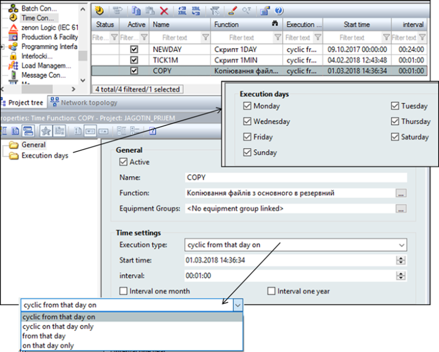
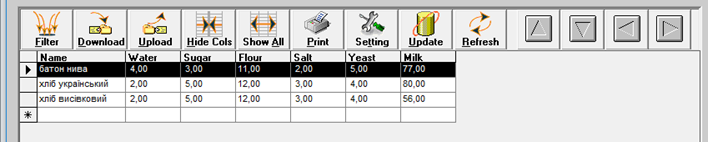
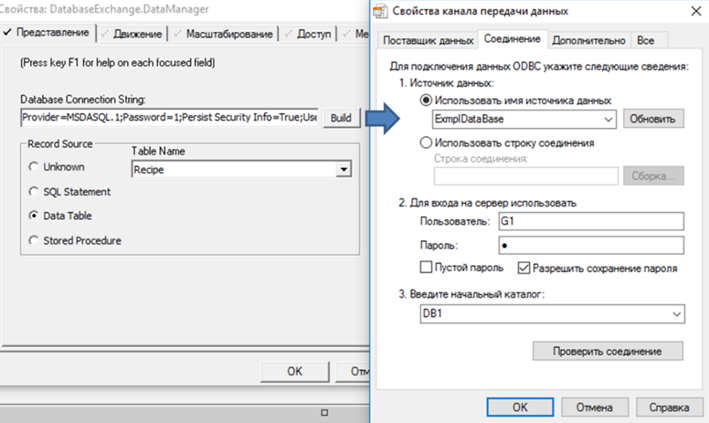
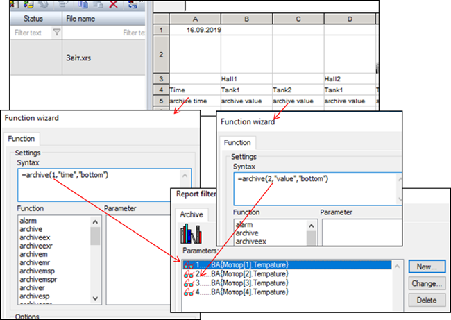
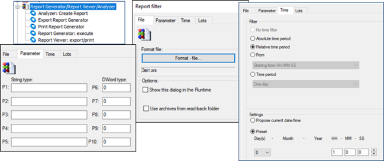
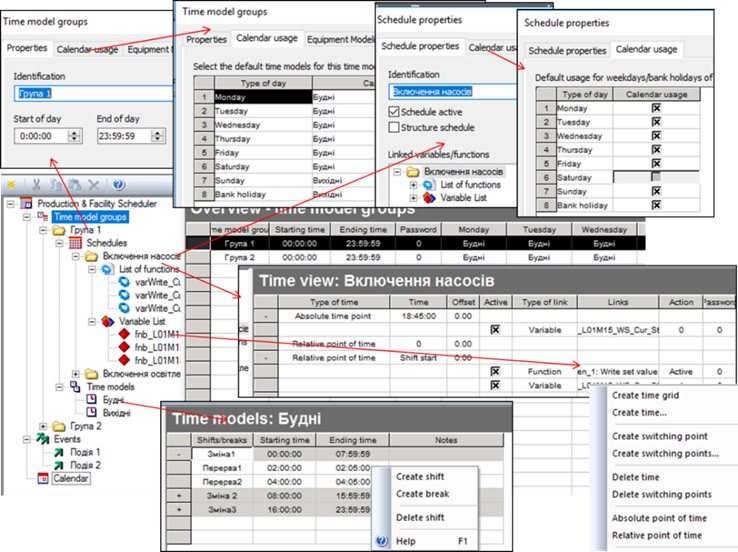

[Людино-машинні інтерфейси](https://pupenasan.github.io/hmi/)  Автор і лектор: Олександр Пупена доц. кафедри [АКСТУ НУХТ](http://www.iasu-nuft.pp.ua/) 

# Лекція 14. Інші підсистеми: підсистема роботи з рецептами, звітами, календарного планування

## 14.1. Підсистема генерування подій

Події дають можливість виконувати певну дію, що ініціюється тригером. ***Тригер*** – це умова, виконання якої приводить до дії. У загальному випадку умовою може бути будь-який вираз, який дає булевий результат (істина або хибність). Частковим випадком спрацювання по тригеру є проходження певного періоду часу відносно заданого. У деяких засобах ця функціональність виділена в окрему підсистему, або часово-генероване завдання. 

Окрім тригера, задається дія, яка буде виконуватися. Це може бути виклик функції, зміна тегу, тощо. 

Наявні функції в скриптах можуть мати дуже велику кількість додаткових генераторів та обробників подій. 

### Підсистема генерування подій у Citect 

У Citect усі події означуються в однойменному розділі (Events, События). Дія означується Cicode командою за виконанням певної умови або періодичності виконання. Події створюються в редакторі проекту "Система->События". Для події вказується ім’я (Рис. 14.1), періодичність та час, відносно якого проводиться синхронізація періодичності (рос. лок."Время"). Якщо період не вказаний, він приймається рівним 1 с. 

<a href="media14/8_5.png" target="_blank"></a>             

*Рис. 14.1.* Налаштування властивостей події

Тригер вказує на умову, яка запускає виконання дії. Якщо тригер не вказаний, то дія буде виконуватися з періодичністю, означеною полями "Время" і "Перио­дичность". Якщо тригер вказаний, але не вказані поля "Время" і "Периодичность", то дія буде виконуватися по передньому фронту спрацювання тригера.

Події можуть виконуватися в контексті будь-якого процесу Citect, чи то сервері, чи клієнті або в усіх. Місце виконання подій налаштовуються в майстрі налаштування комп’ютера (Рис. 14.2). Події з ім'ям "GLOBAL" виконуються на всіх комп’ютерах у системі Citect. 

<a href="media14/8_6.png" target="_blank"></a> 

*Рис. 14.2.* Налаштування виконання події на різних частинах системи Citect

### Підсистема генерування подій у SCADA zenon 

У SCADA zenon генерування подій за часом проводиться з використанням функцій Time Control. Для кожної часової функції задається час, відносно якого генерується виклик функції, періодичність (один раз, періодично з указаного часу, періодично в зазначений день), період, а також функція zenon, яка буде викликатися (Рис. 14.3). Можна також задати дні тижня, в які виконуватиметься вказана функція. 

<a href="media14/8_7.png" target="_blank"></a> 

*Рис. 14.3.* Налаштування часових функцій у zenon

Генерування подій за тригером, що формується в результаті зміни, значення задається в налаштуваннях змінної через границі або матрицю реакцій, де в полі Function задається необхідна функція, яка буде викликатися при спрацюванні. 

## 14.2. Підсистема роботи з рецептами

Як зазначено в розділі 1, ***рецепт*** (recipe) є сукупністю технологічних параметрів, які зчитуються, записуються, зберігаються як єдине ціле. Рецепти дають можливість операторові зберегти в системі задані значення певних технологічних параметрів для приготування конкретного продукту. Якщо SCADA/HMI підтримує функціональність рецептів, вона повинна надавати в середовищі виконання, як мінімум, такі функції:

- створювати нові рецепти та модифікувати існуючі;

- видаляти або позначати як застарілі існуючі рецепти;

- зберігати та зачитувати рецепти з носія;

- записувати дані рецепта в контролер (теги);

- зчитувати дані з контролера (тегів).

Інші можливості залежать від інструментів. У SCADA/HMI, які не підтримують функціональність рецептів, можуть надаватися можливості реалізувати їх самостійно через підсистему скриптів та/або роботу з базами даних. 

Виробництва, які виготовляють продукт невеликими порціями (партіями) за окремим рецептом, де порція речовини одночасно проходить певну послідовність оброблення називається порційним (Batch Production). Згідно зі стандартом керування процесами порційного виробництва IEC-61512 [[1](https://webstore.iec.ch/publication/5528)] та його аналога ISA-88, рецепт включає не тільки параметри процесу (так звану формулу), а й послідовність технологічних кроків (так звану процедуру). Одна із ідей стандарту полягає в тому, щоб у системі керування устаткуванням (наприклад в ПЛК) реалізовувати технологічні кроки, а не всю технологічну послідовність. Це дає змогу означувати технологічну програму в процедурі майстер-рецепта (прототип) для кожного типу продукту. Розгляд роботи з такими рецептами виходить за рамки даного курсу.

### Підсистема рецептів у SCADA Citect 

У SCADA Citect явно виділеної підсистеми для керування рецептами немає. Найпростішим з точки зору реалізації способів є використання вбудованого в палітру ActiveX елемента компоненту "DataBase Exchange". До його функцій належать (Рис. 14.4):

- відображати вибрані за певними критеріями (задається у Filter) дані із джерела у вигляді таблиці; 

- редагувати дані записів у табличному вигляді;

- завантажувати дані з вибраного запису у прив’язані теги (Download);

- вивантажувати дані з прив’язних тегів у записи (Upload);

- друкувати. 

<a href="media14/8_24.png" target="_blank"></a> 

*Рис. 14.4.* Зовнішній вигляд ActiveX компоненту DataBase Exchange в режимі виконання

По суті, компонент є звичайним табличним редактором даних з БД, оформлений під керування рецептами. Ґрунтується він на технології ADO, тому при редагуванні вказується рядок підключення (Рис. 14.5).

<a href="media14/8_25.png" target="_blank"></a> 

*Рис. 14.5.* Налаштування джерела даних для DataBase Exchange

Далі вказується прив’язка полів (колонок) до тегів (Рис. 14.6) подібно до інших ActiveX в Citect.

<a href="media14/8_26.png" target="_blank"></a> 

*Рис. 14.6.* Налаштування зв’язку полів запису DataBase Exchange

Для реалізації інших функцій рецептів можна скористатися Cicode.

### Підсистема рецептів у SCADA zenon 

У SCADA zenon рецепти реалізовані у вигляді двох модулів:

- стандартні рецепти (Standard Recipes) – входять в стандартну поставку;

- адміністратор груп рецептів (Recipegroup Manager) – додатковий модуль.

Окрім того, SCADA zenon має модуль керування порційним виробництвом згідно з IEC-61512. 

Рецепти в SCADA zenon можна створювати та модифікувати як у середовищі виконання, так і в середовищі розроблення. Для того, щоб при перенесенні проекту рецепти середовища розроблення не замінили рецептів, створених в середовищі виконання, за замовченням у налаштуваннях проекту "Runtime Changeable Date" для параметра "Standard Recipe" стоїть значення "Do not generate and transfer" (не генерувати і не переносити). SCADA zenon також дає змогу переносити рецепти із середовища виконання в середовище розроблення.

У середовищі розроблення стандартні рецепти створюються в однойменному розділі проекту (Рис. 14.7). Для рецепта вибираються необхідні змінні та задаються задані значення. 

<a href="media14/8_27.png" target="_blank"></a> 

*Рис. 14.7.* Налаштування стандартних рецептів у середовищі розроблення

Записування значень рецепта в змінні, зчитування, імпорт і експорт можна виконати через відповідні функції zenon (Рис. 14.8). 

<a href="media14/8_28.png" target="_blank"></a> 

*Рис. 14.8.* Функції для керування рецептами 

Для створення, модифікації та видалення рецептів у середовищі виконання в SCADA zenon є спеціальний тип екрана "Standard Recipes" (Рис. 14.9). Використовуючи дані екрани, оператор у змозі виконати усі операції з рецептами, включаючи добавлення нових змінних. SCADA zenon також підтримує імпорт і експорт рецептів, завдяки чому їх можна переносити на інші робочі станції. 

<a href="media14/8_29.png" target="_blank"></a> 

*Рис. 14.9.* Наповнення екрана типу "Standard Recipes" 

Адміністратор груп рецептів (Recipegroup Manager) підтримує додаткові можливості по керуванню рецептами. Зокрема, він дає можливість групувати рецепти разом за певною ознакою. Стандартні рецепти надають операторові можливість вибрати рецепт серед усіх існуючих. У більшості випадків рецепти означуються для певної групи устатковання. Наприклад, якщо рецепти необхідно розподілити між трьома контурами CIP-мийки, то бажано створити окремі групи для кожного контуру, щоб операторові зручно було вибирати потрібний рецепт. Для кожної групи задається свій набір змінних (Рис. 14.10).

<a href="media14/8_30.png" target="_blank"></a> 

*Рис. 14.10.* Налаштування групи рецептів модуля "Recipegroup Manager" у середовищі розроблення та середовищі виконання 

Другою особливістю модуля Recipegroup Manager є можливість керувати версіями та статусом рецепту. Можна означувати свої статуси, наприклад "у розробці", "робочий" та "застарілий", які будуть надаватися рецепту на певному етапі. Цей статус рецепта можна використовувати як фільтра для відображення рецептів у переліках. Також виконання рецептів можна блокувати. 

Групи рецептів також можна налаштовувати як у середовищі розроблення так, і в середовищі виконання. Доступні різноманітні дії з рецептами через налаштування єдиної функції Recipegroup Manager (Рис. 14.11), а також через однойменний тип екрана. 

<a href="media14/8_31.png" target="_blank"></a> 

*Рис. 14.11.* Налаштування функції "Recipegroup Manager" 

Крім цього, адміністратор груп рецептів дає можливість керувати рецептами опосередковано через змінні, імпортувати та експортувати рецепти через XML.

## 14.3. Підсистема звітів

Для аналізу подій і тривог, тенденції зміни технологічних параметрів протягом певного часу можна скористатися відповідними переглядачами. Крім виведення на екран, вони дають змогу виводити тренди та журнали на принтер. Не дивлячись на те, що в цей спосіб можна вивести багато корисної детальної інформації, вона не є достатньо обробленою для отримання показників ефективності роботи процесу чи установки. Для виведення загальних показників застосовують звіти. 

***Звіт*** (Report) – це документ або сторінка, сформовані на основі означеного для нього формату та статистично оброблених плинних чи історичних даних. У ***форматі звіту*** позначується розміщення та призначення полів, а при генеруванні звіту ці поля заповнюються конкретними значеннями. Крім полів, вміст яких залежить від даних, формат звіту може вміщувати статичну графічну та текстову інформацію.

Звіти можуть генеруватися автоматично, наприклад, у разі виникнення події чи тривоги, або періодично в зазначений астрономічний час. Також вони можуть генеруватися за запитом оператора. Звіт може мати вигляд надрукованого документа, файлу формату PDF, RTF, TXT, CSV, HTML сторінки або таблиці Excel чи якоїсь бази даних. Звіти у вигляді текстових документів насамперед цікавлять керівний персонал, якому вони потрібні для аналізу технологічного процесу. Електронні таблиці потрібні для ведення автоматизованого загальновиробничого обліку (наприклад, передача на рівень керування виробництвом та підприємством). Наприклад, кількість спожитої теплоенергії можна використати для розрахунку собівартості продукції. Звіти можуть бути оформлені у вигляді онлайн сторінки з основними показниками (наприклад, для відображення KPI) – це так звані ***Dashboard***. 

Підсистема звітів може бути частиною SCADA/HMI або реалізована зовнішніми програмними засобами, як правило, набагато функціональнішими. Зовнішня підсистема звітів може бути оформлена у вигляді окремого програмного сервера з Веб-доступом, який приймає запити на формування звіту через HTPP API і генерує їх у форматі HTML. 

У будь-якому випадку вхідними для підсистеми звітів є:

- джерело даних, яке використовується для вибірки та представлення необхідної інформації у звіті; 

- формат звіту, який указує, як саме виглядатиме звіт (наприклад файл RTF, XML);

- параметри, які використовуються у форматі звіту для уточнення того, як слід генерувати звіт (наприклад, діапазон дат, за який необхідно вивести звіт, або назва даних). 

Джерелом даних можуть бути як дані реального часу, так і база даних або файли (наприклад XML, CSV). Часто для формування вибірки використовується мова SQL.

Формат звіту, як правило, створює окремий редактор. Це може бути файл або для онлайн звітів – онлайн форма. У ряді підсистем формат звіту можна не задавати, користувач на льоту налаштовує вигляд звіту (Dashboard) через онлайн сторінку. Формат звіту включає означення даних (поля), які будуть використовуватись у звіті. При використанні даних з БД вказується джерело даних та фільтри для запиту (наприклад, запит мовою SQL). У форматі налаштовується зовнішній вигляд, який може включати кілька розділів, які задають позицію і зміст звіту. Оскільки офлайн звіт – це окремий документ, він може містити усі частини такого документа. Тому можна виділити кілька типів розділів: 

- титул (title), або титульний аркуш (title page), з якого починається звіт;

- заключна сторінка (back page, last page);

- сторінки, кожна з яких може включати:

  - заголовок, колонтитул (header), який повторюється зверху кожної сторінки; 

  - деталі, безпосередньо зміст сторінки (detail);

  - нижній колонтитул (footer), який повторюється внизу кожної сторінки;

- фон.

Деталі сторінки можуть включати таблиці, які можуть потребувати заголовки (header), що повторюватимуться на кожній сторінці, і рядок зведення (summary), який буде заключним.

Параметри звіту можна сприймати як формальні параметри функції, яка генерує звіт. 

### Підсистема звітів у Citect

Вбудована в Citect підсистема звітів дає змогу досить швидко розробити прості звіти за даними тегів, однак має обмежену функціональність. Проектування звітності проходить за класичним принципом:

- розроблення формату (шаблону) звіту;

- означення звіту, в якому вказується формат, пристрій, куди буде виводитися звіт, та умова, при якій буде відбуватися виведення;

- генерування звіту через виклик функції (опційно).

Формат звіту можна задавати у двох виглядах: текстовому (ASCII-файл) та RTF. Останній дає можливість зробити форматування кольору, шрифтів, вставляти рисунки і OLE-об’єкти. ASCII-файл, по суті, є звичайним текстовим файлом, який не вміщує форматування. Однак на його базі можна робити формати для виведення html-сторінок. Крім того, в ASCII-файлі формату підтримується додаткова можливість по оброблення Cicode.

Незалежно від того, який вибрано тип формату звіту, він включає звичайний текст та замінники, які виділяються фігурними дужками. Вміст фігурних дужок сприймається як Cicode-вираз. Наприклад, вираз {LOOP_1_PV:#-###.#EU} означає, що в цьому місці шаблону буде вставлене значення тегу LOOP_1_PV. У шаблон можна вставляти розділ з програмою Cicode, яка може попередньо оброблювати дані:

```
{CICODE}
Cicode_програма;
{END}
```

Для шаблону типу ASCII-файл дозволяється використовувати Cicode змінні, а для RTF – ні. 

<a href="media14/8_43.png" target="_blank"></a> 

*Рис. 14.12.* Приклад означення форматів звіту у вигляді rtf та html (ліворуч) та вигляд звіту (праворуч)

Звіт означується в однойменному розділі проекту. Для звіту вказується ім’я, формат, попередньо створений пристрій виведення та час/період або/та подія для генерування (Рис. 14.13). Звіт також можна генерувати з використанням Cicode функції "Report". 

<a href="media14/8_44.png" target="_blank"></a> 

*Рис. 14.13.* Означення звіту в Citect та пристрою виведення

### Підсистема звітів у zenon

SCADA zenon підтримує два типи звітів: 

- Report Generator;

- Report Viewer.

**Report Generator** 

Генератор звітів (Report Generator) розраховує дані та виводить на звіт інформацію за даними процесу та архівними даними. Конфігурування звітів відбувається в кілька етапів:

- означення формату (шаблону) звіту в розділі Report Generator; 

- створення функції для генерування звіту або/та створення спеціального для виведення звіту.

Формат звіту ґрунтується на основі комірок, у кожній з яких можна задати певну функцію та формат. У режимі виведення звіту інформацію можна не тільки виводити, а й змінювати. Серед функцій комірок є загальні (подібні до функцій Excel) та спеціалізовані, які належать до однієї з груп: функції роботи з базами даних; функції дати й часу; логічні; доступу до архіву і журналів; статистичні; математичні та тригонометричні; текстові; функції керування групами рецептів та ін.

На Рис. 14.14 показано приклад налаштування формату звіту. Для комірок з виведенням даних з архівів вказуються:

- функція archive, яка вибирає дані з означеного архіву з відповідним номером;

- властивість запису архіву, наприклад, “time” для виведення часу або “value” для виведення збереженого значення;

- куди будуть записуватися вилучені з архіву значення (bottom – вниз); кількість виведених даних залежатимуть від параметрів дати та часу, що задаються при виконанні звіту. 

<a href="media14/8_46.png" target="_blank"></a> 

*Рис. 14.14.* Налаштування формату (шаблону) звіту 

Для генерування звіту можна викликати функцію "Report Generator: execute", в якій задати формат звіту, діапазон часу і за необхідності – додаткові параметри (див. Рис. 14.15).

<a href="media14/8_47.png" target="_blank"></a> 

*Рис. 14.15.* Налаштування функцій Report Generator 

Можна також створити екран з типом "Report Generator", в якому доступні аналогічні функції. 

**Report Viewer**

Переглядач звітів (Report Viewer) призначений для генерування та відображення звітів у SCADA zenon у форматі RDL. Report Definition Language (***RDL***) (мова означення звітів) — стандарт, що пропонує Microsoft для означення звітів. Аналогічно, як звіти Jasper використовують формат jrxml, служби звітів Microsoft використовують файли RDL. RDL – це XML файл, який, як правило, використовується сервісами генерування звітів – Microsoft SQL Server Reporting Services (SSRS). Цей формат можна створювати та редагувати MS Visual Studio або іншими редакторами, наприклад, безкоштовним MS Report Builder.

RDL вміщує:

- поля, які відображають дані з джерела даних, формул, змінних;

- розмітку сторінки;

- параметри. 

Спочатку у відповідному розділі проекту zenon створюється файл RDL (див.Рис. 14.16). При створенні вказуються необхідні набори даних (Data Sets) та параметри. SCADA zenon за замовчуванням означує формат звіту самостійно. Після створення файл RDL редагується стороннім реактором (наприклад, MS Report Builder). Також можна підключити створений до цього файл. Далі для формування та відображення звіту використовується спеціальний тип екрана Report Viewer (див. Рис. 14.16). На екрані можна розмістити спеціальні кнопки, наприклад, для виведення звіту на друк, PDF або Excel файл. 

<a href="media14/8_48.png" target="_blank"></a> 

*Рис. 14.16.* Створення файлів RDL (ліворуч) та зовнішній вигляд екрана типу Report Viewer (праворуч) 

Далі створюють функцію виклику екрана, в яку передають назву файлу звіту, переозначують за необхідності набори даних, параметри фільтрів та інші параметри. Report Viewer може використовуватися для відображення архівних даних, тривог AML, журналів CEL, плинних змінних та інших даних. Для цього ці дані передаються через набори Data Sets (Рис. 14.17), які вибираються через модулі zenon. Для кожного набору вказуються додаткові налаштування, наприклад, для архівів – змінні, які необхідно передати у звіт. Після вибору набору даних означуються фільтри: часові та залежні від модуля набору даних. 

<a href="media14/8_49.png" target="_blank"></a> 

*Рис. 14.17.* Означення наборів даних та фільтрів для Report Viewer

Редагування RDL файлу у MS Report Builder схоже на аналогічні дії в Jasper Studio (Рис. 14.18). Означені набори даних передаються у форматі XML, з яких вибираються необхідні поля і використовуються при відображенні даних. 

<a href="media14/8_50.png" target="_blank"></a> 

*Рис. 14.18.* Означення формату для RDL у MS Report Builder

## 14.4 Підсистема календарного виконання

Для ряду об’єктів повинно бути передбачене керування установками згідно з календарним графіком та астрономічним часом. Наприклад, у системах керування водо- та теплопостачанням може знадобитися вмикання та вимикання насосів згідно зі встановленим графіком. Це задача для спеціальних підсистем SCADA/HMI, які називаються ***планувальниками*** (Scheduler). 

Особливістю планувальника є можливість означення календарного плану в середовищі виконання. Іншими словами, час та дії, які повинні відбуватися в цей час, налаштовує не розробник системи керування, а оператор. 

Планувальники можуть надавати такі можливості в середовищі виконання:

- означення абсолютного часу для виконання дій, наприклад 23.10.2020 о 18:00;

- означення відносного часу для виконання дій, наприклад кожного понеділка о 18:00;

- означення спеціальних днів у календарі, тобто в яких виконується особливий план;

- означення дій у вигляді зміни тегів (змінних) або запуску функцій. 

### Підсистема календарного керування у Citect

У Citect підсистема календарного керування ґрунтується на механізмі ієрархії устатковання (Equipment). Для устатковання повинні бути зконфігуровані ***Стани*** (Equipment States), у властивостях яких вказано що саме необхідно робити при активації та активності цього Стану. Для устатковання, яке повинно керуватися з планувальника, має бути виставлена в TRUE властивість "Заплановано" (Scheduled). 

Для реалізації графічного інтерфейсу на одній із дисплейних сторінок необхідно розмістити ActiveX компонент "Scheduler" (рос. лок. "Планировщик"), який є на палітрі компонентів Citect. Він не потребує конфігурування в середовищі розроблення, це може знадобитися хіба що для прив’язки певних властивостей до змінних. Уся діяльність налаштовується у Планувальнику в режимі виконання (Рис. 14.19). На ньому доступні кілька вкладок, які дають можливість налаштовувати календарний план (у вигляді дня, тижня, місяця, хронології), контролювати кінцевий стан планування. Можна також добавляти спеціальні дні в календарі, для яких можна окремо конфігурувати поведінку устатковання.

<a href="media14/8_52.png" target="_blank"></a> 

*Рис. 14.19.* Зовнішній вигляд планувальника в Citect

У дереві відображається все доступне для планування устаткування (що має властивість Scheduled=TRUE). При виділенні устатковання, у календарному плані можна подивитися, встановити та змінити дату й час переходу на конкретний стан. 

Устатковання може перебувати в різних режимах, які відображаються відповідним символом:

- автоматичний (automatic) – режим, в якому стан задається планувальником відповідно до означеного календарного плану;

- заміщення (Override), також називається ручним, – коли станом керує оператор через контекстне меню. 

У контекстному меню устатковання є відповідні команди переходу в режим та в стан (у режимі Override). Перехід у режим та стан доступний також через функцію Cicode "EquipSetProperty". Функція "EquipGetProperty" дає можливість отримати активний режим та стан.

У Citect стани та режими поширюються вниз за ієрархією. Це значить, що устатковання нижчого рівня переходить в той самий стан та режим, що й вищий. Поширення стану справедливе тільки у випадку, якщо устатковання, нижче за ієрархією, не вказане в календарному плані на цей час або пріоритет його стану нижче за пріоритет батьківського. Дочірні елементи можна переводити в режим незалежно.

Для устатковання, яке необхідно використовувати в підсистемі календарного планування, необхідно вказати перелік Станів, для кожного з яких треба зазначити (Рис. 14.20):

- дію при вході в стан (Entry Action, рос.лок "Действие ввода") – дія, яка буде виконуватися в момент переходу в цей Стан; 

- затримку (Delay, рос. лок. "Задержка") – час, який повинен пройти після активації стану до виконання дії; це може знадобитися тоді, коли прийшов час на активацію кількох одиниць устатковання і треба уникнути одночасності, наприклад для зменшення сплесків струмів при вмиканні кількох двигунів;

- повторювана дія (Repeat Action, рос. лок. "Действие повтора") – дія, яка буде повторюватися з указаним періодом при активності стану; 

- період (Period) – час, через який буде виконуватися повторювана дія;

- пріоритет (Priority) – число, що вказує пріоритет стану, якщо кілька станів виникають одночасно (при поширенні станів);

- Режим DR (DR Mode) дає можливість задати кілька станів з різними діями на основі вибраного режиму споживання (Demand and Response); можна змінювати також через функцію EquipSetProperty.  

<a href="media14/8_53.png" target="_blank"></a> 

*Рис. 14.20.* Налаштування устатковання та Станів для нього. 

### Підсистема календарного керування у zenon

У SCADA zenon підсистема календарного планування представлена двома модулями: 

- Scheduler – іде в стандартній редакції; 

- PFS (Production and Facility Scheduler) – є розширенням, замінює стандартний Scheduler, якщо наявна ліцензія. 

PFS є поліпшеною версією Scheduler. Тобто у нього наявні усі функції Scheduler та додаткові, зокрема:

- зазначення планових годин відносно початку та кінця змін, перерв та ін.;

- події, означені користувачем.

Тобто прив’язку дій (записування значення змінних або запуск функцій) можна робити не тільки до абсолютного часу, а й до вказаної події. Далі розглянемо основні функції PFS.

PFS можна конфігурувати як у середовищі розроблення, так і в середовищі виконання. Для того щоб при перенесенні налаштування PFS середовища розроблення не замінювали існуючі в середовищі виконання, необхідно в налаштуваннях проекту "Runtime Changeable Date" для параметра "Scheduler" поставити значення "Do not generate and transfer" (не генерувати і не переносити). SCADA zenon також дає змогу переносити налаштування PFS із середовища виконання в середовище розроблення.

Розглянемо, яким чином проводиться конфігурування в середовищі розроблення (Рис. 14.21). У PFS календарні плани групуються за часовими інтервалами. Це дає можливість конфігурувати короткострокові плани (на добу) або відносно певної події, які пізніше можна добавляти до календаря. Кожна група часової моделі (time model group) включає календарні плани (Schedule) та часові моделі (Time models). 

<a href="media14/8_54.png" target="_blank"></a> 

*Рис. 14.21.* Налаштування планувальника в PFS 

Календарний план (Schedule) включає в себе перелік функцій та змінних, які в ньому використовуються, а також перелік дій, які відбуваються при активності плану. Наприклад, план "Включення насосів" включає три змінні та три функції, які можна використовувати в ньому. Дії задаються в часових точках (time), які можуть задаватися як в абсолютних одиницях часу (absolute point of time), так і відносно певної події (relative point of time). Подіями можуть бути:

- Start of cycle – щодня опівночі; Start of cycle without production – щодня опівночі, якщо не активна жодна зі змін або коли закінчуються усі зміни; Start of cycle with production - щодня опівночі, якщо активна хоча б одна зі змін;

- Begin of production – початок зміни, якщо до цього не було активної жодної зміни; End of production – кінець останньої зміни, якщо після цього не буде активною жодна зміна;

- Shift start – початок зміни; Shift end – кінець зміни;

- Start of break – початок перерви в зміні; End of break – кінець перерви в зміні;

- User-defined event – початок вказаної події користувача;

- інші. 

Параметр Offset задає зміщення в часі відносно події. Дії задаються точками перемикання (switching point). 

Об’єкт часової моделі (time model) включає означення змін (Shift) та перерв (Break), що потребуються для відповідних відносних подій у цій групі. Наприклад, на Рис. 14.21 означено дві часові моделі: "Будні" та "Вихідні", для кожної з яких вказані зміни, а в межах змін є перерви. Початок та кінець змін та перерв можна використовувати в якості відносної точки події, як це описано раніше. 

Окрім стандартних подій, можна задавати користувацькі (User events), які можна викликати функцією "Execute PFS event". Користувацькі події задаються для всього планувальника.

Абсолютні та відносні часові точки, що означені в календарному плані, не мають фактичного відношення до конкретних днів календаря, оскільки для них означені лише часові налаштування. Календар дає змогу користувачам вказати, в які дні повинен бути виконаний певний календарний план. З цією метою користувачі можуть виділяти активну модель та активні календарні плани на кожен день, для кожної з перелічених груп моделей. Календар пропонує різні види, які можна вибрати відповідно до рівня деталізації, необхідної для інформації (Рис. 14.22). Також zenon дає можливість налаштувати кольор залежно від стану та типу календарного плану. 

<a href="media14/8_55.png" target="_blank"></a> 

*Рис. 14.22.* Відображення календаря в PFS 

Для роботи з календарним планом у середовищі виконання, необхідно створити екран типу "Production & Facility Scheduler". Налаштування календарного плану проводиться так само як у середовищі розроблення. 

[<-- Лекція 13. Підсистеми захисту, скриптів](lec13.md)

[--> Лекція 15. Інтеграція засобів SCADA/HMI з іншими підсистемами](lec15.md)

## Контрольні запитання

1.      Яку функціональність повинна надавати підсистема рецептів? Покажіть на прикладі однієї із SCADA/HMI, як вона реалізується. 
2.      Яка функціональність доступна в підсистемі рецептів, що базується на стандарті IEC-61512 або ISA-88?
3.      Яке призначення звітів? Якої функціональності звітів немає в трендах, журналах подій та тривог?
4.      Які можуть бути форми звітів? В яких випадках використовується кожна з них? 
5.      Навіщо потрібен формат звіту? Що в ньому задається? 
6.      Які відкриті формати звітів Ви знаєте? 
7.      Що передається на вхід підсистеми звітності?
8.      Поясніть необхідність підсистеми планування (планувальників)
9.      Які можливості повинні надавати підсистеми планування? Покажіть на прикладі однієї зі SCADA/HMI.

 

<iframe src="https://www.slideshare.net/slideshow/embed_code/key/uKZ8hWS3BiER0Q" width="597" height="486" frameborder="0" marginwidth="0" marginheight="0" scrolling="no" style="border:1px solid #CCC; border-width:1px; margin-bottom:5px; max-width: 100%;" allowfullscreen> </iframe> <div style="margin-bottom:5px"> <strong> <a href="https://www.slideshare.net/pupenasan/ss-239806420" title="Інші підсистеми" target="_blank">Інші підсистеми</a> </strong> from <strong><a href="https://www.slideshare.net/pupenasan" target="_blank">Пупена Александр</a></strong> </div>
