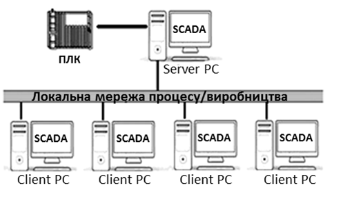
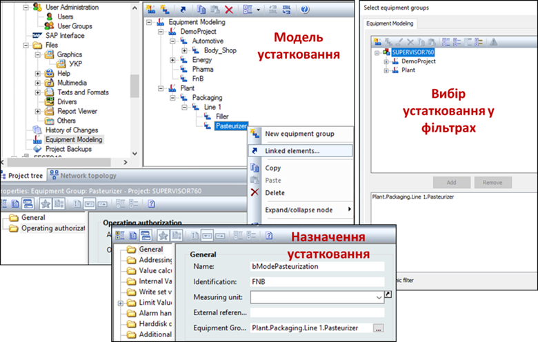
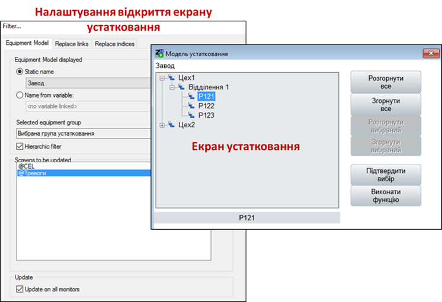

[Людино-машинні інтерфейси](https://pupenasan.github.io/hmi/)  Автор і лектор: Олександр Пупена доц. кафедри [АКСТУ НУХТ](http://www.iasu-nuft.pp.ua/) 

# Лекція 15. Інтеграція засобів SCADA/HMI з іншими підсистемами

## 15.1. Мережні архітектури

У найбільш простому випадку системи на базі SCADA/HMI мають ***одиночну*** (***standalone***) архітектуру, де на одному комп’ютері суміщені усі підсистеми, включаючи АРМ оператора. У цей же час на інших ПК в системі, що об’єднуються однією мережею, можуть також функціонувати інші SCADA/HMI, однак вони не обмінюються даними між собою. Така архітектура передбачає наявність одного оператора в один момент часу та збирання усіх даних у тій самій точці (ПК), яка слугує і для інтерфейсу з оператором. 

Одиночна архітектура передбачає можливість кількох джерел даних (ПЛК або інших засобів) у тому числі може підтримуватися резервування каналів для зв’язку з ними. На Рис. 15.1,1 показано архітектуру системи, в якій SCADA/HMI поєднані з ПЛК двома різними мережами. Такий спосіб резервування каналів повинен підтримуватися з боку підсистеми збирання даних. У випадку відсутності зв’язку по основному каналу (мережа М1) SCADA/HMI намагається налагодити зв'язок по іншому (мережа М2). Як правило, первинний канал має вищий пріоритет, тому при відновленні основного каналу збирання даних відбувається через нього. Деякі засоби SCADA/HMI надають можливість виділяти кілька резервних каналів.  

                               

*Рис. 15.1.* Архітектура з резервуванням каналів зв’язку з ПЛК (1) 
 та з резервуванням ПЛК (2)

Схема, що показана на Рис. 15.1,1, може використовуватися і в системах з резервуванням ПЛК. У цьому випадку основний канал буде зв’язаний з основним ПЛК, а резервний – з резервним. Тим не менше, у системах з резервуванням контролерів може бути використана інша схема, яка показана на Рис. 15.1,2. Розгляд рішення з резервуванням ПЛК виходить за рамки цього посібника, тим не менше коротко його розглянемо. У цьому випадку, основний і резервний ПЛК забезпечують зв'язок із засобами віддаленого введення/виведення (Remote I/O) через одну й ту саму мережу (на рисунку – мережа М3). В один момент часу зв'язок із засобами введення/виведення та SCADA/HMI проводить тільки один з двох ПЛК, який відіграє роль основного. У випадку виходу його з ладу цю роль бере на себе інший ПЛК. Для контролю стану дубльованого ПЛК та обміну даними контексту процесорів використовується високошвидкісна мережа (на Рис. 15.1,2 – М2). Для функціонування такої архітектури ПЛК повинні змінювати свою адресу залежно від їх ролі (основний або резервний). Тоді для SCADA/HMI переключення буде виливатися в тимчасову відсутність доступу, пов’язана, наприклад з відновленням буферів комунікаційного обладнання. 

Архітектура з одним ПК має ряд недоліків:

- передбачається тільки одне робоче місце оператора, тобто весь персонал, що бере участь у керуванні чи обслуговуванні, може працювати тільки через один термінал;

- відсутність резервування робить систему нестійкою до збоїв різного типу, тобто при неполадках у мережі чи в складових робочої станції втрачається зв’язок з процесом, але при цьому система керування на рівні контролерів може надалі функціонувати;

- значне навантаження на один комп’ютер не дає можливості побудувати великі системи;

- відсутність інтеграції з рівнем керування виробництвом не дає можливості повністю оцінити ефективність роботи процесу.

Для можливості доступу до керування або тільки для контролю з декількох робочих місць багато засобів SCADA/HMI пропонують ***клієнт-серверну архітектуру*** (Рис. 15.2), в якій на сервер покладається завдання збирання даних (а також архівування, контроль за тривогами та ін.), а клієнтська частина (тобто людино-машинний інтерфейс) реалізується на окремих комп’ютерах.

***Клієнт*** (***HMI клієнт, Client***) – це програма, яка реалізує людино-машинний інтерфейс доступу до даних на сервері (зокрема через мережу). ***Сервер*** (***SCADA сервер, Server***) – це програма, яка надає доступ до своїх даних клієнтам (зокрема через мережу) та реалізує одну або всі функції: збирання даних, їх оброблення, архівування, формування тривог та ін. Як правило, на комп’ютерах з програмою сервера виконуються і програми клієнтів. Слід розуміти, що клієнти і сервери у більшості випадків спілкуються між собою з використанням спеціалізованих протоколів, тобто поєднання складових від різних програм SCADA можливе тільки за певних обставин, наприклад, використовуючи технології ОРС. 

                               

*Рис. 15.2.* Клієнт-серверна архітектура

Часто для опису роботи клієнт-серверних архітектур SCADA/HMI використовують поняття ***тонкий клієнт*** (thin client) та ***товстий клієнт*** (у різних джерелах можуть називатися як fat, thick, heavy або rich client). 

Під товстим клієнтом частіше всього розуміють ПК з установленим середовищем виконання SCADA/HMI, яке виконує роль клієнта при взаємодії з іншим середовищем виконання (сервером). У даному випадку велика частина роботи, зокрема стосовно функцій ЛМІ, покладена на клієнтський застосунок, а сервер у цей час може збирати дані, обробляти їх, зберігати і т.п. Обмін між клієнтом та сервером SCADA реалізується через пропрієтарні закриті протоколи. 

При побудові архітектури на базі товстого клієнта слід враховувати деякі особливості реалізації. Зокрема, внутрішні змінні можуть належати як клієнтській частині, так і серверній. У першому випадку кожен клієнт матиме свою копію внутрішніх змінних, у другому – один і той самий екземпляр внутрішніх змінних буде доступний усім клієнтам.  

Тонкий клієнт частіше всього має меншу функціональність і не потребує встановлення спеціалізованого ПЗ. В якості тонкого клієнта можуть виступати термінальні клієнти (RDP – Remote Desktop Protocol) або WEB-браузер, а обмін даними відбувається через класичні стеки протоколів, наприклад TCP/IP. Роботу WEB-клієнтів розглянемо в наступному в параграфі.

Ще один спосіб реалізації віддаленого підключення до засобу SCADA/HMI, що має популярну ОС, – це VNC (Virtual Network Computing). VNC дає можливість відображати екран засобу, на якому встановлено VNC Server, на іншому засобі, на якому встановлений VNC Client. Окрім відображення, доступні також функції керування, тобто пересилання натискань клавіатури та миші (або сенсора) на VNC Server. На сьогоднішній день є багато безкоштовних реалізацій VNC під різні платформи. Недоліком такого підходу є дублювання всього змісту на обох засобах, що не дає можливості повноцінно замінити клієнт-серверну архітектуру. 

Сучасні SCADA/HMI надають можливість доступу до системи через Internet або локальну мережу, використовуючи WEB-браузер [[1](http://ua.automation.com/content/scada-udalennyy-dostup-vsegda-i-vezde)]. На відміну від товстих HMI клієнтів, які використовують для зв’язку із серверами SCADA спеціалізовані протоколи, ***WEB клієнти*** з’єднуються з технологічним процесом, використовуючи WEB-сервіси. Тобто вони використовують ті самі технології, що й при доступі звичайного браузера до якогось сайту в мережі Інтернет. Це має ряд переваг, зокрема:

- на відміну від протоколів обміну між HMI та SCADA, WEB-технології прозорі для комунікаційного обладнання (маршрутизатори, брандмауери, шлюзи та ін.), що дає змогу з’єднуватися через Інтернет;

- у багатьох випадках можуть використовуватися будь-які браузери, в тому числі на планшетах та мобільних телефонах;

- підвищена мобільність клієнтів, оскільки Інтернет доступний на великій території.

На Рис. 15.3 показано приклад архітектури з доступом через WEB. Для роботи такої системи необхідний запуск служб WEB-сервера, які потребують окремого комп’ютера. WEB-сервер конвертує дані, які зчитує/записує зі SCADA-серверів та передає їх WEB-клієнтам через локальну мережу підприємства або через Інтернет.

 

*Рис. 15.3*. Архітектура з доступом через WEB

Не дивлячись на привабливість WEB-доступу, слід розуміти деякі обмеження та передбачити потенційну небезпеку несанкціонованого доступу, зокрема:

- функція WEB-доступу, як правило, ліцензується окремо, тобто потребує додаткової оплати і часто – встановлення додаткового ПЗ для WEB-сервера; при необхідності доступу через Інтернет WEB-сервери розміщують на окремих ПК в зонах DMZ (див. підрозділ 9.5); 

- як правило, через WEB-клієнт доступні не всі функції, які доступні через HMI клієнт;

- ряд систем працюють тільки через обмежений перелік браузерів і потребують інсталювання додаткових програм на комп’ютер WEB клієнта;

- перед організацією доступу через Інтернет слід подбати про неможливість несанкціонованого доступу (кібербезпеку), щоб зловмисник не зміг втрутитися в процес керування.

Для багатьох засобів HMI (операторських панелей) також передбачається доступ через WEB. У цьому випадку, такий доступ надає можливість здійснювати керування не безпосередньо по місцю розташування устатковання, а віддалено від нього. 

Деякі програми SCADA по своїй суті є WEB-орієнтованими, тобто передбачають наявність клієнтів HMI тільки з WEB-доступом. Такі SCADA легко інтегруються в хмарні рішення, оскільки дають можливість розміщувати середовища виконання на віддалених серверах в Інтернеті. У цьому випадку використовуються архітектурні рішення Промислового інтернету речей IIoT (Industrial Internet of Things). Прикладом WEB-орієнтованих SCADA є Overvis (Україна, https://www.overvis.com), WebHMI (Україна, http://webhmi.com.ua), WebAccess/SCADA (Advantech, https://www.advantech.com), Integraxor (Ecava, Малайзія https://www.ecava.com) та багато інших. Хмарні SCADA та IIoT надають можливість побудувати розподілену архітектуру без необхідності встановлення ПК та їх обслуговування безпосередньо на об’єкті. Також це значно спрощує віддалений доступ та дає можливість значно спростити використання багатьох Інтернет-сервісів, таких як електронна пошта, месенжери, хмарні сховища, звіти та багато інших. Тим не менше, вибираючи рішення з використанням хмарних SCADA, треба розуміти ризики, які супроводжують такі системи, зокрема можливості тимчасової відсутності комунікації з Інтернет, кібер-атак на мережну інфраструктуру та ін. Крім того, рішення на базі IIoT включають у себе частину сервісів SCADA (збирання даних, локальне архівування, аналіз) в так званих IIoT Edge шлюзах. Більше про IIoT-архітектури і рішення можна прочитати в матеріалах Industrial Internet Consortium [[2](https://www.iiconsortium.org/white-papers.htm)] та в підрозділі 9.4. 

Останнім часом мобільні засоби, такі як смартфон, планшет, стали невід’ємною частиною існування будь-якої людини. Враховуючи їхню функціональну потужність, використання їх в якості мобільних терміналів було питанням часу. На сьогоднішній день більшість постачальників інструментів SCADA/HMI надають готове рішення для підключення мобільних пристроїв в якості віддалених засобів оповіщення, відображення та керування. Виділимо такі підходи до побудови таких рішень:

1) *Доступ до серверів через WEB-застосунки*. Цей підхід практично нічим не відрізняється від звичайного WEB-доступу, за винятком таких особливостей:

- необхідно врахувати діагональ екрана мобільного пристрою;

- необхідно передбачити використання платформо-сумісних технологій; наприклад, WEB-застосунки з використанням технології ActiveX працюватимуть тільки на деяких типах пристроїв;

2) *Доступ через відкриті технології, наприклад* *OPC UA*, *HTTP API*, *WEB SOCKET* *або протоколи* *IoT (MQTT*, *AMQP)*. У цьому випадку клієнтський застосунок на мобільному пристрої може бути стороннім по відношенню до серверного SCADA/HMI і розроблятися в окремому середовищі, можливо навіть на самому мобільному пристрої.  

3) *Доступ через спеціалізовані клієнтські застосунки, розроблені саме для конкретної* *SCADA**.* У цьому випадку для розробника потрібно тільки налаштувати з’єднання; все інше є прозорим і прихованим від розробника.    

На сьогоднішній день є багато застосунків, так званих APPів для Android та iOS, що по суті є повноцінними HMI, які самі вміють збирати дані (використовуючи протоколи поверх стеку TCP/IP, Bluetooth), та реалізовувати інші функції (ЛМІ, тривоги, тренди і т.п). При цьому середовище розроблення також є застосунком для цих мобільних пристроїв. По суті, за невеликий проміжок часу можна розробити людино-машинний інтерфейс для невеликих задач, як обслуговування обладнання чи контроль певних виробничих операцій. Ці ж самі застосунки можна використовувати в якості клієнтів до SCADA/HMI, використовуючи стандартні протоколи промислових мереж (наприклад Modbus TCP/IP) або доступу до даних (OPC UA, JDBC тощо).     

При великій кількості джерел даних (наприклад контролерів) може використовуватись мультисерверна архітектура (Рис. 15.4). У таких системах кожний сервер збирає дані з окремої групи пристроїв, а клієнт (клієнти) мають доступ до всіх даних серверів. У деяких програмах SCADA можна виділити окремі комп’ютери для виконання функцій серверів збирання даних, серверів трендів, серверів тривог, серверів звітів, що дає змогу розподіляти ресурси між декількома апаратними засобами.

 

*Рис. 15.4.* Мультисерверна архітектура

Якщо технологічний процес є функціонально-небезпечним або втрата даних є недопустимою, то необхідно використовувати архітектури з резервуванням (Рис. 15.5). У таких системах ***основний сервер*** (Server PC) дублюється ***резервним*** (RServer PC), який функціонує разом з ним, виконує всі ті самі функції, окрім записування даних на контролери. Резервний сервер контролює працездатність основного, і у випадку виходу його з ладу починає виконувати всі його функції, в тому числі й спілкування з клієнтами та записування даних на контролери.

 

*Рис. 15.5.* Архітектура з резервуванням

Принципи роботи системи з розподіленими серверами та резервуванням можуть відрізнятися залежно від постачальника програмних засобів. 

Наведені вище приклади структур стосуються як системи керування одним відділенням, так і всього цеху чи навіть виробництва. Зрештою, автоматизація технологічних процесів для всього виробництва може бути однією великою розподіленою системою, в якій дані досить легко можуть бути надані в тій точці, де вони потребуються, незалежно від сервера, на якому вони збираються і оброблюються. У цьому випадку, якщо всі засоби SCADA/HMI постачаються від однієї фірми-виробника, таке рішення може бути реалізоване як один великий проект SCADA. Такі рішення для розподілених систем SCADA/HMI пропонують багато відомих брендів. Усі вони базуються на пропрієтарних, часто закритих протоколах, однак не потребують великих зусиль розробника для налаштування взаємодії між компонентами (клієнтами, серверами, додатковим ПЗ). У випадку реалізації подібних рішень від різних виробників завдання стає досить трудоємким, а в деяких випадках технічно нереалізованим без заміни компонентів. У наступному параграфі показані деякі варіанти реалізації такого обміну.      

## 15.2. Обмін між SCADA/HMI різних виробників

Об’єднання декількох SCADA/HMI в одну розподілену систему може знадобитися для вирішення таких завдань:

- контроль/керування станом процесу на ПК віддаленому від основних серверів, наприклад для центрального диспетчерського пункту;

- контроль за деякими параметрами суміжного відділення;  

- реалізація централізованого виробничого сервера реального часу для збирання виробничих даних, їх оброблення, уніфікації для надання верхнім рівням керування (MES/MOM);

- доступ до архівних даних трендів та тривог різних підсистем для формування централізованої звітності.  

Наведені завдання можна вирішувати різними способами, в тому числі шляхом реалізації обміну даними між контролерами. У попередньому параграфі наводиться приклад реалізації розподіленої системи з використанням рішення від одного виробника. Однак на українських підприємствах досить типовою є ситуація, в якій АСКТП для різних відділень реалізовані з використанням засобів автоматизації від різних постачальників. Це стосується й засобів SCADA/HMI. Тому при необхідності інтегрування таких підсистем розробник повинен у кожному конкретному випадку вибирати шляхи з кількох доступних. Інколи рішенням може бути заміна однієї або кількох підсистем. У цьому параграфі розглянемо способи інтеграції, які можуть бути використані при цьому.

Найбільш придатною для обміну даними реального часу є технологія OPC. У цьому випадку SCADA може виступати як сервером OPC DA, так і сервером OPC UA. Доступ до SCADA через OPC, як правило, надається для читання/записування тегів (змінних), але може бути реалізований також інтерфейс AE (Alarm Event) та Trend. 

У ряді випадків SCADA може надавати доступ до своїх даних через стандартні інтерфейси доступу до баз даних ODBC, JDBC, OLE DB, ADO.NET та інших. Тоді дана SCADA може виступати в ролі сервера, а інша, яка може користуватися цими інтерфейсами, – в ролі клієнта. У багатьох випадках це вирішується через написання додаткового коду. 

Можуть бути доступними старі технології Windows, як наприклад DDE/NetDDE. Наразі NetDDE не підтримується сучасними версіями Windows, тому в цьому посібнику не розглядається. Опис та приклади застосування можна прочитати в.

Можливо не дуже продуктивним, але інколи єдиним рішенням може бути використання протоколів промислових мереж, що призначені для обміну між ПЛК. Наприклад, при наявності в одній із SCADA/HMI драйвера Modbus Server обмін можна побудувати по протоколу Modbus.   

При використанні скриптів на обох SCADA способи інтегрування залежать від наявних обмежень середовища програмування та інтерфейсу з операційною системою. Це можуть бути різноманітні API, в тому числі HTTP API, WebSocket, або звичайний обмін на базі стеку TCP/IP і сокетів.

У ряді випадків є можливість побудувати обмін через файли. Популярним є формат "*.CSV", оскільки він є звичайною текстовою таблицею з розділювачем і має менше проблем із сумісністю.      

## 15.3. Мережні архітектури в Citect

Проект Citect може бути розроблений як для одного комп’ютера (одиночна структура, Standalone), так і для всього підприємства з мульти-серверною структурою. У Citect виділяються такі компоненти:

- Client (клієнт) – це середовище виконання, що реалізує товстого клієнта, тобто людино-машинний інтерфейс для оператора на комп’ютері; 

- I/O Server (сервер введення/виведення) – це середовище виконання, що реалізує функції керування базою даних реального часу;

- Trend Server (сервер трендів) – це середовище виконання, що реалізує функції збереження даних трендів та доступу до них клієнтів; 

- Alarm Server (сервер тривожної сигналізації) – це середовище виконання, що реалізує функції керування тривогами; 

- Report Server (сервер звітів) – це середовище виконання, що реалізує функції генерування звітів за вказаними шаблонами.

Усі наведені компоненти є однаковими середовищами виконання, але виконують різні функції (ролі) одного проекту. При одиночній структурі усі компоненти запускаються на одному ПК, при цьому можуть виконуватися як один процес, так і у вигляді окремих процесів, що конфігурується безпосередньо в файлі налаштувань Citect.ini або через майстер налаштувань. При розподіленій системі для кожного компонента задається IP адреса та, за необхідності, додаткові налаштування TCP-портів для доступу. У файлі Citect.ini активується мережна архітектура (TCP/IP=true), і при запуску середовища виконання його роль буде визначатися шляхом порівняння власної IP адреси та означеної в проекті. Так само сервери різного типу та клієнти можуть запускатися на різних ПК. Зрештою, клієнтському екземпляру середовища виконання треба знати, де знаходиться джерело даних. Враховуючи, що проект єдиний для всіх середовищ, IP-адреси та TCP-порти будуть відомі всім. 

Розділення внутрішніх змінних на клієнтські і серверні відбувається на рівні розділення типів тегів:  Variable Tags та Local variables. Variable Tags за визначенням не є внутрішніми змінними і потребують вказівки джерела даних. Але якщо властивість "Memory" пристрою введення/виведення (I/O Devices) вказати рівним TRUE, усі теги, що до нього прив’язані, стануть внутрішніми серверними. Локальні клієнтські теги, які будуть унікальними для кожного клієнта, створюються через Local variables. Для цих змінних не потрібно вказувати джерело даних і вони не мають відношення до сервера введення/виведення.     

Для клієнта усі процеси сервера – це єдиний розподілений сервер, на якому знаходяться теги різного призначення (введення/виведення, трендові, тривогові). У Citect цей "розподілений сервер" зветься кластером (Cluster). До кластера входить набір усіх серверів та, за необхідності, їх резервні екземпляри. У проекті може бути кілька кластерів (Рис. 15.6). Це потребується для великих систем, де є кілька відділень підприємства з виділеною підсистемою АСКТП (окремий технологічний процес, окремі ПЛК, окремі оператори). При конфігуруванні серверів вказується їхня приналежність до кластера. Якщо в проекті не потребується багатокластерної системи, назву кластера для серверів можна не вказувати, але створювати його все одно потрібно.     

<a href="media15/9_6.png" target="_blank"></a> 

*Рис. 15.6.* Мережна архітектура Citect з кількома кластерами

Розділення на кластери при проектуванні можна організувати через механізм включення проектів. У цьому випадку кожен включений проект може бути розроблений для окремого кластера, а загальний – включати усі проекти виробництва. 

По суті, клієнт не належить кластеру. У багатокластерній системі для доступу до тегів перед їх ім'ям вказується ім’я кластера: 

```
ClusterName.TagName
```

Якщо кластер в імені тегу не вказаний, клієнт братиме назву кластера з кластерного контексту – умовна змінна, в якій зберігається назва кластера. Наприклад, при відкритті першої сторінки у функції виклику можна вказати ім’я кластера, інші сторінки після цього можуть відкриватися вже без його явної вказівки. Такий підхід дає можливість створювати гнучкі архітектури, де сторінки можуть "прив’язуватися" до необхідного кластера.

Citect підтримує архітектури з резервуванням. Для кожного Alarm, Trend і Report сервера можна створити по одному резервному екземпляру, для якого вказується властивість режиму рівною standby. Для I/O Server такого режиму немає, оскільки резервування проводиться через означення основних та резервних I/O Devices. Таким чином, в одному кластері може бути по одному екземпляру основного та резервного серверів Alarm, Trend і Report, а також кількох I/O Server, кожен з яких обов’язково має бути прив’язаний до різних адрес IP.

Кластерна архітектура надає широкі можливості щодо оптимізації навантаження на ПК. Так, можна зробити проект, в якому в двох підсистемах (див. "Site A" і "Site B" на Рис. 15.7) буде знаходитися по одному ПК, але забезпечуватиметься взаємне резервування. Проект міститиме два кластери, в кожному з яких буде пара основних і резервних серверів. Мережна адреса основних серверів однієї підсистеми збігатиметься з мережною адресою резервних іншої. Таким чином, якщо вийде з ладу одна підсистема SCADA, інша тимчасово візьме на себе її функції.   

<a href="media15/9_7.png" target="_blank"></a> 

*Рис. 15.7*. Мережна архітектура Citect з розподіленим резервуванням

Резервування серверів введення/виведення, по суті, зводиться до резервування I/O Devices. Це дещо незвичний підхід, але має більшу гнучкість, ніж резервування серверів. По суті, необхідно резервувати теги введення/виведення, а саме – забезпечити збирання даних для них та доступ до них клієнтів. Розглянемо це на прикладі резервування шляхів (Рис. 15.8) до пристроїв введення/виведення. Три сервери введення/виведення зв’язані різними шляхами з трьома пристроями введення/виведення. Для кожного шляху кожного пристрою у проекті створено окремий I/O Device, в якому вказано весь набір властивостей для з’єднання. Для тих самих фізичних пристроїв вказуються однакові імена, але різні налаштування властивостей Startup mode (режим запуску) та Priority (пріоритет). Оскільки теги введення/виведення прив’язуються до I/O Device, з точки зору тегів їх буде всього три, але в проекті їх буде стільки, скільки шляхів, – 8. Кожен I/O Device, у свою чергу, прив’язується до сервера введення/виведення. Таким чином, при старті серверів введення/виведення, спочатку буде спроба з’єднатися з пристроями введення/виведення, що мають властивість Startup mode = Primary (на Рис. 15.8 показані синім кольором). Якщо зв'язок з пристроєм недоступний, сервер, на якому є I/O Device з таким самим ім'ям але Startup mode = Standby, з найнижчим значенням пріоритету буде намагатися підключитися до нього. Так забезпечується резервування шляхів до пристроїв введення/виведення. Таке резервування доступне і для Standalone рішень, тобто з одним сервером введення/виведення.  

<a href="media15/9_8.png" target="_blank"></a> 

*Рис. 15.8.* Резервування I/O devices в Citect

Для того самого прикладу (див. Рис. 15.8) розглянемо ситуацію, коли клієнти для серверів введення/виведення (Client, Alarm Server, Trend Server, Report Server) не можуть отримати доступу до необхідних тегів введення/виведення, бо I/O Server з налаштованою властивістю для I/O Devices Startup mode = Primary відключився. У цьому випадку клієнти будуть отримувати дані з іншого сервера, де є однойменні I/O Devices. Таким чином, через механізм резервування I/O Devices реалізовано резервування шляхів (мереж до пристроїв введення/виведення), серверів введення/виведення, мереж доступу до серверів введення/виведення. У Citect також налаштовується кешування даних на серверах та обмін кешами для безударності переходу.   

Як уже зазначалося, товсті клієнти Citect – це те саме середовище виконання, що й інші компоненти. Тим не менше він може запускатися як в режимі повноцінного керування (Control Client) або тільки для перегляду (View-only Client). Крім товстих клієнтів, у Citect є можливість розгортати проект для WEB-доступу. Це потребує інсталяції WEB-сервера IIS від Microsoft, а клієнти реалізовані на базі технології ActiveX, яка на разі підтримується тільки в браузерах Internet Explorer. Крім того, на ПК клієнта необхідно інсталювати спеціальний ActiveX WebClient. Для можливості доступу до WEB-сервера з браузерів, що підтримують HTML5 (наприклад, з мобільних пристроїв), пропонується розширення – Citect Anywhere.

Для доступу до Citect сторонніх продуктів можна використовувати інтерфейси DDE, ODBC або OPC DA. Для забезпечення останнього Citect надає інтерфейс OPC DA Server (підтримує OPC DA v2.05 та OPC DA v3). Для цього в розділі проекту OPC DA Servers проекту створюються записи з зазначенням адреси, де буде розгорнутий OPC DA сервер, та налаштовуються його особливості. Зокрема, через властивість "Browsing Hierarchy" можна налаштувати вид простору ідентифікаторів ItemID: плаский (flat) – буде надавати доступ через список назв тегів, ієрархічний (Hierarchy) – через ієрархію устатковання (див. наступний підрозділ). OPC-клієнт зможе підключатися до сервера через ProgID  “SchneiderElectric.SCADA.OpcDaServer.1”.

SCADA Citect також може виступати в якості клієнта для ОП Magelis (Schneider Electric). Для цього в палітрі інструментів графічного редактора доступний компонент VijeoWEBGate. 

## 15.4. Мережні архітектури в SCADA zenon

Проект zenon може бути розроблений як для одного комп’ютера (одиночна структура, Standalone), так і для всього підприємства з мультисерверною структурою. На одному комп’ютері може бути виконано кілька середовищ виконання, кожне для свого проекту. Тому роль комп’ютера в обміні розглядається виключно з точки зору конкретного проекту. За необхідності мережної архітектури у властивостях проекту активується опція "Network active", задається адреса ПК для основного та, за необхідності, резервного сервера (Рис. 15.9). При запуску середовища виконання автоматично буде запущена служба "zenNetSrv", яка реалізовуватиме обмін у мережі (вхідний TCP-порт = 1100). 

Таким чином, середовище виконання може виступати в ролі:

- основного сервера (Primary Server);  

- резервного сервера (Standby Server)

- товстого клієнта (Client) 

Сервери виконують усі функції проекту, а клієнти – тільки функції ЛМІ. На ПК з роллю сервера доступні і клієнтські функції ЛМІ.

<a href="media15/9_9.png" target="_blank"></a> 

*Рис. 15.9.* Налаштування мережної архітектури в zenon 

На Рис. 15.10 показано схему клієнт-серверної архітектури з резервуванням, налаштування якої зображені на Рис. 15.9. На схемі показано чотири ПК, один з яких є станцією розробника (Development PC). Дані з пристрою введення/виведення (Process Data Flow PLC) зчитуються тільки основним сервером, а при його відмові – резервним. Клієнти, а також резервний сервер обмінюються даними з основним сервером (Process Data Flow PLC control system). Резервний сервер також відслідковує стан тривог та записує тренди. У випадку відмови основного сервера його функції бере на себе резервний. При відновленні функціональності основного сервера ролі будуть розподілятися залежно від налаштування Redundancy Mode (див. Рис. 15.9).

<a href="media15/9_10.png" target="_blank"></a> 

*Рис. 15.10.* Клієнт-серверна архітектура з резервуванням

Сервери можуть працювати в двох режимах резервування: програмному (Software) та апаратному (Hardware). При апаратному режимі резервування передбачається наявність двох комплектів ПЛК (або окремих комунікацій до одних і тих самих ПЛК), які резервують один одного. У цьому випадку обмін даними з ПЛК відбувається одночасно і основним, і резервним сервером.  

Сервери в zenon виступають не тільки як джерела процесних даних, вони також містять актуальні проекти середовища виконання. Клієнти та резервні сервери відслідковують наявність нової версії проекту на основному сервері, і у випадку її появи завантажують її собі (Dataflow project data на Рис. 15.10). Таким чином, усі учасники мережної структури працюватимуть із останніми проектами, а завантаження зміненого проекту достатньо робити тільки на основний сервер.     

Внутрішні змінні в zenon реалізовані як "Internal Variable". Властивість цих змінних "Internal Variable -> Calculation" задає режим їх обчислення. При налаштуванні "Local" ці змінні є клієнтськими, а при "Network" – серверними. 

Кожен проект розрахований тільки на одну пару серверів (основний та резервний). За необхідності розроблення мультисерверної архітектури, де клієнти можуть відображати змінні з різних серверів, у zenon використовується мультипроектний підхід, при якому кілька проектів включається в єдиний інтегрований проект. Таким чином, кожен проект матиме свій набір серверів, а їх включення в загальний проект дасть можливість, якщо потрібно вибрати елементи (наприклад змінні) з необхідного включеного проекту. 

Мультипроектність дає можливість у zenon реалізувати так зване кільцеве резервування (circular redundancy). У цьому випадку кілька проектів, що інтегровані в один загальний проект можуть бути налаштовані таким чином, що основні сервери одного проекту можуть мати адресу того самого ПК, що й резервні іншого. На Рис. 15.11 показано приклад структури, в якому є три ПК, на кожному з яких виконується основний сервер з одного проекту, резервний – з другого і клієнт – з третього.   

<a href="media15/9_11.png" target="_blank"></a> 

*Рис. 15.11.* Клієнт-серверна архітектура з резервуванням 

Обов’язковою умовою функціонування мережної архітектури є синхронізація часу між ПК. За замовченням ця синхронізація робиться автоматично засобами zenon, де основний сервер виступає в якості сервера часу. Однак в архітектурах з кільцевим резервуванням часову синхронізацію рекомендується робити зовнішніми засобами, наприклад з використанням команди "NET TIME" з явним задаванням сервера часу, а в zenon її відключити (через параметри zenon6.ini). 

SCADA zenon підтримує два типи тонких клієнтів – термінальний клієнт, або через додатковий WEB SERVER. Враховуючи, що для людино-машинного інтерфейсу використовуються компоненти ActiveX, WEB-доступ забезпечується з використанням клієнтського ПЗ "Web Client", який попередньо необхідно встановити на ПК, перед запуском браузера. Такий клієнт може бути запущений тільки на ПК з ОС MS Windows. Тим не менше, в zenon є спеціальний серверний застосунок "HTML Web Engine", який забезпечує віддалений доступ з використанням сторінок HTML5, який підтримується усіма сучасними браузерами на сучасних ОС. Також доступні клієнти "Everywhere App" для доступу з пристроїв з операційними системами Android та iOS.

   Для доступу до SCADA zenon сторонніх програм можна використати спеціальний шлюз "Process Gateway". Він надає ряд інтерфейсів, у тому числі OPC DA Server, OPC UA Server, SNMP Server та SQL Online (OLE DB). Крім цього zenon має прямий інтерфейс для SAP/RP ERP та має інтерфейс DDE. Запуск OPC DA сервера проводиться через zenon Tools (перший раз необхідно запустити з опцією " /RegSrvD" для реєстрації сервера). Враховуючи що на одному ПК може бути запущено кілька проектів, змінні будуть видимі в просторі ItemID у фоматі "PROJECT_NAME.Variable_Name". 

## 15.5. Місце SCADA/HMI в інтегрованій системі керування

Вище наведено різні архітектури систем на базі SCADA/HMI, де робочі станції (клієнти) і сервери взаємодіють між собою, обмінюючись даними процесу для відображення, диспетчерського керування, архівування та формування тривог. Такий обмін відбувається на одному рівні диспетчерського керування (SCADA), тому його прийнято називати ***горизонтальною інтеграцією***. Однак у сучасних підприємствах засоби SCADA/HMI не функціонують самі по собі і повинні взаємодіяти з іншими рівнями керування. 

Класична структура інтегрованої системи керування підприємством має вигляд піраміди (Рис. 15.12), де засоби SCADA/HMI та ПЛК займають другий рівень (керування АСКТП). Вони взаємодіють з процесом через контролери (PLC), які, в свою чергу, можуть бути поєднані між собою промисловими мережами. Обмін SCADA/HMI з контролерами проходить у м’якому реальному часі, тобто коли запізнення оновлення даних не є критичним, а між контролерами – в жорсткому реальному часі, коли дані повинні надходити в чітко визначені проміжки часу. У свою чергу, промислові контролери взаємодіють з технологічним процесом через датчики та виконавчі механізми, які можуть підключатися з використанням уніфікованих сигналів або промислових мереж рівня датчиків.

<a href="media15/9_15.png" target="_blank"></a> 

*Рис. 15.12.* Типова технічна структура інтегрованої системи керування підприємством

Як видно з Рис. 15.12, у сучасних системах керування підприємством рівень SCADA/HMI не є найвищим. Для ефективного керування всією виробничою діяльністю використовують системи керування виробництвом (АСК В), які прийнято називати ***MOM*** (Manufacturing Operations Management). До завдань MOM входять функції керування різними виробничими операціями, зокрема (не повний перелік): 

- *керування операціями основного виробництва* (системи MES – Manufacturing Execution Systems): планування, диспетчерування, запуск виконання, контроль та звітність виконання і т. п; системи призначені для різного типу керівників виробництва (начальник виробництва, начальник дільниці і т. п); 

- *керування операціями по обслуговуванню устатковання* (***ТОіР*** – технологічне обслуговування та ремонт; ***EAM*** – Enterprise Asset Management, який включає також функції вищого рівня): планування, контроль стану, контроль виконання, звітність, замовлення деталей і т. п.; системи призначені для інженерно-технічних підрозділів підприємства (механіки, електрики, КВПіА);

- *керування операціями по контролю якості* (LIMS – Laboratory Information Management System): планування та виконання контролю якості, формування звітної інформації з якості і т. п.; системи призначені для керівників з якості, працівників лабораторій і т. п; 

- *керування операціями з запасами* (WMS – Warehouse Management System): планування та контроль наявності, переміщення сировини, напівпродуктів та продуктів; системи призначені для начальників складів, виробничників та іншого персоналу, відповідального за запаси.     

У свою чергу, системи MOM взаємодіють із системами рівня керування підприємством (АСК П), а саме – його фінансово-економічною діяльністю. До таких систем належать ERP (Enterprise Resource Planning), призначення яких – автоматизація планування та виконання бізнес-процесів, організаційно-економічної діяльності, документообігу і т. п. Також там можуть виконуватися інші спеціалізовані застосунки, як ***SCM*** (Supply Chain Management) для керування ланцюжком постачань. З рівня MOM в системи рівня АСК П передаються узагальнені виробничі показники, а на рівень MOM – об’ємні виробничі плани.

Системи керування рівня MOM та АСТКП забезпечують виконання виробничих операцій, або, іншими словами, автоматизують операційні технології ***OT*** (Operation Technologies). Системи керування бізнес-процесами автоматизують інформаційні процеси; вони належать до класу ***IT*** (Information Technologies). На *виробничому* підприємстві ці два сектори взаємодіють для забезпечення функціонування єдиної інтегрованої системи керування усім підприємством.

Для реалізації єдиної інтеграційної платформи даних OT часто використовуються засоби Historian.  

Фізична структура інтегрованої системи може відрізнятися залежно від підходів. Наприклад, інтегрування рівнів може проводитися з використанням технологій промислового Інтернету речей (IIoT), а явно виділених систем деяких рівнів може не бути. 

## 15.6. Інтегрування зі SCADA та ієрархія устатковання 

При доступі до даних SCADA/HMI використовуються ті самі технології, що й наведені в попередньому підрозділі. Однак треба розуміти, що забезпечення інтеграції на рівні даних – це лише частина завдання, інша частина – це інтерпретація цих даних.    

На сьогоднішній день ці питання інтегрування систем керування описуються рядом стандартів, зокрема ДСТУ EN 62264 та ДСТУ EN 61512. Згідно з цими стандартами, керування підприємством може бути представлено у вигляді функціональної ієрархії (Рис. 15.13). На кожному рівні вирішуються окремі функції, які потребують різних часових рамок. Відповідно до Рис. 15.12, обмін між другим і третім рівнем може функціонувати як обмін зі SCADA. Стандарт ДСТУ EN 62264 стандартизує представлення об’єктів та функцій, які стосуються операційної діяльності на рівні 3. Тобто стандарт описує, які повинні бути сутності (об’єкти) і як вони мають бути представлені в інформаційних структурах (наприклад таблицях), для того щоб представити операційну діяльність виробництва. До таких об’єктів входять різні види ресурсів: устатковання (забезпечує виробництво), персонал, матеріали (з чого виготовляється і що виготовляється), активи (наявні підконтрольні необоротні ресурси) та їх об’єднання. Для представлення об’єктів рівня 2 (АСКТП) існують стандарти групи ДСТУ EN 61512, але вони стосуються тільки порційного типу виробництва, хоч можуть бути так само прийняті й до інших типів виробництв. 

<a href="media15/9_16.png" target="_blank"></a> 

*Рис. 15.13.* Функціональна ієрархія виробничого підприємства

Для обох стандартів спільним є представлення моделі рольової ієрархії устатковання (Рис. 15.14). Відповідно до цієї ієрархії, кожне устатковання (***equipment, обладнання***) виконує певну роль у процесі виготовлення продукції. При інтегруванні верхніх рівнів з системами АСКТП керування та контроль відбуваються саме в поняттях устатковання. Тобто підконтрольне устатковання знаходиться в якомусь стані, і на нього йде певна команда. Розглянемо, яке саме устатковання стосується АСКТП.          

<a href="media15/9_17.png" target="_blank"></a> 

*Рис. 15.14.* Рольова ієрархія устатковання підприємства

***Модуль керування*** (***Control Module***) – забезпечує виконання функцій керування обладнанням. По суті, це ті засоби та їх функції, які прийнято показувати на схемах автоматизації як засоби КВПіА: датчики, виконавчі механізми, регулятори та їх об’єднання. Цей рівень устатковання може бути цікавим для систем класу ТОіР та EAM. Наприклад, системи ТОіР (технічного обслуговування та ремонту) може цікавити інформація про кількість спрацювань, мотогодини роботи, статистика тривог і т. п. Зверніть увагу, що в цьому прикладі систему верхнього рівня цікавить інформація не про стан датчиків положення, а про узагальнений стан виконавчого механізму.     

***Модуль технологічного устатковання*** (***Equipment Module***) – виконує певну дію в технологічному процесі, наприклад, перекачування продукту (насосні агрегати) чи нагрівання (теплообмінники) і т. п. Вони включають у себе різне технологічне устатковання та модулі керування. При інтегруванні з верхнім рівнем так само може передаватися інформація про стан. 

***Робочий вузол*** (***Work*** ***Unit***) – виконує певну одну або кілька виробничий операцій. Для порційного виробництва (***Технологічний вузол,*** ***Unit***) це може бути реактор або ємність, в якій виробляється певна порція продукту. Для неперервного виробництва це може бути певний апарат неперервного типу, для дискретного – якась машина (наприклад пакувальна). На верхній рівень може передаватися стан устатковання, кількість виготовленої продукції та інші узагальнені показники й статистичні дані. З верхнього рівня можуть передаватися команди на запуск (зупинку, паузу і т. п), задану кількість, потрібну операці, рецепт і т. п.  

***Робочий центр*** (***Work Center***) – це набір устатковання, що виготовляє певний напівпродукт. Як і в попередньому випадку, може відбуватися обмін станами, командами і параметрами.  

Як правило, рівень АСКТП не виходить за межі робочого центру, а часто – й за рамки робочого вузла. Тому устатковання на вищих рівнях не стосується SCADA.

   Отже, з кожним устаткованням пов’язані, як мінімум, два параметри: стан і команда. Для модулів керування та модуля технологічного устатковання стан може бути представлений набором статусів типу відкрито/закрито, відкривається/закривається або включено/відключено, а також нормальна робота/тривога і т. п. Для робочих вузлів і робочих центрів стан може описуватися складним автоматом станів. Крім станів та команд, устатковання також може мати режим (наприклад, ручний/автоматичний), статистичну інформацію про кількість спрацювань, мотогодин роботи, кількість поломок і т. п. 

Наявність моделей устатковання на кожному з рівнів робить можливим побудувати єдину базу SCADA. Це значно спростить інтегрування з функціональної точки зору. Якщо в рівень MOM необхідно передати якусь інформацію, зручно буде, якщо вона буде вже підготовленою в термінах устатковання. Це може бути також певна звітна інформація, наприклад, про кількість тривог, статистика по трендах, тощо за певний період. У засобах SCADA/HMI деяких виробників з’являється підтримка устатковання. У більшості випадків це зроблено не з метою інтегрування, а для спрощення контролю та керування. У наступних параграфах наведено приклади використання моделей устатковання в SCADA Citect та zenon, які надають можливість у середовищі виконання фільтрувати тривоги та записи в журналах по вибраному устаткованню, а також виконувати функції для нього. Для середовища розроблення устатковання можна використовувати як допоміжне поле для фільтрації. Це тільки частина з переліку доступних функцій, детальніше описано нижче.      

## 15.7. Використання ієрархії устатковання в Citect 

У SCADA Citect наявність устатковання не обов’язкове. Однак його використання значно поліпшує для оператора ситуаційну обізнаність, керованість процесом та може значно скоротити час розроблення та модернізації. Починаючи з версії 7.4, в Citect з’явилися додаткові таблиці з означенням моделі устатковання (equipment; рос. лок. "оборудование"). Кожен запис устатковання включає ім’я, яке має ієрархічну структуру, де ієрархічні рівні розділені крапкою. Так, “Loops.Level”, передбачає устатковання з ім'ям “Level”, що входить в устатковання верхнього рівня з ім'ям "Loops" (Рис. 15.15). Ієрархію можна створювати шляхом добавлення подібних імен у редакторі моделі устатковання Citect Studio, але зручніше це робити через спеціальний редактор устатковання, який входить в середовище розроблення Citect. Цей редактор відображає модель у наглядному деревоподібному вигляді (див. Рис. 15.15).

<a href="media15/9_18.png" target="_blank"></a> 

*Рис. 15.15*. Зв'язок устатковання з тегами введення/виведення

Після створення екземпляра устатковання його можна вказати в налаштуваннях тегів, трендових тегів та тегів тривог. Наприклад, тег із назвою LOOP_1_PV слугує елементом ProcessVariable в устаткуванні "Loops.Level" (див. Рис. 15.15). Тепер до тегу в будь-якому місці проекту можна звертатися двома способами: 

- через ім’я тегу “LOOP_1_PV”

- або через елемент устатковання “Loops.Level.ProcessVariable” 

Після встановлення середовище розроблення Citect за замовчуванням редактор графіки відображає вікно вибору тегу саме за ім'ям устатковання, а не ім'ям тегу. Це можна змінити в налаштуваннях параметрів Citect Studio.     

Окрім іншого формату посилань на теги, їх прив’язування в якості елементів устатковання дає такі можливості в середовищі виконання (Рис. 15.16):

- на сторінці переглядача тегів фільтрувати список тегів відповідно до вибраного устатковання;

- на сторінках активних тривог, журналів подій (SOE) відображати записи тільки для елементів вибраного устатковання;

- відображати тренди для вибраного устатковання;

- використовувати навігатор устатковання.  

<a href="media15/9_19.png" target="_blank"></a> 

*Рис. 15.16.* Використання устатковання в якості фільтра в середовищі виконання 

Використання устатковання в якості фільтру значно спрощує вибір необхідних тривог, тегів у списку або трендів. У першому випадку оператор аналізує тільки ті тривоги та події із журналу, які стосуються конкретної частини процесу. При цьому він робить це звичайним вибором у навігаторі. Те саме стосується відображення трендів. Зрештою, можна зробити окремі вікна, що динамічно прив’язуються до конкретного устатковання і надають усю необхідну інформацію саме по ньому. Для цього в Citect є багато Cicode функцій, що надають можливість отримувати дані з тегів про устатковання, та навпаки, робити навігацію по устаткуванню, отримувати та змінювати його властивості. Властивість устатковання Page (рос. лок."Страница") дає можливість задати сторінку, яка буде асоціюватися з ним. Через цю властивість навігацію за сторінками можна зробити з використанням навігатора устатковання, що доступний поруч з меню в шаблонах стилю SxWStyle. 

Устатковання також може мати стани, за допомогою яких можна налаштувати керування ним через планувальник. 

Крім тегів, до устатковання можуть бути прив’язані акумулятори (Accumulator). Акумулятори можуть рахувати кількість запусків, інтегрувати певну величину та рахувати загальний час роботи. 

При конфігуруванні в Citect інтерфейсу OPC ієрархія устатковання може бути використана для формування простору імен ItemID.

Окрім додаткових можливостей, які надає ієрархія устатковання SCADA Citect у середовищі виконання, розробник проекту може використовувати його як вихідну точку проектування. Враховуючи, що устатковання (Equipment) є додатковою властивістю тегів, їх можна використовувати в якості фільтрації та упорядкування записів в табличних редакторах тегів. Механізм устатковання дає можливість зовсім по-іншому побудувати процес розроблення. Класичний для Citect до версії 7.3 механізм розроблення передбачав створення тегів (за необхідності – акумуляторів) через заповнення таблиць або полів у редакторі. Це має ряд недоліків, зокрема передбачає велику кількість рутинної роботи по заповненню. При необхідності зміни тегу, розробнику доводиться шукати його в таблиці тегів, де змінювати поля, потім у таблиці тегів тривог, а потім, можливо, ще в таблиці трендових тегів. Більшість об’єктів передбачають однотипні структури, які згуртовані навколо устатковання. Так, з насосом пов’язано кілька параметрів (частота обертів, операційний стан, температура підшипників і т. п.), тривог та трендів. Citect дає змогу процес створення розпочати з устатковання, яке автоматично створить пов’язані з ним теги. 

Спочатку визначається тип устатковання, в якому задаються правила створення устатковання та необхідних тегів, що з ним пов’язані. Тип устатковання описується файлом XML, але розробникові не обов’язково розуміти його внутрішню структуру. Типи можна створювати та редагувати через редактор типів устатковання, який представлений окремою вкладкою в редакторі устатковання (Рис. 15.17).      

<a href="media15/9_20.png" target="_blank"></a> 

*Рис. 15.17.* Редактор типів устатковання

Основним змістом типу є елементи (Item), кожен з яких може асоціюватися з змінним тегом, тривоговим тегом або трендовим тегом. При створенні тегів він міг прив’язуватися до елемента існуючого устатковання. Тут же конфігурується зворотний напрямок – від створення  устатковання та його елемента до тегів. На Рис. 15.17 до елемента Setpoint будуть прив’язані змінний тег, аналоговий аларм та трендовий тег. Екземпляри устатковання одного типу матимуть однаковий набір елементів, що створюватимуться за однаковими правилами.

На Рис. 15.18 показано правила створення змінного тегу для елемента з ім'ям "Setpoint". У лівій частині вказуються імена властивостей тегу, а справа – правила створення їх значення. Текст, що взятий у фігурні дужки "{}", передбачає вставку замінника, що означений у цьому тексті. Так,  `{equipment.tagprefix}_SP` вказує на те, що значенням даної властивості буде конкатенація (поєднання) значення властивості “Tag prefix” (рос. лок. "Префикс дескриптора") устатковання та `_SP`.   

<a href="media15/9_21.png" target="_blank"></a> 

  *Рис. 15.18.* Налаштування правил створення тегів, асоційованих з елементом 

У якості полів устатковання можуть бути усі, що перелічені на Рис. 15.18 (показані через контекстне меню), та додаткові користувацькі. Таким чином, при створенні нового устатковання в редакторі вказується його тип, ім’я, заповнюються його властивості, після чого необхідно виконати команду оновлення устатковання. У результаті оновлення створиться не тільки устатковання, а й усі необхідні теги. При зміні типу устатковання (видалення, зміна, добавлення елементів) процедура повторюється. При цьому всі створені теги не доступні для редагування з редактора тегів, вони оновлюються тільки через зміну устатковання та його типу. 

Аналогічним чином можна означувати акумулятори. Через вкладку типу States (рос.лок."Состояния") означуються стани (див.Рис. 15.17). 

Практика використання такого підходу до розроблення проектів доказала свою ефективність та значне скорочення часу в життєвому циклі проекту.

## 15.8. Використання ієрархії устатковання в SCADA zenon  

У SCADA zenon ієрархія устатковання створюється у відповідному розділі проекту "Equipment Modeling" (див. Рис. 15.19). Ім’я групи устатковання (Equipment group) може бути вказано як додатковий параметр для більшості елементів проекту, в тому числі:

- змінних (Variables) та типів змінних; 

- екранів (Screens) та шаблонів (frames);

- функцій та скриптів;

- стандартних рецептів та груп рецептів;

- часових функцій;

- моделей планувальника;

- пунктів меню;

- користувачів;

- матриць реакцій;

- переприсвоєнь (Allocation);

- класів, груп та дільниць тривог.

<a href="media15/9_22.png" target="_blank"></a> 

  *Рис. 15.19.* Створення ієрархічної моделі устатковання та використання її в змінній 

Один елемент може одночасно бути назначений кільком групам устатковання. Назначивши елемент устаткованню, воно може бути використано як фільтр у середовищі виконання. Фільтр налаштовується шляхом вибору груп устатковання, до якого має входити елемент, щоб відображатися в таблиці. Крім того, в ієрархії устатковання можна отримати інформацію про прив’язані до нього елементи через пункт "Linked elements" контекстного меню.   

У середовищі виконання устатковання може бути використано в якості фільтрів та додаткових параметрів в функціях. Наприклад, в аргументах функцій виклику екранів AML, CEL, Recipegroup Manager або керування змінами (Shift management) для фільтру може бути використана група устатковання. При цьому можна вказати, необхідно відображати елементи тільки вибраного рівня чи усіх підлеглих (опція "Hierarchic filter"). Ієрархію устатковання також можна використовувати в означенні тривог. 

Вибирати устатковання для фільтрів можна і після відкриття екранів. Це можна зробити через спеціальні екрани налаштування фільтрів, де поряд з вибором часу, формату відображення тощо можна вказати групу устатковання. Однак це не дуже зручно, оскільки потребує великої кількості операцій. Альтернативою є використання спеціального типу екрана "Equipment model". Після створення екрана для його виклику створюється функція "Screen switch", в аргументах якої можна налаштувати екрани, фільтри яких будуть оновлюватися при виборі групи устатковання ("Screens to be update"). Тут можна також вказати текстову змінну, яка отримуватиме назву вибраної групи устатковання. 

Використовуючи екран моделі устатковання в середовищі виконання, оператор зможе вибрати необхідну групу та підтвердити свій вибір. Після цього фільтри усіх налаштованих екранів будуть оновлені. Використовуючи кнопку запуску функції, можна також запустити усі функції, що прив’язані до вибраної групи устатковання. 

<a href="media15/9_23.png" target="_blank"></a> 

*Рис. 15.20.* Налаштування аргументів функції "Screen switch" для відкриття екрана моделі устатковання та вигляд екрана в режимі виконання 

[<-- Лекція 14. Інші підсистеми: підсистема роботи з рецептами, звітами, календарного планування](lec14.md)

[--> Лекція 16. Життєвий цикл SCADA/HMI](lec16.md) 

# Контрольні запитання

1.    На яких мережних архітектурах можуть базуватися системи SCADA/HMI?
2.    В якому випадку варто використовувати одиночну архітектуру SCADA/HMI? Які недоліки вона має? 
3.    Покажіть на прикладі однієї з SCADA/HMI, як відбувається резервування каналів введення/виведення.
4.    Розкажіть про принципи організації клієнт-серверної архітектури. Покажіть на прикладі однієї із SCADA. 
5.    Наведіть приклади тонких клієнтів.
6.    Розкажіть про реалізацію мережної архітектури SCADA/HMI з доступом через WEB. Які переваги та недоліки має така архітектура?
7.    Розкажіть про можливі принципи організації HMI-доступу через мобільні пристрої. Що необхідно враховувати при розробленні таких рішень?
8.    Розкажіть про необхідність і принципи побудови мультисерверних архітектур. Покажіть на прикладі однієї із SCADA. 
9.    Розкажіть про необхідність і принципи функціонування архітектур із резервуванням серверів. Покажіть на прикладі однієї із SCADA.
10.    Покажіть на прикладі однієї із SCADA принципи організації внутрішніх мережних змінних у розподілених архітектурах. 
11.    Наведіть приклади, в яких необхідно об’єднати кілька засобів SCADA/HMI різних виробників між собою.
12.    Поясніть, що таке горизонтальна інтеграція?
13.    Яке місце посідає SCADA/HMI ієрархії керування підприємством?
14.    Які функції входять до завдань рівня керування виробничими операціями? Навіщо SCADA інтегрується з застосунками рівня MOM? 
15.    Які системи керування підприємством типово відносять до ІТ, а які до ОТ?
16.    Які можете назвати стандарти інтегрування систем керування? Які основні ідеї закладені в стандартах? 
17.    Що являє собою устатковання відповідно до стандартів ДСТУ EN 62264 та ДСТУ EN 61512? 
18.    Розкажіть про рольову ієрархію устатковання відповідно до ДСТУ EN 62264 та ДСТУ EN 61512. 
19.    На прикладі однієї із SCADA/HMI покажіть використання ієрархії устатковання.
