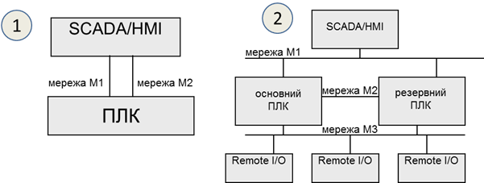

[Людино-машинні інтерфейси](https://pupenasan.github.io/hmi/)  Автор і лектор: Олександр Пупена доц. кафедри [АКСТУ НУХТ](http://www.iasu-nuft.pp.ua/) 

# Лекція 15. Інтеграція засобів SCADA/HMI з іншими підсистемами

## 15.1. Мережні архітектури

У найбільш простому випадку системи на базі SCADA/HMI мають ***одиночну*** (***standalone***) архітектуру, де на одному комп’ютері суміщені усі підсистеми, включаючи АРМ оператора. У цей же час на інших ПК в системі, що об’єднуються однією мережею, можуть також функціонувати інші SCADA/HMI, однак вони не обмінюються даними між собою. Така архітектура передбачає наявність одного оператора в один момент часу та збирання усіх даних у тій самій точці (ПК), яка слугує і для інтерфейсу з оператором. 

Одиночна архітектура передбачає можливість кількох джерел даних (ПЛК або інших засобів) у тому числі може підтримуватися резервування каналів для зв’язку з ними. На Рис. 15.1,1 показано архітектуру системи, в якій SCADA/HMI поєднані з ПЛК двома різними мережами. Такий спосіб резервування каналів повинен підтримуватися з боку підсистеми збирання даних. У випадку відсутності зв’язку по основному каналу (мережа М1) SCADA/HMI намагається налагодити зв'язок по іншому (мережа М2). Як правило, первинний канал має вищий пріоритет, тому при відновленні основного каналу збирання даних відбувається через нього. Деякі засоби SCADA/HMI надають можливість виділяти кілька резервних каналів.  

                               

*Рис. 15.1.* Архітектура з резервуванням каналів зв’язку з ПЛК (1) та з резервуванням ПЛК (2)

Схема, що показана на Рис. 15.1,1, може використовуватися і в системах з резервуванням ПЛК. У цьому випадку основний канал буде зв’язаний з основним ПЛК, а резервний – з резервним. Тим не менше, у системах з резервуванням контролерів може бути використана інша схема, яка показана на Рис. 15.1,2. Розгляд рішення з резервуванням ПЛК виходить за рамки курсу, тим не менше коротко його розглянемо. У цьому випадку, основний і резервний ПЛК забезпечують зв'язок із засобами віддаленого введення/виведення (Remote I/O) через одну й ту саму мережу (на рисунку – мережа М3). В один момент часу зв'язок із засобами введення/виведення та SCADA/HMI проводить тільки один з двох ПЛК, який відіграє роль основного. У випадку виходу його з ладу цю роль бере на себе інший ПЛК. Для контролю стану дубльованого ПЛК та обміну даними контексту процесорів використовується високошвидкісна мережа (на Рис. 15.1,2 – М2). Для функціонування такої архітектури ПЛК повинні змінювати свою адресу залежно від їх ролі (основний або резервний). Тоді для SCADA/HMI переключення буде виливатися в тимчасову відсутність доступу, пов’язаною, наприклад з відновленням буферів комунікаційного обладнання. 

Архітектура з одним ПК має ряд недоліків:

- передбачається тільки одне робоче місце оператора, тобто весь персонал, що бере участь у керуванні чи обслуговуванні, може працювати тільки через один термінал;

- відсутність резервування робить систему нестійкою до збоїв різного типу, тобто при неполадках у мережі чи в складових робочої станції втрачається зв’язок з процесом, але при цьому система керування на рівні контролерів може надалі функціонувати;

- значне навантаження на один комп’ютер не дає можливості побудувати великі системи;

- відсутність інтеграції з рівнем керування виробництвом не дає можливості повністю оцінити ефективність роботи процесу.

Для можливості доступу до керування або тільки для контролю з декількох робочих місць багато засобів SCADA/HMI пропонують ***клієнт-серверну архітектуру*** (Рис. 15.2), в якій на сервер покладається завдання збирання даних (а також архівування, контроль за тривогами та ін.), а клієнтська частина (тобто людино-машинний інтерфейс) реалізується на окремих комп’ютерах.

                               

*Рис. 15.2.* Клієнт-серверна архітектура

***Клієнт*** (***HMI клієнт, Client***) – це програма, яка реалізує людино-машинний інтерфейс доступу до даних на сервері (зокрема через мережу). ***Сервер*** (***SCADA сервер, Server***) – це програма, яка надає доступ до своїх даних клієнтам (зокрема через мережу) та реалізує одну або всі функції: збирання даних, їх оброблення, архівування, формування тривог та ін. Як правило, на комп’ютерах з програмою сервера виконуються і програми клієнтів. Слід розуміти, що клієнти і сервери у більшості випадків спілкуються між собою з використанням спеціалізованих протоколів, тобто поєднання складових від різних програм SCADA можливе тільки за певних обставин, наприклад, використовуючи технології ОРС. 

Часто для опису роботи клієнт-серверних архітектур SCADA/HMI використовують поняття ***тонкий клієнт*** (thin client) та ***товстий клієнт*** (у різних джерелах можуть називатися як fat, thick, heavy або rich client). 

Під товстим клієнтом частіше всього розуміють ПК з установленим середовищем виконання SCADA/HMI, яке виконує роль клієнта при взаємодії з іншим середовищем виконання (сервером). У даному випадку велика частина роботи, зокрема стосовно функцій ЛМІ, покладена на клієнтський застосунок, а сервер у цей час може збирати дані, обробляти їх, зберігати і т.п. Обмін між клієнтом та сервером SCADA реалізується через пропрієтарні закриті протоколи. 

При побудові архітектури на базі товстого клієнта слід враховувати деякі особливості реалізації. Зокрема, внутрішні змінні можуть належати як клієнтській частині, так і серверній. У першому випадку кожен клієнт матиме свою копію внутрішніх змінних, у другому – один і той самий екземпляр внутрішніх змінних буде доступний усім клієнтам.  

Тонкий клієнт частіше всього має меншу функціональність і не потребує встановлення спеціалізованого ПЗ. В якості тонкого клієнта можуть виступати термінальні клієнти (RDP – Remote Desktop Protocol) або WEB-браузер, а обмін даними відбувається через класичні стеки протоколів, наприклад TCP/IP. 

Ще один спосіб реалізації віддаленого підключення до засобу SCADA/HMI, що має популярну ОС, – це VNC (Virtual Network Computing). VNC дає можливість відображати екран засобу, на якому встановлено VNC Server, на іншому засобі, на якому встановлений VNC Client. Окрім відображення, доступні також функції керування, тобто пересилання натискань клавіатури та миші (або сенсора) на VNC Server. На сьогоднішній день є багато безкоштовних реалізацій VNC під різні платформи. Недоліком такого підходу є дублювання всього змісту на обох засобах, що не дає можливості повноцінно замінити клієнт-серверну архітектуру. 

Сучасні SCADA/HMI надають можливість доступу до системи через Internet або локальну мережу, використовуючи WEB-браузер. На відміну від товстих HMI клієнтів, які використовують для зв’язку із серверами SCADA спеціалізовані протоколи, ***WEB клієнти*** з’єднуються з технологічним процесом, використовуючи WEB-сервіси. Тобто вони використовують ті самі технології, що й при доступі звичайного браузера до якогось сайту в мережі Інтернет. Це має ряд переваг, зокрема:

- на відміну від протоколів обміну між HMI та SCADA, WEB-технології прозорі для комунікаційного обладнання (маршрутизатори, брандмауери, шлюзи та ін.), що дає змогу з’єднуватися через Інтернет;

- у багатьох випадках можуть використовуватися будь-які браузери, в тому числі на планшетах та мобільних телефонах;

- підвищена мобільність клієнтів, оскільки Інтернет доступний на великій території.

На Рис. 15.3 показано приклад архітектури з доступом через WEB. Для роботи такої системи необхідний запуск служб WEB-сервера, які потребують окремого комп’ютера. WEB-сервер конвертує дані, які зчитує/записує зі SCADA-серверів та передає їх WEB-клієнтам через локальну мережу підприємства або через Інтернет.

 

*Рис. 15.3*. Архітектура з доступом через WEB

Не дивлячись на привабливість WEB-доступу, слід розуміти деякі обмеження та передбачити потенційну небезпеку несанкціонованого доступу, зокрема:

- функція WEB-доступу, як правило, ліцензується окремо, тобто потребує додаткової оплати і часто – встановлення додаткового ПЗ для WEB-сервера; при необхідності доступу через Інтернет WEB-сервери розміщують на окремих ПК в зонах DMZ; 

- як правило, через WEB-клієнт доступні не всі функції, які доступні через HMI клієнт;

- ряд систем працюють тільки через обмежений перелік браузерів і потребують інсталювання додаткових програм на комп’ютер WEB клієнта;

- перед організацією доступу через Інтернет слід подбати про неможливість несанкціонованого доступу (кібербезпеку), щоб зловмисник не зміг втрутитися в процес керування.

Для багатьох засобів HMI (операторських панелей) також передбачається доступ через WEB. У цьому випадку, такий доступ надає можливість здійснювати керування не безпосередньо по місцю розташування устатковання, а віддалено від нього. 

Деякі програми SCADA по своїй суті є WEB-орієнтованими, тобто передбачають наявність клієнтів HMI тільки з WEB-доступом. Такі SCADA легко інтегруються в хмарні рішення, оскільки дають можливість розміщувати середовища виконання на віддалених серверах в Інтернеті. У цьому випадку використовуються архітектурні рішення Промислового інтернету речей IIoT (Industrial Internet of Things). Прикладом WEB-орієнтованих SCADA є Overvis (Україна, https://www.overvis.com), WebHMI (Україна, http://webhmi.com.ua), WebAccess/SCADA (Advantech, https://www.advantech.com), Integraxor (Ecava, Малайзія https://www.ecava.com) та багато інших. Хмарні SCADA та IIoT надають можливість побудувати розподілену архітектуру без необхідності встановлення ПК та їх обслуговування безпосередньо на об’єкті. Також це значно спрощує віддалений доступ та дає можливість значно спростити використання багатьох Інтернет-сервісів, таких як електронна пошта, месенжери, хмарні сховища, звіти та багато інших. Тим не менше, вибираючи рішення з використанням хмарних SCADA, треба розуміти ризики, які супроводжують такі системи, зокрема можливості тимчасової відсутності комунікації з Інтернет, кібер-атак на мережну інфраструктуру та ін. Крім того, рішення на базі IIoT включають у себе частину сервісів SCADA (збирання даних, локальне архівування, аналіз) в так званих IIoT Edge шлюзах.  

Останнім часом мобільні засоби, такі як смартфон, планшет, стали невід’ємною частиною існування будь-якої людини. Враховуючи їхню функціональну потужність, використання їх в якості мобільних терміналів було питанням часу. На сьогоднішній день більшість постачальників інструментів SCADA/HMI надають готове рішення для підключення мобільних пристроїв в якості віддалених засобів оповіщення, відображення та керування. Виділимо такі підходи до побудови таких рішень:

1) *Доступ до серверів через WEB-застосунки*. Цей підхід практично нічим не відрізняється від звичайного WEB-доступу, за винятком таких особливостей:

- необхідно врахувати діагональ екрана мобільного пристрою;

- необхідно передбачити використання платформо-сумісних технологій; наприклад, WEB-застосунки з використанням технології ActiveX працюватимуть тільки на деяких типах пристроїв;

2) *Доступ через відкриті технології, наприклад* *OPC UA*, *HTTP API*, *WEB SOCKET* *або протоколи* *IoT (MQTT*, *AMQP)*. У цьому випадку клієнтський застосунок на мобільному пристрої може бути стороннім по відношенню до серверного SCADA/HMI і розроблятися в окремому середовищі, можливо навіть на самому мобільному пристрої.  

3) *Доступ через спеціалізовані клієнтські застосунки, розроблені саме для конкретної* *SCADA.* У цьому випадку для розробника потрібно тільки налаштувати з’єднання; все інше є прозорим і прихованим від розробника.    

На сьогоднішній день є багато застосунків, так званих APPів для Android та iOS, що по суті є повноцінними HMI, які самі вміють збирати дані (використовуючи протоколи поверх стеку TCP/IP, Bluetooth), та реалізовувати інші функції (ЛМІ, тривоги, тренди і т.п). При цьому середовище розроблення також є застосунком для цих мобільних пристроїв. По суті, за невеликий проміжок часу можна розробити людино-машинний інтерфейс для невеликих задач, як обслуговування обладнання чи контроль певних виробничих операцій. Ці ж самі застосунки можна використовувати в якості клієнтів до SCADA/HMI, використовуючи стандартні протоколи промислових мереж (наприклад Modbus TCP/IP) або доступу до даних (OPC UA, JDBC тощо).     

При великій кількості джерел даних (наприклад контролерів) може використовуватись мультисерверна архітектура (Рис. 15.4). У таких системах кожний сервер збирає дані з окремої групи пристроїв, а клієнт (клієнти) мають доступ до всіх даних серверів. У деяких програмах SCADA можна виділити окремі комп’ютери для виконання функцій серверів збирання даних, серверів трендів, серверів тривог, серверів звітів, що дає змогу розподіляти ресурси між декількома апаратними засобами.

 

*Рис. 15.4.* Мультисерверна архітектура

Якщо технологічний процес є функціонально-небезпечним або втрата даних є недопустимою, то необхідно використовувати архітектури з резервуванням (Рис. 15.5). У таких системах ***основний сервер*** (Server PC) дублюється ***резервним*** (RServer PC), який функціонує разом з ним, виконує всі ті самі функції, окрім записування даних на контролери. Резервний сервер контролює працездатність основного, і у випадку виходу його з ладу починає виконувати всі його функції, в тому числі й спілкування з клієнтами та записування даних на контролери.

 

*Рис. 15.5.* Архітектура з резервуванням

Принципи роботи системи з розподіленими серверами та резервуванням можуть відрізнятися залежно від постачальника програмних засобів. 

Наведені вище приклади структур стосуються як системи керування одним відділенням, так і всього цеху чи навіть виробництва. Зрештою, автоматизація технологічних процесів для всього виробництва може бути однією великою розподіленою системою, в якій дані досить легко можуть бути надані в тій точці, де вони потребуються, незалежно від сервера, на якому вони збираються і оброблюються. У цьому випадку, якщо всі засоби SCADA/HMI постачаються від однієї фірми-виробника, таке рішення може бути реалізоване як один великий проект SCADA. Такі рішення для розподілених систем SCADA/HMI пропонують багато відомих брендів. Усі вони базуються на пропрієтарних, часто закритих протоколах, однак не потребують великих зусиль розробника для налаштування взаємодії між компонентами (клієнтами, серверами, додатковим ПЗ). У випадку реалізації подібних рішень від різних виробників завдання стає досить трудоємким, а в деяких випадках технічно нереалізованим без заміни компонентів. У наступному параграфі показані деякі варіанти реалізації такого обміну.      

## 15.2. Обмін між SCADA/HMI різних виробників

Об’єднання декількох SCADA/HMI в одну розподілену систему може знадобитися для вирішення таких завдань:

- контроль/керування станом процесу на ПК віддаленому від основних серверів, наприклад для центрального диспетчерського пункту;

- контроль за деякими параметрами суміжного відділення;  

- реалізація централізованого виробничого сервера реального часу для збирання виробничих даних, їх оброблення, уніфікації для надання верхнім рівням керування (MES/MOM);

- доступ до архівних даних трендів та тривог різних підсистем для формування централізованої звітності.  

Наведені завдання можна вирішувати різними способами, в тому числі шляхом реалізації обміну даними між контролерами. Вище наводяться приклади реалізації розподіленої системи з використанням рішення від одного виробника. Однак на українських підприємствах досить типовою є ситуація, в якій АСКТП для різних відділень реалізовані з використанням засобів автоматизації від різних постачальників. Це стосується й засобів SCADA/HMI. Тому при необхідності інтегрування таких підсистем розробник повинен у кожному конкретному випадку вибирати шляхи з кількох доступних. Інколи рішенням може бути заміна однієї або кількох підсистем. Тут розглянемо способи інтеграції, які можуть бути використані при цьому.

Найбільш придатною для обміну даними реального часу є технологія OPC. У цьому випадку SCADA може виступати як сервером OPC DA, так і сервером OPC UA. Доступ до SCADA через OPC, як правило, надається для читання/записування тегів (змінних), але може бути реалізований також інтерфейс AE (Alarm Event) та Trend. 

У ряді випадків SCADA може надавати доступ до своїх даних через стандартні інтерфейси доступу до баз даних ODBC, JDBC, OLE DB, ADO.NET та інших. Тоді дана SCADA може виступати в ролі сервера, а інша, яка може користуватися цими інтерфейсами, – в ролі клієнта. У багатьох випадках це вирішується через написання додаткового коду. 

Можливо не дуже продуктивним, але інколи єдиним рішенням може бути використання протоколів промислових мереж, що призначені для обміну між ПЛК. Наприклад, при наявності в одній із SCADA/HMI драйвера Modbus Server обмін можна побудувати по протоколу Modbus.   

При використанні скриптів на обох SCADA способи інтегрування залежать від наявних обмежень середовища програмування та інтерфейсу з операційною системою. Це можуть бути різноманітні API, в тому числі HTTP API, WebSocket, або звичайний обмін на базі стеку TCP/IP і сокетів.

У ряді випадків є можливість побудувати обмін через файли. Популярним є формат "*.CSV", оскільки він є звичайною текстовою таблицею з розділювачем і має менше проблем із сумісністю. 

Про реалізацію мережних архітектур в різних платформах можна прочитати в [посібнику](https://pupenasan.github.io/hmibook/9_1.html)     

## 15.3. Місце SCADA/HMI в інтегрованій системі керування

Вище наведено різні архітектури систем на базі SCADA/HMI, де робочі станції (клієнти) і сервери взаємодіють між собою, обмінюючись даними процесу для відображення, диспетчерського керування, архівування та формування тривог. Такий обмін відбувається на одному рівні диспетчерського керування (SCADA), тому його прийнято називати ***горизонтальною інтеграцією***. Однак у сучасних підприємствах засоби SCADA/HMI не функціонують самі по собі і повинні взаємодіяти з іншими рівнями керування. 

Класична структура інтегрованої системи керування підприємством має вигляд піраміди (Рис. 15.6), де засоби SCADA/HMI та ПЛК займають другий рівень (керування АСКТП). Вони взаємодіють з процесом через контролери (PLC), які, в свою чергу, можуть бути поєднані між собою промисловими мережами. Обмін SCADA/HMI з контролерами проходить у м’якому реальному часі, тобто коли запізнення оновлення даних не є критичним, а між контролерами – в жорсткому реальному часі, коли дані повинні надходити в чітко визначені проміжки часу. У свою чергу, промислові контролери взаємодіють з технологічним процесом через датчики та виконавчі механізми, які можуть підключатися з використанням уніфікованих сигналів або промислових мереж рівня датчиків.

 

*Рис. 15.6.* Типова технічна структура інтегрованої системи керування підприємством

Як видно з Рис.15.6, у сучасних системах керування підприємством рівень SCADA/HMI не є найвищим. Для ефективного керування всією виробничою діяльністю використовують системи керування виробництвом (АСК В), які прийнято називати ***MOM*** (Manufacturing Operations Management). До завдань MOM входять функції керування різними виробничими операціями, зокрема (не повний перелік): 

- *керування операціями основного виробництва* (системи MES – Manufacturing Execution Systems): планування, диспетчерування, запуск виконання, контроль та звітність виконання і т. п; системи призначені для різного типу керівників виробництва (начальник виробництва, начальник дільниці і т. п); 

- *керування операціями по обслуговуванню устатковання* (***ТОіР*** – технологічне обслуговування та ремонт; ***EAM*** – Enterprise Asset Management, який включає також функції вищого рівня): планування, контроль стану, контроль виконання, звітність, замовлення деталей і т. п.; системи призначені для інженерно-технічних підрозділів підприємства (механіки, електрики, КВПіА);

- *керування операціями по контролю якості* (LIMS – Laboratory Information Management System): планування та виконання контролю якості, формування звітної інформації з якості і т. п.; системи призначені для керівників з якості, працівників лабораторій і т. п; 

- *керування операціями з запасами* (WMS – Warehouse Management System): планування та контроль наявності, переміщення сировини, напівпродуктів та продуктів; системи призначені для начальників складів, виробничників та іншого персоналу, відповідального за запаси.     

У свою чергу, системи MOM взаємодіють із системами рівня керування підприємством (АСК П), а саме – його фінансово-економічною діяльністю. До таких систем належать ERP (Enterprise Resource Planning), призначення яких – автоматизація планування та виконання бізнес-процесів, організаційно-економічної діяльності, документообігу і т. п. Також там можуть виконуватися інші спеціалізовані застосунки, як ***SCM*** (Supply Chain Management) для керування ланцюжком постачань. З рівня MOM в системи рівня АСК П передаються узагальнені виробничі показники, а на рівень MOM – об’ємні виробничі плани.

Системи керування рівня MOM та АСТКП забезпечують виконання виробничих операцій, або, іншими словами, автоматизують операційні технології ***OT*** (Operation Technologies). Системи керування бізнес-процесами автоматизують інформаційні процеси; вони належать до класу ***IT*** (Information Technologies). На *виробничому* підприємстві ці два сектори взаємодіють для забезпечення функціонування єдиної інтегрованої системи керування усім підприємством.

Для реалізації єдиної інтеграційної платформи даних OT часто використовуються засоби Historian.  

Фізична структура інтегрованої системи може відрізнятися залежно від підходів. Наприклад, інтегрування рівнів може проводитися з використанням технологій промислового Інтернету речей (IIoT), а явно виділених систем деяких рівнів може не бути. 

## 15.4. Інтегрування зі SCADA та ієрархія устатковання 

При доступі до даних SCADA/HMI використовуються ті самі технології, що й наведені в попередньому підрозділі. Однак треба розуміти, що забезпечення інтеграції на рівні даних – це лише частина завдання, інша частина – це інтерпретація цих даних.    

Для стандартів інтегрування ISA-88 та ISA-95 дані з нижніх рівнів представляються в контексті моделі рольової ієрархії устатковання (Рис. 15.7). Відповідно до цієї ієрархії, кожне устатковання (***equipment, обладнання***) виконує певну роль у процесі виготовлення продукції. При інтегруванні верхніх рівнів з системами АСКТП керування та контроль відбуваються саме в поняттях устатковання. Тобто підконтрольне устатковання знаходиться в якомусь стані, і на нього йде певна команда. Розглянемо, яке саме устатковання стосується АСКТП.          

 

*Рис. 15.7.* Рольова ієрархія устатковання підприємства

***Модуль керування*** (***Control Module***) – забезпечує виконання функцій керування обладнанням. По суті, це ті засоби та їх функції, які прийнято показувати на схемах автоматизації як засоби КВПіА: датчики, виконавчі механізми, регулятори та їх об’єднання. Цей рівень устатковання може бути цікавим для систем класу ТОіР та EAM. Наприклад, системи ТОіР (технічного обслуговування та ремонту) може цікавити інформація про кількість спрацювань, мотогодини роботи, статистика тривог і т. п. Зверніть увагу, що в цьому прикладі систему верхнього рівня цікавить інформація не про стан датчиків положення, а про узагальнений стан виконавчого механізму.     

***Модуль технологічного устатковання*** (***Equipment Module***) – виконує певну дію в технологічному процесі, наприклад, перекачування продукту (насосні агрегати) чи нагрівання (теплообмінники) і т. п. Вони включають у себе різне технологічне устатковання та модулі керування. При інтегруванні з верхнім рівнем так само може передаватися інформація про стан. 

***Робочий вузол*** (***Work*** ***Unit***) – виконує певну одну або кілька виробничий операцій. Для порційного виробництва (***Технологічний вузол,*** ***Unit***) це може бути реактор або ємність, в якій виробляється певна порція продукту. Для неперервного виробництва це може бути певний апарат неперервного типу, для дискретного – якась машина (наприклад пакувальна). На верхній рівень може передаватися стан устатковання, кількість виготовленої продукції та інші узагальнені показники й статистичні дані. З верхнього рівня можуть передаватися команди на запуск (зупинку, паузу і т. п), задану кількість, потрібну операці, рецепт і т. п.  

***Робочий центр*** (***Work Center***) – це набір устатковання, що виготовляє певний напівпродукт. Як і в попередньому випадку, може відбуватися обмін станами, командами і параметрами.  

Як правило, рівень АСКТП не виходить за межі робочого центру, а часто – й за рамки робочого вузла. Тому устатковання на вищих рівнях не стосується SCADA.

   Отже, з кожним устаткованням пов’язані, як мінімум, два параметри: стан і команда. Для модулів керування та модуля технологічного устатковання стан може бути представлений набором статусів типу відкрито/закрито, відкривається/закривається або включено/відключено, а також нормальна робота/тривога і т. п. Для робочих вузлів і робочих центрів стан може описуватися складним автоматом станів. Крім станів та команд, устатковання також може мати режим (наприклад, ручний/автоматичний), статистичну інформацію про кількість спрацювань, мотогодин роботи, кількість поломок і т. п. 

Наявність моделей устатковання на кожному з рівнів робить можливим побудувати єдину базу SCADA. Це значно спростить інтегрування з функціональної точки зору. Якщо в рівень MOM необхідно передати якусь інформацію, зручно буде, якщо вона буде вже підготовленою в термінах устатковання. Це може бути також певна звітна інформація, наприклад, про кількість тривог, статистика по трендах, тощо за певний період. У засобах SCADA/HMI деяких виробників з’являється підтримка устатковання. У більшості випадків це зроблено не з метою інтегрування, а для спрощення контролю та керування. У наступних параграфах наведено приклади використання моделей устатковання в SCADA Citect та zenon, які надають можливість у середовищі виконання фільтрувати тривоги та записи в журналах по вибраному устаткованню, а також виконувати функції для нього. Для середовища розроблення устатковання можна використовувати як допоміжне поле для фільтрації. Це тільки частина з переліку доступних функцій, детальніше описано нижче.

Розглянемо використання ієрархії устатковання на прикладі Citect. У SCADA Citect наявність устатковання не обов’язкове. Однак його використання значно поліпшує для оператора ситуаційну обізнаність, керованість процесом та може значно скоротити час розроблення та модернізації. Починаючи з версії 7.4, в Citect з’явилися додаткові таблиці з означенням моделі устатковання (equipment; рос. лок. "оборудование"). Кожен запис устатковання включає ім’я, яке має ієрархічну структуру, де ієрархічні рівні розділені крапкою. Так, “Loops.Level”, передбачає устатковання з ім'ям “Level”, що входить в устатковання верхнього рівня з ім'ям "Loops" (Рис. 15.8). Ієрархію можна створювати шляхом добавлення подібних імен у редакторі моделі устатковання Citect Studio, але зручніше це робити через спеціальний редактор устатковання, який входить в середовище розроблення Citect. Цей редактор відображає модель у наглядному деревоподібному вигляді (див. Рис. 15.8).

 

*Рис. 15.8*. Зв'язок устатковання з тегами введення/виведення

Після створення екземпляра устатковання його можна вказати в налаштуваннях тегів, трендових тегів та тегів тривог. Наприклад, тег із назвою LOOP_1_PV слугує елементом ProcessVariable в устаткуванні "Loops.Level" (див. Рис. 15.8). Тепер до тегу в будь-якому місці проекту можна звертатися двома способами: 

- через ім’я тегу “LOOP_1_PV”

- або через елемент устатковання “Loops.Level.ProcessVariable” 

Після встановлення середовище розроблення Citect за замовчуванням редактор графіки відображає вікно вибору тегу саме за ім'ям устатковання, а не ім'ям тегу. Це можна змінити в налаштуваннях параметрів Citect Studio.     

Окрім іншого формату посилань на теги, їх прив’язування в якості елементів устатковання дає такі можливості в середовищі виконання (Рис. 15.9):

- на сторінці переглядача тегів фільтрувати список тегів відповідно до вибраного устатковання;

- на сторінках активних тривог, журналів подій (SOE) відображати записи тільки для елементів вибраного устатковання;

- відображати тренди для вибраного устатковання;

- використовувати навігатор устатковання.  

 

*Рис. 15.9.* Використання устатковання в якості фільтра в середовищі виконання 

Використання устатковання в якості фільтру значно спрощує вибір необхідних тривог, тегів у списку або трендів. У першому випадку оператор аналізує тільки ті тривоги та події із журналу, які стосуються конкретної частини процесу. При цьому він робить це звичайним вибором у навігаторі. Те саме стосується відображення трендів. Зрештою, можна зробити окремі вікна, що динамічно прив’язуються до конкретного устатковання і надають усю необхідну інформацію саме по ньому. Для цього в Citect є багато Cicode функцій, що надають можливість отримувати дані з тегів про устатковання, та навпаки, робити навігацію по устаткуванню, отримувати та змінювати його властивості. Властивість устатковання Page (рос. лок."Страница") дає можливість задати сторінку, яка буде асоціюватися з ним. Через цю властивість навігацію за сторінками можна зробити з використанням навігатора устатковання, що доступний поруч з меню в шаблонах стилю SxWStyle. 

Устатковання також може мати стани, за допомогою яких можна налаштувати керування ним через планувальник. Крім тегів, до устатковання можуть бути прив’язані акумулятори (Accumulator). Акумулятори можуть рахувати кількість запусків, інтегрувати певну величину та рахувати загальний час роботи. При конфігуруванні в Citect інтерфейсу OPC ієрархія устатковання може бути використана для формування простору імен ItemID.

Окрім додаткових можливостей, які надає ієрархія устатковання SCADA Citect у середовищі виконання, розробник проекту може використовувати його як вихідну точку проектування. Враховуючи, що устатковання (Equipment) є додатковою властивістю тегів, їх можна використовувати в якості фільтрації та упорядкування записів в табличних редакторах тегів. Механізм устатковання дає можливість зовсім по-іншому побудувати процес розроблення. Класичний для Citect до версії 7.3 механізм розроблення передбачав створення тегів (за необхідності – акумуляторів) через заповнення таблиць або полів у редакторі. Це має ряд недоліків, зокрема передбачає велику кількість рутинної роботи по заповненню. При необхідності зміни тегу, розробнику доводиться шукати його в таблиці тегів, де змінювати поля, потім у таблиці тегів тривог, а потім, можливо, ще в таблиці трендових тегів. Більшість об’єктів передбачають однотипні структури, які згуртовані навколо устатковання. Так, з насосом пов’язано кілька параметрів (частота обертів, операційний стан, температура підшипників і т. п.), тривог та трендів. Citect дає змогу процес створення розпочати з устатковання, яке автоматично створить пов’язані з ним теги. 

Спочатку визначається тип устатковання, в якому задаються правила створення устатковання та необхідних тегів, що з ним пов’язані. Тип устатковання описується файлом XML, але розробникові не обов’язково розуміти його внутрішню структуру. Типи можна створювати та редагувати через редактор типів устатковання, який представлений окремою вкладкою в редакторі устатковання (Рис. 15.10).      

 

*Рис. 15.10.* Редактор типів устатковання

Основним змістом типу є елементи (Item), кожен з яких може асоціюватися з змінним тегом, тривоговим тегом або трендовим тегом. При створенні тегів він міг прив’язуватися до елемента існуючого устатковання. Тут же конфігурується зворотний напрямок – від створення  устатковання та його елемента до тегів. На Рис. 15.10 до елемента Setpoint будуть прив’язані змінний тег, аналоговий аларм та трендовий тег. Екземпляри устатковання одного типу матимуть однаковий набір елементів, що створюватимуться за однаковими правилами.

На Рис. 15.11 показано правила створення змінного тегу для елемента з ім'ям "Setpoint". У лівій частині вказуються імена властивостей тегу, а справа – правила створення їх значення. Текст, що взятий у фігурні дужки "{}", передбачає вставку замінника, що означений у цьому тексті. Так,  `{equipment.tagprefix}_SP` вказує на те, що значенням даної властивості буде конкатенація (поєднання) значення властивості “Tag prefix” (рос. лок. "Префикс дескриптора") устатковання та `_SP`.   

 

  *Рис. 15.11.* Налаштування правил створення тегів, асоційованих з елементом 

У якості полів устатковання можуть бути усі, що перелічені на Рис. 15.11 (показані через контекстне меню), та додаткові користувацькі. Таким чином, при створенні нового устатковання в редакторі вказується його тип, ім’я, заповнюються його властивості, після чого необхідно виконати команду оновлення устатковання. У результаті оновлення створиться не тільки устатковання, а й усі необхідні теги. При зміні типу устатковання (видалення, зміна, добавлення елементів) процедура повторюється. При цьому всі створені теги не доступні для редагування з редактора тегів, вони оновлюються тільки через зміну устатковання та його типу. 

[<-- Лекція 14. Інші підсистеми: підсистема роботи з рецептами, звітами, календарного планування](lec14.md)

[--> Лекція 16. Життєвий цикл SCADA/HMI](lec16.md) 

# Контрольні запитання

1.    На яких мережних архітектурах можуть базуватися системи SCADA/HMI?
2.    В якому випадку варто використовувати одиночну архітектуру SCADA/HMI? Які недоліки вона має? 
3.    Покажіть на прикладі однієї з SCADA/HMI, як відбувається резервування каналів введення/виведення.
4.    Розкажіть про принципи організації клієнт-серверної архітектури. Покажіть на прикладі однієї із SCADA. 
5.    Наведіть приклади тонких клієнтів.
6.    Розкажіть про реалізацію мережної архітектури SCADA/HMI з доступом через WEB. Які переваги та недоліки має така архітектура?
7.    Розкажіть про можливі принципи організації HMI-доступу через мобільні пристрої. Що необхідно враховувати при розробленні таких рішень?
8.    Розкажіть про необхідність і принципи побудови мультисерверних архітектур. Покажіть на прикладі однієї із SCADA. 
9.    Розкажіть про необхідність і принципи функціонування архітектур із резервуванням серверів. Покажіть на прикладі однієї із SCADA.
10.    Покажіть на прикладі однієї із SCADA принципи організації внутрішніх мережних змінних у розподілених архітектурах. 
11.    Наведіть приклади, в яких необхідно об’єднати кілька засобів SCADA/HMI різних виробників між собою.
12.    Яке місце посідає SCADA/HMI ієрархії керування підприємством?
14.    Які функції входять до завдань рівня керування виробничими операціями? Навіщо SCADA інтегрується з застосунками рівня MOM? 
15.    Які системи керування підприємством типово відносять до ІТ, а які до ОТ?
16.    На прикладі однієї із SCADA/HMI покажіть використання ієрархії устатковання.
