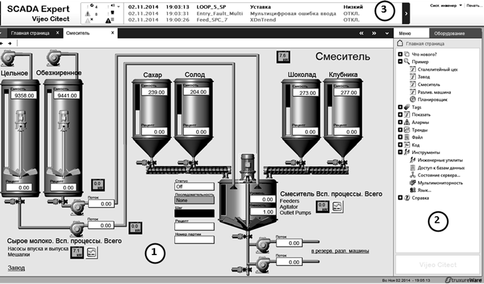
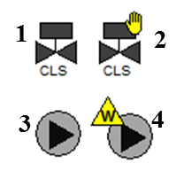
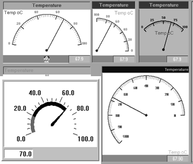
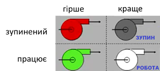
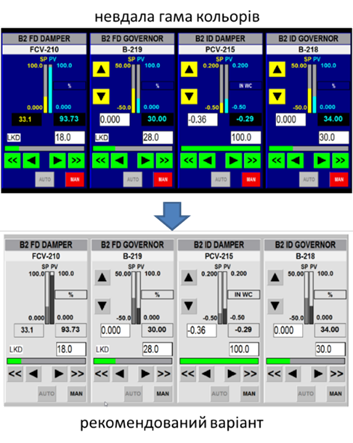
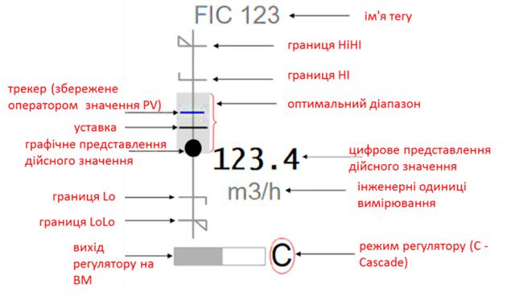

[Людино-машинні інтерфейси](https://pupenasan.github.io/hmi/)  Автор і лектор: Олександр Пупена доц. кафедри [АКСТУ НУХТ](http://www.iasu-nuft.pp.ua/) 

# Лекція 2. Функції графічного інтерфейсу SCADA/HMI та високоефективний HMI

## 2.1. Загальний вигляд графічного HMI

Загальний вигляд графічного людино-машинного інтерфейсу (HMI) суттєво залежить від характеру технологічного процесу, прийнятих стандартів (корпоративних, галузевих) на побудову автоматизованих систем та індивідуальних потреб замовника (наприклад, технологів, інженерного персоналу). Сьогодні найбільш передові досягнення у області HMI знайшли відображення у стандарті ISA-101, який неодноразово згадується в даному курсі. Далі на прикладах розглянемо найбільш типові підходи до побудови графічного інтерфейсу АРМа. 

**Графічна підсистема** АРМа оператора має багатовіконний інтерфейс з можливістю відображення у вікнах **дисплеїв** (**display**) процесу, трендів, тривог та іншої службової інформації. Враховуючи, що вся доступна інформація не може вміститися в одному вікні, в один момент відображається тільки один дисплей процесу. Такі дисплеї можуть називатися по-різному, залежно від термінології прийнятої для вибраної SCADA/HMI, наприклад **сторінки** (**pages**), **екрани** (**screens**) або відображення (view). Дисплеї, які призначені для відображення технологічного процесу або його частини, часто називають дисплейними **мнемосхемами** (mimic diagram, mimic, mnemonic) або дисплеями процесу (process display). На рис. 2.1 показано приклад загального вигляду дисплея, де мнемосхема процесу займає більшу його частину. 

                               
Рис. 2.1. Приклад загального вигляду дисплея людино-машинного інтерфейсу  (SCADA Citect): 1 – дисплейна мнемосхема процесу; 2 – панель(меню) доступу до інших сторінок та команд; 3 – вікно відображення активних тривог та подій

Такий спрощений вигляд установки з відображенням значень технологічних параметрів у плинний момент часу дає оператору інформацію про стан цієї частини процесу. Для перегляду інших частин процесу оператор повинен відкрити інший дисплей, наприклад, за допомогою панелі керування, меню або інших елементів керування. Таким чином, використовуючи меню або панель навігації, оператор може переглянути детально будь-яку частину процесу.

Слід зазначити, що сучасні підходи передбачають дещо інший спосіб розділення графічного інтерфейсу на функціональні частини процесу. Замість переключення сторінок, відбувається переключення відображення на панелі тієї самої сторінки (рис.2.2). Таким чином той самий тип інформації на сторінці відобаржається у тому самому місці, але змінюється контекст, тобто те що вибрав оператор.    

<a href="media1/alt1.png" target="_blank">

Рис. 2.2. Приклад загального вигляду дисплея людино-машинного інтерфейсу  (SCADA Citect SA):  1 – дисплейна мнемосхема процесу; 2 – панель(меню) доступу до інших сторінок та команд; 3 – вікно відображення активних тривог та подій для виділеного обладнання

Для введення дій, перегляду уточнювальної інформації чи тимчасового відображення ряду параметрів також використовують спливаючі вікна. Вони відкриваються поверх основного вікна і не заважають перегляду його вмісту. Іншим способом є використання частини того самого екрану, яка заповнюється в залежності від виділеного компоненту. 

Хоча кількість дисплеїв процесу, як правило, не обмежується системою, оператор не може вчасно зреагувати на зміни в системі, постійно їх перемикаючи. Тому в більшості випадків в графічній підсистемі є головна мнемосхема, де відображається найбільш загальна інформація про весь процес. Крім того, всі технологічні параметри, що потребують підвищеного контролю з боку оператора, повинні відслідковуватися підсистемою тривожної сигналізації (наприклад, вихід значення змінної за аварійні межі). Графічна підсистема повинна бути розроблена таким чином, щоб тривоги, які з’явилися, відразу привертали увагу оператора. Останні тривоги, як правило, показуються у вигляді постійно видимого **вікна активних тривог** (див. рис. 2.1) або окремого підсвічуваного елементу, що вказує на наявність нештатної ситуації в системі. Альтернативним може бути постійно відображення кількості активних тривог, а самі повідолмення доступні через перехід на відповідну сторінку. 

У загальному графічний людино-машинний інтерфейс реалізується через:

- елементи відображення, які надають операторові інформацію про стан змінних процесу;

- елементи введення, що надають можливість впливати на процес шляхом зміни значень змінних або відправки команд.

Часто функції відображення та введення комбінуються в одному елементі. Далі розглянемо детальніше способи відображення та введення, а також типові елементи, які використовуються для цього.

## 2.2. Способи та елементи відображення стану процесу

Інформація про значення технологічних параметрів повинна бути надана в такому вигляді, щоб оператор швидко визначив загальний стан процесу. Для цього, окрім відображення значення величини у вигляді тексту, можна використовувати різного типу зміни властивостей графічного об’єкта, зокрема:

- кольору;

- тексту;

- видимості;

- вигляду зображення;

- геометричних розмірів;

- заповнення;

- позиції на екрані;

- кута повороту. 

Зміну якоїсь властивості графічного елемента залежно від значення змінної часто називають **анімацією**. 

Анімація кольору використовується для показу стану змінної процесу або устатковання чи агрегату. Яскраві червоні та жовті кольори прийнято використовувати для сигналізації відповідно аварійного та передаварійного стану, а всі інші – для уточнення діапазону нормального стану. Останнім часом передові організації-розробники рекомендують використовувати відтінки сірого кольору а також білі та чорні кольори. Інші кольори рекомендуються використовувати для виділення станів елементів, на які особливо треба звернути увагу, або для розрізнення елементів між собою (трубопроводи з різною рідиною, графіки на трендах тощо).

Для відображення стану дискретної змінної (типу "увімкнено"/"вимкнено") можна використати два кольори. Наприклад, зелений може вказувати на стан "увімкнений", а сірий – для стану "вимкнений". Згідно з останніми дослідженнями, бажано використовувати чорно-білу гаму кольорів, для даного прикладу – пару білий/темно-сірий, як показано на рис. 2.3. У будь-якому випадку призначення кольорів необхідно заздалегідь узгодити між розробниками та замовниками.

 

Рис. 2.3. Приклад зображення стану дискретної змінної: 1– клапан відкритий; 2 – клапан закритий; 3 – насос увімкнений; 4 – насос вимкнений

Стан аналогової змінної теж можна показати у вигляді зміни кольору елемента або його частини. У цьому випадку колір може вказувати на діапазон, в якому знаходиться значення змінної (рис. 2.4). У такий спосіб оператор швидко може зорієнтуватися, чи знаходиться змінна в нормі, або в якому технологічному режимі знаходиться установка. Слід зазначити, що згідно останнім дослідженням наведений на рис.2.4 спосіб відображення числової змінної не є найкращим, а рекомендовані способи відображення розглянуті нижче.

 

Рис.2.4. Приклад зображення різного стану аналогової змінної шляхом зміни кольору фону та тексту

Зміна кольору елемента часто використовується для сигналізації. Це буде розглянуто в інших лекціях. 

Стан періодичного процесу також може відображатися у вигляді різних кольорів або відтінків. Так, стани "ПУСК", "СТОП", "БЛОКУВАННЯ", "ПАУЗА" можуть відображатися на одному й тому самому елементі у вигляді однойменних написів з різним кольоровим підсвічуванням. Крім того, активний крок (етап) процесу можна показати на діаграмі станів у вигляді яскравого елемента. Так, на рис. 2.5 показано діаграму стану 4-х танків, один погляд на яку відразу вказує на активні кроки.

 

Рис.2.5. Приклад зображення активних кроків (етапів)

Поряд з кольором та текстом нерідко використовується миготіння. Цей тип анімації в основному призначений для привертання уваги оператора до події, що виникла й потребує його реакції. Найчастіше миготіння використовується в підсистемі тривог, де оператор повинен підтвердити факт, що він побачив тривогу, шляхом її квитування – активної дії (наприклад, натискання кнопки). Таким чином, миготіння може тривати доти, поки оператор не зверне уваги і не підтвердить тривогу.

Зміна видимості елементів може використовуватися для різних функцій. Наприклад, на рис. 2.6(2) поява зображення руки вказує на ручний (дистанційний) режим роботи клапана, а на рис. 2.6(4) поява трикутника із символом "W" – на наявність попереджувальної тривоги, пов’язаної з даним насосом. Крім того, властивість видимості може бути використана для виведення на екран операторові тільки тих елементів, які використовуються в цей момент.

 

Рис.2.6. Приклад зображення стану устатковання шляхом зміни видимості

Одним із наглядніших способів представлення аналогової величини є показ ступеня наповненості фігури у відсотковому відношенні (заливки). На рис. 2.7 наведено декілька прикладів заливки в якості відображення рівня в збірниках та наповнення трубопроводу. Тут слід зазначити, що згідно останнім дослідженням використання анімації рівня саме в такому вигляді не рекомендується, про що буде сказано нижче. 

 

Рис.2.7. Приклади використання вертикальної заливки

Хоч інтуїтивно заливка підходить для відображення рівня (ступеня заповнення), анімацію заповнення використовують для будь-яких аналогових змінних процесу. Як правило, для цього в засобах SCADA/HMI доступні стандартні елементи, які прийнято називати **стовпчикові діаграми**, або **гістограми**. На рис. 2.8 наведено приклади стовпчикових діаграм, на яких, окрім самого стовпчика, показано вимірювальну шкалу, а також відображено аварійні та попереджувальні межі, щоб оператор бачив, у якому діапазоні зараз знаходиться величина. Стовпчикові діаграми також можуть змінювати колір заповнення стовпчика залежно від значення та показувати бажане значення величини.

 

Рис.2.8. Стовпчикові діаграми (гістограми): ліворуч – вертикальні; праворуч – горизонтальні

Крім стовпчикових діаграм, для відображення значення аналогових величин можна використовувати **кругові діаграми**. Так, на рис.2.9 кругова діаграма показує плинну витрату речовини. Так само можна показувати ступінь відкриття регулюючого органу. На рис.2.9 у нижній частині фільтра F3 за допомогою кругової діаграми показано, скільки часу пройшло з початку етапу фільтрації відносно заданого.

        

Рис.2.9. Фрагмент мнемосхеми з різними типами діаграм

За допомогою анімації руху по вертикалі чи по горизонталі можна показувати як значення вимірюваної величини, так і значення уставки (заданого або бажаного значення). Так, на рис.2.9(праворуч) показано стовпчикові діаграми з відміткою заданих значень (вказані трикутними стрілками). 

Анімація обертання (зміна кута повороту), як правило, використовується в **стрілочних індикаторах** (рис. 2.10). Цей тип графічних елементів інтуїтивно зрозумілий оператору, а інформація з нього швидко сприймається. Комбінація з анімацією кольору поліпшує процес сприйняття.

        

Рис.2.10. Стрілочні індикатори

Крім цього, анімацію руху застосовують, щоб показати залежність однієї змінної від іншої або розподіл (градієнт) параметрів у просторі. Наприклад, на рис. 2.11 показано значення температур на контрольних тарілках колони у вигляді точок, розміщених на горизонтальних лініях. Поєднавши ці точки, можна показати градієнт розподілу температур по висоті колони. Застосувавши такий підхід разом з анімацією кольору, можна одним поглядом оцінити стан роботи колони.

 

Рис. 2.11. Приклад відображення градієнта температур по висоті колон

Для відображення тенденції зміни значення технологічних змінних використовуються **самописці**, які також називають **трендами реального часу**.

Наприклад, у мнемосхемі на рис.2.12 самописець дає операторові уявлення про поведінку тиску, оскільки різке його підвищення може вказувати на забитість фільтраційного матеріалу. Слід зазначити, що в такому випадку абсолютна величина тиску не має такого значення, як його зміна в часі. А на рис.2.9 самописець показує тенденцію відхилення дійсного значення витрати від заданого, що значно інформативніше, аніж бачити тільки їхні плинні значення.

Рис.2.12. Приклад мнемосхеми з використанням самописців і кругової діаграми

Крім того, на мнемосхемі рис.2.12 задіяно функцію видимості, оскільки самописець і кругова діаграма показані тільки для працюючого фільтра, тому що в іншому випадку вони не мають ніякого значення і тільки заплутують оператора надлишковою непотрібною інформацією.

Як видно з рис.2.13, самописець часто використовується у вікнах налаштування регулятора, оскільки саме вигляд перехідного процесу дає наладчикові інформацію про вдалий підбір його настройок. 

Сучасні програми SCADA/HMI дають можливість залежно від значення змінних керувати активністю мультимедійного контенту, наприклад фільмів, аудіо або різного типу анімації GIF, Flash і т. д. Однак не слід зловживати цими засобами, тому що їхнє надмірне використання тільки погіршує процес сприйняття інформації та адекватну оцінку стану процесу. 

 

Рис.2.13. Приклад використання самописця

## 2.3. Способи та елементи введення (зміни значення змінних)

Графічні елементи, які використовуються для зміни значення змінних або відправки команд, називають **елементами керування**. Впливати на ці елементи можна, використовуючи один з доступних елементів введення:

- маніпулятор "миша";

- сенсорний екран;

- клавіатура. 

Для виконання команд для зміни значення дискретних змінних типу "увімкнути"/"вимкнути" використовуються кнопки, перемикачі або графічні еле­менти з цими функціями. Графічний вигляд таких елементів може бути дуже різним (рис. 2.14). Тим не менше, можна виділити два типи команд для таких елементів:

- перемикання, яке приводить до зміни значення ВКЛ на ОТКЛ, та навпаки;

- записування константи, яка відповідає одному зі станів: "ВКЛ" або "ОТКЛ".

Можна здогадатися, що на рис.2.14 показано перемикачі, оскільки команди (наприклад по кліку миші) приводять до зміни значення на обернене. Однак функціональність таких елементів не обов’язково збігається із зображенням, тому слід заздалегідь обговорювати їх із розробником.

Рис.2.14. Приклади зображення перемикачів

На рис.2.15 наведено приклади використання кнопок із командами записування константи. В обох прикладах для включення та виключення установки/двигуна необхідно використати різні кнопки: "Начать" та "ВКЛ" для включення і "СТОП" та "ОТКЛ" для відключення. 

 

Рис.2.15. Приклади використання

Аналогічним способом можна записати значення константи для аналогової або текстової змінної. Однак цей спосіб не такий вживаний, тому що є необхідність у записувані будь-яких значень з дозволеного діапазону введення. Один з найбільш універсальних способів – ввести значення з клавіатури в полі для введення. Для цього елемент введення отримує курсор введення, який називають **фокусом**. У більшості засобів SCADA/HMI по отриманні фокуса значення вводиться безпосередньо в поле для введення (рис. 2.16). Бувають і інші способи введення значення, як, наприклад, набір значення під елементом, що отримав фокус.

Рис.2.16. Різні способи введення значення аналогової змінної.

Враховуючи, що у зв’язку з виробничими умовами чи наявністю сенсорного екрана клавіатури на АРМі може не бути, для введення значення можна використати віртуальну клавіатуру (див. рис.2.16). 

Більшість SCADA/HMI обмежують введене значення в дозволених межах, що зменшує ймовірність помилкової дії оператора. 

Введення з клавіатури надає змогу записати вказане значення з дозволеного діапазону, однак часто операторові необхідно змінити його відносно плинного стану. Крім того, оператор при керуванні користується нечіткими більш інтуїтивними поняттями, на кшталт "трохи збільшити" чи "сильно зменшити", або "відкрити десь наполовину". Для такого типу керування більш підходять "аналогові" засоби керування типу повзуна чи кнопки "більше/ менше".

**Повзуни** (slider) призначені для зміни значення змінної шляхом пересування "ручки" по шкалі від мінімального до максимального значення. Повзуни бувають вертикальними, горизонтальними та круговими (рис.2.17).

 

Рис.2.17. Приклади повзунів.

Приклад використання вертикального повзуна показано на рис.2.18 для завдання заданого значення та ручного виходу на виконавчий механізм. Серед усіх елементів введення повзун виділяється найшвидшим способом зміни значення змінної. 

Для зміни значення змінної на кшталт "трохи більше" чи "трохи менше" найкраще використовувати кнопки ступеневої зміни. На рис.2.18 кнопки "більше" та "менше" поряд з повзунами відповідно збільшують та зменшують значення на 1%. Іноді крок зміни параметра залежить від тривалості натиснення відповідної кнопки. Чим більша тривалість натиснення кнопки, тим більша величина кроку і з більшою швидкістю змінюється параметр.

Рис.2.18. Приклади використання кнопок "більше" та "менше" .

Це не весь перелік способів та елементів відображення та зміни, які можуть використовуватися в засобах HMI. Нижче наводяться деякі елементи високоефективних людино-машинних інтерфейсів, які можуть значно покращити ситуаційну обізнаність.

## 2.4. Вплив на ситуаційну обізнаність 

Вище ми розглянули тільки основні способи відображення стану процесу та ручного керування. Правильне їх використання сильно впливає на розроблення високоефективних HMI. Це у свою чергу тісно пов’язане з ергономікою, яка є окремою дисципліною, і її розгляд виходить за рамки даного курсу. Тим не менше, тут зупинимося на деяких аспектах, які стосуються саме розроблення інтерфейсу. 

Виділимо три складові, які впливають на ефективність роботи оператора:

1)   правильне усвідомлення ситуації (ситуаційна обізнаність);

2)   правильне прийняття рішень;

3)   достатній час для усвідомлення, прийняття рішень та безпомилкової реалізації керуючої дії

На правильність прийняття рішень оператором крім самого людино-машинного інтерфейсу також впливає використання інших функцій SCADA/HMI – тривожної сигналізації, трендів, формування допомоги, підтримка прийняття рішень і т. п. Не менш важливими факторами є первинне навчання операторів, періодичні тренінги, аналіз минулих ситуацій і т. п., які є частиною життєвого циклу системи.   

Як зазначено у стандарті ISA-101, проведення досліджень показали, що недостатня ситуаційна обізнаність була одним із основних факторів нещасних випадків, пов’язаних із помилками людини. Під ***ситуаційною обізнаністю* (**усвідомленням ситуації) розуміють не тільки сприйняття теперішнього стану об’єкта, а й прогнозування на майбутнє. Оператор повинен реагувати на відхилення стану від бажаного, який задається інструкціями, порадами та навіть власним досвідом. При отриманні інформації необхідно враховувати сенсорні можливості та обмеження користувача в її сприйнятті, що зумовлено як його суб’єктивними властивостями, так і зовнішніми обставинами. На продуктивність користувача та основні когнітивні процеси (здатність розуміти, пізнавати, вивчати, усвідомлювати, сприймати і перероблювати зовнішню інформацію) впливає рівень завантаженості роботи, усвідомлення ситуації та складність завдання, кожен з яких може бути оптимізованим засобами HMI.

Одна з основних ідей побудови високоефективних HMI ґрунтується на тому принципі, що **за нормального функціонування процесу дисплеї повинні проявляти мінімальні сенсорні стимулювання, тобто не привертати до себе уваги**. І навпаки, **коли процес відхиляється від норми, засоби HMI повинні проявляти візуальні та звукові активності**. Для цього можна скористатися кольором, яскравістю та контрастністю елементів, взаємним їх розміщенням, рухом, блиманням чи миготінням, видимістю та звуковими оповіщеннями. Далі розглянемо рекомендації стандарту щодо використання цих властивостей.  

**Використання кольору, яскравості та контрастністю**

   Конструкція HMI повинна враховувати візуальні обмеження групи користувачів у середовищах, де повинні виконуватися завдання, пов'язані з процесом (робоче місце оператора). При виборі засобів HMI, кольорів та контрастів дисплеїв та елементів необхідно враховувати зовнішнє освітлення. У нормальному стані процесу елементи HMI не повинні бути надмірно контрастними, однак за необхідності інформація повинна чітко сприйматися. Під час проектування слід враховувати потенційні недоліки або відсутність сприйняття кольорів операторами. Відмінності в кольоровому сприйнятті для поширених типів колірної сліпоти (дальтонізму) показані на рис.2.19. 

 

*Рис. 2.19.* Відмінності кольорового сприйняття для найбільш поширених типів дальтонізму

Слід використовувати відповідний диференційний контраст і яскравість. Для всіх користувачів вибрані кольори повинні відрізнятися один від одного і мають бути перевірені на зручність використання. Як правило, колір слід використовувати для підкреслення ключової інформації, такої як тривоги та аномальні умови. Зверніть увагу, що при використанні зеленого та червоного кольорів у якості позначення увімкненого та вимкненого обладнання для більшості людей з дальтонізмом сприймаються практично однаково. Тому для розділення елементів можуть бути використані їх контраст та яскравість, наприклад, білий іде в контрасті з темно-сірим (як відтінок білого). На рис. 2.20 показано приклад використання позначення контрастності та яскравості замість кольору для стану насосів.

 

*Рис.2.20.* Використання контрастності та яскравості замість кольору 

Корисно перевірити кольорове зображення, перетворивши його на градації сірого, щоб переконатися, що всі комбінації елементів мають достатній контраст, який може виявити користувач з дальтонізмом.

Кольори, які використовуються для індикації тривоги відповідно до методології тривожної сигналізації ISA-18.2 (буде розглянуто в іншій лекції), слід резервувати і не використовувати з будь-якою іншою метою. Це необхідно для усунення плутанини та швидкості реакції оператора на тривогу. Тим не менше, на колір не слід покладатися як на єдиний показник важливості умови. Кольорове кодування повинно дублюватися іншими способами подання інформації, включаючи форму, текст, яскравість, розмір і текстуру. На рис.2.21 для відображення попереджувального рівня, окрім жовтого кольору, використовується поява трикутника із зображенням рівня пріоритету. 

 

*Рис. 2.21.* Використання форми (трикутник) в якості відображення тривоги 2-го пріоритету

Вибір кольорів, які використовуються на дисплеї, повинен відображати важливість поданої інформації: для найбільш важливої інформації слід використовувати найбільш помітні кольори. Градієнти кольорів не повинні використовуватися на дисплеї для статичних або нединамічних елементів, але можуть застосовуватися, щоб виділити динамічний елемент. Колір та/або миготіння символів мають спрямовувати увагу оператора на нові критичні ситуації.

Фон дисплею повинен мати ненасичений або нейтральний колір (наприклад, сірий), щоб обмежити хроматичні спотворення і забезпечити виразність відображеної на ньому інформації. У більшості застосувань слід уникати використання кольорів фону, які можуть викликати надмірний контраст, наприклад, чорного. При цьому колір фону має бути таким, щоб забезпечити прийнятний і достатній контраст в очікуваних умовах освітлення. Комбінації кольорів переднього плану та фону повинні забезпечувати достатній контраст для виділення елементів. У табл. 2.1 наведено приклад вибору призначених кольорів. Таблиця свідомо має задній фон кольору фону дисплею для сприйняття контрастності інших кольорів. На рис. 2.22 наведено приклад використання кольорів. Слід зазначити, що такий перелік кольорів не означений стандартом і наведений тільки як приклад. 

Таблиця 2.1. Приклад вибору призначення кольорів.

 

 

   *Рис. 2.22.* Використання кольорів на дисплеях 

На рис. 2.23 показано варіанти з різним вибором кольору. Верхній варіант більш яскравий, можливо, навіть більш привабливий, однак він не дасть змоги швидко звернути увагу на аварійний рівень, якщо його підсвітити іншим кольором. 

 

*Рис. 2.23.* Порівняння використання кольорів на дисплеях 

Якщо серед операторів є люди похилого віку, то слід враховувати також вікові недоліки зору. Розміщення та регулювання моніторів має враховувати використання різних лінз, що коригують зір. 

**Щільність**

Слід враховувати можливість сприйняття людиною інформації з дисплеїв при високій щільності (великій кількості елементів на одиниці площі). Необхідно виводити відповідну інформацію, яку оператор може швидко інтерпретувати, уникаючи зайвого. Елементи дисплея мають розташовуватися послідовно в просторі, щоб уникнути захаращення. Для цього проводять: 

- консолідацію (гуртування) різних об’єднаних процесом даних у єдиний інформаційний компонент, що робить меншу щільність на дисплеї;

- використання стилю дисплею, більш ефективного для інтерпретації оператором;

- надають деяку інформацію лише за вимогою (наприклад, через контекстне меню);

- розділення одного дисплея на декілька.

Послідовне об'єднання даних в єдину групу при сприйнятті людина оброблює як єдиний об'єкт, прискорюючи його реакцію. 

**Рух, блимання, миготіння та видимість**

Через обмеження сприйняття на дисплеях може бути ефективно використана лише обмежена кількість кольорів. Тому для привернення уваги оператора до конкретної інформації можна застосовувати такі методи візуального динамічного кодування: рух, блимання (blinking, типу видимість-невидимість), миготіння (flashing, зміна кольору) та умовну видимість. Однак при цьому треба врахувати ряд обмежень:

- блимання повинно бути зарезервоване для предметів, які призначені для появи та зникнення, наприклад, символів або меж для непідтвердженої тривоги; 

- текст і цифри самі по собі не повинні рухатись або блимати, оскільки зміна положення чи кута або чергування появи та зникнення тексту чи цифр утруднюють їх читання; 

- жодна частина дисплея не повинна блимати або миготіти, якщо від оператора не вимагається реакції на це; використання візуальної динаміки має бути зарезервоване для висвітлення аномальних ситуацій або ситуацій, що потребують уваги оператора (наприклад, тривоги);

- операторові повинні бути надані засоби для зупинки блимання або миготіння.

**Звукові сповіщення**

Візуальні попередження повинні дублюватися звуковими, зокрема при появі нової тривоги, неправильній дії по введенню, помилці HMI або неможливості виконати відправлену команду. Звукові сповіщення повинні допомагати спрямовувати оператора в місце виникнення ситуації і не заважати його нормальній роботі. При проектуванні необхідно також враховувати шуми довкілля.

Значення кожного звукового сигналу має бути чітким та однозначним. Звукові сповіщення повинні виникати безпосередньо на консолі оператора і бути достатньо гнучкими для їх сприйняття, але не сильно гнучкими, щоб не відволікати операторів інших консолей у тому самому пункті керування. Слід передбачити спосіб заглушити звуковий сигнал після його підтвердження оператором. Якщо операторові не потрібно постійно знаходитись у безпосередній близькості від консолі HMI, то слід застосовувати альтернативні методи, що охоплюють усі передбачувані робочі зони. 

**Взаємодія з користувачем**  

При реалізації керуючих дій, а також для отримання більшої кількості інформації для ситуаційної обізнаності оператор постійно взаємодіє через засоби HMI. Правильна організація взаємодії є не менш важливою, ніж правильна організація відображення чи сповіщення. Методи досягнення ситуаційної обізнаності та взаємодії з користувачем мають бути прописані у методології HMI, бажано ще на стадії технічного завдання. Згідно зі стандартом ISA-101, при організації взаємодії з користувачем застосовуються методи:

- введення даних та команд;

- навігації;

- уникнення помилок;

- організації доступу користувачів;

- позасистемних повідомлень.

При розробленні інтерактивних елементів HMI слід намагатися уникати складної взаємодії, тобто такої, що потребує великої кількості дій. Інтерактивні елементи мають підпорядковуватися загальному розробленому правилу, щоб дія оператора приводила до очікуваної реакції. При цьому елементи повинні візуально або/та аудіально якомога швидше реагувати на дію, щоб оператор мав можливість отримати зворотній зв'язок. Повідомлення про помилку введення або блокування команди повинні виділятися за стилем від інших повідомлень. Нижче подано деякі пропозиції щодо організації взаємодії з оператором, які взяті з ISA-101.  

- Для елементів  введення даних та команд рекомендується використовувати візуальні підказки про доступний метод введення. При наведенні вказівника на елемент, що приймає команди, бажано використовувати зміну вигляду курсору, а при його виділенні – він повинен набувати чіткого видимого позначення знаходження "у фокусі". Заблокований для введення чи команди елемент повинен мати інший колір (наприклад сірий).      

- Якщо введене значення має неправильний формат, воно повинно бути відхилено, про що операторові повинно бути повідомлено візуально та/або звуком. У випадках, якщо для забезпечення обмежень щодо введення даних застосовуються методи уникнення помилок, слід повідомити про причини відхилення.

- Уведення даних та команд не повинно заважати відображенню на активному дисплеї. Для цього рекомендується використовувати вбудовані елементи цього самого дисплея, спливаючі екрани, лицьові панелі (faceplate) які потребують тільки частини простору дисплея. Відкривати інший дисплей слід тільки за необхідності навігації за процесом. 

- Для елементів із числовими даними необхідно забезпечувати можливість введення та відображення із заданою точністю (кількість знаків після коми) та вказувати знак (де це потрібно). Оператор повинен постійно, або через підказку бачити інженерні одиниці вимірювання введеного/відображеного значення. Вводити значення необхідно в тих самих інженерних одиницях, що відображаються. Після введення протягом короткого часу значення повинно бути відображене (при позитивному результаті) або має з’явитися повідомлення про причину відхилення.      

- Для елементів введення та відображення тексту необхідно: забезпечувати вирівнювання в полі для зручності читання; уникати використання слів, написаних прописними літерами, оскільки вони погано читаються (за винятком абревіатур або службових слів); уникати скорочень та абревіатур, невідомих оператору; уникати підкреслень, які варто використовувати для гіперпосилань; текст відображати в напрямку звичного читання (горизонтально); за можливості при введенні вибирати текст із доступного набору.  

- Командні елементи (що сприймають дії оператора від клавіатури, миші, торкання і т. п.) повинні візуально виділятися від звичайних (не інтерактивних) елементів. Якщо команди  призводять до прямої дії в процесі (наприклад відкриття клапана), вони повинні вимагати від оператора декількох вхідних дій (наприклад, додаткового підтвердження або натискання додаткової кнопки клавіатури), щоб уникнути ненавмисного виклику команди. Якщо команда передбачає кількох виборів опцій оператором, то її виконання повинен підтверджувати оператор для всього списку дій (наприклад, вибір нового рецепта та підтвердження джерел і напрямків продукту). При цьому для великої кількості опцій їх рекомендується візуально групувати. Якщо команда складна і передбачає реакцію процесу на певних кроках, то рекомендується використовувати діалогові вікна команд. Рекомендується передбачати засоби відміни відправленої команди або/та повернення до попередньої конфігурації. Ряд команд, як і елементи введення, можуть потребувати обмеження на їх виконання. У цьому разі у випадку невиконання команди оператору мають бути повідомлені причини. У будь-якому випадку оператор повинен побачити (почути) результат виконання команди. 

- Для виконання команд, запуску програм чи навігації можуть використовуватися кнопки. Ці типи кнопок повинні візуально відрізнятися між собою. Кнопки мають бути достатньо великого розміру, щоб користувачі могли швидко й точно вибирати їх із тим вказівним пристроєм, який планується використовувати. Якщо кнопка недоступна за певних причин, вона повинна залишатися видимою, але мати характерний вигляд (наприклад сірий напис). Для кнопок, що запускають певний процес або програму, може бути потрібне додаткове підтвердження.

- Для діалогів рекомендується використовувати спливаючі вікна (pop-up window), які не повинні займати велику частину екрана, щоб не заважати перегляду основного дисплея. Альтернативою можуть бути лицьові панелі (faceplate), які розміщені на спеціально виділеній частині загального дисплея, що змінюються залежно від вибраного контексту. При використанні кількох спливаючих вікон або панелей оператор повинен чітко бачити, яке з них має фокус введення. Для спливаючих вікон рекомендується використовувати період очікування, після якого, за відсутності дії оператора, вікно саме закривається.

- При проектуванні HMI слід приділити увагу методам уникнення помилок при введенні та додатковим підтвердженням. Вони потрібні для уникнення неправильно введених оператором даних (наприклад, вихід значення за дозволений діапазон), випадкового виклику команд, а інколи для внесення в журнал причини виклику команди. Тим не менше, методи уникнення помилок не повинні надмірно перешкоджати операторам швидко робити зміни та бути інтуїтивно зрозумілими. Ці методи разом з іншими мають бути описані в методології HMI. Як уже зазначалося, при контролі введення та команд оператор повинен бачити результат – як позитивний, так і негативний. Це може бути у формі візуальної зміни, звукового сигналу або їх комбінації. У ряді випадків може бути потрібне спливаюче вікно з повідомленням.   

- Якщо команди потребують додаткового підтвердження, це може бути реалізовано через прості діалогові вікна з кнопками типу "так" та "відміна". Тим не менше, в ряді випадків може бути потрібна вказівка причини запуску команди, наприклад, через уведення тексту або вибір опції. Для дуже відповідальних об’єктів може знадобитися уведення паролю або навіть автентифікація користувача через сканування біометричних даних (наприклад, відбиток пальця або сканування сітківки ока), які описані в підрозділі 8.7.  

- Для взаємодії з операторами або обслуговуючим персоналом, що за якихось причин не перебувають у зоні дії HMI, використовуються позасистемні повідомлення (Off-system messaging). До них можна віднести:

  - голосові повідомлення автовідповідача;

  - віддалені тривоги;

  - повідомлення пейджерів, SMS;

  - електронні листи;

  - інші.

## 2.5. Принципи розроблення високоефективного   людино-машинного інтерфейсу

На сьогоднішній день велика кількість існуючих людино-машинних інтерфейсів недостатньо ефективна. Під ефективністю розуміється ступінь використання наявних ресурсів з точки зору швидкості, надійності, керованості та спостережності.  Велика кількість низькоефективних HMI пов’язана з рядом факторів, основним з яких є відсутність до недавнішніх пір стандартів, присвячених їх розробленню. Останні 10–15 років ряд організацій та вчених проводили дослідження інцидентів та аварій на промислових підприємствах і причин, які на них впливали. Виявилося, що однією з головних причин цих інцидентів був людський фактор. При цьому велика кількість неправильно прийнятих рішень оператором була пов’язана з недостатньою ситуаційною обізнаністю, які, в свою чергу, сильно залежали від погано реалізованого людино-машинного інтерфейсу. Сьогодні багато проблемних питань вирішується шляхом застосування вимог та рекомендацій стандарту ISA-101 які наведені вище у цьому розділі. Тут зупинимося на інших рекомендаціях та тенденціях, які не увійшли в цей стандарт.   

### Типові недоліки існуючих HMI

Нижче наведені типові помилки та рекомендації щодо побудови високоефективного HMI, які після ряду досліджень та експериментів організації PAS були викладені у їхньому [вебінарі](https://youtu.be/RSpwACuPv9A). Автори наводять наступні типові недоліки.

**1.**   **Використання схем** **P&ID (типу схем автоматизації та технологічних схем**) в якості дисплеїв верхнього рівня.

Традиційно основні мнемосхеми розробляються у вигляді схеми установки. Наприклад, на рис. 2.24 показано устатковання, точки вимірювання та керування аналогічно до технологічної схеми або/та схеми автоматизації. Це традиційно і досить звично, оскільки використовується у більшості випадків, які нам траплялися. Найчастіше автори вебінару, а також автор посібника робили дисплеї верхнього рівня саме такими. Такий підхід може бути зручним для пуско-налагодження, для пояснення того, як діє технологічний процес (первинне ознайомлення оператора), для навчання оператора, для керування установкою в ручному режимі. Однак такі сторінки недостатньо ефективні при використання їх в якості постійного дисплея верхнього рівня в ієрархії дисплеїв. Причин для цього декілька:

- інформація розосереджена по всьому дисплею за принципом територіального розміщення засобів КВПіА, що потребує контролю кількох точок на екрані для ситуаційної обізнаності в роботі конкретної функції або завдання; для дисплеїв верхнього рівня варто розміщувати елементи за функціональною ознакою; наприклад, значення pH за потоком матеріалу бажано було б виставити в один ряд, так само як і витрати; 

- на дисплеї велика кількість відображених даних, які не потрібно поміщати на основній мнемосхемі; наприклад, значення ступеня відкритості клапанів або частоти двигунів насосів, як правило, не потрібні при нормальній експлуатації, достатньо тільки графічного відображення стану;  

- велику частину екрана займають графічні зображення устатковання, що ускладнює пошук потрібних значень; наприклад, якби всі показання перемістити в один куток екрана, це зайняло б менше 25%;
 

*Рис. 2.24.* Фрагмент мнемосхеми, зробленої за прототипом технологічної схеми або схеми автоматизації  

**2. Використання цифрових індикаторів без аналогової інтерпретації**

Один із основних постулатів є: "дані – це не інформація!". Для кращої ситуаційної обізнаності дані треба представляти в контексті, інакше оператор буде змушений подумки представляти те, яким чином показане значення співвідноситься до меж норми або з іншими значеннями. Наприклад, на рис. 2.25 показано представлення профілю (розподілу) температури по колоні. Перші дві колони на рисунку показують той самий профіль: перший тільки цифровим індикатором, а другий – графічно, у вигляді "аналогових" гістограм, де значення візуально знаходиться в контексті діапазонів. Причому значення на аналогових індикаторах з’єднані графічно, створюючи графік профілю. Крім того, на третій колоні, яка відображається в стилі 2-ї, одразу видно не тільки те, що температура внизу дуже низька, а й те, як вона спадає вниз по колоні. Людина легше сприймає аналогове представлення, ніж цифрове. Глянувши одним поглядом на таке зображення, оператору вже не потрібно дивитися на числа, щоб оцінити стан процесу.   

 

*Рис. 2.25.* Використання аналогового представлення температурного розподілу по колоні

**3. Надмірне використання 3D та анімації руху.**

На рис. 2.26 показано не дуже вдалий дисплей з точки зору ситуаційної обізнаності. Окрім яскравих кольорів та цифрових індикаторів, які заважають оцінюванню ситуації, дисплей вміщує об’ємні зображення. Об’ємне зображення устатковання набагато приємніше і реалістичніше виглядає, аніж плоске, але воно ускладнює читання інформації з дисплея.   

 

*Рис. 2.26.* Приклад невдалого використання 3D

На рис.2.27 показано інший приклад дисплея, який розроблював автор цього курсу на одному з цукрових підприємств. У цій мнемосхемі є багато недоліків, про які вже було сказано (невдале використання кольорів, цифрові індикатори, відображення рівнів у "розірваних отворах"). Тут зупинимося на проблемі надмірного використання об’ємної графіки. Використання 3D для цього проекту мало такі наслідки:

- змусило використати більше простору, ніж 2D зображення; окрім бокових і задніх частин, надмірно малі зображення не давали можливості вставити в рисунок індикатори, щоб не порушити естетику; зображення самих засобів вимірювання та керування зайняли багато місця для непотрібної графіки; 

- змусило використати градієнт, який ускладнював відображення показань; на рис. 2.27 цей ефект видно на температурах колони, де текст "°C" поступово "розмазується"; жовтий колір – невдалий для цього випадку; 

- примусило використати різні відтінки кольору та надати їм більше контрасту; якщо подивитися, що найбільше привертає на себе увагу, то виявиться, що ці елементи не є важливими з точки зору керування.     
 

*Рис. 2.27.* Приклад невдалого використання 3D з власної практики автора

Окрім наявного 3D, мнемосхема з рис. 2.27 має ще одну особливість – виконавчі механізми на ній були рухомими: пневмоциліндри змінювали своє положення, стрічка подачі стружки мала анімацію руху. Про недоліки використання анімації руху сказано в стандарті ISA-101 і описано вище. Оператор інтуїтивно при першому погляді буде дивитися саме на рухомі частини мнемосхеми, тоді як у тій частині процесу, за фактом, нічого не трапилося. У цьому випадку розроблення анімованих компонентів не потребувалося.       

Слід сказати, що демонстраційні проекти більшості постачальників програмних засобів SCADA/HMI перенасичені кількістю подібних дисплеїв. Щоб упевнитися в "модності" і популярності таких дисплеїв, достатньо в пошуковому запиті Інтернету набрати "3D HMI/SCADA". Це пояснюється бажанням звабити потенційного покупця яскравими та гарними рисунками. Зрештою, як відзначають автори [вебінару](https://youtu.be/RSpwACuPv9A), такі дисплеї можуть бути саме для таких цілей, а не використовуватися в операційному режимі.   

Також треба розуміти, що в деяких випадках використання 3D на дисплеях виправдане і потрібне. Як приклад, це можуть бути дисплеї для дистанційного керування кранами, або навігації по цеху для технічного обслуговування, діагностичні екрани устатковання з відображенням його складових тощо. Екрани з 3D можна використовувати для навчання персоналу або в якості анімованих конструкторських документів. Використання 3D також є невід’ємною частиною віртуальної реальності, яка також може бути частиною SCADA/HMI.   

**4.Неправильне використання кольорів.**

   Про правильне і неправильне використання кольорів описано вище. Тут зупинимося на використання кольору в якості відображення тривоги (детальніше про тривоги розглянуто в іншій темі). При ряді досліджень було оцінено різні способи відображення тривог на графічних елементах дисплеїв з урахуванням миготіння або/та блимання елементів чи складових непідтверджених тривог. Найгіршим способом дослідники вважають зміну кольору значення індикатора (рис. 2.28, Варіант 1), оскільки він погано видимий у стані тривоги, а при миготінні – тим паче. Крім того, він має усі недоліки наступного, 2-го варіанту.    

Другим варіантом є використання зміни кольору фону (а) або контуру (б) індикатора залежно від стану тривоги. Порівняно з попереднім способом, при виникненні тривоги елемент досить добре виділяється на фоні, ще краще – при блиманні. Однак і тут є ряд проблем:

- одночасне відображення тривог кількох пріоритетів; цієї проблеми немає при використанні зміни кольору контурів (варіант 2,б), оскільки вони можуть бути різного розміру і не накладатися один на одного; 

- немає дублювання формою та текстом, що може стати проблемою для сприйняття людьми з вадою зору. 
 

*Рис. 2.28.* Варіанти відображення станів тривоги та їх оцінка [[9](https://www.amazon.com/High-Performance-HMI-Handbook-Comprehensive-ebook/dp/B00CELQJU8)]

Найкращим, на думку дослідників, є використання третього варіанта, тому що тут для кожного пріоритету тривоги використовується свій символ зі своїм кольором, формою і текстом. Крім того можна вказати додатковий символ для заблокованих тривог. Альтернативним до третього варіанта є використання окремих символів також і для типів тривог, а не тільки для пріоритету (на рис. 2.28 не показана). Автори вважають, що такий спосіб займає багато простору і він надто складний в реалізації, а також потребує вирішення питань одночасної появи тривог кількох типів.   

**5.**   **Правильне налаштування відображення тривог.**

Розроблення ефективних підсистем тривожної сигналізації розглядається в інших лекціях.

**6.**   **Використання трендів реального часу тільки на окремих дисплеях.**

Тренди реального часу можуть значно допомогти в ситуаційній обізнаності. Однак у багатьох реалізаціях вони виведені в окремі дисплеї. У гіршому випадку, щоб вивести на екран тренд для затребуваного тегу, необхідно виконати декілька десятків дій, що, звісно, не припустимо для швидкого оцінювання стану. 

Розміщення трендів на одній сторінці з іншими елементами пов'язане зі складністю використання ними значної частини дисплею. Для дисплейних сторінок рівнів 1 і 2, тренди повинні бути одним із основних елементів для найбільш затребуваних змінних процесу. Для дисплеїв 2-го та 3-го рівня, де використовується зображення устатковання, тренди можна відображати безпосередньо на самому устаткуванні. Дослідники пропонують використовувати зображення ємностей в якості канви для трендів реального часу. Вони навели кілька способів відображення рівня в ємності та оцінили їх (рис. 2.29). На їхню думку, найгірший варіант – показувати рівень у вигляді "розірваного" отвору на 3D зображенні ємності. Найкращий варіант, той, де значення рівня показується стовпчиковою діаграмою, а задній фон ємності використовується як тренд реального часу. Це дає змогу операторові не тільки оцінити плинний стан рівня (значення в контексті меж), а й тенденцію, що, звісно, дає можливість запобігти виникненню тривоги ще до того, як вона спрацювала.     

 

*Рис. 2.29.* Різні варіанти відображення рівня

### Елементи високоефективних людино-машинних інтерфейсів

Нижче наведені деякі доповнення елементами та підходами, що з’явилися за останні кілька років.

**1. Збірні компоненти для відображення стану процесу або контуру у вигляді індикаторів.**

Останнім часом у засобах SCADA/HMI почали з’являтися нові складені компоненти, які відображають стан процесу або контуру регулювання, що характеризуються кількома змінними. Зовнішній вигляд і стиль можуть сильно змінюватися, але їх об’єднує один принцип – скомпонований графічний елемент змінює свою зовнішність залежно від кількох значень (плинне, задане, обмеження та ін.). Це дає можливість оцінити стан частини процесу (функції, контуру регулювання тощо) одним поглядом. 

На рис. 2.30 показано приклад відображення індикаторів в аналоговій формі. На рисунку видно не тільки саме значення, а і його розміщення відносно діапазонів його меж. Праворуч відображений стан регулятора, де індикатор доповнюється уставкою, значенням виходу на виконавчий механізм (ВМ) та режимом роботи. Якщо виконавчий механізм має зворотній зв'язок за положенням регулюючого органу (РО), він показується на тому самому повзунку, що й вихід на ВМ, тому при однаковості їх значень вони займуть ту саму позицію.    
 

*Рис. 2.30.* Компоненти – "аналогові" індикатори та регулятори 

Індикатори можуть також містити додаткову смугу, висота якої показує на значення параметра за останній час, наприклад, за останню годину (рис. 2.31).

 

*Рис. 2.31.* Індикатори з додатковим відображенням смуги діапазону зміни значення за останній час 

Варіанти подібних індикаторів трапляються все частіше в бібліотеках сучасних засобів SCADA/HMI. На рис. 2.32 показано кілька варіантів індикаторів з бібліотеки Wonderware Situational Awareness із System Platform, який наразі доступний також в проектах SA в Plant Scada (Citect). Там закладені подібні до розглянутих вище ідеї, однак тут для різних типів параметрів пропонуються дещо різні зображення. 

*Рис.* *2.32.*Кілька варіантів компонентів з бібліотеки Wonderware Situational Awareness Library

Кожен компонент будується приблизно за однаковим принципом (рис. 2.33). Рекомендується відображати плинне значення в діапазоні доступних меж, який, як правило, менший від діапазону вимірювального датчика. За необхідності компонент може відображати повний діапазон, при цьому графічно вказується "прапорець" перпендикулярно до шкали. Бібліотечні елементи підтримують багато додаткових можливостей, зокрема: автоматичне масштабування; автоматична зміна діапазону доступних значень на повний діапазон вимірювання; поява стрілки напрямку зміни.       

 

*Рис.* *2.33.* Налаштування компонента з бібліотеки Wonderware Situational Awareness Library 

У стані тривоги весь компонент виділяється смугою відповідного кольору та з позначкою тривоги в геометричній фігурі. На дисплеї це матиме вигляд, як показано на рис.2.34.  
 

*Рис.* *2.34.* Відображення тривоги на дисплейному компоненті в Wonderware Situational Awareness Library 

**2. Збірні багатоелементні компоненти.**

Окрім стандартних форм представлення змінних процесу та регуляторів у вигляді індикаторів (так званий "приладовий інтерфейс"), все частіше використовують складені багатоелементні компоненти. Одним з таких компонентів є пелюсткова діаграма, на якій відображено кілька значень параметрів у якості відрізку на одному з променів-радіусів кола, що зміщені один відносно одного на однаковий кут. З’єднанні між собою кінці відрізків утворюють фігуру. На прикладі використання (рис. 2.35, а) таких параметрів 12. Форма фігури є представленням стану технологічного процесу або його частини. 
 

*Рис.2.35.* Приклад використання та налаштування пелюсткових діаграм.

На рис. 2.35,б показано також приклад налаштування пелюсткової діаграми на 8-ми променях із бібліотеки Wonderware Situational Awareness Library. На схемі позначені такі елементи (D – динамічні, S – статичні, O – інші об’єкти ):

D1: плинний контур пелюсткової діаграми;

D2: виділення тривожного пелюстка (пов’язано з O2);

D3: виділення тривожного сигналу/променя (пов’язано з O2);

S1: ідентифікатор променя;

S2: очікувана форма пелюстка; 

S3: вісь; 

O1: ідентифікатор стану якості даних;

O2: рамка компонента в стані тривоги.

**3. Контекстна допомога.**

Використання контекстної допомоги може значно допомогти операторові при нештатних ситуаціях. Крім того, контекстна допомога може зберігати усю додаткову інформацію про устатковання або технологічний процес, що потрібно не тільки оператору, а й обслуговуючому персоналу. Контекстну допомогу можна реалізувати, наприклад, через елементи контекстного меню.

**4. Дисплеї спеціального призначення.**

Для пусків, зупинок, перехідних режимів, нештатних ситуацій рекомендується робити окремі дисплеї, які вміщують необхідну інформацію, характерну тільки для цих режимів установки. Серед таких елементів можуть бути спеціальні тренди, які показують знаходження змінної в заданих межах, що також змінюються з часом (рис. 5.51). Автори [вебінару](https://youtu.be/RSpwACuPv9A) порівнюють лінії обмежень з відмітками на автомобільних дорогах.  

 

*Рис. 2.36.* Приклад відображення трендів запуску установки

## Контрольні запитання 

1.     Які типи дисплеїв (сторінок) можуть відображатися на екрані оператору АРМу?
2.     Що таке мнемосхема?
3.     Які підходи використовують, щоб оператор міг контролювати велику кількість параметрів технологічного процесу?
4.     Зміною яких властивостей графічних елементів можна показати стан технологічних параметрів? Як прийнято називати такі зміни?
5.     Які загальні рекомендації щодо використання кольору в графічній підсистемі?
6.     Якими способами можна показати стан дискретної змінної?
7.     Якими способами можна показати стан аналогової змінної?
8.     Навіщо, як правило, використовується миготіння?
9.     Як можна використати анімацію видимості?
10.     Поясніть призначення та можливості стовпчикових діаграм (гістограм).
11.     Розкажіть про призначення та можливості кругових діаграм.
12.     Як можна використати анімацію руху?
13.     Розкажіть про призначення самописців та наведіть приклади їх використання.
14.     Якими способами можна змінити значення дискретної змінної?
15.     Якими способами можна змінити значення аналогової змінної?
16.     Розкажіть про призначення повзунів, кнопок "більше"/"менше" та наведіть приклади їх використання.
17.     Що необхідно забезпечити в SCADA/HMI для сприйняття правильності та швидкості прийняття рішень, а також швидкості їх реалізації?
18.     Що впливає на ефективність роботи оператора?
19.     Поясніть, що таке ситуаційна обізнаність. Що на неї впливає?
20.     Яка основна ідея побудови високоефективних HMI?
21.     Наведіть рекомендації щодо використання кольору відповідно до стандарту ISA-101.
22.     У чому обмежується використання кольору для диференціації станів? Які рекомендації є щодо усунення цих недоліків?
23.     Наведіть рекомендації щодо використання кольору для фону та динамічних елементів.
24.     Наведіть рекомендації щодо щільності елементів на дисплеях. За допомогою яких прийомів зменшують щільність?
25.     Наведіть рекомендації щодо використання анімації руху, блимання, миготіння та видимості.
26.     Наведіть рекомендації щодо використання звукових сповіщень.
27.     Які методи використовуються при організації взаємодії з користувачем відповідно до стандарту ISA-101?
28.     Наведіть загальні рекомендації щодо побудови взаємодії з користувачем.
29.     Розкажіть про використання підказок у методах уведення даних та команд, які означені стандартом ISA-101.
30.     Розкажіть про механізми запобігання великій кількості елементів, що передбачають введення.
31.     Розкажіть про вимоги до представлення формату введення числових та текстових даних.
32.     Розкажіть про методи введення для командних елементів, що проводять дії при натисканні.
33.     Розкажіть про методи використання візуальних кнопок.  
34.     Розкажіть про методи використання діалогів.  
35.     Розкажіть про методи уникнення помилок, які означені стандартом ISA-101.
36.     Розкажіть про методи позасистемних повідомлень, які означені стандартом ISA-101.
37.     Перерахуйте типові недоліки існуючих HMI.
38.     Наведіть кілька прикладів того, як можна покращити ефективність HMI

## Відеозапис 2020

<iframe width="400" height="225" src="https://www.youtube.com/embed/ZRVreDNEEH0" title="YouTube video player" frameborder="0" allow="accelerometer; autoplay; clipboard-write; encrypted-media; gyroscope; picture-in-picture" allowfullscreen></iframe>

## Презентації 2020

<iframe src="https://www.slideshare.net/slideshow/embed_code/key/mATzoZJwaPk7pU" width="597" height="486" frameborder="0" marginwidth="0" marginheight="0" scrolling="no" style="border:1px solid #CCC; border-width:1px; margin-bottom:5px; max-width: 100%;" allowfullscreen> </iframe> 
 <strong> <a href="https://www.slideshare.net/pupenasan/21-238464575" title="2.1. Функції графічного людино-машинного інтерфейсу" target="_blank">2.1. Функції графічного людино-машинного інтерфейсу</a> </strong> from <strong><a href="https://www.slideshare.net/pupenasan" target="_blank">Пупена Александр</a></strong> 

<iframe src="https://www.slideshare.net/slideshow/embed_code/key/3khryzehfIXXg4" width="597" height="486" frameborder="0" marginwidth="0" marginheight="0" scrolling="no" style="border:1px solid #CCC; border-width:1px; margin-bottom:5px; max-width: 100%;" allowfullscreen> </iframe> 
 <strong> <a href="https://www.slideshare.net/pupenasan/23-238464851" title="2_3 Функції графічного людино-машинного інтерфейсу: високоефективний ЛМІ" target="_blank">2_3 Функції графічного людино-машинного інтерфейсу: високоефективний ЛМІ</a> </strong> from <strong><a href="https://www.slideshare.net/pupenasan" target="_blank">Пупена Александр</a></strong> 

