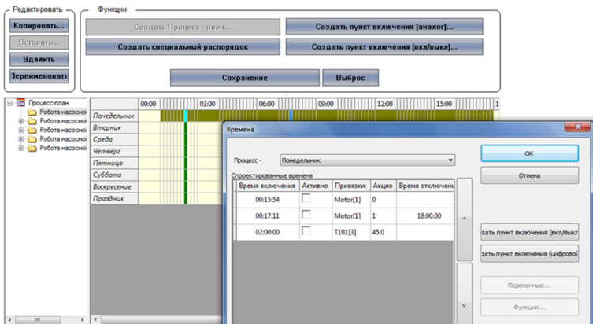

[Людино-машинні інтерфейси](https://pupenasan.github.io/hmi/)  Автор і лектор: Олександр Пупена доц. кафедри [АКСТУ НУХТ](http://www.iasu-nuft.pp.ua/) 

# Лекція 3. Інші функції SCADA/HMI

## 3.1. Підсистема тривожної сигналізації та подій

Кількість параметрів, які контролює один оператор, може вимірюватися сотнями, при цьому кількість мнемосхем може перевищувати десяток. При таких обставинах навіть найуважніший і досвідчений оператор не зможе вчасно зреагувати на вихід за регламентні межі значення однієї з контрольованих величин. Тому для кращого моніторингу процесу в SCADA/HMI використовуються підсистеми **тривожної сигналізації** (**Alarms Management**). Основна ідея її функціонування – відслідковування виходу змінної процесу за нормовані межі. Тобто, коли всі технологічні параметри процесу перебувають в регламентних межах, оператор може не слідкувати за всіма значеннями контрольованих параметрів, оскільки за ними слідкує підсистема тривожної сигналізації. Як тільки значення хоча б однієї зі змінних переходить у ненормований стан (за межі нормованих значень), то підсистема оповіщає про це оператора, щоб той звернув на це увагу і, за можливості, усунув причину тривоги. Факт появи тривоги може сигналізуватися зміною кольору елемента (наприклад, яскраво-червоним чи жовтим), миготінням, звуковим сигналом, спливаючим вікном та іншими способами, які привертають увагу оператора. Тобто перша функція підсистеми тривожної сигналізації – виявити тривожну подію та сповістити про неї оператора. Сама нештатна подія називається **тривогою**.

Як уже зазначалося, тривога повинна сигналізуватися таким чином, щоб привертати увагу оператора незалежно від відкритого дисплею  на даний момент часу. Після виявлення оператором тривожного факту такі засоби сигналізації як звук, чи миготіння можуть заважати його адекватній роботі, через додатковий психологічний тиск. Тому оператор може дати команду **підтвердження**, що він помітив тривогу (**квитування**, acknowledge alarm). Після цього тривога переходить у стан активної (оскільки умова тривоги продовжує виконуватись), але підтвердженої (заквітованої), а отже, і по-іншому буде відображатися (наприклад, без звуку та миготіння). При створенні системи розробники повинні узгодити з технологами, які саме тривоги повинні бути з підтвердженням, а які – без, а також яким чином будуть себе вести при цьому елементи HMI.

У будь-якому випадку тривога відключається тоді, коли перестає виконуватись умова її появи та було зроблене її підтвердження (якщо таке вимагалось). Елементи сигналізації відповідно до станів тривог можуть мати чотири варіанти кольорів, миготінь, звуків тощо. 

У деяких ситуаціях, наприклад, коли частина устатковання вийшла з ладу, або у випадках тимчасової відсутності деяких датчиків, тривоги, пов’язані з цими процесами, варто перевести в стан **заборонених**, або **заблокованих** (suppress). Це потрібно для того, щоб вони не сигналізувалися. В іншому випаду до постійно включеної сигналізації оператори поступово звикають, і з часом вся підсистема втрачає своє функціональне призначення, оскільки нові тривожні повідомлення не виділяються на фоні постійно діючих. Це ще одна з причин, чому до розроблення системи тривожної сигналізації необхідно підходити скрупульозно. Додатково до цього, система може передбачати відтермінування тривог, тобто блокування на певний час.  

Для підвищення якості виробництва та запобігання аваріям в перспективі всі тривожні події, що виникли в технологічному процесі, повинні аналізуватися. Для цього вони заносяться в **журнал тривог**, який зберігається в постійно-запам’ятовуючій пам’яті (наприклад, на жорсткому диску) протягом указаного часу (наприклад, одного місяця). Таким чином, друга функція підсистеми тривог – ведення архівного журналу тривог з можливістю його подальшого перегляду. У журнал автоматично заносяться: відмітка часу появи тривоги, її підтвердження та зникнення, а також **повідомлення тривоги** (alarm message або текст тривоги – alarm text). Крім того, в журнал може також вноситися інша додаткова інформація про тривогу. Переглядаючи журнал тривог, можна отримати послідовність проходження тривоги через усі стани. Так, за відмітками часу можна визначити час, коли виникла тривога, наскільки швидко зреагував на неї оператор (час підтвердження) та в який термін тривога була усунута (час зникнення тривоги).

Для перегляду включених (активних) та непідтверджених тривог, а також архівного журналу засоби SCADA/HMI надають спеціальні інструменти, які називають **переглядачами тривог** (alarm viewer). Функціональні можливості таких переглядачів відрізняються залежно від середовища, але в більшості випадків вони надають такі можливості:

-     перегляду станів включених (активних) на даний момент тривог;

-     перегляду архівного журналу тривог за вказаний проміжок часу;

-     перегляду відміток часу появи, підтвердження, зникнення тривог;

-     перегляду повідомлення та додаткових властивостей тривоги;

-     налаштування різних способів відображення, наприклад, у вигляді списку тривог;

-     налаштування фільтрів для виведення в переглядач тільки тих тривог, які відповідають заданим критеріям (наприклад, по імені змінної чи пріоритету)

Як правило, переглядач останніх трьох-чотирьох тривог завжди видимий на екрані (див. поз. 3 на рис. 3.1). Альтернативою списку може слугувати індикатор наявності тривог різного пріоритету.

<a href="media1/1_3.png" target="_blank">

рис.3.1. Місце списку останніх тривог на екрані.

Детальний розгляд такого переглядача показано на рис.3.2. В ідеальному варіанті, коли немає тривог, список повинен бути порожнім. Нове повідомлення появляється в ньому на вершині списку, повідомляючи операторові про наявність нової тривоги.
<a href="media1/1_20.png" target="_blank"></a>                            
Рис.3.2. Приклад переглядача останніх тривог

Крім найважливішої інформації про тривогу (назва, повідомлення, час виникнення та стан тривоги), операторові можуть бути доступні такі дії, як підтвердження тривоги, заборона (блокування) тривоги та доступ до інших властивостей. У наведеному прикладі на рис.3.2 переглядач дає можливість перейти до повного списку тривог різної категорії. Число біля піктограми вказує на кількість тривог у списку.

Тривоги можуть мати властивість **пріоритетності**. У цьому випадку найбільш пріоритетні тривоги будуть розміщені в переглядачі на першому місці (на вершині списку). У випадку великої кількості активних тривог (у цьому випадку – більше 3-х) повний перелік доступний через дисплей зведення тривог (переглядач усіх тривог), який відкривається на окремій сторінці. Дисплей показує список усіх тривог з їх активним станом, аналогічно до того, який показаний на рис. 3.3. Повідомлення про тривоги можуть підсвічуватися та/або миготіти відповідно до їхнього стану.

 

Рис. 3.3. Приклад зведення тривог у вигляді списку

Для аналізу історії тривог переглядачі можуть відображати інформацію з журналу тривог (історичний режим). Операторові може бути зручно переглядати історію у вигляді списку, де кожна дія відображається окремим повідомленням, або у вигляді зведення, де окремий рядок представляє повну історію появи, підтвердження і зникнення тривоги. Так, на рис. 3.4(1) показано, як змінювався стан тривоги з дескриптором (назвою) ALARM_6, яка відповідає за зниження рівня масла у двигуні 3. Кожна нова зміна стану показана в списку у вигляді окремого запису:

```
9:54:25 – тривога включилась;
9:55:18 – оператор її підтвердив (квитував);
9:59:03 – тривога відключилась. 
```
<a href="media1/1_22.png" target="_blank"></a> 

Рис.3.4. Приклад переглядача журналу тривог у вигляді: 1 – списку; 2 – зведення

На рис.3.4(2) овалами виділено відмітки часу зміни стану ALARM_6 на переглядачі журналу у вигляді зведення тривог. 

Переглядачі тривог, як правило, надають можливість сортувати повідомлення за різними полями, наприклад, за ім’ям (дескриптора), часом виникнення тривоги тощо. Для відображення тільки необхідних записів можна налаштувати фільтри; приклади:

- відображати тільки непідтверджені записи за вказаний період часу;

- відображати тільки тривоги з указаною категорією;

- відображати всі тривоги з указаним дескриптором (назвою). 

Тривоги можуть виникати за різних причин. Більшість засобів SCADA/HMI надають можливості генерувати тривоги за такими подіями:

- зміна значення дискретної змінної (**дискретні тривоги**);

- зміна значення аналогової змінної (**аналогові тривоги**);

- збій роботи зв’язку середовища виконання SCADA/HMI з джерелом даних (наприклад, контролером) або неполадки в роботі самої системи (**системні тривоги**).

Умову виникнення дискретних тривог можна налаштувати як на ВКЛючення (ON, 1), так і на ВИКЛючення (OFF, 0). Яке саме значення є тривогою, визначається залежно від завдання. 

Для аналогових тривог умовою спрацювання може бути:

- вихід значення за попереджувальну верхню межу (англійською позначається як HI)

- вихід значення за аварійну верхню межу (HIHI); 

- вихід значення за попереджувальну нижню межу (LO)

- вихід значення за аварійну нижню межу (LOLO).

- відхилення величини від заданого значення (deviation).

Для зручності фільтрації повідомлень у переглядачі тривог, а також групового налаштування можуть використовуватись додаткові властивості тривог, такі як номер групи, зона дії (наприклад, цех, відділення), категорія (наприклад, критичні, некритичні, системні) та ін. 

Подібно до фіксування тривог, засоби SCADA/HMI мають можливість вести **журнал подій**. На відміну від тривоги, **подія** – це штатна зміна значення змінної, виконання команди або системної дії. Необхідність у фіксуванні таких подій може бути пов’язана з:

- включенням насоса, установки, відкриття клапана;

- запуском програми приготування продукту, перехід до етапу, закінчення її;

- запуском та зупинкою SCADA системи чи її частини;

- реєстрацією користувача в системі (оператор зайшов під своїм іменем та паролем);

- введення оператором значення змінної.

З наведених прикладів видно, що ці ситуації є штатними і в більшості випадків не потребують підтвердження. Тим не менше, вони можуть бути зафіксовані в журналі подій для подальшого аналізу або звітності. Деякі події потребують реакції оператора і повинні при активації відображатися на екрані. Для виведення списку та журналу подій використовуються переглядачі подій, функції яких дуже схожі до переглядачів тривог. На рис.3.5 показано приклад зовнішнього вигляду переглядача журналу, де видно події останнього запуску та зупинки системи, модифікацію значення змінних оператором ("Модификация спонтанного значения") з іменем “SYSTEM” на конкретному комп’ютері системи.

  

Рис. 3.5. Приклад переглядача журналу подій. 

Враховуючи схожість функцій оброблення подій та тривог, у деяких засобах SCADA/HMI вони поєднуються в єдиній підсистемі (Alarms and Events), яка також може бути реалізована як окремий **сервер тривог та подій** (Alarms and Events Server). Слід зауважити, що архівні журнали подій та тривог можуть використовуватися при формуванні звітів.

Розробленню підсистеми тривог присвячена окрема лекція.

## 3.2. Підсистема трендів

У минулій лекції розглядалося, які можливості для аналізу динаміки надають самописці. Кожна точка на самописці – це значення змінної в конкретний момент часу в минулому, а їх взаємне поєднання показує тенденцію її зміни в часі. Таке представлення прийнято називати ***трендом***. Самописці являють собою ***тренди реального часу*** (Real-Time Trend), оскільки зміна змінної показується, починаючи з плинного часу в крайній правій точці графіка (рис.3.6) за певний невеликий відрізок часу (як правило, до однієї години). Причому це зображення постійно оновлюється новими значеннями, а крайні ліві значення (найстаріші) зникають.

 

Рис.3.6. Приклад використання самописця

Тренди реального часу призначені тільки для перегляду тенденції змінної в даний момент часу, для кращого оцінювання поведінки процесу саме зараз. Тим не менше, для таких трендів все одно необхідно зберігати (буферизувати) попередні значення. Буфер тренду розрахований тільки на певний час, а отже, старі значення завжди будуть зникати. Для можливості аналізу тенденції зміни значень змінних, що відбувалися в минулому, їх треба зберігати на постійному запам’ятовуючому пристрої (наприклад, жорсткому диску). Такі тренди прийнято називати ***історичними*** (Historical Trend). На відміну від трендів реального часу, підсистема керування історичними трендами виконує два окремі завдання:

- записує дані в архів (історію);

- вибирає дані з архіву для відображення на елементах людино-машинного інтерфейсу або у звітах.

На відміну від трендів реального часу, в яких значення на самописці оновлюється разом з оновленням змінної, записування даних в архів, як правило, проводиться рідше, ніж їх зчитування з джерела даних (контролера). Слід розуміти, що надмірно часте записування даних призводить до значних затрат ресурсів комп’ютера. Тому разом з ***періодичністю записування*** визначається ***глибина історії*** (архіву) – діапазон часу, протягом якого зберігаються архівні дані. Таким чином, чим частіше проводиться записування і чим довше зберігається історія, тим більше дискового простору буде виділятися під файли архіву і тим довше доведеться системі відшукувати потрібні значення. Продемонструємо це на прикладі.

Припустимо, кожний запис в архіві займає 100 байт. Якщо змінну записувати з періодичністю один раз за секунду, за місяць архів для даної змінної буде займати:

```
100 × 60 с × 60 хв × 24 години × 30 діб = 259200000 байт ≈ 247 Мбайт
```

Якщо кількість змінних становитиме декілька сотень, то архів займатиме десятки, а то й сотні Гігабайт. Якщо ж змінну записувати один раз за 10 с, то об’єм архіву буде вже в 10 разів менший. Навіть при великих об’ємах дискового простору залишається проблема швидкого доступу до архівних даних для читання. Тому при проектуванні SCADA/HMI розробникам разом з технологами необхідно визначитися з глибиною та періодичністю записування. При виборі періодичності записування треба враховувати швидкість зміни параметра, а при виборі глибини – необхідність аналізу історичних даних у майбутньому. Для детального аналізу одну й ту саму змінну можуть записувати в архівні тренди різної глибини. Наприклад, у добові тренди (глибиною 24 год) можуть писати змінну один раз за 1 с, а в місячні (глибина один місяць) – один раз за 1 хв.

Окрім трендів, для збирання та збереження великої кількості даних використовують спеціалізовані програмні засоби – Historian. Цей тип ПЗ дає накопичувати історичні дані та події за великий проміжок часу з малою періодичністю та відмітками часу до мілісекунд і менше. 

Більшість SCADA/HMI, окрім періодичного способу записування, підтримують записування за зміни значення. Цей спосіб дає можливість економити дисковий простір, оскільки в більшості часу технологічні параметри не змінюються. При цьому для аналогових змінних також треба визначити зону (поріг) нечутливості, переходячи через який відбуватиметься записування.

Деякі SCADA/HMI підтримують записування по тригеру**.** Це дає можливість записувати дані в архів тільки при спрацюванні певних умов. Комбінація записування по тригеру з іншими типами дає можливість вести ***порційні архіви*** (batch archive), коли дані пишуться тільки на певних етапах процесу. Це може бути актуально для періодичного процесу приготування продукту в танках, де записування значень параметрів (температур, тисків, рівнів і т.п.) необхідно робити тільки на стадіях участі танка в процесі. 

Підсистема трендів може бути реалізована у вигляді окремого програмного забезпечення, яке у багатьох випадках називають ***сервером трендів*** (Trend Server).

Вибірка даних з історичного тренду, як правило, проводиться спеціальними елементами відображення або підсистемою звітів. Для відображення трендів можна використати табличний вигляд, однак частіше для цього застосовуються самописці, які також називають ***переглядачами трендів*** (Trend Viewer), а ще частіше – трендами. Ці елементи відображення, часто, можуть працювати як у режимі перегляду трендів реального часу, так і історичних. Розглянемо найбільш вживані можливості переглядачів трендів на прикладах рис. 3.7 та 3.8.


*Рис. 3.7.* Приклад переглядача трендів.

Сукупність взаємопов’язаних точок на тренді для однієї змінної прийнято називати ***кривими*** (curves), або ***перами*** (pens). Для того щоб відрізняти пера на тренді, їм призначають свій колір або/та тип лінії (суцільна, пунктирна, штрихова тощо), які пов’язують точки. Крім того, самі точки можна показувати різними геометричними фігурами (див. рис. 3.8).

Криві показуються у вибраному діапазоні часу (***інтервалі***), який може налаштовуватися спеціальними кнопками типу "розтягування" ("<>"), "звуження" ("> <") або вибору з ряду заданих (див. рис. 3.7). Початкове значення дати та часу перегляду вибирається за допомогою календаря або вказується шляхом введення. Швидка навігація доступна через кнопки, наприклад:

" < " – на половину інтервалу назад; 

" << " – на один інтервал назад;

" > " – на половину інтервалу вперед; 

" >> " – на один інтервал уперед.                               

 

*Рис.3.8.* Приклад переглядача трендів з розширеними можливостями.

За допомогою ***легенди*** оператор може подивитися призначення кожної кривої тренду відповідно до кольору, налаштувати масштаб відображення, показувати чи ховати пера на графіку. Крім того, більшість переглядачів мають можливість показати ***курсор часу***, що дає можливість відобразити числове значення трендів у потрібній точці часу. Так, на рис.3.8 видно, що 05.11.2014 о 15:17:06 значення тиску внизу колони К1 було 76,7 Па.

Наведені вище можливості – це не повний перелік тих, які надаються переглядачами трендів. Наприклад, за допомогою панелі керування (див. рис. 3.8) можна добавляти/видаляти пера, налаштовувати особливості відображення, створювати незалежні панелі зі своїми осями та багато чого іншого. 

Розробленню підсистеми трендів присвячена окрема лекція.

## 3.3. Формування звітів

Для аналізу подій і тривог, тенденції зміни технологічних параметрів протягом певного часу можна скористатися відповідними переглядачами. Крім виведення на екран, вони дають змогу виводити тренди та журнали на принтер. Не дивлячись на те, що в цей спосіб можна вивести багато потрібної й детальної інформації, вона недостатньо оброблена для отримання загальних показників ефективності роботи процесу чи установки. Для виведення загальних показників використовують звіти. 

***Звіт*** (Report) – це документ, сформований на основі означеної для нього форми та статистично оброблених активних чи історичних даних. У ***формі звіту*** означується розміщення та призначення полів, а при генеруванні звіту ці поля заповнюються конкретними значеннями. Крім полів, вміст яких залежить від даних, форма звіту може вміщувати статичну графічну та текстову інформацію. 

На рис. 3.9 показано приклад звіту, в якому, починаючи з початку місяця, вказуються сумарні добові та місячні величини споживання теплоенергії, середньодобові значення температур та кількість годин напрацювання за добу. Слід звернути увагу, що у звітах, у більшості випадків, використовуються не миттєві значення параметрів (які дають тренди чи журнали), а статистично оброблені за певний звітний період дані (наприклад, за добу, місяць, рік). Тому для звіту необхідне серйозне статистичне оброблення історичних даних, що потребує від розробника високої кваліфікації програміста, а від середовища розроблення – додаткових функціональних можливостей. Як правило, засоби SCADA/HMI мають досить обмежені можливості для роботи зі звітами, тому для складних звітів потрібне додаткове спеціалізоване програмне забезпечення або модулі класу MES/MOM. 

                               

*Рис. 3.9.* Приклад звіту

Звіти можуть генеруватися автоматично (в разі виникнення події чи тривоги або періодично в зазначений астрономічний час) або за запитом оператора. Це може бути віддрукований документ, файл формату PDF, RTF, TXT, CSV, HTML сторінка або таблиця Excel чи якоїсь бази даних. Звіти у вигляді текстових документів насамперед цікавлять керівний персонал, якому вони потрібні для аналізу технологічного процесу. Електронні таблиці потрібні для ведення автоматизованого загальновиробничого обліку (наприклад, передача на рівень керування виробництвом та підприємством). Наприклад, кількість спожитої теплоенергії може бути використано для розрахунку собівартості продукції. 

## 3.4. Керування рецептами

***Рецепт*** (recipe) – це сукупність технологічних параметрів, які зчитуються, записуються, зберігаються як єдине ціле. Рецепти дають можливість оператору зберегти в системі задані значення певних технологічних параметрів для приготування конкретного продукту. Враховуючи, що одне й те саме устатковання може використовуватись для приготування різного виду продукту, ***підсистема керування рецептами*** може значно допомогти в цьому.

Наприклад, технолог може змінити значення уставок температур у програмі варіння пива і зберегти його в системі під новим ім'ям рецепта (рис. 3.10). Якщо виникає необхідність зварити пиво за певним рецептом, то оператор вибирає його і відправляє на записування у контролер. Іншими словами, в контролер будуть записані всі значення змінних, які вказані у вибраному рецепті. 

 

*Рис. 3.10.* Приклад дисплея керування рецептами (SCADA zenon)

Підсистема керування рецептами, як правило, надає такі можливості:

- створювати нові рецепти, добавляти в них технологічні параметри (змінні), вказувати їхнє значення;

- редагувати існуючі рецепти;

- відправляти рецепт на записування у контролер;

- зчитувати значення параметрів рецепта з контролера;

- зберігати рецепти на диску.

Рецепти можуть також використовуватися для збереження конфігураційних параметрів механізмів, налаштувань регуляторів тощо. Слід зауважити, що підсистема керування рецептами не є обов’язковою складовою SCADA/HMI, тому це треба мати на увазі при виборі середовища розроблення та виконання. 

У пакеті SCADA може бути наявний модуль керування порційними виробництвами (Batch Control), який може передбачати створення та зміну процедури рецепту (технологічної послідовності) відповідно до стандартів ISA-88 та його аналогу IEC 61512. 

## 3.5. Планувальники

Для ряду об’єктів має бути передбачене керування установками згідно з календарним графіком та астрономічним часом. Наприклад, у ряді систем керування водо- та теплопостачання необхідно забезпечити вмикання та вимикання насосів згідно з установленим графіком. У цьому випадку можна скористатися спеціальними підсистемами SCADA/HMI, які називаються ***планувальниками*** (Scheduler). На рис.3.11 наведено приклад дисплея налаштування планувальника, де оператор може створювати нові плани (процес-плани). У цих процес-планах на заданий час кожного дня тижня можна добавляти дії над дискретними змінними (включення/відключення), аналоговими змінними (записування вказаного значення) та виконувати функції (наприклад, запуск скрипту). 

<a href="media1/1_28.png" target="_blank"></a> 

*Рис.3.11.* Приклад дисплея налаштування планувальника (SCADA zenon)

Слід розуміти, що логіка керування процесом, у тому числі включення та відключення устатковання, формування завдань залежно від часу тощо, як правило, реалізується в контролері. Однак у випадку, якщо необхідна гнучкість у таких налаш­туваннях, як зміна часу, добавка нового устатковання в план керування, створення нового плану, реалізувати це без планувальника можна тільки через ручне керування. 

Функції планувальника доступні не в усіх системах SCADA/HMI, а отже розроблення її потребує додаткових фінансових затрат, більше часу та вищої компетенції розробника. 

## 3.6. Система розмежування доступу

Доступ до автоматизованої системи керування технологічним процесом можуть мати:

- оператори процесу, до функцій яких входить контроль за процесом, зміна уставок, внесення керуючих дій у ручному режимі;

- технологи, до функцій яких входить визначення технологічних параметрів процесу, аналіз; 

- працівники служб експлуатації, до функцій яких входить контроль за правильністю роботи устатковання, налаштування контурів керування, діагностування та конфігурування пристроїв;

- інші працівники підприємства, яким потрібна певна інформація про стан процесу.

Це означає, що автоматизованим робочим місцем можуть користуватися декілька операторів для виконання різних функцій. Треба чітко розуміти, що, згідно з організаційною структурою, працівник служби КВПіА, як правило, не має права змінювати уставку чи закривати клапани, оскільки за це відповідає оператор. З іншого боку, оператор не має права змінювати налаштування регуляторів, бо це не в його компетенції. Таким чином, виникає завдання розмежування доступу до сторінок та елементів SCADA/HMI. У більшості випадків для цього використовуються механізми, що ґрунтуються на системі ***аутентифікації*** (визначення дійсності входу конкретного оператора) та ***авторизації*** (визначення прав доступу для конкретного користувача). Для кожного користувача створюється ім’я входу (login) та пароль (password) і визначаються права доступу до сторінок та елементів. Якщо користувач хоче доступитися до елементів з обмеженим доступом, то система потребує від нього зайти під своїм ім’ям. 

При проектуванні системи керування технологи разом з розробниками повинні визначитися з кількістю користувачів та їх правами доступу.

[<-- Лекція 2. Функції графічного інтерфейсу SCADA/HMI та високоефективний HMI](lec2.md)

[--> Лекція 4. Загальні принципи розроблення SCADA/HMI](lec4.md)

## Контрольні запитання 

1.     Яке призначення і принципи функціонування підсистеми тривожної сигналізації?

2.     Що таке тривога? Як оператор може дізнатися про тривогу?

3.     Навіщо потрібне підтвердження (квитування) тривоги? 

4.     В яких станах може перебувати тривога?

5.     Навіщо потрібне блокування (заборона) тривоги?

6.     Розкажіть про призначення журналів тривог. Яка інформація туди записується? 

7.     Яким чином можна переглянути список усіх активних тривог? Яка саме інформація може бути доступна для перегляду?

8.     Яким чином і в якому вигляді можна переглянути журнал (історію) тривог? Яка саме інформація може бути доступна для перегляду?

9.     Розкажіть про призначення фільтрів у переглядачах тривог та подій?

10.     Розкажіть про принципи роботи дискретних та аналогових тривог?

11.     Чим події відрізняються від тривог? Наведіть приклади подій. Де фіксуються події і як переглянути їхню історію?

12.     Що таке тренд? Чим відрізняються тренди реального часу від історичних?

13.     Які задачі виконує підсистема керування трендами?

14.     Навіщо визначати для трендів періодичність записування та глибину? Як пов’язані ці властивості та яким чином їх вибирати/розраховувати?

15.     За якими подіями може відбуватися записування значень змінних у тренд? Що таке порційний (batch) архів?

16.     Розкажіть про можливості переглядачів трендів (самописців).

17.     Як показуються змінні на самописцях і як їх відрізняти між собою? Як дізнатися значення змінної в конкретній точці?

18.     Яке призначення звітів? Якої функціональності звітів немає в трендах, журналах подій та тривог?

19.     Які можуть бути формати звітів, у яких випадках використовується кожний з них? 

20.     Яке призначення і можливості підсистеми керування рецептами?

21.     Яке призначення і можливості підсистеми планування (планувальників)? 

22.     Розкажіть про необхідність розмежування доступу до АРМу оператору.

23.     Поясніть відмінність між автентифікацією та авторизацією.

<iframe width="400" height="225" src="https://www.youtube.com/embed/ZRVreDNEEH0" title="YouTube video player" frameborder="0" allow="accelerometer; autoplay; clipboard-write; encrypted-media; gyroscope; picture-in-picture" allowfullscreen></iframe>

<iframe src="https://www.slideshare.net/slideshow/embed_code/key/dt3hs80PJ7TJSb" width="597" height="486" frameborder="0" marginwidth="0" marginheight="0" scrolling="no" style="border:1px solid #CCC; border-width:1px; margin-bottom:5px; max-width: 100%;" allowfullscreen> </iframe> <div style="margin-bottom:5px"> <strong> <a href="https://www.slideshare.net/pupenasan/2-2-scadahmi" title="2 2 Інші функції SCADA/HMI" target="_blank">2 2 Інші функції SCADA/HMI</a> </strong> from <strong><a href="https://www.slideshare.net/pupenasan" target="_blank">Пупена Александр</a></strong> </div>

