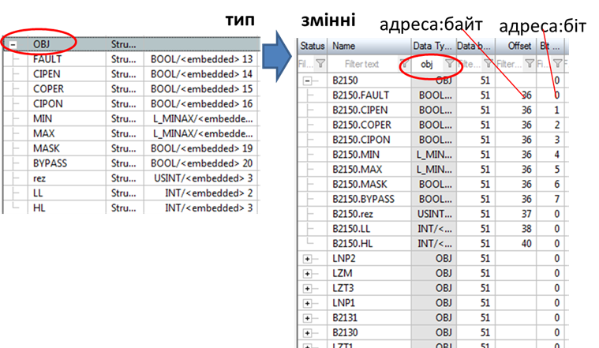
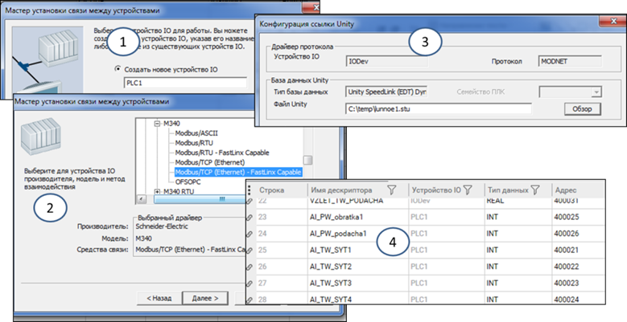

[Людино-машинні інтерфейси](https://pupenasan.github.io/hmi/)  Автор і лектор: Олександр Пупена доц. кафедри [АКСТУ НУХТ](http://www.iasu-nuft.pp.ua/) 

# Лекція 5. Підсистема керування збором та обробкою даних в реальному часі

## 5.1. База даних реального часу та підсистема введення/виведення 

Як зазначено в попередній лекції, центральною частиною середовища виконання SCADA-програм є ***база даних реального часу*** (***БДРЧ***), яка використовується для забезпечення усіх підсистем SCADA плинною інформацією про стан процесу, а також можливості втручання в процес керування. База даних реального часу – це сховище тегів (змінних), значення та атрибути яких постійно оновлюються. Таке оновлення диктується необхідністю в "свіжих" даних, щоб оператор через підсистему людино-машинного інтерфейсу мав можливість контролювати стан процесу та, за необхідності, керувати його протіканням. Окрім того, інші підсистеми (наприклад, підсистема тривог або трендів) теж потребують такого оновлення, однак, можливо, з іншою частотою (періодичністю). 

У SCADA-програмах, призначених для середніх та великих систем, за роботою БДРЧ слідкує виділений програмний модуль, який будемо називати ***Сервером введення/виведення***. Сервер введення/виведення (або аналогічна програмна частина) забезпечує, з одного боку, своєчасне оновлення плинних значень змінних із джерела даних (наприклад контролера), а з іншого – обслуговує запити на цю змінну для читання/записування з інших підсистем, які в такому зв’язку є ***клієнтами***. При цьому Сервер введення/виведення та клієнти можуть знаходитися як на одному так і на різних комп’ютерах. Слід черговий раз відмітити, що виділення серверу введення/виведення є умовним, оскільки архітектури SCADA можуть сильно відрізнятися.    

Сервери введення/виведення  обмінюються з джерелами даних (наприклад контролерами) через ***підсистеми введення/виведення***, які часто називають ***драйверами протоколів*** або просто ***драйверами***. У цьому випадку драйвери – це програмні бібліотеки, в яких реалізовані комунікаційні протоколи. Враховуючи велику різноманітність протоколів промислових мереж, які на сьогоднішній день використовуються для з'єднання з контролерами та іншими засобами введення/виведення, наявність того чи іншого драйверу у SCADA-програмі може стати визначальним при її виборі. Наприклад, більшість SCADA-програм мають у своєму складі драйвер протоколу Modbus RTU, але мало які підтримують пропрієтарний (фірмовий) та вже застарілий протокол UNITE чи XWAY (Telemechanique). Звісно, що драйвер однієї SCADA-програми не підходить до іншої. З цих причин нерідко розробнику системи доводиться вирішувати проблему сумісності засобів SCADA/HMI з джерелами даних (контролерами). На сьогоднішній день цю проблему вдалося подолати, уніфікувавши інтерфейс підсистеми введення/виведення  через технологію OPC. 

## 5.2. Змінні (Теги)

База даних реального часу вміщує ***змінні***, які також називають ***тегами*** (***tag***), а в ряді випадків – точками (point). Слід зазначити, що в багатьох SCADA-програмах поняття "тег" та "змінна" відсутні взагалі, а побудова і функціонування серверної частини значно відрізняється від описаної тут.  Тим не менше, нижче наводиться, певне, найбільш поширене та усереднене представлення реалізації БДРЧ. Надалі в тексті буде використовуватися поняття "тег".

Розробник проекту створює теги відповідно до вимог його завдання. При цьому він повинен налаштувати властивості тегів для виконання потрібних операцій введення/виведення. Ці операції залежать від типу та призначення тегів і, звісно, залежать від особливостей конкретного середовища, тобто SCADA/HMI-програми.

Теги, що мають за ***джерело даних*** зовнішній пристрій (контролер) називаються ***тегами введення/виведення* (**теги I/O**)**. Вони потребують обміну через підсистему ведення/виведення, тому мають відповідні до цього властивості та потребують налаштування обміну та перетворення (рис. 5.1). Для таких тегів характерні операції зчитування/записування з/в джерела даних та оброблення, таке як перевірка на діапазон та достовірність, масштабування та додаткових перетворень. 

                               

*Рис.5.1.* Оброблення тегів у контексті умовної функціональної структури SCADA 

Нижче наведемо орієнтовний перелік властивостей, які можуть налаштовуватися при розробленні для тегів введення/виведення:

- ідентифікатор або ім'я тегу;

- короткий опис (коментар);

- тип даних (цілий, булевий, з плаваючою комою, текстовий тощо);

- параметри налаштування вказівки на джерело даних: таких як, наприклад, мережний інтерфейс, адреса контролера, адреса змінної в контролері;

- періодичність оновлення;

- доступ до зміни значення: читання/записування, тільки читання; 

- параметри налаштування оброблення: масштабування, фільтрація тощо;

- обмеження на введення;

- одиниці виміру (наприклад "кПа");

- інші параметри. 

На відміну від тегів введення/виведення, ***внутрішні теги*** не потребують зв’язку з джерелом. Вони використовуються для обміну даними між підсистемами SCADA/HMI та збереження проміжних результатів. Внутрішні теги, у свою чергу, можуть бути серверними, тобто спільними для всіх підсистем та клієнтів, або клієнтськими – унікальними для кожної підсистеми та клієнта.  

Окрім внутрішніх тегів, SCADA-програма додатково може надавати можливість працювати із системними тегами (наприклад, для отримання інформації про дату й час), або математичними, імітаційними чи іншими, які є специфічним для кожної SCADA-програми. 

Слід зазначити, що політика ліцензування SCADA-програм, як правило, враховує кількість тегів саме введення/виведення, оскільки це опосередковано вказує на масштаби та вартість системи. Це пов’язано з тим, що чим більша вартість системи, тим більше замовник спроможній заплатити за ліцензію та більша відповідальність постачальника SCADA-програми. Тому, щоб зменшити кількість тегів введення/виведення розробники проектів для SCADA нерідко припускаються до певних прийомів. Наприклад, перед відправленням даних у контролері можна упакувати біти в цілі числа, отримуючи в результаті на кожні 16 дискретних (булевих) змінних контролера (або навіть 32) тільки один тег введення/виведення  SCADA. Однак варто відмітити, що розробники середовищ SCADA можуть вираховувати такі прийоми при розрахунку ліцензійних точок.     

Кожному тегу, незалежно від його призначення, розробник проекту повинен дати унікальний у межах серверу ідентифікатор, за яким інші підсистеми зможуть звертатись до його значень. Як правило, це є ***ім'я тегу***. У більшості випадків вимоги до формування імен схожі до вимог до змінних мов програмування:

- використовуються тільки літери латинського алфавіту, цифри та деякі спеціальні символи;

- не вміщують пробілів;

- мають суттєві обмеження на кількість літер  

Звісно, не обходиться без виключень з цих правил. Деякі SCADA-програми дозволяють використовувати кирилицю, а в деяких, як наприклад у SCADA zenon, змінні можуть називатися як завгодно (хоч є несуттєві обмеження на кількість літер). Не дивлячись на переваги від відсутності таких обмежень, слід обережно ставитися до використання великих імен та кирилиці. Так, ім'я "ТІ12" кирилицею і латинськими літерами виглядить однаково, хоч з точки зору програми є означеннями різних тегів, що може привести до довгого пошуку причини непрацездатності проекту SCADA/HMI.

Перед створенням тегів необхідно чітко продумати спосіб та правила формування їх імен для конкретного проекту. Це залежить від особливостей конкретної SCADA-програми, розроблювальної системи, особливостей імпорту/експорту/зв’язування з проектом контролера, а також уподобань та прийнятого стилю розробника проекту. Так, наприклад, для переробних галузей за основу може бути прийняте найменування тегів відповідно до стандарту ISA-5.1 (схеми P&ID, позначення засобів автоматизації) або його вітчизняного аналогу  "ДСТУ Б А.2.4", для диспетчеризації електричних систем - IEC 81346.

Розроблення правил найменування є важливим кроком особливо для великих проектів, де кількість тегів вимірюється сотнями і тисячами. Непродумані правила найменування або їх відсутність може значно ускладнити процес розроблення та обслуговування. 

***Простір імен*** (перелік найменувань) тегів може мати плоску (flat) або ієрархічну структуру. Плоский простір імен передбачає наявність тегів з елементарними (не складеними або не структурними) типами даних. Це стає незручним при розробленні вже при кількості тегів понад сотню. На це є декілька причин:

- пошук тегів у просторі імен стає незручним, оскільки неможливо їх відобразити у вигляді ієрархічного дерева;

- теги важко об’єднувати логічно;

- проблематичною є автоматизація процесу створення анімацій. 

Ці незручності частково вирішуються можливостями редакторів. Наприклад, у табличних редакторах та вікнах вибору можна вказувати фільтри для відображення (рис. 5.2).
<a href="media5/3_2.png" target="_blank"></a>             

*Рис.* *5.2.* Використання фільтрів у редакторах: ліворуч zenon, праворуч Citect

Класичним виходом із ситуації є використання символу "\_" в якості розділового знака між рівнями ієрархії. Для кращого сприйняття імен тегів розробником у процесі створення та налагодження проекту з великою кількістю точок введення/виведення імена можуть мати псевдо-ієрархічну структуру. Наприклад, плинне значення температури (PV) з контуру (TIC100) в пастеризаторі (PAST1) цеху виробництва і пакування (VIP) може мати назву "VIP_PAST1_TIC100_PV". Псевдо-ієрархічність досягається за рахунок використання символу "_" в якості розділового знака між рівнями. Хоч з точки зору SCADA/HMI таке ім'я тегу є звичайним і не відрізняється від неієрархічних, воно дозволяє простіше вирізнити тег серед інших, а в деяких випадках автоматизувати анімаційні елементи. 

Ієрархічності на певному рівні можна досягти шляхом структурування типів даних для тегів. Наприклад, можна створити структурний тип даних для типової контрольованої вимірювальної змінної процесу з контролем меж, в якому будуть поля:

- PV: для плинного значення аналогової величини;

- HHSP: для значення уставки верхньої аварійної межі;

- LLSP: для значення уставки нижньої аварійної межі;

- HH: біт, що спрацьовує при перевищенні верхньої аварійної межі;

- LL: біт, що спрацьовує при зниженні за нижню аварійну межу.

У цьому випадку, наприклад, для вимірювального параметра TT101 в базі даних тегів буде створена лише одна структурна змінна (а не п’ять), до полів якої можна буде звертатися через крапку, наприклад "TT101.PV" або "TT101.HH". Додатковою перевагою такого підходу є зручність при створенні та модифікації проекту.

Ім'я тегу, як правило використовується тільки для означення зв’язків у самому проекті і не видиме для оператора (користувача) системи режиму виконання. Для оператора ім'я тегу є малоінформативним і не зрозумілим, особливо якщо воно не може містити великих слів кирилицею (для місцевих операторів) та пробілів. Так, скажімо, якщо розробник проекту вирішив використовувати ідентифікацію відповідно до схеми автоматизації, то тег може мати позначення, скажімо "TT1а" для плинного значення температури, або "TV1b" для значення положення клапана. Для розробника в цьому є певний продуманий сенс, але оператор буде важко звикнути до таких найменувань. Тому, якщо на якомусь спливаючому вікні необхідно показати ідентифікатор тегу з яким робиться певна дія, або в легенді тренду вказати назву пера (кривої) замість імені тегу краще використовувати короткий опис (Description) або ***коментар***. Ця властивість, як правило, не має таких суттєвих обмежень як ім'я тегу, і не є ідентифікуючим з точки зору SCADA, однак для оператора його можна використати саме для ідентифікації технологічного параметра, з яким він працює. У наведеному вище прикладі для тега "TT1а" можна вказати коментар "Температура на виході теплообмінника".       

З ідентифікацією тегів тісно пов’язана парадигма зав'язків між підсистемами в різних SCADA-програмах, про яку вже нагадувалося. Якщо ім'я тегу в проекті використовується в якості зв'язного тільки на етапі компіляції, то це має певні незручності при зміні назви тегу або його видаленні, що призводить до необхідності зміни в усіх місцях, де йде посилання на цей тег. В іншій парадигмі зв'язок відбувається не на рівні імен тегів, а прихованих (від розробника) ідентифікаторів, що робить зв'язок між тегами та його використанням незалежними від імені. Іншим словами, в таких системах зміна імені тегу призведе до такої ж зміни в усіх посиланнях на нього (наприклад, в анімації), що досить зручно.

Для того, щоб змінна введення/виведення зв’язалася з джерелом даних, необхідно вказати повний шлях до нього. На рис. 5.3 показано схему організації зв’язку між тегом введення/виведення та джерелом даних. Тег знаходиться в базі даних реального часу і за його оновленням і обробленням слідкує Сервер I/O. Нагадаємо, що виділення окремого Сервера введення/виведення є умовним, оскільки в SCADA окремо він може не виділятися, в засобах ЛМІ, як правило, БДРЧ взагалі немає. Для з'єднання із джерелом даних необхідно використати один з наявних драйверів введення/виведення (I/O). Для зв’язку з реальним фізичним інтерфейсом комп’ютера (наприклад, COM-портом, Ethernet тощо) використовуються драйвери інтерфейсів, які є системними. У ряді випадків така послідовність драйверів може мати додаткові ланки, як приклад – це використання проміжного сервера ОРС (розглянуто в наступному розділі посібника). Комунікаційний інтерфейс комп’ютера забезпечує його зв'язок з мережною системою, наприклад Ethernet, RS-232 або RS-485. У цій же мережній системі знаходиться пристрій зі змінною, яка є джерелом даних для тегу. Цей пристрій також має інтерфейс і спілкується за правилами обміну в мережі. 

                               

*Рис.* *5.3.* Організація зв'язку тегів I/O з джерелом даних  

Таким чином, щоб сконфігурувати зв'язок тегу з джерелом даних (наприклад, зі змінною в ПЛК), необхідно вказати:

- драйвер введення/виведення, через який відбувається зв'язок;

- параметри комунікаційних інтерфейсів для вказаного драйвера та інших драйверів, що беруть участь в обміні;

- адресу (адреси) пристрою в комунікаційній системі;

- адресу (адреси) змінних у пристрої.  

Цей перелік може бути доповнений у залежності від типу драйвера. 

Враховуючи, що БДРЧ повинна постійно відслідковувати плинне значення величини, його треба циклічно зчитувати із джерела даних. Як правило, це проводиться періодично з указаним періодом опитування. Цей період може зазначатися в налаштуваннях драйвера, або безпосередньо в налаштуваннях тегу. 

У деяких SCADA/HMI період оновлення тегів у БДРЧ визначається автоматично під час роботи системи. Сервер введення/виведення опитується клієнтами (наприклад, HMI або підсистемою тривожної сигналізації чи підсистемою трендів), що впливає на опитування джерела даних, яке проводиться тільки за потребою. Таким чином, якщо, скажімо, певний тег використовується тільки на одній мнемосхемі і не задіяний у тривогах чи трендах, він оновлюватиметься тільки тоді, коли ця мнемосхема буде відображатися.  

Значення тегів нерідко необхідно масштабувати з одиниць, що вказані в джерелі даних (контролеру) в інженерні одиниці. Це зумовлено рядом факторів, зокрема:

- у джерелі даних (контролері) значення числових змінних знаходиться в контролерних одиницях, які для оператора не мають достатньо зрозумілого представлення;

- одне й те саме значення необхідно представити в різних діапазонах.

Засоби SCADA/HMI в режимі виконання можуть мати вбудовані можливості зміни діапазону значення інженерних одиниць, тобто налаштувати діапазон за необхідності коригування показань датчика (градуюванні). Також деякі SCADA/HMI мають вбудовані можливості нелінійного масштабування.  

Із з розвитком обчислювальних можливостей пристроїв (наприклад контролерів) функція масштабування все частіше проводиться саме на джерелі даних, тому на SCADA/HMI цим можна не користуватися. 

Наведемо деякі типові підходи до організації конфігурування масштабування. Насамперед треба розділяти лінійне та нелінійне масштабування. У більшості SCADA/HMI доступне тільки лінійне масштабування, тобто перетворення вхідних сирих (RAW) контролерних одиниць в інженерні масштабовані одиниці за формулою (рис. 5.4):

`S = k×R + Sb`                           (5.1)

де S – отримуване масштабоване значення в інженерних одиницях; R – вхідне сире немасштабоване значення, Sb – зміщення; k – коефіцієнт, який дорівнює тангенсу кута нахилу прямої масштабування до осі абсцис.     

                               

*Рис.5.4.* Лінійне масштабування

Задавання масштабування у вигляді (5.1) потребує від розробника додаткових розрахунків. Замість цього часто задають тільки мінімальні та максимальні межі для ***сирого*** (***raw***) і ***масштабованого*** (***scaled**)* значення. На рис. 5.4 межі сирого значення показані, як Rmax та Rmin, а масштабованого – як Smax та Smin. Так, якщо в ПЛК значення від датчика задається в діапазоні від 0-10000 (одиниць ПЛК), а на ЛМІ воно повинно відображатися як 50.0 – 150.0 (°С), то:

```
Rmin = 0 (одиниць ПЛК) –> Smin = 50.0 (°С)
Rmax = 10000 (одиниць ПЛК) -> Smax = 150.0 (°С)
```

Неважко зробити перетворення цих меж у коефіцієнти формули (5.1), так як 

```
k = (150.0°С – 50.0°С)/(0 од.ПЛК – 10000 од.ПЛК) = 0.01 °С/од.ПЛК;
b = 50.0°С (можна визначити при Rmin = 0).
```

Крім простоти налаштування, задавання меж має ще додаткові функції. По-перше, так може означуватися нормоване вхідне значення. Іншими словами, якщо вхідне значення з джерела даних виходить за рамки вказаного діапазону, воно вважається недостовірним. По-друге, так може виставлятися обмеження на введення. Тобто, якщо оператор (або якась підсистема) вводить значення, що виходить за межі діапазону, воно не записується в джерело даних, оскільки вважається недостовірним (помилковим). Таким чином, межі використовуються не тільки для масштабування по двох точках, а і для лімітування та сигналізації недостовірності.

Деякі SCADA/HMI дають можливість окремо задавати межі для введення. Це буває дуже доречним, оскільки операторові дозволяється вводити значення тільки з певного піддіапазону загального діапазону величини.

Крім лінійного масштабування, в деяких SCADA/HMI є можливості робити нелінійне масштабування. Способи такого масштабування дуже різноманітні. У будь-якому випадку, якщо вбудованих засобів у інструмента конфігурування немає, таке масштабування можна проводити за допомогою скриптів мовами, вбудованими в SCADA/HMI.

Зовнішній вигляд вікон конфігурування та назва параметрів залежать від конкретного типу SCADA/HMI. Як правило, призначення полів є інтуїтивно зрозумілим. Спробуйте на рис. 5.5 знайти поля, що відповідають за масштабування (межі сирого значення та масштабовані). Детально приклади налаштування розглянуті в кінці розділу.          

                               

*Рис.* *5.5.* Приклад налаштування тегу (SCADA Citect)

Відображення значення величини у вигляді тексту, як правило, повинно супроводжуватися одиницями вимірювання, які також називаються ***інженерними одиницями*** (***engineering*** ***unit,*** ***EU***). Враховуючи, що це стосується тегу, а не тільки його відображення, ці одиниці налаштовуються при конфігуруванні тегу. На рис. 5.5 показано приклад, де в якості одиниць вимірювання вказується °С.

Величини, що мають дробову частину, потребують означення формату відображення. Так, для відображення одиниць pH потребуються дві цифри до крапки(коми), і дві після (6.56 од. pH), а для швидкості оберту двигуна – тільки 4 цифри до коми і жодної після (1456 об/хв). Якщо неправильно налаштувати формат відображення, то в одному випадку пропадуть значимі цифри, а в іншому – будуть показуватися зайві цифри після коми, які не мають значення і тільки заважають сприйняттю інформації. Налаштування формату відображення може проводитися як на самому елементі відображення, так і у властивостях тегу. 

На рис. 5.5 показано приклад формату "##.# EU", в якому, в залежності від значення до коми, буде відображатися дві або менше цифр, а після коми – одна або менше. Крім того, після значення будуть відображатися інженерні одиниці (EU). Тобто при значенні 54.345678 буде відображатися 54.34 °С.  

## 5.3. Властивості тегів у режимі виконання

Вище описано, які властивості є у тегів для налаштування їх оброблення і поведінки. Ці властивості умовно можна назвати властивостями режиму конфігурування. Як уже було сказано, ці властивості записуються в базу даних проекту середовища розроблення. При компілюванні вони використовуються і в середовищі виконання, однак можуть бути недоступними для відображення та/або зміни. Тому в ряді випадків частина властивостей може бути використана для додаткової анімації, а інша – ні. Наприклад, властивості масштабування можна використати для відображення користувачу дозволених меж введення. 

Незалежно від того, чи є доступ у середовищі виконання до властивостей, чи немає, тег при цьому завжди характеризується мінімум трьома значеннями:

- плинне значення (Value);

- якість (Quality);

- відмітка часу (Time Stamp).

Окрім плинного значення, яке характеризує числовий вимірювальний показник, для тегу характерна якість. Якщо джерело даних недоступне, то оператор повинен бути проінформований, що значення недостовірне, тобто йому немає довіри. На рис. 3.6 наведено приклади відображення ознаки недостовірності: в SCADA Citect замість плинного значення пишеться "BAD", а в SCADA zenon відображаються кольорові квадратики. Слід зазначити, що якість має також різні значення, які вказують на причини. Наприклад, недостовірність може бути спричинено відсутністю зв’язку клієнта із сервером або відсутністю зв’язку сервера з джерелом даних на контролері, або навіть виходом значення за дозволений діапазон.

                               

 *Рис.* *5.6.* Приклади вигляду відображення при відсутності зв’язку із джерелом даних: ліворуч – в Citect, праворуч – в SCADA zenon  

У деяких SCADA-програмах є можливість анімувати стан тегу. На рис. 5.7 показано статусні біти тегу, які можна використати в анімації SCADA zenon. Так, можна змінити колір/відображення/видимість елемента залежно від біту стану SPONT (відбулася зміна значення із джерела даних) або INVALID (значення тегу недостовірне). 

 

*Рис. 5.7.* Вибір бітів статусу тегу в анімації в SCADA zenon  

Слід розуміти, що плинне значення тегу – це далеко не єдина важлива його властивість. Окрім якості, можливо, знадобиться фіксувати зміну тегу оператором або з джерела даних (контролеру), факт оновлення даних, час оновлення. Час оновлення в деяких системах є вкрай важливим фактором при фіксації події в журналах. Для відновлення послідовності подій з точністю до десятків та одиниць мілісекунд, у деяких системах SCADA передають відмітку часу разом зі значенням безпосередньо з джерела даних. Є спеціальні модулі в контролерах, що фіксують відмітку часу, та спеціальні протоколи телеметрії, які передають її разом зі значеннями даних (DNP3, IEC-60870-5).

## 5.4. Типи даних тегів

Для того щоб правильно інтерпретувати отримані з джерела дані для тегу (кількість байт, порядок біт, формат), необхідно вказати їх тип. Наприклад, для доступу до типу з плаваючою комою (32-бітного) необхідно витягувати в два рази більшу кількість байт, ніж 16-бітного цілого, а також враховувати, що формат цих 4-х байт буде інтерпретуватися відповідно до представлення числа з плаваючою комою. 

Слід також розуміти, що значення на джерелі даних при перетворенні (масштабуванні) може потребувати зміни типу. Припустимо, що діапазон змінної в одиницях ПЛК 0-10000. Враховуючи що змінна в ПЛК цілочисельна, вона зберігається в змінній цілого типу (INTEGER). Однак при масштабуванні в діапазон 0.0-100.0 (%), для збереження перетвореного значення в БДРЧ знадобиться значення з плаваючою комою. Тобто типи даних для тегу в джерелі і перетвореного при масштабуванні будуть відрізнятися. У більшості випадків, перетворення типів проводиться неявно і не потребує конфігурування. У прикладі на рис. 3.5 вказується тільки тип даних на джерелі, хоч по факту плинне значення тегу (Value), очевидно, матиме тип з плаваючою комою (REAL).

Найменування типів в SCADA/HMI може не збігатися з найменуваннями їх у джерелі даних. Окрім того, типи з однаковою назвою в джерелі і SCADA/HMI можуть також інтерпретуватися різним чином. Тому перед означенням типу необхідно чітко розуміти співвідношення типів в SCADA/HMI і джерелі, інакше дані будуть недостатньо інтерпретовані. 

Останнім часом дані в ПЛК все частіше представляються у вигляді структурних ***користувацьких типів* (user types)**. Це досить зручно, бо дає можливість зберігати логічно об’єднані дані як одне ціле та зменшити кількість операцій при програмуванні та налагодженні. Структурування даних на джерелі дає змогу спростити розроблення в SCADA/HMI. Для цього в інструментальних засобах повинна бути можливість створення власного типу даних. Створення структурної змінної при цьому може зводитися тільки до означення її імені та початкової адреси. Усе інше означується типом і розраховується автоматично. На прикладі з рис. 5.8 структурний тип OBJ має 11 полів, які мають різний тип (BOOL, USINT, INT). При створенні змінної на базі цього типу задається тільки номер блоку даних та початкове зміщення відносно нього (у даному випаду в байтах). Середовище розроблення SCADA автоматично розраховує адреси зміщення та бітів для інших полів. Якщо в цьому випадку піти класичним шляхом (без використання структурних типів), усі поля були б як окремі змінні, тобто кількість змінних збільшилась би в 11 разів, і для кожної треба б було окремо задавати усі властивості. Це, можливо, було б не так складно, якби таке "набивання" тегів проводилося один раз. Однак на практиці, завжди доводиться редагувати властивості тегів. Подумайте, скільки змін прийдеться робити в проекті, якщо всі адреси зміщуються на один байт! Кількість змін буде більша або рівною кількості змінних (не важливо структурних чи ні).  

                               

*Рис.* *5.8.* Структурні типи та змінні в SCADA zenon

Цей підхід може бути розвинутий до ще більш потужних механізмів. Наприклад використання об'єктно-орієнтованого програмування може забезпечити супроводження структури кодом обробки. У деяких SCADA/HMI в типі також означується поведінка тегу. Наприклад, у SCADA zenon у типі змінної можна налаштувати межі тривог, кольори відображення при досягненні меж, тексти повідомлень, обмеження на введення і т. п. Наявність наслідування типів також значно спрощує розроблення проекту.

Не дивлячись на потужні можливості користувацьких типів, є певні нюанси, які необхідно враховувати при їх використанні. Зокрема, структури в джерелі даних (наприклад контролері) можуть вирівнюватися в пам'яті за одною ознакою, а в джерелі – за іншою. Наприклад, в ПЛК Modicon M340 (Schneider Electric, поля типу BOOL в структурах вирівнюються по байтах (кожне поле BOOL буде займати окремий байт), а в SCADA zenon – по бітах. Тобто в M340 кожне нове поле BOOL буде зміщуватися на один байт, а в SCADA – на один біт. У цьому випадку для того щоб ці структури вирівняти, доведеться в SCADA zenon вводити на кожен BOOL ще по сім порожніх (непотрібних) BOOL або відмовитися від типу BOOL на користь пакування. 

## 5.5. Підходи до автоматизації створення БДРЧ

Для невеликих проектів SCADA/HMI кожний тег можна конфігурувати самостійно. Однак якщо кількість тегів вимірюється сотнями і тисячами, виникає потреба автоматизувати процес створення записів у конфігураційній базі даних проекту. Слово "автоматизація" тут розуміється саме в контексті розроблення і стосується заповнення та редагування не тільки бази даних тегів, а і інших розділів проектів. Із процедур до "автоматизованого" наповнення та редагування бази даних проекту можна віднести два підходи:

‒    ***імпортування*** ***(***import***)*** конфігураційних даних;

‒    ***зв’язування*** (linking**, "*лінкування*"**) із зовнішньою базою даних.

Імпортування передбачає копіювання конфігураційних даних з бази даних певного формату, їх перетворення в потрібний вигляд та занесення в базу даних проекту SCADA/HMI. При цьому середовище розроблення може підтримувати різні формати файлу. Як правило, це CSV, XML, OPC (з простору імен) або файли проектів ПЛК. Імпортування проводиться тільки за необхідністю, як правило один раз, при створенні записів у базі даних проекту. Це процедура "втягування" вже створених в іншому редакторі даних.

Зв'язування (сленгова назва "лінкування"), на відміну від імпортування тримає зв'язок бази даних проекту з зовнішньою базою. Як правило, усі поля бази даних проекту, які є зв’язаними, не можуть редагуватися, оскільки вони посилаються на зовнішнє джерело. Типовим прикладом зв’язування є підключення бази даних або її частини до файлу проекту ПЛК, в якому зберігається інформація про змінні. Зв'язування є потужним механізмом утримання бази даних тегів проекту інтегрованою для ПЛК та SCADA/HMI. Тобто будь-яка зміна налаштування змінної в ПЛК автоматично (або за запитом оновлення) приводить до зміни в проекті SCADA/HMI. Великі бренди намагаються зводити це зв’язування до максимальної наближеності до єдності тегів SCADA/HMI+ПЛК. Наприклад, в "Simatic PCS" розроблення прикладного ПЗ ініціюється зі SCADA/HMI, і всі теги створюються автоматично і для БДРЧ SCADA і для ПЛК. Аналогічним чином це робиться у "Hybrid DCS" від Schneider Electric.   

Імпортування змінних (як і інших розділів проекту) передбачає наявність файлу імпорту в тому форматі, який розуміє даний редактор SCADA/HMI. Якщо імпорт передбачає ручне створення файлу (наприклад в Excel або XML-редакторі), наявність можливості підтримки, наприклад, форматів CSV або XML, ще не каже про те, які саме поля або імена будуть використовуватися в цих файлах. Як варіант, опис структури файлу імпорту можна взяти з довідкової системи інструменту, однак повного переліку полів там може не бути. Виходом з цього, може бути використання зворотної процедури, тобто експорту тегів у файл, який, по суті, стане прототипом необхідного файлу імпорту. Наприклад, SCADA zenon надає можливість імпорту та експорту як в XML так і CSV. Зробивши експорт однієї змінної в CSV (рис. 5.9), можна файл експорту відкрити в Excel, після чого добавити туди всі необхідні записи, скориставшись автоматизацією Excel (автоматичне збільшення значення по колонці, копіювання/вставка по взірцю і т.п.). Після внесення змін у редакторі запускається процедура імпорту. Якщо змінні збігаються, редактор дає можливість вибрати заміну, зберегти чи відмінити імпорт.
<a href="media5/3_12.png" target="_blank"></a>           

*Рис.* *5.9.* Приклад експорту змінних в SCADA zenon: 1 – процедура експорту, 2  – вигляд експортованого файлу CSV в Excel 

Слід звернути увагу, що згадані вище файли CSV вказують тільки на те, що використовується формат представлення таблиць у вигляді текстових записів, розділених символом переносу рядка, в яких є поля, що розділені розділовим знаком. У якості розділового знаку може бути як кома, так і табуляція, крапка з комою чи інші. Для коректного сприйняття такого файлу редакторами, можна замінити одні розділові знаки на інші в простому текстовому редакторі, наприклад блокноті, шляхом пошуку та заміни. Пара Excel + Notepad (або Notepad++) є дуже корисними помічниками при створенні програмного забезпечення АСКТП.    

Застосування механізмів імпорту/експорту дає можливість використати вихідні дані для проекту не тільки для розуміння технічних вимог, а й для пришвидшення процедури розроблення. Тому у фірмах інтеграторах намагаються уніфікувати вихідні дані у вигляді таблиць, де вказана вся необхідна інформація. Так, у табл. 5.1 показано фрагмент списку введення/виведення для ПЛК, який, у свою чергу, легко перетворюється на таблицю змінних ПЛК<->SCADA, що може бути використана при формуванні файлу імпорту.

 Універсальні формати типу CSV чи XML не єдині, що можуть підтримувати середовище розроблення для імпорту змінних. Нерідко SCADA/HMI підтримують можливість імпорту безпосередньо з файлів проектів ПЛК різних виробників. Наприклад, SCADA zenon підтримує імпорт із файлів проектів Step7 (див. рис. 5.9). Такий імпорт може підтримувати зв'язок з вихідним файлом з можливістю оновлення, у цьому випадку це називають зв’язуванням.   

*Таблиця 5.1.* Приклад фрагменту таблиці I/O для ПЛК

| **Найменування**                         | **Од.   вимір.** | **Поз­нач** | **Тип** | **Мод.кан** | **Діапазон перетво­рювача** | **Діапазон вимірю­вання** | **Пороги** | **Но­мін.** |         |         |          |          |      |
| ---------------------------------------- | ---------------- | ----------- | ------- | ----------- | --------------------------- | ------------------------- | ---------- | ----------- | ------- | ------- | -------- | -------- | ---- |
|                                          |                  |             |         |             | Мін                         | Мах                       | Мін        | Мах         | А нижнє | П нижнє | П верхнє | А верхнє |      |
| Тиск газу на вході ГРС                   | кгс*см2          | PT1         | AI      | 0.0         | 0                           | 60                        | 0          | 60          |         | 25      | 55       |          |      |
| Тиск газу на виході ГРС                  | кгс*см2          | PT2         | AI      | 0.1         | 0                           | 16                        | 0          | 16          | 20%     | 10%     | 10%      | 20%      | 2.0  |
| Тиск газу на власні потреби              | кгс*см2          | PT3         | AI      | 0.2         | 0                           | 0.1                       | 0          | 0.1         |         | 0       | 0.04     |          |      |
| Тиск теплоносія в системі підігріву газу | кгс*см2          | PT4         | AI      | 0.3         | 0                           | 10                        | 0          | 10          |         |         | 3        | 5        |      |
| Тиск газу на вході редукування           | кгс*см2          | PT5         | AI      | 0.4         | 0                           | 16                        | 0          | 16          |         |         |          |          |      |
| Резерв(5)                                |                  |             | AI      | 0.5         |                             |                           |            |             |         |         |          |          |      |
| Резерв(6)                                |                  |             | AI      | 0.6         |                             |                           |            |             |         |         |          |          |      |

 Зв’язування продемонструємо на SCADA Citect (рис. 5.10). У цьому випадку зв’язування проводиться з пристроєм введення/виведення  (I/O Device). Для деяких типів пристроїв (контролерів) прописані правила зв’язування з файлом проекту. Наприклад, у Citect є правила зв’язування з OPC-тегами OFS (OPC Factory Sever) та проектом EcoStruxure™ Control Expert (раніше відомий як Unity Pro), за допомогою яких можна автоматично будувати теги I/O, та тримати їх зв’язаними з вихідними даними. Це значить, що властивості цих тегів у середовищі розроблення не редагуються, але можуть бути оновлені даними з вихідних файлів, коли вони зміняться. Таким чином, якщо, скажімо, зміняться адреси тегів в ПЛК, при оновленні зв’язування, властивості «Адрес» (див. рис. 5.10(4)) також автоматично зміняться. Зв’язування дає можливість не дублювати однакові поля тегів у ПЛК та SCADA/HMI і, що ще важливіше, – тримати зв’язок між цими частинами системи завжди узгодженим.   
<a href="media5/3_13.png" target="_blank"></a> 

*Рис. 5.10.* Приклад зв’язування пристрою I/O при його створенні з файлом проекту EcoStruxure™ Control Expert (раніше відомий як Unity Pro): 1 – запуск майстра і створення ім'я пристрою I/O; 2 – вибір типу драйвера; 3 – вибір зв’язаного проекту; 4 – автоматично створені зв’язані теги введення/виведення

## 5.7. Приклади конфігурування бази даних реального часу у Citect

Конфігурування змінних у Citect розглянемо на прикладі Citect 7.2 (у новіших версіях все аналогічно). Усі теги (змінні) у Citect поділяються на ***змінні теги*** (рос. лок. "Переменные теги") та ***локальні змінні*** (рос. лок."Локальные переменные"). 

Змінні теги потребують означення зовнішнього джерела даних, наприклад контролера. Вони представляють копію (додатково перетворену та оброблену) змінних на ***пристроях введення/виведення*** (I/O Devices, рос. лок. "Устройства в/в"). Пристрої введення/виведення, у свою чергу, належать ***серверу введення/виведення***, тому ці змінні оброблюються саме в цій частині виконавчої системи. Інші складові виконавчої системи, по суті, звертаються до цих змінних для читання та записування. Таким чином, одна й та сама змінна доступна в багатьох місцях середовища виконання. Змінні попередньо оброблюються шляхом масштабування, аналізу якості (достовірності) та мають додаткові налаштування для відображення за замовченням. Кількість змінних тегів є показником інформаційної складності проекту та впливає на вартість ліцензії середовища виконання. Це є причиною "економії тегів", яка приводить до різного роду хитрощів розробників, упакування бітів у слова, буферний обмін тощо, які описані раніше.   

На відміну від змінних тегів, ***локальні змінні*** не є частиною серверу введення/виведення. Ці змінні належать клієнтам (наприклад, графічній підсистемі), тому в кожного клієнта своя копія цих змінних. Оскільки у змінних немає зовнішнього джерела, ніякого перетворення, означення адреси для них не потрібне. Кількість локальних змінних не впливає на вартість ліцензії.

Пристрої введення/виведення  мають властивість Memory (рос. лок "Память"), виставивши яку в TRUE, можна вказати на необхідність "відключення" від зовнішнього джерела. У цьому випадку змінні будуть внутрішніми серверними. Цей механізм можна використовувати як для формування внутрішніх серверних тегів, так і тимчасового відключення від джерела задля налагодження.        

Для кожного змінного тегу Citect необхідно вказати ім'я, тип, назву пристрою, з якого змінна зчитується та записується, адресу, а також інші опційні властивості (рис. 5.11).  
<a href="media5/3_14.png" target="_blank"></a> 

*Рис.* *5.11.* Основні поля налаштування змінного тега Citect

***Ім'я*** змінного тегу може містити літери латинського алфавіту, цифри, символи "\_" та "'\\", починатися з літери або "_" і не перевищувати 79 символів. У Citect є свої рекомендації щодо структурування найменування, однак вони не є обов’язковими (деталі в довідці "Using structured tag names"). 

***Тип даних*** задає як інтерпретується адреса даних на пристроїв введення/виведення . У табл.3.2 показані деякі типи даних Citect. 

У Citect найменування багатьох типів не збігається з аналогічними в ПЛК, тобто IEC 61131. Однак неважко здогадатися, що типу DIGITAL у програмованому контролері буде відповідати BOOL або EBOOL, типам LONG та ULONG – DINT та UDINT відповідно. 

*Таблиця 3.2.* Деякі типи даних Citect

| **Тип даних** | **Пояснення**                                                | **Розмір**          | **Діапазон**                    |
| ------------- | ------------------------------------------------------------ | ------------------- | ------------------------------- |
| DIGITAL       | Digital                                                      | 1 bit або 1 byte    | 0 or 1                          |
| INT           | Integer                                                      | 2 bytes             | -32,768 to 32,767               |
| UINT          | Unsigned Integer                                             | 2 bytes             | 0 до 65,535                     |
| LONG          | Long Integer                                                 | 4 bytes             | -2,147,483,648 до 2,147,483,647 |
| ULONG         | Unsigned Long Integer   (тільки для відображення на екрані. Не підтримує арифметичні операції) | 4 bytes             | 0 to 4,294,967,295              |
| REAL          | Floating Point                                               | 4 bytes             | -3.4E38 до 3.4E38               |
| STRING        | String                                                       | 256 bytes (maximum) | ASCII (null terminated)         |

Слід звернути увагу також на те, що Citect не підтримує тип TIME. У свою чергу, тип TIME, наприклад, в EcoStruxure™ Control Expert (раніше відомий як Unity Pro) відповідно до IEC 61131 займає два слова (тобто дві комірки в області `%MW`) і містить значення в мілісекундах. Тому для використання TIME у Citect слід використовувати тип ULONG а також зробити відповідні налаштування масшта­бування, наприклад, для позначення в секундах вказується 1(Citect):1000(PLC). 

Адреса вказує на розміщення даних у джерелі даних (контролері). Формат адреси залежить від типу пристрою та драйвера зв’язку. Наприклад, для драйвера типу MODNET30 (Modbus/TCP для ПЛК з Unity PRO), адреса задається аналогічно, як в Unity PRO: наприклад, *%M7* або *%MW3*. Можна також звертатися до біта слова, вказуючи крапку, наприклад *%MW4.6.*

Слід зазначити, що у випадку, коли змінна BOOL/EBOOL в Unity PRO прив’язана до адреси %MW, вона займає один байт. Тому для коректного його відображення у Citect треба вказати номер %MW та номер біта. Наприклад (рис. 5.12), якщо в структурній змінній Unity PRO "TC1_PARA" два поля прив’язані до адреси %MW309, то перше поле (`rev_dir`) буде адресуватися як %MW309.0, а друге ("en_rcpy") – як %MW309.8.   

 

*Рис.* *5.12.* Правильне означення адреси тега у Citect, що вказує на BOOL/EBOOL в Unity PRO, прив’язаного до комірки %MW

Citect підтримує роботу з масивами. Розмір масиву вказується в адресі в квадратних дужках. Наприклад (рис. 5.13), змінна з ім'ям "HEA_TT1_SP" та адресою "%MW220[6]" буде вказувати на масив із 6-ти елементів, починаючи з %MW220 (%MW220…%MW225). При зверненні до елементу масиву в проекті вказується ім'я змінної та індекс, починаючи з 0-го. Наприклад, "HEA_TT1_SP[5]" буде вказувати на останній елемент масиву.  

<a href="media5/3_16.png" target="_blank"></a> 

*Рис .5.13*. Налаштування масиву.

Типи даних REAL, LONG або ULONG (DINT або UDINT в Unity PRO) використовують дві суміжні комірки (наприклад %MW100 та %MW101) для розміщення своїх даних. Тим не менше, в Citect вказується адреса тільки першої, друга буде взята автоматично, оскільки типом означений і розмір. У більшості випадків такі змінні повинні знаходитися тільки по парних або непарних адресам, інакше вони можуть перекриватися. Компілятор Citect контролює це розміщення і може при компіляції видати повідомлення про помилку (рис. 5.14). 

 

*Рис.* *5.14.* Повідомлення про помилку розміщення змінних за адресами.

У випадку, якщо адреси розміщення таких змінних не можна змінити, необхідно відключити цю опцію, виставивши в Citect.ini параметр `[General]CheckAddressBoundary = 0` (рис. 5.15). Для цього треба запустити редактор Citect.ini ("Инструменты"->"Редактор конфигурирования компьютера"), зайти в розділ General, вибрати з правого боку потрібний параметр, який після цього добавиться в поле заповнення параметрів (Parameter Details). Параметр змінюється в полі Value (задати 0), а добавляється запис натисканням кнопки "Add". Після "File"->"Save" параметр буде добавлений в Citect.ini, після чого редактор треба закрити.    
<a href="media5/3_18.png" target="_blank"></a> 

*Рис.5.15*. Добавлення параметра `[General]CheckAddressBoundary = 0` в Citect.ini

Масштабування та обмеження змінної задається полями:

- "Мин. исходное значения" – мінімальне значення в джерелі даних (у контролері);

- "Макс. исходное значения" – максимальне значення в джерелі даних (у контролері);

- "Мин. значения в единицах изм." – мінімальне значення в Citect (в IOServer);

- "Макс. значения в единицах изм." – максимальне значення в Citect (в IOServer).

Значення з джерела даних (контролера) також називається ***сирим*** (raw). Використовується класичне лінійне масштабування. Окрім масштабування, ці межі використовуються для контролю валідності змінної (відповідності діапазону) та значення введення оператору.

Формат відображення використовується для означення вигляду числового зображення даної змінної за замовчуванням. Якщо для числового поля не вказується формат він буде братися зі змінної, що досить зручно при створенні анімаційних бібліотечних елементів (наприклад джинів). Для прикладу, якщо формат заданий "####.## EU" то числове значення буде відображатись у форматі "123.45 кг", де " EU" вказує на одиниці вимірювання, які теж вказуються в налаштуваннях тегу.

## 5.8. Приклади конфігурування бази даних реального часу в SCADA zenon

У SCADA zenon теги називаються ***змінними*** (***Variables***) і створюються та редагуються в однойменному розділі проекту (рис. 5.16). Змінна в zenon, окрім класичних властивостей означення джерела даних, масштабування, формату відображення, обмежень та іншого, що описано вище, має ряд властивостей, які вказують на поведінку анімації на сторінках (в zenon називаються "екрани") та на використання в підсистемі тривожної сигналізації та подій. Таким чином, велика частина функціональності середовища виконання ґрунтується саме на властивостях змінних.  

                               

*Рис.* *5.16*. Загальний вигляд конфігураційного вікна змінної в SCADA zenon  

Для кожної змінної при створенні вказується ім'я, тип (Data Type) та джерело даних**.** Ім'я змінної (Name) як і у інших SCADA є її унікальним ідентифікатором, однак вимоги до її найменування досить лояльні:

- до 128 символів;

- не можуть містити символи "#" та "@". 

Тобто дозволяється використовувати кирилицю, пробіли та інші розділові знаки. Враховуючи, що zenon використовує зв’язки, а не імена, ім’я змінної можна у будь-який момент часу змінити, і при цьому усі посилання на змінну залишаться.

Джерело даних для змінної означується посиланням на драйвер зв’язку (Driver), адресою пристрою в мережі (Net address), областю змінної в драйвері/пристрої (Driver Object Type) та адресою змінної. Остання задається номером блока даних (Data Block), зміщенням у блоці (Offset), номером біта (Bit Number). Драйвери зв'язку добавляються у відповідному розділі (Variables->Drivers) (рис. 3.20). SCADA zenon підтримує багато драйверів протоколів, є також вбудовані zenon system driver:

- Intern – для внутрішніх змінних серверу або клієнту;

- MATHDRV32 – для розрахункових змінних;

- SYSDRV – для змінних що відображають/змінюють системні дані;

- SIMUL32 – для імітації.

 

*Рис. 5.17.* Налаштування джерела даних в SCADA zenon

Системні змінні не ліцензуються. Змінні, що мають за драйвер Intern, не зв’язуються з зовнішніми джерелами даних і використовуються для проміжних операцій. Вони можуть бути єдиними для всіх клієнтів або локальними для кожного, що означується в налаштуваннях "Internal Variable". Змінні з драйвером MATHDRV32 в якості джерела даних використовують інші змінні, які використовуються у формулі розрахунку значення цієї змінної. Змінні SYSDRV посилаються на конкретну інформацію, наприклад, на ім'я зареєстрованого в системі користувача. Змінні, що прив’язані до драйвера SIMUL32, призначені для зміни їх значення за певним законом. Усі інші драйвери потребують означення зовнішнього джерела даних.

На вкладці "General" драйвера є налаштування режиму його роботи (див. рис. 5.17). Режим "Simulation Dynamic" вказує на необхідність імітувати змінні (будуть змінюватися автоматично), "Simulation static" – для тимчасового відключення від джерела, але без їх імітування. Ці режими можна використати для налагодження.          

Властивість "Net address" вказує на адресу пристрою в мережі. Однак для деяких мереж, і відповідно драйверів, ця властивість вказує на умовний номер пристрою. Так, для драйвера S7 TCP/IP (див. рис. 5.17) адреса пристрою PLC1 вказується в налаштуваннях драйвера через означення адреси IP, тим не менше йому дається унікальний в мережі номер, через який змінна зможе посилатися на цей пристрій при конфігуруванні SCADA.

Періодичність оновлення для тегу задається шляхом вибору пріоритету (Priority) з діапазону: Normal, High, Higher, Highest, значення оновлення для яких задається в налаштуваннях драйвера (див. рис. 5.17)   

Для того щоб вказати, до якої саме області пам'яті необхідно звернутися через драйвер, використовується поле "Driver Object Type". Для багатьох драйверів доступна інформація не тільки із самого пристрою, а й системна інформація драйвера, наприклад, комунікаційний стан. На прикладі з рис. 5.17 для змінної вибрано "Розширений блок даних", тобто DB(Data Block) на ПЛК Simatic. Для означення даних в області блоків даних необхідно вказати номер блока (Data Block) зміщення в байтах (Offset) та номер біта (Bit Number), якщо це бітова змінна. Слід розуміти, що не в усіх областях пам'яті є всі вказані рівні адреси. Крім того, для багатьох драйверів жодного з цих рівнів не буде взагалі, хоч в означенні адреси змінної zenon вони будуть. Тому для налаштування цих полів треба спочатку ознайомитися з довідниковою системою для драйвера.       

Деякі властивості змінних налаштовуються аналогічно, як в інших SCADA/HMI. Зокрема, опис змінної (Identification) та одиниці вимірювання (Measuring unit) задаються в загальних налаштуваннях (див. рис. 5.16). Слід відмітити, що в SCADA zenon можна прив’язуватися до змінної не через ім’я, а через ідентифікатор. Лінійне масштабування задається (рис. 5.18) парою значень сигналу на вході масштабування (Value range PLC: Signal Range min/max) та на виході з нього (Value adjustment linear: Measuring range min/max). Формат відображення задається кількістю знаків після коми (Value Calculation: Decimals). 
<a href="media5/3_21.png" target="_blank"></a> 

*Рис.* *5.18.* Налаштування властивостей змінних в SCADA zenon та зв'язок з типом даних

Змінні створюються на базі ***типу даних*** (***Data*** ***Type***), який, по суті, не тільки вказує на тип у джерелі даних, а й має такі самі поля, як і сама змінна. Створена змінна, за замовченням, наслідує усі властивості з того типу, на базі якого створена. Наприклад, якщо в проекті використовується багато параметрів вимірювання температури, що мають однаковий діапазон та одиниці вимірювання, попереджувальні та аварійні значення, поведінка записування d журнал і т.п., можна створити свій тип "Датчик температури", в якому прописати усі необхідні поля за замовчуванням. На прикладі з рис. 3.21 для типу вказані діапазони для масштабування та інша інформація. Змінна наслідує ці значення. Наслідування – це не тільки копіювання значень властивостей з типу, а зв’язування з цими полями. Ознака зв’язування показується у вікні властивостей спеціальним символом. Тепер, якщо необхідно змінити якісь властивості в усіх змінних на базі типу, зміни вносять тільки в типі. Якщо для конкретної змінної необхідно мати свої значення властивостей, що відрізняються від типу, для цього достатньо тільки вписати ці значення. У будь-який час можна повернути зв'язок з типом. Використання наслідування типів є дуже потужним механізмом, що спрощує розроблення та супроводження проекту. Можна створювати як елементарні (simple) типи даних, так і структурні. Структурні типи даних дають можливість означити структури в джерелі даних, що спрощує механізм розроблення. 

Для змінних можна налаштувати обмеження на введення або взагалі зробити змінну, доступну тільки для читання з ПЛК, знявши опцію "Write set value" (рис. 5.19). Через налаштування властивостей границь (Limit Values) означується поведінка змінної при переході значення через задане в налаштуваннях Limit Value вгору або вниз. Поведінка стосується зміни кольору на анімації, виведення тексту в текстове поле, занесення значення в журнал подій, формування тривоги та ін. Інші властивості змінних SCADA zenon розглянуті в наступних розділах посібника. 

   

*Рис.* *5.19.* Налаштування обмеження на введення (зверху) та значення границь змінних у SCADA zenon

Змінна в SCADA zenon в режимі виконання окрім дійсного значення має набір статусних бітів, які означають її стан (наприклад, статус зміни або достовірності). Крім того, підтримується режим заміни вимірюваного значення альтернативним. Це можна використати при налагодженні або при ручному введенні значень вимірювань для виведених з експлуатації засобів.  

## Контрольні запитання 

1.    Що таке база даних реального часу?
2.    Що таке сервер введення/виведення , хто для нього є клієнтами?
3.    Яке призначення підсистеми введення/виведення? З якими проблемами може зустрітися розробник при реалізації зв’язку SCADA/HMI з пристроями ?
4.    Поясніть, що таке тег (змінна) в SCADA/HMI.
5.    Чим відрізняються теги (змінні) введення/виведення  від внутрішніх? Покажіть на прикладі однієї з програм SCADA/HMI.
6.    Які відмінності між серверними та клієнтськими внутрішніми тегами? Покажіть на прикладі однієї з програм SCADA/HMI.
7.    Які властивості можуть налаштовуватися для тегів введення/виведення ? Покажіть на прикладі однієї з програм SCADA/HMI.
8.    Яка обробка може відбуватися для тегів введення/виведення ?
9.    Як може формуватися простір імен тегів в SCADA/HMI? Покажіть на прикладі однієї з програм SCADA/HMI.
10.    Навіщо потрібна ієрархічність в найменуваннях тегів?
11.    Як можна вирішити питання надання ієрархічності в плоскому просторі імен? Покажіть на прикладі однієї з програм SCADA/HMI.
12.    Розкажіть про структурування тегів. Покажіть на прикладі однієї з програм SCADA/HMI.
13.    Навіщо може бути використаний коментар для тегу? Покажіть на прикладі однієї з програм SCADA/HMI.
14.    Які необхідні властивості, щоб налаштувати зв'язок з джерелом даних? Покажіть на прикладі однієї з програм SCADA/HMI.
15.    Від чого залежить як часто проводиться обмін з джерелом даних? Покажіть на прикладі однієї з програм SCADA/HMI.
16.    Навіщо необхідно проводити масштабування для тегів введення/виведення?
17.    Розкажіть, як в SCADA/HMI може налаштовуватися масштабування для тегів введення/виведення? Покажіть на прикладі однієї з програм SCADA/HMI.
18.    Розкажіть про налаштування масштабування для тегів введення/виведення через використання діапазонів. Покажіть на прикладі однієї з програм SCADA/HMI.
19.    Які налаштування проводяться для відображення значення у вигляді тексту? Покажіть на прикладі однієї з програм SCADA/HMI.
20.    Які властивості характеризують стан тегу в режимі виконання?
21.    Розкажіть про властивість недостовірності. Як вона може відображатися на людино-машинному інтерфейсі? Покажіть на прикладі однієї з програм SCADA/HMI.
22.    Які властивості тегів режиму виконання можуть знадобитися в SCADA/HMI для контролю і для чого? Покажіть на прикладі однієї з програм SCADA/HMI.
23.    Навіщо конфігурувати тип для тегу введення/виведення?
24.    Розкажіть про неявне перетворення типів у джерелі і в БДРЧ? Покажіть на прикладі однієї з програм SCADA/HMI.
25.    Розкажіть про різне найменування типів в SCADA/HMI і джерелі даних. Покажіть на прикладі однієї з програм SCADA/HMI.
26.    Розкажіть про використання користувацьких структурних типів. Які переваги при цьому може отримати розробник? 
27.    Які особливості треба врахувати при використанні структурних тегів?
28.    Розкажіть про використання імпортування та лінкування тегів Чим ці механізми відрізняються?
29.    Покажіть на прикладі однієї з програм SCADA/HMI, як можна зробити імпорт тегів з зовнішнього файлу CSV або XML.
30.    Покажіть на прикладі однієї з програм SCADA/HMI, як можна зробити імпорт та зв’язування тегів з проекту для ПЛК.
31.    Покажіть на прикладі однієї з програм SCADA/HMI, як задається масив для тегів введення/виведення.

[<-- Лекція 4. Загальні принципи розроблення SCADA/HMI](lec4.md)

[--> Лекція 6. Підсистема введення/виведення. Використання Modbus](lec6.md)


<iframe src="https://www.slideshare.net/slideshow/embed_code/key/1uHyoTihdy4DGl" width="597" height="486" frameborder="0" marginwidth="0" marginheight="0" scrolling="no" style="border:1px solid #CCC; border-width:1px; margin-bottom:5px; max-width: 100%;" allowfullscreen> </iframe> <div style="margin-bottom:5px"> <strong> <a href="https://www.slideshare.net/pupenasan/ss-238659483" title="Підсистема керування збором та обробкою даних в реальному часі" target="_blank">Підсистема керування збором та обробкою даних в реальному часі</a> </strong> from <strong><a href="https://www.slideshare.net/pupenasan" target="_blank">Пупена Александр</a></strong> </div>

