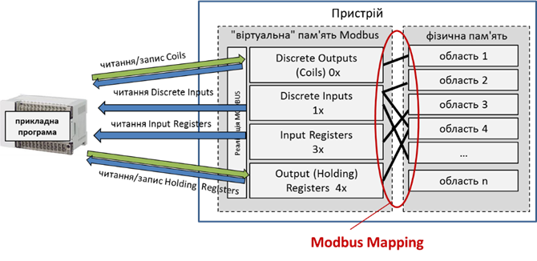

[Людино-машинні інтерфейси](https://pupenasan.github.io/hmi/)  Автор і лектор: Олександр Пупена доц. кафедри [АКСТУ НУХТ](http://www.iasu-nuft.pp.ua/) 

# Лекція 6. Підсистема введення/виведення. Використання Modbus

## 6.1. Загальні принципи функціонування та налаштування MODBUS

***MODBUS*** на сьогоднішній день є одним з найбільш популярних протоколів. Основна причина такої популярності – це простота в реалізації. Протокол MODBUS підтримує і розвиває організація ***MODBUS.ORG***. Вона забезпечує його відкритість та розроблює готові компоненти для спрощення реалізації. Протокол функціонує в 4-х типах мереж: MODBUS RTU та ASCII (Modbus over Serial Line), MODBUS Plus і MODBUS TCP/IP. 

MODBUS використовують для різних цілей, зокрема:

- обміну даними SCADA/HMI з ПЛК чи іншими інтелектуальними засобами (електроприводами, лічильниками, засобами розподіленого введення/виведення тощо);

- обміну даними між ПЛК;

- обміну даними ПЛК з іншими інтелектуальними засобами.

Усі вузли мережі, вірніше, їх прикладні процеси (програми), поділяються на дві категорії: ті, які мають дані (***Modbus сервери***), і ті, яким ці дані потрібно прочитати або змінити (***Modbus клієнти***). 

У зв’язку з тим, що контролери для підсистеми введення/виведення SCADA/HMI є джерелом даних, у більшості випадків драйвери Modbus у них є клієнтами, хоч бувають випадки коли їх налаштовують як сервери. У лекції буде розглядатися тільки випадок, коли SCADA/HMI виступає в ролі Modbus клієнта. 

Для розуміння функціонування і особливостей роботи Modbus варто ознайомитися з ним з точки зору тих пристроїв, для яких він був створений. Протокол Modbus розроблено для зв’язування контролерів від фірми Modicon (тепер є частиною Schneider Electric). З боку серверу, який, як правило, являв собою ПЛК, передбачалося використовувати змінні з 4-х областей пам’яті (рис. 6.1):

- дискретні виходи (0x), або котушки (***Coils***);

- дискретні входи (1x), іншими словами – вхідні біти (***Input Bits***) ;

- аналогові входи (3x), або вхідні регістри (***Input Register*,** 16-бітові) ;

- аналогові виходи (4x), або вихідні/внутрішні регістри (***Holding Registers*,** 16-бітові). 

                               

*Рис. 6.1.* Області пам’яті згідно з MODBUS

Кожна область має умовний номер (зміщення) і вміщує комірки, до яких можна звертатися за адресою, починаючи з 1. Так, область Input Registers починається з комірки **3**0001 (або 300001, залежно від варіантів ПЗ). Усі інші комірки області вхідних регістрів розміщуються в адресах, номер яких послідовно збільшується. Таким чином, при розробленні проекту для такого типу ПЛК Modicon інженер-програміст указував, які комірки пам’яті за які саме канали відповідали. А пристрій Modbus клієнт, який мав прочитати чи записати цю комірку, звертався до неї за її номером та номером області пам’яті, в якому вона знаходилася. 

Комірки з усіх зон пам’яті доступні для читання. Однак для записування доступні тільки комірки з областей Holding Registers та Coils, адже вхідні дані змінюються тільки залежно від значення вхідних каналів. 

Не дивлячись на цілком логічну архітектуру пам’яті ПЛК Modicon, на практиці необхідно обмінюватися також іншими даними. По-перше, протокол Modbus використовується зараз для зв’язку не тільки з ПЛК Modicon. По-друге, в якості Modbus серверів, як було вже зазначено, може бути взагалі не контролер, а, наприклад, перетворювач частоти. Крім того, для обміну внутрішніми змінними, параметрами регуляторів тощо потрібні інші типи комірок пам’яті. Тому виробники пристроїв самі вирішують, як зрештою організована пам'ять пристрою і як вона зв’язується з комірками згідно з Modbus. Тобто в самому пристрої йде так зване ***відображення*** (***Mapping***) реальних комірок пам’яті на комірки, що означені в Modbus (рис. 6.2). За якими правилами проводиться це відображення, означується самим виробником пристрою. Тому розробникові системи необхідно ознайомитися з документацією на конкретний пристрій, перш ніж з’єднуватися з ним по протоколу Modbus. 

 

*Рис. 6.2*. Відображення реальних комірок пам’яті на віртуальну пам’ять MODBUS

Порядок доступу до комірок пам’яті, правила формування повідомлень, які при цьому використовуються, означені протоколом MODBUS. ***MODBUS Application Protocol (MBAP*** MODBUS протокол прикладного рівня) базується на моделі клієнт-серверного обміну повідомленнями і означує формат повідомлень ***MODBUS PDU*** (Protocol Data Unit). Клієнтський прикладний процес робить повідомлення-запит до серверного процесу, в якому в полі "код функції" вказує йому на функцію (сервіс), яку необхідно провести, а в полі даних уточнює деталі виконання цієї функції. Більшість доступних функцій (сервісів) – це операції читання/записування (рис. 6.3)  
 

*Рис. 6.3.* Сервіси (функції) Modbus

При конфігуруванні введення/виведення в SCADA/HMI розробникові не обов’язково потрібно знати формати повідомлень. Однак при налагодженні розуміння протоколу може дати певні відповіді на проблемні питання. На рис. 6.4. показано приклад виконання функції  читання Holding Registers. 
 

*Рис. 6.4.* Приклад читання Holding Registers з 400108 по 400110 (3 шт)

Перший байт у запиті є номером функції: 03 – читання Holding Registers. Далі вказується область даних, яку необхідно прочитати: починаючи зі 108-го (107 зміщення), 3 регістри. При позитивній відповіді (коли немає помилок) MODBUS сервер повертає той самий номер функції і регістри, які були запитані. При негативній відповіді, сервер пришле повідомлення з модифікованим номером функції (старший біт в 1) та номером помилки. 

Таким чином, для вказівки джерела даних (змінної) на пристрої Modbus необхідно вказати необхідну комірку (-ки). У програмі SCADA/HMI це може робитися різним чином:

- вказівкою адреси у форматі (0x, 1x, 3x, 4x);

- вказівкою області пам’яті (Input Bits, Coils, Input Register, Holding Registers) та зміщення в ній відносно 1-го елемента;

- вказівкою використовуваної функції, адресою початкового елемента.  

На рис. 6.5 показано приклади адресації змінних у джерелі даних у різних SCADA/HMI. Так, у SCADA Citect і для панелей WinCC Comfort змінна задається безпосередньо адресою, а в SCADA zenon – областю пам’яті і зміщенням (Offset).   
 

*Рис. 6.5.* Приклад налаштування тегу Modbus в різних SCADA/HMI

У сучасних ПЛК Schneider Electric (Modicon M340/M580, M241/M251, M221 та інші) адресація змінних йде за іншим принципом. Хоч протокол Modbus досі ще підтримується, Modbus-змінні відображаються на інші комірки пам’яті (табл.6.1).  

*Таблиця 6.1.* Відображення областей Modbus на змінні деяких ПЛК Modicon

| **Modbus**            | **Micro/Premium/M340/M580/M221** |
| --------------------- | -------------------------------- |
| Discrete  Input 1x    | %M                               |
| Coils  0x             | %M                               |
| Input  Registers 3x   | %MW                              |
| Holding  Registers 4x | %MW                              |

 Враховуючи це, розробникові проекту SCADA/HMI для вказаних ПЛК зручніше вказувати дійсні адреси, а не в форматі Modbus. Тому постачальники можуть надати інший формат налаштування, залежно від вибраного ПЛК. Ось, наприклад, який мають вигляд різні налаштування для пристроїв зі старими ПЛК та новими Modicon (рис. 6.6). Не слід забувати, що використаний протокол від цього не зміниться, це лише зручність для розробника.   
 

*Рис. 6.6.* Налаштування однакової адреси Modbus для різних типів ПЛК

Оскільки в протоколі MODBUS означені тільки 16-бітні регістри, при необхідності роботи з даними типу REAL (FLOAT) та DINT/UDINT проводиться прив’язка до комірок із сусідніми адресами. У цьому випадку також треба означити послідовність слідування цих комірок, інакше дані будуть неправильно інтерпретовані. На рис. 6.7 показано приклад означення порядку регістрів для FLOAT і DWORD в SCADA zenon. У SCADA Citect це вказується в налаштуваннях Citect.ini, а в WinCC Comfort – опцією "Change Word order" (рис. 6.12). Також на рис. 6.7 показано, як будуть відрізнятися відображення значення змінних при різному порядку слідування регістрів у подвійних словах та в змінних із плаваючою комою.  

 

*Рис. 6.7.* Налаштування порядку регістрів в REAL та DOUBLE в SCADA Zenon

Слід розуміти, що Modbus Protocol є протоколом прикладного рівня. Він не означує, яким чином проводиться доставка повідомлення від клієнта до сервера та в зворотному напрямку, це залежить від типу мережі Modbus. Для розробника SCADA/HMI необхідно також розуміти, як функціонує ця мережа, які додаткові налаштування потрібні та які є обмеження. У наступних параграфах розглядається Modbus RTU та Modbus TCP/IP. 

## 6.2. Загальні принципи функціонування   та налаштування MODBUS RTU/ASCII

Перші мережі MODBUS базувалися на асинхронних послідовних лініях зв’язку і отримали назву ***MODBUS RTU*** та ***MODBUS ASCII*.** На фізичному рівні вони використовують стандартні послідовні інтерфейси із символьним режимом передачі. На сьогодні в MODBUS.ORG ці мережі мають назву ***MODBUS over Serial Line*** і описані у відповідному стандарті. У ньому вказуються правила та рекомендації використання на канальному та фізичному рівнях. 

Згідно зі стандартами MODBUS.ORG, Modbus over Serial Line (Modbus RTU або Modbus ASCII) може функціонувати поверх інтерфейсів RS-485 або RS-232. На практиці Modbus over Serial Line може працювати поверх будь-яких стандартних послідовних асинхронних інтерфейсів (RS-422, Current Loop і т.п). Замість словосполучення "Modbus over Serial Line" частіше використовують "мережа Modbus" (Modbus network), "шина Modbus" (Modbus bus), Modbus Serial або прямо вказують Modbus RTU чи Modbus ASCII. Щоб вказати повний стек протоколів та інтерфейсів для конкретної реалізації мережі, краще використовувати назву типу "Modbus RTU on RS485". Саме Modbus RTU будемо розглядати надалі. 

Для реалізації зв’язку по SCADA/HMI по Modbus RTU використовуються послідовні порти. Як правило, вони мають назву COMx, де x – це номер порту. Ці порти можуть бути реалізовані як RS-232, RS-422 або RS-485. На ПК стандартні послідовні порти можуть бути відсутні, тому замість них використовуються порти USB, до яких підключення проводиться через перетворювачі інтерфейсів, наприклад USB<->RS485. При цьому в системі все одно з’являються віртуальні COM-порти.  

Принцип роботи мереж Modbus RTU базується на тому, що кожний байт, який треба передавати, відправляється одним 11-бітним символом – послідовністю біт: 1 старт, 8 біт даних, 1 паритет або без нього, 1 стоповий біт, або 2 – якщо паритет не використовується. Бітові швидкості, як правило, означені 9600 біт/с та 19200 біт/с. Однак виробники пристроїв можуть додатково підтримати і інші швидкості. 

Оскільки мережа MODBUS RTU може мати шинну топологію, то в один момент часу тільки один пристрій може передавати свої дані. Для вирішення колізій доступу до єдиного інтерфейсу використовується метод доступу ведучий/ведений (Master/Slave). ***Ведучий*** (***Master***) може передавати свій кадр тоді, коли в нього є на це потреба, а ***ведений*** (***Slave***) тільки тоді, коли йому дав на це право ведучий. Тому в мережі MODBUS RTU процес ведучого завжди є клієнтом, а процеси ведених – серверами. Це значить, що ведучий відсилає запити коли забажає, і чекає від них відповіді. Ведені, отримавши запити, обробляють їх, після чого надсилають відповідь. Весь цей час ведучий очікує відповідь і тим самим надає право зайняти веденому шину для її передачі. 

Оскільки SCADA/HMI у більшості випадків є клієнтами, то вони є ведучими. Кожний ведений повинен мати свою унікальну адресу (1-247), за якою до нього звертаються, сам ведучий не адресується. Ведучий чекає від веденого відповідь протягом тайм-ауту. 

Слід розуміти, що на одній шині не може функціонувати більше одного ведучого, оскільки вони будуть конфліктувати, перебиваючи запитами один одного. Тому SCADA/HMI на одній шині Modbus RTU/ASCII можуть бути тільки в тому випадку, якщо одна з них буде з правами ведучого, а інші – веденого. Така конфігурація не завжди можлива і не рекомендується. З тієї ж причини на одній мережі зі SCADA/HMI ПЛК не можуть обмінюватися між собою, оскільки один із них мав би бути ведучим. 

На рис. 6.8 показано приклад виконання однієї транзакції між Modbus RTU Master та Slave з адресою 5. Окрім повідомлення і адреси веденого, кадр також включає контрольну суму (для RTU це CRC).
 

*Рис. 6.8* Приклад функціонування Modbus RTU

Таким чином, при зазначенні джерела даних на пристрої Modbus RTU (ASCII), з яким необхідно зв’язатися, для означення пристрою необхідно вказати:

- номер комунікаційного порту;

- налаштування параметрів порту (швидкість, паритет, стопові біти);

- додаткові параметри синхронізації інтерфейсів (за необхідності);

- тайм-аути;

- номер веденого (Slave).

На рис. 6.9 показано приклади налаштування в різних SCADA/HMI зв’язку зі Slave по Modbus RTU. Для всіх налаштувань спільне означення протоколу (ASCII або RTU, 7 або 8 біт), тип біта паритету та кількість стопових біт, номер фізичного порту (для панелі Comfort IF1 B), адреса пристрою (для zenon вказується безпосередньо у змінній в полі Net Address) та бітова швидкість.  
 

*Рис. 6.9* Приклади налаштування в SCADA/HMI зв’язку зі Slave по Modbus RTU

При використанні перетворювачів інтерфейсів, наприклад USB<->RS-485, або RS-233<->RS-485 або модемів, що потребують апаратного керування потоком, інколи необхідно налаштовувати параметри керування його трансмітером. У SCADA Citect, наприклад, це задається в параметрах налаштування порту, в SCADA zenon – в полі Protocol (рис. 6.9)  

## 6.3. Загальні принципи функціонування   та налаштування MODBUS TCP/IP

У мережах Modbus RTU та ASCII використовуються послідовні лінії передачі. У Modbus on TCP/IP в якості транспорту використовується стек TCP/IP. При цьому протокол передбачає як безпосереднє підключення клієнта і сервера через TCP/IP (наприклад по мережі Ethernet), так і підключення через шлюзи (gateway), які з одного боку мають з’єднання до мережі IP, а з іншого – до послідовного інтерфейсу мережі Modbus RTU (або ASCII) (рис. 6.10). 

Таким чином, для зазначення пристрою, через який відбувається з’єднання по TCP/IP, необхідно вказати адресу IP. При необхідності доступитися до пристрою на Modbus Slave, через шлюз, додатково треба вказати і його адресу. Для цього в протоколі існує спеціальне поле – Unit ID. У якості TCP-порта сервера за замовчуванням використовується номер 502, хоч у деяких випадках можуть використовуватися інші номери портів.   

 

*Рис. 6.10* Комунікаційна архітектура Modbus on TCP/IP 

Щоб зрозуміти, що відбувається на рівні протоколу, розглянемо формування обміну по Modbus TCP/IP. Загальне Modbus повідомлення-запит, що включає функцію і дані, розміщується в TCP-пакеті разом з додатковим заголовком MBAP Header (рис. 6.11). 

Розробникові SCADA/HMI необхідно розуміти тільки призначення поля, яке вказує адресу пристрою, тобто UnitID. Як правило, коли йде звернення безпосередньо до пристрою через IP, поле UnitID ігнорується отримувачем. У деяких випадках UnitID вказує на сервіс, який буде використовуватися. Наприклад, для перетворювачів частоти Altivar Process (Schneider electric) UnitID може вказувати на використання сервісу I/O Scanning або прямого (конфігураційного) доступу до регістрів.  

Таким чином, при зазначенні джерела даних на пристрої Modbus on TCP/IP, з яким необхідно зв’язатися, для означення пристрою необхідно вказати:

- IP адресу пристрою або шлюзу;

- TCP порт (за замовчуванням 502);

- UnitID (за замовчуванням 0 або 255, залежить від реалізації). 

 

*Рис. 6.11* Modbus on TCP/IP формат повідомлення

На рис. 6.12 показано приклади налаштування зв’язку з Modbus Server по Modbus TCP/IP у різних SCADA/HMI. Для всіх налаштувань спільне означення IP адреси, Port (502), адреса UnitID (Slave=5).
 

*Рис. 6.12* Приклади налаштування в SCADA/HMI зв’язку по Modbus TCP/IP

## 6.4. Налагодження та боротьба з неполадками

У багатьох ситуаціях, особливо при ознайомленні з новою SCADA/HMI або пристроєм, з яким необхідно з’єднатися, доводиться провести багато часу, щоб довести обмін до очікуваного результату. Особливо це характерно для ситуацій, коли у розробників небагато досвіду роботи з такими засобами або/та протоколом. У наступному параграфі розглянемо типові проблеми, з якими зустрічаються розробники при налагодженні зв’язку між SCADA/HMI по мережах Modbus, а також шляхи їх вирішення. Тут наводяться засоби, які можуть допомогти в цьому.

 При налагодженні зв’язку SCADA/HMI рекомендується використовувати різноманітні утиліти Modbus та засоби роботи з послідовними портами й мережею Ethernet. З апаратних засобів можуть знадобитися:

- перетворювачі інтерфейсів RS-232<->RS-485, USB<->RS-485, USB<->RS-232;

- Ethernet концентратори (HUB), або комутатори (Switch) з дзеркальним портом (Port Mirroring) для прослуховування обміну;

- тестер, осцилограф та інше додаткове устатковання. 

В Інтернеті є багато різних платних і безкоштовних програмних утиліт, які можуть допомогти при боротьбі з неполадками.  

1) Утиліти для роботи із СОМ-портами та TCP-сокетами з ручним формуванням та аналізом байтових послідовностей (кадрів для Serial та пакетів по TCP та UDP), зокрема:

- утиліти для роботи з COM-портом; 

- утиліти для роботи з пакетами TCP/UDP, наприклад http://packetsender.com для відправки/прийому поверх TCP/IP (UDP/IP); 

- Сніфери, аналізатори для прослуховування з аналізом протоколу. 

2) Утиліти для імітації Modbus Server/Slave

3) Утиліти Modbus Client/Master 

Опис роботи з деякими з них описаний в посібнику.

Мабуть, найбільше проблем налагодження в SCADA/HMI пов’язано саме з комунікаціями. Серед них можна виділити наступні:

1. Дані на SCADA відображаються як недостовірні/недоступні (Modbus RTU/ASCII).

2. Дані на операторській панелі (ОП) відображаються як недостовірні/недоступні (Modbus RTU/ASCII).

3. Дані на SCADA відображаються як недостовірні (Modbus TCP/IP).

6. Дані на ОП відображаються як недостовірні (Modbus TCP/IP). 

5. Відображене числове значення типу INT SCADA/HMI не відповідає такому в ПЛК.

6. Відображене числове значення типу REAL/UDINT SCADA/HMI не відповідає такому в  ПЛК.

7. Стан бітів SCADA/HMI не відповідає такому в ПЛК. 

8. Дані не встигають оновлюватися.  

Опис про можливі причини цих помилок, а також способи їх визначення та усунення можна почитати в посібнику.

[<-- Лекція 5. Підсистема керування збором та обробкою даних в реальному часі](lec5.md)

[--> Лекція 7. Підсистема введення/виведення. Використання OPC](lec7.md)

## Контрольні запитання 

1. Які об’єкти доступні на пристроях з точки зору Modbus?
2. Які програми називають Modbus сервер, а які Modbus клієнт?
3. Як типово виступають в обміні драйвери SCADA/HMI, Modbus сервери чи Modbus клієнти?
4. Розкажіть про відображення реальних комірок пам’яті на віртуальні змінні Modbus (Mapping).
5. Наведіть приклад форматування повідомлення запиту і повідомлення відповіді Modbus.
6. Як веде себе Modbus Server, якщо відповідь буде негативною?
7. Покажіть на прикладах різних SCADA/HMI, як саме може задаватися адреса змінної MODBUS. 
8. Навіщо необхідно вказувати порядок слів у подвійних словах і змінних з плаваючою комою? Покажіть на прикладі однієї з програм SCADA/HMI.
9. Які мережі Modbus нині використовуються для обміну між SCADA/HMI та іншими засобами автоматизації?
10. Які параметри необхідно задати при конфігуруванні з’єднання по MODBUS RTU/ASCII? Покажіть на прикладі однієї з програм SCADA/HMI.
11. Скільки максимум SCADA/HMI можуть бути підключені до однієї мережі, якщо використовується драйвер Modbus Master? Поясніть, у чому таке обмеження.
12. Які параметри необхідно задати при конфігуруванні з’єднання по MODBUS TCP/IP? Покажіть на прикладі однієї з програм SCADA/HMI.
13. Розкажіть про можливість шлюзування MODBUS TCP/IP на MODBUS RTU/ASCII. Яке поле означене в протоколі для налаштування шлюзування?
14. Розкажіть про призначення UnitID в MODBUS TCP/IP.

 

<iframe src="https://www.slideshare.net/slideshow/embed_code/key/FxpuOPmvvoxtNc" width="597" height="486" frameborder="0" marginwidth="0" marginheight="0" scrolling="no" style="border:1px solid #CCC; border-width:1px; margin-bottom:5px; max-width: 100%;" allowfullscreen> </iframe> 
 <strong> <a href="https://www.slideshare.net/pupenasan/scadahmi-modbus" title="Підсистема введення/виведення SCADA/HMI. Modbus" target="_blank">Підсистема введення/виведення SCADA/HMI. Modbus</a> </strong> from <strong><a href="https://www.slideshare.net/pupenasan" target="_blank">Пупена Александр</a></strong> 

