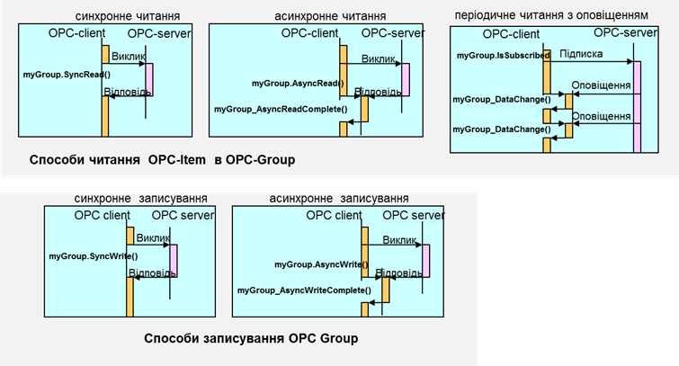
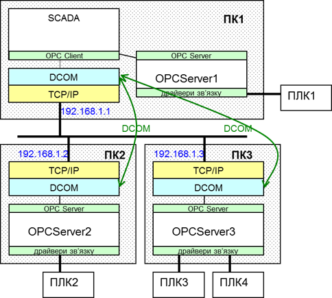
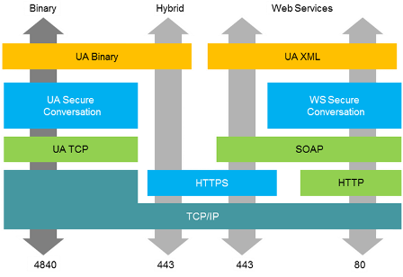
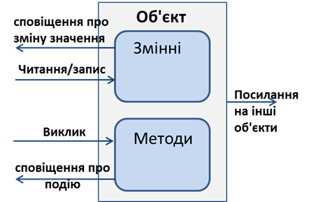
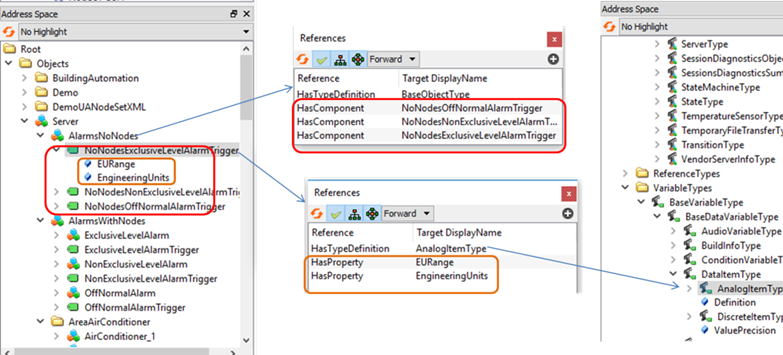
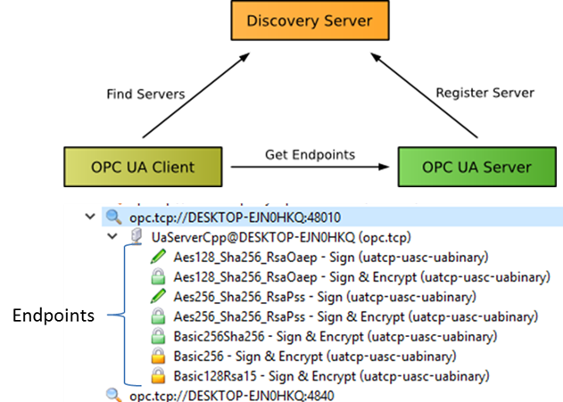
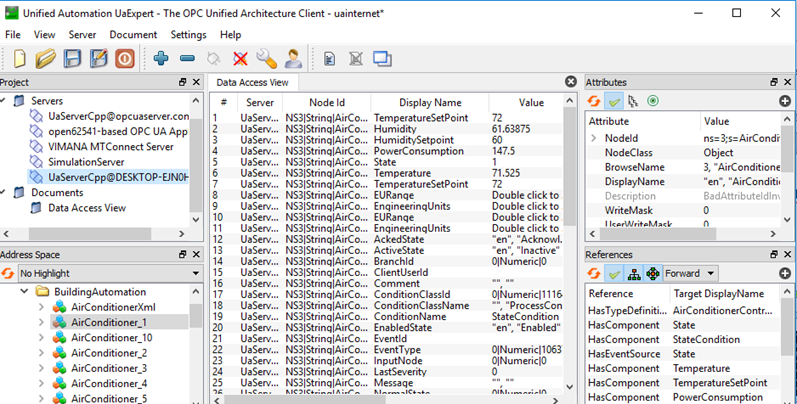

[Людино-машинні інтерфейси](https://pupenasan.github.io/hmi/)  Автор і лектор: Олександр Пупена доц. кафедри [АКСТУ НУХТ](http://www.iasu-nuft.pp.ua/) 

# Лекція 7. Підсистема введення/виведення. Використання OPC

## 7.1. Про OPC

При інтеграції продуктів одного виробника наявність в SCADA-програмі драйверів зв’язку з необхідними контролерами є очевидною. Складнішим є випадок, коли необхідно інтегрувати засоби від декількох виробників, ряд з яких підтримують закриті протоколи. У цій ситуації важко підібрати таку SCADA-програму, яка підтримувала б усі необхідні протоколи промислових мереж. Для подолання цієї проблеми кілька великих компаній вирішила створити стандартний інтерфейс доступу до даних "драйвера" зі сторони програмного забезпечення верхнього рівня. Таким чином, будь-який драйвер зі стандартним інтерфейсом може бути використаний будь-якою SCADA-програмою, яка цей інтерфейс підтримує. Технологія отримала назву ***ОРС***. 

Першу версію стандарту OPC (OPC DA 1.0) розробила група компаній, які в 1996 р. організували некомерційну організацію ***OPC*** ***Foundation*** ([www.opcfoundation.org](http://www.opcfoundation.org/)), що займається розвитком та просуванням цієї технології на ринку. 

Стандарти OPC Foundation існують у наборі декількох специфікацій. Серед них найбільшу популярність на сьогоднішній день мають OPC DA, які стандартизують доступ однієї програми до даних реального часу іншої програми, та OPC UA, які стандартизують доступ до даних і сервісів різного призначення. 

Специфікації ***OPC DA*** (OPC Data Access) ґрунтуються на технологіях, що можуть застосовуватися тільки на програмних платформах Windows і мають ряд суттєвих обмежень. Абревіатура OPC на момент створення стандартів розшифровувалася як "OLE for Process Control", що означало використання стандартів OLE (Object Linking and Embedding), яка, по суті, представляла COM (Component Object Model), для керування технологічними процесами. Тепер використання технологій COM не рекомендується, особливо для розподілених застосунків, тому технологія OPC DA, очевидно, з часом не буде використовуватися. Тим не менше, зараз вона досить популярна. 

Специфікації ***OPC UA*** (OPC Unified Architecture) є більш сучасними. Вони гуртуються на обміні різноманітними даними (реального часу, історичними, тривогами), використовуючи відкриті протоколи на базі XML та інших WEB-технологій. Відхід від технологій COM відобразився і в абревіатурі, яка звучить як "Open Platform Communications". Технологія OPC UA є більш універсальною і може бути використана для взаємодії між програмними елементами, які виконуються на різних платформах. Крім того, специфікації OPC UA стандартизовані в IEC 62541. Принципи роботи OPC UA описано в наступному підрозділі, в цьому розглядаються OPC DA.

Слід сказати, що, крім OPC DA, старі специфікації OPC (що ґрунтуються на технології COM) включали ряд інших:

- OPC DA 1.0, 2.0, 3.0 (Data Access) – три версії специфікацій доступу до даних реального часу;

- OPC AE (Alarms & Events) – для реалізації завдань тривожної сигналізації та подій;

- OPC HDA (Historical Data Access) – для реалізації завдань ведення архіву та доступу до архівних даних;

- OPC DX (Data eXchange) – для безпосереднього обміну між ОРС-серверами;

- OPC XML – для обміну даними через пов’язані мережі за допомогою структур XML на базі WEB-сервісів та SOAP;

- OPC Batсh – для реалізації керування рецептурними завданнями.

## 7.2. OPC DA

У загальному випадку, технологія ОРС забезпечує одній програмі (ОРС-клієнту) доступ до даних процесу іншої програми (ОРС-сервера) через стандартний набір інтерфейсів. Найбільш часто ОРС-технологія використовується як універсальний інтерфейс до драйверів контролерів та периферійних пристроїв. Тобто разом з контролером, або за окремим замовленням, може поставлятися спеціальна програма - ОРС-сервер, яка надає стандартизований доступ до змінних цього типу контролеру. Тобто ОРС-сервер, з одного боку, має драйвери для зв’язку з контролерами за конкретними протоколами промислових мереж, а з іншого – надає універсальний ОРС-інтерфейс для зв’язку із сервером SCADA-програми. У такій системі SCADA-програма буде ОРС-клієнтом. 

На рис. 7.1 показано спрощену схему функціонування роботи ОРС-технології в контексті описаної системи.

       

 *Рис. 7.1.* Функціонування ОРС з точки зору інтегратора

База даних реального часу SCADA-програми (з умовною назвою "SamplSCADA") збирає дані з чотирьох джерел: ПЛК1, ПЛК2, ПЛК3 та ПЛК4. Для перших двох контролерів для збирання даних використовуються драйвери зв’язку для цих ПЛК, вірніше – для протоколів промислових мереж, по яких вони з’єднуються. Дані зчитуються (або записуються) з ПЛК в БДРЧ. Зв’язок з ПЛК3 та ПЛК4 виконується через ОРС-сервери з умовними назвами відповідно "Sampl.OPC" та "Exmpl.OPC" з використанням драйвера ОРС-клієнт. Тобто ОРС-сервери через вбудовані драйвери зчитують дані з ПЛК та зберігають їх у своїй базі даних реального часу. SCADA-програма, в свою чергу, зчитує дані з ОРС-серверів. Запис даних відбувається аналогічно.

Таким чином, для реалізації такого зв’язку в SCADA-програмі користувач повинен: 

1) Налаштувати OPC-сервер за допомогою спеціалізованої програми-конфігуратора, що поставляється разом з ним: створити всі необхідні змінні серверу, тобто дати їм ім’я (ItemID) та вказати джерела даних в ПЛК, на які вони посилаються. 

2) У SCADA-програмі вказати:

- назву ОРС-сервера, з яким необхідно зв’язатися (ProgID); у наведеному прикладі це будуть два сервери – "Sampl.OPC" та "Exmpl.OPC"; інколи SCADA надає можливість вибору ProgID зі списку зареєстрованих ОРС-серверів; 

- для вибраної змінної в якості джерела даних вказати ім’я на ОРС-сервері, тобто ItemID, що був створений на 1-му кроці; як правило ItemID вибирається зі списку, який надає Browser на стороні ОРС-клієнта. 

Технологія ОРС DA ґрунтується на клієнт-серверній архітектурі. ОРС-клієнт користується послугами ОРС-сервера, використовуючи СОМ-інтерфейси його об’єктів. У наведеному на рис. 7.2 прикладі *ОРС-клієнтом* є SCADA-програма, завданням якої є відображення чотирьох змінних (%MW100-%MW103), які знаходяться на ПЛК. OPC-сервер отримує необхідні дані через драйвери зв’язку і зберігає їх у своїй базі даних реального часу. Для того щоб доступитися до даних ОРС-сервера, ОРС-клієнт створює для себе ОРС-Group (Group1, Group2), в яких створює ОРС Item (Item1, Item2), що посилаються на ці дані.
<a href="media7/4_22.png" target="_blank"></a> 

*Рис. 7.2.* Модель сервера та адресний простір OPC DA

***ОРС-клієнт* (*OPC Client*)** – прикладна програма, яка вміє користуватися об’єктами OPC-сервера за допомогою ОРС-інтерфейсів (підмножина СОМ-інтерфейсів). ***ОРС-сервер* (*OPC Server*)** – прикладна програма, яка надає доступ до визначених у специфікації ОРС СОМ-об’єктів за допомогою ОРС-інтерфейсів.

З одним ОРС-сервером можуть з’єднатися декілька ОРС-клієнтів. З іншого боку, одна й та сама програма ОРС-клієнт може одночасно користуватися послугами декількох ОРС-серверів. Тобто технологія ОРС є мультиклієнтною і мультисерверною. 

Оскільки ОРС-сервер – це СОМ-сервер, він реєструється на комп’ютері унікальним числовим ідентифікатором (GUID) та має строковий програмний ідентифікатор (***ProgID***). Тобто для того щоб для ОРС-клієнта означити, з яким ОРС-сервером на тому самому ПК йому необхідно з’єднатися, достатньо вказати його ProgID. 

Об’єкт ***ОРС-Item*** надає доступ до джерела даних (надалі – ***тег***) в межах ОРС-сервера, яке ідентифікується унікальним у межах сервера ідентифікатором ***ItemID***. Тому при створенні ОРС-Item’а вказується ItemID необхідного тега. Правила ідентифікації даних залежать від реалізації ОРС-сервера, а механізм означення їх джерел (наприклад, адреса пристрою та змінної в ПЛК) найчастіше реалізується в конфігураторі цього сервера. 

Увесь список ItemID може мати плоску або деревовидну ієрархічну структуру, завдяки чому зручніше використовувати цей механізм у проектах з великою кількістю даних. Для навігації по списку/дереву ідентифікаторів ОРС-сервер, як правило, має об’єкт ***OPC*** ***Browser***. 

ОРС-Item належить клієнту, який його створив, і тому його не можуть використовувати декілька клієнтів. Тим не менше, є можливість посилатися на одні й ті самі дані. На рис.7.2 два клієнти одночасно використовують дані з %MW100 та %MW102, однак створюють для цього різні OPC-Item. Джерелом даних не обов’язково є змінна на зовнішньому пристрої, це можуть бути внутрішні дані самого сервера. 

З кожним ОРС-Item'ом асоціюється плинне значення (***Value***), відмітка часу (***Time Stamp***) та якість (***Quality***). Таким чином, OPC-сервер не тільки повідомляє про значення змінної, а й указує на їхню свіжість та достовірність. 

***OPC-Group*** – об’єкт ОРС-сервера, який призначений для виконання групових операцій над ОРС-Item’ами. Оскільки ОРС-Item не може існувати без цього об’єкта, спочатку ОРС-клієнт створює ОРС-Group, а потім у його межах створює ОРС-Item’и.  

В інтерфейсі OPC DA 2.0 кожний ОРС-Group, як і все його наповнення, належить окремому ОРС-клієнту. Механізм групування дає змогу розділяти дані за принципом читання/записування, періодичністю операцій та активувати/деактивувати відновлення змінних. Розробнику SCADA/HMI не обов’язково розуміти деталі читання та записування. Тим не менше ці знання можуть знадобитися при тонкому налагодженні та боротьбі з несправностями, тому пояснимо механізми читання та записування в OPC DA.  

Операції читання та записування проводиться одночасно для всіх Item'ів у межах ОРС-Group. Читання зводиться до вирішення таких питань:

- коли на ОРС-сервері повинні відновлюватися дані з пристроїв для кожного з ОРС-Item'ів;

- яким чином про відновлення даних дізнається ОРС-клієнт і як він їх отримає.

При синхронному читанні (Sync Read) ініціація процесу відновлення змінних на ОРС-сервері проводиться самим ОРС-клієнтом: ОРС-клієнт робить запит на відновлення певної ОРС-Group. У такому випадку клієнт може заморозити виконання своєї програми (потоку), поки не дочекається результату читання від ОРС-сервера. На рис. 7.3 графічно зображено процес обміну між ОРС-клієнтом та ОРС-сервером. За необхідності клієнт робить запит за допомогою виклику методу SyncRead для OPC-Group "myGroup" та чекає, поки той не поверне відповідь.

Механізм синхронного читання гальмує роботу програми (потоку) клієнта, тому доречний для читання невеликих об’ємів даних. Альтернативою йому може бути використання асинхронного читання (Async Read), при якому ОРС-клієнт теж ініціює обмін, однак не чекає результату оброблення. Замість цього при закінченні процесу читання ОРС-сервер викликає функцію зворотного виклику ОРС-клієнта (обробник події AsyncReadComplete), в яку передає результат читання. Для реалізації цього механізму необхідно, щоб в об’єкті OPC-Group був активований механізм підписування (Subscript). 
<a href="media7/4_23.png" target="_blank"></a> 

*Рис. 7.3.* Механізми читання та записування даних процесу

За необхідності відновлення даних обидва наведених способи потребують від ОРС-клієнта кожного разу проводити запит до ОРС-серверу. Однак, як правило, дані необхідно читати періодично через певні інтервали часу. Для цього в специфікаціях OPC DA є механізм Періодичного Читання з Оповіщенням (Periodical Read with Notify). При створенні ОРС-Group клієнт замовляє частоту відновлення Item'ів в межах цієї групи. Через зазнчені проміжки часу ОРС-сервер відновлюватиме ці дані, а результат буде зберігати в кеші (Cache). Якщо дані (Value або Quality) хоча б для одного ОРС-Item'а в OPC-Group змінилися, то буде викликана функція зворотного виклику Оповіщення (Notify), тобто обробник події DataChange, у параметрах виклику якого будуть передані нові значення. Для ефективного використання цього механізму можна скористатися зоною нечутливості (Deadband). Слід зазначити, що в об’єкті OPC-Group повинен бути активований механізм підписування та прапорець активності (ACTIVE FLAG). Крім того, періодично відновлюватись будуть тільки активні OPC-Item.  

Операції записування можуть проводитися двома способами: синхронне записування (Sync Write) та асинхронне записування (Async Write). Функціонування повністю аналогічне, як і в операціях читання.

## 7.3. Приклад налаштування в OPC DA SCADA Citect

Розглянемо конфігурування OPC на прикладі SCADA Citect та 2-х ОРС-серверів (Schneider-Aut.OFS, VIPA.OPC-Server). Необхідно в SCADA Citect зчитувати такі змінні (рис. 7.4):

- MW100, що відповідає за температуру з PLC1(VIPA200) по протоколу MPI;

- %MW100, що відповідає за тиск з PLC2 (TSX Micro) по протоколу Modbus RTU.

 

*Рис .7.4.* Схема обміну даним SCADA Citect з використанням ОРС

Для зв’язку з контролерами використовуються ОРС-сервери:

- OFS  від Шнейдер Електрик (ProgID=Schneider-Aut.OFS), що підтримує ряд протоколів, зокрема Modbus RTU;

- VIPA OPC-Server від фірми VIPA (ProgID=VIPA.OPCServer), що підтримує протокол MPI. 

Відповідно до рис. 7.4, на OFS-Cервері необхідно створити змінну з назвою "Pressure", джерелом даних для якої буде змінна %MW100 на PLC2, а на VIPA.OPCServer – змінну з назвою Temperature, джерелом даних для якої буде зміна MW100 на PLC1.

Для конфігурування сервера OFS використовується утиліта OFS Configuration Tool.

Дані означуються так (рис .7.5):

- створюється псевдонім, що буде вказувати на адресу конкретного пристрою, з яким може обмінюватись ОРС-сервер; у нашому випадку псевдонім пристрою має ім’я PLC2;

- для створеного псевдоніму вказується драйвер зв’язку, адреса пристрою та додаткові параметри, що уточнюють місцезнаходження його в мережі; в нашому випадку в результаті конфігурування створиться адреса: MODBUS01:1/T;

- для створеного псевдоніму пристрою вказати файл, в якому будуть знаходитись символьні імена та відповідні їм змінні контролера; у нашому випадку вибраний файл PLC2.CSV, в якому сформований запис:

```
%MW100 <символ_табуляції> PRESSURE
```

 

*Рис. 7.5.* Конфігурування ОFS

Відповідно до правил іменування змінних в OFS, ідентифікатор потрібної змінної буде формуватися так: 

```
ItemID = Ім’я_псевдоніму_пристрою!Ім’я_змінної
```

У нашому випадку ідентифікатор змінної буде 

```
PLC2!PRESSURE
```

Конфігурування VIPA OPC-Server виконується з використанням утиліти OPC Editor. Аналогічно OFS, на сервері створюються пристрої, в межах яких означуються змінні, однак їх порядок і форма дещо відрізняються (рис. 7.6).

 

*Рис. 7.6.* Конфігурування VIPA-OPC

Спочатку вибирається драйвер мережі (в нашому випадку MPI). У межах мережі створюється PLC (у нашому випадку PLC1), а в межах пристрою вказується назва змінної (Tag) та її адреса в ПЛК (TEMPERATURE - MW100) Відповідно до правил іменування змінних в VIPA OPC ідентифікатор змінної буде формуватися так: 

```
ItemID = Ім’я_PLC/Ім’я_змінної
```

У нашому випадку ідентифікатор змінної буде: `PLC1/TEMPERATURE `

Усі змінні в Citect (VariableTag) створюються в межах пристроїв введення/виведення (IODevices), які по своїй суті є програмними, а не апаратними. Тому необхідно створити два IODEvices, які будуть відповідати за ОРС сервери. Для створення IODevices можна скористатися Express Communication Wizard (рис. 7.7). В обох випадках вибирається драйвер ОРС DA Client. У полях Address вказується ім’я ОРС-серверів, тобто їх ProgID.
<a href="media7/4_27.png" target="_blank"></a> 

*Рис. 7.7*. Створення в Citect IODevices, прив’язаних до OPC-серверів

Потім необхідно створити змінні (рис. 7.8) з прив’язкою до створених IODevices, і в полі адреси вказати відповідні ItemID. 

 

*Рис. 7.8*. Створення в Citect Variable Tags

SCADA Citect підтримує механізми імпорту та лінкінгу тегів з OPC Item ID. 

## 7.4. Приклад налаштування OPC DA в SCADA zenon

Розглянемо з’єднання SCADA zenon з OPC Server VIPA за тих самих налаштувань серверу. У SCADA zenon для з’єднання через OPC DA є спеціальний драйвер "OPC Client V2-0". У налаштуванні драйвера вибирається OPC Server та спосіб ідентифікації змінних (рис. 7.9). 

 

*Рис. 7.9.* Налаштування з’єднання драйвера з OPC Client V2-0 з сервером OPC

Розробник проекту може вибрати різний спосіб ідентифікації змінних, зокрема через зазначення адреси в параметрах змінної чи через назву змінної або символьну адресу. Якщо опція "Identification with variable Name" не виставлена, необхідні в проекті змінні вибираються у вкладці Browser (рис. 7.10), в список клієнтського адресного простору (Client address space). Далі в налаштуваннях змінної на вибраний Item посилаються через зміщення (offset), яке вказується відповідно до однойменного поля з клієнтського адресного простору. Недоліком такого підходу є постійне формування і редагування клієнтського адресного простору і можлива зміна зміщення. Тому в zenon є механізм символьної адресації OPC Item через:  

- Variable Name – ім’я змінної zenon повинно відповідати OPC Item ID;

- Variable identification – ідентифікатор змінної zenon повинен відповідати OPC Item ID; 

- Symbolic address – поле Symbolic address у змінній zenon повинен відповідати OPC Item ID (див. рис. 7.10).

Для спрощення створення змінних zenon підтримує механізми імпорту (див. рис. 7.10)
<a href="media7/4_30.png" target="_blank"></a> 

*Рис. 7.10.* Налаштування змінних в zenon для прив’язки до OPC Item 

## 7.5. OPC DA в мережних архітектурах

ОРС-клієнт та ОРС-сервер на одному й тому самому ПК запускаються як окремі процеси. Обмін даними між цими процесами відбувається за правилами СОМ-технології. У мережних архітектурах може виникати необхідність з’єднати ОРС-клієнта з віддаленим ОРС-сервером, який знаходиться в мережі на іншому ПК. Для такого з’єднання використовуються сервіси DCOM.

На рис. 7.11 наведено приклад, у якому ОРС-клієнт (SCADA) на ПК1 з’єднується з локальним ОРС-сервером (OPCServer1) та двома віддаленими (OPCServer2 на ПК2 та OPCServer3 на ПК3). Для реалізації такого з’єднання для ОРС-клієнта, окрім ProgID, необхідно вказати розміщення ПК з ОРС-сервером, а також правильно налаштувати DCOM-конфігуратор. Таким чином, необхідно виконати таку послідовність:

1) налаштувати DCOM Конфігуратор на вузлі сервера та клієнта;

2) вказати Server Node (Ім’я вузла з ОРС-сервером) або його IP;

3) вказати ProgID сервера. 

 

*Рис. 7.11.* Робота з віддаленим сервером ОРС 

Для захисту доступу до об’єктів COM-класів у Windows використовується так званий декларативний захист. Механізм активізації і контролю доступу ґрунтуються на механізмі ролей. Для кожного зареєстрованого класу записи в реєстрі визначають, які користувачі Windows або групи користувачів мають право створювати екземпляри певного класу, тобто об’єкти. Користувачі визначаються при аутентифікації, тобто при їх перевірці, наприклад введенні паролю при вході в Windows. DCOM підтримує декілька рівнів автентифікації:

- без автентифікації; 

- при першому з’єднанні з сервером;

- при кожному зверненні;

- усіх пакетів даних;

- пакетів даних з перевіркою їх цілісності;

- пакетів даних з перевіркою їх цілісності і шифрування пакетів даних. 

Однак зв’язатися з віддаленим ОРС за допомогою ОРС DA можливо тільки у випадку, якщо вузли знаходяться в межах одного домену або робочої групи Windows та не розмежовуються брандмауерами. Останні можуть не пропустити пакети СОМ (порти RPC, як правило, закриті для доступу), тому для з’єднання через Інтернет необхідно вдаватися до певних прийомів. Щоб вирішити цю проблему, OPC Foundation пропонує технології OPC XML та OPC UA.

У прикладах, наведених вище, розглянуто технологію ОРС-DA в контексті вирішення проблеми доступу до даних ПЛК зі SCADA. Тобто ОРС-сервер розглядався як стандартний драйвер зв’язку. Однак область застосування ОРС цим не обмежується. На рис. 7.12 показано приклад використання інтерфейсів ОРС як „мосту” між двома прикладними програмами на різних ПК. При горизонтальній інтеграції може знадобитися об’єднання в єдиний інформаційний простір SCADA-програм. Популярність ОРС-технології призвела до появи в останніх не тільки клієнтської сторони ОРС, а й серверної. Тобто SCADA може виступати як ОРС-клієнтом, так і ОРС-сервером.

 

*Рис. 7.12*. Приклад використання ОРС як „мосту”

Існування в SCADA серверного інтерфейсу OPC дає можливість доступитись до її даних зі сторони прикладних програм рівня MES чи ERP. Офісні програми завдяки наявності VBA та ActiveX теж надають таку можливість. Наявність в SCADA OPC UA сервера збільшує можливості інтеграції.  У OPC UA розроблено шлях міграції для клієнтів і серверів OPC, що базуються на технології Microsoft COM (наприклад OPC DA). При розробленні OPC UA було зроблено певні кроки для того, щоб існуючі дані, які виставлялися на серверах OPC COM (DA, HDA та A&E), могли бути легко відображені та розкриті через OPC UA. Постачальники можуть вибирати міграцію своїх продуктів на OPC UA або використовувати обгортки для перетворення з OPC COM в OPC UA, і навпаки. Кожна з попередніх специфікацій OPC визначила власну модель адресного простору та власний набір послуг. OPC UA об'єднує попередні моделі в єдиний інтегрований адресний простір з єдиним набором сервісів.

##  7.6. OPC UA

***OPC UA (OPC Unified Architecture)*** - це незалежний від платформи стандарт, який дозволяє обмінюватися виробничими даними між різними типами застосунків та користуватися їх сервісами. Принциповою відмінністю в OPC UA від своїх попередників є використання іншого стеку протоколів, що дало можливість:

- відв’язатися від залежності MS Windows;
- реалізовувати застосунки на різних типах пристроїв, а не тільки ПК;
- реалізовувати зв'язок на різних типах мереж в т.ч. через Інтернет;
- будувати захищені з’єднання між застосунками;
- використовувати механізми обміну шляхом публікацій і підписки; 

OPC UA може функціонувати з використанням різних комунікаційних протоколів, при цьому дані можуть бути закодовані різними способами (рис.7.12). Означено кілька протоколів, які можна використовувати:

- OPC UA TCP
- HTTPS
- WebSockets

Визначено три способи кодування даних:

- XML/text
- UA Binary
- JSON

       

рис.7.13. Комунікаційна архітектура OPC UA

OPC UA так само як OPC DA має клієнт-серверну модель функціонування, в якій Сервери можуть надавати різні набори ***Сервісів (Services***). Під час підключення Сервер повідомляє клієнту, які з сервісів він підтримує. Обмін інформацією відбувається з використанням типів даних, означених як в стандартах OPC UA, так і постачальниками. 

Всі дані і сервіси доступні через ***об’єкти***, які надаються клієнтському застосунку через взаємопов’язану об’єктну модель. Сервери означують об'єктні моделі, які Клієнти можуть динамічно переглянути. Через ці об’єкти Сервери можуть надати доступ як до даних реального часу, так і до історичних (Historical), Тривог(Alarms) і Подій(Events). 

Кожен об’єкт може надавати доступ до читання/запису його змінних, або до виклику методів (рис.7.14). Користувачам OPC UA не обов’язково використовувати об'єктно-орієнтовані підходи, що передбачають використання методів та подій. Як і у класичному OPC Data Access може бути побудована проста модель адресного простору, в якій використовуються об'єкти-папки та змінні. Тим не менше, наявність розширених об'єктно-орієнтованих функцій значно полегшує представлення об'єктно-орієнтованих систем за допомогою OPC UA 

 

рис.7.14.Об’єктна модель OPC UA

Об’єкти можуть посилатися на інші об’єкти через різний тип зав’язків. Взаємозв’язані об’єкти серверу доступні клієнтам через механізм організації у вигляді ***адресного простору OPC UA (Address Space***). Усі об’єкти в адресному просторі знаходяться у певній взаємозалежності, що представляється через об'єктну модель OPC UA.  Для визначення взаємозв'язків між об'єктами та їх складових може використовуватися Сервіс перегляду. Елементи об’єктної моделі (об’єкти та їх складові) представлені в адресному просторі як ***Вузли (Node***). Кожен вузол представляє певний клас вузлів (тип елементів об’єктної моделі), такий як об'єкт, змінна (Змінна Даних або Властивість) або Метод і т.п. (див. рис. 7.15).

 

рис.7.15. Приклад перегляду адресного простору серверу OPC UA  

***Класи вузлів (Node Classes)*** означують набір атрибутів та типів посилань для різних вузлів. OPC UA описує вісім класів вузлів (див. рис.7.15): 

- Object (Об’єкт) - використовується для представлення системних об’єктів, складових системи, об'єктів реального світу та програмних об'єктів (аналогія екземплярів в ООП);

- Variable (Змінна) - використовуються для представлення значень (вмісту) об’єкта 

- Method (Метод) - використовується для представлення методу в адресному просторі сервера;

- View (Представлення) - використовується для обмеження кількості видимих вузлів і посилань у великому адресному просторі; 

- ObjectType (Тип Об’єкту) - використовується для представлення у просторі типів об'єктів на які посилаються вузли-об’єкти (аналогія класів в ООП); 

- VariableType (Тип Змінної) – використовуються для означення Властивостей, доступних для екземпляра Змінної;

- ReferenceType (Тип Посилання) - використовується для представлення типу посилання, що використовуються сервером;

- DataType (Тип Даних)


Кожен вузол адресного простору є екземпляром одного з цих класів вузлів. Клієнтам і серверам не дозволяється означувати додаткові класи вузлів або розширювати означення цих класів (наприклад, список атрибутів для класу).

Вузли описуються атрибутами (attributes) і взаємопов'язані посиланнями (references) (див. рис.7.16).

 

рис.7.16. Вузли і Посилання 

***Атрибути (Attributes***) - це елементарні дані, що описують вузол. Клієнти можуть отримувати доступ до значень атрибутів за допомогою сервісів Читання(Read), Запису(Write), Запиту(Query) та Підписки/Контролю елементу (Subscription/Monitored Item). Атрибути є елементарними складовими класів вузлів, перелік і призначення яких описані в стандарті, тому заздалегідь відомі клієнтам і не є безпосередньо видимими в адресному просторі. Набір атрибутів, означених для кожного класу вузлів, не може бути розширений клієнтами або серверами. Кожне означення атрибуту складається з ідентифікатора атрибута (attribute id), імені(name), опису(description), типу даних (data type) і обов'язкового/необов'язкового індикатора (indicator). На рис.7.17 показаний набір атрибутів (Назва та значення) для вузла класу Variable

 

рис.7.17. Приклад набору атрибутів для вузла класу Variable 

***Посилання (References***) використовуються для зв'язку вузлів між собою. Їх можна отримати за допомогою сервісів перегляду (browsing) та запиту (querying). Подібно атрибутам, вони означуються як фундаментальні складові вузлів. На відміну від атрибутів, посилання означуються як екземпляри вузлів класу ReferenceType, які видимі в адресному просторі. Вузол, що містить посилання, називається ***вихідним вузлом (source node***), а вузол, на який посилається, називається ***цільовим вузлом (target node***). Для унікальної ідентифікації посилань в сервісах OPC UA використовується комбінація вихідного і цільового вузлів ReferenceType. Таким чином, кожен вузол може посилатися на інший вузол з тією самою ReferenceType тільки один раз. На рис.7.18 показаний приклад посилання. Цільовий вузол може знаходитися в тому ж адресному просторі або в адресному просторі іншого OPC UA сервера. Цільові вузли, розташовані на інших серверах, ідентифікуються в сервісах OPC UA з використанням комбінації імені віддаленого сервера та ідентифікатора Вузла.

 

рис.7.18. Посилання 

***Змінні (Variables***) використовуються для представлення змісту об’єктів (див.рис.7.35). Означено два типи вузлів-Змінних: Properties (Властивості) і DataVariables (Змінні Даних). Вони відрізняються різновидом даних, що представляють, та можливістю вміщувати інші змінні.

***Властивості (Properties***), подібно до атрибуту вузла, містять задані сервером метадані об'єктів, змінних даних та інших вузлів. Властивості відрізняються від атрибутів тим, що вони можуть бути означені і додані сервером і охарактеризувати те, що представляє вузол. Набір атрибутів і їх призначення є однаковим для всіх вузлів конкретного класу, тоді як властивості можуть бути означені сервером. Наприклад, властивість може використовуватися для вказівки інженерної одиниці змінних. Властивості як і інші вузли також вміщують атрибути (рис.7.19), але не можуть включати в себе інші властивості. Властивості безпосередньо видимі в адресному просторі як Вузол, тоді як атрибути не є Вузлами. Вузол (Змінна, Об’єкт) і його властивості завжди повинні знаходитися на одному сервері.

 

рис.7.19. Порівняння атрибутів і властивостей 

***Змінні Даних(Data Variables***) представляють зміст (дані) об'єкта. Нагадаємо, що об'єкт є контейнером для змінних і методів (див.рис.7.14). Оскільки вузли-об'єкти (object node) безпосередньо не надають числових значення даних, це роблять вузли-змінні. 

Змінні Даних можуть включати в себе (посилатися на) властивості або інші Змінні Даних. При включенні змінних даних формуються складені (структурні) Змінні Даних. Наприклад, об'єкт-файл використовує Змінну Даних для представлення вмісту файлу у вигляді масиву байтів. При цьому для розкриття часу створення і власника об’єкту-файлу можуть бути використані Властивості. 

Наведемо інший приклад. Функціональні блоки в системах керування можуть бути представлені як об'єкти. Параметри функціонального блоку, такі як його задані значення, можуть бути представлені у вигляді Змінних Даних. Об'єкт функціонального блоку може також мати Властивості, що описують його час виконання і тип.

Класичний OPC DA Server використовує прості «символьні» ідентифікатори елементів "ItemID", який є унікальним на всьому OPC сервері. Тобто в класичному OPC існує тільки один "простір імен". Крім того, класичні сервери DA мають можливості лише простої ієрархії, тобто деревоподібної структури з гілками і листям. Таким чином, розробники для створення унікальних ItemID мають використовувати повну ієрархію папок (наприклад, "Folder1.Folder2.Folder3.MyTemperature"). Це призводить до великої кількості надлишкових рядків, втрати пам'яті та уповільнення продуктивності під час перегляду або пошуку окремих елементів. 

При розробці стандарту OPC UA ця концепція ідентифікації була відкинута. Тут кожен об'єкт в адресному просторі є вузлом. Щоб однозначно ідентифікувати Вузол, в нього є ***NodeId***, який завжди складається з трьох елементів: Namespace Index (індекс простору імен), Identifier Type (тип ідентифікатора) та Identifier (ідентифікатор).

***Namespace Index*** - Індекс, який сервер OPC UA використовує для ідентифікації URI простору імен (Уніфікований ідентифікатор ресурсів, Uniform Resource Identifier). Ідентифікатори в межах різних просторів імен можуть бути однаковими. ***URI простору імен*** ідентифікує того, хто(що) є автором імен в його межах (подібно до XML). Такими URI можуть бути наприклад «OPC Foundation», інші стандартні органи та консорціуми, або локальний сервер. Ці URI зберігаються в так званому масиві імен (також називається таблицею імен), індекси яких і використовуються для ідентифікації просторів імен. 

Таким чином унікальність імен досягається тим, що в них є свої простори, які також є унікальними і означуються ідентифікаторами URI. Щоб посилатися не на довгі і незручні URI, у кожному сервері є таблиця цих імен, індекси (NamespaceIndex) якої можна використовувати для посилання. На рис.7.20 показані URI на сервері та їх індекси .  

 

рис.7.20. Приклади URI просторів імен серверу UACppServer

***Identifier Type*** - формат і тип даних ідентифікатора. Це може бути числове значення, рядок, глобальний унікальний ідентифікатор (GUID) або непрозоре значення (специфічний формат простору імен у форматі ByteString). Простір імен OPC UA, як означено в OPC Foundation, використовує числові NodeIds. Загальносистемні та глобальні унікальні ідентифікатори дозволяють клієнтам відстежувати вузли, що переміщуються між серверами OPC UA, що буває у випадку, коли, наприклад, робочі замовлення просуваються по ланцюжку доданої вартості.

***Identifier*** - ідентифікатор вузла в адресному просторі сервера OPC UA.

Наступне зображення показує приклади для NodeIds, що мають різні типи ідентифікаторів.

 

рис.7.21.Приклади різних типів NodeIds

Існує XML-нотація, означена за допомогою схеми XML OPC UA, яка представляє повний кваліфікатор NodeId з використанням наведених вище елементів. Формат рядка:

```xml
ns=<namespaceIndex>;<identifiertype>=<identifier>
```

де `<namespace index> `- Індекс простору імен, відформатований в 10-ковій формі. Якщо індекс дорівнює 0, то "ns = 0;".

`<identifier type>`  - прапорець, який вказує на тип ідентифікатора:

`i` - NUMERIC (UInteger) 

`s` - STRING (String) 

`g` - GUID (Guid) 

`b` - OPAQUE (ByteString)

`<identifier>` - ідентифікатор, закодований як string. Ідентифікатор форматується за допомогою відображення типу даних XML для типу ідентифікатора. Зауважте, що ідентифікатор може містити будь-який ненульовий символ UTF8, включаючи пробіл. Посилатися таб. 7.1.

Таб.7.1. Приклади ідентифікаторів NodeID

| **NodeID**                                  | **Пояснення**                                    |
| ------------------------------------------- | ------------------------------------------------ |
| ns=2;s=MyTemperature                        | namespace index 2, string identifier             |
| i=2045                                      | namespace index 0, numeric  identifier           |
| ns=1;g=09087e75-8e5e-499b-954f-f2a9603db28a | namespace index 1, GUID  identifier              |
| ns=1;b=M/RbKBsRVkePCePcx24oRA==             | namespace index 1,  Opaque/ByteString identifier |

Частина ідентифікатора NodeId однозначно ідентифікує вузол у просторі імен, але можливо, що один і той самий ідентифікатор використовується в різних просторах імен для різних вузлів. 

Оскільки у сервісах OPC UA замість довгого URI використовується індекс простору імен, клієнт повинен подбати про правильне відображення URI у індекс. Поки існує активний сеанс, серверам не дозволяється змінювати індекс для конкретного URI або видаляти записи з таблиці просторів імен, щоб для активного сеансу клієнти могли кешувати таблицю простору імен. Але якщо клієнт не підключений до сервера він може змінювати індекси і видаляти записи з таблиці просторів імен. З цієї причини клієнт не повинен зберігати індекс без зберігання URI, оскільки протягом наступного сеансу він може отримати інший індекс. Таким чином, при встановленні сеансу з сервером, клієнт завжди повинен читати таблицю простору імен сервера та оновити індекси простору імен.

Розглянемо це на прикладі (див.рис.7.22). Клієнт бажає прочитати дані з Вузлу, представленого ідентифікатором `MyTemperature`, який належить до простору імен, означеним URI `urn:MyCompany:UaServer:Model2`. Клієнт зберігає власну таблицю просторів імен, що містить потрібні URI, щоб створити повністю кваліфікований NodeIds, але ще не знає відповідного індексу простору імен у таблиці імен сервера. 

 

рис.7.22. Читання і збереження таблиці простору імен

Для того, щоб мати доступ до правильного вузла, клієнт повинен спочатку прочитати таблицю простору імен сервера. URI простору імен `urn:MyCompany:UaServer:Model2` представлений індексом простору імен `3` на сервері. Тепер клієнт може оновлювати індекси простору імен у своїй таблиці простору імен, тобто індекс `2` індексом `3`, і для доступу до правильного node використати адресу у форматі XML `ns=3;s=MyTemperature`.

Якби клієнт не оновив індекси в таблиці простору імен, могла б виникнути наступна ситуація. Оскільки допускається, що простір імен, ідентифікований іншим URI, наприклад   `urn:MyCompany:UaServer:Model1`, також може містити вузол, що має ідентифікатор `MyTemperature`, клієнт може навіть не помітити, що він звернувся до неправильного вузла при читанні `ns=2;s=MyTemperature`.

Для оновлення даних на клієнті технологія OPC UA надає функціональність ***підписки*** (***Subscription***). Клієнт OPC UA може підписатися на вибрані вузли і казати серверу стежити за цими елементами. Таким чином сервер повідомлятиме клієнта тільки про якісь зміни значень або стану. Цей механізм значно зменшує обсяг переданих даних. Окрім зменшення завантаження на мережу, цей механізм надає додаткові переваги і є рекомендованим механізмом «зчитування» інформації з OPC UA серверу.

Існує три різні типи "змін", на які може підписатися Клієнт, додаючи Контрольовані Елементи до Підписки:

- підписатися на зміну значень змінних (атрибут Value змінної);

- підписатися на події об'єктів (атрибут EventNotifier об'єкта та набору фільтрів подій);

- підписатися на агреговані значення, які обчислюються у означених клієнтом часових інтервалах, на основі поточних змінних значень.


Налаштування, доступні для Контрольованих Елементів (Monitored Items) та Підписки (Subscription), наведені на рисунку 7.23.

 

рис.7.23. Налаштування Контрольованих Елементів (Monitored Items) та Підписки (Subscription)

***Інтервал вибірки (sampling interval***) означує часовий інтервал індивідуально для кожного Контрольованого Елементу в підписці. Це період, з якою сервер перевіряє джерело даних на зміни. Вибірка може проводитися набагато частіше, ніж Клієнту відправлятиметься повідомлення. У цьому випадку Сервер може записувати вимірюване значення протягом певного часу в чергу, а згодом публікувати повну чергу. У випадку ***Агрегованих Контрольованих Елементів (Aggregate Monitored Items)*** інтервал вибірки означує інтервал, для якого агрегуються дані.

***Фільтри*** (***filter***) містять декілька критеріїв, за якими можна вказати, які зміни даних або події слід повідомляти а які повинні бути заблоковані (не передаватися). У випадку Агрегованих Контрольованих Елементів він також містить інтервал дискретизації необроблених даних, який означує швидкість вибірки значень з джерела даних.

UA-сервер може підтримувати запис в чергу (буфер) вимірюваних даних або подій. Розмір черги, тобто максимальне число значень, які можна поставити в чергу, можна налаштувати для кожного Контрольованого Елемента. Коли дані надходять до клієнта (при публікації) черга очищається. Кожна черга має політику відкидання (наприклад, відхилення найстаріших) у разі виникнення переповнення. 

Встановивши режим моніторингу, вибірку даних та звітність можна увімкнути або вимкнути.

Існує два параметри, які впливають на саму підписку: Publishing Interval і Publish Enabled. Після кожного ***Publishing Interval*** (***Інтервалу Публікації***) сповіщення, зібрані в черзі, доставляються клієнту в повідомленні сповіщення (Publish Response). Клієнт повинен гарантувати, що сервер отримав достатню кількість маркерів публікації (Publish Tokens = Publish Requests), так що всякий раз, коли закінчиться інтервал публікації і повідомлення буде готово до відправки, сервер використовує такий маркер і надсилає дані в межах Publish Response. У випадку, якщо нічого не повідомляється (наприклад, ніяких значень не було змінено), сервер надішле повідомлення Клієнту KeepAlive, яке є пустим Publish-повідомленням, щоб вказати, що сервер ще працює, тільки йому нічого відправляти. Надсилання повідомлення сповіщення можна ввімкнути або вимкнути, змінивши параметр ***Publish Enabled*** (Опублікування ввімкнено).

Щоб підключитися до сервера, клієнту необхідно вказати мережну адресу, протокол і параметри безпеки. Для цього OPC UA означує набір функцій виявлення. Вся інформація, необхідна для встановлення підключення клієнту до серверу, зберігається в його ***кінцевій точці (endpoint)***. Сервер може надати кілька кінцевих точок, кожна з яких містить (див. рис.7.24)

- URL кінцевої точки (протокол і адреса мережі)
- політика безпеки (Security Policy, назва для набору алгоритмів безпеки та довжина ключа)
- режим захисту повідомлень (Message Security Mode, рівень безпеки для обміну повідомленнями)
- тип маркера користувача (User Token Type, типи автентифікації користувача, що підтримуються сервером)

Якщо існує декілька серверів OPC UA, для надання інформації про доступні сервери можна використовувати ***Сервер Виявлення*** *(* ***Discovery Server***), на які попередньо реєструються OPC UA Сервери. Клієнти можуть запитувати список всіх доступних серверів з Сервера Виявлення, після чого можна використовувати службу «Get Endpoints» для отримання інформації про доступні з'єднання з сервера.

 

рис.7.24. Принципи роботи Серверу Виявлення та приклад переліку кінцевих точок 

Щоб ідентифікувати себе для комунікаційних партнерів, кожен встановлений застосунок або пристрій OPC UA потребує ***Application Instance Certificate*** (***Сертифікат екземпляру застосунку***) та пов'язану пару публічних/приватних ключів. Відкритий ключ розповсюджується разом із сертифікатом. Приватний ключ повинен залишатися таємним і використовується для підписування та/або розшифровки повідомлень. Партнер зв'язку може використовувати відкритий ключ для перевірки відношення довіри, перевірки підпису повідомлень і шифрування повідомлень. Сертифікат екземпляра застосунку, включаючи публічний і приватний ключ, може бути згенерований застосунком або наданий адміністратором. Детальніше про захищений зв'язок оисано в посібнику.  

Сервер повинен надати принаймні одну кінцеву точку, до якої можуть підключатися клієнти. Клієнт використовує ***Discovery URL*** (як правило, ідентичну URL кінцевої точки) для запиту з сервера списку кінцевих точок, включаючи конфігурацію безпеки. Цей запит через сервіс GetEndpoints завжди працює без перевірки безпеки. Адреса Discovery URL зазвичай надається серверами Discovery, але може бути надана користувачем вручну.

*URL* кінцевої точки (*Endpoint* *URL)* надає основну інформацію, яку клієнти потребують для підключення до сервера, включаючи: протокол, ім'я хоста або IP-адресу, а також номер порту. Наприклад, 

```http
opc.tcp://localhost:48020
```

Для встановлення безпечного з'єднання з сервером клієнт повинен довіряти сертифікату серверу, тобто сертифікат повинен бути доданий до списку довіри. Зазвичай відкривається діалогове вікно, яке спонукає користувача переглянути сертифікат і вирішити, чи слід довіряти йому. На рис.7.25 показане діалогове вікно в тестовому OPC UA Client “UaExpert” при спробі вперше підключитися до сервера “UAServerCpp”. Він відображає вміст сертифіката серверу і дозволяє користувачеві вирішувати, чи слід довіряти сертифікату чи ні. Якщо користувач вибирає "Trust Server Certificate", він зберігається в папці, *trusted/certs* в сховищі сертифікатів PKI UaExpert.

 

рис.7.25. Приклад користувацького вікна для перегляду, прийняття або відхилення сертифікату

Довірившись сертифікату, клієнт може перевірити підпис (сигнатуру) повідомлень з сервера і зашифрувати повідомлення, що надсилаються на сервер. Після збереження кінцевих точок у списку з'єднань сервера завершується конфігурація клієнта.

Як і для класичного OPC, для OPC UA є достатньо багато доступних безкоштовних тестових клієнтів і серверів. Враховуючи, що технологія є мульти-платформовою ці утиліти доступні не тільки для Windows і не тільки для ПК. Наявність мобільних застосунків робить її ще більш привабливою. 

Серед безкоштовних «еталонних» серверів для Windows зупинимося на UaCPPServer (OPC UA C++ Demo Server) – тестовий OPC Unified Architecture Server для операційних систем Windows, в якому імітуються дані та інформаційна модель (Standard, DI та PLCopen). Після запуску ОРС-сервера створюється тільки одне консольне вікно, в якому виводиться URL кінцевої точки (рис.7.26). Для конфігурування використовується окрема програма (UA Server Administration), в якій також можна керувати сертифікатами. На рис.7.26 видно, що стоїть опція “Accept all certificates”, що дозволяє підключатися кому завгодно з будь яким сертифікатом, також дозволено підключатися без шифрування та автентифікації. Таке налаштування зручно при тестових підключеннях, але для реальних проектів **недопустимо з точки зору кібербезпеки**! 

У демо-сервері UaCPPServer прописані користувачі та паролі з різними ролями (див.таб.7.2)

Таб.7.2. Користувачі та їх паролі наперед визначені в UaCPPServer 

| **UserId** | **GroupIds** | **UserName** | **Password** |
| ---------- | ------------ | ------------ | ------------ |
| 0          | 0            | root         | secret       |
| 1          | 1            | joe          | god          |
| 2          | 0,1,2        | john         | master       |
| 3          | 1,2          | sue          | curly        |

 

рис.7.26. Вікно Сервера OPC UA C++ Demo (UaCPPServer) та утиліти його конфігурування. 

У якості клієнта під Windows зручною є безкоштовна утиліта UaExpert – це повнофункціональний клієнт OPC UA, який може працювати з декількома профілями та функціями OPC UA. Інтерфейс містить перелік серверів проекту з вказівкою їх стану, навігатор адресного простору, вікно вибраних об’єктів, вікно атрибутів і посилань (рис.7.27). Клієнт дає можливість змінювати значення Змінних.

    

рис.7.27. Вікно UaExpert .

Вхід на тестовий OPC UA Севрер доступний за посиланням `opc.tcp://opcuaserver.com:4840`. 

## 7.7. Приклад налаштування OPC UA в SCADA Citect

У SCADA Citect починаючи з версії 8.0 (2016) з’явився драйвер OPC UA Client. Спочатку розглянемо підключення його до OPC UA Server (UaCPPServer) простим шляхом, без використання сертифікатів. Для цього зручно скористатися помічником створення нового пристрою (див.рис.7.28). У вікно адреси треба вставити URL кінцевої точки, який можна скопіювати з вікна UACppServer (див.рис.7.26). 

Для автоматичного створення тегів можна використати прив’язку пристроїв до зовнішньої бази даних тегів. У вікні налаштувань вибирається потрібний рівень об’єкта, зміст якого прив’язується з новоствореними змінними. Результат створених змінних і зв’язків  показаний на (рис.7.28). Також там наведений вигляд простору імен із вибраного об’єкта “Scalar” в тестовому клієнті UAExpert.    

 

рис.7.28. Налаштування I/O Device в Citect за допомогою помічника 

 

рис.7.29. Створені теги з зв’язками до бази даних простору імен OPC UA Server та перегляд простору імен в UAExpert

Налаштування при відключених опціях захисту значно спрощує роботу на початкових етапах, але на стадії впровадження необхідно потурбуватися про кібербезпеку. Для тестового серверу UaCPPServer це робиться відключенням опції “Accept all certificates”, а також деактивацією опції «None» в параметрах Security (рис.7.30). Крім того типи «Basic128Rsa15» та «Basic256» є застарілими і за замовчуванням відключені, але драйвер Citect наразі підтримує тільки ці типи, тому їх треба активувати. Це робиться шляхом попередньої активації опції «Allow Deprecated Security settings» і виставлення інших опцій. Після зміни налаштувань і підтвердження «Apply» необхідно перезапустити UaCPPServer. 

 

рис.7.30. Налаштування опцій кібербезпеки UaCPPServer 

Налаштування параметрів безпеки OPC UA для Citect відбувається в спеціальному застосунку «Configurator». Після запуску конфігуратору, необхідно вибрати розділ OPC UA Client Driver і створити нові налаштування «Create new settings», які потім будуть використані для конкретного пристрою вводу/виводу. На рис.7.31 показані кроки, на яких зроблені зміни в конфігурації, усі інші закладки виставлені за замовченням. На кроці налаштування «Server» необхідно зробити імпорт сертифікату серверу. Контроль результату імпорту проводиться через повідомлення.

 

рис.7.31. Налаштування параметрів кібербезпеки в Configurator. 

На кроці «Finish» використовуючи кнопку “Configure” необхідно записати конфігурацію, після чого надіслати запит на з’єднання «Test Connection», який перший раз буде відхилено (Untrusted) сервером (рис.7.32.1). Цей пробний тест потрібен для передачі сертифікату, який попаде у список відхилених. Тому після цього у налаштуваннях UaCPPServer на вкладці Certificates необхідно активувати довіру до сертифікату через команду“Trust” контекстного меню (див.рис.7.32.2). Після повторної перевірки «Test Connection» результат з’єднання має бути позитивним. 


рис.7.32. Дозвіл-підтвердження клієнтського сертифікату від Citect. 

Для того, щоб конфігурація була використана в середовищі виконання Citect, для конкретного I/O Device в Citect.INI необхідно прописати параметр, рівним назві конфігурації. В даному випадку він буде рівним (див.рис.7.32.3)

```
[OPCUA.PORT1_BOARD1.OPCUAserv] SecuritySettingsName = DEV1
```

## 7.8. Приклад налаштування OPC UA в SCADA zenon

У прикладі зі SCADA zenon покажемо з’єднання з UaCPPServer використовуючи автентифікацію та типу сертифікату «Basic256». У налаштуваннях UaCPPServer на вкладці «Certificates» необхідно зняти опцію «Enable Anonymous logon», щоб підключення можна було проводити тільки з автентифікацією. Усі інші налаштування серверу зробити як показано на рис.7.33.

 

рис.7.33. Налаштування з’єднання драйверу OPC UA Client у zenon

У SCADA zenon для такого з’єднання використовується OPC UA Client Driver. У налаштуваннях драйверу необхідно вказати Discovery URL, після чого при натисканні кнопки вибору автоматично заповнюються поля «Server URL» та «Server Name» (рис.7.34.1). У ім’я користувача та пароль можна вписати одного з користувачів з Таб.7.2, наприклад «root» і «secret» відповідно. У налаштуваннях security необхідно вибрати поля відповідно до рис.7.34. Після цього необхідно підтвердити конфігурацію і зробити компіляцію проекту, щоб створилися відповідні папки та файли налаштувань. Після компіляції у папку проекту «..\Custom\Drivers\PKI\CA\certs\» необхідно скопіювати файл сертифікату серверу. Це можна зробити виділивши власний сертифікат у вікні конфігурації UaCPPServer і натиснувши «Copy Application Certificate To…». Після копіювання сертифікату, його треба вказати в налаштуваннях Connection драйверу: “Certificates” -> “Server Certificate” (рис.7.34.2).

 

  рис.7.34. Імпорт змінних та властивість адресації змінної OPC UA Client у zenon

Далі можна скористатися імпортом змінних з драйверу (рис.7.34.3). Під час першої ж спроби, zenon видасть помилку, аналогічно як це відбувається з SCADA Citect, так як сертифікат сервером буде відхилено. Тому після цього у налаштуваннях UaCPPServer на вкладці Certificates необхідно активувати довіру до сертифікату через команду “Trust” контекстного меню (див.рис.7.34.4). Повторна команда імпорту змінних видасть вікно вибору, в якому можна буде вибрати необхідні змінні з Серверу, наприклад «Demo.Dynamic.Scalar.Float» (рис.7.34.1). Налаштування змінної показано на рис.7.34.2. 

[<-- Лекція 6. Підсистема введення/виведення. Використання Modbus](lec6.md)

[--> Лекція 8. Розроблення дисплеїв та анімованих елементів](lec8.md)

## Контрольні запитання 

1. Розкажіть про загальні принципи побудови обміну між SCADA/HMI та іншими засобами з використанням OPC DA.
2. Яка програма називається OPC DA Server?
3. Яка програма називається OPC DA Client?
4. Чим виступає SCADA/HMI  програма при з’єднанні з ПЛК OPC DA Client чи Server?
5. Що необхідно налаштувати в OPC DA Server для забезпечення доступу до даних через його драйвер?
6. Що необхідно налаштувати в SCADA/HMI програмі для забезпечення доступу до даних OPC DA Server, до якого він намагається підключитися?
7. Що таке ОРС-Item і OPC-Group в OPC DA?
8. Які специфікації є в OPC DA?
9. Як у стандарті означені правила ідентифікації тегів?
10. Як можна дізнатися про формування ідентифікатора OPC ItemID? Покажіть це на прикладі.
11. Які основні атрибути, окрім Value, є в OPC Item? 
12. Яке призначення OPC-Group? 
13. Розкажіть про операції читання/записування OPC Item.
14. Які процедури необхідно зробити, щоб налаштувати з’єднання з віддаленим OPC сервером? Покажіть на прикладі однієї з програм SCADA/HMI.
15. У якій сфері застосовують технології OPC DA в проектах зі SCADA/HMI?
16. Який порядок перевірки наявності зв’язку із джерелом даних при використанні OPC DA як універсального драйвера SCADA/HMI?
17. Яка принципова відмінність OPC DA від OPC UA? Які в цьому переваги?
18. Розкажіть про принципи організації адресного простору OPC UA (Address Space).
19. Які класи вузлів Ви знаєте? Яке їх призначення?
20. Що таке атрибути вузла?
21. Як організовані зв’язки між вузлами? Що таке посилання?
22. Розкажіть про призначення вузлів класу Змінні (Variables). 
23. Чим відрізняються типи вузлів класу змінних: Properties (Властивості) і DataVariables (Змінні Даних)?
24. Розкажіть, як означується ідентифікатор NodeId для вузла.
25. Що таке Namespace Index? Як URI простору імен пов'язаний з індексом?
26. Як правильно звертатися до простору імен у різних сесіях? 
27. Які IdentifierType Ви можете назвати?
28. Як представляється повний кваліфікатор NodeId в XML-нотації?
29. Яким проводиться налаштування Контрольованих Елементів (Monitored Items) та Підписки (Subscription)?
30. Розкажіть про призначення сервера виявлення (Discovery Server).
31. Розкажіть про принципи автентифікації в OPC UA.

<iframe width="400" height="225" src="https://www.youtube.com/embed/wmgPsz0KAp4" title="YouTube video player" frameborder="0" allow="accelerometer; autoplay; clipboard-write; encrypted-media; gyroscope; picture-in-picture" allowfullscreen></iframe>

<iframe width="400" height="225" src="https://www.youtube.com/embed/wmgPsz0KAp4" title="YouTube video player" frameborder="0" allow="accelerometer; autoplay; clipboard-write; encrypted-media; gyroscope; picture-in-picture" allowfullscreen></iframe>


<iframe src="https://www.slideshare.net/slideshow/embed_code/key/g45uHzEoOnzZpa" width="597" height="486" frameborder="0" marginwidth="0" marginheight="0" scrolling="no" style="border:1px solid #CCC; border-width:1px; margin-bottom:5px; max-width: 100%;" allowfullscreen> </iframe> <div style="margin-bottom:5px"> <strong> <a href="https://www.slideshare.net/pupenasan/5-opc" title="5 Підсистема введення/виведення. OPC" target="_blank">5 Підсистема введення/виведення. OPC</a> </strong> from <strong><a href="https://www.slideshare.net/pupenasan" target="_blank">Пупена Александр</a></strong> </div>
