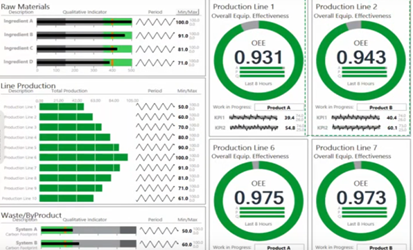

[Людино-машинні інтерфейси](https://pupenasan.github.io/hmi/)  Автор і лектор: Олександр Пупена доц. кафедри [АКСТУ НУХТ](http://www.iasu-nuft.pp.ua/) 

# Лекція 8. Розроблення дисплеїв та анімованих елементів

## 8.1. Модель контура контролю та керування 

Людина в системах автоматизованого керування відіграє важливу роль у безпечному та ефективному проходженні технологічного процесу. HMI в цьому повинен допомогти в ранньому виявленні, діагностиці та правильному реагуванні на нештатну ситуацію. Тому для розроблення високоефективних людино-машинних інтерфейсів необхідно чітко розуміти усі фактори, що впливають на процеси усвідомлення ситуації людиною, прийняти рішення та реалізувати дії. Щоб отримати інформацію про загальний стан процесу, оператор з надзвичайно великої кількості контрольованих ним сигналів повинен виділити найбільш пріоритетні, на основі чого прийняти й реалізувати правильні рішення.   

Розглянемо контур контролю та ручного/супервізорного керування в системі як комплекс взаємопов’язаних функцій (рис. 8.1). Інформація від об’єкта керування (ОК) проходить ряд перетворень і зрештою замикається на ньому через дію оператора: 

- вимірювання значення даних, які необхідно контролювати з об’єкта керування;

- оброблення даних на пристрої збору (наприклад ПЛК);

- зчитування даних з пристрою збору та їх оброблення  в базі даних реального часу (БДРЧ);

- зчитування даних з бази даних реального часу та їх оброблення в інших підсистемах;

- відображення стану в підсистемі HMI;

- сприйняття оператором інформації; 

- усвідомлення стану оператором (ситуаційна обізнаність) ;

- прийняття рішень оператором;

- реалізація керуючих дій. 

<a href="media8/5_1.png" target="_blank"></a> 

*Рис. 8.1.* Модель контуру контролю та керування з використанням SCADA/HMI 

Оператор повинен якнайшвидше зорієнтуватися в ситуації, яка є на даний момент, прийняти рішення і реалізувати керуючу дію. Контроль та дія можуть відбуватися як через засоби супервізорного спостереження та керування (тобто через SCADA/HMI), так і безпосередньо на об’єкті (тобто за допомогою візуального, аудіального, органолептичного і т.п. сприйняття та ручних засобів керування). Дії оператора через SCADA/HMI записуються в журнал. 

Виділені у наведеному вище переліку напівжирним шрифтом процеси стосуються безпосередньо оператора і повинні обов’язково враховуватися при розробленні SCADA/HMI. Враховуючи, що саме оператор є особою, яка приймає рішення та реалізує керування, необхідно розроблювати системи таким чином, щоб максимально сприяти правильності та швидкості прийняття рішень, а також швидкості їх реалізації. Для цього необхідно забезпечити:

1)   отримання даних з об’єкта з необхідною швидкістю (частотою, періодичністю);

2)   отримання інформації про достовірність/доступність даних;

3)   оброблення даних для сприйняття людиною; 

4)   представлення даних на засобах HMI у потрібному контексті;

5)   допомогу в прийнятті рішень;

6)   швидкий доступ до елементів керування;

7)   уникнення помилкових дій.   

При цьому необхідно враховувати внутрішні та зовнішні чинники, а також досвід операторів. Слід зазначити, що розробники SCADA/HMI часто не враховують частини з наведених вище вимог. 

## 8.2. Дисплеї

### Типи та стилі дисплеїв

Робота графічної підсистеми ґрунтується на дисплеях, які в різних середовищах розроблення можуть називатися сторінками, екранами, мнемосхемами або відображеннями. У стандарті ISA-101 використовується саме термін Display. Ми надалі будемо вживати слова, які вважатимемо синонімами: ***дисплей*, *дисплейна сторінка*** або ***сторінка***. Для прикладу конкретної програми SCADA/HMI буде вживатися прийнятий у ній термін. 

Більшість АРМ потребують багатосторінкового інтерфейсу. Це викликано необхідністю відобразити велику кількість даних, які неможливо помістити на одній дисплейній сторінці. Деякі стилі передбачають використання одного дисплея, в межах якого в певних місцях екрана переключаються сторінки залежно від контексту.  

Дисплейні сторінки за призначенням умовно можна розділити на такі типи:

- технологічні (наприклад, сторінка відділення фільтрації; сторінка станції приготування, тощо); 

- діагностичні та тривогові (наприклад, сторінка списку активних тривог; сторінка списку повідомлень; сторінка стану приводу);

- трендові (наприклад, сторінка історичних трендів);

- звітні (наприклад, сторінка звіту приготування продукту; сторінка із загальними показниками ефективності процесу (KPI)); 

- налагоджувальні (наприклад, карта ПЛК; налаштування ПІД-регулятора контуру температури); 

- конфігураційні (наприклад, параметри роботи фільтра; налаштування роботи виконавчих механізмів). 

Стилі відображення дисплейних сторінок відрізняється залежно від призначення. У стандарті ISA-101 виділено стилі, показані в табл. 8.1.

*Таблиця 8.1.* Типи стилів дисплейних сторінок

| **Тип стилю**                                           | **Опис**                                                     | **Приклад  застосування**                                    | **Приклад  зовнішнього вигляду**                             |
| ------------------------------------------------------- | ------------------------------------------------------------ | ------------------------------------------------------------ | ------------------------------------------------------------ |
| Список  (List)                                          | Рядки  або списки з даними. Текстові і числові дані можуть змішуватися із символами  технологічного обладнання | Таблиця  технологічних змінних із відображенням значень, таблиці конфігурування  змінних та тривог | <a href="media8/t5_2_1.png" target="_blank"></a> |
| Процес,  технологічний (Process)                        | Графічне  відображення технологічного обладнання, трубних з'єднань та засобів  автоматизації | Перероблені  схеми автоматизації (P&ID) або технологічні схеми (PFD) | <a href="media8/t5_2_2.png" target="_blank"></a> |
| Схематичний  огляд  (Schematic overview)                | Інформаційний  огляд області керування без деталізації. Типи елементів керування та  відображення на схемі залежать від функціональних вимог | Схема  всього цеху або технологічної лінії, схема транспортування матеріалів | <a href="media8/t5_2_3.png" target="_blank"></a> |
| Функціональний  огляд  (Functional overview, Dashboard) | Представлення  функціональних залежностей даних              | Відображення  ключових показників ефективності (KPI)         | <a href="media8/t5_2_4.png" target="_blank"></a> |
| Топологічний,  за розміщенням (Topology, Location)      | Представлення  розміщення обладнання на місцевості           | Схема  розміщення обладнання в цеху                          | <a href="media8/t5_2_5.png" target="_blank"></a> |
| Графіки  (Graph)                                        | Представлення  даних у вигляді графіків залежностей або діаграм історичних даних чи даних  реального часу | Тренди  реального часу або історичні.   Статистичні  діаграми якості або статистичні діаграми керування процесом | <a href="media8/t5_2_6.png" target="_blank"></a> |
| Груповий  (Group)                                       | Набір  лицьових панелей для точок вимірювання                | Керуючі  клапани багатокорпусного підігрівника.     Клапани  регулювання витрат ректифікаційної колони | <a href="media8/t5_2_7.png" target="_blank"></a> |
| Логічне  відображення (Logic Monitor)                   | Дисплеї,  що відображають логічні залежності між функціями системи | Дискретні/логічні  діаграми, блочні діаграми, ступінчасті діаграми, діаграми послідовностей | <a href="media8/t5_2_8.png" target="_blank"></a> |
| Процедурний (Procedural)                                | Дисплеї  логіки процедурного керування                       | Діаграми  SFC (Sequential function chart) або PFC (Procedure function  chart) | <a href="media8/t5_2_9.png" target="_blank"></a> |
| Відео  (Video)                                          | Дисплеї  з відображенням потокового або записаного відео     | Відео  відображення технологічного процесу. Відеонагляд      | <a href="media8/t5_2_10.jpg" target="_blank"></a> |
| Діагностичний  (Health/ Diagnostic)                     | Відображення  стану певної інфраструктури компонентів HMI та системи керування | Дисплей  стану обчислювальної мережі                         | <a href="media8/t5_2_11.jpg" target="_blank"></a> |
| Список  тривог (Alarm list)                             | Відображення  списку статусної інформації                    | Дисплей  зведення тривог.  Дисплей  відтермінованих  тривог.  Дисплей  виведених з обслуговування тривог.   Дисплей  журналу повідомлень | <a href="media8/t5_2_12.png" target="_blank"></a> |

Дисплейні сторінки відображаються на ***вікнах***. Вікна можуть бути ***постійними***, які завжди займають всю область відображення, або ***спливаючими*** (***pop-up***), що появляються поверх інших вікон, як правило, для діалогових цілей (наприклад, повідомлення з підтвердженням або вікно керування виконавчим механізмом). При налаштуванні вікон, на яких розміщуються сторінки, як правило, вказують:

- розмір та позицію вікна; 

- можливість переміщення; 

- налаштування заголовка вікна; 

- ширина заголовка;

- наявність системних кнопок вікна.

Залежно від інструментальних засобів SCADA/HMI, параметри вікон, на яких розміщуються дисплейні сторінки можуть налаштовуватися в параметрах самої дисплейної сторінки або окремо. У першому випадку властивості вікна задаються безпосередньо в налаштуваннях дисплейної сторінки. У другому – розробник спочатку розробляє концепцію відображення дисплеїв на засобах HMI, тобто в якому саме місці відображатимуться конкретні типи дисплеїв, які будуть спливаючими, і т. п., а після цього – прив’язує дисплеї до цих вікон. 

Багато SCADA/HMI програм підтримують механізм ***шаблонних сторінок*** (***Template***). Шаблонна сторінка – це дисплейна сторінка, яка призначена для використання її в якості підкладки для інших сторінок. Наприклад, якщо треба на багатьох сторінках використовувати однакові кнопки навігації, то це можна зробити тільки на одній шаблонній сторінці, на базі якої створити усі інші сторінки. Слід сказати, що зв'язок дисплейної сторінки із шаблонною сторінкою залишається. Це значить, що якщо необхідно добавити нові елементи на шаблон або змінити існуючі, то це автоматично відобразиться на всіх дисплейних сторінках.

### Дисплеї в SCADA zenon

У SCADA zenon дисплейні сторінки називаються ***екранами*** (***Screens***). Вони розміщуються на вікнах, що визначаються налаштуваннями ***фреймів*** (***Frames***). Для кожного фрейму задаються певні параметри (рис. 8.2) Прокоментуємо ті з них, які були уже наведені:

- Left, Right, Top, Bottom – позиція на екрані монітора; 

- Width (maximum), Height (maximum) – ширина та висота; 

- Positioning – відносна (щодо кнопки, яка викликає) чи абсолютна позиція на екрані монітора;

- Move – можливість переміщення;

- Always in the foreground – завжди на передньому плані (над усіма іншими вікнами);

- Frame can be opened multiple times – можливість відкриття декількох екземплярів вікон;

- Border type – тип межі вікна;

- Title, System menu, Min./Max. buttons – кнопки меню в заголовку вікна.

<a href="media8/5_7.png" target="_blank"></a> 

*Рис. 8.2.* Приклад налаштування параметрів вікна в SCADA zenon 

Екрани (Screens) в SCADA zenon вже створюються з прив'язкою до фреймів. Такий підхід дає можливість розділити процеси створення дисплейних сторінок (наповнення) та розміщення їх на екрані монітора.

### Дисплеї в SCADA Citect

У SCADA Citect дисплеї називаються ***сторінками*** (***Page***). Налаштування вікна вказується в налаштуванні самої сторінки. На рис.8.3 показано налаштування сторінки, для якої, зокрема, вказуються:

- ширина та висота сторінки;

- "Предназначено для показа заголовка" – наявність заголовка;

- заголовок вікна.

<a href="media8/5_8.png" target="_blank"></a> 

*Рис. 8.3.* Приклад налаштування параметрів сторінки в SCADA Citect

Інші властивості вікна, зокрема наявність системних кнопок, можливість переміщення, модальність та інші задаються у функціях, що викликають це вікно. Справа в тому, що в SCADA Citect практично вся діяльність реалізована через вбудовану мову програмування Cicode, зокрема через вбудовані функції, команди та вирази. Сторінку можна відкрити, безпосередньо викликавши її за ім'ям, або шляхом виклику функції створення вікна із завантаженням у нього сторінки. Другий варіант дає можливість налаштувати додаткові параметри вікна.

Citect підтримує механізм шаблонів. Тобто, можна вибрати шаблон, на базі якого сторінка буде створена. Шаблон, по суті, являє собою спеціальний тип сторінки, де можна використовувати ті самі елементи, що й на звичайних сторінках, а також анімацію. При створенні сторінок весь зміст шаблону буде недоступний на ній для редагування, а всі зміни в шаблоні будуть проявлятися на сторінках після їх відкриття.  

## 8.3. Редактори графічної підсистеми

Можливості редакторів графіки в SCADA/HMI значно впливають на швидкість розроблення та зручність. Нерідко вподобання розробників щодо конкретного програмного пакета диктуються саме критеріями зручності. Огляд усіх можливостей реакторів навіть однієї SCADA/HMI програми міг би зайняти весь обсяг посібника. Тому тут наведемо найбільш вживані підходи, характерні для більшості редакторів.

Для розміщення графічних елементів на дисплейній сторінці часто зручно використовувати сітку. Ця можливість наявна практично в усіх редакторах. У налаштуванні вказується крок сітки та опція прив’язки, яку можна в будь-який момент активувати чи деактивувати (рис. 8.4).

<a href="media8/5_10.png" target="_blank"></a> 

*Рис. 8.4.* Налаштування сітки та прив’язки до сітки

Елементи на сторінці мають такі основні властивості:

- позиція на екрані;

- розміри (висота та ширина);

- позиція по осі Z відносно інших елементів на екрані (над, під);

- кут нахилу.

Більшість редакторів дають можливість змінювати ці властивості рухами миші та клавіш переміщення або безпосереднім уведенням значення властивості. Нижче перерахуємо основні можливості, які надають редактори для взаємного розміщення елементів (як це виглядає в різних редакторах показано на рис. 8.5):

- вирівняти виділені елементи по висоті, ширині;

- вирівняти позицію елементів по вертикалі, горизонталі;

- розмістити виділені елементи рівномірно відносно першого та останнього (по вертикалі та горизонталі);

- перемістити елемент вище/нижче, над/під усіма іншими елементами;

- згрупувати елементи разом, зручно переміщувати як єдине ціле; 

- повернути елемент на 90º, 270º, довільний кут;

- відобразити елемент дзеркально відносно горизонталі/вертикалі для вказаної якірної точки.  

Якірна точка або лінія – це умовна точка/лінія, відносно якої відбувається поворот, дзеркальне відображення або анімація ширини, висоти, повернення.

<a href="media8/5_11.png" target="_blank"></a> 

*Рис. 8.5.* Інструменти редагування графічних елементів SCADA/HMI 

Якщо елементів на екрані дуже багато або вони розміщені один над одним і потрібно керувати їхньою видимістю, ряд редакторів надають можливість розміщувати їх по ***шарах*** (layers). Кожен елемент розміщується на одному з шарів. За необхідністю, в редакторі шари можна ховати/показувати. Приклад конфігурування шарів показано на рис. 8.6. Шари можуть також бути доступні для анімації видимості в середовищі виконання.

<a href="media8/5_12.png" target="_blank"></a> 

*Рис. 8.6.* Налаштування шарів (Layers) в WinCC TIA Portal  

## 8.4. Об'єкти людино-машинного інтерфейсу та анімація

### Типи об'єктів людино-машинного інтерфейсу

Основні об’єкти людино-машинного інтерфейсу та їх анімаційні можливості показані в попередніх лекціях. Тут зосередимося на механізмах налаштування об’єктів та їх анімацій. Слід зазначити, що підходи до налаштування анімації в різних інструментах SCADA/HMI можуть дуже відрізнятися. Тим не менше, далі наведено результати певної класифікації за визначеними ознаками. 

Для зручності використання усі об’єкти зосереджують на палітрі (рис. 8.7). Об'єкти HMI можна умовно розподілити на:

- базові елементи, що не мають вбудованої анімації;

- об’єкти із вбудованою анімацією;

- базові компоненти (символи, групи), що складені з декількох об’єктів без анімації;

- компоненти із вбудованою анімацією;

- об’єкти сторонніх виробників.  

                               

*Рис. 8.7.* Палітра об’єктів у різних SCADA/HMI

**Базові елементи** не мають за замовченням вбудованої анімації. Це, як правило, геометричні фігури, лінії, трубопроводи і т. п. Тим не менше, ряд їх властивостей, таких як колір, розміри, кут повороту, позиція, можна анімувати. 

**Об'єкти із вбудованою анімацією** – вже мають анімаційні властивості, в які треба тільки задати потрібні змінні (теги) або вирази. Номенклатура таких об’єктів дуже різноманітна і по-різному реалізована в SCADA/HMI. Ідея полягає в тому, щоб прив’язати вже існуючу анімацію до змінних або виразів. 

**Базові компоненти (символи**) – це об'єднання об’єктів, що, як правило, не мають вбудованої анімації, або вбудована анімація не підтримує заміни. Таке об'єднання дає можливість робити складні геометричні графічні компоненти і зберігати їх у бібліотеці проекту або глобальних бібліотеках. Один раз розробивши символ двигуна, можна його використовувати в проекті декілька разів. При цьому часто використовують механізм зв’язування. Це значить, що при зміні символу в бібліотеці усі його екземпляри автоматично також будуть змінені. У SCADA/HMI такі компоненти можуть називатися символами (symbol) або групами (group). Використання символу із вбудованою анімацією, яка не може бути змінена, як правило, мало корисне. Однак компонент із вбудованою анімацією зі змінюваними прив’язками є дуже потужним механізмом, за допомогою якого можна значно прискорити процес розроблення проекту. Цей механізм розглянуто в наступних лекціях. У програмах SCADA/HMI можуть також бути використані об’єкти сторонніх виробників. Інтеграція відбувається через стандартні механізми вбудовування та зв’язування. 

Нижче, на прикладах SCADA zenon, SCADA Citect, та HMI WinCC Comfort, розглядаються підходи до базової анімації. Принципи налаштування анімацій показано на прикладі зміни кольору прямокутника залежно від значення числової змінної VAR1 типу REAL: 

- білий, коли `VAR1>100`

- сірий, коли `VAR1<100` 

### Анімація у SCADA zenon 

У SCADA zenon налаштування анімації відбувається шляхом прив’язки властивості до тегу (змінної). Це досить логічно і дає можливість побудувати середовище розроблення на прив’язках (лінкуванні), який описано раніше. Тобто, змінюючи назву змінної, в анімаціях зв'язок з перейменованою змінною залишається. Для багатьох типів анімації використовуються властивості самої змінної. На рис. 8.8 показано налаштування анімації кольору для прямокутника. Прямокутник має статичний сірий колір, який використовується як колір за замовчуванням. Динамізація (анімація) кольору налаштовується шляхом прив’язки властивості "Fill Color" до змінної VAR1. Очевидно, що вказівки змінної VAR1 у якості джерела недостатньо для означення поведінки типу "коли VAR1>100 змінити колір на білий". У zenon анімація кольору ґрунтується на налаштуваннях змінної. У самій змінній прописується граничне значення Limit Value[1]=100 з типом "Maximum" (див. рис. 8.8), що говорить про подію VAR1>100. Для цього граничного значення вказується Limit value color = "White". Таким чином, при досягненні граничного значення усі елементи, що будуть прив’язані до змінної по анімації кольору, заповняться в білий колір.

<a href="media8/5_14.png" target="_blank"></a> 

*Рис. 8.8.* Налаштування анімації кольору в SCADA zenon  

### Анімація у Citect

У SCADA Citect конфігураційне вікно кожного об’єкта HMI вже має закладки з анімаціями. Зміна кольору налаштовується в закладці "Заливка", вкладці "Цвет". Тип анімації вибирається з ряду:

- "вкл/откл." – по стану лог. "0" або лог."1";

- "много сост" – по стану набору бітів;

- "массив" – для кожного значення свій колір;

- "порог" – для кожного діапазону значень свій колір;

- "градиент" – градієнтна заливка залежно від кольору.

На відміну від інших, наведених вище SCADA/HMI, в якості значення вказується не тег, а вираз, записаний за правилами мови Cicode. Вибравши тип анімації "Вкл/Откл", записується вираз "VAR1 > 100.0", при істинності якого буде білий колір заповнення, а при хибності – "сірий" (рис. 8.9). Альтернативою може бути також тип "порог". У цьому випадку використовується ім'я тегу, як вироджений варіант виразу. Подібним чином налаштовуються інші анімації для базових об’єктів HMI.

 

*Рис. 8.9.* Налаштування анімації кольору в Citect

### Налаштування реакцій на подію

Для налаштування реакції на події оператора базові елементи можуть мати додаткові властивості. На рис. 8.10 показано налаштування обробника в Citect для кнопок миші ("Ввод"->"Касание") та клавіатури ("Ввод" -> "Клавиатурные команды"). Налаштування обробника миші для елемента треба розуміти так: якщо дія відпускання лівої кнопки миші ("^") – виконати команду 

```
VAR1 = VAR1 + 0.1
```

  

*Рис. 8.10.* Налаштування оброблення подій в Citect

Налаштування для обробника клавіатури для елемента слід розуміти так: якщо набрана послідовність чотирьох або менше клавіш та натиснута клавіша "ENTER", то буде виконана команда 

```
VAR1 = ArgValue1
```

Оскільки ArgValue1 – це системна "змінна" вікна, що отримує значення вводу, в VAR1 буде записане те значення, яке набрав оператор. 

У Citect будь-який елемент має можливість обробника події. У zenon оброблення подій від оператора налаштовується тільки для об’єктів із вбудованою анімацією. Для того щоб вийти з такої ситуації, коли необхідно, наприклад, обробити натиснення миші на довільному графічному елементі, використовують прозорі кнопки.  На рис.8.11 показано, як налаштовуються обробники подій для кнопки у SCADA zenon. Для виконання будь-яких дій в zenon необхідно створити функцію користувача. У цьому прикладі це функція типу "Write set Value" з назвою "Збільшити VAR1 на 2.5". Для кнопки виставляється властивість Fill->Transparent, що робить її прозорою. У групі властивостей "Write Set Value" знімається опція "Switch", що говорить про використання кнопки для виклику функції. А в параметрах Variable/Function вказується потрібна функція. Аналогічну дію можна виконати через опції Write Set Value.

<a href="media8/5_19.png" target="_blank"></a> 

*Рис. 8.11.* Налаштування оброблення подій у zenon для прозорої кнопки

[<-- Лекція 7. Підсистема введення/виведення. Використання OPC](lec7.md)

[--> Лекція 9. Анімовані компоненти та навігація](lec9.md)

## Контрольні запитання 

1.    Який на сьогоднішній день міжнародний стандарт є актуальним для розроблення та експлуатації людино-машинних інтерфейсів?
2.    Прокоментуйте функціонування контуру контролю та керування об’єктом керування з використанням SCADA/HMI (див. рис. 8.1). Які процеси стосуються взаємодії з оператором?  
3.    Перерахуйте типи дисплеїв відповідно до їх призначення.
4.    Які стилі дисплеїв означені в стандарті ISA-101? Для яких цілей їх використовують? 
5.    Які типи вікон використовують для відображення дисплейних сторінок?
6.    Які властивості вікон конфігурують у SCADA/HMI? Покажіть на прикладі однієї з програм SCADA/HMI.
7.    Розкажіть про використання шаблонних сторінок. Покажіть на прикладі однієї з програм SCADA/HMI.
8.    Які підходи використовують у редакторах графічної підсистеми SCADA/HMI? Покажіть їх на прикладі однієї з програм SCADA/HMI.  
9.    Перерахуйте типи об’єктів HMI, які доступні розробникові. Покажіть їх на прикладі однієї з програм SCADA/HMI.
10.    Розкажіть про реалізацію налаштування реакцій графічних об’єктів на подію. Покажіть їх на прикладі однієї з програм SCADA/HMI.

<iframe width="400" height="225" src="https://www.youtube.com/embed/rSx-kg1tJ_Q" title="YouTube video player" frameborder="0" allow="accelerometer; autoplay; clipboard-write; encrypted-media; gyroscope; picture-in-picture" allowfullscreen></iframe>


<iframe src="https://www.slideshare.net/slideshow/embed_code/key/s80HG26qcNRXFZ" width="597" height="486" frameborder="0" marginwidth="0" marginheight="0" scrolling="no" style="border:1px solid #CCC; border-width:1px; margin-bottom:5px; max-width: 100%;" allowfullscreen> </iframe> <div style="margin-bottom:5px"> <strong> <a href="https://www.slideshare.net/pupenasan/ss-238904994" title="Розроблення дисплеїв та анімованих елементів" target="_blank">Розроблення дисплеїв та анімованих елементів</a> </strong> from <strong><a href="https://www.slideshare.net/pupenasan" target="_blank">Пупена Александр</a></strong> </div>
