[Людино-машинні інтерфейси](https://pupenasan.github.io/hmi/)  Автор і лектор: Олександр Пупена доц. кафедри [АКСТУ НУХТ](http://www.iasu-nuft.pp.ua/) 

# Лекція 9. Анімовані компоненти та навігація

## 9.1. Анімовані компоненти (символи) та сторінки із замінними прив’язками анімацій 

### Основні ідеї

При розробленні великої кількості однотипних об’єктів, що мають кілька прив’язок, виникає необхідність в автоматизації рутинних однакових операцій. Для прикладу, уявіть собі проект із кількома сотнями різнотипних виконавчих механізмів (запірно-регулюючої арматури, кількома десятками насосів та інших двигунів), кожен з яких на HMI повинен показувати не тільки стан (активний/неактивний), а й надавати ряд інших функціональних можливостей, наприклад:

- відображати дійсне значення параметрів (положення, швидкість);

- відображати режим роботи руч./авт./блок.;

- давати можливість змінювати стан, віддаючи команди через спливаючі вікна;

- відображати стан тривог, пов’язаних із даним ВМ;

- надавати дії через контекстне меню. 

Подібне характерно не тільки для виконавчих механізмів, а й для індикаторів, що мають багато змінних параметрів. Наприклад, на рис. 9.1 показано фрагмент схеми, в якій використовується багато індикаторів, які, окрім плинного значення відображають стан тривоги, межі тривог та іншу інформацію. Якщо такі індикатори необхідно розробити самостійно, кожен з них потребує множинної анімації, що ускладнює їх використання навіть у кількох екземплярах.  
<a href="media9/5_20.png" target="_blank"></a> 

*Рис. 9.1.* Фрагмент мнемосхеми з великою кількістю індикаторів

Звичайно, розробивши один прототип та об’єднавши його в групу, можна скопіювати необхідну їх кількість, а далі пошуком і заміною змінити прив’язки на необхідні. Зрештою, на це може піти від кількох десятків хвилин до кількох годин, що не так вже багато в масштабах життєвого циклу проекту. Однак у більшості випадків робота над проектом потребує змін, а кожна зміна з прототипом потребує повторення цієї процедури. Тому більшість SCADA/HMI надають механізми створення ***анімованих компонентів* (*символів*)**, які, на відміну від базових мають вбудовану анімацію, що змінюється відповідно до вимог конкретного екземпляра. 

Механізм функціонування таких символів сильно залежить від інструменту, однак є певні загальні підходи, які схожі на використання функцій або об’єктів у програмуванні. Ідея ґрунтується на тому, що є певний прототип анімованого символу, який можна умовно назвати ***класом символу***. У класі визначається поведінка об’єкта, робляться віртуальні прив’язки до змінних, які задаються ***формальними параметрами***. З точки зору користувача розроблення такого компоненту нічим не відрізняється від розроблення звичайного набору графічних елементів, хіба що редагування може бути виділено в окремому вікні, і прив’язки робляться не до тегів, а до формальних параметрів. Інколи створення такого класу відбувається шляхом прототипування існуючого набору (групи). Далі на базі цього прототипу (класу) створюються ***екземпляри анімованих символів***. При створенні екземпляра відбувається означення фактичних параметрів взамін формальним. При правильній назві формальних параметрів можна вказати тільки частину імені, тоді на весь об’єкт приводиться тільки одна частина прив’язки. Екземпляри зберігають зв'язок із класом, тому будь-які зміни в класі приводить до зміни в усіх екземплярах. 

Приблизно такий самий механізм використовується для сторінок (як правило, спливаючих). На сторінці використовуються прив’язки, які при виклику можна замінити. Таким чином, наприклад, вікна налаштування регуляторів можуть бути однаковими, але з різними прив’язками, і розробникові не доведеться розроблювати однакові дисплейні сторінки.    

### Підходи в Citect

У Citect механізм анімованих символів реалізований через ***Джини*** (***Genie***) – сукупність пов'язаних об'єктів із вбудованою анімацією на базі замінників, які використовуються в графічних сторінках. Джини – це бібліотечні елементи, які у великій кількості доступні вже у системних проектах, що включаються зі стилем в основні. Можна створювати свої джини, що значно спрощує розроблення графічної підсистеми з великою кількістю однотипних компонентів.

Ідея роботи джинів полягає в такому. У графічних елементах, які становлять основу джину, в місцях анімації або текстової властивості вставляються ***замінники*** (substitution), що виділяються з обох боків символом процента. При вставленні джину ці замінники замінюються іншим текстом, який вводить користувач при вставленні.

Наприклад, на рис. 9.2 показано джин з ім'ям "ToggleDimeSwitch", в якому використовується анімація набору символів. У місце анімації "Анимировать при" вставлений замінник %TAG%, а в місце відображення тексту в поле "Текст" показано %OffLabel%. При вставленні такого джина в місця замінників вставляються "Agitator_Cmd" та "ОТКЛ" відповідно. Після вставлення, замінені значення можна перевірити, зробивши подвійне натискання миші одночасно з клавішею "CTRL" по необхідному елементу джина (див. рис. 9.2).

<a href="media9/5_21.png" target="_blank">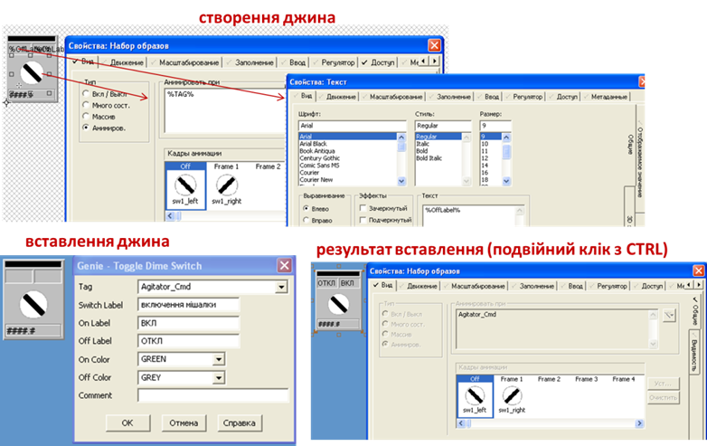</a> 

*Рис. 9.2* Приклад прив’язування в джині

Використання замінників дає можливість вставляти в елементі джина тільки частину імені тегу (напису). При використанні структурованих імен змінних це ще більше скорочує час розроблення. Так, на рис. 9.3 показано джин, в якому всі елементи прив’язані до змінних, частина імені яких означена замінником %TAG%. Таким чином, коли при вставленні джина замінник отримує значення "LOOP_1", він стає частиною імені змінних тегів "LOOP_1_PV" та "LOOP_1_SP".

<a href="media9/5_22.png" target="_blank">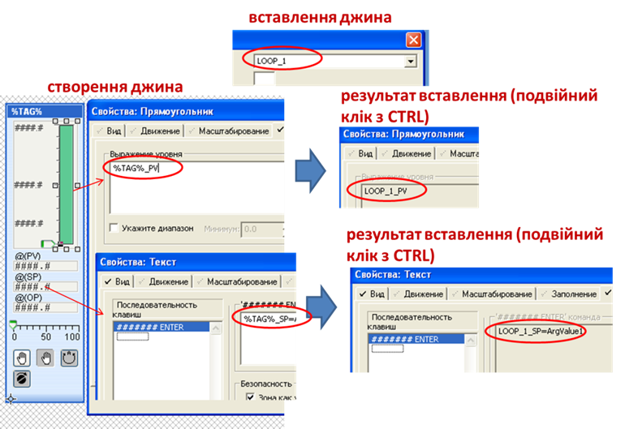</a> 

*Рис. 9.3* Приклад використання замінника як частини тегу 

Використання такого підходу зменшує кількість введення замінників. Джини створюються в редакторі графіки.

Спливаючі сторінки, аналогічно джинам, можуть містити вбудовану анімацію із замінниками, які під час виклику можна замінити на необхідні змінні. Такі замінники реалізуються з використанням ***асоціацій*** (association). Асоціації разом з типом беруться в символи знака питання:

```
?<Data Type> <Association>?
```

де `<Data Type>` – тип асоціації, може бути BCD, BYTE, LONGBCD, UINT або ULONG; якщо тип не вказується, Citect буде визначати його автоматично; `<Association>`– номер або ім’я асоціації.

Асоціації на сторінці можна прив’язати за замовченням у властивостях сторінки "Сопоставления". 

Сумісно із джинами можна використовувати спеціальні бібліотечні спливаючі сторінки, які призначені саме для виклику з джинів. Такі сторінки називаються ***суперджинами*** (Super Genies). Вони створюються в редакторі графіки. Для прив’язування суперджина до джина, при редагуванні джина необхідно вказати їх у меню "Правка->Присоединить суперджины". Спливаючі сторінки створюються як сторінки, їх не потрібно прив’язувати і вони можуть бути викликані з будь-якого елемента. У всьому іншому механізми роботи спливаючих вікон і суперджинів однакові.

Для прив’язування асоціацій сторінки до змінної можна використати функцію "Ass" перед її викликом. Для спрощення виклику можна скористатися Cicode функцією "AssWin".  

### Підходи в zenon

У SCADA zenon анімовані символи називаються також ***symbol***, хоч у російськомовному інтерфейсі вони називаються "значками". Символ створюється в бібліотеці проекту або копіюється туди з існуючого на дисплейній мнемосхемі. Таким чином, він нічим не відрізняється від звичайної групи анімованих об’єктів. Однак при вставленні екземпляра символу (рис. 9.4) можна встановити правило прив’язки, в якому вказується, яким чином будуть замінюватися назви прив’язаних змінних в анімації. У правилі прив’язування вказується вхідний пошуковий шаблон та замінник. Таким чином, усі тексти, що вказані в шаблоні як частина прив’язки, будуть замінені на замінники.  

<a href="media9/5_23.png" target="_blank">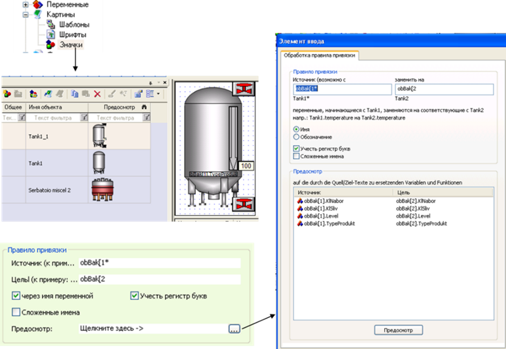</a> 

*Рис. 9.4* Приклад використання символу в zenon 

Аналогічно робиться із заміною прив’язок у дисплейних сторінках. При створенні функції відкриття екрану, редактор zenon запропонує сформувати правило прив’язування для заміни існуючих прив’язок. 

## 9.2. Можливості розширення палітри анімаційних компонентів

Більшість SCADA/HMI програм надають можливість не тільки розроблювати власні компоненти з існуючих елементів, а й впроваджувати графічні активні елементи, розроблені в інших редакторах. Вже класичною технологією, яка використовується для цього, є ActiveX. Треба зазначити, що, не дивлячись на велику кількість розроблених ActiveX-компонентів, сама технологія вже не рекомендується Microsoft (яка її й розробила) для розвитку, оскільки має ряд вад, зокрема:

- є небезпечною, оскільки розробник компоненту може розмістити шкідливий або нестабільний код;

- підтримується тільки Windows;

- підтримується не всіма браузерами, що ускладнює використання тих самих вікон для ВЕБ-доступу.

Альтернативою є використання технології WPF, яка розроблена Microsoft для заміни ActiveX. У майбутньому очікується повний перехід на HTML5, тому й компоненти вочевидь також будуть ґрунтуватися на сумісних технологіях. Тим не менше, поки що ActiveX має найбільш популярне використання в SCADA/HMI.

Розглянемо приклад, де в SCADA Citect потрібно забезпечити можливість вибору оператором необхідної дати в зручному графічному інтерфейсі, для подальшого її використання в перегляді історичних трендів. Для цього можна використати ActiveX елемент "Microsoft Date AND Time Picker Control". У Citect створюються три внутрішні змінні типу INT: SEL_DAY, SEL_MONTH, SEL_YEAR. Ці змінні плануються для використання в мові Cicode для визначення початкової дати перегляду трендів. У Graphics Builder на панелі Tools вибирається елемент ActiveX, після чого з’явиться список установлених на ПК елементів ActiveX. Необхідно вибрати елемент "Microsoft Date AND Time Picker Control" і, вибравши вкладку "Appearance", закладку "TagAssociation", у вікні "Propertiies" настроїти такі властивості (рис. 9.5):

- властивість Day, вибрати тег SEL_DAY, в полі "Update association on" вибрати "Change";

- властивість Month, вибрати тег SEL_MONTH, в полі "Update association on" вибрати "Change";

- властивість Date, вибрати тег SEL_DATE, в полі "Update association on" вибрати "Change".

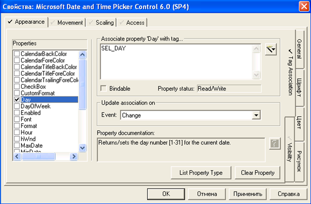                               

*Рис. 9.5.* Зовнішній вигляд вікна налаштування елемента ActiveX в SCADA Citect

На вкладці "TagAssociation" настроюється зв’язок властивостей ActiveX зі значеннями змінних. Запис значень властивостей у змінні проводиться в момент виникнення події, яка задається в полі "Update association on". Для відображення внутрішніх змінних на мнемосхемі виведемо 3 елементи Number, і в закладці "Display Value" прив’яжемо їх значення до змінних SEL_DAY, SEL_MONTH, SEL_YEAR. 

Результат роботи RunTime системи з елементом ActiveX "Microsoft Date AND Time Picker Control" показано на рис. 9.6.

 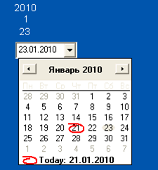

*Рис. 9.6.*Фрагмент мнемосхеми RunTime системи SCADA Citect з демонстрацією роботи ActiveX елемента

Як видно з даного прикладу, можна розширити функціональність графічного інтерфейсу за рахунок вставки сторонніх елементів, навіть не написавши код. Тим не менше це радше виняток, аніж правило, бо використання ActiveX нерідко потребує виклик методів та оброблення подій.  

## 9.3. Ієрархія дисплеїв та навігація 

### Ієрархія дисплеїв

Практично для всіх АСКТП кількість дисплеїв перевищує один. Тому при проектуванні та розробленні необхідно чітко визначитися з тим, які дисплеї будуть використовуватися для постійного перегляду і як відбуватиметься навігація по інших дисплеях. У стандарті ISA-101 рекомендується означити ієрархію дисплеїв, кожен рівень якого має певне призначення. Ця ієрархія потрібна для забезпечення надання оператору структурованого представлення всієї сфери їх відповідальності, забезпечуючи при цьому можливість перейти до більших рівнів деталізації та функціональності керування. Рекомендовано максимум чотири рівні ієрархії, причому рівень 1 має найширший обсяг, а рівень 4 – найбільшу деталізацію. Хоча ієрархічний характер рівнів відображати не обов'язково, він узгоджується з ієрархією навігації, яка може мати менше або більше рівнів. 

Дисплеї 1-го рівня використовуються для забезпечення огляду або зведення ключових параметрів, тривог, розрахованих показників проходження процесів та шляхів поширення збурень для всієї області контрольованої оператором на одному  робочому місці (рис. 9.7). У великих системах дисплеї 1-го рівня можуть показуватися на кількох моніторах, якщо їх необхідно бачити всі одночасно. Такі дисплеї мають найширший масштаб і найнижчий рівень деталізації процесу або системи. Дисплеї першого рівня можуть бути застосовані як інструмент спільного використання для забезпечення можливості обміну ключовою інформацією між операторами центрального та місцевих пунктів керування.

<a href="media9/5_28.png" target="_blank">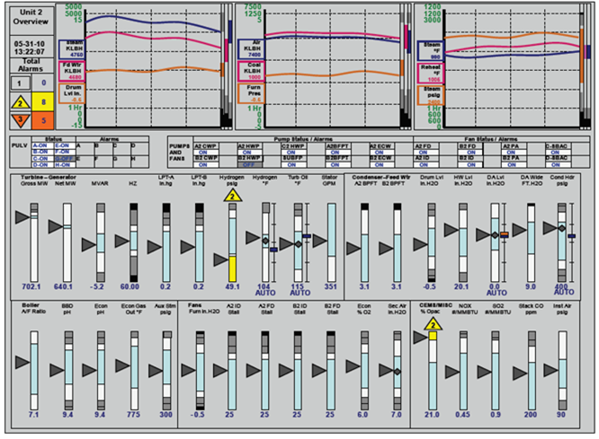</a>                              *Рис. 9.7.* Приклад дисплею 1-го рівня

Дисплеїв 1-го рівня розробляються з урахуванням таких міркувань.

1)   Для різних операційних режимів роботи установки слід розроблювати різні оглядові дисплеї. Наприклад, для неперервних процесів бажано розроблювати, окрім дисплеїв нормального режиму роботи, окремо дисплеї для процедур запуску та зупинки. 

2)   Повинні відображатися усі тривоги з найвищим пріоритетом, розташовані з урахуванням функціональних відносин (тобто прикріплених візуально до відповідного обладнання або пристрою).

3)   Повинні містити фактичні значення, аномальний статус і величину відхилення для ключових технологічних параметрів або розрахункових показників процесу, які відображають загальний стан частин технологічних процесів або сукупності обладнання (наприклад, печі, реактора або ректифікаційної колони). Якщо це можливо, рекомендується також забезпечити відображення величин відхилень, напрямів змін значень та/або тенденцій (наприклад трендів).

4)   Рекомендується розміщувати додаткову інформацію про пов'язані з ним об'єкти заводу, такими як допоміжне виробництво (постачання пари, електроенергії тощо) або суміжні відділення.

5)   Рекомендується відображати вбудовані тренди про важливі параметри.

6)   Дисплеї повинні орієнтувати оператора на існування, ступінь важливості, розміщення та напрямок зміни аномальних умов процесу.

7)   Дисплеї, як правило, не повинні використовуватися для виконання керуючих функцій (наприклад зміни уставки регулятора).

Дисплеї 2-го рівня по суті є дисплейними мнемосхемами верхнього рівня для конкретного технологічного процесу або групи обладнання (рис. 9.8). Зазвичай вони містять більше деталей, ніж відображає рівень 1. Дисплеї 2-го рівня мають бути основним робочим дисплеєм оператора під час звичайних операцій типових змін і моніторингу. Вони можуть включати огляди апаратів або первинні дисплеї для кожної великої системи (наприклад, апарат, керований конкретним оператором). Їх часто називають загальними оглядами (overview) системи та підсистеми. Дисплеї 2-го рівня забезпечують легку навігацію до деталей, представлених на рівнях 3 та 4. В той час як дисплеї першого рівня забезпечують безперервний огляд області контрольованої оператором, дисплеї 2-го рівня повинні мати можливість дозволити операторові виконувати зміну завдання за допомогою обмеженої кількості дисплеїв і мінімальної навігації.

<a href="media9/5_29.png" target="_blank">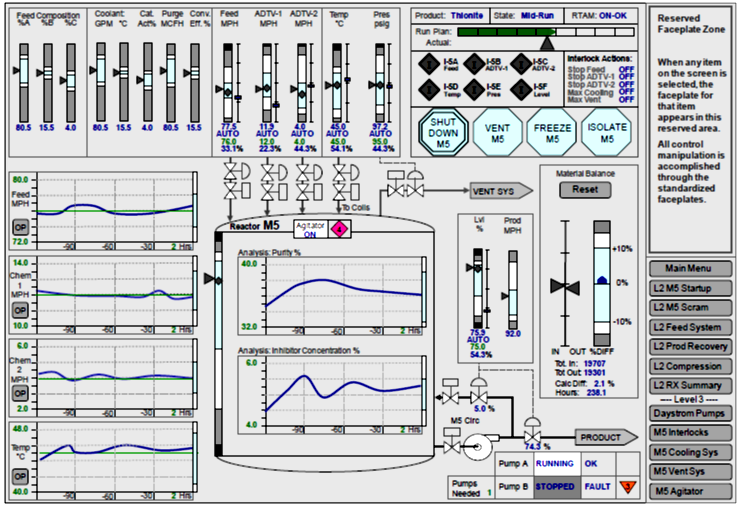</a> 

*Рис.9.8.* Приклад дисплею 2-го рівня

Дисплеї 2-го рівня розробляються з урахуванням таких міркувань.

1.   Дисплеї розроблюються як первинні дисплеї для загальних оглядів технологічних апаратів.

2.   Повинні відображати всі сигнали найвищого і середнього пріоритету для конкретної системи або підсистеми.

3.   Повинні надавати чіткі сигнали для навігації до непоказаних на дисплеї тривог з низьким пріоритетом.

4.   Повинні забезпечувати надання достатньої кількості інформації та засобів керування в основному інтерфейсі для керування системою для більшості умов.

5.   Повинні містити первинні засоби керування для конкретної області процесу.

6.   Повинні відображати задано-залежну інформацію для запуску та/або зупинки процесу.

Дисплеї 3-го рівня найкраще описуються як дисплеї відображення деталей системи або підсистеми. Вони, як правило, містять більше деталей, ніж дисплеї рівня 2. Дисплеї 3-го рівня повинні бути дисплеями, які оператор використовує для виконання нестандартних операцій, таких як керування виконавчими механізмами в ручному режимі, перемикання обладнання або інші рутинні завдання (рис. 9.9). Вони повинні надавати достатню інформацію для полегшення діагностики процесу і мають бути засновані на конкретних завданнях, що дає змогу операторові виконувати їх за допомогою обмеженої кількості дисплеїв і мінімальної навігації.

<a href="media9/5_30.png" target="_blank"></a> 

*Рис. 9.9.* Приклад дисплею 3-го рівня

Дисплеї 3-го рівня розробляються з урахуванням таких міркувань:

1.   Дисплеї містять контури керування та індикатори технологічного обладнання.

2.   Дисплеї відображають тривоги для всіх пріоритетів.

3.   Дисплеї відображають стан різних блокувань для відображеного обладнання.

Залежно від конкретного процесу, установки, проектування дисплея та загальної ієрархії відображення, ця інформація рівня 3 може бути об'єднана в представлення рівня 2 або 4.

Дисплеї 4-го рівня найкраще описуються як діагностичні (налагоджувальні) дисплеї. Через такий тип дисплеїв повинна бути доступна уся інформація про систему. Дисплеї 4-го рівня не призначені для використання в керуванні усім процесом або системою, однак може бути доступна функціональність для здійснення керування конкретною точкою. Дисплеї 4-го рівня можуть не потребувати повноекранного відображення, що дає змогу відображати системну інформацію на панелях або в спливаючому вікні (рис. 9.10).

- <a href="media9/5_31.png" target="_blank"></a> 

*Рис. 9.10*. Приклад дисплею 4-го рівня.

Дисплеї рівня 4 можуть, наприклад, використовуватися для:

- забезпечення експлуатаційних процедур для окремих частин обладнання;

- надання довідкової інформації для контролю та діагностики обладнання;

- відображення деталей безпечної зупинки;

- відображення інформації про блокування та дозволи.

### Навігація по дисплеях

Ефективна та інтуїтивна схема навігації безпосередньо впливає на швидкість втручання оператора в процес керування. Основними критеріями розроблення системи навігації є продуктивність, послідовність та інтуїтивність. Залежно від вимог користувача, для забезпечення робастного, швидкого та послідовного доступу до дисплеїв повинні бути передбачені кілька методів навігації. 

Методи навігації включають графічні символи на дисплеях, а також кнопки клавіатури, пункти меню, кнопки на панелі інструментів, дерева папок, вкладки та контекстні меню. Для внесення кількох змін в HMI на основі вибору оператором об'єктів або нового виклику дисплея також можуть використовуватися такі методи навігації, як захоплення. Захоплення може включати інші дисплеї, лицьові панелі, тренди та відповідні детальні дисплеї.

Для документування шляху між різними дисплеями може бути доцільним рисунок навігаційної мережі (рис. 9.11). Навігаційний рисунок повинен показувати шляхи переходів між дисплеями. 

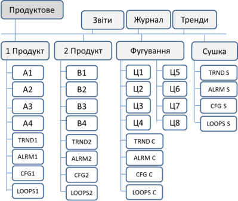 

*Рис. 9.11.* Приклад навігаційного рисунка в документації

Немає єдиного принципу побудови навігації, який підходить для всіх процесів. Він повинен відповідати функціональним вимогам HMI. У стандарті ISA-101 виділені наступні такі типи навігації.

1.   **Ієрархічна навігація**. Це найбільш часто використовуваний принцип, де інформація структурована відповідно фізичній організації процесу, вона використовує структуру дерева, в якій нижні гілки надають більш конкретну інформацію, пов'язану з верхніми гілками і хребтом. Ієрархічна структура може бути описана з точки зору глибини (кількість рівнів в ієрархії) і ширини (кількість варіантів на вузол). Коли використовується ієрархічна структура навігації, то часто кожен рівень дисплеїв відображає певний рівень ієрархії устатковання, відповідно до стандартів IEC 62264 (ISA-95) і IEC 61512 (ISA-88). Наприклад, найвищий рівень – завод, нижче – цех, далі – робочий центр або відділення, після чого – апарат або агрегат.

2.   **Реляційна навігація**. Реляційно-пов’язані дисплеї ґрунтуються на взаємозалежностях вузлів, які на них відображені. Так, можна будувати переходи по потоку речовини, або по енергетичних зв’язках (від виробника до споживача) тощо. Ця конструкція зазвичай містить навігаційні посилання з боку в бік.
3.   **Послідовнісна навігація**. Ця навігація ґрунтується на відображенні певного кроку послідовності процесу, наприклад, для рецептурних порційних (Batch) виробництв. При такому підході набір сторінок та їх зміст в ієрархії може змінюватися залежно від партії. Перехід між сторінками – це перехід між кроками технологічного процесу. 

При розробленні навігації необхідно розглянути такі керівні принципи:

- доступ до дисплея повинен проводитися з якомога меншою кількістю натискань клавіш (табл.9.1); 

- оператор не повинен вводити назву дисплея або тегу, який необхідно відобразити, хоча повинна бути надана підтримка для такого способу;

- символи дисплеїв, які є навігаційними підказками, повинні мати послідовне та чітке візуальне кодування;

- у HMI бажано підтримувати навігацію окремо для нормальних умов і нештатних ситуацій;

- організацію навігації бажано проводити з урахуванням послідовної деталізації змісту;

- за можливості реалізації бажано автоматично відкривати дисплеї, пов’язані з вибраною інформацією.  

*Таблиця 9.1.* 

**Приклад швидкодії навігації по сторінках різного призначення** 

| **Метрика**                                                  | **Тип дисплея**                                        | **Максимальний час/кількість  доступу** |
| ------------------------------------------------------------ | ------------------------------------------------------ | --------------------------------------- |
| Доступ до дисплеїв тривог                                    | Зведення тривог (активні тривоги)                      | 1 с                                     |
|                                                              | Списки тривог, наприклад список відтермінованих тривог | 5 с                                     |
| Кількість кліків для переходу: клік може бути будь-якою  взаємодією користувача, наприклад, клацанням миші, вибором кнопки, вибором  програмної клавіші тощо | Критичні дисплеї                                       | 1...2 кліки                             |
|                                                              | Некритичні дисплеї                                     | 3 кліки                                 |
|                                                              | Зведення тривог                                        | 1 клік                                  |
|                                                              | Системна діагностика                                   | 1…2 кліки                               |
| Зміни в системі                                              | Зміна оператора                                        | 5 с                                     |
|                                                              | Зміна мови                                             | 5 с                                     |

Методи навігації включають:

- вбудовані гіперпосилання;

- відображення символів з гіперпосиланнями;

- головне меню: відображається для всього дисплея; 

- контексте меню: відображається для обраного об’єкта дисплея;

- дерева;

- закладки;

- панелі інструментів;

- панелі приладів/панелі завдань;

- кнопки на дисплеях;

- кнопки користувацької клавіатури (функція та інші користувацькі кнопки);

- контекстні меню (наприклад, клацання правою кнопкою миші для розкривного меню);

- механізми для отримання детальної інформації;

- посилання на каталоги файлів;

- кнопки передачі дисплеїв;

- голосові команди;

- перетягування.

Велика частина перерахованих методів реалізуються в SCADA/HMI через стандартні механізми оброблення команд. Наприклад, при натисканні кнопки на дисплеї або комбінації на клавіатурі буде викликана функція відображення конкретного дисплея. Реалізація інших методів (наприклад, голосове керування) може потребувати використання сторонніх засобів, підключених через доступний інтерфейс SCADA/HMI. 

Деякі засоби SCADA/HMI надають вбудовані можливості побудови головних та контекстних меню. Головні меню постійно відображаються на екрані і передбачають навігацію та можливість виклику різноманітних команд, які повинні бути доступні на будь-якому дисплеї. Контекстні меню (відкриваються по правій кнопці миші над об’єктом) передбачають виклик команд залежно від об’єкта, для якого воно було викликане. Контекстне меню передбачає передачу контексту (наприклад, імені тегу) з об’єкта, для якого він був викликаний. Розглянемо приклади варіантів реалізації меню. 

### Реалізація меню в Citect

Citect SCADA підтримує навігацію через головні меню, зовнішній вигляд яких залежить від стилю, який використовується при створенні проекту. На рис. 9.12 показано приклад фрагмента вигляду та налаштування меню Citect, зробленого в стилі "Tab_Style". Меню має ієрархічний характер і задається таблицею, в якій вказані всі рівні до потрібного пункту. При налаштуванні для кожного рівня вказується напис, для пункту вказується команда, яка буде викликатися, символ (образ), який буде відображатися, і коментар, який буде висвічуватися при наведенні покажчика миші на пункт меню. Можна завдавати умови видимості та доступності меню та сторінки, на яких воно буде відображатися.   
<a href="media9/5_33.png" target="_blank">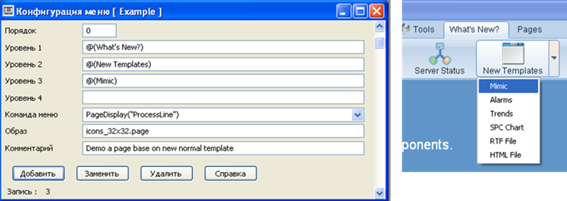</a> 

*Рис.* *9.12.* Вигляд головного меню Citect в стилі Tab_Style 

У стилі "SxW_Style" ієрархічне меню відображається у вигляді дерева (рис. 9.13), але налаштовується аналогічно. У стилі  "Situational Awareness" меню означує наповнення кнопок в області навігації екрана.

Контекстне меню в Citect реалізовується через виклик функції DspPopupMenu, яка призначена як для наповнення елементів меню, так і для оброблення виклику. Для передачі контексту функцію, яка формуватиме меню, можна викликати в джині. Права кнопка миші оброблюється в налаштуваннях клавіатурної команди елемента через команду RBUTTON_UP. 
<a href="media9/5_34.png" target="_blank">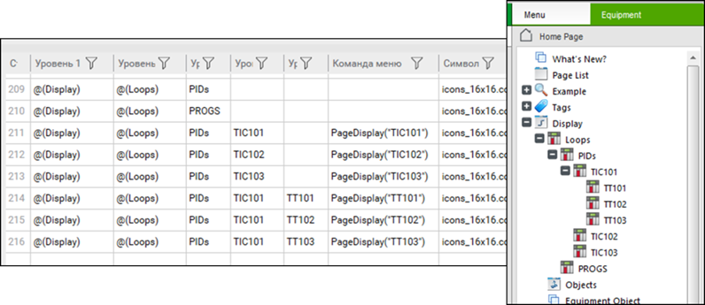</a> 

*Рис.* *9.13.* Вигляд головного меню Citect у стилі SxW_Style

### Реалізація меню в SCADA zenon

У SCADA zenon головні меню (їх може бути декілька) конфігуруються через відповідний розділ проекту. Редактор меню має інтуїтивно зрозумілий візуальний інтерфейс, пункти меню добавляються і видимі в тому місці, де будуть знаходитися в режимі виконання (рис. 9.14). Кожен пункт має властивості тексту, графічного файлу піктограми, видимості, активності, може бути підменю, може слугувати прапорцем (check mark). Для пункту вибирається тип дії (Action Type): функція, записування значення змінної, виклик довідки або без функції. Для кожного типу в налаштуваннях пункту є своя вкладка з налаштуваннями. Наприклад, для пункту "Hall1" (див. рис. 9.14) в налаштуваннях вказана функція swHall, яка викликає необхідний екран. Для іншого пункту в меню "Змінні", що має властивість "Action Type" рівною "Write Set Value", вказана дискретна змінна і дія переключення (Toggle).       
<a href="media9/5_35.png" target="_blank">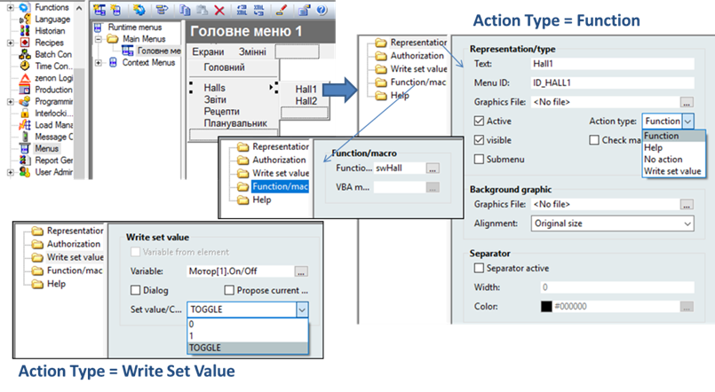</a> 

*Рис.* *9.14.* Налаштування головного меню в zenon

Для активації головних меню необхідно в налаштуваннях проекту виставити опцію "Main Menu Active". Показується необхідне меню через функцію "Show Menu", яку можна, наприклад, викликати при запуску середовища виконання, помістивши в скрипт AUTOSTART. 

У тому самому розділі, що й головні меню, налаштовуються і контекстні. Для контекстного меню кількість типів дії більша (рис. 9.15) – добавлені команди квітування і виклик макросу VBA. Вибране меню для елементу задається властивістю "Runtime" з групи "Context Menu". Таким чином для різних елементів можна визначати різні контекстні меню.  

<a href="media9/5_36.png" target="_blank">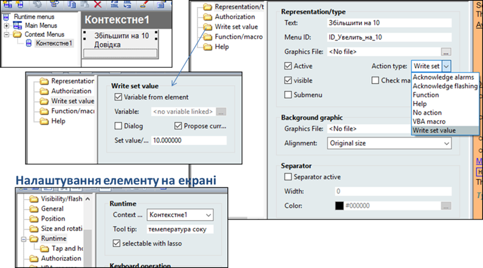</a> 

*Рис. 9.15.* Налаштування контекстного меню в zenon

Особливістю контекстного меню є можливість отримання контексту з елемента. Наприклад, на рис. 9.15 показано налаштування пункту контекстного меню "Збільшити на 10". У групі властивостей "Write set value" виставлений прапорець "Variable from element". Це значить, що змінна, яка має збільшуватися на 10, буде взята з властивостей "Variable" елемента, для якого меню було викликане. Це саме стосується і файлу допомоги. 

[<-- Лекція 8. Розроблення дисплеїв та анімованих елементів](lec8.md)

[--> Лекція 10. Загальні принципи розроблення підсистеми тривог та подій](lec10.md)

## Контрольні запитання 

1.    Розкажіть, у чому актуальність використання анімованих компонентів (символів) при розробленні SCADA/HMI. Що загрожує розробникові при відсутності таких компонентів в інструментах SCADA/HMI? 
2.    Покажіть на прикладі однієї з програм SCADA/HMI механізм використання анімованого компонента.
3.    Розкажіть про призначення та механізми роботи анімованих сторінок із заміною прив’язки. Покажіть їх на прикладі однієї з програм SCADA/HMI.
4.    Які можливості розширення палітри анімаційних компонентів можуть бути доступними в інструментальних засобах SCADA/HMI? Покажіть їх на прикладі використання однієї з програм SCADA/HMI.
5.    Навіщо потрібно означувати ієрархію дисплеїв?
6.    Яке призначення дисплеїв 1-го рівня відповідно до стандарту ISA-101? З яких міркувань їх розроблюють? 
7.    Яке призначення дисплеїв 2-го рівня відповідно до стандарту ISA-101? З яких міркувань їх розроблюють? 
8.    Яке призначення дисплеїв 3-го рівня відповідно до стандарту ISA-101? З яких міркувань їх розроблюють?
9.    Яке призначення дисплеїв 4-го рівня відповідно до стандарту ISA-101? З яких міркувань їх розроблюють? 
10.    Назвіть кілька методів навігації по дисплеях.
11.    Наведіть та охарактеризуйте типи навігації, що приводяться в стандарті ISA-101. 
12.    Якими принципами керуються при розробленні навігації?
13.    Перерахуйте методи навігації.
14.    Покажіть на прикладах SCADA/HMI реалізацію головних меню.
15.    У чому особливість контекстних меню? Покажіть на прикладах SCADA/HMI реалізацію контекстних меню.
16.    Назвіть основні причини, по яких не варто використовувати схеми автоматизації та технологічні схеми в якості сторінок верхнього рівня.

<iframe width="400" height="225" src="https://www.youtube.com/embed/EZKVLZ7c0gE" title="YouTube video player" frameborder="0" allow="accelerometer; autoplay; clipboard-write; encrypted-media; gyroscope; picture-in-picture" allowfullscreen></iframe>

<iframe src="https://www.slideshare.net/slideshow/embed_code/key/x5zOmzi1xc4dCr" width="597" height="486" frameborder="0" marginwidth="0" marginheight="0" scrolling="no" style="border:1px solid #CCC; border-width:1px; margin-bottom:5px; max-width: 100%;" allowfullscreen> </iframe> <div style="margin-bottom:5px"> <strong> <a href="https://www.slideshare.net/pupenasan/ss-239043211" title="Анімовані компоненти та навігація" target="_blank">Анімовані компоненти та навігація</a> </strong> from <strong><a href="https://www.slideshare.net/pupenasan" target="_blank">Пупена Александр</a></strong> </div>
